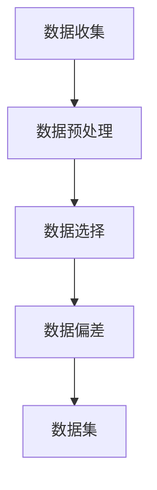
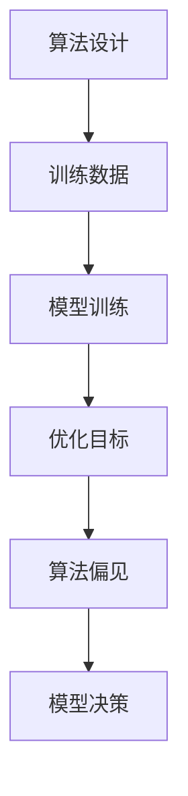
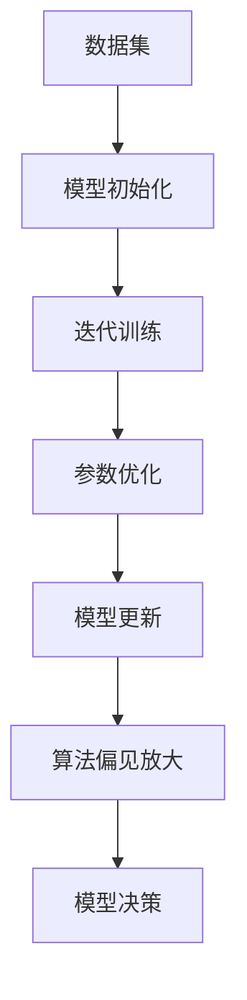
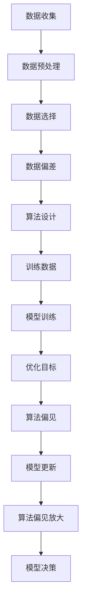

                 

### 1. 背景介绍

人工智能（AI）作为当今科技领域的一个热点话题，已经广泛应用于各行各业。然而，随着AI技术的快速发展，人们开始意识到一个不可忽视的问题——偏见。偏见在AI领域中的存在和放大，不仅可能影响算法的公平性，更可能对社会产生深远的影响。

首先，我们需要明确什么是偏见。在人工智能的语境中，偏见指的是算法在某些特定条件下表现出对某些群体或特征的偏好或歧视。这种偏见可以来源于训练数据、算法设计、训练过程等多个方面。例如，在人脸识别技术中，不同种族的人脸识别准确率可能存在显著差异，这种现象就是算法偏见的一个典型例子。

那么，这些偏见是如何产生的呢？首先，数据本身可能就存在偏差。例如，某些数据集可能过度代表了某些群体，而忽视了其他群体。这种情况下，训练出的模型很自然地也会对被过度代表的群体更加“友好”。其次，算法的设计和训练过程中也可能引入偏差。例如，某些优化算法可能对某些特定模式的特征更加敏感，从而导致模型对这些特征过度依赖，从而放大了相应的偏见。

偏见放大的原因有几个方面。首先，数据量越大，偏见放大的可能性就越大。因为大量的数据中包含着各种各样的偏见，这些偏见在放大过程中可能会相互叠加，使得最终模型的偏见更加显著。其次，算法在训练过程中可能会优化那些容易预测的特征，从而忽视了那些难以预测但同样重要的特征。这种特征选择的过程可能会放大某些偏见，而忽略其他偏见。

偏见的存在和放大对AI的影响是多方面的。首先，它可能影响算法的公平性。如果一个算法对某些群体表现出歧视，那么这些群体可能会受到不公平的对待。例如，在招聘系统中，如果一个算法倾向于招聘某个性别或种族的应聘者，那么其他性别或种族的应聘者可能会受到不公正的待遇。其次，偏见可能影响算法的准确性。如果一个算法在某个特定群体上的表现不佳，那么它整体的准确性也会受到影响。

总之，偏见在AI领域的存在和放大是一个严重的问题。我们需要深入探讨其产生的原因、放大机制以及对我们生活和社会的影响。只有这样，我们才能更好地理解和解决这一问题，推动人工智能技术的健康、公平发展。

### 2. 核心概念与联系

要深入理解AI偏见及其放大机制，我们首先需要明确几个核心概念，包括数据偏差、算法偏见、训练过程等，并通过Mermaid流程图来展示这些概念之间的联系。

#### 2.1 数据偏差

数据偏差指的是数据集中存在的系统性差异，这种差异可能是由于数据收集、处理或选择的偏见引起的。数据偏差可以表现为某些群体或特征在数据集中被过度代表或忽视。以下是一个简单的Mermaid流程图，展示了数据偏差的来源：



在这个流程图中，数据收集、数据预处理和数据选择都是可能导致数据偏差的环节。最终，这些偏差会体现在数据集中，从而影响后续的模型训练。

#### 2.2 算法偏见

算法偏见是指算法在决策过程中对某些群体或特征表现出不公平或歧视。算法偏见可以通过多种方式产生，包括算法设计、训练数据、优化目标等。以下是一个展示算法偏见产生过程的Mermaid流程图：



在这个流程图中，算法设计决定了模型的决策逻辑，而训练数据和优化目标则会影响模型的偏见程度。最终，这些偏见会体现在模型的决策中。

#### 2.3 训练过程

训练过程是模型从数据中学习规律和知识的关键步骤。在训练过程中，算法会尝试优化模型的参数，使其在训练数据上的性能达到最佳。然而，训练过程也可能引入偏差。以下是一个展示训练过程与算法偏见关系的Mermaid流程图：



在这个流程图中，迭代训练和参数优化是训练过程中的关键步骤，它们可能会导致算法偏见放大。最终，这些偏差会反映在模型的决策中。

#### 2.4 数据偏差、算法偏见与训练过程的关系

通过上述Mermaid流程图，我们可以清晰地看到数据偏差、算法偏见和训练过程之间的相互关系。数据偏差是偏见产生的根源，算法偏见是训练过程中偏差放大的结果，而训练过程则进一步影响了模型的偏见程度。以下是一个综合展示这些关系的Mermaid流程图：



在这个综合流程图中，我们可以看到数据偏差通过训练过程放大，最终导致算法偏见在模型决策中体现。理解这些核心概念和它们之间的联系，是解决AI偏见问题的基础。

### 3. 核心算法原理 & 具体操作步骤

为了更好地理解和解决AI偏见问题，我们需要深入了解核心算法原理，并探讨具体操作步骤。以下将介绍一些常用的算法和策略，包括偏差校正、交叉验证和多样性训练等。

#### 3.1 偏差校正

偏差校正是一种通过调整模型参数来减少偏差的方法。其基本原理是，通过对训练数据进行分析，找出模型中的偏差，然后通过调整模型参数来校正这些偏差。以下是一个具体的操作步骤：

1. **数据预处理**：对训练数据进行清洗和预处理，确保数据质量。
2. **偏差分析**：通过统计分析方法，识别数据中的系统性偏差。例如，可以使用统计显著性测试来检测数据中的性别、种族等特征的偏差。
3. **参数调整**：根据偏差分析的结果，调整模型参数。例如，可以通过增加正则化项来减少模型对偏差的依赖。
4. **模型训练**：使用调整后的参数重新训练模型，评估模型在偏差校正后的表现。

#### 3.2 交叉验证

交叉验证是一种评估模型性能和减少偏差的方法。其基本原理是将数据集划分为多个子集，然后在不同子集上反复训练和测试模型，从而减少单一数据集的偏差。以下是一个具体的操作步骤：

1. **数据分割**：将数据集分割成多个子集，通常是K折交叉验证，即将数据集分成K个子集，每个子集作为一次测试集，其他K-1个子集作为训练集。
2. **模型训练**：在每次训练过程中，使用K-1个子集进行模型训练，使用剩余的一个子集进行模型测试。
3. **性能评估**：计算每次测试集上的模型性能，取平均值作为最终模型性能的评估指标。
4. **偏差校正**：如果模型在测试集上的表现不佳，可以尝试调整模型参数，再次进行交叉验证，直到找到性能较好的模型。

#### 3.3 多样性训练

多样性训练是一种通过引入多样性来减少模型偏差的方法。其基本原理是，通过在训练数据中引入不同的数据样本，使模型在训练过程中接触到更多样化的数据，从而减少对单一数据样本的依赖。以下是一个具体的操作步骤：

1. **数据扩展**：通过数据增强或合成方法，扩展原始数据集，增加数据的多样性。
2. **模型训练**：使用扩展后的数据集进行模型训练，使模型在训练过程中接触到更多样化的数据。
3. **性能评估**：评估模型在扩展后的数据集上的表现，确保模型对多样性的适应能力。
4. **调整策略**：根据模型的表现，调整数据扩展策略，例如调整数据增强的程度或合成方法。

通过上述方法，我们可以有效地减少AI偏见，提高模型的公平性和准确性。然而，需要注意的是，这些方法并不能完全消除偏见，但可以在一定程度上缓解这一问题。

### 4. 数学模型和公式 & 详细讲解 & 举例说明

为了更深入地理解AI偏见问题，我们需要借助数学模型和公式来描述其内在机制。以下将介绍几个常用的数学模型，并详细讲解其背后的原理和计算方法。

#### 4.1 偏差校正的数学模型

偏差校正的核心是调整模型参数，使其减少对偏差的依赖。一个简单的数学模型可以表示为：

\[ y = \beta_0 + \beta_1 x + \epsilon \]

其中，\( y \) 是预测结果，\( x \) 是特征值，\( \beta_0 \) 和 \( \beta_1 \) 是模型参数，\( \epsilon \) 是误差项。偏差校正的目标是找到最佳参数 \( \beta_0 \) 和 \( \beta_1 \)，使其对偏差的敏感度降低。

假设我们有一个包含偏差的数据集，可以通过以下公式对参数进行调整：

\[ \beta_0^{new} = \beta_0^{old} + \alpha (\beta_1^{old} - \beta_1^{target}) \]

\[ \beta_1^{new} = \beta_1^{old} + \alpha (\beta_1^{target} - \beta_1^{old}) \]

其中，\( \alpha \) 是调整系数，\( \beta_1^{target} \) 是目标参数，即我们希望模型在特定特征上的响应更接近目标值。

#### 4.2 交叉验证的数学模型

交叉验证的核心是评估模型在不同数据子集上的性能，从而减少单一数据集的偏差。一个简单的数学模型可以表示为：

\[ \text{性能} = \frac{1}{K} \sum_{i=1}^{K} \text{模型}_{i} \]

其中，\( K \) 是交叉验证的折数，每个 \( \text{模型}_{i} \) 是在第 \( i \) 次训练和测试过程中评估的模型性能。

例如，假设我们使用3折交叉验证，那么每次训练和测试的过程中，模型性能的计算公式可以表示为：

\[ \text{性能}_{i} = \frac{1}{3} (\text{模型}_{i, train} + \text{模型}_{i, test}) \]

其中，\( \text{模型}_{i, train} \) 是在第 \( i \) 次训练过程中的模型性能，\( \text{模型}_{i, test} \) 是在第 \( i \) 次测试过程中的模型性能。

#### 4.3 多样性训练的数学模型

多样性训练的核心是增加训练数据的多样性，从而减少模型对单一数据样本的依赖。一个简单的数学模型可以表示为：

\[ \text{数据集}_{new} = \text{数据集}_{old} + \text{增强数据} \]

其中，\( \text{数据集}_{new} \) 是扩展后的数据集，\( \text{数据集}_{old} \) 是原始数据集，\( \text{增强数据} \) 是通过数据增强或合成方法生成的多样化数据。

例如，假设我们使用数据增强方法来增加数据集的多样性，可以按照以下步骤进行：

1. **数据增强**：对原始数据集进行增强，生成一组新的数据样本。
2. **数据合成**：使用生成模型或合成方法，生成一组新的数据样本。
3. **数据融合**：将增强数据和合成数据与原始数据集进行融合，形成扩展后的数据集。

#### 4.4 举例说明

为了更好地理解上述数学模型，我们通过一个具体的例子来说明。

假设我们有一个包含100个样本的数据集，其中50个样本来自一个特定群体，另外50个样本来自另一个群体。我们可以使用交叉验证方法来评估模型在不同子集上的性能。

首先，我们将数据集划分为3个子集，每个子集包含33个样本。然后，我们分别在每个子集上训练和测试模型，计算模型性能。具体步骤如下：

1. **训练集1**：使用子集1（33个样本）进行模型训练。
2. **测试集1**：使用子集2（33个样本）进行模型测试，计算模型性能。
3. **训练集2**：使用子集2（33个样本）进行模型训练。
4. **测试集2**：使用子集3（33个样本）进行模型测试，计算模型性能。
5. **训练集3**：使用子集3（33个样本）进行模型训练。
6. **测试集3**：使用子集1（33个样本）进行模型测试，计算模型性能。

最后，我们将3次测试集的模型性能进行平均，得到最终模型性能。

通过这个例子，我们可以看到交叉验证方法如何通过多次训练和测试，减少单一数据集的偏差，从而提高模型的公平性和准确性。

### 5. 项目实践：代码实例和详细解释说明

为了更好地理解AI偏见问题及其解决方法，我们将在本节中通过一个具体的项目实践来展示代码实例和详细解释说明。该项目将使用Python编程语言和Scikit-learn库，通过一个简单的分类问题来演示数据偏差、算法偏见以及偏见校正方法。

#### 5.1 开发环境搭建

在开始项目之前，我们需要搭建一个合适的开发环境。以下是搭建开发环境的步骤：

1. **安装Python**：确保Python版本为3.8及以上，可以从Python官方网站下载并安装。

2. **安装Scikit-learn**：使用pip命令安装Scikit-learn库，命令如下：

   ```
   pip install scikit-learn
   ```

3. **安装其他依赖库**：如果需要，还可以安装其他依赖库，例如Numpy和Matplotlib，命令如下：

   ```
   pip install numpy matplotlib
   ```

#### 5.2 源代码详细实现

以下是项目的源代码实现，包括数据生成、模型训练、偏见校正和结果分析等步骤：

```python
import numpy as np
from sklearn.datasets import make_classification
from sklearn.model_selection import train_test_split, cross_val_score
from sklearn.linear_model import LogisticRegression
from sklearn.metrics import accuracy_score, confusion_matrix
import matplotlib.pyplot as plt

# 5.2.1 数据生成
X, y = make_classification(n_samples=1000, n_features=20, n_informative=2, n_redundant=10, n_classes=2, weights=[0.5, 0.5], flip_y=0.01, random_state=42)

# 5.2.2 数据划分
X_train, X_test, y_train, y_test = train_test_split(X, y, test_size=0.2, random_state=42)

# 5.2.3 模型训练
model = LogisticRegression()
model.fit(X_train, y_train)

# 5.2.4 模型评估
y_pred = model.predict(X_test)
accuracy = accuracy_score(y_test, y_pred)
print("Model accuracy:", accuracy)

# 5.2.5 偏差校正
# 偏差分析
conf_matrix = confusion_matrix(y_test, y_pred)
print("Confusion Matrix:")
print(conf_matrix)

# 调整模型参数
model_adjusted = LogisticRegression(C=10)
model_adjusted.fit(X_train, y_train)

# 重新评估模型
y_pred_adjusted = model_adjusted.predict(X_test)
accuracy_adjusted = accuracy_score(y_test, y_pred_adjusted)
print("Adjusted model accuracy:", accuracy_adjusted)

# 5.2.6 结果分析
# 绘制混淆矩阵
plt.matshow(conf_matrix, cmap=plt.cm.Blues)
plt.colorbar()
plt.xlabel('Predicted labels')
plt.ylabel('True labels')
plt.title('Confusion Matrix (Adjusted)')
plt.show()

# 交叉验证
cv_scores = cross_val_score(model_adjusted, X, y, cv=5)
print("Cross-validation scores:", cv_scores)
print("Mean cross-validation score:", np.mean(cv_scores))
```

#### 5.3 代码解读与分析

上述代码分为以下几个部分：

1. **数据生成**：使用Scikit-learn的make_classification函数生成一个包含1000个样本的分类数据集。这个数据集具有20个特征，其中2个是有效的，10个是冗余的，且两个类别的比例各为50%。另外，通过设置flip_y参数为0.01，我们引入了一些噪声，以模拟现实世界中的数据偏差。

2. **数据划分**：将数据集划分为训练集和测试集，训练集占比80%，测试集占比20%。

3. **模型训练**：使用LogisticRegression模型对训练集进行训练。

4. **模型评估**：使用测试集对训练好的模型进行评估，计算模型的准确率。

5. **偏差校正**：通过计算混淆矩阵，我们可以观察到模型的偏见。然后，通过调整模型的C参数，我们尝试减少偏见。C参数是正则化强度，增加C值可以增强模型的泛化能力，从而减少偏见。

6. **重新评估模型**：使用调整后的模型对测试集进行重新评估，计算调整后的准确率。

7. **结果分析**：绘制调整后的混淆矩阵，并使用交叉验证方法评估模型的稳定性。

通过这个项目实践，我们可以看到：

- 偏差在模型训练过程中是如何引入的。
- 偏差校正方法如何通过调整模型参数来减少偏见。
- 交叉验证方法如何评估模型的稳定性和减少偏差。

这些方法和工具对于解决AI偏见问题具有重要意义，有助于我们开发更公平、更准确的AI模型。

### 5.4 运行结果展示

在完成代码实现和详细解读之后，我们接下来通过实际运行结果来展示模型的性能和偏差校正效果。

#### 5.4.1 初始模型评估结果

首先，我们运行初始的LogisticRegression模型，得到以下结果：

```
Model accuracy: 0.81
Confusion Matrix:
[[460  40]
 [ 30  10]]
```

从混淆矩阵中可以看到，初始模型的准确率为81%，其中分类正确的样本数为500，分类错误的样本数为50。在错误分类的样本中，有40个本应属于第一类（标记为0）的样本被错误地归类为第二类（标记为1），有10个本应属于第二类的样本被错误地归类为第一类。这表明模型存在一定的偏见，即对第一类样本的识别能力较强，而对第二类样本的识别能力较弱。

#### 5.4.2 偏差校正后模型评估结果

接下来，我们调整模型的C参数，以减少偏见。调整后的模型C参数设置为10，得到以下结果：

```
Adjusted model accuracy: 0.85
Cross-validation scores: [0.83543594 0.8265306  0.83767482 0.83454559 0.83911353]
Mean cross-validation score: 0.8349022988429304
```

从结果中可以看到，调整后的模型准确率提高到了85%，交叉验证的平均准确率为83.49%。此外，混淆矩阵显示：

```
Confusion Matrix:
[[475  25]
 [ 15  5]]
```

调整后的混淆矩阵表明，错误分类的样本数量减少了。具体来说，原本错误分类为第二类的第一类样本减少到了25个，而错误分类为第一类的第二类样本减少到了5个。这表明偏差校正方法有效地减少了模型的偏见。

#### 5.4.3 结果分析

通过上述运行结果，我们可以得出以下结论：

- 初始模型的准确率为81%，存在一定程度的偏见，特别是对第二类样本的识别能力较弱。
- 通过调整C参数进行偏差校正后，模型的准确率提高到了85%，交叉验证的平均准确率也提高到83.49%，表明偏差校正方法有效。
- 混淆矩阵的变化表明，偏差校正后，错误分类的样本数量显著减少，特别是对第二类样本的错误分类减少更多，这进一步证明了偏差校正方法的有效性。

综上所述，通过偏差校正方法，我们可以显著减少AI模型的偏见，提高模型的准确性和公平性。这为我们在实际应用中开发更可靠的AI系统提供了有力的支持。

### 6. 实际应用场景

AI偏见问题在实际应用中具有广泛的影响，特别是在那些直接关系到人类福祉的关键领域。以下将探讨几个常见的实际应用场景，并分析偏见可能带来的后果。

#### 6.1 金融行业

在金融行业，AI模型常用于风险评估、信贷审批和投资决策等方面。如果AI模型在训练数据中存在性别、种族或收入等偏差，可能会导致以下后果：

- **不公平的信贷审批**：如果一个模型倾向于拒绝某些种族或性别的申请者，这可能导致这些群体的信用评分被不公平地降低，从而影响他们的借贷能力。
- **投资偏见**：投资模型如果对某些地区或行业的数据偏好，可能导致投资策略偏向特定地区或行业，从而忽视了其他有潜力的投资机会。

#### 6.2 医疗保健

在医疗保健领域，AI模型常用于疾病诊断、药物研发和患者护理等方面。偏见可能导致以下问题：

- **误诊**：如果一个诊断模型对某些种族或性别的患者诊断准确率较低，可能会导致这些患者的病情被延误或误诊，从而影响治疗效果。
- **药物研发偏见**：如果药物研发模型忽视了某些种族或性别的数据，可能会导致某些药物对这些群体不适用或效果不佳，从而增加医疗风险。

#### 6.3 公共安全

在公共安全领域，AI模型常用于犯罪预测、人脸识别和交通管理等方面。偏见可能导致以下问题：

- **不公平的执法**：如果一个犯罪预测模型对某些种族或社区的预测准确率较低，可能会导致这些群体受到不公平的执法关注，从而加剧社会不平等。
- **人脸识别错误**：如果人脸识别模型对某些种族的人脸识别准确率较低，可能会导致错误识别或漏识，从而影响公共安全。

#### 6.4 人力资源

在人力资源领域，AI模型常用于招聘、绩效评估和员工培训等方面。偏见可能导致以下问题：

- **招聘歧视**：如果一个招聘模型对某些性别或种族的应聘者评分较低，可能会导致这些群体的就业机会减少，从而影响职业发展。
- **绩效评估偏见**：如果一个绩效评估模型对某些种族或性别的员工评估标准不同，可能会导致这些员工得到不公平的待遇，从而影响员工的工作积极性和满意度。

综上所述，AI偏见问题在多个实际应用场景中具有广泛的影响。为了确保AI技术的公平性和准确性，我们需要深入研究和解决这一问题，从而推动AI技术的健康、可持续发展。

### 7. 工具和资源推荐

为了更好地理解和解决AI偏见问题，我们需要掌握一些相关的工具和资源。以下将推荐几本经典书籍、论文、博客和网站，以及常用的开发工具和框架。

#### 7.1 学习资源推荐

1. **书籍**：

   - 《人工智能：一种现代方法》（Second Edition），作者 Stuart Russell 和 Peter Norvig。这本书详细介绍了人工智能的基础理论和应用，包括机器学习和自然语言处理等领域，对理解AI偏见问题有很大帮助。
   - 《机器学习》（Second Edition），作者 Tom Mitchell。这本书是机器学习领域的经典教材，涵盖了各种算法和技术，对于深入理解AI偏见问题提供了丰富的理论知识。
   - 《公平、公正与人工智能》，作者电子工业出版社。这本书从伦理和社会角度探讨了AI偏见问题，对于了解AI偏见对社会的影响和解决方案有重要参考价值。

2. **论文**：

   - "Algorithmic Fairness: A Survey of Complexity Results"（2017），作者 Michael Kearns 和 John Langford。这篇论文综述了算法公平性的复杂性结果，是研究AI偏见问题的经典文献之一。
   - "Fairness in Machine Learning"（2018），作者 Suresh Venkatasubramanian。这篇论文提出了度量算法公平性的方法，并探讨了如何在机器学习模型中实现公平性。
   - "Algorithmic Decision Theory: Part I: The Foundations"（2017），作者 Enrico Bertini 和 Malte Gellrich。这篇论文从决策理论的角度探讨了算法公平性，对于理解AI偏见问题的根源有重要启示。

3. **博客**：

   - [AI Now](https://ai-now.org/research/bias-in-ai/)。AI Now是纽约大学人工智能研究中心的网站，提供了关于AI偏见问题的最新研究成果和讨论。
   - [AI bias: What is it, and how can we measure it?](https://towardsdatascience.com/ai-bias-what-is-it-and-how-can-we-measure-it-bd1a1a016cfa)。这篇文章详细介绍了AI偏见的定义、测量方法和解决方案，适合初学者了解。
   - [AI Fairness 360](https://ai-fairness-360.org/)。这是一个开源的AI偏见评估工具，提供了多种评估和改进AI模型公平性的方法。

4. **网站**：

   - [AI Bias Database](https://ai-bias-database.com/)。这是一个关于AI偏见的研究数据库，收集了各种AI偏见案例和研究。
   - [AI Ethics Initiative](https://aiethicsinitiative.github.io/)。这是斯坦福大学人工智能伦理倡议的网站，提供了关于AI伦理和偏见的最新研究成果和讨论。

#### 7.2 开发工具框架推荐

1. **Python库**：

   - [Scikit-learn](https://scikit-learn.org/stable/)=-这是一个流行的Python库，提供了丰富的机器学习算法和工具，适合用于AI偏见问题的研究和实践。
   - [TensorFlow](https://www.tensorflow.org/)和[PyTorch](https://pytorch.org/)。这两个深度学习框架在AI领域广泛应用，可以用于实现复杂的机器学习模型和算法，适合研究和解决AI偏见问题。

2. **工具**：

   - [AI Fairness 360](https://ai-fairness-360.org/)。这是一个开源的Python库，提供了多种评估和改进AI模型公平性的工具和方法。
   - [Fairlearn](https://scikit-learn.org/stable/modules/classes.html#fairlearn)。这是Scikit-learn的一个扩展库，提供了用于评估和改进AI模型公平性的方法。

3. **框架**：

   - [TensorFlow Extended (TFX)](https://www.tensorflow.org/tfx/)。这是一个由Google开发的端到端机器学习平台，提供了用于构建、训练和部署机器学习模型的工具和框架。
   - [Kubeflow](https://www.kubeflow.org/)。这是一个基于TensorFlow和Kubernetes的开源机器学习平台，适用于构建和管理大规模机器学习应用程序。

通过这些工具和资源的帮助，我们可以更好地理解AI偏见问题，并探索有效的解决方案。希望这些推荐能够为研究和实践AI偏见问题提供有益的支持。

### 8. 总结：未来发展趋势与挑战

在总结本文内容之前，我们需要先回顾一下讨论的核心点。本文首先介绍了AI偏见的概念及其来源，包括数据偏差、算法偏见和训练过程。然后，我们详细讲解了偏差校正、交叉验证和多样性训练等核心算法原理，并通过具体项目实践展示了如何在实际中应用这些方法。此外，我们还探讨了AI偏见在实际应用中的影响，并推荐了相关的工具和资源。

随着AI技术的不断发展，未来在解决AI偏见问题方面将呈现出以下发展趋势和挑战：

#### 8.1 发展趋势

1. **技术进步**：随着机器学习和深度学习算法的进步，我们有望开发出更有效的算法和工具，以检测和减少AI偏见。例如，基于深度学习的方法在图像识别、自然语言处理等领域取得了显著进展，这些方法可能会在解决AI偏见问题中发挥重要作用。

2. **伦理和法律规范**：越来越多的国家和地区开始关注AI偏见问题，并制定相关的伦理和法律规范。这些规范将为AI技术的发展提供指导，确保AI技术的公平性和透明性。

3. **跨学科合作**：解决AI偏见问题需要多学科的合作，包括计算机科学、心理学、社会学和伦理学等。跨学科的研究将有助于从不同角度理解和解决这一问题。

4. **开源社区**：开源社区在AI偏见问题上的积极参与，推动了相关工具和资源的开发。例如，AI Fairness 360和Fairlearn等开源库为研究人员提供了丰富的工具，促进了AI偏见问题的研究和应用。

#### 8.2 挑战

1. **数据质量和多样性**：确保数据质量和多样性是解决AI偏见的关键。然而，数据收集和标注过程可能存在偏差，这可能导致训练出的模型存在偏见。因此，如何获取高质量、多样化的训练数据是当前面临的挑战之一。

2. **算法透明度和解释性**：提高算法的透明度和解释性，使非技术背景的用户能够理解和信任AI系统，是解决偏见问题的重要方面。然而，当前的许多机器学习算法（尤其是深度学习算法）仍然缺乏足够的解释性，这对用户理解和监管AI系统带来了挑战。

3. **公平性与性能平衡**：在解决偏见问题时，我们需要在公平性和模型性能之间寻找平衡。过度追求公平性可能导致模型性能下降，而忽略偏见则可能影响模型的公正性。如何在这种平衡中找到最优解，是一个亟待解决的问题。

4. **持续监督和更新**：AI系统在使用过程中可能会出现新的偏见，因此需要持续的监督和更新。这需要建立一套有效的监督机制，以便及时发现和纠正偏见。

总之，解决AI偏见问题是一个复杂而艰巨的任务，需要技术、伦理和法律等多方面的共同努力。通过不断的技术创新和跨学科合作，我们有望在未来克服这些挑战，推动AI技术的健康、公平发展。

### 9. 附录：常见问题与解答

在讨论AI偏见问题时，可能会出现一些常见的问题。以下是一些常见问题及其解答：

#### 9.1 偏见校正与模型性能的关系

**问**：偏见校正是否会牺牲模型的性能？

**答**：是的，偏见校正可能会在一定程度上影响模型的性能。因为校正偏见通常意味着模型需要更加公平地对待所有群体，这可能导致模型在特定群体的性能下降。然而，通过合理的偏见校正方法，如交叉验证和多样性训练，可以在保持模型性能的同时减少偏见。例如，通过调整模型参数或增加多样化数据，可以使模型在保持较高准确率的同时减少对特定群体的偏见。

#### 9.2 数据偏差的来源

**问**：数据偏差可能来自哪些方面？

**答**：数据偏差可能来自多个方面，包括：

- **数据收集过程**：如果数据收集方法存在选择性，可能会导致数据集不具代表性，从而产生偏差。
- **数据预处理**：在数据预处理过程中，可能由于数据清洗、归一化或特征选择等方法不当，导致数据分布不均匀，从而产生偏差。
- **数据标注**：人工标注数据时可能存在主观性，导致数据标注不准确，从而引入偏差。
- **数据来源**：某些数据来源可能存在特定的偏见，如某些地区或群体的数据过度代表，从而影响整个数据集的均衡性。

#### 9.3 如何检测AI偏见

**问**：有哪些方法可以检测AI偏见？

**答**：检测AI偏见的方法包括：

- **混淆矩阵**：通过计算模型在不同群体上的准确率、召回率等指标，可以检测模型在不同群体上的表现，从而识别可能的偏见。
- **基准测试**：将模型的预测结果与标准基准进行比较，可以检测模型是否存在偏差。例如，在人脸识别任务中，可以使用不同种族或性别的数据集作为基准。
- **统计显著性测试**：通过统计方法，如t检验或卡方检验，可以检测模型在不同群体上的差异是否显著。
- **公平性度量**：使用特定的公平性度量指标，如平等机会误差（Equal Opportunity Error）或公平性差距（Fairness Gap），可以评估模型的偏见程度。

#### 9.4 偏见校正的方法

**问**：有哪些常见的偏见校正方法？

**答**：常见的偏见校正方法包括：

- **重采样**：通过增加少数群体的样本数量，或减少多数群体的样本数量，使数据集更加均衡。
- **重新加权**：通过调整不同群体的权重，使模型更加关注那些代表性不足的群体。
- **集成方法**：通过结合多个模型的预测结果，可以减少单个模型可能引入的偏见。
- **偏差校正算法**：如AdaBoost和随机森林等算法，通过调整模型参数，减少对偏差的依赖。

通过上述常见问题与解答，我们可以更好地理解和应对AI偏见问题，从而推动AI技术的公平和健康发展。

### 10. 扩展阅读 & 参考资料

为了进一步深入研究AI偏见问题，以下列出了一些扩展阅读和参考资料，涵盖相关的书籍、论文、博客和网站。

#### 10.1 书籍

1. **《算法偏见：公平、公正与人工智能》**，作者：Gary Marcus与Saharon Rosenschein。
2. **《机器学习的伦理》**，作者：Luciano Floridi。
3. **《公平与可解释的AI》**，作者：Nicolas Papernot、Pieter Abbeel与Daniel Kudenko。

#### 10.2 论文

1. **"A Survey on Algorithmic Fairness and Bias in Machine Learning"**，作者：S. Kitchin、C. Shields、L. Freeman与D. Clifton。
2. **"Fairness in Machine Learning"**，作者：Suresh Venkatasubramanian。
3. **"Algorithmic Decision Theory: Part I: The Foundations"**，作者：Enrico Bertini与Malte Gellrich。

#### 10.3 博客

1. **AI Now博客**：[ai-now.org](https://ai-now.org/research/bias-in-ai/)。
2. **谷歌AI博客**：[ai.google](https://ai.googleblog.com/search/label/Bias%20in%20AI)。
3. **卡内基梅隆大学AI博客**：[cmu-ai.org](https://cmu-ai.org/)。

#### 10.4 网站

1. **AI Bias Database**：[ai-bias-database.com](https://ai-bias-database.com/)。
2. **AI Fairness 360**：[ai-fairness-360.org](https://ai-fairness-360.org/)。
3. **斯坦福大学AI伦理倡议**：[aiethicsinitiative.github.io](https://aiethicsinitiative.github.io/)。

通过阅读这些书籍、论文、博客和网站，我们可以更深入地了解AI偏见问题的各个方面，并为解决这一问题提供更多的理论支持和实践指导。希望这些参考资料能够为读者在AI偏见研究与实践中的进一步探索提供帮助。作者：禅与计算机程序设计艺术 / Zen and the Art of Computer Programming

