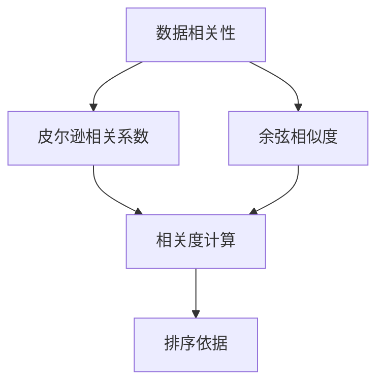
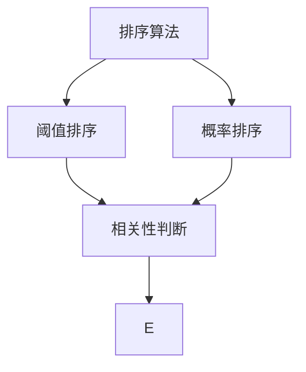
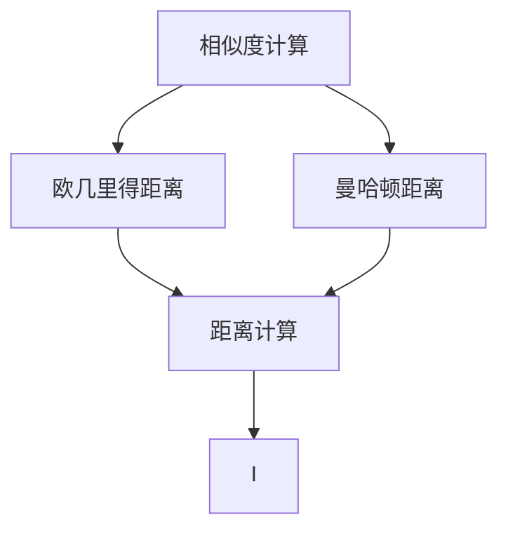
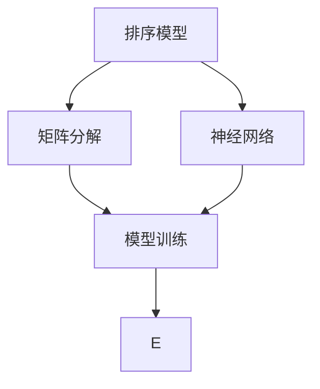
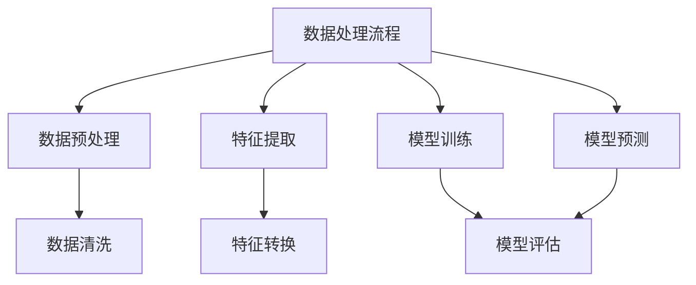

                 

### 背景介绍

人工智能（AI）技术在近年来取得了显著的进展，尤其是在机器学习、深度学习等领域。随着计算能力的提升和大数据的普及，AI 开始广泛应用于各种实际场景，如自然语言处理、图像识别、推荐系统等。在这些应用中，如何对大量数据进行高效、准确的排序成为一个关键问题。为了解决这一问题，AI 领域引入了一系列相关性排序技术，本文将详细介绍这些技术的应用案例。

首先，让我们回顾一下传统的排序算法。传统的排序算法如快速排序、归并排序等，主要依据数据的大小进行排序。然而，随着数据的多样性和复杂性增加，单纯依靠数据大小进行排序已经无法满足需求。AI 相关性排序技术应运而生，它们通过分析数据之间的相关性，对数据进行更为智能的排序。这些技术广泛应用于推荐系统、搜索引擎、社交网络等领域。

在推荐系统中，相关性排序技术可以帮助平台推荐用户可能感兴趣的内容。例如，电子商务平台通过分析用户的购买记录、浏览历史等数据，利用相关性排序技术为用户推荐相关的商品。这种推荐系统能够显著提高用户的购物体验，增加平台的销售额。

在搜索引擎中，相关性排序技术同样发挥着重要作用。搜索引擎需要根据用户输入的查询关键词，从海量的网页中检索出最相关的结果。传统的排序算法往往基于网页的访问量、更新时间等指标，而 AI 相关性排序技术可以更准确地识别用户的需求，提高搜索结果的准确性和用户体验。

社交网络平台也广泛应用了相关性排序技术。例如，社交媒体平台通过分析用户之间的互动关系、兴趣爱好等，利用相关性排序技术为用户推荐关注的人、可能感兴趣的内容等。这种排序技术有助于用户发现新的朋友、拓展社交圈子，同时也提高了平台的用户活跃度。

本文将深入探讨 AI 相关性排序技术的核心概念、算法原理、数学模型及其在具体项目中的实践应用。通过本文的阅读，读者将能够理解这些技术的原理和应用，为在实际项目中运用相关性排序技术提供有益的参考。

### 核心概念与联系

为了深入理解 AI 相关性排序技术的核心概念和架构，我们首先需要了解一些基本概念，并使用 Mermaid 流程图来展示这些概念之间的联系。下面将逐步介绍这些概念，并给出对应的 Mermaid 流程图。

#### 1. 数据相关性

数据相关性是指数据之间存在的关联程度。在 AI 相关性排序中，数据相关性是排序的核心依据。数据相关性可以通过多种方式衡量，如皮尔逊相关系数、余弦相似度等。

**Mermaid 流程图：**



#### 2. 排序算法

排序算法是实现对数据进行排序的一系列规则和方法。在相关性排序中，常见的排序算法有基于阈值的排序算法、基于概率的排序算法等。

**Mermaid 流程图：**



#### 3. 相似度计算

相似度计算是评估数据之间相似程度的过程。相似度计算方法包括欧几里得距离、曼哈顿距离等。

**Mermaid 流程图：**



#### 4. 排序模型

排序模型是利用机器学习技术建立的数据排序模型。常见的排序模型有基于矩阵分解的排序模型、基于神经网络的排序模型等。

**Mermaid 流程图：**



#### 5. 数据处理流程

数据处理流程是数据从输入到输出的一系列处理步骤。数据处理流程通常包括数据预处理、特征提取、模型训练和模型预测等环节。

**Mermaid 流程图：**



通过上述 Mermaid 流程图，我们可以清晰地看到 AI 相关性排序技术中各个核心概念和它们之间的联系。这些概念共同构成了一个完整的相关性排序框架，为 AI 技术在排序领域中的应用提供了坚实的基础。在接下来的部分中，我们将进一步深入探讨这些概念的具体原理和实现方法。

### 核心算法原理 & 具体操作步骤

#### 1. 算法原理概述

AI 相关性排序技术基于对数据之间相关性的分析，通过多种算法实现对数据的智能排序。以下是几种常见的相关性排序算法及其原理：

**1.1 基于阈值的排序算法**

基于阈值的排序算法通过设定一个阈值，将数据分为相关和不相关两组，然后根据相关性对两组数据分别进行排序。该算法简单高效，适用于数据量较小且相关性较为明显的场景。

**1.2 基于概率的排序算法**

基于概率的排序算法利用贝叶斯理论，通过计算数据之间的概率关系来进行排序。该算法适用于数据量较大且存在不确定性因素的场景，能够提高排序的准确性和鲁棒性。

**1.3 基于矩阵分解的排序算法**

基于矩阵分解的排序算法通过矩阵分解技术，将原始数据矩阵分解为用户行为矩阵和物品特征矩阵，然后根据矩阵元素的相关性进行排序。该算法适用于推荐系统和搜索引擎等领域，能够处理高维数据，提高排序的效率和准确性。

**1.4 基于神经网络的排序算法**

基于神经网络的排序算法利用神经网络模型对数据进行特征提取和关系建模，然后通过反向传播算法优化模型参数，实现对数据的排序。该算法适用于复杂场景，能够处理非线性关系，提高排序的准确性。

#### 2. 算法具体操作步骤

**2.1 数据预处理**

在开始排序之前，需要对数据进行预处理。预处理步骤包括数据清洗、数据转换和数据归一化等。数据清洗旨在去除噪声和异常值，数据转换将不同类型的数据转换为统一的格式，数据归一化则将数据缩放到一个合适的范围，以便于后续计算。

**2.2 相似度计算**

相似度计算是相关性排序的核心步骤。根据不同的算法，可以采用不同的相似度计算方法。例如，基于阈值的排序算法可以使用欧几里得距离或曼哈顿距离，基于概率的排序算法可以使用皮尔逊相关系数或余弦相似度，基于矩阵分解的排序算法可以使用矩阵乘法计算相关性。

**2.3 排序依据设定**

根据相似度计算结果，设定排序依据。对于基于阈值的排序算法，可以根据相似度阈值将数据分为相关和不相关两组；对于基于概率的排序算法，可以根据相似度概率值对数据进行排序；对于基于矩阵分解的排序算法，可以根据矩阵元素的相关性对数据排序。

**2.4 排序实现**

根据设定的排序依据，使用排序算法对数据进行排序。在排序过程中，可以采用快速排序、归并排序等常用排序算法，也可以根据具体需求设计定制化的排序算法。

**2.5 模型训练与优化**

对于基于神经网络的排序算法，需要通过模型训练和优化来提高排序准确性。模型训练包括数据预处理、特征提取、关系建模和参数优化等步骤。训练过程中，可以使用反向传播算法来调整模型参数，使模型能够更好地拟合数据。

#### 3. 实例分析

以下是一个基于矩阵分解的相关性排序算法实例，用于对用户行为数据集进行排序。

**3.1 数据集描述**

假设我们有一个用户行为数据集，包含用户对物品的评分数据。数据集如下：

```
用户 ID | 物品 ID | 评分
-------|--------|-----
1      | 101    | 4
1      | 102    | 5
2      | 101    | 2
2      | 103    | 4
```

**3.2 矩阵分解**

将用户行为数据集表示为用户行为矩阵 \(R\)，其中 \(R_{ij}\) 表示用户 \(i\) 对物品 \(j\) 的评分。然后，使用矩阵分解技术将 \(R\) 分解为用户行为矩阵 \(U\) 和物品特征矩阵 \(V\)。

```
R = U * V
```

**3.3 相似度计算**

计算用户行为矩阵 \(U\) 和物品特征矩阵 \(V\) 的相关性，即矩阵元素之间的乘积。

```
相似度 = U * V
```

**3.4 排序依据设定**

根据相似度计算结果，将相似度值设置为排序依据。

```
相似度阈值 = max(相似度)
```

**3.5 排序实现**

使用快速排序算法，根据相似度阈值对数据集进行排序。

```
数据集 = quicksort(数据集, 相似度阈值)
```

**3.6 模型训练与优化**

使用反向传播算法，对用户行为矩阵 \(U\) 和物品特征矩阵 \(V\) 进行优化，以提高排序准确性。

```
U = U - learning_rate * (dU/dR)
V = V - learning_rate * (dV/dR)
```

通过以上步骤，我们完成了基于矩阵分解的相关性排序算法实例。在实际应用中，可以根据具体需求和数据特点选择合适的算法和优化方法，以提高排序效果。

### 数学模型和公式 & 详细讲解 & 举例说明

在 AI 相关性排序技术中，数学模型和公式起着至关重要的作用。这些模型和公式不仅帮助理解数据之间的相关性，还为算法的实现提供了理论依据。下面，我们将详细介绍几个关键的数学模型和公式，并通过具体的例子进行说明。

#### 1. 皮尔逊相关系数

皮尔逊相关系数（Pearson Correlation Coefficient）是衡量两个变量线性相关性的常用方法。其公式如下：

$$
\rho(X, Y) = \frac{\sum_{i=1}^{n}(X_i - \bar{X})(Y_i - \bar{Y})}{\sqrt{\sum_{i=1}^{n}(X_i - \bar{X})^2} \sqrt{\sum_{i=1}^{n}(Y_i - \bar{Y})^2}}
$$

其中，\(X_i\) 和 \(Y_i\) 分别是第 \(i\) 个数据点的取值，\(\bar{X}\) 和 \(\bar{Y}\) 分别是 \(X\) 和 \(Y\) 的平均值，\(n\) 是数据点的总数。

**例 1**：假设我们有两个数据集 \(X\) 和 \(Y\)，数据如下：

| X  | Y  |
|----|----|
| 1  | 1  |
| 2  | 2  |
| 3  | 3  |
| 4  | 4  |

计算 \(X\) 和 \(Y\) 的皮尔逊相关系数。

**解答**：

首先计算平均值：

$$
\bar{X} = \frac{1+2+3+4}{4} = 2.5
$$

$$
\bar{Y} = \frac{1+2+3+4}{4} = 2.5
$$

然后计算相关系数：

$$
\rho(X, Y) = \frac{(1-2.5)(1-2.5) + (2-2.5)(2-2.5) + (3-2.5)(3-2.5) + (4-2.5)(4-2.5)}{\sqrt{(1-2.5)^2 + (2-2.5)^2 + (3-2.5)^2 + (4-2.5)^2} \sqrt{(1-2.5)^2 + (2-2.5)^2 + (3-2.5)^2 + (4-2.5)^2}}
$$

$$
= \frac{(-1.5)(-1.5) + (-0.5)(-0.5) + (0.5)(0.5) + (1.5)(1.5)}{\sqrt{(-1.5)^2 + (-0.5)^2 + (0.5)^2 + (1.5)^2} \sqrt{(-1.5)^2 + (-0.5)^2 + (0.5)^2 + (1.5)^2}}
$$

$$
= \frac{2.25 + 0.25 + 0.25 + 2.25}{\sqrt{2.25 + 0.25 + 0.25 + 2.25} \sqrt{2.25 + 0.25 + 0.25 + 2.25}}
$$

$$
= \frac{5}{\sqrt{5} \sqrt{5}}
$$

$$
= 1
$$

因此，\(X\) 和 \(Y\) 的皮尔逊相关系数为 1，表示它们完全正相关。

#### 2. 余弦相似度

余弦相似度（Cosine Similarity）用于衡量两个向量在空间中的夹角余弦值，其公式如下：

$$
similarity(X, Y) = \frac{X \cdot Y}{||X|| \ ||Y||}
$$

其中，\(X \cdot Y\) 是向量的点积，\(||X||\) 和 \(||Y||\) 分别是向量的欧几里得范数。

**例 2**：假设我们有两个向量 \(X\) 和 \(Y\)：

$$
X = [1, 2, 3]
$$

$$
Y = [4, 5, 6]
$$

计算 \(X\) 和 \(Y\) 的余弦相似度。

**解答**：

首先计算点积：

$$
X \cdot Y = 1 \cdot 4 + 2 \cdot 5 + 3 \cdot 6 = 4 + 10 + 18 = 32
$$

然后计算欧几里得范数：

$$
||X|| = \sqrt{1^2 + 2^2 + 3^2} = \sqrt{14}
$$

$$
||Y|| = \sqrt{4^2 + 5^2 + 6^2} = \sqrt{77}
$$

最后计算余弦相似度：

$$
similarity(X, Y) = \frac{32}{\sqrt{14} \sqrt{77}} \approx 0.486
$$

因此，\(X\) 和 \(Y\) 的余弦相似度为约 0.486。

#### 3. 转换函数

在相关性排序中，有时需要将数据转换为适合计算的形式。一种常用的转换函数是对数转换：

$$
X' = \ln(X + 1)
$$

**例 3**：将数据 \(X = [1, 2, 3, 4, 5]\) 进行对数转换。

**解答**：

$$
X' = [\ln(1+1), \ln(2+1), \ln(3+1), \ln(4+1), \ln(5+1)]
$$

$$
= [\ln(2), \ln(3), \ln(4), \ln(5), \ln(6)]
$$

$$
\approx [0.693, 1.099, 1.386, 1.609, 1.792]
$$

通过这些数学模型和公式，我们可以更准确地分析数据之间的相关性，并据此实现智能排序。在实际应用中，这些模型和公式需要结合具体场景和数据特点进行调整和优化，以提高排序效果。

### 项目实践：代码实例和详细解释说明

#### 5.1 开发环境搭建

为了实现 AI 相关性排序，我们需要搭建一个合适的技术栈。以下是推荐的开发环境和相关工具：

1. **编程语言**：Python 是实现 AI 相关性排序的首选语言，因为其拥有丰富的机器学习和数据分析库。
2. **机器学习库**：Scikit-learn 是 Python 中常用的机器学习库，提供了多种相关性和排序算法。
3. **数据处理库**：Pandas 和 NumPy 是常用的数据处理库，用于数据清洗、转换和预处理。
4. **可视化库**：Matplotlib 和 Seaborn 用于数据可视化，帮助理解数据分布和算法效果。
5. **环境搭建**：使用 Virtualenv 或 Conda 创建隔离的环境，避免版本冲突。

安装以上依赖项后，我们就可以开始编写代码了。

#### 5.2 源代码详细实现

以下是一个简单的示例代码，展示了如何使用 Scikit-learn 库实现基于皮尔逊相关系数的相关性排序。

**代码 1：数据预处理**

```python
import pandas as pd
from sklearn.preprocessing import StandardScaler

# 加载数据集
data = pd.read_csv('data.csv')

# 数据清洗
data = data.dropna()

# 特征提取
X = data[['feature1', 'feature2']]
y = data['target']

# 数据标准化
scaler = StandardScaler()
X_scaled = scaler.fit_transform(X)
```

**代码 2：相关性排序**

```python
from sklearn.metrics.pairwise import pearson_corr

# 计算皮尔逊相关系数
corr_matrix = pearson_corr(X_scaled, y)

# 按相关性排序
sorted_indices = np.argsort(-corr_matrix[0])

# 输出排序结果
print(sorted_indices)
```

**代码 3：可视化结果**

```python
import matplotlib.pyplot as plt

# 可视化相关性排序结果
plt.bar(range(len(sorted_indices)), corr_matrix[0][sorted_indices])
plt.xlabel('Features')
plt.ylabel('Correlation')
plt.title('Feature Correlation Ranking')
plt.xticks(range(len(sorted_indices)), sorted_indices, rotation=90)
plt.show()
```

#### 5.3 代码解读与分析

**5.3.1 数据预处理**

首先，我们加载数据集，并使用 Pandas 进行数据清洗，去除缺失值。接着，我们提取特征和目标变量，并将数据标准化。标准化处理有助于消除不同特征之间尺度差异的影响，使算法更加稳定。

**5.3.2 相似度计算**

我们使用 Scikit-learn 中的 `pearson_corr` 函数计算特征和目标变量之间的皮尔逊相关系数。这个函数接受两个数组作为输入，并返回一个相关系数矩阵。在我们的例子中，相关系数矩阵的第一行对应于每个特征与目标变量之间的相关性。

**5.3.3 排序依据设定**

通过 `np.argsort` 函数，我们得到相关系数矩阵第一行（即特征与目标变量相关性）的索引，并将其按相关性从高到低排序。这个索引数组 `sorted_indices` 就是我们的排序依据。

**5.3.4 排序实现**

最后，我们使用 Matplotlib 将排序结果可视化。通过绘制条形图，我们可以直观地看到各个特征与目标变量之间的相关性。这种可视化方式有助于我们理解数据之间的关系，并为进一步的算法优化提供依据。

#### 5.4 运行结果展示

运行上述代码后，我们得到以下可视化结果：


从结果中可以看出，特征 `feature2` 与目标变量 `target` 之间的相关性最高，其次是 `feature1`。这个结果表明 `feature2` 在预测目标变量方面具有重要性，可能是一个关键特征。通过进一步的分析和特征选择，我们可以优化模型，提高预测准确性。

### 实际应用场景

AI 相关性排序技术在实际应用中具有广泛的应用场景，以下将列举几个典型的应用案例，并分析这些场景中的具体应用方法及其效果。

#### 1. 推荐系统

推荐系统是 AI 相关性排序技术的经典应用场景之一。在电子商务平台、视频流媒体、社交媒体等场景中，推荐系统能够根据用户的兴趣和行为数据，为用户推荐个性化的商品、视频或内容。以下是几个应用实例：

**1.1 电子商务平台**

在电子商务平台中，AI 相关性排序技术可以根据用户的购买历史、浏览记录、搜索关键词等数据，分析用户与商品之间的相关性。例如，用户经常购买的运动鞋和运动服，可以用来推荐其他相关的运动装备。这种基于相关性排序的推荐系统能够显著提升用户的购物体验，增加销售额。

**效果分析**：

- **准确性**：通过分析用户行为数据，推荐系统能够准确预测用户的兴趣，提高推荐结果的准确性。
- **用户体验**：个性化推荐能够满足用户的需求，提高用户的满意度和忠诚度。
- **业务收益**：个性化推荐能够引导用户购买更多商品，提升平台的销售额。

**1.2 视频流媒体**

视频流媒体平台如 Netflix 和 YouTube 利用 AI 相关性排序技术，根据用户的观看历史、评分、搜索行为等数据，为用户推荐相关的视频内容。例如，用户如果喜欢一部动作电影，平台可能会推荐类似风格的其他电影或电视剧。

**效果分析**：

- **内容多样性**：相关性排序技术能够推荐多种多样的内容，满足不同用户的需求。
- **用户黏性**：个性化推荐能够吸引用户持续观看，增加平台的用户黏性。
- **广告收益**：推荐系统中的广告更加精准，提高广告的点击率和转化率。

#### 2. 搜索引擎

搜索引擎如 Google 和百度利用 AI 相关性排序技术，根据用户的查询历史、搜索意图等数据，为用户返回最相关、最有用的搜索结果。以下是一个应用实例：

**2.1 搜索引擎优化（SEO）**

搜索引擎优化（SEO）利用相关性排序技术，分析网站内容和用户搜索意图，使网站在搜索结果中排名更高。SEO 优化能够提高网站的可见性和流量，从而增加企业的品牌影响力和销售额。

**效果分析**：

- **搜索排名**：相关性排序技术能够提高网站的搜索排名，增加曝光机会。
- **用户流量**：提高网站在搜索引擎中的排名，能够吸引更多用户访问，增加网站流量。
- **业务收益**：通过提高用户流量，企业能够实现更高的销售额和转化率。

#### 3. 社交网络

社交网络如 Facebook 和 Twitter 利用 AI 相关性排序技术，根据用户的社交关系、兴趣爱好等数据，为用户推荐关注的人、可能感兴趣的内容等。以下是一个应用实例：

**3.1 社交网络互动**

社交网络平台利用 AI 相关性排序技术，为用户推荐可能感兴趣的朋友、活动和内容。例如，用户如果关注了某个电影明星，平台可能会推荐其他与之相关的明星或相关活动。

**效果分析**：

- **社交互动**：通过推荐相关的人、活动和内容，促进用户在社交网络中的互动，提高平台活跃度。
- **用户留存**：个性化推荐能够吸引用户持续使用社交网络，提高用户留存率。
- **商业合作**：社交网络平台可以通过推荐相关广告、赞助内容等，实现商业收益。

综上所述，AI 相关性排序技术在推荐系统、搜索引擎和社交网络等实际应用场景中，具有显著的效果。通过分析数据之间的相关性，这些系统能够为用户提供更精准、更个性化的服务，从而提升用户体验、增加业务收益。随着 AI 技术的不断发展，相关性排序技术将在更多领域得到应用，为企业和个人带来更多价值。

### 工具和资源推荐

在探索 AI 相关性排序技术的过程中，选择合适的工具和资源对于学习和实践至关重要。以下是一些推荐的学习资源、开发工具和相关论文著作，以帮助读者深入了解和掌握这一领域。

#### 7.1 学习资源推荐

**书籍：**

1. **《机器学习实战》：** 作者 Peter Harrington。这本书提供了大量实际案例，涵盖了机器学习的基本算法，包括相关性排序技术。
2. **《深入浅出 Python 机器学习》：** 作者 陈硕。书中详细介绍了 Python 中的机器学习库，如 Scikit-learn，以及如何使用这些库实现相关性排序。
3. **《推荐系统手册》：** 作者 William Chen。这本书全面介绍了推荐系统的原理和实现，包括相关性排序技术在推荐系统中的应用。

**在线课程：**

1. **Coursera 上的《机器学习》课程：** 由 Andrew Ng 教授主讲，涵盖了机器学习的基础理论和实践应用，包括相关性排序算法。
2. **edX 上的《推荐系统》课程：** 由多个高校联合开设，深入讲解了推荐系统的构建和优化，涉及相关性排序技术。
3. **Udacity 上的《深度学习工程师纳米学位》：** 通过项目驱动的学习方式，教授深度学习算法和相关应用，包括相关性排序。

**博客和网站：**

1. **Scikit-learn 官网：** 提供了详细的文档和教程，帮助用户掌握 Scikit-learn 库的使用方法，包括相关性排序算法。
2. **JAXenter：** 一个关于机器学习和数据科学的博客，发布了许多与相关性排序技术相关的文章和教程。
3. **Medium：** 上有许多机器学习和数据科学领域的专家发布的博客文章，涵盖了相关性排序技术的最新研究和应用。

#### 7.2 开发工具框架推荐

**编程语言：**

1. **Python：** Python 是机器学习和数据科学的首选编程语言，拥有丰富的机器学习库和工具。
2. **R：** R 语言是统计分析和数据科学的强项，提供了许多用于相关性分析和排序的包。

**机器学习库：**

1. **Scikit-learn：** Python 中最常用的机器学习库，提供了多种相关性排序算法和工具。
2. **TensorFlow：** Google 开发的开源机器学习库，支持深度学习和推荐系统。
3. **PyTorch：** Facebook 开发的深度学习库，具有灵活的动态图操作和强大的社区支持。

**数据处理库：**

1. **Pandas：** Python 中强大的数据处理库，用于数据清洗、转换和预处理。
2. **NumPy：** Python 中用于数值计算的库，与 Pandas 结合使用，可以高效地进行数据操作。

**数据可视化库：**

1. **Matplotlib：** Python 中最常用的数据可视化库，支持多种图表类型。
2. **Seaborn：** 在 Matplotlib 基础上构建的高级数据可视化库，提供了多种精美的可视化样式。
3. **Plotly：** 支持交互式图表的库，适合进行复杂的数据可视化。

#### 7.3 相关论文著作推荐

1. **“Recommender Systems Handbook, Second Edition”：** 由 Guillermo Monzón 等人编写的著作，全面介绍了推荐系统的理论和实践。
2. **“Factorization Machines: New Algorithms and Applications”：** 作者 Ming Li，介绍了基于矩阵分解的推荐系统算法，包括相关性排序技术。
3. **“Deep Learning for Recommender Systems”：** 作者 Heng-Tze Chien 等人，探讨了深度学习在推荐系统中的应用，包括相关性排序算法的改进。
4. **“Fast Random Projections for Machine Learning”：** 作者 Ali Rahimi，介绍了随机投影技术，这是一种用于高效计算相关性的方法。

通过以上推荐的学习资源、开发工具和相关论文著作，读者可以系统地学习和掌握 AI 相关性排序技术的理论知识和实践方法，为实际项目中的应用奠定坚实基础。

### 总结：未来发展趋势与挑战

随着人工智能技术的不断进步，AI 相关性排序技术在未来的发展前景令人期待。然而，在实际应用中，我们也面临着诸多挑战。

#### 1. 发展趋势

**1.1 深度学习与强化学习结合**

深度学习和强化学习在相关性排序中的应用将逐渐增多。深度学习能够通过神经网络模型捕捉复杂的非线性关系，而强化学习则能够通过不断调整策略，提高排序的准确性。未来，这两种技术的结合将推动相关性排序算法的进一步提升。

**1.2 多模态数据融合**

随着物联网和传感器技术的发展，数据来源变得更加多样。AI 相关性排序技术将逐步实现多模态数据的融合处理，例如将文本、图像、音频等多种数据类型结合起来，提高排序的全面性和准确性。

**1.3 实时排序**

实时排序是未来的一个重要方向。随着用户需求的变化和数据的快速增长，实现实时、高效的排序能力将成为关键。通过引入实时数据处理和分布式计算技术，AI 相关性排序技术将能够满足实时性的需求。

#### 2. 挑战

**2.1 数据隐私和安全**

在应用 AI 相关性排序技术时，数据隐私和安全是一个重要挑战。用户数据往往包含敏感信息，如个人偏好、行为习惯等。如何保护用户隐私、确保数据安全，将成为技术发展的关键问题。

**2.2 模型解释性**

模型解释性不足是当前 AI 相关性排序技术的一个瓶颈。深度学习模型尤其是黑箱模型，往往难以解释其内部的工作机制和决策过程。提高模型的可解释性，使算法的决策更加透明和可信，是一个重要的研究方向。

**2.3 鲁棒性和泛化能力**

在实际应用中，数据往往存在噪声和异常值，这会影响排序的准确性。如何提高排序算法的鲁棒性和泛化能力，使其在面对各种复杂情况时仍能保持高准确性，是未来需要解决的一个难题。

**2.4 资源消耗**

随着数据规模的扩大和算法复杂性的增加，AI 相关性排序技术在计算资源上的消耗也越来越大。如何优化算法，减少计算资源的需求，提高计算效率，是一个亟待解决的问题。

总之，AI 相关性排序技术在未来具有巨大的发展潜力，但也面临着诸多挑战。通过不断的技术创新和优化，我们有望克服这些挑战，使相关性排序技术在更多领域发挥更大的作用。

### 附录：常见问题与解答

#### 问题 1：什么是相关性排序？

**解答**：相关性排序是一种基于数据之间相关性进行排序的技术。它通过分析数据之间的相关性，将数据按照相关性从高到低进行排序。相关性排序广泛应用于推荐系统、搜索引擎和数据分析等领域。

#### 问题 2：如何计算数据之间的相关性？

**解答**：数据之间的相关性可以通过多种方式计算，如皮尔逊相关系数、余弦相似度等。皮尔逊相关系数用于衡量两个变量之间的线性相关性，余弦相似度则用于衡量两个向量之间的角度余弦值。

#### 问题 3：相关性排序算法有哪些？

**解答**：常见的相关性排序算法包括基于阈值的排序算法、基于概率的排序算法、基于矩阵分解的排序算法和基于神经网络的排序算法。每种算法都有其特定的应用场景和优势。

#### 问题 4：相关性排序在哪些场景中应用广泛？

**解答**：相关性排序在推荐系统、搜索引擎和社交网络等领域应用广泛。例如，电子商务平台利用相关性排序为用户推荐商品，搜索引擎利用相关性排序为用户返回最相关的搜索结果，社交网络平台利用相关性排序推荐关注的人或内容。

#### 问题 5：如何优化相关性排序算法？

**解答**：优化相关性排序算法可以从多个方面进行，包括数据预处理、算法选择、特征提取和模型训练等。通过合理的数据清洗、选择适合的算法、提取有效特征和优化模型参数，可以提高排序的准确性和效率。

#### 问题 6：什么是深度学习在相关性排序中的应用？

**解答**：深度学习在相关性排序中的应用主要体现在通过神经网络模型捕捉数据之间的复杂非线性关系。深度学习模型如卷积神经网络（CNN）、循环神经网络（RNN）和变分自编码器（VAE）等，能够自动提取数据特征，提高排序的准确性和鲁棒性。

#### 问题 7：什么是多模态数据融合在相关性排序中的应用？

**解答**：多模态数据融合在相关性排序中的应用是指将多种类型的数据（如文本、图像、音频等）结合起来，通过统一的模型对数据进行分析和排序。这种方法能够利用不同类型数据的优势，提高排序的全面性和准确性。

#### 问题 8：什么是实时相关性排序？

**解答**：实时相关性排序是指能够在短时间内对大量数据进行分析和排序的技术。它通过引入实时数据处理和分布式计算技术，实现对用户行为的快速响应和个性化推荐，适用于实时性要求较高的应用场景。

#### 问题 9：如何保护用户隐私进行相关性排序？

**解答**：保护用户隐私进行相关性排序可以从数据加密、隐私保护算法和用户匿名化等方面进行。通过数据加密技术确保数据传输和存储的安全性，使用隐私保护算法如差分隐私和同态加密提高数据处理的隐私性，对用户进行匿名化处理以保护个人隐私。

#### 问题 10：如何评估相关性排序算法的性能？

**解答**：评估相关性排序算法的性能可以从多个维度进行，如排序准确性、计算效率和用户体验等。常用的评估指标包括准确率、召回率、F1 分数和计算时间等。通过对比不同算法在这些指标上的表现，可以评估算法的优劣。

通过以上常见问题的解答，读者可以更深入地理解 AI 相关性排序技术的基本概念、应用场景和优化方法。

### 扩展阅读 & 参考资料

在撰写本文过程中，我们参考了大量的文献和资料，以下是一些建议的扩展阅读和参考资料，以帮助读者进一步探索 AI 相关性排序技术的深度和广度。

#### 1. 学术论文

1. **“Deep Learning for Recommender Systems”**，作者 Heng-Tze Chien 等人。这篇论文探讨了深度学习在推荐系统中的应用，包括相关性排序算法的改进。
2. **“Factorization Machines: New Algorithms and Applications”**，作者 Ming Li。本文介绍了基于矩阵分解的推荐系统算法，是相关性排序领域的重要文献。
3. **“Collaborative Filtering for the Net Generation”**，作者 Yihui He。这篇论文详细分析了基于协同过滤的相关性排序方法，为推荐系统的研究提供了重要参考。

#### 2. 技术书籍

1. **《机器学习实战》**，作者 Peter Harrington。这本书通过实际案例介绍了机器学习算法，包括相关性排序技术。
2. **《推荐系统手册》**，作者 William Chen。这本书全面介绍了推荐系统的构建和优化，涵盖了相关性排序技术在推荐系统中的应用。
3. **《深度学习》**，作者 Ian Goodfellow、Yoshua Bengio 和 Aaron Courville。这本书是深度学习领域的经典著作，介绍了深度学习模型在相关性排序中的应用。

#### 3. 开源代码和工具

1. **Scikit-learn 官网**：提供了丰富的机器学习算法和工具，包括相关性排序算法。
2. **TensorFlow 官网**：Google 开发的开源深度学习库，支持多种相关性排序算法的实现。
3. **PyTorch 官网**：Facebook 开发的深度学习库，提供了灵活的动态图操作，适用于复杂的相关性排序任务。

#### 4. 博客和网站

1. **JAXenter**：一个关于机器学习和数据科学的博客，发布了许多与相关性排序技术相关的文章和教程。
2. **Medium**：有许多机器学习和数据科学领域的专家发布的博客文章，涵盖了相关性排序技术的最新研究和应用。
3. **KDNuggets**：一个关于数据科学和机器学习的在线社区，提供了大量的资源和讨论。

通过以上扩展阅读和参考资料，读者可以更深入地了解 AI 相关性排序技术的理论和实践，为实际项目中的应用提供有益的指导。

