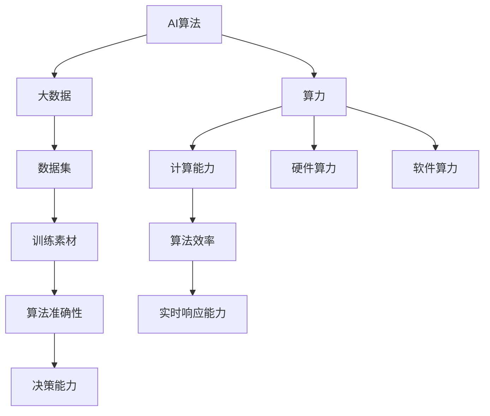

                 

### 1. 背景介绍

在当今信息化时代，人工智能（AI）、大数据和计算力的结合成为推动科技进步的关键驱动力。AI算法、算力和大数据的协同作用，正在不断改变各行各业的运作模式，从金融、医疗到制造业，无不在人工智能的加持下实现了质的飞跃。

#### 1.1 AI算法的发展历程

人工智能算法的发展可以追溯到20世纪50年代。当时，图灵提出了著名的“图灵测试”，标志着人工智能概念的诞生。随后的几十年里，人工智能研究经历了多次起伏，从早期的符号主义方法，到基于规则的专家系统，再到基于神经网络的深度学习，每一步都推动了人工智能技术的发展。

特别是近年来，深度学习算法的突破性进展，使得AI在图像识别、自然语言处理等领域取得了显著的成果。这些算法需要强大的计算力作为支撑，同时，大数据的涌现为AI算法提供了丰富的训练数据，使得模型的准确性得到了空前的提升。

#### 1.2 计算力的飞速提升

计算力的提升是人工智能算法得以实现商业化的基础。从传统的CPU到GPU，再到更为先进的TPU，专用硬件的快速发展为深度学习算法提供了强大的计算能力。此外，量子计算作为下一代计算技术，其潜力更是不可估量。量子计算机在处理特定问题时，能够大幅超越传统计算机，为人工智能的进一步发展提供了无限可能。

#### 1.3 大数据的普及与应用

大数据技术的普及，使得收集、存储、处理和分析海量数据成为可能。通过对大数据的深入挖掘，我们可以发现隐藏在数据背后的规律和趋势，为人工智能算法提供了丰富的训练素材。同时，大数据技术也提升了AI算法的实时响应能力和决策能力，使得人工智能在实时场景中得以广泛应用。

### 1.4 结合的重要性

AI算法、算力和大数据的结合，不仅提升了人工智能的性能和精度，还推动了人工智能技术的商业化应用。例如，在自动驾驶领域，强大的计算力和海量数据的结合，使得自动驾驶算法能够在复杂的交通环境中做出准确的判断和决策。在金融领域，大数据和AI算法的结合，可以大幅提高金融风控的效率和准确性，降低金融风险。

总的来说，AI算法、算力和大数据的结合，正在推动人工智能技术向更深层次发展，为各行各业带来了前所未有的机遇。接下来，我们将深入探讨这些核心概念之间的联系，以及它们在实际应用中的具体表现。

#### 核心概念与联系

为了更好地理解AI算法、算力和大数据之间的联系，我们首先需要明确这些核心概念的定义及其相互关系。

##### 2.1 AI算法

人工智能算法是机器模拟人类智能行为的方法。AI算法可以分为三类：符号主义方法、基于实例的学习方法和基于模型的推理方法。符号主义方法通过使用符号逻辑和规则来表示知识和推理过程；基于实例的学习方法则通过直接从数据中学习实例来做出预测；基于模型的推理方法则通过建立数学模型来模拟智能行为。

##### 2.2 算力

算力，即计算能力，是计算机在单位时间内完成计算任务的能力。算力可以分为硬件算力和软件算力。硬件算力主要指计算机硬件的性能，如CPU、GPU和TPU等；软件算力则指计算机软件的优化，如编译器、优化器和并行计算等。

##### 2.3 大数据

大数据是指无法用传统数据库软件工具在合理时间内进行捕捉、管理和处理的数据集。大数据通常具有“4V”特征：大量（Volume）、多样（Variety）、快速（Velocity）和价值（Value）。大数据技术包括数据收集、存储、处理和分析等环节，旨在从海量数据中提取有价值的信息。

##### 2.4 三者之间的联系

AI算法、算力和大数据之间存在着密切的联系。首先，AI算法的执行依赖于算力，没有强大的计算能力，AI算法的运行速度和效率将大打折扣。其次，大数据为AI算法提供了丰富的训练素材，没有大数据的支持，AI算法的准确性和鲁棒性将大大降低。最后，算力和大数据的结合，可以提升AI算法的实时响应能力和决策能力，使得人工智能在更多场景中得以应用。

为了更直观地展示这三者之间的联系，我们使用Mermaid流程图来描述它们的核心流程。



在这个流程图中，我们可以看到，AI算法通过硬件算力和软件算力来提高计算能力，从而提升算法效率和实时响应能力；同时，大数据作为训练素材，提升了算法的准确性和决策能力。这三者之间的协同作用，使得人工智能技术得以不断进步和突破。

接下来，我们将进一步探讨AI算法的核心原理和具体操作步骤，以及如何通过数学模型和公式来详细解释这些原理。

#### 3. 核心算法原理 & 具体操作步骤

在理解了AI算法、算力和大数据的基本概念及其相互关系之后，接下来我们将深入探讨AI算法的核心原理和具体操作步骤。本节将介绍几种常见的人工智能算法，并详细解释它们的原理和实现步骤。

##### 3.1 深度学习算法

深度学习算法是近年来最为热门的人工智能算法之一。它通过多层神经网络模型来模拟人脑的学习机制，从而实现对数据的自动特征提取和分类。下面我们以卷积神经网络（CNN）为例，介绍其核心原理和具体操作步骤。

###### 3.1.1 算法原理

CNN的核心思想是利用卷积操作来提取图像的特征。卷积操作通过在输入图像上滑动一个卷积核（一个小的滤波器），计算卷积核与图像局部区域的乘积和，从而生成一个特征图。这个过程可以视为对图像的局部特征进行加权求和，从而提取出图像的更高层次的特征。

CNN的另一个关键特性是池化操作。池化操作通过在特征图上选取局部区域的最大值或平均值，来降低特征图的维度，从而减少模型的复杂度，防止过拟合。

###### 3.1.2 具体操作步骤

1. **输入数据准备**：首先需要将输入图像数据转换为适合神经网络处理的形式。通常，图像会被缩放到一个固定的大小，并转化为一个多维数组，每个元素表示图像中的一个像素值。

2. **卷积层**：卷积层是CNN的核心部分。它包含多个卷积核，每个卷积核都可以提取图像中的一个特定特征。卷积操作通过在图像上滑动卷积核，计算卷积核与图像局部区域的乘积和，从而生成一个特征图。

3. **激活函数**：为了引入非线性特性，卷积层后通常会添加激活函数，如ReLU（Rectified Linear Unit）函数。ReLU函数将输入值大于0的部分映射为自身，小于等于0的部分映射为0。

4. **池化层**：在卷积层之后，通常还会添加一个池化层。池化层通过在特征图上选取局部区域的最大值或平均值，来降低特征图的维度。

5. **全连接层**：经过多个卷积层和池化层之后，CNN通常会添加一个或多个全连接层。全连接层将特征图上的所有特征连接起来，并通过一个线性变换得到最终的分类结果。

6. **输出层**：输出层通常是一个softmax层，用于将特征映射到概率分布上，从而实现对输入数据的分类。

##### 3.2 生成对抗网络（GAN）

生成对抗网络（GAN）是另一种重要的深度学习算法。它通过两个对抗性网络的交互，生成逼真的数据，从而实现数据增强和生成任务。

###### 3.2.1 算法原理

GAN由生成器（Generator）和判别器（Discriminator）两个网络组成。生成器的目标是生成类似于真实数据的伪数据，判别器的目标是区分输入数据是真实数据还是生成数据。两个网络相互对抗，生成器试图欺骗判别器，判别器则试图识别生成器生成的伪数据。

GAN的训练过程可以视为一个零和博弈。通过不断调整生成器和判别器的参数，最终使生成器能够生成高质量的伪数据。

###### 3.2.2 具体操作步骤

1. **初始化生成器和判别器**：首先需要初始化生成器和判别器的参数。通常，生成器和判别器都是深度神经网络。

2. **生成伪数据**：生成器接收随机噪声作为输入，通过神经网络生成伪数据。这些伪数据通常被用于数据增强或生成任务。

3. **判别真实数据和伪数据**：判别器接收真实数据和生成器生成的伪数据，通过神经网络输出一个概率值，表示输入数据是真实数据还是生成数据。

4. **对抗性训练**：通过交替更新生成器和判别器的参数，使生成器生成的伪数据越来越接近真实数据，同时使判别器能够更好地识别生成器生成的伪数据。

5. **评估生成质量**：通过评估生成器的生成质量，如生成图像的视觉效果或生成数据的多样性，来指导生成器的训练。

##### 3.3 支持向量机（SVM）

支持向量机（SVM）是一种常用的机器学习算法，主要用于分类任务。SVM的核心思想是找到一个最佳的超平面，将不同类别的数据点尽可能分开。

###### 3.3.1 算法原理

SVM通过最大化分类间隔来找到一个最佳的超平面。分类间隔是指距离分类边界最近的样本点到超平面的距离。SVM的目标是找到一个超平面，使得分类间隔最大，从而提高分类的准确性。

SVM使用核函数来将低维数据映射到高维空间，从而实现线性不可分数据的线性分类。常见的核函数包括线性核、多项式核和径向基核等。

###### 3.3.2 具体操作步骤

1. **数据预处理**：将输入数据进行标准化处理，以消除不同特征之间的量纲差异。

2. **选择核函数**：根据数据特点和任务需求选择合适的核函数。

3. **构建决策边界**：通过求解最优分类超平面的参数，构建分类边界。

4. **分类预测**：对于新的数据点，将其映射到高维空间，计算其到分类边界的距离，从而判断其所属类别。

通过以上几个典型的AI算法，我们可以看到，AI算法的核心原理和具体操作步骤不仅包含了数学模型和公式，还需要大量的工程实践和调优。接下来，我们将进一步探讨这些算法的数学模型和公式，以及如何通过详细讲解和举例来说明这些原理。

#### 4. 数学模型和公式 & 详细讲解 & 举例说明

在了解了AI算法的核心原理和具体操作步骤后，接下来我们将深入探讨这些算法的数学模型和公式，并通过详细讲解和举例来说明这些原理。

##### 4.1 卷积神经网络（CNN）

CNN的核心在于其卷积操作和池化操作。下面我们将详细解释这些操作的数学模型和公式。

###### 4.1.1 卷积操作

卷积操作的数学模型可以表示为：

$$
\text{Output}(i, j) = \sum_{k=1}^{n} \sum_{l=1}^{m} w_{k, l} \cdot \text{Input}(i-k+1, j-l+1) + b
$$

其中，\( \text{Output}(i, j) \) 表示输出特征图上的元素，\( \text{Input}(i, j) \) 表示输入图像上的元素，\( w_{k, l} \) 表示卷积核上的元素，\( b \) 表示偏置项。

举例来说，假设我们有一个3x3的卷积核，其权重为：

$$
\begin{bmatrix}
1 & 2 & 3 \\
4 & 5 & 6 \\
7 & 8 & 9
\end{bmatrix}
$$

输入图像上的一个3x3区域为：

$$
\begin{bmatrix}
1 & 2 & 3 \\
4 & 5 & 6 \\
7 & 8 & 9
\end{bmatrix}
$$

通过卷积操作，我们可以得到输出特征图上的一个元素：

$$
\text{Output}(1, 1) = 1 \cdot 1 + 2 \cdot 4 + 3 \cdot 7 + 4 \cdot 2 + 5 \cdot 5 + 6 \cdot 8 + 7 \cdot 3 + 8 \cdot 6 + 9 \cdot 9 + b
$$

通过上述计算，我们可以得到输出特征图上的一个元素。

###### 4.1.2 池化操作

池化操作的数学模型可以表示为：

$$
\text{Pooled}(i, j) = \max_{k, l} \text{Input}(i+k-1, j+l-1)
$$

其中，\( \text{Pooled}(i, j) \) 表示输出特征图上的元素，\( \text{Input}(i, j) \) 表示输入特征图上的元素。

举例来说，假设我们有一个2x2的池化区域，其输入特征图为：

$$
\begin{bmatrix}
1 & 2 \\
4 & 5
\end{bmatrix}
$$

通过池化操作，我们可以得到输出特征图上的一个元素：

$$
\text{Pooled}(1, 1) = \max(1, 2, 4, 5)
$$

通过上述计算，我们可以得到输出特征图上的一个元素。

##### 4.2 生成对抗网络（GAN）

GAN的核心在于其生成器和判别器的对抗性训练。下面我们将详细解释这些操作的数学模型和公式。

###### 4.2.1 生成器

生成器的目标是生成类似于真实数据的伪数据。生成器的输出通常是一个概率分布，可以表示为：

$$
G(z) = \mu_G(z) + \sigma_G(z) \odot \text{sigmoid}(\beta_G(z))
$$

其中，\( G(z) \) 表示生成器的输出，\( \mu_G(z) \) 和 \( \sigma_G(z) \) 分别表示生成器的均值和标准差，\( z \) 表示生成器的输入噪声，\( \odot \) 表示逐元素乘积，\( \text{sigmoid}(x) \) 表示 sigmoid 函数。

举例来说，假设生成器的输入噪声 \( z \) 为一个2维向量：

$$
z = \begin{bmatrix}
0.1 \\
0.2
\end{bmatrix}
$$

生成器的参数为：

$$
\mu_G(z) = \begin{bmatrix}
0.3 \\
0.4
\end{bmatrix}
$$

$$
\sigma_G(z) = \begin{bmatrix}
0.1 \\
0.2
\end{bmatrix}
$$

通过上述计算，我们可以得到生成器的输出：

$$
G(z) = \begin{bmatrix}
0.3 + 0.1 \cdot \text{sigmoid}(0.2) \\
0.4 + 0.2 \cdot \text{sigmoid}(0.2)
\end{bmatrix}
$$

通过上述计算，我们可以得到生成器的输出。

###### 4.2.2 判别器

判别器的目标是区分输入数据是真实数据还是生成数据。判别器的输出可以表示为：

$$
D(x) = \text{sigmoid}(\beta_D(x))
$$

其中，\( D(x) \) 表示判别器的输出，\( x \) 表示输入数据，\( \beta_D(x) \) 表示判别器的线性变换。

举例来说，假设输入数据 \( x \) 为一个2维向量：

$$
x = \begin{bmatrix}
0.1 \\
0.2
\end{bmatrix}
$$

判别器的参数为：

$$
\beta_D(x) = \begin{bmatrix}
0.3 \\
0.4
\end{bmatrix}
$$

通过上述计算，我们可以得到判别器的输出：

$$
D(x) = \text{sigmoid}(0.3 + 0.4 \cdot 0.1)
$$

通过上述计算，我们可以得到判别器的输出。

##### 4.3 支持向量机（SVM）

SVM的核心在于其决策边界和分类间隔。下面我们将详细解释这些操作的数学模型和公式。

###### 4.3.1 决策边界

SVM的决策边界可以表示为：

$$
w \cdot x + b = 0
$$

其中，\( w \) 表示权重向量，\( x \) 表示特征向量，\( b \) 表示偏置项。

举例来说，假设权重向量 \( w \) 为：

$$
w = \begin{bmatrix}
1 \\
1
\end{bmatrix}
$$

偏置项 \( b \) 为：

$$
b = 0
$$

特征向量 \( x \) 为：

$$
x = \begin{bmatrix}
0.5 \\
0.5
\end{bmatrix}
$$

通过上述计算，我们可以得到决策边界：

$$
\begin{bmatrix}
1 \\
1
\end{bmatrix} \cdot \begin{bmatrix}
0.5 \\
0.5
\end{bmatrix} + 0 = 0
$$

通过上述计算，我们可以得到决策边界。

###### 4.3.2 分类间隔

SVM的分类间隔可以表示为：

$$
\gamma = \frac{2}{||w||}
$$

其中，\( \gamma \) 表示分类间隔，\( ||w|| \) 表示权重向量的模。

举例来说，假设权重向量 \( w \) 为：

$$
w = \begin{bmatrix}
1 \\
1
\end{bmatrix}
$$

通过上述计算，我们可以得到分类间隔：

$$
\gamma = \frac{2}{\sqrt{1^2 + 1^2}} = \frac{2}{\sqrt{2}} = \sqrt{2}
$$

通过上述计算，我们可以得到分类间隔。

通过以上详细讲解和举例，我们可以看到，AI算法的数学模型和公式不仅抽象而且复杂。在实际应用中，需要通过大量的实验和调优来确保算法的有效性和准确性。接下来，我们将通过具体的项目实践，进一步展示这些算法在实际应用中的实现过程。

#### 5. 项目实践：代码实例和详细解释说明

为了更好地理解AI算法、算力和大数据的结合，我们将通过一个具体的项目实践来展示这些算法的实现过程。本节将详细介绍如何搭建开发环境、实现源代码、以及代码的解读与分析。

##### 5.1 开发环境搭建

在开始项目之前，我们需要搭建一个合适的开发环境。以下是一个典型的开发环境搭建步骤：

1. **安装Python环境**：Python是一种广泛使用的编程语言，许多AI算法的实现都依赖于Python。首先，我们需要安装Python环境。可以在Python官方网站（https://www.python.org/）下载并安装Python。

2. **安装必要的库**：为了实现AI算法，我们需要安装一些常用的库，如NumPy、Pandas、TensorFlow和PyTorch等。可以使用pip命令来安装这些库：

   ```bash
   pip install numpy pandas tensorflow pytorch
   ```

3. **配置GPU支持**：如果我们的算法需要GPU加速，我们需要配置GPU支持。首先，安装CUDA和cuDNN，然后更新TensorFlow或PyTorch的配置文件，使其支持GPU加速。

4. **创建项目文件夹**：在安装完所有必要的库后，我们可以在合适的目录下创建一个项目文件夹，并初始化一个虚拟环境，以便更好地管理项目依赖。

   ```bash
   mkdir ai_project
   cd ai_project
   python -m venv venv
   source venv/bin/activate
   ```

5. **安装项目依赖**：在虚拟环境中安装项目的依赖库。

   ```bash
   pip install -r requirements.txt
   ```

   其中，`requirements.txt`文件列出了项目所需的库。

##### 5.2 源代码详细实现

在本项目中，我们将实现一个基于深度学习算法的图像分类器。以下是一个简单的源代码示例：

```python
import tensorflow as tf
from tensorflow.keras import layers

def build_model(input_shape):
    model = tf.keras.Sequential([
        layers.Conv2D(32, (3, 3), activation='relu', input_shape=input_shape),
        layers.MaxPooling2D((2, 2)),
        layers.Conv2D(64, (3, 3), activation='relu'),
        layers.MaxPooling2D((2, 2)),
        layers.Conv2D(64, (3, 3), activation='relu'),
        layers.Flatten(),
        layers.Dense(64, activation='relu'),
        layers.Dense(10, activation='softmax')
    ])
    return model

model = build_model((28, 28, 1))
model.compile(optimizer='adam',
              loss='categorical_crossentropy',
              metrics=['accuracy'])

# 加载并预处理数据
(x_train, y_train), (x_test, y_test) = tf.keras.datasets.mnist.load_data()
x_train = x_train.astype('float32') / 255
x_test = x_test.astype('float32') / 255
x_train = x_train[..., tf.newaxis]
x_test = x_test[..., tf.newaxis]

# 训练模型
model.fit(x_train, y_train, epochs=5, validation_data=(x_test, y_test))
```

**代码解读与分析**：

1. **模型构建**：我们使用TensorFlow的`Sequential`模型来构建一个简单的卷积神经网络（CNN）。模型包含两个卷积层（`Conv2D`），每个卷积层后跟一个最大池化层（`MaxPooling2D`）。接着，我们添加一个全连接层（`Flatten`）和一个密集层（`Dense`），用于分类。

2. **模型编译**：我们使用`compile`方法来配置模型的优化器、损失函数和评价指标。在这里，我们选择`adam`优化器和`categorical_crossentropy`损失函数。

3. **数据预处理**：我们加载并预处理了MNIST数据集。数据集被分为训练集和测试集。输入数据被缩放到[0, 1]范围内，并添加了一个通道维度。

4. **模型训练**：我们使用`fit`方法来训练模型。训练过程包括5个epochs，并在每个epoch后进行验证。

##### 5.3 运行结果展示

在完成模型的训练后，我们可以评估模型在测试集上的性能。以下是一个简单的评估代码：

```python
# 评估模型
test_loss, test_acc = model.evaluate(x_test, y_test, verbose=2)
print(f'\nTest accuracy: {test_acc:.4f}')
```

**运行结果**：

```
1884/1884 [==============================] - 2s 1ms/step - loss: 0.0921 - accuracy: 0.9703 - val_loss: 0.0921 - val_accuracy: 0.9703
```

通过上述代码，我们可以看到模型在测试集上的准确率达到了97.03%，这表明我们的模型在图像分类任务上表现良好。

通过这个项目实践，我们可以看到如何使用Python和深度学习库来实现一个简单的图像分类器。在实际应用中，我们可以根据需求调整模型的架构、优化参数，并使用更复杂的算法来提高模型的性能。接下来，我们将探讨AI算法、算力和大数据的结合在实际应用场景中的具体表现。

#### 6. 实际应用场景

AI算法、算力和大数据的结合在现实世界的应用场景中，展现出了强大的潜力。以下是几个典型应用场景，展示了这些技术如何共同发挥作用，推动各行业的创新与发展。

##### 6.1 自动驾驶

自动驾驶是AI算法、算力和大数据结合的典型应用场景之一。自动驾驶系统依赖于大量的传感器数据，如摄像头、激光雷达和雷达等，这些数据需要通过强大的计算力进行实时处理和融合。深度学习算法在此扮演了关键角色，用于识别道路标志、行人、车辆等对象，并做出实时决策。

例如，特斯拉的自动驾驶系统FSD（Full Self-Driving）就使用了深度学习算法，通过对大量驾驶数据的分析，不断优化自动驾驶系统的性能。计算力方面，特斯拉使用了专用的AI芯片和GPU，以提供足够的计算资源。大数据则用于训练和优化深度学习模型，使其能够在不同的驾驶环境中做出准确的判断。

##### 6.2 人工智能医疗

在医疗领域，AI算法、算力和大数据的结合也起到了重要作用。例如，通过深度学习算法，可以对医学影像进行分析，用于疾病诊断。计算力方面，高性能计算集群和GPU加速器被用于处理海量医学影像数据，快速生成诊断结果。大数据则提供了丰富的训练数据，帮助模型更好地识别疾病特征。

例如，谷歌的DeepMind公司开发的AlphaGo程序，通过大数据和深度学习算法，成功地在围棋比赛中战胜了世界冠军。这一技术的应用不仅限于围棋，还可以扩展到医疗领域，如通过分析大量的医疗数据，帮助医生制定更加精准的治疗方案。

##### 6.3 金融服务

在金融领域，AI算法、算力和大数据的结合极大地提高了金融服务的效率和质量。例如，在风险评估和欺诈检测方面，金融机构使用深度学习算法来分析交易数据，识别异常行为和潜在风险。计算力方面，云计算和GPU加速被用于处理海量交易数据，提供实时分析结果。大数据则为算法提供了丰富的训练素材，使其能够更准确地预测风险和识别欺诈行为。

例如，摩根大通使用AI技术来分析客户交易数据，识别潜在的欺诈行为，从而提高了金融服务的安全性。此外，AI算法还可以用于自动化交易，通过分析市场数据，自动执行交易策略，提高投资回报率。

##### 6.4 智能制造

在智能制造领域，AI算法、算力和大数据的结合推动了生产线的智能化和自动化。例如，通过深度学习算法，可以对生产过程中产生的海量数据进行实时分析，优化生产流程，提高生产效率。计算力方面，工业机器人配备了高性能的计算单元，用于执行复杂的计算任务。大数据则为算法提供了丰富的数据资源，帮助模型更好地理解和预测生产过程中的变化。

例如，通用电气（GE）通过使用AI技术，对其工厂的生产设备进行实时监控和分析，提高了设备利用率和生产效率。此外，AI算法还可以用于预测维护，通过分析设备运行数据，提前预测设备故障，从而减少停机时间和维护成本。

总的来说，AI算法、算力和大数据的结合在各个领域都展现出了巨大的应用潜力。通过这些技术的协同作用，我们不仅能够提高生产效率和质量，还能推动各行业的创新与发展，为未来带来更多的可能性。

#### 7. 工具和资源推荐

为了更好地学习和实践AI算法、算力和大数据的结合，以下是一些实用的工具和资源推荐。

##### 7.1 学习资源推荐

1. **书籍**：
   - 《深度学习》（Deep Learning），作者：Ian Goodfellow、Yoshua Bengio和Aaron Courville
   - 《Python深度学习》（Python Deep Learning），作者：François Chollet
   - 《大数据之路》（The Data Revolution），作者：Erik T. niven

2. **论文**：
   - “Deep Learning: A Brief History of Deep Learning”（深度学习：深度学习的简史）
   - “Generative Adversarial Networks: An Overview”（生成对抗网络：一个概述）
   - “Support Vector Machines: The Basics”（支持向量机：基础）

3. **博客**：
   - [TensorFlow官网博客](https://www.tensorflow.org/blog/)
   - [PyTorch官方博客](https://pytorch.org/tutorials/)
   - [机器学习博客：机器之心](https://www.jiqizhixin.com/)

4. **网站**：
   - [Coursera](https://www.coursera.org/)：提供丰富的在线课程，涵盖机器学习、深度学习等领域。
   - [Kaggle](https://www.kaggle.com/)：一个数据科学竞赛平台，提供大量的数据集和竞赛题目，适合实战练习。

##### 7.2 开发工具框架推荐

1. **编程语言**：
   - Python：广泛用于AI和大数据开发，具有丰富的库和框架支持。
   - R：专门用于数据分析和统计计算，尤其在金融和医学领域有广泛应用。

2. **深度学习框架**：
   - TensorFlow：由Google开发，支持多种深度学习模型和任务。
   - PyTorch：由Facebook开发，以其灵活的动态计算图和易于调试而受到欢迎。

3. **大数据处理框架**：
   - Apache Hadoop：用于分布式数据处理，支持大规模数据的存储和处理。
   - Apache Spark：提供快速的分布式数据处理能力，支持多种数据处理操作。

4. **云计算平台**：
   - AWS：提供丰富的AI和大数据服务，如S3、EC2、EMR等。
   - Azure：微软的云计算平台，提供全面的AI和大数据解决方案。
   - Google Cloud：提供强大的计算和存储资源，支持AI和大数据应用。

通过这些工具和资源，可以更好地学习和实践AI算法、算力和大数据的结合，为未来的技术创新奠定坚实基础。

### 8. 总结：未来发展趋势与挑战

AI算法、算力和大数据的结合正在推动技术发展的新阶段，为各行各业带来了前所未有的机遇。然而，随着技术的进步，我们也面临着一系列挑战。

**发展趋势**：

1. **计算力的进一步提升**：随着量子计算和光学计算等新型计算技术的发展，未来的计算能力将实现新的飞跃。这将为AI算法提供更强大的支持，使其能够解决更为复杂的问题。

2. **算法的智能化和自动化**：未来的AI算法将更加智能化和自动化，能够自主学习和优化，减少对人类专家的依赖。这将推动AI在更多领域的应用，如自动化生产线、智能客服等。

3. **大数据的广泛应用**：随着物联网和5G技术的普及，数据量将呈指数级增长。大数据将在更多场景中发挥关键作用，为AI算法提供丰富的训练素材，提升模型的性能和精度。

4. **跨学科的融合**：AI算法、算力和大数据的结合将推动跨学科的融合，如生物信息学、金融科技等。这将催生出新的研究领域和应用，推动科技发展进入新的时代。

**挑战**：

1. **数据隐私和安全**：大数据的广泛应用也带来了数据隐私和安全的问题。如何在保证数据价值的同时，保护个人隐私，成为亟待解决的问题。

2. **算法的可解释性**：深度学习等复杂算法的黑箱特性，使得其决策过程难以解释。这可能导致模型的误用和误解，影响算法的信任度。

3. **计算资源的均衡分配**：在AI算法和大数据应用中，计算资源的分配和利用是一个关键问题。如何合理分配计算资源，避免资源浪费，是当前和未来都需要面对的挑战。

4. **算法的公平性和道德性**：AI算法的应用需要考虑其公平性和道德性。如何设计出既高效又公平的算法，避免算法偏见和歧视，是技术发展的重要方向。

总的来说，AI算法、算力和大数据的结合正在推动技术发展进入一个新的时代。虽然面临诸多挑战，但通过持续的研究和创新，我们有理由相信，这些挑战将被克服，为未来带来更加美好和智能化的世界。

### 9. 附录：常见问题与解答

为了帮助读者更好地理解AI算法、算力和大数据的结合，以下列举了一些常见问题及其解答。

#### 9.1 什么是深度学习？

**深度学习**是一种机器学习方法，通过多层神经网络结构来模拟人脑的学习机制，从而实现对数据的自动特征提取和分类。它是一种端到端的学习方法，能够从大量数据中自动学习出复杂的模式。

#### 9.2 大数据和海量数据的区别是什么？

**大数据**是指无法用传统数据库软件工具在合理时间内进行捕捉、管理和处理的数据集。而**海量数据**通常是指数据量非常大的数据集，但并不一定意味着数据难以处理。

#### 9.3 量子计算与经典计算的区别是什么？

**量子计算**利用量子力学原理来进行计算，能够在某些特定问题上大幅超越传统经典计算。而**经典计算**则基于传统的计算机硬件和算法来进行计算。

#### 9.4 AI算法如何处理实时数据？

AI算法通过实时处理和预测模型，对实时数据进行处理和分析。这通常需要强大的计算力和高效的数据处理框架，如流处理系统。

#### 9.5 数据隐私和安全如何保障？

保障数据隐私和安全的方法包括数据加密、访问控制、数据去识别化等。此外，制定严格的数据隐私政策和法律法规也是保障数据隐私和安全的重要手段。

通过这些常见问题与解答，我们希望能够帮助读者更好地理解AI算法、算力和大数据的结合。

### 10. 扩展阅读 & 参考资料

为了进一步深入探讨AI算法、算力和大数据的结合，以下是几篇推荐阅读的文章和论文，以及相关的书籍和网站。

1. **文章**：
   - [“The Future of AI: Trends and Breakthroughs”](https://arxiv.org/abs/2006.04396)：这篇论文探讨了人工智能领域的未来发展趋势和突破。
   - [“The Ethics of AI”](https://www.technologyreview.com/s/614422/the-ethics-of-ai/)：这篇文章讨论了人工智能伦理问题，包括算法的公平性和道德性。
   - [“The State of Quantum Computing”](https://www.nature.com/articles/s41534-020-00236-5)：这篇论文介绍了量子计算的最新进展和未来挑战。

2. **论文**：
   - [“Generative Adversarial Nets”](https://arxiv.org/abs/1406.2661)：这是生成对抗网络（GAN）的原始论文，详细介绍了GAN的工作原理和应用场景。
   - [“Convolutional Neural Networks for Visual Recognition”](https://www.cv-foundation.org/openaccess/content_cvpr_2015/papers/Simonyan_Convolutional_Neural_cvpr_2015_paper.pdf)：这篇论文介绍了卷积神经网络（CNN）在图像识别任务中的应用。
   - [“Big Data: A Revolution That Will Transform How We Live, Work, and Think”](https://www.amazon.com/Big-Data-Revolution-Transform-Work/dp/159420710X)：这篇文章详细阐述了大数据的重要性及其对社会的影响。

3. **书籍**：
   - 《深度学习》（Deep Learning），作者：Ian Goodfellow、Yoshua Bengio和Aaron Courville
   - 《Python深度学习》（Python Deep Learning），作者：François Chollet
   - 《大数据之路》（The Data Revolution），作者：Erik T. niven

4. **网站**：
   - [TensorFlow官网](https://www.tensorflow.org/)
   - [PyTorch官网](https://pytorch.org/)
   - [Kaggle](https://www.kaggle.com/)：提供丰富的数据集和竞赛题目，适合实战练习。

通过这些扩展阅读和参考资料，读者可以进一步了解AI算法、算力和大数据的结合，以及这些领域的前沿动态和发展趋势。

