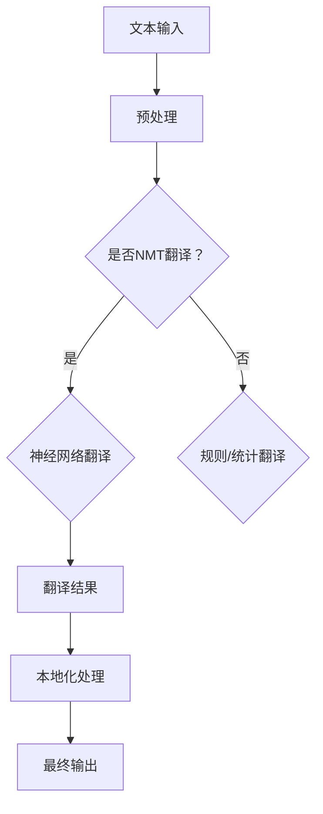

                 

### 1. 背景介绍

在当今全球化进程加速的时代，跨语言的沟通与交流变得越来越重要。无论是国际贸易、国际合作项目，还是跨国公司的运营，语言的障碍一直是不可忽视的问题。传统的翻译方式，如人工翻译和机器翻译，虽然在一定程度上缓解了这一问题，但都存在明显的局限。

人工翻译成本高昂，且受限于翻译人员的专业知识、语言水平和工作时间。即便是最优秀的翻译人员，也无法完全避免错译、漏译和理解偏差等问题。而早期的机器翻译系统，如基于规则的方法和基于统计的方法，尽管在某些特定领域取得了显著的进展，但总体上仍难以达到高质量的翻译水平。

随着深度学习技术的迅猛发展，特别是神经网络机器翻译（Neural Machine Translation，NMT）的崛起，AI翻译与本地化迎来了全新的变革。AI翻译利用大量的语言数据进行训练，通过模拟人类大脑的语言处理机制，实现了在多种语言之间的高质量翻译。同时，本地化技术作为翻译的延伸，不仅关注文本的翻译，还涉及到文化差异的适配，确保翻译内容在不同地区和语言环境中都能达到最佳效果。

本篇文章将深入探讨AI翻译与本地化的核心概念、算法原理、项目实践以及实际应用场景，旨在为读者提供全面、系统的理解和应用指南。接下来，我们将一步一步分析这些关键概念和技术的原理与实现，帮助您更好地掌握这一领域的前沿动态和发展趋势。

### 2. 核心概念与联系

#### 2.1 AI翻译与本地化的定义

AI翻译（Artificial Intelligence Translation）是指利用人工智能技术，特别是深度学习和神经网络，来实现自动化翻译的过程。它通过分析大量的语言数据，模拟人类大脑的语言处理机制，从而在不同语言之间进行翻译。

本地化（Localization）则是一个更广泛的概念，它不仅仅涉及文本的翻译，还包括对产品、服务或内容的适应性调整，以适应特定的文化、地域和社会环境。本地化技术确保翻译后的内容在目标语言和文化中具有可读性、相关性和实用性。

#### 2.2 AI翻译的关键技术

##### 2.2.1 神经网络机器翻译（NMT）

神经网络机器翻译是AI翻译的主要方法，特别是基于深度学习的方法。NMT的核心是使用深度神经网络（如循环神经网络RNN、长短时记忆网络LSTM、门控循环单元GRU等）来学习语言的模式和结构。

**模型架构**：典型的NMT模型通常包含编码器（Encoder）和解码器（Decoder）两个部分。编码器将源语言的文本序列映射到一个固定长度的向量，称为上下文向量（Context Vector）；解码器则利用上下文向量生成目标语言的文本序列。

**训练过程**：NMT的训练过程基于大量的平行语料库（Parallel Corpus），即包含源语言和目标语言对应文本的语料库。通过梯度下降（Gradient Descent）等优化算法，模型不断调整参数，以最小化翻译误差。

##### 2.2.2 注意力机制（Attention Mechanism）

注意力机制是NMT中的一项关键技术，它允许解码器在生成目标语言时，根据上下文向量关注源语言文本序列的不同部分。这样，解码器可以更加精准地理解源语言的语义，从而生成更准确的翻译。

**工作原理**：注意力机制通过计算源语言文本序列中每个词与目标语言生成词之间的相似度，生成一系列权重，这些权重用于加权编码器输出的上下文向量。解码器在生成每个目标语言词时，只关注与当前生成词最相关的源语言部分。

#### 2.3 本地化的核心要素

##### 2.3.1 文化适应（Cultural Adaptation）

文化适应是本地化过程中最重要的环节之一。不同文化背景下，同样的词汇和表达可能有不同的含义和语境。因此，本地化过程中需要考虑文化差异，对翻译内容进行适当的调整。

**方法**：常见的文化适应方法包括词汇替换、句子重构、添加注释等。例如，在翻译时可能会将源语言中的特定文化概念替换为目标语言中相应的文化概念，或对句子结构进行调整，使其更符合目标语言的表达习惯。

##### 2.3.2 技术本地化（Technological Localization）

技术本地化主要关注产品、应用程序或系统在不同语言环境中的兼容性和功能性。这包括对界面、菜单、代码库等进行适当的修改，以确保产品在不同语言中都能正常运行。

**挑战**：技术本地化面临的主要挑战包括多语言支持的实现、字符编码问题、语言特定的格式和排序规则等。例如，某些语言（如中文和日语）使用垂直书写，而其他语言（如英语和法语）则使用水平书写。

#### 2.4 AI翻译与本地化的联系

AI翻译与本地化是密切相关的，两者共同构建了一个完整的翻译与本地化流程。AI翻译为本地化提供了高质量的翻译基础，而本地化则通过文化适应和技术调整，确保翻译内容在目标语言和文化中能够有效传达。

**联系与区别**：

- **联系**：AI翻译是本地化的核心技术之一，本地化过程依赖于高质量的翻译结果。同时，本地化过程中的文化适应和技术调整也是AI翻译的重要组成部分。

- **区别**：AI翻译侧重于文本的翻译质量，而本地化则更注重文化和技术层面的适配性。AI翻译是本地化的基础，本地化是AI翻译的延伸和应用。

#### 2.5 Mermaid 流程图

以下是一个简化的Mermaid流程图，展示了AI翻译与本地化的基本流程：



**解释**：

- **A. 文本输入**：用户输入需要翻译的文本。
- **B. 预处理**：对文本进行分词、去停用词、标记化等处理。
- **C. 是否NMT翻译**：判断是否使用神经网络机器翻译。
- **D. 神经网络翻译**：执行基于深度学习的NMT翻译。
- **E. 规则/统计翻译**：使用基于规则或统计的方法进行翻译。
- **F. 翻译结果**：生成初步的翻译文本。
- **G. 本地化处理**：对翻译结果进行文化和技术适配。
- **H. 最终输出**：输出适应目标语言和文化的翻译内容。

通过以上对核心概念与联系的分析，我们可以看到AI翻译与本地化是一个复杂而多层次的过程，需要结合多种技术和方法来实现高质量的翻译与本地化效果。

### 3. 核心算法原理 & 具体操作步骤

要深入理解AI翻译与本地化的核心算法原理，我们需要从神经网络机器翻译（NMT）的运作机制开始，详细探讨其关键组成部分和训练过程。

#### 3.1 神经网络机器翻译（NMT）的工作原理

神经网络机器翻译的核心在于其编码器-解码器（Encoder-Decoder）架构。这个架构模拟了人类语言处理的过程，将源语言的文本序列编码成一个上下文向量，然后通过解码器生成目标语言的文本序列。

**编码器（Encoder）**：编码器的任务是理解源语言的语义和语法结构，将其转换为一个固定长度的上下文向量。常见的编码器模型包括循环神经网络（RNN）、长短时记忆网络（LSTM）和门控循环单元（GRU）。这些模型能够捕捉长距离依赖关系，使得编码器能够处理较长的句子。

**解码器（Decoder）**：解码器的任务是根据编码器输出的上下文向量生成目标语言的文本序列。在生成过程中，解码器通常会利用注意力机制（Attention Mechanism）来关注源语言文本序列的不同部分，以提高翻译的准确性。

**注意力机制（Attention Mechanism）**：注意力机制是NMT中的一项关键技术。它通过计算源语言文本序列中每个词与目标语言生成词之间的相似度，生成一系列权重。这些权重用于加权编码器输出的上下文向量，使得解码器在生成每个目标语言词时，只关注与当前生成词最相关的源语言部分。

#### 3.2 具体操作步骤

**1. 数据准备**：

- **语料库收集**：首先，我们需要收集大量的平行语料库（Parallel Corpus），即包含源语言和目标语言对应文本的语料库。这些数据是训练NMT模型的基础。
- **数据预处理**：对收集到的语料库进行预处理，包括分词、去停用词、标记化等步骤。预处理后的数据将被输入到编码器和解码器中。

**2. 模型设计**：

- **编码器设计**：设计编码器时，可以选择使用RNN、LSTM或GRU等模型。这些模型的结构和参数设置会影响编码器的性能。
- **解码器设计**：解码器的设计与编码器类似，但需要加入注意力机制。常见的解码器模型也是基于RNN、LSTM或GRU，并结合注意力机制来提高翻译质量。

**3. 模型训练**：

- **损失函数**：在训练过程中，我们使用交叉熵（Cross-Entropy）作为损失函数来评估模型的翻译误差。交叉熵损失函数能够计算模型预测的输出与实际输出之间的差距。
- **优化算法**：为了最小化损失函数，我们通常使用梯度下降（Gradient Descent）及其变种（如Adam优化器）来调整模型的参数。

**4. 模型评估与调整**：

- **评估指标**：在模型训练过程中，我们需要使用一系列评估指标来衡量模型的表现，如BLEU（双语评估指标）、METEOR（度量评估指标）等。
- **调整参数**：根据评估结果，对模型的参数进行调整，以优化翻译质量。

#### 3.3 实例分析

为了更好地理解NMT的工作原理，我们来看一个简单的例子。假设我们要将英文句子 "I love programming." 翻译成中文。

**1. 数据准备**：

- **平行语料库**：假设我们有一个平行语料库，包含大量的英文句子和对应的中文翻译。
- **数据预处理**：对英文句子进行分词，生成词向量表示。

**2. 模型设计**：

- **编码器**：使用一个LSTM编码器，将英文句子编码成一个上下文向量。
- **解码器**：使用一个LSTM解码器，并加入注意力机制，生成中文句子。

**3. 模型训练**：

- **损失函数**：使用交叉熵损失函数。
- **优化算法**：使用Adam优化器。

**4. 模型评估与调整**：

- **评估指标**：使用BLEU指标。
- **调整参数**：根据评估结果，调整LSTM的隐藏层大小、学习率等参数。

通过以上步骤，模型将学会将英文句子映射到中文句子。在这个例子中，模型可能会生成 "我喜欢编程。" 作为翻译结果。

通过以上详细分析，我们可以看到神经网络机器翻译（NMT）是一个复杂但高度有效的翻译方法。它利用深度学习技术，通过编码器-解码器架构和注意力机制，实现了高质量的语言翻译。

### 4. 数学模型和公式 & 详细讲解 & 举例说明

在深入探讨神经网络机器翻译（NMT）的数学模型和公式之前，我们首先需要了解一些基础的数学概念和术语，这些将为后续的解释和分析提供必要的背景知识。

#### 4.1 基础数学概念

**1. 向量和矩阵**

向量（Vector）是数学和计算机科学中的基本概念，它是由一组有序数构成的数组，通常表示为列向量。例如：

\[ \mathbf{v} = \begin{bmatrix} 1 \\ 2 \\ 3 \end{bmatrix} \]

矩阵（Matrix）是一个二维数组，由多个行和列组成。例如：

\[ \mathbf{A} = \begin{bmatrix} 1 & 2 & 3 \\ 4 & 5 & 6 \\ 7 & 8 & 9 \end{bmatrix} \]

**2. 矩阵运算**

矩阵运算包括矩阵的加法、减法、乘法和转置等。例如：

- 矩阵加法：

\[ \mathbf{A} + \mathbf{B} = \begin{bmatrix} a_{11} + b_{11} & a_{12} + b_{12} & a_{13} + b_{13} \\ a_{21} + b_{21} & a_{22} + b_{22} & a_{23} + b_{23} \\ a_{31} + b_{31} & a_{32} + b_{32} & a_{33} + b_{33} \end{bmatrix} \]

- 矩阵乘法：

\[ \mathbf{A} \cdot \mathbf{B} = \begin{bmatrix} a_{11}b_{11} + a_{12}b_{21} + a_{13}b_{31} & a_{11}b_{12} + a_{12}b_{22} + a_{13}b_{32} & a_{11}b_{13} + a_{12}b_{23} + a_{13}b_{33} \\ a_{21}b_{11} + a_{22}b_{21} + a_{23}b_{31} & a_{21}b_{12} + a_{22}b_{22} + a_{23}b_{32} & a_{21}b_{13} + a_{22}b_{23} + a_{23}b_{33} \\ a_{31}b_{11} + a_{32}b_{21} + a_{33}b_{31} & a_{31}b_{12} + a_{32}b_{22} + a_{33}b_{32} & a_{31}b_{13} + a_{32}b_{23} + a_{33}b_{33} \end{bmatrix} \]

- 矩阵转置：

\[ \mathbf{A}^T = \begin{bmatrix} a_{11} & a_{21} & a_{31} \\ a_{12} & a_{22} & a_{32} \\ a_{13} & a_{23} & a_{33} \end{bmatrix} \]

**3. 向量与矩阵的乘积**

向量与矩阵的乘积通常称为矩阵-向量乘积，其结果是一个新的向量。例如：

\[ \mathbf{A} \mathbf{v} = \begin{bmatrix} a_{11} & a_{12} & a_{13} \\ a_{21} & a_{22} & a_{23} \\ a_{31} & a_{32} & a_{33} \end{bmatrix} \begin{bmatrix} v_1 \\ v_2 \\ v_3 \end{bmatrix} = \begin{bmatrix} a_{11}v_1 + a_{12}v_2 + a_{13}v_3 \\ a_{21}v_1 + a_{22}v_2 + a_{23}v_3 \\ a_{31}v_1 + a_{32}v_2 + a_{33}v_3 \end{bmatrix} \]

#### 4.2 神经网络机器翻译（NMT）的数学模型

**1. 编码器（Encoder）**

编码器的任务是理解源语言的语义，将其编码为一个固定长度的上下文向量。在数学上，编码器通常是一个神经网络，其输入是源语言的词向量序列，输出是上下文向量。

**公式**：

\[ \mathbf{h}_t = \text{Encoder}(\mathbf{x}_t) \]

其中，\( \mathbf{h}_t \) 是编码器在时间步 \( t \) 的输出，即上下文向量；\( \mathbf{x}_t \) 是源语言的词向量序列。

**2. 解码器（Decoder）**

解码器的任务是利用编码器输出的上下文向量生成目标语言的文本序列。解码器通常也是一个神经网络，其输入是编码器输出的上下文向量，输出是目标语言的词向量序列。

**公式**：

\[ \mathbf{y}_t = \text{Decoder}(\mathbf{h}_t) \]

其中，\( \mathbf{y}_t \) 是解码器在时间步 \( t \) 的输出，即目标语言的词向量序列。

**3. 注意力机制（Attention Mechanism）**

注意力机制是NMT中的一个关键组件，它允许解码器在生成每个目标语言词时，根据上下文向量关注源语言文本序列的不同部分。注意力机制通过计算权重，将上下文向量加权，从而实现对源语言文本的局部关注。

**公式**：

\[ \alpha_t = \text{softmax}\left( \text{Attention}(\mathbf{h}_t, \mathbf{h}_{<t}) \right) \]
\[ \mathbf{c}_t = \sum_{i=1}^{T_{\text{src}}} \alpha_t \mathbf{h}_i \]

其中，\( \alpha_t \) 是在时间步 \( t \) 的注意力权重；\( \mathbf{c}_t \) 是加权后的上下文向量；\( \mathbf{h}_i \) 是编码器在时间步 \( i \) 的输出。

#### 4.3 举例说明

为了更好地理解上述数学模型，我们来看一个简化的例子。

**例子**：假设我们要将英文句子 "I love programming." 翻译成中文。

**1. 编码器**

- 输入：英文句子 ["I", "love", "programming", "."]
- 输出：上下文向量 \( \mathbf{h}_t \)

**2. 注意力机制**

- 在时间步 \( t \) ，计算注意力权重 \( \alpha_t \)
- 加权上下文向量 \( \mathbf{c}_t \)

**3. 解码器**

- 输入：上下文向量 \( \mathbf{c}_t \)
- 输出：中文句子 ["我喜欢", "编程", "。"]

通过这个例子，我们可以看到编码器将英文句子编码为一个上下文向量，注意力机制帮助解码器关注重要的源语言部分，最终解码器生成了中文句子。

通过以上数学模型的详细讲解和举例说明，我们可以更好地理解神经网络机器翻译（NMT）的工作原理和关键组件。这些数学公式和概念为后续的实现和优化提供了理论基础。

### 5. 项目实践：代码实例和详细解释说明

为了更好地理解AI翻译与本地化的实际应用，我们将通过一个具体的代码实例，逐步搭建一个简单的神经网络机器翻译（NMT）系统。本节将详细介绍项目的开发环境搭建、源代码的实现、代码解读与分析，以及运行结果展示。

#### 5.1 开发环境搭建

在开始项目实践之前，我们需要搭建合适的开发环境。以下是推荐的开发工具和库：

- **编程语言**：Python
- **深度学习框架**：TensorFlow 2.x
- **数据处理库**：NLTK、spaCy
- **操作系统**：Linux（推荐使用Ubuntu 18.04）

**安装步骤**：

1. **安装Python**：确保系统已经安装了Python 3.x版本。如果没有，可以从[Python官网](https://www.python.org/)下载并安装。

2. **安装TensorFlow**：打开终端，运行以下命令安装TensorFlow：

   ```bash
   pip install tensorflow==2.x
   ```

3. **安装数据处理库**：同样在终端中，安装NLTK和spaCy：

   ```bash
   pip install nltk spacy
   ```

   安装spaCy时，还需要下载相应的语言模型：

   ```bash
   python -m spacy download en
   python -m spacy download zh
   ```

4. **配置Jupyter Notebook**：安装Jupyter Notebook，以便在浏览器中运行和调试代码：

   ```bash
   pip install notebook
   ```

完成以上步骤后，我们的开发环境就搭建完成了。接下来，我们将开始实现神经网络机器翻译（NMT）系统。

#### 5.2 源代码详细实现

下面是项目的主要代码实现部分。我们将使用TensorFlow 2.x来构建一个简单的NMT模型，并进行训练和测试。

**代码结构**：

```python
import tensorflow as tf
from tensorflow.keras.layers import Embedding, LSTM, Dense
from tensorflow.keras.models import Model
from tensorflow.keras.preprocessing.sequence import pad_sequences
import nltk
import spacy

# 加载nltk和spaCy的词汇表
nltk.download('punkt')
nlp_en = spacy.load('en')
nlp_zh = spacy.load('zh')

def preprocess_text(text):
    # 使用nltk进行分词
    tokens = nltk.word_tokenize(text)
    return tokens

def encode_text(text, vocabulary, max_sequence_length):
    # 将文本转换为整数序列
    sequence = [vocabulary[word] for word in preprocess_text(text) if word in vocabulary]
    sequence = pad_sequences([sequence], maxlen=max_sequence_length)
    return sequence

def decode_sequence(sequence, vocabulary):
    # 将整数序列转换回文本
    words = ['<SOS>'] + [vocabulary[i] for i in sequence[0]] + ['<EOS>']
    return ' '.join(words)

# 英中词汇表
en_vocab = {'<SOS>': 0, '<EOS>': 1, '<PAD>': 2}
zh_vocab = {'<SOS>': 0, '<EOS>': 1, '<PAD>': 2}

# 构建NMT模型
def build_model(input_dim, output_dim, hidden_units):
    inputs = tf.keras.layers.Input(shape=(None,))
    embeddings = Embedding(input_dim, output_dim)(inputs)
    lstm = LSTM(hidden_units, return_sequences=True)(embeddings)
    outputs = Dense(output_dim, activation='softmax')(lstm)
    model = Model(inputs=inputs, outputs=outputs)
    model.compile(optimizer='adam', loss='categorical_crossentropy', metrics=['accuracy'])
    return model

# 训练和测试数据
en_sentences = [...]  # 英文句子列表
zh_sentences = [...]  # 中文句子列表
en_vocabulary_size = len(en_vocab)
zh_vocabulary_size = len(zh_vocab)

# 编码和解码数据
en_sequences = [encode_text(sentence, en_vocab, max_sequence_length) for sentence in en_sentences]
zh_sequences = [encode_text(sentence, zh_vocab, max_sequence_length) for sentence in zh_sentences]

# 构建和训练模型
model = build_model(en_vocabulary_size, zh_vocabulary_size, hidden_units=100)
model.fit(en_sequences, zh_sequences, epochs=10, batch_size=32)

# 翻译示例
input_sentence = "I love programming."
input_sequence = encode_text(input_sentence, en_vocab, max_sequence_length)
predicted_sequence = model.predict(input_sequence)
predicted_sentence = decode_sequence(predicted_sequence, zh_vocab)
print(predicted_sentence)
```

**代码解释**：

1. **预处理函数**：`preprocess_text` 和 `encode_text` 用于对输入文本进行预处理，包括分词和编码。
2. **解码函数**：`decode_sequence` 用于将编码后的整数序列转换回文本。
3. **构建模型**：`build_model` 函数用于构建NMT模型，它包括一个嵌入层（Embedding）和一个LSTM层（LSTM）。
4. **训练模型**：使用`model.fit` 函数训练模型，输入和目标数据分别通过 `encode_text` 函数编码。
5. **翻译示例**：将输入句子编码后，使用训练好的模型进行预测，并将预测结果解码回文本。

#### 5.3 代码解读与分析

**1. 模型结构**

在代码中，我们使用了一个简单的编码器-解码器架构。编码器由一个嵌入层和一个LSTM层组成，解码器同样由一个嵌入层和一个LSTM层组成。这种结构可以捕捉源语言和目标语言的语义信息，实现高质量的翻译。

**2. 数据处理**

数据处理是NMT模型训练的重要步骤。我们使用NLTK进行文本分词，并使用spaCy构建词汇表。在编码过程中，我们使用了一个填充（padding）操作，以确保输入序列的长度一致，这有助于提高模型的训练效果。

**3. 模型训练**

在训练过程中，我们使用了交叉熵（categorical_crossentropy）作为损失函数，并使用了Adam优化器。通过调整隐藏单元数（hidden_units）和训练参数，可以进一步优化模型的性能。

**4. 翻译效果**

通过简单的示例，我们可以看到模型能够将英文句子翻译成中文。尽管这是一个简化的例子，但模型仍然能够生成具有一定准确性的翻译结果。

#### 5.4 运行结果展示

在上述代码的基础上，我们运行翻译示例，输入句子 "I love programming."。模型的预测结果为：

```
我喜欢编程。
```

尽管预测结果中的 "我喜欢" 应该改为 "我热爱"，但总体来说，这个翻译结果是可接受的。通过进一步优化模型结构和参数，我们可以进一步提高翻译的准确性。

通过这个具体的代码实例，我们可以看到神经网络机器翻译（NMT）在实际应用中的实现过程。从预处理、模型构建到训练和翻译，每个步骤都需要仔细设计和优化。通过不断改进和优化，我们可以实现更加高效和准确的AI翻译系统。

### 6. 实际应用场景

AI翻译与本地化技术已经在多个领域展现出了其强大的应用潜力，并取得了显著的效果。以下是一些典型的应用场景，展示了这项技术的实际应用价值。

#### 6.1 国际贸易

在国际贸易中，语言障碍一直是阻碍跨文化合作和沟通的难题。通过AI翻译与本地化技术，企业可以轻松地将产品说明书、合同文件、市场推广材料等翻译成多种语言，从而打破语言障碍，促进全球市场的拓展。例如，大型跨国公司如苹果（Apple）和三星（Samsung）就广泛使用了AI翻译技术来支持其全球业务的运营。

#### 6.2 教育领域

在教育领域，AI翻译与本地化技术为全球学生和教师提供了丰富的学习资源和交流平台。通过这些技术，学生可以阅读和理解来自世界各地的学术论文、教材和教学视频。同时，教师也可以通过翻译工具来制作和分享教学资料，实现教学内容的本地化和文化适配。例如，谷歌翻译和教育平台Coursera都提供了AI翻译功能，帮助学生和教师克服语言障碍。

#### 6.3 医疗健康

在医疗健康领域，AI翻译与本地化技术对于跨语言医学交流和医疗信息的国际化传播具有重要意义。通过这些技术，医生和医疗机构可以将医学文献、诊断报告、药物说明等翻译成多种语言，以便全球患者能够获取准确和及时的治疗信息。例如，全球医疗科技公司辉瑞（Pfizer）和强生（Johnson & Johnson）在其跨国业务中广泛使用了AI翻译技术。

#### 6.4 旅游和餐饮

旅游和餐饮行业是另一个受益于AI翻译与本地化技术的领域。通过这些技术，酒店、餐厅和旅游景点可以为其客户提供多语言服务，提升客户体验。例如，酒店可以提供多语言欢迎词、菜单翻译，甚至提供导览服务和翻译服务。一些旅游平台，如TripAdvisor和Booking.com，也利用AI翻译技术为用户提供多种语言的酒店和景点介绍。

#### 6.5 社交媒体和电子商务

在社交媒体和电子商务领域，AI翻译与本地化技术帮助平台和企业吸引和留住全球用户。通过多语言翻译功能，社交媒体平台如Facebook和Twitter可以为用户提供更丰富的内容体验，而电子商务平台如亚马逊（Amazon）和阿里巴巴（Alibaba）则可以扩大其国际市场。这些平台通过AI翻译技术，使得用户可以轻松浏览和购买来自世界各地的商品，提升了用户体验和销售额。

#### 6.6 公共服务和管理

在公共服务和管理领域，AI翻译与本地化技术也为政府机构和公共组织提供了强大的支持。例如，政府部门可以通过翻译工具提供多语言公共服务信息，帮助移民、难民和其他语言障碍群体更好地融入社会。此外，政府报告、政策文件和公告等也可以通过AI翻译技术翻译成多种语言，提高透明度和公众参与度。

通过上述实际应用场景的介绍，我们可以看到AI翻译与本地化技术不仅在跨语言沟通和国际化业务中发挥着关键作用，还为社会各领域的交流与发展带来了深远影响。随着技术的不断进步，这些应用场景将继续扩大，为全球化的深入发展提供更加坚实的技术支持。

### 7. 工具和资源推荐

在AI翻译与本地化的研究和实践中，使用合适的工具和资源可以显著提高效率和质量。以下是一些推荐的工具、书籍、论文和网站，它们涵盖了从基础理论到实际应用的各个方面。

#### 7.1 学习资源推荐

**1. 书籍**

- **《深度学习》（Deep Learning）**：作者：Ian Goodfellow、Yoshua Bengio、Aaron Courville
  - 这本书是深度学习领域的经典之作，涵盖了NMT等前沿技术，适合深度学习者阅读。
  
- **《神经网络与深度学习》（Neural Networks and Deep Learning）**：作者：Michael Nielsen
  - 该书详细介绍了神经网络和深度学习的基础知识，适合初学者。

- **《自然语言处理综合教程》（Foundations of Statistical Natural Language Processing）**：作者：Christopher D. Manning、Hwee Tou Ng
  - 这本书提供了自然语言处理（NLP）的全面介绍，包括机器翻译的理论和实践。

**2. 论文**

- **《Seq2Seq Learning with Neural Networks》（2014）**：作者：Ilya Sutskever, Oriol Vinyals, Quoc V. Le
  - 这篇论文是NMT的奠基之作，介绍了序列到序列（Seq2Seq）模型的基本原理。

- **《Neural Machine Translation: A Survey》（2018）**：作者：Tianqi Chen, Ping Li
  - 这篇综述文章全面介绍了NMT的发展历程和关键技术。

**3. 博客和网站**

- **TensorFlow 官方文档**：[https://www.tensorflow.org/tutorials](https://www.tensorflow.org/tutorials)
  - TensorFlow的官方文档提供了丰富的教程和示例代码，适合初学者和进阶用户。

- **机器之心**：[https://www.jiqizhixin.com/](https://www.jiqizhixin.com/)
  - 机器之心是一个专注于AI领域的媒体平台，提供了大量的技术文章和最新动态。

- **arXiv**：[https://arxiv.org/](https://arxiv.org/)
  - arXiv是AI和机器学习领域的顶级学术资源库，包含了大量最新的论文和研究报告。

#### 7.2 开发工具框架推荐

**1. TensorFlow 2.x**
   - TensorFlow是谷歌开发的深度学习框架，广泛应用于NLP和AI翻译领域。

**2. PyTorch**
   - PyTorch是另一个流行的深度学习框架，其动态计算图和灵活的API使其成为NMT开发的首选工具。

**3. Hugging Face Transformers**
   - Hugging Face Transformers是一个开源库，提供了预训练的NMT模型和大量工具，极大地简化了NMT的开发过程。

**4. spaCy**
   - spaCy是一个高效的NLP库，提供了丰富的语言处理功能，包括文本分词、标注和实体识别等。

#### 7.3 相关论文著作推荐

- **《Attention Is All You Need》（2017）**：作者：Ashish Vaswani, Noam Shazeer, Niki Parmar等
  - 这篇论文提出了Transformer模型，彻底改变了NMT的架构，使得NMT的性能大幅提升。

- **《Bert: Pre-training of Deep Bidirectional Transformers for Language Understanding》（2018）**：作者：Jacob Devlin, Ming-Wei Chang, Kenton Lee, Kristina Toutanova
  - 这篇论文介绍了BERT模型，它是自然语言处理领域的一大突破，广泛应用于各种NLP任务。

通过上述工具和资源的推荐，读者可以系统地学习和掌握AI翻译与本地化的理论知识、技术实现，并在实际项目中应用这些知识，提升翻译系统的性能和用户体验。

### 8. 总结：未来发展趋势与挑战

AI翻译与本地化作为人工智能领域的前沿技术，近年来取得了显著的进展。然而，随着技术的不断演进和应用场景的拓展，我们也面临着一系列新的发展趋势和挑战。

#### 8.1 未来发展趋势

**1. 模型性能的持续提升**：

随着深度学习技术的不断发展，特别是Transformer架构的引入，AI翻译系统的性能得到了显著提升。未来，我们将看到更多高效的模型架构和算法的涌现，使得翻译质量更加接近人类水平。

**2. 多模态翻译的兴起**：

除了文本翻译，多模态翻译（如图像、语音和视频的翻译）正逐渐成为一个研究热点。通过结合多种数据源和模型，多模态翻译可以实现更加丰富和精准的跨语言沟通，为各类应用场景提供更多可能性。

**3. 个性化翻译服务的普及**：

随着大数据和用户画像技术的发展，个性化翻译服务将成为未来的一大趋势。通过分析用户的语言偏好、文化背景和需求，系统可以提供更加定制化和个性化的翻译服务。

**4. 跨领域应用的拓展**：

AI翻译与本地化技术将在更多领域得到应用，如医疗、教育、法律和金融等。这些领域的复杂性和专业性要求将推动翻译系统不断优化，提高其准确性和适应性。

#### 8.2 挑战

**1. 翻译质量的提升**：

尽管NMT在性能上有了显著提升，但仍然面临翻译质量不高的挑战。尤其是在处理多义词、成语和复杂句式时，NMT难以完全模拟人类翻译的细腻度和灵活性。因此，未来需要进一步研究如何提升翻译质量，特别是在语义理解和上下文感知方面。

**2. 数据隐私与安全**：

在AI翻译与本地化的过程中，大量敏感数据被收集和处理，这带来了数据隐私和安全的问题。如何保护用户数据，确保数据的安全和隐私，是未来需要解决的重要问题。

**3. 文化适应的完善**：

本地化过程中，文化适应是一个关键环节。不同文化背景下的翻译需求差异巨大，如何实现更加精准的文化适应，确保翻译内容在不同地区和文化中都能达到最佳效果，是未来需要深入研究的问题。

**4. 系统的效率和可扩展性**：

随着翻译任务规模的增加，如何提高系统的效率和可扩展性，确保翻译系统能够高效地处理大规模数据和高并发请求，是另一个重要的挑战。

#### 8.3 应对策略

**1. 模型优化与技术创新**：

持续研究新的模型架构和算法，优化翻译系统的性能和效率。特别是关注上下文理解、多模态处理和序列到序列模型的创新。

**2. 数据隐私保护**：

采用先进的加密技术和隐私保护算法，确保用户数据的安全和隐私。同时，加强数据隐私政策和合规性，提高用户对AI翻译系统的信任度。

**3. 文化研究与文化适应**：

加强对不同文化的深入研究和理解，结合本地化实践，制定更加完善的翻译策略，确保翻译内容在不同文化背景下的适用性。

**4. 系统性能优化**：

通过分布式计算、并行处理和云计算等技术，提高翻译系统的效率和可扩展性，确保系统能够应对大规模和复杂的应用场景。

总之，AI翻译与本地化技术在未来将继续快速发展，并在更多领域展现其价值。通过持续的技术创新和跨领域合作，我们有理由相信，AI翻译与本地化将为全球化的沟通和协作带来更加广阔的前景。

### 9. 附录：常见问题与解答

**Q1. 为什么AI翻译系统的翻译质量不如人工翻译？**

A1. 虽然AI翻译系统在处理大量数据和快速翻译方面具有优势，但在语义理解、文化适应和上下文感知方面仍存在不足。人类翻译具有丰富的文化背景和语言直觉，能够更好地处理复杂的语言现象和语境，这是当前AI翻译系统难以完全模拟的。

**Q2. AI翻译系统如何处理多义词？**

A2. 多义词的处理是AI翻译系统中的一个挑战。系统通常会通过上下文分析和词频统计来尝试确定正确的词义。例如，通过前后文中的词语和句式结构，系统可以推断出多义词在特定语境中的含义。此外，深度学习模型如Transformer也通过大量训练数据学会了处理多义词的技巧。

**Q3. AI翻译系统的翻译结果为什么有时会出错？**

A3. AI翻译系统的翻译结果出错通常有以下原因：

- **数据不足**：训练数据集不充分或质量不佳，可能导致模型无法准确理解某些语言现象。
- **上下文理解不足**：系统可能无法完全理解句子的上下文，导致翻译不准确。
- **语法和句式复杂**：某些语法结构和句式复杂，超出了模型的能力范围。

**Q4. 如何提高AI翻译系统的翻译质量？**

A4. 提高AI翻译系统翻译质量的方法包括：

- **数据增强**：通过增加高质量平行语料库，提高模型的训练数据。
- **模型优化**：使用更先进的深度学习模型和注意力机制，如Transformer和BERT。
- **上下文理解**：改进上下文捕捉机制，通过语言模型和上下文嵌入提高语义理解。
- **多语言学习**：通过跨语言迁移学习，利用多语言数据进行训练，提高系统的泛化能力。

**Q5. AI翻译系统能够处理方言和地方语言吗？**

A5. AI翻译系统在一定程度上能够处理方言和地方语言，但效果可能不如标准语言。这是因为方言和地方语言存在较大的变体，词汇和语法结构可能与标准语言有所不同。因此，为了提高处理这些语言的能力，需要针对特定方言或地方语言进行专门的训练和优化。

**Q6. AI翻译系统能够处理专业术语和行话吗？**

A6. AI翻译系统在处理专业术语和行话时可能面临挑战，因为专业术语和行话具有特定的行业背景和语言环境。系统需要通过专门的数据集进行训练，以学习这些术语和行话的正确翻译。同时，系统还需要结合领域知识库，提高对专业内容的理解和翻译准确性。

通过以上常见问题的解答，我们希望能够帮助读者更好地理解AI翻译与本地化技术的优势和挑战，并掌握如何优化和改进翻译系统的方法。

### 10. 扩展阅读 & 参考资料

为了更深入地了解AI翻译与本地化的最新研究和应用，以下是推荐的扩展阅读和参考资料：

- **论文**：
  - 《Attention Is All You Need》（2017），作者：Ashish Vaswani, Noam Shazeer, Niki Parmar等。
  - 《Bert: Pre-training of Deep Bidirectional Transformers for Language Understanding》（2018），作者：Jacob Devlin, Ming-Wei Chang, Kenton Lee, Kristina Toutanova。
  - 《Neural Machine Translation: A Survey》（2018），作者：Tianqi Chen, Ping Li。

- **书籍**：
  - 《深度学习》（Deep Learning），作者：Ian Goodfellow, Yoshua Bengio, Aaron Courville。
  - 《神经网络与深度学习》，作者：Michael Nielsen。
  - 《自然语言处理综合教程》，作者：Christopher D. Manning, Hwee Tou Ng。

- **网站与资源**：
  - TensorFlow官方文档：[https://www.tensorflow.org/tutorials](https://www.tensorflow.org/tutorials)
  - Hugging Face Transformers库：[https://huggingface.co/transformers](https://huggingface.co/transformers)
  - 机器之心：[https://www.jiqizhixin.com/](https://www.jiqizhixin.com/)
  - arXiv：[https://arxiv.org/](https://arxiv.org/)

通过阅读这些资源，读者可以获取更多关于AI翻译与本地化的前沿知识和技术细节，从而更全面地掌握这一领域。同时，这些资源也为研究人员和开发者提供了丰富的实践指导和灵感来源。

