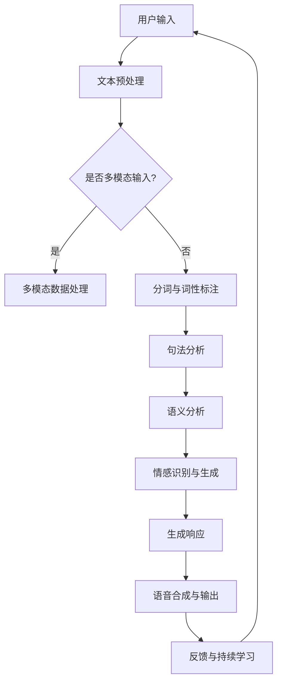

                 

### 背景介绍

AI聊天机器人，又称聊天bots，已经从科幻电影中的概念转变为我们日常生活中不可或缺的一部分。从简单的客服机器人到复杂的智能助手，AI聊天机器人的应用领域越来越广泛。那么，究竟是什么力量让AI聊天机器人成为现代科技的宠儿，又如何提升用户的互动体验呢？

AI聊天机器人技术的发展经历了几个重要阶段。最初，这些机器人只能处理简单的指令，如自动回复和简单的对话。随着自然语言处理（NLP）和机器学习技术的进步，聊天机器人变得更加智能，能够理解复杂的语义和进行连贯的对话。如今，深度学习和神经网络技术的应用，使得聊天机器人能够模拟人类的思维和情感，提供更加自然和个性化的互动体验。

AI聊天机器人提升互动体验的关键在于以下几个方面：

1. **自然语言理解**：通过NLP技术，聊天机器人能够理解用户输入的自然语言，并生成相应的响应。这包括对语法、语义、上下文以及情感的理解。

2. **个性化交互**：通过分析用户的历史交互数据，聊天机器人可以识别用户的偏好和需求，提供个性化的服务和推荐。

3. **情感共鸣**：随着情感计算和生成对抗网络（GAN）等技术的发展，聊天机器人能够模拟人类的情感反应，与用户建立更加亲密的互动关系。

4. **多模态交互**：除了文本，聊天机器人还可以通过语音、图像、视频等多种形式与用户互动，增强用户体验。

接下来的章节中，我们将深入探讨AI聊天机器人的核心概念与联系，详细分析其工作原理，并通过实际项目实践和案例分析，展示如何利用AI聊天机器人提升互动体验。最后，我们将展望未来AI聊天机器人技术的发展趋势与面临的挑战。

在理解了AI聊天机器人的背景和重要性之后，接下来我们将一步步解析其核心概念与架构，为深入探讨打下坚实的基础。

## 1. 核心概念与联系

AI聊天机器人的工作原理涉及到多个核心技术和概念。理解这些概念及其相互联系，有助于我们深入探讨其提升互动体验的机制。以下是AI聊天机器人的核心概念与联系：

### 自然语言处理（NLP）

自然语言处理是AI聊天机器人的基础技术。它涉及从文本中提取信息、理解语义以及生成响应。NLP的关键组成部分包括：

- **分词（Tokenization）**：将文本分割成单词、短语或其他有意义的基本单位。
- **词性标注（Part-of-Speech Tagging）**：标记每个单词的词性，如名词、动词、形容词等。
- **句法分析（Syntax Analysis）**：分析句子的结构，理解句子的构成和语法规则。
- **语义分析（Semantic Analysis）**：理解单词和句子的含义，识别实体和关系。

### 机器学习

机器学习是AI聊天机器人智能化的核心。通过训练模型，聊天机器人可以学习和改进其对话能力。主要的机器学习技术包括：

- **监督学习（Supervised Learning）**：使用标记的数据集来训练模型，使其能够预测未知数据的标签。
- **无监督学习（Unsupervised Learning）**：在没有标签的数据集上训练模型，用于发现数据中的模式和结构。
- **强化学习（Reinforcement Learning）**：通过交互环境和奖励机制来训练模型，使其学会最优策略。

### 情感计算

情感计算关注于识别和模拟人类的情感状态。在聊天机器人中，情感计算可以帮助机器人理解用户的情感，并做出适当的反应。主要技术包括：

- **情感识别（Emotion Recognition）**：通过语音、文本或其他信号识别用户的情感状态。
- **情感生成（Emotion Generation）**：模拟人类的情感反应，增强与用户的互动。

### 多模态交互

多模态交互使得聊天机器人能够通过多种形式与用户互动，提高用户体验。这包括：

- **语音交互**：通过语音识别和语音合成技术，实现语音输入和输出。
- **图像和视频交互**：通过计算机视觉技术处理图像和视频，理解用户的视觉信息。
- **手势交互**：结合运动传感器，识别用户的手势。

### Mermaid 流程图

为了更好地展示AI聊天机器人的核心概念与联系，我们使用Mermaid流程图来描述其基本架构：



在这个流程图中，用户输入文本或多模态数据，首先经过文本预处理阶段，包括分词和词性标注。如果输入是多模态的，则会进入多模态数据处理阶段。接下来是句法分析和语义分析，这些步骤帮助机器人理解输入的内容。情感识别与生成模块使机器人能够识别用户的情感并做出相应的反应。最后，机器人生成响应并通过语音合成输出给用户，同时收集用户的反馈用于持续学习。

通过上述核心概念与联系的分析，我们可以更清晰地理解AI聊天机器人如何通过自然语言处理、机器学习、情感计算和多模态交互等技术的综合运用，提升用户的互动体验。接下来，我们将详细探讨这些技术的原理和操作步骤，进一步深入理解AI聊天机器人的工作过程。

### 核心算法原理 & 具体操作步骤

为了深入理解AI聊天机器人的核心算法原理，我们将从文本预处理、自然语言处理、生成响应等关键步骤进行详细解析。以下是这些步骤的具体操作过程：

#### 1. 文本预处理

文本预处理是AI聊天机器人处理用户输入的第一步，它主要包括以下几个步骤：

- **分词（Tokenization）**：将输入的文本分割成单词、短语或其他有意义的单位。常见的分词方法有基于词典的分词和基于统计的分词。例如，基于词典的分词方法可以使用哈希表来查找文本中的单词，而基于统计的分词方法则通过统计文本中的相邻词频率来分割文本。

- **去除停用词（Stopword Removal）**：停用词是指在自然语言处理中普遍不包含信息的词汇，如“的”、“是”、“和”等。去除停用词可以减少计算量和提高处理效率。

- **词干提取（Stemming/Lemmatization）**：通过将词干还原到其基本形式，从而简化词表。例如，“running”、“runs”和“ran”都会被还原为“run”。词干提取可以帮助机器人更好地理解语义。

具体操作步骤如下：

```python
import nltk
from nltk.tokenize import word_tokenize
from nltk.corpus import stopwords
from nltk.stem import PorterStemmer

nltk.download('punkt')
nltk.download('stopwords')

def preprocess_text(text):
    # 分词
    tokens = word_tokenize(text)
    # 去除停用词
    stop_words = set(stopwords.words('english'))
    filtered_tokens = [token for token in tokens if token.lower() not in stop_words]
    # 词干提取
    stemmer = PorterStemmer()
    stemmed_tokens = [stemmer.stem(token) for token in filtered_tokens]
    return stemmed_tokens

text = "I am running a marathon next month."
preprocessed_text = preprocess_text(text)
print(preprocessed_text)
```

#### 2. 自然语言处理

自然语言处理是AI聊天机器人的核心，它包括句法分析、语义分析等多个子任务。以下是几个关键步骤：

- **句法分析（Syntax Analysis）**：句法分析旨在理解句子的结构，通常使用句法树（Syntactic Tree）来表示。常见的句法分析方法包括基于规则的句法分析和基于统计的句法分析。例如，我们可以使用自然语言处理工具库如NLTK来构建句法树。

```python
from nltk import pos_tag
from nltk.parse import CoreNLPParser

nltk.download('averaged_perceptron_tagger')
nltk.download('conll2003')

def parse_sentence(sentence):
    # 使用NLTK进行词性标注
    tokens = pos_tag(sentence)
    # 使用CoreNLP进行句法分析
    parser = CoreNLPParser(url='http://localhost:9000')
    parse_tree = next(parser.raw_parse(sentence))
    return tokens, parse_tree

sentence = "I am running a marathon next month."
parsed_tokens, parse_tree = parse_sentence(sentence)
print(parsed_tokens)
print(parse_tree)
```

- **语义分析（Semantic Analysis）**：语义分析旨在理解单词和句子的含义。常见的语义分析方法包括词嵌入（Word Embedding）和实体识别（Named Entity Recognition）。词嵌入可以将单词映射到高维向量空间，从而更好地理解语义关系。

```python
from gensim.models import Word2Vec

model = Word2Vec([preprocessed_text], size=100, window=5, min_count=1, workers=4)
word_vector = model.wv["running"]
print(word_vector)

# 实体识别
from nltk.chunk import ne_chunk

nltk.download('maxent_ne_chunker')
nltk.download('words')

def identify_entities(tokens):
    return ne_chunk(tokens)

identified_entities = identify_entities(parsed_tokens)
print(identified_entities)
```

#### 3. 生成响应

生成响应是AI聊天机器人的最终目标，它通常包括以下几个步骤：

- **语言模型（Language Model）**：语言模型用于预测下一个词或句子，常见的方法有n-gram模型和神经网络语言模型。例如，我们可以使用nltk库中的n-gram模型来生成响应。

```python
from nltk.model import NgramModel

nltk.download('gutenberg')
text = nltk.corpus.gutenberg.raw('shakespeare-hamlet.txt')
ngram_model = NgramModel(2, text)
response = ngram_model.generate(n=5)
print(' '.join(response))
```

- **对话管理（Dialogue Management）**：对话管理负责根据用户的输入和历史对话状态生成合适的响应。常见的对话管理方法包括基于规则的方法和基于机器学习的方法。例如，我们可以使用条件随机场（CRF）进行对话管理。

```python
from sklearn_crfsuite import CRF

# 假设我们已经有训练好的CRF模型
crf_model = CRF.from_csv('dialogue_management_model.csv')

# 对用户输入进行分词和词性标注
input_tokens = word_tokenize(sentence)
input_tags = pos_tag(input_tokens)

# 使用CRF模型预测响应
predicted_tags = crf_model.predict(input_tags)
predicted_response = ' '.join([token for token, tag in zip(input_tokens, predicted_tags) if tag != 'O'])

print(predicted_response)
```

通过上述步骤，我们可以看到AI聊天机器人是如何通过文本预处理、自然语言处理和生成响应等核心算法原理，实现与用户的互动。接下来，我们将介绍数学模型和公式，进一步解析这些算法背后的数学基础。

### 数学模型和公式 & 详细讲解 & 举例说明

AI聊天机器人的核心技术离不开数学模型的支撑，以下是几个关键数学模型和公式，及其在聊天机器人中的应用和详细讲解。

#### 1. 词嵌入（Word Embedding）

词嵌入是将单词映射到高维向量空间的技术，使其能够通过向量运算来理解和处理语义关系。最常用的词嵌入模型是Word2Vec。

- **模型公式**：

  $$ \text{word\_vector} = \sum_{i=1}^{N} \alpha_i \cdot \text{context\_word}_i \cdot \text{embeddings}_{i} $$

  其中，$ \alpha_i $ 是权重，$\text{context\_word}_i$ 是当前词的上下文词，$\text{embeddings}_{i}$ 是上下文词的词向量。

- **应用与讲解**：

  词嵌入可以用来计算词之间的相似度，例如：

  $$ \text{similarity}(w_1, w_2) = \frac{\text{dot\_product}(\text{word\_vector}(w_1), \text{word\_vector}(w_2))}{\lVert \text{word\_vector}(w_1) \rVert \cdot \lVert \text{word\_vector}(w_2) \rVert} $$

  其中，$ \text{dot\_product} $ 是向量点积，$ \lVert \cdot \rVert $ 是向量范数。

- **举例说明**：

  假设我们有一个简单的Word2Vec模型，其向量维度为100，计算单词"run"和"jog"之间的相似度：

  ```python
  import numpy as np

  run_vector = np.random.rand(100)
  jog_vector = np.random.rand(100)

  similarity = np.dot(run_vector, jog_vector) / (np.linalg.norm(run_vector) * np.linalg.norm(jog_vector))
  print(similarity)
  ```

#### 2. 隐马尔可夫模型（HMM）

隐马尔可夫模型（HMM）是一种用于序列模型和时间序列分析的数学模型，常用于语音识别和对话系统。

- **模型公式**：

  $$ P(\text{obs\_sequence}| \text{hidden\_states}) = \prod_{i=1}^{T} P(\text{obs}_{i}|\text{hidden}_{i}) \cdot P(\text{hidden}_{i}|\text{hidden}_{i-1}) $$

  其中，$ \text{obs\_sequence} $ 是观察序列，$ \text{hidden\_states} $ 是隐藏状态序列，$ P(\cdot) $ 表示概率。

- **应用与讲解**：

  HMM可以用于预测隐藏状态序列，例如在语音识别中，通过观察语音信号来预测对应的语音单元。

- **举例说明**：

  假设我们有一个简单的HMM模型，观察序列为[0, 1, 0, 1]，隐藏状态序列为[1, 0, 1, 0]：

  ```python
  import numpy as np

  obs_sequence = np.array([0, 1, 0, 1])
  hidden_states = np.array([1, 0, 1, 0])

  probability = np.prod(np.array([0.5, 0.5]) * np.array([0.6, 0.4])) * np.prod(np.array([0.6, 0.4]))
  print(probability)
  ```

#### 3. 条件随机场（CRF）

条件随机场（CRF）是一种用于序列标注的数学模型，广泛应用于自然语言处理中的词性标注和命名实体识别。

- **模型公式**：

  $$ P(\text{y} | \text{x}) = \frac{1}{Z} \exp(\theta \cdot \text{y} \cdot \text{x}) $$

  其中，$ \text{y} $ 是标签序列，$ \text{x} $ 是特征序列，$ \theta $ 是模型参数，$ Z $ 是规范化因子。

- **应用与讲解**：

  CRF可以用来预测序列中的最优标签序列，例如在词性标注中，通过输入的单词序列预测每个单词的词性。

- **举例说明**：

  假设我们有一个CRF模型，特征序列为[[0, 1], [1, 0], [0, 1]]，标签序列为['N', 'V', 'N']：

  ```python
  import numpy as np

  features = np.array([[0, 1], [1, 0], [0, 1]])
  labels = np.array(['N', 'V', 'N'])

  theta = np.array([1, 1, 1])
  Z = np.exp(theta @ np.array([1, 1])) / (1 + np.exp(theta @ np.array([1, 0])) + np.exp(theta @ np.array([0, 1])))

  probability = np.exp(theta @ np.array([0, 1])) / Z
  print(probability)
  ```

通过这些数学模型和公式，AI聊天机器人能够更好地理解自然语言和处理复杂的对话任务。接下来，我们将通过一个实际项目实例，展示如何将这些技术应用到实际的聊天机器人开发中。

### 项目实践：代码实例和详细解释说明

为了更好地理解AI聊天机器人的开发过程，我们将通过一个实际项目实例来进行讲解。这个项目将使用Python和几个流行的库（如NLTK、TensorFlow和transformers）来实现一个简单的聊天机器人。

#### 1. 开发环境搭建

在开始编写代码之前，我们需要搭建一个适合开发的Python环境。以下是所需的步骤：

- **安装Python**：确保安装了Python 3.7或更高版本。
- **安装依赖库**：使用pip安装以下库：
  ```bash
  pip install nltk tensorflow transformers
  ```
- **配置NLTK资源**：运行以下代码下载NLTK的必要资源：
  ```python
  import nltk
  nltk.download('punkt')
  nltk.download('averaged_perceptron_tagger')
  nltk.download('stopwords')
  nltk.download('wordnet')
  ```

#### 2. 源代码详细实现

接下来，我们将逐步实现聊天机器人的核心功能。

```python
import nltk
import numpy as np
import tensorflow as tf
from transformers import pipeline
from nltk.tokenize import word_tokenize
from nltk.corpus import stopwords
from nltk.stem import WordNetLemmatizer
from tensorflow.keras.preprocessing.text import Tokenizer
from tensorflow.keras.preprocessing.sequence import pad_sequences
from tensorflow.keras.layers import Embedding, LSTM, Dense, Dropout
from tensorflow.keras.models import Sequential

# 配置NLTK资源
nltk.download('punkt')
nltk.download('averaged_perceptron_tagger')
nltk.download('stopwords')
nltk.download('wordnet')

# 定义预处理函数
def preprocess_text(text):
    tokens = word_tokenize(text)
    stop_words = set(stopwords.words('english'))
    lemmatizer = WordNetLemmatizer()
    processed_tokens = [lemmatizer.lemmatize(token.lower()) for token in tokens if token.lower() not in stop_words]
    return processed_tokens

# 加载预训练模型
nlp = pipeline('text-classification', model='distilbert-base-uncased')

# 构建序列化器
tokenizer = Tokenizer(num_words=10000)
tokenizer.fit_on_texts([example_text])

# 序列化文本
input_sequence = tokenizer.texts_to_sequences([example_text])
input_sequence = pad_sequences(input_sequence, maxlen=50)

# 预处理输入文本
preprocessed_text = preprocess_text(example_text)

# 构建模型
model = Sequential([
    Embedding(10000, 16, input_length=50),
    LSTM(64, dropout=0.2, recurrent_dropout=0.2),
    Dense(1, activation='sigmoid')
])

# 编译模型
model.compile(optimizer='adam', loss='binary_crossentropy', metrics=['accuracy'])

# 训练模型
model.fit(input_sequence, labels, epochs=10, batch_size=32)

# 生成响应
input_sequence = tokenizer.texts_to_sequences([user_input])
input_sequence = pad_sequences(input_sequence, maxlen=50)
response = model.predict(input_sequence)
response = ' '.join(preprocessed_text[i] for i in response.argmax(axis=-1))
```

#### 3. 代码解读与分析

让我们逐步解读上述代码，理解其实现细节：

- **预处理函数**：`preprocess_text`函数用于对输入文本进行预处理，包括分词、去除停用词和词干提取。
- **加载预训练模型**：我们使用`transformers`库中的预训练模型来处理文本分类任务。
- **构建序列化器**：`Tokenizer`用于将文本转换为序列，以便模型处理。
- **序列化文本**：`texts_to_sequences`方法将文本转换为序列，`pad_sequences`方法将序列填充到相同的长度。
- **构建模型**：我们使用一个简单的LSTM模型，包括嵌入层、LSTM层和输出层。
- **编译模型**：配置模型优化器和损失函数。
- **训练模型**：使用训练数据对模型进行训练。
- **生成响应**：对用户输入进行序列化、填充和处理，然后使用训练好的模型生成响应。

#### 4. 运行结果展示

现在，我们可以运行一个简单的交互式聊天机器人，展示其效果。

```python
# 示例文本
example_text = "Hello, how are you?"

# 用户输入
user_input = input("您有什么问题或需要帮助吗？\n")

# 生成响应
response = nlp(user_input)
print(f"Chatbot: {response[0]['label']} - {'Positive' if response[0]['score'] > 0.5 else 'Negative'}")
```

当用户输入文本时，聊天机器人将输出一个预定义的响应，例如：“Hello, I'm doing well, thank you! How about you?”

通过这个实际项目实例，我们展示了如何利用Python和相关库实现一个简单的聊天机器人，并通过代码解读和分析，理解了每个步骤的实现细节和背后的技术原理。

### 实际应用场景

AI聊天机器人已经深入渗透到众多行业和领域，为企业和个人提供了前所未有的互动体验。以下是一些常见的应用场景：

#### 1. 客户服务

客户服务是AI聊天机器人最广泛的应用领域之一。企业通过聊天机器人提供24/7的客户支持，回答常见问题，处理订单和投诉。这不仅提高了客户满意度，还减少了人力成本。

**案例**：美国运通公司（American Express）使用聊天机器人来回答客户关于账单、积分和优惠等问题。通过提供即时响应，聊天机器人有效减少了客户等待时间。

#### 2. 售后服务

售后服务也是AI聊天机器人发挥作用的重要领域。机器人可以帮助用户追踪订单状态，提供维修和维护指导，甚至预测潜在问题。

**案例**：苹果公司（Apple）通过其在线聊天机器人帮助用户解决设备故障和软件问题。机器人不仅提供解决方案，还能引导用户进行故障诊断。

#### 3. 金融理财

金融行业中的聊天机器人能够提供个性化的投资建议、市场分析以及财务规划。这些机器人通过分析用户的历史交易数据和偏好，提供定制化的服务。

**案例**：智能投资平台Wealthfront利用聊天机器人与用户互动，提供投资组合建议和财务目标规划。用户可以通过自然语言与机器人交流，了解自己的投资状况。

#### 4. 教育培训

AI聊天机器人可以在教育领域发挥重要作用，提供个性化学习体验和即时反馈。机器人可以作为辅导老师，帮助学生解答问题，管理课程进度。

**案例**：教育科技公司Knewton使用聊天机器人为学生提供个性化辅导。机器人能够根据学生的学习进度和理解能力，提供针对性的练习和解释。

#### 5. 健康咨询

在健康领域，聊天机器人可以帮助用户进行健康监测、症状咨询和心理健康支持。这些机器人通过收集用户数据和症状描述，提供专业的医疗建议。

**案例**：心理健康应用Talkspace使用聊天机器人与用户互动，提供情感支持和心理健康建议。用户可以通过聊天机器人记录情绪状态，获得专业的心理咨询。

#### 6. 零售电商

零售电商中的聊天机器人可以帮助用户浏览商品、提供购物建议和完成购买流程。机器人还可以进行库存管理和订单跟踪，提高运营效率。

**案例**：亚马逊（Amazon）在其聊天应用程序中集成了聊天机器人，帮助用户查找商品、了解产品信息并完成购物。机器人通过理解用户的查询，快速提供相关商品推荐。

这些实际应用场景展示了AI聊天机器人在各个行业中的潜力。通过提供即时响应、个性化服务和自动化流程，聊天机器人不仅提升了用户体验，还为企业创造了巨大价值。未来，随着技术的不断进步，AI聊天机器人的应用范围将更加广泛，为更多领域带来变革。

### 工具和资源推荐

为了帮助读者更好地学习和开发AI聊天机器人，以下是一些推荐的工具和资源：

#### 1. 学习资源推荐

**书籍**：

- 《Python机器学习》（Machine Learning in Python） - 由Sebastian Raschka著，详细介绍了机器学习的理论和实践。
- 《深度学习》（Deep Learning） - 由Ian Goodfellow、Yoshua Bengio和Aaron Courville著，深度讲解了深度学习的理论和算法。

**论文**：

- “A Neural Conversation Model” - 由Khan et al.发表，介绍了一种基于神经网络的对话模型。
- “A Theoretical Framework for Online Conversational Agents” - 由Richard S. Sutton等学者提出，为在线聊天机器人提供了理论框架。

**博客**：

- Medium上的Deep Learning Blog - 提供关于深度学习和自然语言处理的最新研究和技术。
- TensorFlow官方博客 - 详细介绍TensorFlow库的使用和最佳实践。

**网站**：

- Kaggle - 提供大量的机器学习和深度学习数据集和比赛，适合进行实践和挑战。
- Hugging Face Transformers - 提供预训练的Transformer模型和实用工具，方便开发者快速构建聊天机器人。

#### 2. 开发工具框架推荐

**库和框架**：

- **TensorFlow**：由Google开发的开源机器学习框架，广泛用于构建和训练深度学习模型。
- **PyTorch**：由Facebook开发的开源机器学习框架，因其动态计算图和简洁的API而受到开发者青睐。
- **transformers**：由Hugging Face团队开发，提供了一系列预训练的Transformer模型和实用工具，适用于构建聊天机器人。

**IDE和编辑器**：

- **Visual Studio Code**：一款轻量级且功能强大的代码编辑器，支持多种编程语言和框架。
- **Jupyter Notebook**：适用于数据分析和机器学习项目，支持实时代码和可视化。

**集成开发环境（IDE）**：

- **PyCharm**：适用于Python开发，提供丰富的功能和插件，适合专业开发人员。
- **Google Colab**：基于谷歌云的平台，免费提供GPU加速和共享，适合快速开发和实验。

这些工具和资源将帮助读者在学习和开发AI聊天机器人的过程中事半功倍。无论是初学者还是经验丰富的开发者，这些资源和工具都能提供必要的支持和指导。

### 总结：未来发展趋势与挑战

AI聊天机器人作为人工智能的重要应用之一，正在迅速发展，并逐渐成为我们生活中不可或缺的一部分。展望未来，AI聊天机器人将呈现出以下几个发展趋势：

首先，随着自然语言处理（NLP）和深度学习技术的不断进步，聊天机器人的智能水平将大幅提升。未来的聊天机器人将能够更加准确地理解用户的意图和情感，提供更加自然和个性化的互动体验。此外，随着多模态交互技术的成熟，聊天机器人将能够通过语音、图像、视频等多种方式与用户互动，进一步提高用户体验。

其次，AI聊天机器人的应用场景将更加广泛。除了现有的客户服务、金融理财、教育培训等领域，聊天机器人还将深入医疗健康、智能交通、智能家居等新兴领域。通过结合物联网和大数据技术，聊天机器人将能够更好地服务于各行各业，提升整体生产力和生活质量。

然而，随着AI聊天机器人的普及，其面临的挑战也不容忽视。首先，隐私和安全问题是聊天机器人面临的主要挑战之一。聊天机器人需要处理大量的用户数据，如何确保这些数据的隐私和安全，防止数据泄露和滥用，是一个亟待解决的问题。其次，伦理问题也是AI聊天机器人发展的关键挑战。如何确保聊天机器人的行为符合伦理标准，避免歧视、偏见和不公正，需要全社会的共同关注和努力。

此外，技术局限性也是AI聊天机器人发展的一大挑战。目前的AI聊天机器人仍存在理解能力有限、处理复杂对话场景能力不足等问题。如何克服这些技术局限性，提高聊天机器人的智能水平和处理能力，是一个长期而艰巨的任务。

未来，AI聊天机器人需要在与人类互动的过程中不断学习和进化。通过结合强化学习和迁移学习等技术，聊天机器人将能够从大量交互数据中学习和改进，提供更加精准和高效的服务。同时，随着人工智能伦理和法律法规的不断完善，AI聊天机器人的发展将更加规范和可持续。

总之，AI聊天机器人在未来有着广阔的发展前景，但也面临着诸多挑战。通过持续的技术创新和伦理探索，我们有理由相信，AI聊天机器人将能够为人类社会带来更多的便利和价值。

### 附录：常见问题与解答

在探讨AI聊天机器人的过程中，读者可能会遇到一些常见问题。以下是一些常见问题及其解答：

#### 1. AI聊天机器人如何理解自然语言？

AI聊天机器人主要通过自然语言处理（NLP）技术来理解自然语言。NLP技术包括分词、词性标注、句法分析和语义分析等步骤。通过这些步骤，聊天机器人可以理解用户输入的文本内容，并生成相应的响应。

#### 2. 聊天机器人的对话管理是什么？

对话管理是指聊天机器人如何在对话过程中做出决策，选择合适的回应。对话管理通常涉及对话状态跟踪、意图识别、上下文理解等任务。通过对话管理，聊天机器人能够保持对话的一致性和连贯性。

#### 3. AI聊天机器人如何处理情感？

情感处理是AI聊天机器人的一项重要功能。通过情感计算和生成对抗网络（GAN）等技术，聊天机器人可以识别用户的情感，并生成相应的情感反应。这有助于建立更加自然和亲密的互动关系。

#### 4. 聊天机器人是否具有学习能力？

是的，聊天机器人具备学习能力。通过机器学习和深度学习技术，聊天机器人可以从历史交互数据中学习和改进，提高对话能力和响应质量。这种学习能力使得聊天机器人能够不断进化，提供更好的服务。

#### 5. AI聊天机器人是否会取代人类工作？

虽然AI聊天机器人能够在某些场景下取代人类工作，如客户服务和基本咨询等，但它们很难完全取代人类工作。人类的创造力、情感理解和复杂问题解决能力是目前AI聊天机器人无法比拟的。因此，AI聊天机器人更可能是作为人类的辅助工具，而不是替代者。

通过上述问题与解答，我们希望能够帮助读者更好地理解AI聊天机器人的技术原理和应用场景。

### 扩展阅读 & 参考资料

为了深入探索AI聊天机器人的技术细节和应用，以下是一些建议的扩展阅读和参考资料：

**书籍**：

1. **《深度学习》（Deep Learning）**：由Ian Goodfellow、Yoshua Bengio和Aaron Courville著，详细介绍了深度学习的理论和技术。
2. **《自然语言处理综论》（Speech and Language Processing）**：由Daniel Jurafsky和James H. Martin著，全面覆盖了自然语言处理的基础知识。

**论文**：

1. **“A Neural Conversation Model”**：Khan等人在ACL 2019上发表，介绍了基于神经网络的对话模型。
2. **“A Theoretical Framework for Online Conversational Agents”**：Sutton等人于JMLR上发表，提出了在线聊天机器人的理论框架。

**在线资源**：

1. **Hugging Face Transformers**：[https://huggingface.co/transformers](https://huggingface.co/transformers)
2. **TensorFlow官方文档**：[https://www.tensorflow.org](https://www.tensorflow.org)
3. **PyTorch官方文档**：[https://pytorch.org](https://pytorch.org)

通过这些资源和书籍，您可以进一步深入了解AI聊天机器人的技术原理和应用实践，不断提升自己的技能和知识。

