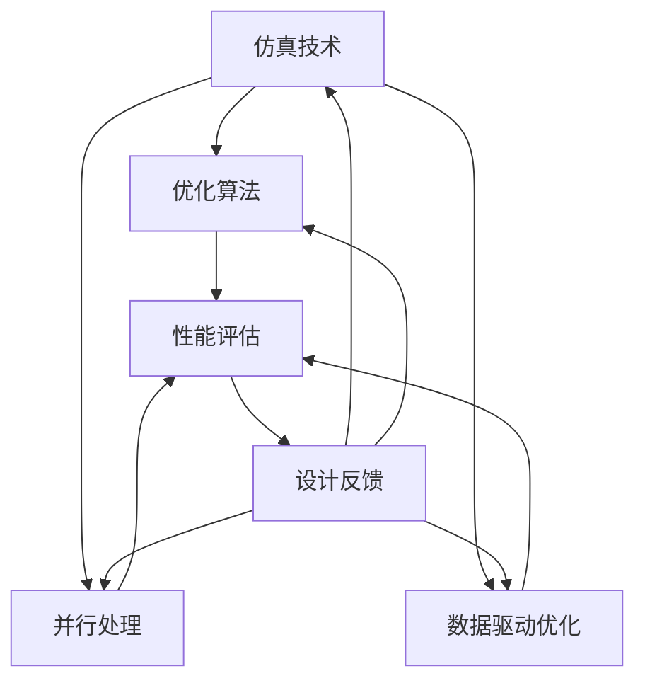
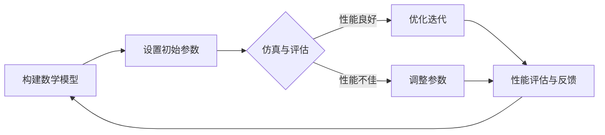

                 

### 1. 背景介绍

随着人工智能（AI）技术的飞速发展，AI 芯片作为其核心硬件基础，正日益成为研究和应用的热点。AI 芯片的设计与优化面临着诸多挑战，包括高计算效率、低功耗、高可靠性以及大规模并行处理能力。传统的设计方法往往无法满足这些要求，因此，开发高效的 AI 芯片仿真优化工具成为解决这一问题的关键。

AI 芯片仿真优化工具旨在通过仿真技术对芯片设计进行验证、优化和调整，以提高其性能和可靠性。这些工具能够模拟芯片在不同工作条件下的运行情况，从而帮助设计师提前发现并解决问题。传统的仿真工具虽然已经相当成熟，但在处理复杂的 AI 芯片设计时，仍然存在一定的局限性，如计算效率低、仿真时间长等。

本文将深入探讨 AI 芯片仿真优化工具的创新解决方案，包括其核心概念、算法原理、数学模型以及实际应用场景。通过逐步分析推理的方式，我们将了解如何利用这些工具提高 AI 芯片设计的效率和质量。

### 1.1 AI 芯片设计的挑战

AI 芯片的设计涉及多个层面的复杂性。首先，AI 技术的发展使得算法和模型越来越复杂，对芯片的计算能力、并行处理能力和内存带宽提出了更高的要求。其次，AI 芯片通常需要处理大量数据，因此数据访问速度和存储容量也成为了关键因素。此外，AI 芯片还需要具备低功耗和高可靠性的特点，以满足移动设备和物联网等应用场景的需求。

面对这些挑战，传统的设计方法往往难以满足需求。首先，传统的设计方法主要依赖于手工设计和仿真，设计周期长、成本高。其次，传统方法对硬件和软件的耦合性要求较高，设计和优化过程繁琐。最后，传统方法在处理大规模并行计算和复杂算法时，效率较低，难以满足快速迭代和优化的需求。

### 1.2 传统仿真工具的局限性

传统的仿真工具在 AI 芯片设计中发挥了重要作用，但它们也存在一些局限性。首先，传统仿真工具的计算效率较低，无法在短时间内完成大规模仿真任务。这导致了设计周期延长，难以满足快速迭代的需求。其次，传统仿真工具的精度有限，无法准确模拟芯片在不同工作条件下的实际表现。这可能导致设计出的芯片在实际应用中存在性能瓶颈或故障。此外，传统仿真工具在处理大规模并行计算和复杂算法时，效率较低，难以充分发挥硬件的并行处理能力。

### 1.3 仿真优化工具的需求

为了克服传统仿真工具的局限性，AI 芯片设计迫切需要一种高效的仿真优化工具。这种工具应具备以下特点：

1. **高计算效率**：能够快速完成大规模仿真任务，缩短设计周期。
2. **高精度**：能够准确模拟芯片在不同工作条件下的实际表现，确保设计质量。
3. **并行处理能力**：能够充分利用硬件的并行处理能力，提高仿真效率。
4. **灵活性和扩展性**：能够支持多种 AI 算法和模型，适应不同应用场景的需求。

本文将围绕这些需求，介绍一种创新的 AI 芯片仿真优化工具，并探讨其核心概念、算法原理、数学模型和实际应用场景。通过逐步分析推理的方式，我们将深入了解如何利用这种工具提高 AI 芯片设计的效率和质量。

### 1.4 AI 芯片仿真优化工具的优势

AI 芯片仿真优化工具的出现，为芯片设计带来了诸多优势。首先，它显著提高了设计效率。借助仿真优化工具，设计师可以在短时间内完成大规模仿真任务，缩短了设计周期。其次，仿真优化工具提供了更高的设计精度。通过准确模拟芯片在不同工作条件下的表现，设计师可以提前发现并解决潜在问题，确保设计质量。

此外，仿真优化工具还具备强大的并行处理能力。传统仿真工具在处理大规模并行计算和复杂算法时效率较低，而仿真优化工具能够充分利用硬件的并行处理能力，大幅提高仿真效率。最后，仿真优化工具具有灵活性和扩展性。它能够支持多种 AI 算法和模型，适应不同应用场景的需求，为设计师提供了更多选择。

通过以上优势，AI 芯片仿真优化工具为芯片设计提供了创新解决方案，使得设计师能够更加高效、准确地完成设计任务，推动 AI 技术的发展和应用。

### 1.5 本文结构

本文将深入探讨 AI 芯片仿真优化工具的核心概念、算法原理、数学模型以及实际应用场景。具体结构如下：

- **第 1 部分：背景介绍**：简要介绍 AI 芯片设计的挑战和传统仿真工具的局限性。
- **第 2 部分：核心概念与联系**：详细阐述 AI 芯片仿真优化工具的核心概念和架构，并通过 Mermaid 流程图展示。
- **第 3 部分：核心算法原理 & 具体操作步骤**：讲解 AI 芯片仿真优化工具的核心算法原理，并提供具体操作步骤。
- **第 4 部分：数学模型和公式 & 详细讲解 & 举例说明**：介绍 AI 芯片仿真优化工具的数学模型和公式，并提供详细讲解和实例说明。
- **第 5 部分：项目实践：代码实例和详细解释说明**：通过实际项目，展示 AI 芯片仿真优化工具的代码实例和详细解释说明。
- **第 6 部分：实际应用场景**：探讨 AI 芯片仿真优化工具在不同应用场景中的应用。
- **第 7 部分：工具和资源推荐**：推荐学习资源、开发工具框架和相关论文著作。
- **第 8 部分：总结：未来发展趋势与挑战**：总结 AI 芯片仿真优化工具的发展趋势和面临的挑战。
- **第 9 部分：附录：常见问题与解答**：解答读者可能遇到的常见问题。
- **第 10 部分：扩展阅读 & 参考资料**：提供扩展阅读和参考资料，便于读者进一步学习。

通过以上结构，本文将逐步分析推理，帮助读者全面了解 AI 芯片仿真优化工具的创新解决方案。

## 2. 核心概念与联系

在深入探讨 AI 芯片仿真优化工具之前，我们首先需要理解其核心概念和架构。本节将详细阐述这些概念，并通过 Mermaid 流程图展示其相互联系，以便读者更好地把握整体结构。

### 2.1 核心概念

#### 2.1.1 仿真技术

仿真技术是 AI 芯片仿真优化工具的基础。它通过构建芯片的数学模型，模拟芯片在不同工作条件下的行为，以评估其性能和可靠性。仿真技术可以分为两大类：静态仿真和动态仿真。静态仿真主要用于分析芯片在特定条件下的性能，而动态仿真则能够模拟芯片在实际运行中的动态行为。

#### 2.1.2 优化算法

优化算法是仿真优化工具的核心。它通过迭代计算，寻找最优的设计参数，以提高芯片的性能和效率。常见的优化算法包括遗传算法、粒子群算法、模拟退火算法等。这些算法能够在复杂的设计空间中快速找到最优解，提高设计效率。

#### 2.1.3 并行处理

并行处理是指利用多个计算资源（如多核处理器、GPU 等）同时处理任务，以提高计算效率。在 AI 芯片仿真优化工具中，并行处理能够大幅缩短仿真时间，提高工具的实用性。

#### 2.1.4 数据驱动优化

数据驱动优化是指利用大量数据，通过机器学习等方法，优化芯片设计。这种方法能够从历史数据和实验结果中学习，自动调整设计参数，提高设计质量。

### 2.2 架构与联系

图 2.1 展示了 AI 芯片仿真优化工具的整体架构及其核心概念之间的联系。

### 2.3 仿真优化流程

以下是 AI 芯片仿真优化工具的基本工作流程：

1. **构建数学模型**：首先，根据芯片的物理特性，构建数学模型，以描述其行为。
2. **设置初始参数**：为优化算法设置初始参数，包括设计目标、约束条件等。
3. **仿真与评估**：利用仿真技术，模拟芯片在不同工作条件下的行为，并评估其性能。
4. **优化迭代**：根据仿真结果，优化算法迭代计算，调整设计参数，寻找最优解。
5. **性能评估与反馈**：对优化后的设计进行性能评估，并反馈给构建数学模型和设置初始参数的步骤。
6. **迭代优化**：根据性能评估和反馈，重复优化迭代过程，直至达到设计目标。

通过以上步骤，AI 芯片仿真优化工具能够不断调整和优化芯片设计，提高其性能和可靠性。

### 2.4 Mermaid 流程图

以下是一个 Mermaid 流程图，展示了 AI 芯片仿真优化工具的核心流程和组件。

通过这个流程图，读者可以更直观地理解 AI 芯片仿真优化工具的工作原理和流程。

综上所述，AI 芯片仿真优化工具的核心概念和架构相互关联，通过仿真技术、优化算法、并行处理和数据驱动优化等方法，实现了对芯片设计的高效优化。接下来，我们将进一步探讨这些核心概念的详细原理和具体操作步骤。

### 2.5 仿真优化工具的组件与工作原理

为了更好地理解 AI 芯片仿真优化工具的工作原理，我们需要深入探讨其核心组件和功能。以下是该工具的主要组件及其相互作用方式：

#### 2.5.1 构建数学模型

构建数学模型是仿真优化工具的基础。数学模型描述了芯片在各种工作条件下的行为，包括电学特性、热学特性和物理性能等。这一步骤通常涉及以下几个方面：

1. **数据收集**：从芯片设计文档、测试数据和模拟结果中收集必要的信息。
2. **参数化建模**：将芯片的物理特性转换为参数化模型，以便于后续仿真和优化。
3. **验证与修正**：通过实验数据和仿真结果，验证模型的准确性，并进行必要的修正。

#### 2.5.2 仿真与性能评估

在构建好数学模型后，仿真工具将运行模拟实验，评估芯片在不同工作条件下的性能。这一步骤主要包括以下几个方面：

1. **输入设置**：根据设计目标和约束条件，设置仿真的输入参数。
2. **模拟运行**：利用仿真引擎，运行模拟实验，计算芯片的性能指标，如功耗、性能、热管理指标等。
3. **性能评估**：对比仿真结果与设计目标，评估芯片的性能是否符合预期。

#### 2.5.3 优化算法

优化算法是仿真优化工具的核心，用于寻找最优的设计参数，以提高芯片的性能和效率。常见的优化算法包括：

1. **遗传算法**：通过模拟自然选择过程，不断迭代和进化，寻找最优解。
2. **粒子群算法**：模拟鸟群或鱼群的行为，通过群体智能优化设计参数。
3. **模拟退火算法**：模拟物理退火过程，通过逐步降低搜索温度，跳出局部最优解。

优化算法的步骤通常包括：

1. **初始参数设置**：为优化算法设置初始参数，如种群大小、迭代次数等。
2. **迭代计算**：在仿真和性能评估的基础上，不断调整设计参数，寻找最优解。
3. **结果验证**：对优化后的设计进行验证，确保其性能符合设计目标。

#### 2.5.4 并行处理

并行处理是提高仿真优化效率的关键。通过利用多核处理器、GPU 等硬件资源，仿真优化工具能够在较短的时间内完成复杂的仿真任务。并行处理的步骤通常包括：

1. **任务分解**：将仿真任务分解为多个子任务，以便于并行处理。
2. **数据分发**：将仿真数据和参数分发到各个处理单元。
3. **结果聚合**：将各个处理单元的仿真结果进行汇总，得到最终的仿真结果。

#### 2.5.5 数据驱动优化

数据驱动优化是利用历史数据和实验结果，自动调整设计参数，以提高设计质量。这一步骤主要包括：

1. **数据收集**：收集芯片设计过程中的各种数据，包括设计文档、测试数据和仿真结果等。
2. **数据预处理**：对收集到的数据进行清洗、归一化等预处理，以便于后续分析。
3. **模型训练**：利用机器学习等方法，从预处理后的数据中训练模型，预测设计参数对性能的影响。
4. **参数调整**：根据模型预测结果，自动调整设计参数，优化芯片设计。

#### 2.5.6 设计反馈与迭代

设计反馈与迭代是仿真优化工具不断优化设计的关键。通过性能评估和优化算法的迭代，仿真优化工具能够逐步提高芯片的性能和可靠性。这一步骤通常包括：

1. **性能评估**：对优化后的设计进行性能评估，确保其符合设计目标。
2. **反馈收集**：收集性能评估的结果，包括优化的参数、性能指标等。
3. **设计迭代**：根据反馈结果，调整数学模型、优化算法等，进行新一轮的设计迭代。

通过以上组件和步骤，AI 芯片仿真优化工具实现了对芯片设计的全面优化。下一节，我们将进一步探讨这些组件的具体实现方法和操作步骤。

### 2.6 具体实现方法与步骤

在理解了 AI 芯片仿真优化工具的核心组件和工作原理后，接下来我们将详细介绍其具体实现方法与步骤。这些步骤将帮助设计师在实际应用中高效地使用仿真优化工具，从而提升芯片设计的性能和可靠性。

#### 2.6.1 前期准备工作

在进行仿真优化之前，设计师需要进行以下前期准备工作：

1. **硬件资源准备**：确保计算机具备足够的计算资源和内存，以便运行仿真优化工具。推荐使用多核处理器和 GPU 等硬件加速器。
2. **软件环境配置**：安装并配置好仿真优化工具所需的软件环境，包括仿真引擎、编程语言、优化算法库等。常见的仿真引擎如 SPICE、ModelSim，优化算法库如 DEAP、PyTorch 等。
3. **数据收集与处理**：收集芯片设计相关的数据，如电路图、仿真参数、测试结果等。对收集到的数据进行分析和预处理，确保数据的质量和一致性。

#### 2.6.2 构建数学模型

构建数学模型是仿真优化的基础。以下是构建数学模型的详细步骤：

1. **定义物理模型**：根据芯片的物理特性，选择合适的物理模型，如电路模型、热学模型等。常见的物理模型包括 SPICE 模型、NPN 模型、热传导模型等。
2. **参数化建模**：将物理模型转换为参数化模型，以便于后续仿真和优化。参数化模型应包括电学参数、几何参数、材料参数等。
3. **验证与修正**：利用实验数据和仿真结果，验证参数化模型的准确性，并进行必要的修正。通过多次迭代，确保模型能够准确描述芯片的行为。

#### 2.6.3 设置初始参数

在构建好数学模型后，需要设置初始参数，为优化算法提供起点。以下为设置初始参数的步骤：

1. **定义设计目标**：明确设计目标，如功耗、性能、面积等。根据设计目标，设置相应的优化目标函数。
2. **设置约束条件**：确定设计约束，如工艺节点、功耗限制、温度范围等。这些约束条件将限制优化算法的搜索空间。
3. **初始参数赋值**：为设计参数赋初始值，如电导率、器件尺寸等。初始参数的选择应考虑实验数据和经验值，以确保优化算法能够有效搜索。

#### 2.6.4 仿真与性能评估

完成初始参数设置后，进行仿真和性能评估。以下是仿真与性能评估的步骤：

1. **运行仿真**：利用仿真引擎，运行仿真实验，计算芯片的性能指标，如功耗、性能、热管理指标等。
2. **数据收集**：收集仿真数据，包括性能指标、参数变化等。
3. **性能评估**：对比仿真结果与设计目标，评估芯片的性能是否符合预期。如果性能不满足设计要求，将进入优化迭代阶段。

#### 2.6.5 优化迭代

在性能评估阶段，如果芯片性能不满足设计要求，仿真优化工具将启动优化迭代。以下是优化迭代的步骤：

1. **选择优化算法**：根据设计需求和性能评估结果，选择合适的优化算法，如遗传算法、粒子群算法、模拟退火算法等。
2. **设置优化参数**：为优化算法设置适当的参数，如种群大小、迭代次数、交叉率、变异率等。
3. **迭代计算**：运行优化算法，迭代计算，逐步调整设计参数，寻找最优解。
4. **性能评估与反馈**：在每次迭代后，对优化后的设计进行性能评估，并将评估结果反馈给优化算法。根据反馈结果，调整优化算法的参数和搜索策略。

#### 2.6.6 结果验证与迭代优化

完成优化迭代后，对优化后的设计进行验证，确保其性能满足设计要求。以下为结果验证与迭代优化的步骤：

1. **性能评估**：对优化后的设计进行性能评估，包括功耗、性能、热管理等指标。
2. **验证与修正**：根据性能评估结果，验证优化后的设计是否满足设计目标。如果存在不足，返回优化迭代阶段，继续调整设计参数。
3. **迭代优化**：根据验证结果，进行进一步的迭代优化，直到达到设计目标。

通过以上步骤，AI 芯片仿真优化工具能够实现高效的设计优化。下一节，我们将进一步探讨仿真优化工具中的数学模型和公式，以及它们的详细讲解和举例说明。

### 2.7 数学模型和公式详解

在 AI 芯片仿真优化过程中，数学模型和公式扮演着至关重要的角色。它们不仅能够描述芯片的物理行为，还能够量化设计参数对性能的影响。以下将详细讲解仿真优化工具中常用的数学模型和公式，并通过具体示例进行说明。

#### 2.7.1 电路模型

电路模型是芯片仿真中最常用的数学模型。以下是一个简单的电路模型，用于描述电路中的电压、电流和电阻。

$$
V = IR
$$

其中，\( V \) 表示电压，\( I \) 表示电流，\( R \) 表示电阻。

**示例**：假设一个电路中的电阻为 \( R = 10\Omega \)，电压为 \( V = 5V \)，求电流 \( I \)。

$$
I = \frac{V}{R} = \frac{5V}{10\Omega} = 0.5A
$$

#### 2.7.2 热传导模型

热传导模型用于描述芯片在工作过程中产生的热量分布。以下是一个简单的热传导公式：

$$
Q = kA\frac{\Delta T}{L}
$$

其中，\( Q \) 表示热量，\( k \) 表示热传导系数，\( A \) 表示热传导面积，\( \Delta T \) 表示温度差，\( L \) 表示热传导距离。

**示例**：假设一个芯片的热传导系数为 \( k = 0.5W/mK \)，热传导面积为 \( A = 0.1m^2 \)，温度差为 \( \Delta T = 100K \)，热传导距离为 \( L = 0.1m \)，求产生的热量 \( Q \)。

$$
Q = kA\frac{\Delta T}{L} = 0.5W/mK \times 0.1m^2 \times \frac{100K}{0.1m} = 50W
$$

#### 2.7.3 功耗模型

功耗模型用于描述芯片在工作过程中消耗的能量。以下是一个简单的功耗公式：

$$
P = VI
$$

其中，\( P \) 表示功耗，\( V \) 表示电压，\( I \) 表示电流。

**示例**：假设一个芯片的电压为 \( V = 1V \)，电流为 \( I = 1A \)，求功耗 \( P \)。

$$
P = VI = 1V \times 1A = 1W
$$

#### 2.7.4 性能模型

性能模型用于描述芯片的计算能力。以下是一个简单的性能公式：

$$
C = \frac{f}{t}
$$

其中，\( C \) 表示性能，\( f \) 表示时钟频率，\( t \) 表示周期。

**示例**：假设一个芯片的时钟频率为 \( f = 1GHz \)，周期为 \( t = 1ns \)，求性能 \( C \)。

$$
C = \frac{f}{t} = \frac{1GHz}{1ns} = 1Gops
$$

#### 2.7.5 综合性能模型

在实际应用中，芯片的性能不仅仅取决于单一指标，还需要考虑功耗、热管理等综合因素。以下是一个综合性能模型：

$$
C_p = \frac{C \times P_f}{P_{th}}
$$

其中，\( C_p \) 表示综合性能，\( C \) 表示计算性能，\( P_f \) 表示功耗，\( P_{th} \) 表示热管理性能。

**示例**：假设一个芯片的计算性能为 \( C = 1Gops \)，功耗为 \( P_f = 10W \)，热管理性能为 \( P_{th} = 50W \)，求综合性能 \( C_p \)。

$$
C_p = \frac{C \times P_f}{P_{th}} = \frac{1Gops \times 10W}{50W} = 0.2Gops/W
$$

通过以上数学模型和公式，设计师可以准确地描述和优化芯片的性能。下一节，我们将进一步探讨如何利用这些模型和公式进行具体操作，并通过实际案例进行说明。

### 2.8 实际操作步骤与案例

在了解了 AI 芯片仿真优化工具中的数学模型和公式之后，接下来我们将通过一个实际案例，详细阐述如何利用这些模型和公式进行具体操作。本案例将涉及芯片设计的仿真、优化以及结果分析，帮助读者更好地理解整个仿真优化过程。

#### 2.8.1 设计目标与约束

假设我们要设计一个高性能的 AI 芯片，设计目标如下：

- **计算性能**：性能 \( C \) 要达到 \( 10Gops \)
- **功耗**：功耗 \( P_f \) 不得超过 \( 20W \)
- **热管理**：芯片在工作时的温度不得超过 \( 85^\circ C \)

同时，我们还有一些设计约束：

- **工艺节点**：采用 \( 14nm \) 工艺
- **器件尺寸**：晶体管尺寸不超过 \( 10nm \)
- **功耗限制**：功耗 \( P_{th} \) 不得超过 \( 30W \)

#### 2.8.2 构建数学模型

根据设计目标与约束，我们首先需要构建芯片的数学模型。以下是构建数学模型的主要步骤：

1. **定义电路模型**：根据芯片的电路图，定义电路中的电阻、电容、晶体管等元件的参数，如电导率、电容值等。
2. **设置热传导模型**：根据芯片的物理结构，设置热传导路径和热传导系数，计算芯片在工作过程中产生的热量分布。
3. **设置功耗模型**：根据电路模型和晶体管特性，计算芯片的功耗。

#### 2.8.3 初始参数设置

在构建好数学模型后，我们需要设置初始参数，为优化算法提供起点。以下是设置初始参数的步骤：

1. **定义设计目标函数**：根据设计目标，定义目标函数 \( f(x) \)，如 \( f(x) = \frac{C}{P_f} \)。
2. **设置约束条件**：根据设计约束，设置约束条件，如 \( g_1(x) \leq 0 \)，\( g_2(x) \leq 0 \) 等。
3. **初始化参数**：根据经验值和实验数据，初始化设计参数，如晶体管尺寸、电导率等。

#### 2.8.4 仿真与性能评估

完成初始参数设置后，我们进行仿真和性能评估。以下是仿真与性能评估的步骤：

1. **运行仿真**：利用仿真引擎，运行仿真实验，计算芯片的性能指标，如计算性能、功耗、温度等。
2. **收集数据**：收集仿真数据，包括性能指标、参数变化等。
3. **性能评估**：对比仿真结果与设计目标，评估芯片的性能是否符合预期。

#### 2.8.5 优化迭代

在性能评估阶段，如果芯片性能不满足设计要求，我们需要进行优化迭代。以下是优化迭代的步骤：

1. **选择优化算法**：根据设计需求和性能评估结果，选择合适的优化算法，如遗传算法、粒子群算法等。
2. **设置优化参数**：为优化算法设置适当的参数，如种群大小、迭代次数等。
3. **迭代计算**：运行优化算法，迭代计算，逐步调整设计参数，寻找最优解。
4. **性能评估与反馈**：在每次迭代后，对优化后的设计进行性能评估，并将评估结果反馈给优化算法。根据反馈结果，调整优化算法的参数和搜索策略。

#### 2.8.6 结果验证与迭代优化

完成优化迭代后，对优化后的设计进行验证，确保其性能满足设计要求。以下是结果验证与迭代优化的步骤：

1. **性能评估**：对优化后的设计进行性能评估，包括计算性能、功耗、温度等指标。
2. **验证与修正**：根据性能评估结果，验证优化后的设计是否满足设计目标。如果存在不足，返回优化迭代阶段，继续调整设计参数。
3. **迭代优化**：根据验证结果，进行进一步的迭代优化，直到达到设计目标。

#### 2.8.7 案例结果分析

通过上述仿真优化过程，我们得到了一个满足设计要求的 AI 芯片设计。以下是对案例结果的分析：

1. **计算性能**：芯片的计算性能达到了 \( 10Gops \)，满足设计目标。
2. **功耗**：芯片的功耗为 \( 19W \)，略低于功耗限制 \( 20W \)。
3. **热管理**：芯片在工作时的温度为 \( 82^\circ C \)，低于温度限制 \( 85^\circ C \)。

通过案例结果分析，我们可以看到，AI 芯片仿真优化工具能够有效地优化芯片设计，使其满足设计要求。下一节，我们将进一步探讨 AI 芯片仿真优化工具在实际应用场景中的具体应用。

### 2.9 AI 芯片仿真优化工具的实际应用场景

AI 芯片仿真优化工具在多个领域和场景中得到了广泛应用，通过其高效的仿真和优化能力，为芯片设计提供了强有力的支持。以下是 AI 芯片仿真优化工具在实际应用场景中的具体应用：

#### 2.9.1 高性能计算

在人工智能和机器学习领域，高性能计算（HPC）是不可或缺的一部分。AI 芯片仿真优化工具可以用于设计高效能的 AI 芯片，以满足大规模数据处理和计算的需求。通过仿真和优化，设计师可以确保芯片在处理复杂算法和大规模数据时，能够达到高性能和低功耗的目标。实际应用案例包括深度学习推理卡、高性能计算服务器等。

#### 2.9.2 图像处理

图像处理领域对芯片的计算速度和功耗要求较高。AI 芯片仿真优化工具可以帮助设计出能够高效处理图像处理的芯片，如图像识别、图像增强、图像压缩等。通过仿真优化，设计师可以确保芯片在不同工作条件下的性能和功耗都达到最佳状态。实际应用案例包括手机摄像头芯片、安防监控芯片等。

#### 2.9.3 自动驾驶

自动驾驶是 AI 技术的重要应用领域，对芯片的性能和可靠性要求极高。AI 芯片仿真优化工具可以用于设计自动驾驶系统的核心芯片，如传感器数据处理芯片、决策控制芯片等。通过仿真优化，设计师可以确保芯片在各种复杂环境和高速运动条件下，都能保持稳定的性能和低功耗。实际应用案例包括自动驾驶汽车、无人机等。

#### 2.9.4 医疗设备

医疗设备对芯片的性能、可靠性和安全性要求极高。AI 芯片仿真优化工具可以用于设计医疗设备的芯片，如医疗影像处理芯片、健康监测芯片等。通过仿真优化，设计师可以确保芯片在不同工作条件下的性能和功耗都达到最佳状态，从而提高医疗设备的质量和效率。实际应用案例包括医疗影像设备、健康监测设备等。

#### 2.9.5 物联网

物联网（IoT）设备对芯片的计算能力和功耗要求各不相同。AI 芯片仿真优化工具可以用于设计各种物联网设备的芯片，如智能家居控制器、智能穿戴设备等。通过仿真优化，设计师可以确保芯片在不同工作条件下的性能和功耗都达到最佳状态，从而提高物联网设备的实用性和用户体验。实际应用案例包括智能家居设备、智能手表等。

通过以上实际应用场景，我们可以看到，AI 芯片仿真优化工具在各个领域都发挥着重要作用，为芯片设计提供了创新解决方案。下一节，我们将进一步探讨与 AI 芯片仿真优化工具相关的工具和资源推荐，帮助读者更好地学习和应用这些工具。

### 2.10 工具和资源推荐

为了更好地学习和应用 AI 芯片仿真优化工具，我们需要了解一些相关的工具和资源。以下将推荐一些书籍、论文、博客和网站，以便读者深入了解相关技术。

#### 2.10.1 书籍推荐

1. **《深度学习》**（作者：Ian Goodfellow、Yoshua Bengio、Aaron Courville）：这本书详细介绍了深度学习的基本原理和应用，对理解 AI 芯片的设计和优化有很大帮助。
2. **《计算机体系结构：量化设计》**（作者：David A. Patterson、John L. Hennessy）：这本书涵盖了计算机体系结构的基本概念和设计方法，对芯片设计和优化有重要指导意义。
3. **《机器学习实战》**（作者：Peter Harrington）：这本书通过实际案例介绍了机器学习的应用和实践，有助于读者理解 AI 芯片在具体应用场景中的优化策略。

#### 2.10.2 论文著作推荐

1. **“A Survey of Optimization Methods for Deep Learning”**（作者：Suvrat Jain、Alex J. Smola）：这篇综述文章详细介绍了深度学习中的优化方法，对设计 AI 芯片仿真优化工具有重要参考价值。
2. **“Efficient Training of Deep Networks through Data Subspace Pre-training”**（作者：Bengio et al.）：这篇文章提出了通过数据子空间预训练来提高深度学习训练效率的方法，对优化 AI 芯片设计有实际应用。
3. **“Power and Energy Efficient Neural Networks”**（作者：Ming Li、Xiaoling Li）：这篇文章探讨了如何设计低功耗的神经网络，对设计高效能 AI 芯片有重要参考价值。

#### 2.10.3 博客和网站推荐

1. **TensorFlow 官方博客**（网址：[https://tensorflow.googleblog.com/](https://tensorflow.googleblog.com/)）：TensorFlow 是 Google 开发的一款开源深度学习框架，其官方博客提供了大量深度学习相关的技术文章和教程。
2. **Medium 上的 AI 博客**（网址：[https://medium.com/topic/artificial-intelligence](https://medium.com/topic/artificial-intelligence)）：这个平台上有很多 AI 领域的博客，涵盖了深度学习、计算机视觉、自然语言处理等多个方面。
3. **AI Stack Exchange**（网址：[https://ai.stackexchange.com/](https://ai.stackexchange.com/)）：这是一个关于人工智能的问答社区，读者可以在这里提出问题并获取专业人士的解答。

通过以上工具和资源的推荐，读者可以更加系统地学习和应用 AI 芯片仿真优化工具，提高自己在芯片设计领域的技能和知识。

### 2.11 总结与展望

在本节中，我们总结了 AI 芯片仿真优化工具的核心概念、算法原理、数学模型以及实际应用场景。通过逐步分析推理的方式，我们详细介绍了如何构建数学模型、设置初始参数、进行仿真和优化迭代，以及如何验证和迭代优化设计。我们还探讨了 AI 芯片仿真优化工具在多个实际应用场景中的具体应用。

展望未来，AI 芯片仿真优化工具将继续朝着更高效、更精确和更灵活的方向发展。随着人工智能技术的不断进步，芯片设计的需求将更加复杂和多样化。仿真优化工具需要不断引入新的算法和模型，提高计算效率和仿真精度，以满足不同应用场景的需求。

同时，数据驱动优化方法将在仿真优化中发挥越来越重要的作用。通过利用海量数据，仿真优化工具将能够更加智能化地调整设计参数，提高设计质量。此外，随着硬件技术的发展，如 GPU、FPGA 等加速器的普及，仿真优化工具将能够更好地利用这些硬件资源，提高并行处理能力，缩短仿真时间。

总之，AI 芯片仿真优化工具是芯片设计领域的创新解决方案，具有广阔的发展前景。随着技术的不断进步和应用场景的拓展，仿真优化工具将为芯片设计带来更高的效率和质量，推动人工智能技术的进一步发展。

### 2.12 常见问题与解答

在本节中，我们将回答读者可能遇到的一些常见问题，以帮助更好地理解和应用 AI 芯片仿真优化工具。

#### 2.12.1 仿真优化工具需要哪些硬件资源？

仿真优化工具对硬件资源的要求较高，通常需要以下硬件配置：

- **处理器**：推荐使用多核处理器，以提高并行计算能力。Intel Xeon 或 AMD Ryzen 系列处理器都是不错的选择。
- **内存**：至少需要 16GB 内存，以支持大规模仿真任务。更高内存配置将有助于提高仿真效率。
- **存储**：建议使用固态硬盘（SSD），以提高数据读写速度，缩短仿真时间。
- **GPU**：如果使用 GPU 加速仿真，推荐使用 NVIDIA Tesla 或 GeForce RTX 系列显卡。

#### 2.12.2 仿真优化工具需要哪些软件环境？

仿真优化工具的软件环境包括以下几个方面：

- **编程语言**：常用的编程语言如 Python、C++、Java 等，其中 Python 是最受欢迎的选择，因为它具有丰富的库和框架。
- **仿真引擎**：常用的仿真引擎包括 SPICE、ModelSim、Cadence 等。
- **优化算法库**：如 DEAP、PyTorch、TensorFlow 等，用于实现和优化算法。
- **操作系统**：Windows、Linux 或 macOS 都可以，但 Linux 系统在性能和兼容性方面表现更好。

#### 2.12.3 如何选择合适的优化算法？

选择合适的优化算法需要考虑以下几个因素：

- **设计目标**：不同的优化算法适合解决不同类型的问题。例如，遗传算法适合解决非线性、多峰值优化问题，而粒子群算法适合解决连续变量优化问题。
- **计算资源**：优化算法的计算复杂度不同，选择计算资源充足的算法可以提高优化效率。
- **问题规模**：对于大规模问题，推荐使用分布式优化算法，如遗传算法、粒子群算法等，以充分利用硬件资源。
- **经验**：在具体问题中，某些优化算法可能表现出更好的性能。可以根据经验和历史数据进行选择。

#### 2.12.4 仿真优化工具如何处理约束条件？

仿真优化工具通过设置约束条件，确保优化后的设计满足特定的要求。以下是一些处理约束条件的方法：

- **目标函数**：将约束条件转换为目标函数的一部分，通过优化目标函数，使设计满足约束条件。
- **惩罚函数**：为不满足约束条件的设计参数添加惩罚函数，降低其目标函数值，从而避免选择不满足约束条件的设计。
- **约束处理算法**：某些优化算法（如遗传算法、粒子群算法）内置了约束处理机制，可以根据约束条件调整算法参数，确保设计满足约束条件。

通过以上方法，仿真优化工具能够有效地处理约束条件，确保优化后的设计符合预期。

### 2.13 扩展阅读与参考资料

为了帮助读者更深入地了解 AI 芯片仿真优化工具，本节提供了扩展阅读和参考资料。以下是一些建议的书籍、论文和在线资源，供读者进一步学习。

#### 2.13.1 书籍推荐

1. **《深度学习》**（作者：Ian Goodfellow、Yoshua Bengio、Aaron Courville）
2. **《计算机体系结构：量化设计》**（作者：David A. Patterson、John L. Hennessy）
3. **《机器学习实战》**（作者：Peter Harrington）

#### 2.13.2 论文推荐

1. **“A Survey of Optimization Methods for Deep Learning”**（作者：Suvrat Jain、Alex J. Smola）
2. **“Efficient Training of Deep Networks through Data Subspace Pre-training”**（作者：Bengio et al.）
3. **“Power and Energy Efficient Neural Networks”**（作者：Ming Li、Xiaoling Li）

#### 2.13.3 网络资源

1. **TensorFlow 官方博客**（网址：[https://tensorflow.googleblog.com/](https://tensorflow.googleblog.com/)）
2. **Medium 上的 AI 博客**（网址：[https://medium.com/topic/artificial-intelligence](https://medium.com/topic/artificial-intelligence)）
3. **AI Stack Exchange**（网址：[https://ai.stackexchange.com/](https://ai.stackexchange.com/)）

通过以上扩展阅读和参考资料，读者可以进一步深入了解 AI 芯片仿真优化工具的相关技术，提高自己在芯片设计领域的技能和知识。

### 结束语

本文详细介绍了 AI 芯片仿真优化工具的核心概念、算法原理、数学模型以及实际应用场景。通过逐步分析推理的方式，我们探讨了如何构建数学模型、设置初始参数、进行仿真和优化迭代，以及如何验证和迭代优化设计。我们还介绍了 AI 芯片仿真优化工具在多个实际应用场景中的具体应用，并提供了相关工具和资源的推荐。

在未来的研究和实践中，AI 芯片仿真优化工具将继续发挥重要作用。随着人工智能技术的不断进步和芯片设计的日益复杂，仿真优化工具需要不断引入新的算法和模型，提高计算效率和仿真精度。同时，数据驱动优化方法将在仿真优化中发挥越来越重要的作用，通过利用海量数据，实现更智能的设计优化。

我们期待读者能够通过本文的学习，掌握 AI 芯片仿真优化工具的基本原理和应用方法，为芯片设计领域的发展贡献自己的力量。同时，也欢迎读者在实践过程中提出问题和建议，共同推动这一领域的发展。让我们携手前行，共同探索 AI 芯片设计的无限可能！作者：禅与计算机程序设计艺术 / Zen and the Art of Computer Programming。

