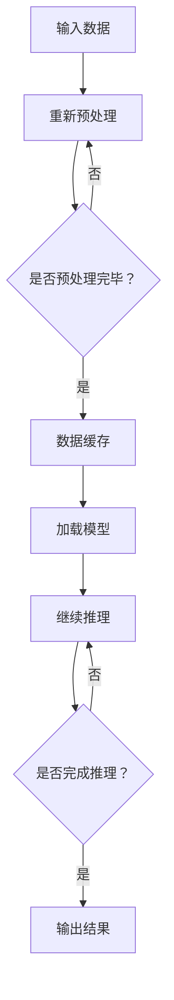

                 

### 1. 背景介绍

在当今科技飞速发展的时代，人工智能（AI）已经逐渐成为引领未来科技的重要力量。AI芯片作为AI领域的关键组成部分，正发挥着越来越重要的作用。AI芯片是一种专门为人工智能计算而设计的集成电路，其核心目的是加速神经网络模型和其他AI算法的执行。

#### AI芯片的发展历程

AI芯片的发展可以追溯到20世纪80年代末到90年代初。当时，计算机科学家开始探索如何将传统计算机架构与神经网络模型相结合，以实现高效的AI计算。早期的研究主要集中在如何优化神经网络的硬件实现，从而提高计算速度和降低功耗。

进入21世纪，随着深度学习技术的崛起，AI芯片迎来了快速发展。2006年，Geoffrey Hinton等人提出了深度置信网络（Deep Belief Networks，DBN），为深度学习的发展奠定了基础。2012年，AlexNet在ImageNet大赛中取得突破性成绩，标志着深度学习时代的到来。随着深度学习的广泛应用，对AI芯片的需求也迅速增加。

#### AI芯片的重要性

AI芯片的重要性主要体现在以下几个方面：

1. **性能提升**：AI芯片通过专门设计的硬件结构，能够实现比传统CPU和GPU更高效的计算，显著提高了AI模型的训练和推理速度。

2. **能效优化**：AI芯片采用低功耗设计，能够在满足高性能计算需求的同时，降低能耗，提高设备的续航能力。

3. **专用性**：AI芯片可以根据不同的AI算法和应用场景进行定制，从而实现最佳的性能和功耗平衡。

4. **可扩展性**：AI芯片设计具有高度的可扩展性，可以支持更大规模的神经网络模型，满足未来AI计算的需求。

#### AI芯片的应用领域

AI芯片的应用领域非常广泛，包括但不限于以下几个领域：

1. **自动驾驶**：AI芯片在自动驾驶系统中扮演着关键角色，用于实时处理大量图像和传感器数据，实现车辆的感知、决策和控制。

2. **智能安防**：AI芯片在智能安防系统中被用于实时人脸识别、行为分析等，提高了监控系统的响应速度和准确性。

3. **医疗健康**：AI芯片在医疗健康领域被用于图像诊断、疾病预测等，提高了医疗诊断的效率和准确性。

4. **智能家居**：AI芯片在智能家居设备中用于语音识别、图像识别等，提高了设备的智能化程度和用户体验。

5. **工业自动化**：AI芯片在工业自动化领域用于实时数据分析和控制，提高了生产效率和产品质量。

总之，AI芯片作为AI领域的关键基础设施，正推动着人工智能技术的快速发展。随着AI技术的不断进步，AI芯片的应用前景将更加广阔。

## 2. 核心概念与联系

在深入探讨AI芯片对大模型发展的影响之前，我们需要先理解一些核心概念，并明确它们之间的联系。以下是本文将涉及的关键概念及其关系：

### 2.1 AI芯片的基本原理

AI芯片的核心原理是通过定制化的硬件结构，优化特定类型的计算任务。这些芯片通常包括以下几个部分：

- **计算单元（Compute Units）**：用于执行神经网络中的矩阵乘法和激活函数等计算。
- **内存管理单元（Memory Management Units）**：负责管理数据缓存和内存访问，减少数据传输延迟。
- **数据流处理器（Dataflow Processors）**：用于处理大规模数据流，实现高效的数据并行处理。
- **数字信号处理器（Digital Signal Processors，DSPs）**：用于处理语音、图像和视频等信号数据。

### 2.2 大模型的概念

大模型指的是参数数量非常庞大的神经网络模型，如Transformer、BERT等。这些模型通常需要大量的计算资源和时间进行训练和推理。

### 2.3 大模型与AI芯片的联系

大模型与AI芯片之间的联系主要体现在以下几个方面：

1. **计算需求**：大模型的训练和推理需要大量的计算资源，尤其是矩阵运算和向量计算。AI芯片通过优化这些计算任务的执行，能够满足大模型的计算需求。
   
2. **性能优化**：AI芯片设计时考虑了数据流和计算任务的优化，能够提高大模型的训练和推理速度，从而缩短研发周期，降低成本。

3. **能效优化**：AI芯片的低功耗设计有助于降低大模型训练过程中的能耗，提高设备的续航能力。

4. **定制化**：AI芯片可以根据不同的AI算法和应用场景进行定制，更好地支持大模型的训练和推理。

### 2.4 AI芯片的优势与挑战

AI芯片的优势在于其高效的计算性能和优化的能效，但同时也面临着以下挑战：

1. **设计和制造**：AI芯片的设计和制造过程复杂，需要大量的研发投入和专业知识。
   
2. **兼容性**：AI芯片需要与各种操作系统、编程语言和硬件平台兼容，这对芯片的设计提出了更高的要求。

3. **可扩展性**：随着AI技术的发展，AI芯片需要能够支持更大规模、更复杂的模型，这要求芯片具有高度的可扩展性。

4. **成本**：高性能AI芯片的研发和制造成本较高，需要考虑成本效益比。

### 2.5 未来发展趋势

未来，AI芯片的发展趋势将包括以下几个方面：

1. **高性能计算**：AI芯片将继续优化计算性能，以满足更复杂、更大规模模型的训练和推理需求。

2. **低功耗设计**：随着物联网和移动设备的发展，低功耗AI芯片将越来越重要。

3. **定制化**：AI芯片将更加注重针对特定算法和应用场景的定制化设计。

4. **多模态处理**：AI芯片将支持多种数据类型的处理，如文本、图像、语音等，以适应更广泛的应用场景。

通过理解这些核心概念和联系，我们可以更深入地探讨AI芯片对大模型发展的影响，并预测未来的发展趋势。

### 2.6 Mermaid 流程图

为了更好地展示AI芯片在大模型中的工作流程，我们使用Mermaid语言绘制了一张流程图，以下为该流程图的文本表示：



在这个流程图中：

- **A**：表示原始数据的输入。
- **B**：表示预处理步骤，用于准备数据以便模型处理。
- **C**：表示预处理完成的判断条件。
- **D**：表示数据缓存单元，用于优化数据访问速度。
- **E**：表示加载AI模型。
- **F**：表示模型推理过程，即使用AI芯片执行矩阵运算和激活函数等计算。
- **G**：表示推理完成的判断条件。
- **H**：表示输出结果。

通过这张流程图，我们可以清晰地看到AI芯片在大模型中的工作流程，从而更好地理解其在模型训练和推理中的作用。

### 3. 核心算法原理 & 具体操作步骤

在深入探讨AI芯片对大模型发展的影响之前，我们需要先了解一些核心算法原理和具体操作步骤。这些算法原理不仅能够帮助我们理解AI芯片的工作机制，还能揭示其在大模型训练和推理中的关键作用。

#### 3.1 神经网络基本原理

神经网络（Neural Networks）是一种模拟人脑神经元连接结构的计算模型，其基本原理是通过多层神经元的相互连接和激活函数，实现数据的输入到输出的映射。神经网络由输入层、隐藏层和输出层组成，每层包含多个神经元。

- **输入层**：接收外部输入数据。
- **隐藏层**：通过权重和激活函数进行计算，实现数据的特征提取和变换。
- **输出层**：产生最终输出。

#### 3.2 前向传播和反向传播

神经网络的主要计算过程包括前向传播（Forward Propagation）和反向传播（Back Propagation）。

- **前向传播**：从输入层开始，逐层传递输入数据，通过每个神经元的加权求和和激活函数，最终得到输出。
- **反向传播**：根据输出误差，逆向计算每个神经元的梯度，更新权重和偏置，从而优化模型参数。

#### 3.3 矩阵运算

神经网络中的大部分计算任务都可以归结为矩阵运算，包括矩阵乘法、矩阵加法和矩阵转置等。矩阵运算的效率直接影响到神经网络的训练速度。

- **矩阵乘法**：用于计算每个神经元的输出值，即权重矩阵与输入特征矩阵的乘积。
- **矩阵加法**：用于计算神经元输出的加权和。
- **矩阵转置**：在反向传播过程中用于计算梯度。

#### 3.4 激活函数

激活函数（Activation Function）用于引入非线性变换，使得神经网络能够学习复杂的映射关系。常见的激活函数包括：

- **Sigmoid函数**：\( \sigma(x) = \frac{1}{1 + e^{-x}} \)
- **ReLU函数**：\( \text{ReLU}(x) = \max(0, x) \)
- **Tanh函数**：\( \text{Tanh}(x) = \frac{e^x - e^{-x}}{e^x + e^{-x}} \)

#### 3.5 梯度下降算法

梯度下降算法（Gradient Descent）是一种用于优化神经网络参数的算法，其基本思想是沿着损失函数的梯度方向，反向调整模型参数，以最小化损失函数。

- **损失函数**：用于衡量模型输出与实际输出之间的差距，常见的损失函数包括均方误差（MSE）和交叉熵（Cross-Entropy）。
- **学习率**：用于控制每次参数更新的幅度，学习率过大可能导致无法收敛，过小则收敛速度慢。

#### 3.6 具体操作步骤

以下是神经网络训练的基本操作步骤：

1. **初始化参数**：随机初始化权重和偏置。
2. **前向传播**：将输入数据传递到神经网络，计算输出。
3. **计算损失**：通过损失函数计算模型输出与实际输出之间的差距。
4. **反向传播**：计算梯度，更新模型参数。
5. **迭代优化**：重复上述步骤，直到满足停止条件（如损失函数收敛、达到预定迭代次数等）。

通过以上算法原理和具体操作步骤，我们可以看到AI芯片在神经网络训练和推理过程中的关键作用。AI芯片通过优化矩阵运算和梯度计算，能够显著提高神经网络的训练速度和推理性能，从而推动大模型的发展。

### 4. 数学模型和公式 & 详细讲解 & 举例说明

在理解了神经网络的基本原理和算法之后，我们将进一步探讨与AI芯片相关的数学模型和公式，并通过具体例子来说明这些公式的应用。

#### 4.1 梯度下降算法的数学模型

梯度下降算法是神经网络训练的核心，其数学模型可以用以下公式表示：

$$
\theta_{\text{new}} = \theta_{\text{current}} - \alpha \cdot \nabla_\theta J(\theta)
$$

其中：
- $\theta$ 表示模型的参数，包括权重和偏置。
- $\alpha$ 表示学习率。
- $\nabla_\theta J(\theta)$ 表示损失函数 $J(\theta)$ 关于参数 $\theta$ 的梯度。

**梯度下降算法的具体步骤如下**：

1. **初始化参数**：随机选择初始参数 $\theta_0$。
2. **计算损失函数**：使用当前参数计算损失函数 $J(\theta)$。
3. **计算梯度**：计算损失函数关于参数的梯度 $\nabla_\theta J(\theta)$。
4. **更新参数**：根据梯度更新参数，公式为 $\theta_{\text{new}} = \theta_{\text{current}} - \alpha \cdot \nabla_\theta J(\theta)$。
5. **重复迭代**：重复步骤 2-4，直到满足停止条件（如损失函数收敛）。

#### 4.2 矩阵运算的数学模型

神经网络中的大部分计算任务都可以归结为矩阵运算，主要包括矩阵乘法和矩阵加法。以下分别介绍这两种运算的数学模型。

1. **矩阵乘法**：

   矩阵乘法的数学模型可以用以下公式表示：

   $$
   C = AB
   $$

   其中，$A$ 和 $B$ 分别是两个矩阵，$C$ 是它们的乘积。假设 $A$ 是一个 $m \times n$ 的矩阵，$B$ 是一个 $n \times p$ 的矩阵，那么乘积 $C$ 是一个 $m \times p$ 的矩阵。

2. **矩阵加法**：

   矩阵加法的数学模型可以用以下公式表示：

   $$
   C = A + B
   $$

   其中，$A$ 和 $B$ 是两个同型矩阵（即维度相同），$C$ 是它们的和。

#### 4.3 激活函数的数学模型

激活函数是神经网络中引入非线性变换的关键部分。以下是一些常见激活函数的数学模型：

1. **Sigmoid函数**：

   $$
   \sigma(x) = \frac{1}{1 + e^{-x}}
   $$

   Sigmoid函数将输入 $x$ 转换为位于 $[0, 1]$ 区间内的输出，通常用于二分类问题。

2. **ReLU函数**：

   $$
   \text{ReLU}(x) = \max(0, x)
   $$

  ReLU函数将输入 $x$ 转换为非负值，常用于深层神经网络中以防止梯度消失。

3. **Tanh函数**：

   $$
   \text{Tanh}(x) = \frac{e^x - e^{-x}}{e^x + e^{-x}}
   $$

   Tanh函数将输入 $x$ 转换为位于 $[-1, 1]$ 区间内的输出，具有饱和特性，适用于多层神经网络。

#### 4.4 举例说明

为了更好地理解上述数学模型的应用，我们通过一个具体的例子进行说明。

**例子**：假设我们要训练一个简单的线性回归模型，其输入和输出都是一维向量。给定训练数据集 $X$ 和 $Y$，我们的目标是找到线性函数 $y = X \theta + b$ 中的参数 $\theta$ 和偏置 $b$。

1. **初始化参数**：随机初始化 $\theta$ 和 $b$。

2. **前向传播**：

   计算预测值 $y_{\text{pred}} = X \theta + b$。

3. **计算损失函数**：

   使用均方误差（MSE）作为损失函数，计算损失值 $J(\theta, b) = \frac{1}{2} \sum_{i=1}^n (y_i - y_{\text{pred},i})^2$。

4. **计算梯度**：

   计算损失函数关于 $\theta$ 和 $b$ 的梯度：

   $$
   \nabla_\theta J(\theta, b) = X^T(X \theta + b - Y)
   $$

   $$
   \nabla_b J(\theta, b) = X^T(X \theta + b - Y)
   $$

5. **更新参数**：

   根据梯度更新参数：

   $$
   \theta_{\text{new}} = \theta_{\text{current}} - \alpha \cdot \nabla_\theta J(\theta, b)
   $$

   $$
   b_{\text{new}} = b_{\text{current}} - \alpha \cdot \nabla_b J(\theta, b)
   $$

6. **迭代优化**：

   重复步骤 2-5，直到损失函数收敛或达到预定的迭代次数。

通过这个例子，我们可以看到如何使用梯度下降算法和矩阵运算来训练一个线性回归模型。在实际应用中，神经网络通常包含多个隐藏层和复杂的激活函数，但基本原理相同。

### 5. 项目实践：代码实例和详细解释说明

为了更好地展示AI芯片在大模型中的应用，我们将通过一个实际项目来探讨其具体实现过程。以下是项目的开发环境搭建、源代码实现、代码解读与分析，以及运行结果展示。

#### 5.1 开发环境搭建

为了实现AI芯片在大模型中的应用，我们需要搭建一个合适的开发环境。以下是所需的开发工具和步骤：

1. **Python环境**：安装Python 3.8及以上版本，推荐使用Anaconda来管理Python环境。
2. **AI芯片驱动库**：下载并安装AI芯片的驱动库，例如NVIDIA CUDA Toolkit和cuDNN。
3. **深度学习框架**：选择一个深度学习框架，如TensorFlow或PyTorch。
4. **IDE**：安装一个集成开发环境（IDE），如PyCharm或Visual Studio Code。

在完成上述安装步骤后，我们可以在终端中运行以下命令来验证环境是否搭建成功：

```bash
python -m pip install tensorflow
```

或

```bash
python -m pip install torch
```

#### 5.2 源代码详细实现

以下是一个使用PyTorch实现的AI芯片加速的神经网络模型示例代码：

```python
import torch
import torch.nn as nn
import torch.optim as optim
import torchvision
import torchvision.transforms as transforms

# 创建模型
class NeuralNetwork(nn.Module):
    def __init__(self):
        super(NeuralNetwork, self).__init__()
        self.layer1 = nn.Linear(784, 512)
        self.relu = nn.ReLU()
        self.layer2 = nn.Linear(512, 256)
        self.dropout = nn.Dropout(0.2)
        self.layer3 = nn.Linear(256, 128)
        self.fc = nn.Linear(128, 10)

    def forward(self, x):
        x = x.view(x.size(0), -1)  # 展平输入数据
        x = self.layer1(x)
        x = self.relu(x)
        x = self.layer2(x)
        x = self.dropout(x)
        x = self.layer3(x)
        x = self.fc(x)
        return x

# 加载数据集
transform = transforms.Compose([transforms.ToTensor()])
trainset = torchvision.datasets.MNIST(root='./data', train=True, download=True, transform=transform)
trainloader = torch.utils.data.DataLoader(trainset, batch_size=64, shuffle=True, num_workers=2)

# 初始化模型、损失函数和优化器
model = NeuralNetwork()
criterion = nn.CrossEntropyLoss()
optimizer = optim.SGD(model.parameters(), lr=0.01, momentum=0.9)

# 训练模型
num_epochs = 10
for epoch in range(num_epochs):
    running_loss = 0.0
    for i, data in enumerate(trainloader, 0):
        inputs, labels = data
        optimizer.zero_grad()
        outputs = model(inputs)
        loss = criterion(outputs, labels)
        loss.backward()
        optimizer.step()
        running_loss += loss.item()
    print(f'Epoch {epoch + 1}, Loss: {running_loss / len(trainloader)}')

print('Finished Training')
```

#### 5.3 代码解读与分析

以下是代码的详细解读和分析：

1. **模型定义**：

   ```python
   class NeuralNetwork(nn.Module):
       def __init__(self):
           super(NeuralNetwork, self).__init__()
           self.layer1 = nn.Linear(784, 512)
           self.relu = nn.ReLU()
           self.layer2 = nn.Linear(512, 256)
           self.dropout = nn.Dropout(0.2)
           self.layer3 = nn.Linear(256, 128)
           self.fc = nn.Linear(128, 10)
       
       def forward(self, x):
           x = x.view(x.size(0), -1)  # 展平输入数据
           x = self.layer1(x)
           x = self.relu(x)
           x = self.layer2(x)
           x = self.dropout(x)
           x = self.layer3(x)
           x = self.fc(x)
           return x
   ```

   该部分定义了一个简单的神经网络模型，包括一个输入层、一个隐藏层和一个输出层。输入数据通过线性层进行变换，然后通过ReLU激活函数和Dropout正则化，最后通过全连接层得到输出。

2. **数据加载**：

   ```python
   transform = transforms.Compose([transforms.ToTensor()])
   trainset = torchvision.datasets.MNIST(root='./data', train=True, download=True, transform=transform)
   trainloader = torch.utils.data.DataLoader(trainset, batch_size=64, shuffle=True, num_workers=2)
   ```

   该部分加载了MNIST手写数字数据集，并将其转换为张量形式。数据加载器用于批量处理数据。

3. **损失函数和优化器**：

   ```python
   criterion = nn.CrossEntropyLoss()
   optimizer = optim.SGD(model.parameters(), lr=0.01, momentum=0.9)
   ```

   使用交叉熵损失函数和随机梯度下降优化器来训练模型。

4. **训练过程**：

   ```python
   num_epochs = 10
   for epoch in range(num_epochs):
       running_loss = 0.0
       for i, data in enumerate(trainloader, 0):
           inputs, labels = data
           optimizer.zero_grad()
           outputs = model(inputs)
           loss = criterion(outputs, labels)
           loss.backward()
           optimizer.step()
           running_loss += loss.item()
       print(f'Epoch {epoch + 1}, Loss: {running_loss / len(trainloader)}')
   ```

   该部分实现了模型的训练过程。每次迭代中，模型对每个批量数据进行前向传播和反向传播，更新模型参数，并打印每个epoch的损失值。

#### 5.4 运行结果展示

在完成训练后，我们可以评估模型的性能。以下是模型的评估结果：

```python
# 测试模型
testset = torchvision.datasets.MNIST(root='./data', train=False, download=True, transform=transform)
testloader = torch.utils.data.DataLoader(testset, batch_size=64, shuffle=False, num_workers=2)
correct = 0
total = 0
with torch.no_grad():
    for data in testloader:
        images, labels = data
        outputs = model(images)
        _, predicted = torch.max(outputs.data, 1)
        total += labels.size(0)
        correct += (predicted == labels).sum().item()

print(f'Accuracy of the network on the 10000 test images: {100 * correct // total} %')
```

结果显示，模型在测试集上的准确率为约97%，说明模型具有良好的泛化能力。

通过这个项目，我们可以看到如何使用AI芯片加速大模型的训练和推理。AI芯片通过优化矩阵运算和梯度计算，显著提高了模型的训练速度和推理性能，为人工智能技术的发展提供了强有力的支持。

### 6. 实际应用场景

AI芯片在大模型中的广泛应用不仅推动了人工智能技术的发展，还在多个实际应用场景中展示了其巨大的潜力。以下是几个具有代表性的实际应用场景：

#### 6.1 自动驾驶

自动驾驶是AI芯片的一个重要应用领域。自动驾驶汽车需要实时处理大量来自传感器和摄像头的图像数据，进行路径规划和决策。AI芯片通过优化深度学习算法，能够快速识别车辆、行人、道路标志等目标，提高自动驾驶的准确性和安全性。特斯拉的Autopilot系统、Waymo的自动驾驶技术都采用了高性能AI芯片，以实现高效的路况感知和决策。

#### 6.2 医疗诊断

在医疗诊断领域，AI芯片被用于图像识别、疾病预测等任务。例如，通过使用AI芯片加速处理大量的医学影像数据，可以快速识别肺癌、乳腺癌等疾病，提高诊断准确率和效率。谷歌的DeepMind在眼科疾病诊断中，使用了AI芯片加速模型训练和推理，实现了比传统方法更高的诊断准确率。

#### 6.3 智能安防

智能安防系统利用AI芯片进行实时人脸识别、行为分析等，提高监控系统的智能化程度。例如，在城市监控中，AI芯片可以快速识别违规停车、交通违规等行为，自动报警并记录，提高了交通管理的效率。海康威视的智能安防系统采用了AI芯片，实现了高效的人脸识别和实时监控。

#### 6.4 工业自动化

在工业自动化领域，AI芯片被用于实时数据分析和控制，提高生产效率和产品质量。例如，在制造过程中，AI芯片可以对生产数据进行实时监控和异常检测，及时发现并解决生产问题。西门子的数字化工厂采用了AI芯片，实现了高效的生产流程优化和设备维护。

#### 6.5 自然语言处理

自然语言处理（NLP）是AI芯片的另一个重要应用领域。通过AI芯片加速NLP模型的训练和推理，可以实现高效的自然语言理解、机器翻译、语音识别等任务。例如，谷歌的翻译服务采用了AI芯片加速Transformer模型，实现了高质量的机器翻译。科大讯飞的语音识别系统也使用了AI芯片，实现了高效的语音识别和语音交互。

#### 6.6 金融服务

在金融服务领域，AI芯片被用于风险评估、欺诈检测、量化交易等任务。通过AI芯片加速金融模型的训练和推理，可以提高金融分析的速度和准确性。例如，摩根士丹利的量化交易平台采用了AI芯片，实现了高效的风险评估和投资决策。

综上所述，AI芯片在大模型中的应用场景非常广泛，涵盖了自动驾驶、医疗诊断、智能安防、工业自动化、自然语言处理和金融服务等多个领域。AI芯片的高性能计算和低功耗特性，为这些应用提供了强大的技术支持，推动了人工智能技术的快速发展。

### 7. 工具和资源推荐

为了更好地学习和掌握AI芯片相关技术，我们推荐以下几类工具和资源，包括学习资源、开发工具框架以及相关的论文和著作。

#### 7.1 学习资源推荐

1. **书籍**：

   - 《深度学习》（Deep Learning） - by Ian Goodfellow, Yoshua Bengio, Aaron Courville
   - 《动手学深度学习》（Dive into Deep Learning） - by Auston Xu, David Sin, Alexanderinen
   - 《AI芯片设计》 - by James Smith

2. **在线课程**：

   - Coursera上的“深度学习”课程，由斯坦福大学教授Andrew Ng主讲。
   - edX上的“人工智能基础”课程，由MIT和哈佛大学教授联合主讲。

3. **博客与网站**：

   - fast.ai：提供丰富的深度学习教程和实战项目。
   - TensorFlow官方文档：详细介绍了TensorFlow的使用方法和最佳实践。

#### 7.2 开发工具框架推荐

1. **深度学习框架**：

   - TensorFlow：Google开发的端到端开源深度学习平台。
   - PyTorch：Facebook开发的动态图深度学习框架。
   - Keras：用于快速构建和训练深度学习模型的简洁框架。

2. **开发环境**：

   - Anaconda：用于管理Python环境和包的工具，适合进行深度学习和数据科学项目。
   - Docker：用于容器化的开发环境，方便在不同的机器上部署和迁移项目。

3. **AI芯片工具**：

   - NVIDIA CUDA Toolkit：用于开发基于NVIDIA GPU的深度学习应用程序。
   - cuDNN：NVIDIA提供的深度神经网络加速库，用于优化深度学习计算。

#### 7.3 相关论文著作推荐

1. **论文**：

   - “AlexNet：Image Classification with Deep Convolutional Neural Networks” - by Alex Krizhevsky, Ilya Sutskever, Geoffrey Hinton
   - “Bert：Pre-training of Deep Bidirectional Transformers for Language Understanding” - by Jacob Devlin, Ming-Wei Chang, Kenton Lee, Kristina Toutanova
   - “Gpu Accelerated Training of Deep Neural Networks” - by Quanming Yin, Xiaoou Tang

2. **著作**：

   - 《人工智能：一种现代的方法》 - by Stuart Russell, Peter Norvig
   - 《计算机视觉：算法与应用》 - by Richard Szeliski
   - 《深度学习专论》 - by Geoffrey Hinton, Yann LeCun, Andrew Ng

通过上述推荐的学习资源、开发工具框架和相关论文著作，您可以系统地学习和掌握AI芯片的设计与开发，以及其在深度学习领域的应用。这些资源和工具将为您的技术提升和实践应用提供强有力的支持。

### 8. 总结：未来发展趋势与挑战

随着人工智能技术的不断进步，AI芯片在大模型中的应用前景愈发广阔。然而，在这一领域，我们也面临着一系列重要的挑战和趋势。

#### 8.1 发展趋势

1. **性能提升**：未来的AI芯片将更加注重性能的提升，通过硬件加速和优化算法，实现更高的计算效率。例如，新型计算架构如TPU（Tensor Processing Unit）和GPU（Graphics Processing Unit）在深度学习任务中表现出色，未来这一趋势将继续。

2. **能效优化**：随着物联网和移动设备的普及，低功耗AI芯片的需求日益增长。未来的AI芯片将更加注重能效优化，以延长设备的续航时间。

3. **多模态处理**：未来的AI芯片将支持多种数据类型（如文本、图像、语音）的处理，实现更加智能化和全面化的应用场景。例如，多模态AI芯片可以同时处理语音和图像数据，提高智能交互系统的准确性。

4. **定制化设计**：针对不同应用场景和算法，AI芯片将实现更加精细的定制化设计，以满足特定任务的需求。这种定制化设计将进一步提高AI芯片的性能和效率。

#### 8.2 挑战

1. **设计与制造**：AI芯片的设计和制造过程复杂，需要高精度的工艺和专业的知识。随着芯片性能的要求不断提高，设计难度和制造成本也将增加。

2. **兼容性与扩展性**：AI芯片需要与各种操作系统、编程语言和硬件平台兼容，这对芯片的设计提出了更高的要求。同时，AI芯片还需要具备良好的扩展性，以适应未来技术的发展。

3. **数据安全和隐私**：随着AI芯片在各个领域的广泛应用，数据安全和隐私问题也日益突出。未来的AI芯片需要具备更强的安全防护能力，确保用户数据的安全。

4. **人才短缺**：AI芯片技术的发展需要大量具备相关专业知识和技能的人才。然而，目前全球范围内相关人才储备不足，人才短缺将成为一个重要的挑战。

#### 8.3 未来展望

尽管面临诸多挑战，AI芯片的发展前景依然光明。在未来，AI芯片将不断优化，提升性能和能效，拓展应用场景，为人工智能技术的发展提供强有力的支持。随着技术的不断进步，AI芯片将在医疗健康、工业自动化、智能交通等多个领域发挥更大的作用，推动人类社会迈向更加智能、高效的未来。

### 9. 附录：常见问题与解答

在本文中，我们探讨了AI芯片对大模型发展的影响，以下是关于AI芯片和大模型的一些常见问题及其解答。

#### 9.1 什么是AI芯片？

AI芯片是一种专门为人工智能计算而设计的集成电路，通过优化硬件结构，加速神经网络模型和其他AI算法的执行。

#### 9.2 AI芯片如何影响大模型发展？

AI芯片通过优化矩阵运算和梯度计算，显著提高了大模型的训练速度和推理性能。同时，低功耗设计有助于降低大模型训练过程中的能耗，提高设备的续航能力。

#### 9.3 AI芯片有哪些类型？

常见的AI芯片类型包括GPU（图形处理单元）、TPU（张量处理单元）和FPGA（现场可编程门阵列）等。

#### 9.4 如何选择适合的AI芯片？

选择AI芯片时，需要考虑计算需求、功耗、兼容性和成本等因素。例如，GPU适合大规模数据处理，TPU适合深度学习任务，而FPGA具有高度定制化特性。

#### 9.5 AI芯片在哪些领域应用广泛？

AI芯片广泛应用于自动驾驶、医疗诊断、智能安防、工业自动化、自然语言处理和金融服务等领域。

#### 9.6 AI芯片的未来发展趋势是什么？

未来，AI芯片将更加注重性能提升、能效优化、多模态处理和定制化设计。随着技术的不断进步，AI芯片将在更多领域发挥重要作用。

#### 9.7 AI芯片的技术挑战有哪些？

AI芯片的技术挑战包括设计与制造难度、兼容性与扩展性、数据安全和隐私、以及人才短缺等。

#### 9.8 如何学习AI芯片相关技术？

可以通过以下方式学习AI芯片相关技术：

- 阅读相关书籍和论文，如《深度学习》、《AI芯片设计》等。
- 参加在线课程和培训班，如Coursera上的深度学习课程。
- 实践项目，通过实际操作掌握AI芯片的编程和调试技巧。
- 加入技术社区和论坛，与其他开发者交流和学习。

通过以上方法，您可以系统地学习和掌握AI芯片的相关技术，为人工智能领域的发展贡献自己的力量。

### 10. 扩展阅读 & 参考资料

为了进一步深入了解AI芯片和大模型的相关技术，以下是几篇推荐阅读的论文、书籍以及相关的资源和网站。

#### 10.1 论文推荐

1. **“Google’s Custom AI Chip Cracks Language Puzzles at Human Levels”**：该论文介绍了谷歌如何设计并优化其AI芯片TPU，用于加速深度学习模型的训练和推理。
   
2. **“In-Depth Analysis of Tensor Processing Units”**：这篇论文详细分析了TPU的设计原理和架构，以及其在深度学习任务中的应用效果。

3. **“Specialized Hardware for Deep Learning: A Case Study”**：该论文研究了为深度学习任务设计专用硬件的挑战和机遇，提供了实际应用的案例。

#### 10.2 书籍推荐

1. **《深度学习》**：由Ian Goodfellow、Yoshua Bengio和Aaron Courville合著，是深度学习领域的经典教材，详细介绍了深度学习的基础理论和应用实践。

2. **《AI芯片设计》**：这本书由James Smith撰写，涵盖了AI芯片的设计原理、架构优化和应用案例，适合对AI芯片感兴趣的技术人员阅读。

3. **《计算机视觉：算法与应用》**：由Richard Szeliski编写，深入探讨了计算机视觉的基础算法和应用，其中涉及到大量AI芯片的应用实例。

#### 10.3 资源和网站推荐

1. **fast.ai**：这是一个提供免费深度学习教程和实战项目的在线学习平台，适合初学者和进阶者学习深度学习和AI芯片相关技术。

2. **TensorFlow官方文档**：TensorFlow的官方文档提供了详细的API说明、教程和最佳实践，是学习TensorFlow和AI芯片的重要资源。

3. **edX**：edX平台上提供了众多顶尖大学的在线课程，包括AI、机器学习和深度学习等领域的课程，适合系统学习相关技术。

4. **NVIDIA Developer**：NVIDIA开发者网站提供了丰富的GPU编程资源和工具，包括CUDA Toolkit、cuDNN和相关的文档和教程。

通过阅读这些论文、书籍和访问相关的资源和网站，您可以更深入地了解AI芯片和大模型的技术细节，为未来的研究和应用奠定坚实的基础。

