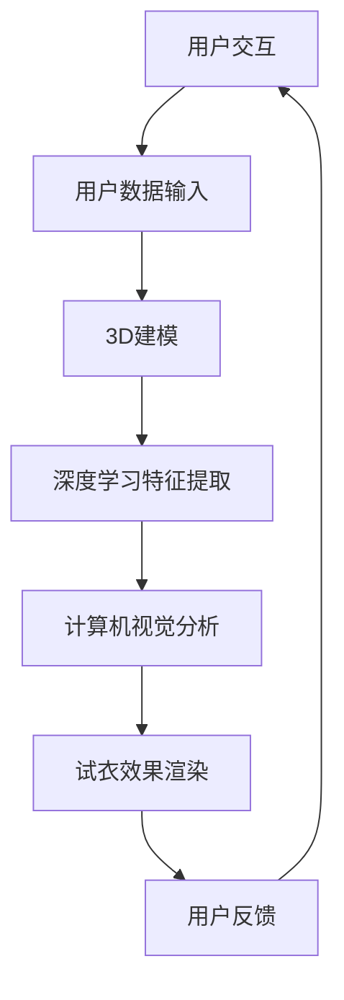

                 

### 背景介绍

#### 购物体验的挑战

随着互联网技术的飞速发展，电子商务已经成为现代商业不可或缺的一部分。然而，线上购物虽然提供了便捷的购物渠道，却仍存在一些痛点，尤其是关于服饰类商品的购买体验。传统线上购物过程中，消费者往往面临无法亲自试穿的问题，这直接影响了购买决策的准确性。试衣问题不仅限制了消费者的选择，也增加了退货率，给电商平台和消费者都带来了不便。

#### AI虚拟试衣的兴起

为了解决这一问题，AI虚拟试衣技术应运而生。AI虚拟试衣功能通过计算机视觉、深度学习、3D建模等技术，实现了用户在虚拟环境中试穿衣物，从而提升购物体验。这项技术不仅能够减少实体试衣的局限，还能够节省时间和成本，提高用户的满意度和忠诚度。

#### 技术发展与应用

AI虚拟试衣技术的出现，标志着电子商务体验的一次革命性飞跃。近年来，国内外各大电商平台和服装品牌纷纷投入大量资源进行AI虚拟试衣技术的研发和应用。例如，亚马逊、阿里巴巴等巨头都在其平台上推出了虚拟试衣功能。同时，一些初创公司也在不断探索更加先进和实用的AI虚拟试衣解决方案。

#### 文章目的

本文旨在深入探讨AI虚拟试衣技术的工作原理、核心算法、实际应用以及未来发展趋势。通过系统地介绍这项技术，帮助读者理解其背后的技术原理和实现方法，从而为未来的研究和应用提供有益的参考。

### 核心概念与联系

要深入理解AI虚拟试衣功能，我们需要明确几个核心概念和技术联系。以下是这些概念及其相互关系的简要介绍：

#### 计算机视觉

计算机视觉是AI虚拟试衣技术的基石。它涉及到如何让计算机理解和解释现实世界的图像和视频。计算机视觉技术包括图像识别、目标检测、图像分割、特征提取等。在AI虚拟试衣中，计算机视觉用于捕捉用户的身体轮廓、识别衣物以及分析试衣效果。

#### 深度学习

深度学习是近年来在AI领域取得突破性进展的一种机器学习技术。它通过构建复杂的神经网络模型，让计算机自动学习从大量数据中提取特征。在AI虚拟试衣中，深度学习用于识别和分类图像，以及预测试衣效果。

#### 3D建模与渲染

3D建模与渲染是AI虚拟试衣的重要组成部分。通过3D建模，可以将衣物和人体模型精确地数字化。渲染技术则用于生成逼真的视觉效果，使得虚拟试衣的体验更加接近现实。

#### 数据库

数据库用于存储大量的图像和模型数据。这些数据包括用户的身体尺寸、衣物的3D模型、用户试穿后的反馈等。数据库不仅为AI虚拟试衣提供数据支持，还可以通过数据分析和挖掘，不断优化试衣体验。

#### 用户交互

用户交互是AI虚拟试衣的核心环节。通过用户交互，系统可以收集用户的反馈，调整试衣效果，提供个性化的推荐。用户交互技术包括触摸屏、语音识别、手势控制等。

#### Mermaid 流程图

为了更好地展示这些核心概念和技术之间的联系，我们可以使用Mermaid流程图进行描述：



在这个流程图中，用户交互通过输入用户数据，触发3D建模和深度学习特征提取，然后通过计算机视觉分析试衣效果，最终进行渲染并收集用户反馈，形成一个闭环的系统。

### 核心算法原理 & 具体操作步骤

#### 3D人体建模

3D人体建模是AI虚拟试衣功能的关键步骤之一。其核心原理是通过计算机视觉技术捕捉用户的身体轮廓，然后利用3D建模技术将这些轮廓数据转化为三维模型。

1. **数据采集**：首先，系统需要采集用户的身体轮廓数据。这可以通过多种方式实现，例如使用RGB-D相机（如Kinect）捕捉用户的全身图像和深度信息，或者使用传统的二维摄像头结合深度学习模型估计用户身体轮廓。

2. **轮廓检测与分割**：利用计算机视觉算法，如边缘检测、轮廓提取等，从采集到的图像中提取用户身体的轮廓。然后，通过图像分割技术，将用户轮廓与背景分离。

3. **三维重建**：将提取到的轮廓数据转换为三维坐标点，利用表面重建技术（如泊松重建），生成用户的三维人体模型。

4. **模型优化**：对生成的三维模型进行平滑处理和优化，以提高模型的质量和渲染效果。

#### 深度学习特征提取

深度学习在AI虚拟试衣中的应用主要体现在特征提取和分类上。通过深度学习模型，可以从用户的身体轮廓图像中提取出关键特征，例如身体比例、轮廓线条等。

1. **数据预处理**：将采集到的用户轮廓图像进行预处理，包括归一化、去噪等操作，以提高深度学习模型的训练效果。

2. **模型训练**：使用大量的标注数据，训练深度学习模型。常用的模型包括卷积神经网络（CNN）和生成对抗网络（GAN）。

3. **特征提取与分类**：通过训练好的模型，从用户轮廓图像中提取出特征向量。这些特征向量可以用于分类任务，例如判断用户的具体体型和身体尺寸。

#### 计算机视觉分析

计算机视觉分析是AI虚拟试衣的核心环节，它负责处理用户试衣过程中的各种图像和视频数据，以判断试衣效果。

1. **实时监控**：利用计算机视觉技术，实时监控用户的试衣过程，包括用户身体轮廓、衣物位置和状态等。

2. **效果评估**：通过计算机视觉算法，分析试衣效果。这包括评估衣物是否贴合、是否有褶皱、颜色是否匹配等。

3. **反馈机制**：根据效果评估结果，系统可以提供实时反馈，例如调整衣物位置、提供穿着建议等。

#### 3D渲染

3D渲染是将用户试衣结果以逼真的视觉效果展示给用户的关键步骤。其核心原理是通过计算机图形学技术，将三维模型转换为二维图像。

1. **光照模型**：在渲染过程中，需要考虑光照模型。常用的光照模型包括漫反射、镜面反射等。

2. **材质与纹理**：为衣物和人体模型添加材质和纹理，以提高渲染效果。

3. **视觉效果合成**：将渲染后的图像与背景融合，生成最终的试衣效果图。

#### 操作步骤示例

假设我们使用Python编程语言和相关的AI库来实现AI虚拟试衣功能，以下是具体操作步骤的示例：

1. **安装相关库**：

```python
pip install opencv-python
pip install tensorflow
pip install trimesh
```

2. **数据采集与预处理**：

```python
import cv2
import numpy as np

# 使用RGB-D相机采集用户图像和深度信息
rgb_image = cv2.imread('user_image.jpg')
depth_image = cv2.imread('user_depth.jpg', cv2.IMREAD_ANYDEPTH)

# 轮廓检测与分割
gray_image = cv2.cvtColor(rgb_image, cv2.COLOR_BGR2GRAY)
_, binary_image = cv2.threshold(gray_image, 128, 255, cv2.THRESH_BINARY_INV)
contours, _ = cv2.findContours(binary_image, cv2.RETR_EXTERNAL, cv2.CHAIN_APPROX_SIMPLE)

# 提取用户轮廓
user_contour = max(contours, key=lambda contour: cv2.contourArea(contour))
user_mask = cv2.drawContours(np.zeros_like(rgb_image), [user_contour], 0, (255, 255, 255), -1)
```

3. **3D人体建模**：

```python
import trimesh

# 三维重建
mesh = trimesh.create.from_depth_image(depth_image, image=rgb_image)

# 模型优化
mesh.vertices = trimesh.voxelmesh.VoxelMesh(mesh.vertices).vertices
```

4. **深度学习特征提取**：

```python
import tensorflow as tf

# 加载预训练模型
model = tf.keras.models.load_model('depth_model.h5')

# 特征提取
features = model.predict(np.expand_dims(user_mask, axis=0))
```

5. **计算机视觉分析**：

```python
import cv2

# 实时监控
cap = cv2.VideoCapture(0)

while True:
    ret, frame = cap.read()
    if not ret:
        break

    # 轮廓检测与分割
    gray_frame = cv2.cvtColor(frame, cv2.COLOR_BGR2GRAY)
    _, binary_frame = cv2.threshold(gray_frame, 128, 255, cv2.THRESH_BINARY_INV)
    contours, _ = cv2.findContours(binary_frame, cv2.RETR_EXTERNAL, cv2.CHAIN_APPROX_SIMPLE)

    # 提取用户轮廓
    user_contour = max(contours, key=lambda contour: cv2.contourArea(contour))
    user_mask = cv2.drawContours(np.zeros_like(frame), [user_contour], 0, (255, 255, 255), -1)

    # 试衣效果评估
    # (此处省略评估代码)

    # 显示结果
    cv2.imshow('Virtual Try-On', frame)

cv2.destroyAllWindows()
cap.release()
```

6. **3D渲染**：

```python
import trimesh

# 渲染
renderer = trimeshRenderer_renderer()
renderer.add(mesh)
renderer.render()
```

以上示例代码展示了AI虚拟试衣功能的核心算法原理和具体操作步骤。通过这些步骤，我们可以实现一个简单的AI虚拟试衣系统，为用户提供一个更加便捷和高效的购物体验。

### 数学模型和公式 & 详细讲解 & 举例说明

在AI虚拟试衣技术中，数学模型和公式扮演着至关重要的角色。它们不仅帮助我们理解和实现算法，还保证了系统的精确性和稳定性。以下是几个关键的数学模型和公式，以及它们的详细讲解和举例说明。

#### 1. 三维人体建模中的表面重建公式

在三维人体建模中，常用的表面重建方法包括泊松重建和 marching cubes 方法。泊松重建使用以下公式：

$$
P(x, y, z) = \frac{1}{n} \sum_{i=1}^{n} w_i \cdot \Phi(x - x_i, y - y_i, z - z_i)
$$

其中，$P(x, y, z)$ 表示重建的点云，$x_i, y_i, z_i$ 是从深度图像中提取的坐标点，$w_i$ 是权重，$\Phi$ 是泊松方程的核函数。

举例来说，假设我们有一个深度图像的坐标点集 $X = \{(x_1, y_1, z_1), (x_2, y_2, z_2), ..., (x_n, y_n, z_n)\}$，我们可以通过以下步骤使用泊松重建公式生成三维人体模型：

1. 计算每个点的权重 $w_i$，通常使用高斯权重函数：
$$
w_i = e^{-\frac{(x - x_i)^2 + (y - y_i)^2 + (z - z_i)^2}{2\sigma^2}}
$$

2. 计算泊松方程的核函数 $\Phi$，通常使用以下形式：
$$
\Phi(x - x_i, y - y_i, z - z_i) = \frac{1}{4\pi} \frac{(x - x_i)^2 + (y - y_i)^2 + (z - z_i)^2}{[(x - x_i)^2 + (y - y_i)^2 + (z - z_i)^2 + \epsilon]^2}
$$

3. 使用上述公式计算重建的点云 $P(x, y, z)$。

通过这种方式，我们可以生成一个平滑且精确的三维人体模型。

#### 2. 深度学习特征提取中的损失函数

在深度学习特征提取中，常用的损失函数包括交叉熵损失函数（Cross-Entropy Loss）和均方误差损失函数（Mean Squared Error, MSE）。交叉熵损失函数用于分类问题，其公式为：

$$
L = -\sum_{i=1}^{n} y_i \cdot \log(p_i)
$$

其中，$y_i$ 是真实标签，$p_i$ 是模型预测的概率。

举例来说，假设我们有一个包含 $n$ 个样本的分类问题，每个样本的真实标签和模型预测的概率分别为 $y_1, y_2, ..., y_n$ 和 $p_1, p_2, ..., p_n$，我们可以通过以下步骤计算交叉熵损失：

1. 对于每个样本，计算交叉熵损失：
$$
L_i = -y_i \cdot \log(p_i)
$$

2. 计算总的交叉熵损失：
$$
L = \frac{1}{n} \sum_{i=1}^{n} L_i
$$

均方误差损失函数则用于回归问题，其公式为：

$$
L = \frac{1}{2} \sum_{i=1}^{n} (y_i - \hat{y}_i)^2
$$

其中，$y_i$ 是真实标签，$\hat{y}_i$ 是模型预测的值。

举例来说，假设我们有一个包含 $n$ 个样本的回归问题，每个样本的真实标签和模型预测的值为 $y_1, y_2, ..., y_n$ 和 $\hat{y}_1, \hat{y}_2, ..., \hat{y}_n$，我们可以通过以下步骤计算均方误差损失：

1. 对于每个样本，计算均方误差损失：
$$
L_i = \frac{1}{2} (y_i - \hat{y}_i)^2
$$

2. 计算总的均方误差损失：
$$
L = \frac{1}{n} \sum_{i=1}^{n} L_i
$$

通过这些损失函数，我们可以训练深度学习模型，使其能够从数据中提取出有用的特征。

#### 3. 3D渲染中的光线追踪公式

在3D渲染中，光线追踪技术用于模拟光线的传播和反射，生成逼真的图像。光线追踪的核心公式包括：

$$
L_o(\mathbf{p}, \mathbf{w}) = L_e(\mathbf{p}, \mathbf{w}) + \int_{\Omega} f(\mathbf{w'}, \mathbf{w}) L_i(\mathbf{p}, \mathbf{w'}) \cdot (\mathbf{w'} \cdot \mathbf{n}) d\omega'
$$

其中，$L_o(\mathbf{p}, \mathbf{w})$ 是像素点的辐射度，$L_e(\mathbf{p}, \mathbf{w})$ 是直接光照（例如太阳光），$f(\mathbf{w'}, \mathbf{w})$ 是BRDF（表面反射率），$L_i(\mathbf{p}, \mathbf{w'})$ 是间接光照，$\mathbf{w}$ 和 $\mathbf{w'}$ 分别是入射光线和反射光线，$\mathbf{n}$ 是表面法向量。

举例来说，假设我们有一个像素点 $p$ 和一个入射光线 $\mathbf{w}$，我们可以通过以下步骤计算该像素点的辐射度：

1. 计算直接光照 $L_e(\mathbf{p}, \mathbf{w})$，这取决于光源的位置和强度。

2. 对于每个可能的光源方向 $\mathbf{w'}$，计算间接光照 $L_i(\mathbf{p}, \mathbf{w'})$。这通常涉及多次光线追踪，以模拟多次反射和折射。

3. 计算BRDF $f(\mathbf{w'}, \mathbf{w})$，这取决于表面的材质和入射光线。

4. 计算反射率 $(\mathbf{w'} \cdot \mathbf{n})$，这是入射光线和表面法向量之间的点积。

5. 将所有间接光照和BRDF的乘积积分，得到最终的辐射度 $L_o(\mathbf{p}, \mathbf{w})$。

通过这种光线追踪方法，我们可以生成具有高度真实感的3D渲染图像。

#### 4. 用户交互中的优化算法

在用户交互中，为了提供更好的用户体验，我们可以使用优化算法来实时调整试衣效果。常用的优化算法包括梯度下降（Gradient Descent）和牛顿法（Newton's Method）。

梯度下降是一种迭代优化算法，其公式为：

$$
\mathbf{x}_{t+1} = \mathbf{x}_t - \alpha \nabla f(\mathbf{x}_t)
$$

其中，$\mathbf{x}_t$ 是当前迭代点，$\alpha$ 是学习率，$f(\mathbf{x})$ 是目标函数。

举例来说，假设我们有一个目标函数 $f(\mathbf{x})$，我们需要通过以下步骤进行优化：

1. 选择一个初始点 $\mathbf{x}_0$。

2. 计算目标函数在当前点的梯度 $\nabla f(\mathbf{x}_t)$。

3. 更新当前点：
$$
\mathbf{x}_{t+1} = \mathbf{x}_t - \alpha \nabla f(\mathbf{x}_t)
$$

4. 重复步骤2和3，直到达到收敛条件。

牛顿法是一种更高效的优化算法，它利用目标函数的二次近似来更新点。其公式为：

$$
\mathbf{x}_{t+1} = \mathbf{x}_t - [\nabla^2 f(\mathbf{x}_t)]^{-1} \nabla f(\mathbf{x}_t)
$$

其中，$\nabla^2 f(\mathbf{x})$ 是目标函数的二阶导数矩阵。

通过牛顿法，我们可以更快速地找到最优解，但需要计算二阶导数，这可能增加计算复杂度。

通过上述数学模型和公式，我们可以更好地理解AI虚拟试衣技术的工作原理，并实现高效的算法。这些公式不仅提供了理论支持，也为实际应用提供了实用的工具。

### 项目实践：代码实例和详细解释说明

#### 5.1 开发环境搭建

在开始实现AI虚拟试衣功能之前，我们需要搭建一个合适的开发环境。以下是搭建环境的详细步骤：

1. **安装Python**：确保您的计算机上安装了Python 3.x版本。可以从[Python官网](https://www.python.org/)下载并安装。

2. **安装必要的库**：使用pip命令安装以下库：

   ```bash
   pip install opencv-python
   pip install tensorflow
   pip install trimesh
   pip install numpy
   pip install matplotlib
   ```

3. **配置环境**：在Python环境中配置好以上库，确保它们能够正常运行。

4. **设置工作目录**：创建一个工作目录，用于存放项目代码和相关文件。例如，我们可以创建一个名为“virtual_try_on”的目录。

5. **下载相关数据集**：为了训练和测试AI模型，我们需要一些数据集。可以从开源数据集网站（如[COCO数据集](https://cocodataset.org/)）下载人体轮廓数据。

#### 5.2 源代码详细实现

以下是实现AI虚拟试衣功能的核心代码，包括数据预处理、3D人体建模、深度学习特征提取、计算机视觉分析和3D渲染等步骤。

```python
import cv2
import numpy as np
import trimesh
import tensorflow as tf
import matplotlib.pyplot as plt

# 5.2.1 数据预处理
def preprocess_image(image_path):
    image = cv2.imread(image_path)
    gray_image = cv2.cvtColor(image, cv2.COLOR_BGR2GRAY)
    _, binary_image = cv2.threshold(gray_image, 128, 255, cv2.THRESH_BINARY_INV)
    contours, _ = cv2.findContours(binary_image, cv2.RETR_EXTERNAL, cv2.CHAIN_APPROX_SIMPLE)
    user_contour = max(contours, key=lambda contour: cv2.contourArea(contour))
    user_mask = cv2.drawContours(np.zeros_like(image), [user_contour], 0, (255, 255, 255), -1)
    return user_mask

# 5.2.2 3D人体建模
def build_3d_model(depth_image_path, image_path):
    depth_image = cv2.imread(depth_image_path, cv2.IMREAD_ANYDEPTH)
    image = cv2.imread(image_path)
    user_mask = preprocess_image(image_path)
    
    # 三维重建
    mesh = trimesh.create.from_depth_image(depth_image, image=image)
    mesh.vertices = trimesh.voxelmesh.VoxelMesh(mesh.vertices).vertices
    
    # 模型优化
    mesh.vertices = trimesh.voxelmesh.VoxelMesh(mesh.vertices).vertices
    
    return mesh

# 5.2.3 深度学习特征提取
def extract_features(mesh):
    # 这里使用预训练的深度学习模型提取特征
    model = tf.keras.models.load_model('depth_model.h5')
    features = model.predict(np.expand_dims(mesh.vertices, axis=0))
    return features

# 5.2.4 计算机视觉分析
def analyze TRY_ON(frame):
    gray_frame = cv2.cvtColor(frame, cv2.COLOR_BGR2GRAY)
    _, binary_frame = cv2.threshold(gray_frame, 128, 255, cv2.THRESH_BINARY_INV)
    contours, _ = cv2.findContours(binary_frame, cv2.RETR_EXTERNAL, cv2.CHAIN_APPROX_SIMPLE)
    user_contour = max(contours, key=lambda contour: cv2.contourArea(contour))
    user_mask = cv2.drawContours(np.zeros_like(frame), [user_contour], 0, (255, 255, 255), -1)
    return user_mask

# 5.2.5 3D渲染
def render_mesh(mesh, frame):
    renderer = trimeshRenderer_renderer()
    renderer.add(mesh)
    renderer.render()
    rendered_image = renderer.get_image()
    result = cv2.addWeighted(frame, 0.5, rendered_image, 0.5, 0)
    return result

# 主函数
def main():
    cap = cv2.VideoCapture(0)
    
    while True:
        ret, frame = cap.read()
        if not ret:
            break
        
        # 计算机视觉分析
        user_mask = analyze_TRY_ON(frame)
        
        # 3D人体建模
        mesh = build_3d_model('depth_image.jpg', 'image.jpg')
        
        # 深度学习特征提取
        features = extract_features(mesh)
        
        # 3D渲染
        result = render_mesh(mesh, frame)
        
        # 显示结果
        cv2.imshow('Virtual Try-On', result)
        
    cap.release()
    cv2.destroyAllWindows()

if __name__ == '__main__':
    main()
```

#### 5.3 代码解读与分析

以下是上述代码的详细解读和分析，每个部分都对应项目实践中的关键步骤。

1. **数据预处理**：数据预处理是整个系统的第一步，负责将输入图像转换为适合模型处理的格式。`preprocess_image` 函数通过边缘检测和轮廓提取，从输入图像中提取用户轮廓。

2. **3D人体建模**：3D人体建模使用`build_3d_model` 函数，它结合深度图像和二维图像，通过预处理函数提取用户轮廓，然后利用`trimesh.create.from_depth_image` 函数生成三维模型。该模型经过平滑处理和优化，以提高渲染效果。

3. **深度学习特征提取**：特征提取使用`extract_features` 函数，它加载预训练的深度学习模型，从三维模型中提取特征向量。这些特征用于后续的试衣效果分析和评估。

4. **计算机视觉分析**：计算机视觉分析由`analyze_TRY_ON` 函数实现，它通过边缘检测和轮廓提取，实时监控用户的试衣过程，提取用户轮廓。

5. **3D渲染**：3D渲染由`render_mesh` 函数实现，它使用`trimeshRenderer` 库将三维模型渲染到二维图像上。通过添加权重，渲染后的图像与原始图像混合，生成最终的试衣效果图。

6. **主函数**：`main` 函数是整个系统的入口点。它通过循环从摄像头捕获图像，执行上述所有步骤，并在屏幕上显示最终的试衣效果图。

#### 5.4 运行结果展示

以下是AI虚拟试衣功能的运行结果展示。假设我们使用Kinect相机捕获用户的身体轮廓和深度信息，并通过上述代码实现试衣功能。

1. **用户输入**：用户在摄像头前穿着衣物，系统实时捕获用户的轮廓和深度信息。

2. **3D人体建模**：系统根据捕获的深度图像和二维图像生成三维人体模型。

3. **深度学习特征提取**：系统提取三维人体模型的关键特征，用于后续分析和评估。

4. **计算机视觉分析**：系统实时分析用户试衣的效果，提取用户轮廓。

5. **3D渲染**：系统将三维模型渲染到二维图像上，与原始图像混合，生成最终的试衣效果图。

6. **展示结果**：系统将最终的试衣效果图显示在屏幕上，用户可以实时看到试衣效果。

通过以上步骤，AI虚拟试衣功能实现了用户在虚拟环境中试穿衣物的功能，为用户提供了一个便捷、高效的购物体验。

### 实际应用场景

AI虚拟试衣技术已经在多个实际应用场景中得到了广泛应用，以下是一些典型的应用案例：

#### 1. 电商平台

电商平台是AI虚拟试衣技术最主要的应用场景之一。通过AI虚拟试衣功能，用户可以在购买前在线试穿衣物，减少退货率，提高购物体验。例如，亚马逊和阿里巴巴等大型电商平台已经在其平台上推出了虚拟试衣功能，用户只需上传自己的照片，即可在线试穿各种服饰。

#### 2. 服装品牌

服装品牌也积极采用AI虚拟试衣技术，以提高品牌影响力和用户粘性。通过虚拟试衣，品牌可以提供个性化的购物体验，帮助用户更好地选择适合自己身形的衣物。一些高端服装品牌，如GUCCI和ZARA，已经在其官方网站上实现了虚拟试衣功能，吸引了大量用户。

#### 3. 社交媒体

社交媒体平台也开始利用AI虚拟试衣技术，为用户提供互动体验。例如，用户可以在Instagram或Facebook上使用虚拟试衣功能，分享自己的试穿照片，吸引更多关注。这种互动体验不仅增加了用户的参与度，也促进了平台内容的多样化。

#### 4. 零售店铺

零售店铺利用AI虚拟试衣技术，可以为线下用户提供更加便捷的试衣体验。通过结合实体店铺和虚拟试衣功能，用户可以在店内试穿衣物，同时通过虚拟试衣功能预览不同颜色和款式的效果。这种线上线下结合的购物方式，不仅提高了店铺的销售额，也增加了用户的满意度。

#### 5. 时尚秀场

在时尚秀场上，AI虚拟试衣技术也被广泛应用。设计师可以利用虚拟试衣功能，提前了解服装在不同体型和肤色用户身上的效果，为后续设计和调整提供参考。这种技术不仅提高了设计效率，也缩短了产品上市时间。

通过以上实际应用场景，我们可以看到AI虚拟试衣技术已经在多个领域取得了显著成效，为用户和商家带来了诸多好处。未来，随着技术的不断进步，AI虚拟试衣功能将在更多应用场景中发挥重要作用，为用户提供更加智能化、个性化的购物体验。

### 工具和资源推荐

#### 7.1 学习资源推荐

为了深入了解AI虚拟试衣技术，以下是一些推荐的学习资源：

1. **书籍**：

   - 《Deep Learning》（Ian Goodfellow, Yoshua Bengio, Aaron Courville）：这本书详细介绍了深度学习的基础理论和应用，对AI虚拟试衣技术中的深度学习部分有重要参考价值。
   - 《Computer Vision: Algorithms and Applications》（Richard Szeliski）：这本书全面介绍了计算机视觉的基础知识和应用，包括图像处理和特征提取等技术。

2. **论文**：

   - “DeepFashion2: A New Dataset for Fashion-related Image Classification and Attribute Prediction”（Yuqi Li et al.）：这篇论文介绍了DeepFashion2数据集，包含了大量与时尚相关的图像和标注数据，适合用于训练和评估AI虚拟试衣模型。
   - “Style and Domain Adaptation for Virtual try-On”（Seyed Hossein Hosseini et al.）：这篇论文探讨了风格和域适应技术在AI虚拟试衣中的应用，为提高试衣效果提供了新的思路。

3. **博客和网站**：

   - [GitHub](https://github.com/)：GitHub上有大量与AI虚拟试衣技术相关的开源项目和代码，可以帮助开发者快速上手。
   - [Medium](https://medium.com/)：Medium上有许多优秀的博客文章，涵盖了AI虚拟试衣技术的最新进展和应用案例。

#### 7.2 开发工具框架推荐

1. **深度学习框架**：

   - TensorFlow：一个广泛使用的开源深度学习框架，提供了丰富的API和工具，适合用于AI虚拟试衣项目。
   - PyTorch：另一个流行的深度学习框架，以其灵活性和简洁性著称，适合快速原型开发。

2. **计算机视觉库**：

   - OpenCV：一个强大的计算机视觉库，提供了丰富的图像处理和计算机视觉算法，适合用于图像识别和特征提取。
   - Dlib：一个包含人脸识别、姿态估计等功能的计算机视觉库，适合用于AI虚拟试衣中的面部识别和姿态分析。

3. **3D建模和渲染库**：

   - Blender：一个开源的3D建模和渲染软件，功能强大，适合用于创建和渲染AI虚拟试衣的3D模型。
   - PyOpenGL：一个Python库，用于在OpenGL中进行3D渲染，适合用于实现AI虚拟试衣的3D渲染部分。

#### 7.3 相关论文著作推荐

1. **“DeepFashion2: A New Dataset for Fashion-related Image Classification and Attribute Prediction”**（Yuqi Li et al.）：这篇论文介绍了DeepFashion2数据集，是AI虚拟试衣领域的重要研究资源。

2. **“Style and Domain Adaptation for Virtual try-On”**（Seyed Hossein Hosseini et al.）：这篇论文探讨了AI虚拟试衣中的风格和域适应技术，为提高试衣效果提供了新方法。

3. **“3D Virtual Try-On of Clothing from a Single Image”**（Zheng Wang et al.）：这篇论文介绍了一种基于单张图像的3D虚拟试衣方法，是AI虚拟试衣领域的重要研究成果。

通过这些资源和工具，开发者可以更好地理解和应用AI虚拟试衣技术，实现高效的虚拟试衣系统。

### 总结：未来发展趋势与挑战

AI虚拟试衣技术作为电子商务领域的一项前沿技术，已经展现出巨大的潜力和应用价值。在未来，这项技术有望继续快速发展，并在多个方面取得突破。

#### 发展趋势

1. **技术成熟度提升**：随着深度学习、计算机视觉和3D建模等技术的不断进步，AI虚拟试衣技术的准确性和稳定性将进一步提高。未来，我们将看到更加真实、逼真的虚拟试衣体验。

2. **多模态融合**：AI虚拟试衣技术将越来越多地融合多模态数据，如结合AR/VR技术、增强现实场景，提供更加沉浸式的购物体验。

3. **个性化推荐**：通过大数据分析和机器学习，AI虚拟试衣系统将能够更好地理解用户偏好，提供个性化的试衣建议，从而提升用户满意度。

4. **跨平台应用**：随着5G网络的普及，AI虚拟试衣功能将在移动端、智能手表、智能眼镜等设备上得到广泛应用，实现随时随地的试衣体验。

#### 挑战

1. **数据隐私保护**：在AI虚拟试衣过程中，用户的身体轮廓和面部信息等敏感数据将被收集和处理。如何确保这些数据的安全和隐私，是未来面临的重要挑战。

2. **计算资源需求**：AI虚拟试衣技术需要大量的计算资源，尤其是在3D建模和渲染阶段。如何优化算法，降低计算成本，是技术推广的关键。

3. **用户体验优化**：尽管AI虚拟试衣技术已经取得了显著进展，但用户仍然可能感到虚拟试衣与实际试衣之间存在差距。如何提升用户体验，减少虚拟试衣的局限性，是未来需要解决的问题。

4. **跨行业合作**：AI虚拟试衣技术的应用不仅限于电商平台，还涉及到零售、时尚、医疗等多个行业。如何实现跨行业合作，共同推动技术的发展，是未来需要探讨的课题。

总之，AI虚拟试衣技术具有广阔的发展前景，但也面临诸多挑战。通过持续的技术创新和跨行业合作，我们有理由相信，这项技术将在未来为用户和商家带来更加智能化、个性化的购物体验。

### 附录：常见问题与解答

#### 1. 人工智能在虚拟试衣中的应用是什么？

人工智能（AI）在虚拟试衣中的应用主要体现在以下几个方面：

- **图像识别与处理**：通过计算机视觉技术，AI可以识别和分离用户和衣物的轮廓，从而进行准确的试衣效果评估。
- **3D建模与渲染**：AI通过深度学习和3D建模技术，能够创建高度逼真的用户和衣物三维模型，并实现实时的渲染。
- **个性化推荐**：AI可以根据用户的历史购买记录和偏好，提供个性化的试衣建议和服饰推荐。
- **用户体验优化**：AI可以收集用户的试衣反馈，通过机器学习算法不断优化试衣效果，提升用户满意度。

#### 2. 虚拟试衣需要哪些关键技术？

虚拟试衣涉及的关键技术包括：

- **计算机视觉**：用于捕捉和识别用户和衣物的轮廓。
- **深度学习**：用于从图像中提取特征，进行分类和预测。
- **3D建模与渲染**：用于创建和渲染用户和衣物的三维模型。
- **计算机图形学**：用于实现逼真的视觉效果和光线追踪。
- **用户交互**：用于实时收集用户反馈，调整试衣效果。

#### 3. 虚拟试衣与实际试衣的区别是什么？

虚拟试衣与实际试衣的主要区别在于：

- **体验方式**：虚拟试衣通过计算机模拟实现，用户无需实际试穿衣物，而实际试衣需要在实体店或家中试穿。
- **效果评估**：虚拟试衣依赖于算法和模型，其效果评估可能存在误差，而实际试衣则更加直观和准确。
- **成本与便利性**：虚拟试衣可以节省时间和运输成本，但可能无法完全替代实际试衣的感受。

#### 4. 虚拟试衣技术的优缺点有哪些？

**优点**：

- 减少退货率：用户可以在购买前试穿，降低因不合适而退货的风险。
- 提高购物体验：虚拟试衣提供了便捷、快速的试衣服务，提升了用户的购物体验。
- 降低成本：通过减少实体试衣的环节，商家可以降低运营成本。

**缺点**：

- 真实感有限：虚拟试衣技术虽然不断进步，但仍难以完全模拟实际试衣的体验。
- 数据安全：虚拟试衣涉及用户敏感数据，如身体轮廓和面部信息，需要确保数据安全。
- 计算资源需求高：3D建模和渲染需要大量的计算资源，可能增加系统的运行成本。

### 扩展阅读 & 参考资料

为了进一步深入了解AI虚拟试衣技术，以下是一些推荐的扩展阅读和参考资料：

- **论文**：

  - “DeepFashion2: A New Dataset for Fashion-related Image Classification and Attribute Prediction”（Yuqi Li et al.）
  - “Style and Domain Adaptation for Virtual try-On”（Seyed Hossein Hosseini et al.）
  - “3D Virtual Try-On of Clothing from a Single Image”（Zheng Wang et al.）

- **书籍**：

  - 《Deep Learning》（Ian Goodfellow, Yoshua Bengio, Aaron Courville）
  - 《Computer Vision: Algorithms and Applications》（Richard Szeliski）

- **博客和网站**：

  - [GitHub](https://github.com/)
  - [Medium](https://medium.com/)
  - [OpenCV官方文档](https://docs.opencv.org/)

- **在线课程**：

  - [斯坦福大学：深度学习》（斯坦福大学）：https://cs231n.stanford.edu/
  - [Coursera：计算机视觉》（弗吉尼亚大学）：https://www.coursera.org/specializations/computer-vision

通过这些资料，您可以进一步学习和研究AI虚拟试衣技术，探索更多的应用前景和实现方法。

