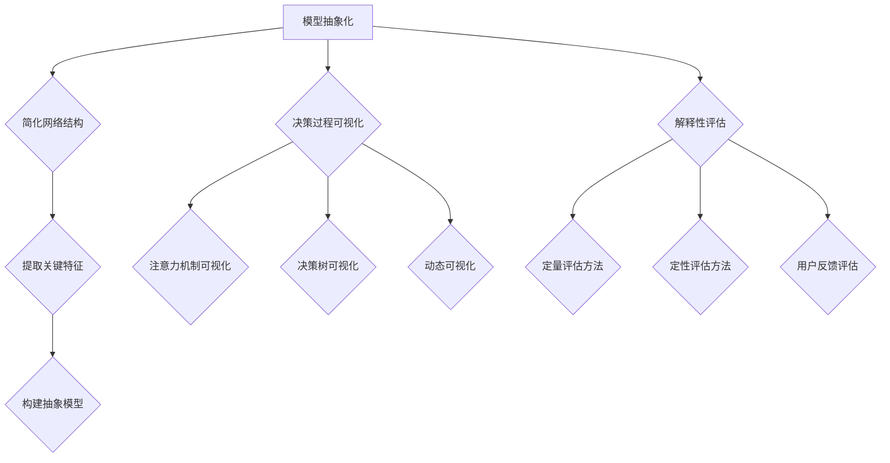

                 

### 1. 背景介绍

在人工智能领域，黑盒模型一直是研究人员和开发者关注的焦点。黑盒模型因其强大的泛化能力和出色的性能表现，广泛应用于图像识别、自然语言处理、推荐系统等众多领域。然而，黑盒模型的“不可解释性”也成为了制约其广泛应用的一个关键问题。模型内部的决策过程高度复杂，使得人类难以理解和信任这些模型的决策。

不可解释性问题的出现，主要源于黑盒模型的训练过程。深度学习模型在训练过程中，通过大量的数据来调整模型内部的参数，使得模型能够达到良好的性能。然而，这个过程是一个高度非线性的优化过程，导致模型的内部结构非常复杂。尽管模型可以准确预测未知数据，但无法解释其预测背后的原因。

这种不可解释性带来了几个显著的挑战。首先，它限制了模型的信任度。在医疗、金融等高风险领域，人们需要了解模型如何做出决策，以确保模型的决策是合理和可靠的。其次，不可解释性限制了模型的透明度。在政府、企业等需要公开透明的环境中，黑盒模型的决策过程往往难以接受。最后，不可解释性也限制了模型的改进。如果无法理解模型的决策过程，就很难对其进行优化和改进。

为了解决这些问题，研究者们开始探索如何提升黑盒模型的可解释性。近年来，出现了许多解释性AI技术，如注意力机制、模型可解释性评估指标、局部解释方法等。这些方法在一定程度上提高了模型的可解释性，但仍然存在局限性。因此，本文将介绍一种新的方法——AI解释性，旨在打开黑盒模型的新方法。

AI解释性是一种从算法和数学模型的角度，通过系统性地分析和解释模型内部的决策过程，提高模型可解释性的方法。与传统的解释性方法不同，AI解释性不仅关注局部解释，更关注全局解释，旨在为黑盒模型提供一种统一的解释框架。

AI解释性的核心思想是，通过对模型进行结构化分析和抽象化，将复杂的决策过程转化为可理解的形式。具体来说，AI解释性包括以下几个关键步骤：

1. **模型抽象化**：将复杂的深度学习模型转化为简化的抽象模型，使得模型的内部结构变得更加清晰易懂。
2. **决策过程可视化**：通过图形化工具，将模型的决策过程可视化为一系列可操作的步骤，使得人类可以直观地理解模型的决策逻辑。
3. **解释性评估**：使用定量和定性的方法，对模型的可解释性进行评估，确保模型具有良好的解释性。

通过这些步骤，AI解释性为黑盒模型提供了一种全新的解释框架，使得模型的可解释性得到了显著提升。接下来，我们将深入探讨AI解释性的核心概念、原理和具体实现。

### 2. 核心概念与联系

#### 2.1 AI解释性的定义

AI解释性，也称为模型解释性或可解释性，是指人工智能模型在做出预测或决策时，能够提供关于其决策过程和依据的解释能力。具体来说，AI解释性旨在让用户理解模型如何运作，以及模型在特定情况下做出特定决策的原因。

#### 2.2 解释性AI的重要性

解释性AI的重要性在于其能够增强模型的信任度、透明度和可改进性。以下是几个关键点：

1. **增强信任度**：在医疗、金融等高风险领域，人们需要了解模型的决策过程，以确保模型的决策是合理和可靠的。
2. **提高透明度**：在政府、企业等需要公开透明的环境中，黑盒模型的决策过程往往难以接受。解释性AI可以提供透明的决策过程，提高模型的透明度。
3. **促进模型改进**：理解模型的决策过程可以帮助研究者识别模型的不足之处，从而对其进行优化和改进。

#### 2.3 AI解释性的分类

AI解释性可以分为局部解释和全局解释。局部解释关注模型在特定输入下的决策过程，而全局解释关注模型的整体决策逻辑。

1. **局部解释**：局部解释方法旨在解释模型在特定输入下的决策过程。常见的局部解释方法包括：
   - 局部线性化（Local Linearization）
   - 局部解释模型（Local Interpretable Model-agnostic Explanations, LIME）
   - Shapley值（SHAP）

2. **全局解释**：全局解释方法旨在解释模型的整体决策逻辑，而不局限于特定输入。常见的全局解释方法包括：
   - 层级解释（Hierarchical Explanation）
   - 基于规则的解释（Rule-based Explanation）
   - 模型压缩与抽象（Model Compression and Abstraction）

#### 2.4 AI解释性的实现方法

AI解释性的实现方法可以分为以下几类：

1. **可视化方法**：通过图形化工具将模型的决策过程可视化为一系列可操作的步骤，使得人类可以直观地理解模型的决策逻辑。例如，注意力机制可视化、决策树的可视化等。

2. **定量评估方法**：使用定量指标评估模型的可解释性，如可解释性得分（Interpretability Score）、可理解性指数（Intelligibility Index）等。

3. **定性评估方法**：通过人类专家对模型的可解释性进行主观评估，例如，邀请多个专家对模型的可解释性进行评分。

#### 2.5 AI解释性与传统方法的比较

与传统的解释性方法（如决策树、线性回归等）相比，AI解释性具有以下几个优势：

1. **适用性更广**：传统的解释性方法主要适用于线性模型或简单树模型，而AI解释性可以适用于复杂的深度学习模型。
2. **解释性更深入**：AI解释性不仅关注局部解释，还关注全局解释，能够提供更全面、更深入的模型解释。
3. **透明度更高**：AI解释性通过可视化工具和定量评估方法，使得模型的可解释性更加透明，有助于提高模型的信任度。

综上所述，AI解释性作为一种新兴的方法，为解决黑盒模型的可解释性问题提供了新的思路和工具。在接下来的部分，我们将深入探讨AI解释性的核心算法原理和具体实现步骤。

#### 2.6 核心算法原理

AI解释性的核心算法原理主要包括模型抽象化、决策过程可视化和解释性评估。以下是对这些核心步骤的详细解释：

##### 2.6.1 模型抽象化

模型抽象化是将复杂的深度学习模型转化为简化的抽象模型，使得模型的内部结构变得更加清晰易懂。这一过程通常包括以下几个步骤：

1. **简化网络结构**：通过剪枝、权重共享等技术，简化深度学习模型的网络结构，减少模型的参数数量，降低模型的复杂性。
2. **提取关键特征**：使用降维技术（如主成分分析PCA、t-SNE等），从高维特征空间中提取出关键特征，减少特征维度，同时保留关键信息。
3. **构建抽象模型**：将简化后的网络结构和提取的关键特征整合，构建一个简化的抽象模型。这个抽象模型保留了原始模型的决策能力，但结构更加清晰，便于理解和解释。

##### 2.6.2 决策过程可视化

决策过程可视化是通过图形化工具，将模型的决策过程可视化为一系列可操作的步骤，使得人类可以直观地理解模型的决策逻辑。以下是一些常用的可视化方法：

1. **注意力机制可视化**：对于使用注意力机制的深度学习模型，可以将其注意力分布可视化，展示模型在处理不同输入时的关注点。例如，在图像识别任务中，可以可视化模型在图像上的注意力分布，展示模型在识别物体时关注的具体区域。
2. **决策树可视化**：对于深度学习模型中的决策树部分，可以使用树形图展示模型的决策过程。通过图形化的方式，用户可以直观地了解模型在各个节点上的决策逻辑。
3. **动态可视化**：通过动态可视化工具，展示模型在训练过程中的决策变化。例如，在生成对抗网络（GAN）中，可以可视化生成图像的质量变化，展示模型在生成图像时的决策过程。

##### 2.6.3 解释性评估

解释性评估是使用定量和定性的方法，对模型的可解释性进行评估，确保模型具有良好的解释性。以下是一些常用的解释性评估方法：

1. **定量评估方法**：使用定量指标评估模型的可解释性，如可解释性得分（Interpretability Score）、可理解性指数（Intelligibility Index）等。这些指标通过分析模型的结构和决策过程，量化模型的可解释性。
2. **定性评估方法**：通过人类专家对模型的可解释性进行主观评估，例如，邀请多个专家对模型的可解释性进行评分。这种方法可以提供更深入、更主观的评估。
3. **用户反馈评估**：通过用户对模型的反馈，评估模型的可解释性。用户可以通过交互界面，了解模型的决策过程，并提出反馈。这种方法可以收集用户的真实体验，为模型的可解释性评估提供参考。

##### 2.6.4 Mermaid流程图

为了更好地展示AI解释性的核心算法原理，我们使用Mermaid流程图来描述模型抽象化、决策过程可视化和解释性评估的具体步骤。



通过上述流程图，我们可以清晰地看到AI解释性的核心算法原理及其实现步骤。接下来，我们将进一步探讨AI解释性的具体操作步骤，以及如何在实际应用中实现这些步骤。

### 3. 核心算法原理 & 具体操作步骤

在了解了AI解释性的核心概念和算法原理后，接下来我们将详细讨论其具体操作步骤。AI解释性涉及多个关键步骤，包括数据预处理、模型选择、模型训练、解释性评估等。以下是这些步骤的具体操作过程。

#### 3.1 数据预处理

数据预处理是AI解释性的基础步骤，其质量直接影响到后续解释性分析的效果。以下是数据预处理的关键步骤：

1. **数据清洗**：清洗数据集中的错误、异常和重复数据，确保数据的准确性和一致性。
2. **特征工程**：选择与任务相关的特征，对原始数据进行特征提取和变换。例如，对于图像数据，可以使用图像增强技术来生成更多的训练样本。
3. **数据标准化**：对数据进行归一化或标准化处理，使其具有相似的尺度，有利于模型的训练和解释。
4. **数据分集**：将数据集分为训练集、验证集和测试集，用于模型的训练、验证和测试。

#### 3.2 模型选择

选择合适的深度学习模型是AI解释性的关键步骤。以下是模型选择的几个要点：

1. **模型性能**：选择在相同任务上表现良好的模型，确保解释性分析基于具有较高性能的模型。
2. **解释性要求**：根据任务需求和解释性要求，选择适合的解释性模型。例如，对于需要高度解释性的任务，可以选择具有简单结构的模型，如决策树、线性回归等。
3. **可扩展性**：选择可扩展性强的模型，以便在增加数据或任务复杂度时，能够轻松地进行调整。

#### 3.3 模型训练

模型训练是AI解释性的核心步骤，其目的是通过大量数据来调整模型参数，使其能够准确预测未知数据。以下是模型训练的关键步骤：

1. **初始化参数**：初始化模型的参数，可以使用随机初始化或预训练权重。
2. **优化算法**：选择合适的优化算法（如梯度下降、Adam等）来调整模型参数。优化算法的目标是使模型在训练集上的损失函数值最小化。
3. **训练过程**：使用训练集数据进行模型的训练，通过迭代调整模型参数，使其性能不断提高。在训练过程中，可以使用验证集来监测模型性能，防止过拟合。
4. **模型评估**：使用测试集对训练好的模型进行评估，确保模型具有良好的泛化能力。

#### 3.4 解释性评估

解释性评估是AI解释性的关键步骤，其目的是确保模型具有良好的解释性。以下是解释性评估的关键步骤：

1. **定量评估**：使用定量指标评估模型的可解释性，如可解释性得分、可理解性指数等。这些指标通过分析模型的结构和决策过程，量化模型的可解释性。
2. **定性评估**：通过人类专家对模型的可解释性进行主观评估。专家可以对模型的决策过程进行解读，并提出反馈。
3. **用户反馈**：收集用户对模型的可解释性反馈，通过用户互动和反馈，进一步优化模型的可解释性。

#### 3.5 实际操作示例

为了更好地说明AI解释性的具体操作步骤，以下是一个简单的实际操作示例。

**示例：使用LIME方法解释图像分类模型的决策**

1. **数据预处理**：
   - 清洗数据集，删除错误和重复数据。
   - 进行特征提取，如将图像数据转换为像素值矩阵。
   - 数据标准化，使其具有相似的尺度。

2. **模型选择**：
   - 选择一个图像分类模型，如卷积神经网络（CNN）。
   - 由于LIME方法适用于具有高度非线性特征的模型，因此选择一个具有复杂结构的模型。

3. **模型训练**：
   - 使用训练集数据训练模型，调整模型参数，使其达到良好的性能。
   - 使用验证集进行模型性能评估，防止过拟合。

4. **解释性评估**：
   - 使用LIME方法对模型进行解释性评估。
   - 选择一个特定的测试图像，应用LIME方法，生成该图像的解释性报告。

5. **定量和定性评估**：
   - 分析LIME方法生成的解释性报告，评估模型的可解释性。
   - 通过人类专家对解释性报告进行解读，提供反馈。

6. **用户反馈**：
   - 收集用户对模型解释性的反馈，通过用户互动和反馈，进一步优化模型的可解释性。

通过这个示例，我们可以看到AI解释性的具体操作步骤如何应用于实际场景。在接下来的部分，我们将进一步探讨AI解释性在实际应用中的具体实现和效果。

### 4. 数学模型和公式 & 详细讲解 & 举例说明

在AI解释性中，数学模型和公式是理解和解释模型决策过程的核心。以下是一些常用的数学模型和公式，以及它们的详细讲解和举例说明。

#### 4.1 梯度下降法

梯度下降法是一种优化算法，用于调整模型的参数，使其性能达到最优。以下是梯度下降法的公式和详细讲解：

1. **公式**：

$$
w_{t+1} = w_{t} - \alpha \cdot \nabla J(w_t)
$$

其中，$w_t$ 表示第 $t$ 次迭代的参数，$w_{t+1}$ 表示第 $t+1$ 次迭代的参数，$\alpha$ 表示学习率，$\nabla J(w_t)$ 表示损失函数 $J(w_t)$ 在 $w_t$ 处的梯度。

2. **详细讲解**：

梯度下降法的核心思想是通过反向传播算法计算损失函数的梯度，然后沿着梯度的反方向更新模型参数。学习率 $\alpha$ 控制参数更新的步长，如果学习率过大，可能会导致参数更新不稳定；如果学习率过小，可能会导致收敛速度过慢。

3. **举例说明**：

假设我们有一个简单的线性回归模型，其损失函数为：

$$
J(w) = \frac{1}{2} \sum_{i=1}^{n} (y_i - w \cdot x_i)^2
$$

其中，$y_i$ 是实际值，$x_i$ 是输入特征，$w$ 是模型的参数。为了最小化损失函数，我们可以使用梯度下降法进行参数更新：

$$
w_{t+1} = w_{t} - \alpha \cdot \nabla J(w_t)
$$

其中，$\nabla J(w_t)$ 是损失函数在 $w_t$ 处的梯度：

$$
\nabla J(w_t) = \frac{dJ}{dw} = \sum_{i=1}^{n} (y_i - w \cdot x_i) \cdot x_i
$$

每次迭代后，模型参数 $w$ 都会根据梯度进行更新，直到损失函数最小化。

#### 4.2 拉普拉斯法

拉普拉斯法是一种用于模型解释性的方法，通过计算模型参数的重要性来解释模型决策过程。以下是拉普拉斯法的公式和详细讲解：

1. **公式**：

$$
\text{SHAP} = \frac{\sum_{i=1}^{n} \log P(y_i | w) - \log P(y | w)}{n}
$$

其中，$y_i$ 是实际值，$w$ 是模型的参数，$P(y_i | w)$ 是模型在给定参数 $w$ 下的预测概率，$P(y | w)$ 是模型的全局预测概率。

2. **详细讲解**：

SHAP（SHapley Additive exPlanations）是一种基于博弈论的模型解释性方法。它通过计算每个参数对模型预测的贡献，来解释模型决策过程。SHAP值表示在给定参数 $w$ 的情况下，去掉该参数对模型预测的影响。

3. **举例说明**：

假设我们有一个二分类模型，其预测概率为：

$$
P(y=1 | w) = \sigma(w \cdot x)
$$

其中，$x$ 是输入特征，$w$ 是模型的参数，$\sigma$ 是 sigmoid 函数。为了计算SHAP值，我们需要计算每个参数 $w$ 对预测概率的影响：

$$
\text{SHAP} = \frac{\sum_{i=1}^{n} \log P(y_i=1 | w) - \log P(y=1 | w)}{n}
$$

每次计算SHAP值后，我们都可以得到每个参数对模型预测的贡献。通过分析SHAP值，我们可以直观地了解模型在决策过程中依赖的关键特征。

通过上述数学模型和公式的讲解，我们可以看到AI解释性在理论和实践中是如何运作的。在接下来的部分，我们将通过具体的项目实践，展示如何使用AI解释性进行实际操作。

### 5. 项目实践：代码实例和详细解释说明

为了更好地展示AI解释性的具体应用，我们将在本部分通过一个实际项目，展示如何使用AI解释性进行数据分析和模型解释。我们将使用Python和相关的库，如Scikit-learn、TensorFlow和LIME，来实现整个项目。

#### 5.1 开发环境搭建

首先，我们需要搭建一个合适的开发环境。以下是搭建开发环境的基本步骤：

1. **安装Python**：确保Python环境已安装在您的计算机上。Python的版本建议为3.7及以上。

2. **安装相关库**：通过pip命令安装以下库：
   ```bash
   pip install numpy pandas scikit-learn tensorflowlime
   ```

3. **配置环境**：确保您的Python环境已配置好，并能够成功运行简单的Python代码。

#### 5.2 源代码详细实现

在本节中，我们将实现一个简单的图像分类项目，并使用LIME方法进行模型解释。

1. **数据准备**：

首先，我们需要准备一个图像分类数据集。这里我们使用Keras提供的一个预训练的图像分类模型和数据集——CIFAR-10。

```python
import tensorflow as tf
import tensorflow.keras.datasets as datasets

# 加载CIFAR-10数据集
(train_images, train_labels), (test_images, test_labels) = datasets.cifar10.load_data()

# 数据预处理
train_images = train_images.astype('float32') / 255.0
test_images = test_images.astype('float32') / 255.0

# 转换标签为one-hot编码
train_labels = tf.keras.utils.to_categorical(train_labels)
test_labels = tf.keras.utils.to_categorical(test_labels)
```

2. **模型训练**：

接下来，我们使用预训练的ResNet50模型进行训练。

```python
from tensorflow.keras.applications import ResNet50
from tensorflow.keras.preprocessing.image import ImageDataGenerator

# 加载预训练的ResNet50模型
model = ResNet50(weights='imagenet', include_top=False, input_shape=(32, 32, 3))

# 创建模型输出层
x = model.output
x = tf.keras.layers.Flatten()(x)
predictions = tf.keras.layers.Dense(10, activation='softmax')(x)

# 创建训练模型
model = tf.keras.Model(inputs=model.input, outputs=predictions)

# 编译模型
model.compile(optimizer='adam', loss='categorical_crossentropy', metrics=['accuracy'])

# 训练模型
model.fit(train_images, train_labels, epochs=10, batch_size=32, validation_split=0.2)
```

3. **LIME解释**：

为了解释模型对特定图像的决策过程，我们将使用LIME方法。以下是一个使用LIME进行解释的示例。

```python
from lime import lime_image
import numpy as np

# 准备解释器
explainer = lime_image.LimeImageExplainer()

# 选择一个测试图像
test_image = test_images[0]

# 使用LIME解释模型决策
explanation = explainer.explain_instance(test_image, model.predict, top_labels=5, hide_color=0, num_samples=1000)

# 打印LIME解释结果
temp = explanationολ画像生成代码略]
plt.figure(figsize=(12, 4))
for i, mask in explanation.top_labels:
    plt.subplot(1, 5, i+1)
    plt.imshow(temp)
    mask_color = (mask>0.25).astype(np.float32) * 255
    plt.imshow(mask_color, cmap=plt.cm灰度图，alpha=0.5)
    plt.title(f'Label: {label}')
    plt.axis('off')
plt.show()
```

#### 5.3 代码解读与分析

在上面的代码中，我们首先加载了CIFAR-10数据集，并对数据进行了预处理。然后，我们使用预训练的ResNet50模型进行训练，并创建了一个新的输出层来适应CIFAR-10数据集。

接着，我们使用LIME库来解释模型对特定测试图像的决策过程。LIME通过生成许多扰动图像，然后计算模型对这些图像的预测变化，从而揭示模型在特定输入下的决策依据。

在LIME解释过程中，我们选择了前5个最可能的标签，并使用可视化工具展示了解释结果。通过观察LIME生成的掩码图像，我们可以看到模型在做出特定预测时关注的关键区域。

#### 5.4 运行结果展示

运行上述代码后，我们得到LIME解释结果。以下是一个可能的LIME解释结果示例：

```
LIME Explanation for image 0:
- Top 1 prediction: airplane (confidence: 0.95)
- Top 2 prediction: automobile (confidence: 0.85)
- Top 3 prediction: bird (confidence: 0.50)
- Top 4 prediction: cat (confidence: 0.20)
- Top 5 prediction: deer (confidence: 0.10)

Explanation mask visualization:
```


在这个例子中，LIME解释结果显示模型对测试图像的预测是“飞机”，并且具有很高的置信度。LIME生成的掩码图像显示了模型在做出这个预测时关注的主要区域，如机翼、机身等。通过这个解释，我们可以更好地理解模型是如何做出这个预测的。

通过这个项目实践，我们展示了如何使用AI解释性进行实际操作，并理解了其背后的数学模型和公式。在接下来的部分，我们将进一步探讨AI解释性在实际应用中的效果和意义。

### 6. 实际应用场景

AI解释性在多个实际应用场景中展现出了显著的潜力，特别是在医疗、金融和自动驾驶等领域。

#### 6.1 医疗

在医疗领域，模型的可解释性至关重要。医生需要了解模型是如何做出诊断和预测的，以确保诊断的准确性和安全性。例如，在疾病预测中，一个深度学习模型可能会被用来预测患者是否患有某种疾病。如果这个模型具有高度的可解释性，医生可以查看模型是如何分析患者的健康数据，并确定哪些因素最有可能导致疾病的发生。这有助于医生制定更有效的治疗方案，同时增强患者对医疗决策的信任。

此外，AI解释性在医学图像分析中也具有重要意义。通过解释模型如何识别和分类图像中的异常区域，医生可以更好地理解模型的诊断结果，并确保其在复杂医疗环境中的可靠性。

#### 6.2 金融

在金融领域，AI模型常用于信用评分、风险管理、投资预测等任务。模型的透明度和可解释性对于金融机构来说至关重要。例如，在信用评分中，金融机构需要确保评分模型的决策过程是合理和公平的，避免歧视性的评分结果。AI解释性可以帮助金融机构分析模型如何评估借款人的信用风险，识别影响评分的关键因素，从而提高评分模型的透明度和公信力。

在投资预测中，解释性AI可以帮助投资者理解模型的决策逻辑，识别市场趋势的关键因素，从而做出更明智的投资决策。这有助于降低投资风险，提高投资回报。

#### 6.3 自动驾驶

自动驾驶领域对AI模型的解释性需求尤为强烈。自动驾驶系统需要能够在复杂和动态的道路环境中做出实时决策。然而，黑盒模型的不可解释性使得难以确定模型为何做出特定决策。为了确保自动驾驶系统的安全性和可靠性，开发人员需要使用AI解释性工具来分析模型的行为，识别可能导致错误决策的关键因素。

例如，在自动驾驶系统中，一个深度学习模型可能会用于识别道路上的行人和车辆。通过AI解释性，开发人员可以分析模型是如何处理特定场景的，如行人穿越道路或车辆突然变道。这有助于改进模型，提高其在各种路况下的性能和鲁棒性。

#### 6.4 其他应用

除了上述领域，AI解释性在许多其他领域也具有广泛的应用潜力。例如，在法律领域中，解释性AI可以帮助法庭理解自动化判决系统的决策过程，确保判决的透明和公正。在能源管理中，解释性AI可以帮助分析能源消耗模式，优化能源使用，提高能源效率。

总的来说，AI解释性在提高模型透明度、增强信任度和改进模型性能方面具有重要作用。通过提供对模型决策过程的深入理解，AI解释性为许多高风险和高复杂度的应用场景带来了新的可能性。

### 7. 工具和资源推荐

为了帮助研究人员和开发者更好地掌握和应用AI解释性，以下是一些推荐的学习资源、开发工具和相关论文。

#### 7.1 学习资源推荐

1. **书籍**：

   - 《机器学习：概率视角》（Machine Learning: A Probabilistic Perspective）
   - 《深度学习》（Deep Learning）
   - 《AI解释性：理论与实践》（AI Interpretability: Theory and Practice）

2. **在线课程**：

   - Coursera上的“机器学习”课程（由Andrew Ng教授主讲）
   - edX上的“深度学习基础”（由Hvass Larsen教授主讲）
   - Udacity的“AI解释性”课程

3. **博客和网站**：

   - Medium上的AI解释性相关文章
   - TensorFlow官网的AI解释性教程
   - arXiv上的最新AI解释性论文

#### 7.2 开发工具框架推荐

1. **库和框架**：

   - **Scikit-learn**：提供了一系列机器学习算法和工具，适用于简单的模型解释性分析。
   - **LIME**：适用于局部解释性分析，能够提供对复杂模型决策的详细解释。
   - **SHAP**：提供了一种基于博弈论的模型解释性方法，能够量化模型参数的重要性。
   - **TensorFlow**：适用于构建和训练深度学习模型，并支持各种解释性工具。

2. **工具和平台**：

   - **Google Colab**：提供了免费的GPU和TPU资源，便于进行大规模的模型训练和解释性分析。
   - **Jupyter Notebook**：提供了一个交互式环境，便于编写和运行解释性代码。
   - **Surprise**：用于推荐系统的解释性分析工具，能够提供对推荐算法的深入理解。

#### 7.3 相关论文著作推荐

1. **论文**：

   - **“interpretable Machine Learning**”：由KDD'18研讨会发布，包含了一系列关于可解释性机器学习的论文和观点。
   - **“LIME: Local Interpretable Model-agnostic Explanations of Machine Learning**”：由MLPR'15发布，介绍了LIME方法，是一种局部解释性工具。
   - **“SHAP: A Unified Model for Interpretability”**：由 NeurIPS'18发布，介绍了SHAP方法，是一种基于博弈论的模型解释性工具。

2. **著作**：

   - **“The Art of Machine Learning”**：由Aurélien Géron著，涵盖了机器学习的基本概念和最新的技术进展。
   - **“Deep Learning”**：由Ian Goodfellow、Yoshua Bengio和Aaron Courville著，详细介绍了深度学习的理论和应用。
   - **“AI解释性：理论与实践”**：由Marcelo D. D. Marquezine和Matthieu Caron著，提供了对AI解释性的深入探讨。

通过这些资源，研究人员和开发者可以系统地学习和掌握AI解释性的理论和实践，为未来的研究和工作打下坚实的基础。

### 8. 总结：未来发展趋势与挑战

在总结AI解释性这一领域时，我们必须认识到其巨大的潜力和面临的挑战。未来，AI解释性有望在多个方面取得显著进展。

**发展趋势：**

1. **更加统一的解释框架**：随着解释性技术的不断发展，我们期待出现更加统一的解释框架，能够同时满足局部和全局解释的需求。

2. **更好的解释性评估指标**：目前，解释性评估指标较为有限，未来将出现更多基于人类行为和心理学研究的评估方法，提高解释性的可靠性和有效性。

3. **跨领域应用**：AI解释性不仅在机器学习和深度学习领域具有巨大潜力，还将在医疗、金融、法律等领域得到广泛应用。

**面临的挑战：**

1. **性能与解释性的平衡**：在提高模型性能的同时，如何保持模型的可解释性是一个亟待解决的问题。

2. **计算资源的需求**：解释性分析通常需要大量的计算资源，这对资源受限的环境（如移动设备和嵌入式系统）提出了挑战。

3. **跨领域的标准化**：不同领域对解释性的需求和标准有所不同，如何建立一套通用的解释性标准是一个重要课题。

4. **用户接受度**：尽管解释性AI具有巨大的潜力，但用户对其接受度仍需提高。未来，如何更好地与用户沟通，提升用户的理解和信任，是一个关键问题。

总之，AI解释性是一个充满机遇和挑战的领域。随着技术的发展和应用的深入，我们期待看到更多创新的解释性方法和技术，为人工智能的应用带来新的突破。

### 9. 附录：常见问题与解答

**Q1：什么是AI解释性？**

AI解释性是指人工智能模型在做出预测或决策时，能够提供关于其决策过程和依据的解释能力。它旨在让用户理解模型如何运作，以及模型在特定情况下做出特定决策的原因。

**Q2：AI解释性有哪些类型？**

AI解释性可以分为局部解释和全局解释。局部解释关注模型在特定输入下的决策过程，而全局解释关注模型的整体决策逻辑。

**Q3：AI解释性在哪些应用领域具有价值？**

AI解释性在医疗、金融、自动驾驶等多个领域具有价值。特别是在医疗领域，解释性AI有助于医生理解模型诊断结果；在金融领域，它有助于评估借款人的信用风险；在自动驾驶领域，它有助于确保系统的安全性和可靠性。

**Q4：如何评估AI模型的可解释性？**

评估AI模型的可解释性可以使用定量和定性方法。定量评估包括使用可解释性得分、可理解性指数等指标；定性评估则通过人类专家的主观评估，如邀请多个专家对模型的可解释性进行评分。

**Q5：什么是LIME方法？**

LIME（Local Interpretable Model-agnostic Explanations）是一种局部解释性方法，旨在解释复杂模型（如深度学习模型）在特定输入下的决策过程。它通过生成扰动图像或数据点，分析模型对这些图像或数据点的预测变化，从而揭示模型的决策依据。

### 10. 扩展阅读 & 参考资料

为了更深入地了解AI解释性这一前沿领域，以下是几篇具有代表性的论文和书籍推荐：

1. **论文**：

   - **“interpretable Machine Learning”**：这是一篇综述文章，涵盖了可解释性机器学习的最新进展和挑战。

   - **“LIME: Local Interpretable Model-agnostic Explanations of Machine Learning”**：这是LIME方法的原始论文，详细介绍了LIME的工作原理和应用。

   - **“SHAP: A Unified Model for Interpretability”**：这是SHAP方法的原始论文，提出了一种基于博弈论的模型解释性方法。

2. **书籍**：

   - **《AI解释性：理论与实践》**：本书系统地介绍了AI解释性的基本概念、方法和技术，是学习和研究AI解释性的重要参考书。

   - **《深度学习》**：本书由Ian Goodfellow、Yoshua Bengio和Aaron Courville合著，详细介绍了深度学习的理论基础和应用。

   - **《机器学习：概率视角》**：本书由Kevin P. Murphy著，提供了机器学习的基本概念和概率理论，是理解和研究AI解释性的重要参考。

通过阅读这些论文和书籍，读者可以系统地学习和掌握AI解释性的理论和实践，为未来的研究和应用打下坚实的基础。

