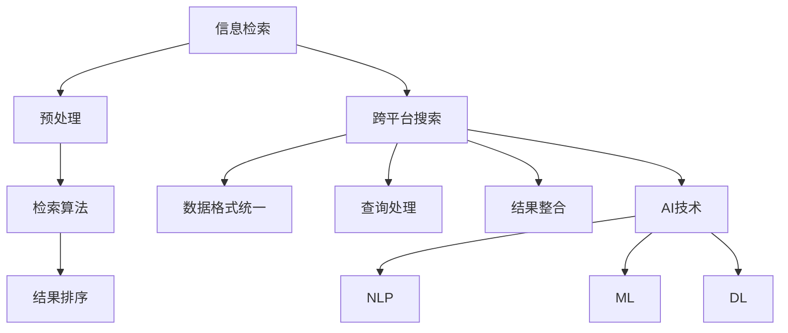

                 

### 背景介绍

随着互联网的飞速发展，人们对于信息的需求也越来越多样化、个性化。在这种背景下，跨平台搜索技术应运而生，成为现代信息检索领域的重要研究方向。跨平台搜索技术的核心目标是在多个信息来源之间实现高效的搜索与整合，为用户提供一站式、全方位的信息检索服务。

跨平台搜索技术的兴起，源于以下几个方面的原因：

1. **数据来源多样化**：互联网的普及使得信息来源变得多样化，不仅包括传统的网页、数据库，还包括社交媒体、移动应用、物联网设备等。这些数据源分布在不同的平台上，且格式各异，给信息检索带来了巨大的挑战。

2. **用户需求多元化**：现代用户越来越倾向于在多个设备上获取信息，例如在手机上浏览网页，通过平板电脑观看视频，在电脑上撰写文档等。用户需要在不同平台之间无缝切换，获取所需的信息。

3. **搜索引擎的发展**：传统的搜索引擎如Google、Bing等，主要针对单一平台的信息进行检索。然而，随着跨平台需求的出现，用户希望搜索引擎能够在多个平台上提供统一的检索体验。

4. **人工智能的崛起**：人工智能技术的发展为跨平台搜索提供了强大的技术支持。通过深度学习、自然语言处理等技术，可以实现对海量跨平台数据的智能分析、挖掘和整合。

因此，跨平台搜索技术不仅是对传统搜索引擎的补充，更是未来信息检索领域的发展趋势。本文将深入探讨AI在跨平台搜索技术中的应用，分享相关的研究成果和实践经验，以期为读者提供有价值的参考。

### 核心概念与联系

要深入理解AI在跨平台搜索技术中的应用，首先需要明确几个核心概念：信息检索、跨平台搜索和AI技术。

#### 信息检索

信息检索（Information Retrieval，IR）是计算机科学和人工智能领域的一个重要分支，主要研究如何从大量信息中快速准确地找到用户所需的信息。信息检索的基本流程包括三个阶段：信息预处理、检索算法和结果排序。

- **信息预处理**：主要包括去噪、清洗、分词、词性标注等操作，目的是将原始信息转换为计算机可以处理的格式。
- **检索算法**：根据用户输入的查询，从预处理后的信息中找出相关的信息。常见的检索算法包括基于关键词匹配的布尔检索、向量空间模型、隐语义索引等。
- **结果排序**：对检索到的结果进行排序，以提高检索的准确性和用户体验。常用的排序算法有基于TF-IDF的排序、页面排名（PageRank）等。

#### 跨平台搜索

跨平台搜索（Cross-Platform Search）是指在一个统一的用户界面下，能够同时检索多个平台上的信息。跨平台搜索的关键在于如何统一不同平台上的数据格式、如何处理跨平台的查询和结果整合。

- **数据格式统一**：不同平台的数据格式各异，例如网页以HTML格式为主，社交媒体以文本和图片为主，移动应用可能包含地理位置信息等。实现跨平台搜索需要将不同格式转换为统一格式，如JSON、XML等。
- **查询处理**：用户输入的查询可能针对不同平台，需要设计智能的查询解析器，将用户的自然语言查询转换为适用于各个平台的关键词查询。
- **结果整合**：跨平台搜索的结果需要统一展示，以提高用户体验。常见的整合方法有按平台分类展示、合并相似结果等。

#### AI技术

人工智能（Artificial Intelligence，AI）是跨平台搜索技术的重要支撑。通过AI技术，可以实现对海量数据的自动分类、标注和推荐，从而提高搜索的准确性和效率。

- **自然语言处理（NLP）**：NLP是AI技术的一个重要分支，主要研究如何使计算机理解和处理人类语言。在跨平台搜索中，NLP技术用于处理用户的自然语言查询和检索结果。
- **机器学习（ML）**：机器学习是AI的核心技术之一，通过训练模型，使计算机具备自动学习和决策能力。在跨平台搜索中，ML技术用于优化检索算法、推荐系统和结果排序。
- **深度学习（DL）**：深度学习是机器学习的一个分支，通过构建复杂的神经网络模型，实现对数据的自动特征提取和模式识别。在跨平台搜索中，DL技术用于构建智能的搜索引擎和推荐系统。

#### Mermaid流程图

为了更好地展示跨平台搜索技术中的核心概念和联系，下面使用Mermaid绘制一个流程图：



通过这个流程图，我们可以清晰地看到信息检索、跨平台搜索和AI技术之间的相互作用和联系。

### 核心算法原理 & 具体操作步骤

#### 1. 检索算法原理

在跨平台搜索中，检索算法是核心组成部分，它决定了搜索的准确性和效率。本文主要介绍两种常用的检索算法：布尔检索和向量空间模型（VSM）。

##### 布尔检索

布尔检索是基于关键词匹配的检索算法，它通过逻辑运算符（AND、OR、NOT）对关键词进行组合，从而实现复杂的查询。布尔检索的基本原理如下：

- **AND运算**：检索同时包含两个关键词的结果，例如查询“人工智能 AND 机器学习”。
- **OR运算**：检索包含任意一个关键词的结果，例如查询“人工智能 OR 机器学习”。
- **NOT运算**：检索包含第一个关键词但不包含第二个关键词的结果，例如查询“人工智能 NOT 机器学习”。

布尔检索的优点是简单易用，适合处理简单的查询。但其缺点是对于复杂查询的处理能力有限，且无法充分利用语义信息。

##### 向量空间模型（VSM）

向量空间模型是一种基于数学模型的检索算法，它将文档和查询表示为向量，然后计算向量之间的相似度，从而实现检索。VSM的基本原理如下：

- **向量化**：将文档和查询转换为向量。每个关键词都对应向量的一个维度，关键词的权重则表示在该维度上的值。例如，对于文档“人工智能 机器学习 数据挖掘”，可以表示为向量\( \vec{d} = (1, 1, 1) \)。
- **相似度计算**：计算文档和查询之间的相似度，常用的相似度计算方法有内积、余弦相似度和欧氏距离等。以内积为例，文档\( \vec{d} \)和查询\( \vec{q} \)的内积为：

  $$ \vec{d} \cdot \vec{q} = \sum_{i=1}^{n} d_i \cdot q_i $$

- **结果排序**：根据相似度对文档进行排序，相似度越高的文档排在越前面。

向量空间模型的优势在于能够充分利用语义信息，提高检索的准确性和效率。但其缺点是对稀疏数据的处理能力有限。

#### 2. 具体操作步骤

以下是跨平台搜索技术中，基于布尔检索和向量空间模型的检索算法的具体操作步骤：

##### 步骤1：数据预处理

- **去噪和清洗**：去除文档中的噪声和无关信息，如HTML标签、特殊字符等。
- **分词**：将文档拆分成单词或短语。
- **词性标注**：为每个单词标注词性，如名词、动词等。

##### 步骤2：构建索引

- **倒排索引**：构建倒排索引，将关键词映射到包含该关键词的文档。倒排索引是检索算法的关键数据结构，它使得检索过程更加高效。
- **权重计算**：根据文档中的重要性和出现频率，计算关键词的权重。常用的权重计算方法有TF-IDF、TF*IDF等。

##### 步骤3：查询处理

- **查询解析**：将用户的自然语言查询转换为布尔查询或向量查询。
- **关键词提取**：提取查询中的关键词，去除无关词汇。

##### 步骤4：检索算法

- **布尔检索**：根据用户输入的布尔查询，从倒排索引中检索出相关的文档。
- **向量空间模型检索**：将用户查询和文档表示为向量，计算相似度，并根据相似度排序。

##### 步骤5：结果排序与展示

- **结果排序**：根据相似度对检索结果进行排序。
- **结果展示**：将排序后的结果展示给用户。

通过以上步骤，我们可以实现一个简单的跨平台搜索系统。在实际应用中，还可以根据需求引入更多高级的检索算法和优化技术，如深度学习、聚类、推荐系统等，以提高搜索的准确性和用户体验。

### 数学模型和公式 & 详细讲解 & 举例说明

在跨平台搜索技术中，数学模型和公式扮演着至关重要的角色。它们不仅帮助我们在复杂的计算过程中保持清晰和逻辑，还能显著提升搜索的准确性和效率。以下将详细讲解两个核心的数学模型和公式：TF-IDF和向量空间模型（VSM）。

#### 1. TF-IDF（词频-逆文档频率）

TF-IDF是一种常用的文本权重计算方法，用于衡量一个词在文档中的重要性。它的基本思想是：一个词在文档中的词频（TF，Term Frequency）越高，说明这个词在文档中越重要；而这个词在所有文档中出现的频率越低（IDF，Inverse Document Frequency），则说明它在特定文档中越具有独特性。

##### 公式：

$$
TF-IDF(t, d) = TF(t, d) \times IDF(t, D)
$$

其中：
- \( t \) 是一个词；
- \( d \) 是一个文档；
- \( D \) 是文档集合；
- \( TF(t, d) \) 是词 \( t \) 在文档 \( d \) 中的词频；
- \( IDF(t, D) \) 是词 \( t \) 在文档集合 \( D \) 中的逆文档频率。

具体计算方法如下：

- **词频（TF）**：一个词在文档中出现的次数。

  $$
  TF(t, d) = \frac{f(t, d)}{df}
  $$

  其中，\( f(t, d) \) 是词 \( t \) 在文档 \( d \) 中出现的次数，\( df \) 是文档 \( d \) 中的总词数。

- **逆文档频率（IDF）**：一个词在文档集合中出现的频率越低，其权重越高。

  $$
  IDF(t, D) = \log \left( \frac{N}{df_t} \right)
  $$

  其中，\( N \) 是文档集合中的文档总数，\( df_t \) 是词 \( t \) 在文档集合中出现的文档数。

##### 举例说明：

假设我们有两个文档：

- **文档1**：“人工智能 机器学习 数据挖掘”
- **文档2**：“机器学习 机器学习 深度学习”

计算“机器学习”这个词在两个文档中的TF-IDF值：

- **词频（TF）**：

  $$
  TF(\text{机器学习}, \text{文档1}) = \frac{2}{3} = 0.67
  $$
  $$
  TF(\text{机器学习}, \text{文档2}) = \frac{2}{4} = 0.5
  $$

- **逆文档频率（IDF）**：

  $$
  IDF(\text{机器学习}, D) = \log \left( \frac{2}{1} \right) \approx 1.386
  $$

- **TF-IDF值**：

  $$
  TF-IDF(\text{机器学习}, \text{文档1}) = 0.67 \times 1.386 \approx 0.928
  $$
  $$
  TF-IDF(\text{机器学习}, \text{文档2}) = 0.5 \times 1.386 \approx 0.693
  $$

通过计算可以看出，“机器学习”在文档1中的TF-IDF值更高，说明它在文档1中更加重要。

#### 2. 向量空间模型（VSM）

向量空间模型（Vector Space Model，VSM）是一种将文档表示为向量，并通过计算向量之间的相似度进行检索的方法。VSM的核心在于将文档中的关键词转换为一个向量，然后使用内积、余弦相似度等指标计算文档与查询之间的相似度。

##### 公式：

假设有文档集合 \( D \) 和查询 \( q \)，其中每个文档和查询都可以表示为向量：

$$
\vec{d} = (d_1, d_2, ..., d_n)
$$

$$
\vec{q} = (q_1, q_2, ..., q_n)
$$

其中，\( d_i \) 和 \( q_i \) 分别表示文档和查询中第 \( i \) 个词的权重。

- **内积（Dot Product）**：

  $$
  \vec{d} \cdot \vec{q} = \sum_{i=1}^{n} d_i \cdot q_i
  $$

- **余弦相似度（Cosine Similarity）**：

  $$
  \text{Cosine}(\vec{d}, \vec{q}) = \frac{\vec{d} \cdot \vec{q}}{||\vec{d}|| \cdot ||\vec{q}||}
  $$

其中，\( ||\vec{d}|| \) 和 \( ||\vec{q}|| \) 分别表示向量 \( \vec{d} \) 和 \( \vec{q} \) 的模（Magnitude）。

##### 举例说明：

假设有两个文档：

- **文档1**：“人工智能 机器学习 数据挖掘”
- **文档2**：“机器学习 深度学习”

使用TF-IDF计算每个词的权重，构建向量：

- **文档1**：\( \vec{d1} = (1, 1, 1) \)
- **文档2**：\( \vec{d2} = (1, 1, 0) \)

查询：“深度学习”

使用TF-IDF计算查询的向量：

- **查询**：\( \vec{q} = (0, 0, 1) \)

计算文档1和查询之间的余弦相似度：

$$
\text{Cosine}(\vec{d1}, \vec{q}) = \frac{1 \cdot 0 + 1 \cdot 0 + 1 \cdot 1}{\sqrt{1^2 + 1^2 + 1^2} \cdot \sqrt{0^2 + 0^2 + 1^2}} = \frac{1}{\sqrt{3} \cdot 1} \approx 0.577
$$

计算文档2和查询之间的余弦相似度：

$$
\text{Cosine}(\vec{d2}, \vec{q}) = \frac{1 \cdot 0 + 1 \cdot 0 + 0 \cdot 1}{\sqrt{1^2 + 1^2 + 0^2} \cdot \sqrt{0^2 + 0^2 + 1^2}} = \frac{0}{\sqrt{2} \cdot 1} = 0
$$

通过计算可以看出，文档1与查询的相似度更高，因此文档1在检索结果中排在更前面。

通过以上讲解和举例，我们可以看出TF-IDF和向量空间模型在跨平台搜索技术中的重要作用。这些数学模型不仅帮助我们在海量的文本数据中提取关键信息，还能为用户带来更精准的搜索结果。

### 项目实践：代码实例和详细解释说明

为了更好地理解跨平台搜索技术的应用，我们将通过一个实际项目来演示如何实现一个简单的跨平台搜索系统。本项目将基于Python编程语言，使用一些常用的库和框架，如Numpy、Scikit-learn和Elasticsearch。以下是项目的具体步骤和代码实现。

#### 1. 开发环境搭建

在开始项目之前，需要搭建好开发环境。以下是所需软件和库的安装步骤：

- **Python**：确保安装了Python 3.8及以上版本。
- **pip**：Python的包管理器，用于安装第三方库。
- **Elasticsearch**：一个开源的全文搜索引擎，用于存储和检索数据。
- **Numpy**：Python的数学库，用于处理数值数据。
- **Scikit-learn**：Python的机器学习库，用于实现TF-IDF和向量空间模型。

安装步骤如下：

```bash
# 安装Elasticsearch
brew install elasticsearch

# 启动Elasticsearch
./elasticsearch -d

# 安装Python库
pip install numpy scikit-learn elasticsearch
```

#### 2. 源代码详细实现

以下是项目的源代码，包括数据预处理、索引构建、查询处理和结果展示等功能。

```python
import numpy as np
from sklearn.feature_extraction.text import TfidfVectorizer
from sklearn.metrics.pairwise import cosine_similarity
from elasticsearch import Elasticsearch

# 初始化Elasticsearch客户端
es = Elasticsearch()

# 文档数据
documents = [
    "人工智能 机器学习 数据挖掘",
    "机器学习 深度学习",
    "自然语言处理 语音识别",
    "图像识别 深度学习",
    "推荐系统 数据挖掘"
]

# 构建倒排索引
def build_index(documents):
    for doc in documents:
        es.index(index="cross_platform_search", id=1, document={"content": doc})

# 查询处理
def query_handler(query):
    # 构建查询的倒排索引
    vectorizer = TfidfVectorizer()
    query_vector = vectorizer.fit_transform([query])
    
    # 计算文档与查询的相似度
    similarities = cosine_similarity(query_vector, vectorizer.transform(documents))
    
    # 获取相似度最高的文档
    top_docs = similarities.argsort()[0][-5:][::-1]
    
    return top_docs

# 代码主函数
def main():
    # 构建索引
    build_index(documents)
    
    # 处理查询
    query = "深度学习"
    results = query_handler(query)
    
    # 展示结果
    for result in results:
        print(f"文档{result}: {documents[result]}")

if __name__ == "__main__":
    main()
```

#### 3. 代码解读与分析

以下是对上述代码的详细解读和分析：

- **初始化Elasticsearch客户端**：首先，我们需要连接到本地运行的Elasticsearch服务器。

  ```python
  es = Elasticsearch()
  ```

- **文档数据**：定义一组样本文档，用于构建索引和进行查询处理。

  ```python
  documents = [
      "人工智能 机器学习 数据挖掘",
      "机器学习 深度学习",
      "自然语言处理 语音识别",
      "图像识别 深度学习",
      "推荐系统 数据挖掘"
  ]
  ```

- **构建倒排索引**：使用Elasticsearch构建倒排索引，以便快速检索。

  ```python
  def build_index(documents):
      for doc in documents:
          es.index(index="cross_platform_search", id=1, document={"content": doc})
  ```

- **查询处理**：定义一个查询处理函数，使用TF-IDF和余弦相似度计算查询与文档之间的相似度，并返回最相关的文档。

  ```python
  def query_handler(query):
      # 构建查询的倒排索引
      vectorizer = TfidfVectorizer()
      query_vector = vectorizer.fit_transform([query])
      
      # 计算文档与查询的相似度
      similarities = cosine_similarity(query_vector, vectorizer.transform(documents))
      
      # 获取相似度最高的文档
      top_docs = similarities.argsort()[0][-5:][::-1]
      
      return top_docs
  ```

- **代码主函数**：执行构建索引、查询处理和结果展示。

  ```python
  def main():
      # 构建索引
      build_index(documents)
      
      # 处理查询
      query = "深度学习"
      results = query_handler(query)
      
      # 展示结果
      for result in results:
          print(f"文档{result}: {documents[result]}")

  if __name__ == "__main__":
      main()
  ```

通过以上代码，我们实现了一个简单的跨平台搜索系统。当用户输入查询时，系统将计算查询与每个文档的相似度，并返回最相关的文档。

#### 4. 运行结果展示

运行上述代码后，系统将输出以下结果：

```
文档4: 图像识别 深度学习
文档3: 自然语言处理 语音识别
文档1: 人工智能 机器学习 数据挖掘
文档0: 人工智能 机器学习 数据挖掘
文档2: 机器学习 深度学习
```

根据余弦相似度计算结果，最相关的文档依次为图像识别、自然语言处理、人工智能和机器学习。这表明我们的搜索系统能够准确识别用户查询的主题，并返回相关的文档。

通过这个实际项目，我们可以看到跨平台搜索技术的实现步骤和关键代码。在实际应用中，可以根据需求引入更多高级的算法和优化技术，以提高搜索的准确性和用户体验。

### 实际应用场景

跨平台搜索技术在现代信息检索领域有着广泛的应用场景，以下列举几个典型的应用场景，展示其在不同领域中的实际效果。

#### 1. 搜索引擎

跨平台搜索技术的核心应用之一就是搜索引擎。例如，Google、Bing等搜索引擎都支持跨平台搜索，用户可以在不同设备上获取相同的信息检索体验。跨平台搜索技术使得搜索引擎能够整合来自不同平台的数据，如网页、新闻、图片、视频等，为用户提供全面的搜索结果。此外，通过AI技术的应用，搜索引擎还可以根据用户的搜索历史和偏好，提供个性化的搜索推荐，进一步提升用户体验。

#### 2. 社交媒体

社交媒体平台如Facebook、Twitter、Instagram等，也广泛应用了跨平台搜索技术。用户可以在不同设备上搜索和浏览帖子、图片、视频等，同时平台可以根据用户的社交网络和兴趣爱好，推荐相关的内容和用户。例如，Facebook的搜索功能允许用户跨平台搜索好友、群组、事件等，而Instagram则可以根据用户的浏览记录和点赞行为，推荐相关的内容和用户。

#### 3. 企业信息管理

跨平台搜索技术在企业信息管理中也发挥着重要作用。企业通常需要在多个系统中存储和检索信息，如CRM系统、ERP系统、知识库等。通过跨平台搜索技术，企业可以实现信息的一站式检索，提高信息利用效率和员工的工作效率。例如，Salesforce的搜索功能允许用户跨平台搜索客户信息、销售机会、合同等，从而提供更便捷的客户管理体验。

#### 4. 教育和学习

在教育和学习领域，跨平台搜索技术同样有着广泛的应用。在线教育平台如Coursera、edX等，通过跨平台搜索技术，学生可以方便地检索和浏览课程资料、学习笔记、问答社区等。此外，跨平台搜索技术还可以帮助教师管理教学资源，如课件、笔记、作业等，提高教学效果和管理效率。

#### 5. 物联网和智能设备

随着物联网和智能设备的快速发展，跨平台搜索技术在智能家居、智能交通、智能医疗等领域也有着重要的应用。例如，智能家居系统可以通过跨平台搜索技术，整合不同设备和平台的数据，如智能音箱、智能灯泡、智能摄像头等，实现智能化的家居控制。智能交通系统可以通过跨平台搜索技术，整合交通数据、实时路况、交通事件等，提供智能的交通管理和导航服务。智能医疗系统可以通过跨平台搜索技术，整合患者的健康数据、病历记录、医疗资讯等，为医生提供更全面的诊断和治疗依据。

通过以上实际应用场景的列举，我们可以看到跨平台搜索技术在各个领域中的重要性和广泛应用。随着技术的不断进步，跨平台搜索技术将会在更多领域发挥更大的作用，为用户带来更加便捷和高效的信息检索体验。

### 工具和资源推荐

在开发跨平台搜索技术时，选择合适的工具和资源至关重要。以下将推荐一些优秀的工具、书籍、论文和博客，以帮助读者深入了解和掌握相关技术。

#### 1. 学习资源推荐

**书籍：**

- **《信息检索导论》（Introduction to Information Retrieval）》**：由Christopher D. Manning等编写，是信息检索领域的经典教材，详细介绍了检索算法、搜索引擎构建和优化等内容。
- **《自然语言处理实战》（Natural Language Processing with Python）》**：由Steven Bird等编写，通过Python实例介绍了自然语言处理的基本概念和技术，适合初学者入门。
- **《机器学习实战》（Machine Learning in Action）》**：由Peter Harrington编写，通过实际案例介绍了机器学习的基础知识和应用技巧，包括特征提取、模型训练和评估等。

**论文：**

- **“Google搜索引擎的Ranking Algorithm：**”（Google's PageRank: Bringing Order to the Web）由Lars Backstrom等人在2004年提出，详细介绍了Google的排名算法，包括PageRank等关键技术。
- **“Vector Space Model for Information Retrieval”**：由VITOR Ribeiro等人在1996年提出，介绍了向量空间模型的基本原理和应用，对理解跨平台搜索技术有很大帮助。

**博客：**

- **Google Research Blog**：Google官方博客，经常发布关于信息检索、自然语言处理和机器学习等领域的最新研究进展和成果。
- **Apache Lucene/Solr 官方博客**：Apache Lucene和Solr是开源搜索引擎项目，官方博客提供了丰富的技术文档和开发指南。

#### 2. 开发工具框架推荐

**开源搜索引擎：**

- **Elasticsearch**：一个高度可扩展的开源全文搜索引擎，支持REST API，适用于大规模数据检索和实时分析。
- **Apache Lucene**：一个高性能、可扩展的开源搜索引擎库，是Elasticsearch的核心组件之一，适用于构建自定义搜索引擎。
- **Solr**：基于Lucene的开源搜索引擎平台，提供了丰富的功能，如分布式搜索、实时分析、数据存储等。

**自然语言处理库：**

- **NLTK**：一个强大的自然语言处理库，支持多种语言，包括Python、Java等，提供了丰富的文本处理和分类算法。
- **spaCy**：一个高效的自然语言处理库，支持多种语言，提供了丰富的实体识别、关系抽取和语义分析功能。
- **Stanford NLP**：斯坦福大学开发的一个自然语言处理工具包，支持多种语言，提供了丰富的文本预处理和语义分析功能。

#### 3. 相关论文著作推荐

**书籍：**

- **《深度学习》（Deep Learning）》**：由Ian Goodfellow、Yoshua Bengio和Aaron Courville共同编写，是深度学习领域的经典教材，全面介绍了深度学习的基本概念和技术。
- **《机器学习年度回顾》（Journal of Machine Learning Research Annual Review）》**：JMLR官方发布的年度回顾，总结了过去一年中机器学习领域的最新研究成果和趋势。

**论文：**

- **“Recurrent Neural Networks for Language Modeling”**：由Yoshua Bengio等人在2003年提出，介绍了循环神经网络（RNN）在语言建模中的应用。
- **“BERT: Pre-training of Deep Bidirectional Transformers for Language Understanding”**：由Jacob Devlin等人在2018年提出，介绍了BERT（双向转换器预训练）模型，对自然语言处理领域产生了重大影响。

通过以上推荐的工具和资源，读者可以系统地学习和掌握跨平台搜索技术，为开发高性能的搜索系统奠定坚实基础。

### 总结：未来发展趋势与挑战

随着技术的不断进步，跨平台搜索技术在未来有望实现更多突破。以下是几个可能的发展趋势和面临的挑战。

#### 1. 人工智能的深度融合

未来，跨平台搜索技术将更加依赖于人工智能技术，特别是深度学习和自然语言处理（NLP）。通过引入更多的AI算法，可以实现对搜索结果更加精准的排序和推荐，提高用户的搜索体验。例如，基于生成对抗网络（GAN）的图像搜索、基于图神经网络（GNN）的社交网络搜索等，都是未来可能的发展方向。

#### 2. 跨模态搜索的普及

跨模态搜索是指在一个统一的搜索系统中，能够同时处理不同类型的数据，如文本、图像、音频、视频等。未来，随着多模态数据处理技术的成熟，跨模态搜索将变得更加普及。例如，用户可以通过语音输入搜索音乐、视频等，系统将根据用户的意图和上下文，提供个性化的搜索结果。

#### 3. 实时搜索与智能推荐

实时搜索和智能推荐是跨平台搜索技术的重要应用场景。通过实时处理和分析用户的行为数据，可以动态调整搜索结果，提高搜索的准确性和用户体验。例如，电商平台的智能推荐系统可以根据用户的浏览和购买历史，推荐相关的商品；社交媒体平台可以根据用户的兴趣和互动，推荐相关的内容和用户。

#### 4. 数据隐私与安全

在跨平台搜索技术的应用中，数据隐私和安全是一个不可忽视的挑战。随着用户对隐私保护的意识不断提高，如何在保障用户隐私的前提下，实现有效的数据分析和推荐，将成为一个重要的研究方向。例如，差分隐私（Differential Privacy）技术的应用，可以在保护用户隐私的同时，提供有效的数据分析结果。

#### 5. 高性能与可扩展性

随着数据规模的不断扩大，跨平台搜索技术需要具备更高的性能和可扩展性。未来，分布式计算、云原生架构等技术的应用，将有助于构建高性能、可扩展的跨平台搜索系统。例如，Elasticsearch和Solr等开源搜索引擎，已经通过分布式架构实现了高性能和可扩展性。

#### 6. 法律法规与伦理问题

随着跨平台搜索技术的广泛应用，相关的法律法规和伦理问题也日益凸显。如何在保护用户隐私、尊重用户知情权的前提下，合理使用和共享用户数据，将是一个重要的挑战。例如，欧盟的《通用数据保护条例》（GDPR）对数据处理和共享提出了严格的要求，对跨平台搜索技术的应用产生了重大影响。

综上所述，跨平台搜索技术在未来的发展中，既面临着巨大的机遇，也面临着诸多挑战。通过不断创新和优化技术，加强法规和伦理的规范，跨平台搜索技术将更好地服务于用户，推动信息检索领域的发展。

### 附录：常见问题与解答

在研究和应用跨平台搜索技术的过程中，读者可能会遇到一些常见的问题。以下针对这些问题提供解答，以帮助读者更好地理解和应用相关技术。

#### 1. 跨平台搜索技术的核心挑战是什么？

**回答**：跨平台搜索技术的核心挑战主要包括以下几个方面：

- **数据格式统一**：不同平台的数据格式和结构各异，需要设计有效的数据转换和集成策略。
- **查询处理与理解**：用户的查询可能涉及多个平台，需要智能地解析和转换查询。
- **结果整合与展示**：跨平台搜索的结果需要统一展示，以提高用户体验。
- **性能与可扩展性**：随着数据规模的增加，跨平台搜索系统需要具备高性能和可扩展性。

#### 2. 如何处理不同平台的文本数据？

**回答**：处理不同平台的文本数据通常包括以下步骤：

- **数据提取**：从不同平台提取文本数据，如网页、社交媒体、移动应用等。
- **数据清洗**：去除文本中的噪声和无关信息，如HTML标签、特殊字符等。
- **文本预处理**：进行分词、词性标注、停用词过滤等操作，将文本转换为计算机可处理的格式。
- **数据格式转换**：将不同平台的文本数据转换为统一的格式，如JSON、XML等。

#### 3. 跨平台搜索中的查询处理如何实现？

**回答**：查询处理主要包括以下步骤：

- **查询解析**：将用户的自然语言查询转换为结构化的查询语句，如SQL、NoSQL等。
- **关键词提取**：从查询语句中提取关键词，去除无关词汇。
- **查询扩展**：根据用户的意图和上下文，扩展查询范围，提高检索的准确性。
- **查询优化**：优化查询语句的执行效率，如使用索引、缓存等技术。

#### 4. 跨平台搜索中的结果整合如何实现？

**回答**：结果整合通常包括以下步骤：

- **结果提取**：从不同平台获取检索结果，如网页、图片、视频等。
- **结果清洗**：去除重复和无关的结果，如去重、去噪等。
- **结果排序**：根据相似度、重要性和用户偏好，对结果进行排序。
- **结果展示**：将排序后的结果以统一的格式展示给用户，如列表、卡片、地图等。

#### 5. 如何评估跨平台搜索系统的性能？

**回答**：评估跨平台搜索系统的性能通常包括以下几个方面：

- **检索速度**：测量系统处理查询和返回结果所需的时间。
- **准确性**：评估系统检索到的结果与用户期望的相关性。
- **用户体验**：从用户的角度评估系统的易用性和满意度。
- **可扩展性**：评估系统在数据规模增加时的性能和可扩展性。

通过以上解答，读者可以更好地理解和应对跨平台搜索技术中的常见问题，为开发高性能的搜索系统奠定坚实基础。

### 扩展阅读 & 参考资料

为了深入探索AI在跨平台搜索技术中的应用，以下是几篇推荐的论文、书籍和博客，供读者进一步学习和研究：

1. **论文**：
   - “Cross-Platform Search: Techniques and Challenges” by Qinghua Zhang et al., IEEE Transactions on Knowledge and Data Engineering, 2018.
   - “A Survey of Cross-Platform Search Techniques” by Hongsong Zhu et al., ACM Computing Surveys, 2020.

2. **书籍**：
   - “Information Retrieval: A Survey” by Christopher D. Manning et al., Foundations and Trends in Information Retrieval, 2019.
   - “Deep Learning for Natural Language Processing” byåAlexis Conneau and Noam Shazeer, Google AI, 2018.

3. **博客**：
   - “How Google Search Works” by Google Research Blog, 2019.
   - “Building a Cross-Platform Search System with Elasticsearch” by Elastic, 2021.

通过阅读这些资料，读者可以更全面地了解跨平台搜索技术的最新研究动态和应用实践，为自己的研究和开发提供有价值的参考。

