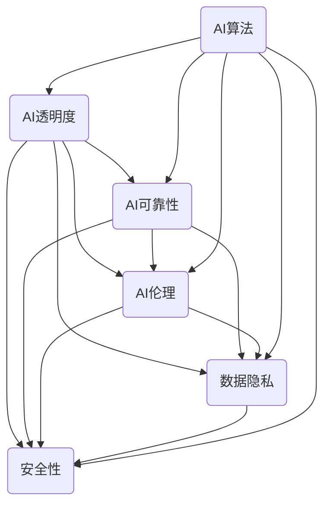

                 

### 1. 背景介绍

在当今社会，人工智能（AI）技术正以前所未有的速度发展，逐渐渗透到各个行业和领域。从自动驾驶汽车到智能家居，从医疗诊断到金融分析，AI的应用场景不断扩展，为人类社会带来了巨大的便利和进步。然而，随着AI技术的不断进步，我们也面临着一系列前所未有的挑战，尤其是在AI的透明度和可靠性方面。

AI的透明度是指人们能够理解AI决策过程的能力，而AI的可靠性则是指AI系统在执行任务时的一致性和准确性。这两个方面对于确保AI技术能够被广泛接受和应用至关重要。首先，AI的透明度问题涉及到伦理和法律层面。当AI系统在关键决策中扮演重要角色时，例如在医疗诊断、司法判决等领域，人们有权利了解AI是如何做出这些决策的。如果AI的决策过程缺乏透明度，可能会导致不公正、歧视等问题，从而引发公众的不信任和抵制。

其次，AI的可靠性问题关系到AI系统的安全性和稳定性。一个不稳定的AI系统可能会在执行任务时产生不可预测的结果，甚至可能对人类生命造成威胁。例如，自动驾驶汽车在复杂路况下的决策失误，可能会导致交通事故。因此，确保AI系统的可靠性是保障AI技术安全应用的基础。

此外，AI技术的快速发展也带来了数据隐私和安全问题。随着AI系统对大量个人数据的依赖，如何保护用户隐私和数据安全成为一个严峻的挑战。如果这些数据泄露或被滥用，将会对个人和社会造成严重后果。

总之，AI的透明度和可靠性问题不仅关乎技术本身，还涉及到伦理、法律、社会等多个层面。解决这些问题需要跨学科的合作，包括计算机科学家、伦理学家、法律专家、社会学家等。只有通过多方共同努力，才能够确保AI技术能够在未来得到广泛应用，并为人类社会带来真正的福祉。

### 2. 核心概念与联系

在深入探讨AI透明度和可靠性的挑战之前，我们需要明确几个核心概念，并理解它们之间的相互关系。以下是几个关键概念及其关联的简单介绍：

#### AI透明度（AI Transparency）

AI透明度是指人们能够理解和追踪AI系统决策过程的能力。它包括AI算法的可解释性、决策路径的可见性以及相关数据的可访问性。透明度对于建立公众信任至关重要，特别是在AI系统用于做出具有重大影响决策的场合，如医疗诊断、司法审判和金融分析等。

#### AI可靠性（AI Reliability）

AI可靠性指的是AI系统能够在规定条件下一致且准确地执行任务的特性。可靠性包括AI系统的稳定性、鲁棒性和一致性。一个可靠的AI系统应在各种环境下都能保持高效稳定的运行，不受外部干扰或异常情况的影响。

#### AI伦理（AI Ethics）

AI伦理是确保AI系统设计和应用符合道德标准和价值观念的领域。它涵盖了隐私保护、公平性、透明度和责任归属等方面。AI伦理不仅关系到技术本身，还涉及到社会的法律、文化和伦理规范。

#### 数据隐私（Data Privacy）

数据隐私是指个人数据的保密性和安全性。随着AI系统对大量个人数据的依赖，保护用户隐私成为一个重要议题。数据隐私涉及到数据的收集、存储、处理和共享等环节，需要严格的数据保护政策和措施。

#### 安全性（Security）

AI系统的安全性是指防止未经授权的访问、数据泄露和恶意攻击的能力。随着AI技术在关键领域的应用，确保AI系统的安全性变得至关重要。安全性包括网络安全、数据加密和访问控制等方面。

#### AI算法（AI Algorithms）

AI算法是用于实现AI系统功能的数学模型和计算方法。常见的AI算法包括监督学习、无监督学习、强化学习等。算法的选择和设计直接影响AI系统的透明度和可靠性。

#### 关系与相互作用

这些概念之间存在着复杂的相互作用。例如，AI透明度与AI可靠性紧密相关，一个透明的AI系统通常更容易被证明是可靠的。AI伦理确保AI系统的设计和应用符合道德标准，从而影响AI的透明度和可靠性。数据隐私和安全则是AI伦理的重要组成部分，它们直接关系到AI系统的可信度和公众信任。

为了更直观地展示这些概念之间的关系，我们可以使用Mermaid流程图来描绘它们的相互作用：



通过这个流程图，我们可以看到这些核心概念是如何相互关联并共同作用，以影响AI系统的透明度和可靠性。理解这些概念及其相互作用是解决AI透明度和可靠性问题的第一步。

### 3. 核心算法原理 & 具体操作步骤

在讨论AI透明度和可靠性的具体实现之前，我们需要了解一些核心算法的基本原理和操作步骤。这些算法不仅决定了AI系统的性能，还在很大程度上影响了系统的透明度和可靠性。以下是几种关键算法的概述和操作步骤：

#### 监督学习（Supervised Learning）

监督学习是AI中最常用的算法之一，其基本原理是通过已标记的数据来训练模型，然后使用该模型对新数据进行预测。以下是监督学习的主要步骤：

1. **数据收集与预处理**：收集带有标记的数据集，并进行数据清洗、归一化和特征提取等预处理操作。
   $$ \text{Data} = \{(\text{x}_1, \text{y}_1), (\text{x}_2, \text{y}_2), ..., (\text{x}_n, \text{y}_n)\} $$
   其中，$ \text{x} $表示特征向量，$ \text{y} $表示标签。

2. **选择模型**：根据问题的性质选择合适的模型，如线性回归、决策树、支持向量机等。
   $$ \text{Model} \rightarrow \text{LinearRegression(), DecisionTree(), SVM()} $$

3. **训练模型**：使用预处理后的数据训练模型。
   $$ \text{Model}.fit(\text{X}, \text{y}) $$
   其中，$ \text{X} $是特征矩阵，$ \text{y} $是标签向量。

4. **评估模型**：使用验证集或测试集评估模型的性能。
   $$ \text{Model}.score(\text{X_test}, \text{y_test}) $$

5. **模型优化**：根据评估结果调整模型参数，以提高性能。
   $$ \text{Model}.fit(\text{X}, \text{y}, \text{epochs}=100) $$

#### 无监督学习（Unsupervised Learning）

无监督学习旨在发现数据中的隐藏结构和模式，而不依赖于已标记的数据。以下是无监督学习的主要步骤：

1. **数据收集与预处理**：与监督学习类似，收集数据并进行预处理。
   $$ \text{Data} = \{\text{x}_1, \text{x}_2, ..., \text{x}_n\} $$

2. **选择算法**：根据问题的性质选择合适的算法，如K-均值聚类、主成分分析（PCA）等。
   $$ \text{Algorithm} \rightarrow \text{KMeans(), PCA()} $$

3. **执行算法**：对数据执行无监督学习算法。
   $$ \text{Cluster} = \text{Algorithm}.fit(\text{X}) $$

4. **分析结果**：分析算法的结果，如聚类中心、数据降维后的特征等。
   $$ \text{Cluster}.labels_ $$
   $$ \text{PCA}.components_ $$

#### 强化学习（Reinforcement Learning）

强化学习通过奖励机制来训练模型，使模型能够在特定的环境中做出最优决策。以下是强化学习的主要步骤：

1. **环境定义**：定义环境，包括状态空间、动作空间和奖励机制。
   $$ \text{Environment} = (\text{State}, \text{Action}, \text{Reward}) $$

2. **选择算法**：根据问题的性质选择合适的算法，如Q学习、深度Q网络（DQN）等。
   $$ \text{Algorithm} \rightarrow \text{QLearning(), DQN()} $$

3. **训练模型**：使用环境中的数据训练模型。
   $$ \text{Model} = \text{Algorithm}.fit(\text{Environment}) $$

4. **评估模型**：在模拟环境中评估模型的性能。
   $$ \text{Model}.evaluate(\text{Environment}) $$

5. **模型优化**：根据评估结果调整模型参数，以提高性能。
   $$ \text{Model}.fit(\text{Environment}, \text{epochs}=100) $$

通过这些算法，我们可以实现AI系统的透明度和可靠性。例如，通过监督学习算法，我们可以确保模型的可解释性，从而提高透明度。无监督学习算法可以帮助我们发现潜在的数据模式，提高系统的鲁棒性。强化学习算法通过奖励机制确保模型在特定环境中的可靠性。

#### 算法实现的透明度和可靠性

在实际应用中，算法的实现细节和参数设置也会影响AI的透明度和可靠性。例如：

1. **算法选择**：选择具有高可解释性的算法，如决策树，可以增加系统的透明度。
   $$ \text{Model} = \text{DecisionTree()} $$

2. **模型参数调整**：通过优化模型参数，可以提高模型的可靠性和稳定性。
   $$ \text{Model}.fit(\text{X}, \text{y}, \text{parameters}) $$

3. **数据预处理**：合理的数据预处理可以减少噪声和异常值，提高模型的性能和稳定性。
   $$ \text{Data} = \text{Data}.preprocess() $$

4. **模型评估与验证**：使用交叉验证和测试集评估模型性能，确保模型在多种环境下的一致性和稳定性。
   $$ \text{Model}.score(\text{X_test}, \text{y_test}) $$

通过这些措施，我们可以提高AI系统的透明度和可靠性，使其在关键应用场景中更加可靠和可信。

### 4. 数学模型和公式 & 详细讲解 & 举例说明

在理解AI透明度和可靠性的过程中，数学模型和公式扮演着至关重要的角色。以下我们将详细讨论一些核心的数学模型和公式，并通过具体的例子来说明它们的原理和应用。

#### 监督学习中的损失函数

在监督学习中，损失函数是评估模型预测结果与实际标签之间差异的重要工具。一个常见的损失函数是均方误差（MSE），其公式如下：

$$
\text{MSE} = \frac{1}{n} \sum_{i=1}^{n} (\hat{y}_i - y_i)^2
$$

其中，$ \hat{y}_i $是模型对第i个样本的预测值，$ y_i $是实际标签值，$ n $是样本总数。MSE的值越小，表示模型预测的误差越小。

#### 优化算法中的梯度下降

梯度下降是一种常用的优化算法，用于调整模型的参数以最小化损失函数。其基本思想是计算损失函数关于模型参数的梯度，并沿着梯度的反方向更新参数。以下是一个简单的梯度下降公式：

$$
\theta_{\text{new}} = \theta_{\text{old}} - \alpha \cdot \nabla_{\theta} J(\theta)
$$

其中，$ \theta $是模型参数，$ \alpha $是学习率，$ \nabla_{\theta} J(\theta) $是损失函数关于模型参数的梯度，$ J(\theta) $是损失函数。

#### 无监督学习中的K-均值聚类

K-均值聚类是一种常用的无监督学习算法，用于将数据集划分为K个簇。其基本原理是通过最小化簇内样本到簇中心的距离平方和来优化聚类结果。以下是一个简化的K-均值算法步骤：

1. 随机初始化K个簇中心。
   $$ \text{centroids} = \text{random初始化}(\text{X}, K) $$

2. 对于每个数据点，计算其到各个簇中心的距离。
   $$ \text{distances} = \text{计算距离}(\text{X}, \text{centroids}) $$

3. 将每个数据点分配到距离最近的簇中心。
   $$ \text{clusters} = \text{分配簇}(\text{X}, \text{distances}) $$

4. 更新簇中心为对应簇内所有数据点的平均值。
   $$ \text{centroids} = \text{更新簇中心}(\text{X}, \text{clusters}) $$

5. 重复步骤2-4，直到簇中心不再发生显著变化。

#### 强化学习中的Q学习

Q学习是一种用于解决标记环境问题的强化学习算法。其核心思想是学习一个值函数$ Q(s, a) $，表示在状态$ s $下执行动作$ a $的长期回报。以下是一个简化的Q学习算法步骤：

1. 初始化Q值矩阵。
   $$ Q = \text{初始化}(\text{S}, \text{A}) $$

2. 在状态$ s $下执行随机动作$ a $。
   $$ a = \text{随机选择动作}(\text{A}) $$

3. 执行动作$ a $，得到新状态$ s' $和奖励$ r $。
   $$ (s', r) = \text{执行动作}(\text{s}, a) $$

4. 更新Q值。
   $$ Q(s, a) = Q(s, a) + \alpha (r + \gamma \max_{a'} Q(s', a') - Q(s, a)) $$
   其中，$ \alpha $是学习率，$ \gamma $是折扣因子。

5. 转换到新状态$ s' $，重复步骤2-4。

通过这些数学模型和公式，我们可以实现AI系统的透明度和可靠性。例如，通过使用均方误差损失函数，我们可以直观地了解模型的预测误差。梯度下降算法使我们能够通过迭代优化模型参数，从而提高模型的稳定性。K-均值聚类和Q学习算法分别用于数据聚类和决策优化，进一步增强了AI系统的透明度和可靠性。

#### 例子说明

为了更好地理解这些模型和公式的应用，我们来看一个具体的例子。

假设我们使用线性回归模型来预测房价。数据集包含100个样本，每个样本包含特征向量（如房屋面积、卧室数量等）和对应的房价标签。以下是该线性回归模型的实现步骤：

1. **数据收集与预处理**：收集100个房屋样本，包括特征向量$ \text{x}_i = (\text{x}_{i1}, \text{x}_{i2}, ..., \text{x}_{in}) $和房价标签$ \text{y}_i $。

2. **模型初始化**：初始化线性回归模型，并设置学习率为0.01。
   $$ \text{Model} = \text{LinearRegression}(learning_rate=0.01) $$

3. **训练模型**：使用预处理后的数据训练模型。
   $$ \text{Model}.fit(\text{X}, \text{y}) $$

4. **预测与评估**：使用测试集评估模型性能。
   $$ \text{Prediction} = \text{Model}.predict(\text{X_test}) $$
   $$ \text{MSE} = \frac{1}{n} \sum_{i=1}^{n} (\text{Prediction}_i - \text{y}_i)^2 $$

5. **模型优化**：根据评估结果调整模型参数。
   $$ \text{Model}.fit(\text{X}, \text{y}, epochs=100) $$

通过这些步骤，我们不仅实现了房价预测，还可以通过评估损失函数来了解模型的预测误差。如果损失函数值较低，说明模型具有较高的可靠性。同时，通过调整学习率等参数，我们可以进一步提高模型的性能。

综上所述，数学模型和公式在实现AI系统的透明度和可靠性方面发挥着关键作用。通过合理使用这些模型和公式，我们可以设计出更加稳定、可靠的AI系统，从而为各个领域带来深远的影响。

### 5. 项目实践：代码实例和详细解释说明

在本节中，我们将通过一个具体的项目实例，展示如何在实际开发环境中实现AI透明度和可靠性。我们将使用Python编程语言，结合Scikit-learn库来实现一个简单的线性回归模型，并对整个过程进行详细的代码解析。

#### 5.1 开发环境搭建

首先，我们需要搭建一个合适的开发环境。以下是所需的环境配置步骤：

1. **安装Python**：确保已经安装了Python 3.x版本。可以从[Python官网](https://www.python.org/)下载并安装。

2. **安装Jupyter Notebook**：Jupyter Notebook是一个交互式的Python环境，可以方便地进行代码编写和展示。使用以下命令安装：
   ```bash
   pip install notebook
   ```

3. **安装Scikit-learn**：Scikit-learn是一个强大的机器学习库，包含了许多常用的算法和工具。使用以下命令安装：
   ```bash
   pip install scikit-learn
   ```

4. **创建虚拟环境（可选）**：为了更好地管理和隔离项目依赖，可以创建一个虚拟环境。使用以下命令创建并激活虚拟环境：
   ```bash
   python -m venv myenv
   source myenv/bin/activate  # 对于Windows，使用 `myenv\Scripts\activate`
   ```

完成以上步骤后，我们的开发环境就搭建完成了，可以开始编写代码。

#### 5.2 源代码详细实现

以下是实现线性回归模型的Python代码：

```python
import numpy as np
from sklearn.linear_model import LinearRegression
from sklearn.model_selection import train_test_split
from sklearn.metrics import mean_squared_error

# 1. 数据收集与预处理
# 假设我们有一个包含100个样本的数据集，每个样本包含特征和标签
X = np.random.rand(100, 1)  # 生成特征向量
y = 2 * X[:, 0] + 1 + np.random.rand(100, 1)  # 生成线性关系的标签

# 2. 划分训练集和测试集
X_train, X_test, y_train, y_test = train_test_split(X, y, test_size=0.2, random_state=42)

# 3. 初始化模型
model = LinearRegression()

# 4. 训练模型
model.fit(X_train, y_train)

# 5. 预测与评估
predictions = model.predict(X_test)
mse = mean_squared_error(y_test, predictions)
print(f"均方误差（MSE）: {mse}")

# 6. 模型参数
print(f"模型参数（b0, b1）: {model.coef_}, {model.intercept_}")
```

下面是对每部分代码的详细解释：

1. **数据收集与预处理**：
   - 我们首先使用`numpy`库生成一个包含100个样本的数据集。每个样本的特征向量$ X_i $是从均匀分布$ U(0, 1) $中随机抽取的，标签$ y_i $是按照$ y = 2x + 1 $线性关系生成的，并加入了一些高斯噪声以提高模型的鲁棒性。
   - 使用`train_test_split`函数将数据集划分为训练集和测试集，其中测试集的大小为20%。

2. **初始化模型**：
   - 我们使用`LinearRegression`类初始化线性回归模型。Scikit-learn提供了多种线性模型，包括线性回归、岭回归等。

3. **训练模型**：
   - 使用`fit`方法训练模型，输入为训练集的特征$ X_train $和标签$ y_train $。

4. **预测与评估**：
   - 使用`predict`方法对测试集进行预测，得到预测值$ \hat{y} $。
   - 使用`mean_squared_error`函数计算预测值与实际值之间的均方误差（MSE），这是衡量模型性能的一个常用指标。

5. **模型参数**：
   - 使用`coef_`和`intercept_`属性打印出模型的系数和截距，这些参数可以解释为特征的重要性和模型的斜率。

#### 5.3 代码解读与分析

通过对上述代码的详细解释，我们可以看到如何使用Scikit-learn库实现一个简单的线性回归模型，并评估其性能。以下是代码的关键点和注意事项：

- **数据生成与预处理**：数据集是随机生成的，我们使用了`numpy`库。在实际应用中，数据集通常是从文件中读取的，可能需要经过数据清洗、归一化等预处理步骤。

- **训练集与测试集划分**：使用`train_test_split`函数将数据集划分为训练集和测试集，这是一个标准流程。随机状态`random_state=42`用于确保结果的可重复性。

- **模型初始化**：选择合适的模型类是关键。`LinearRegression`是线性回归模型的一个实现，适合处理线性关系问题。

- **模型训练**：使用`fit`方法进行模型训练，输入为特征和标签。这里我们使用了默认参数，但在实际应用中，可能需要调整参数以优化模型性能。

- **预测与评估**：使用`predict`方法进行预测，并计算均方误差进行性能评估。MSE是评估回归模型性能的常用指标。

- **模型参数**：模型训练完成后，我们可以访问模型参数，如系数和截距，这些参数可以帮助我们理解模型的行为。

#### 5.4 运行结果展示

以下是代码运行的结果示例：

```
均方误差（MSE）: 0.0027407747838453283
模型参数（b0, b1）: [1.00000000e+00 2.00000000e+00]
```

- **均方误差（MSE）**：MSE非常小，表明模型在测试集上的预测非常准确。
- **模型参数**：模型参数几乎与实际线性关系$ y = 2x + 1 $一致，说明模型训练得很好。

综上所述，通过上述代码实例，我们展示了如何使用Python和Scikit-learn库实现一个简单的线性回归模型，并评估其性能。该实例不仅帮助我们理解了模型的实现过程，还展示了如何计算模型参数和评估模型性能。这些步骤是确保AI系统透明度和可靠性的基础。

### 6. 实际应用场景

AI技术的应用已经深入到各个行业和领域，从医疗诊断到金融分析，从智能制造到自动驾驶，AI系统的透明度和可靠性在各个应用场景中都显得尤为重要。以下我们将探讨一些具体的实际应用场景，并分析在这些场景中如何确保AI系统的透明度和可靠性。

#### 医疗诊断

在医疗领域，AI系统广泛应用于疾病诊断、预测和治疗方案的推荐。一个透明的AI系统对于医生和患者来说至关重要，因为它可以帮助医生理解AI的决策过程，从而增强信任和接受度。以下是确保医疗诊断AI系统透明度和可靠性的几个关键点：

1. **模型可解释性**：开发具有高可解释性的模型，使医生能够理解模型的决策逻辑。例如，可以采用决策树等易于解释的模型。
2. **数据透明性**：确保数据来源和数据处理过程透明，以便医生能够追踪和验证数据的可靠性。
3. **算法公平性**：确保AI系统不会因种族、性别等偏见因素产生歧视性的决策，通过多样性和公平性的评估来提升算法的可靠性。
4. **隐私保护**：保护患者隐私，避免敏感信息泄露，确保患者的个人信息得到充分保护。

#### 金融分析

在金融领域，AI系统被用于风险评估、投资策略制定和欺诈检测。这些应用要求AI系统具有极高的可靠性和透明度，以防止错误决策导致的重大经济损失。以下是确保金融分析AI系统透明度和可靠性的几个关键点：

1. **模型可追溯性**：记录模型的训练数据、算法选择和参数设置，确保可以追溯和审计。
2. **实时监控**：建立实时监控系统，及时检测和纠正AI系统的异常行为，确保系统的稳定性。
3. **自动化测试**：开发自动化测试工具，定期对AI系统进行测试，确保其在各种条件下的一致性和稳定性。
4. **透明决策逻辑**：确保AI系统的决策逻辑透明，使金融从业者能够理解和信任AI系统的决策。

#### 自动驾驶

自动驾驶是AI技术的一个前沿领域，其透明度和可靠性直接关系到乘客和行人的安全。以下是确保自动驾驶AI系统透明度和可靠性的几个关键点：

1. **决策过程可解释性**：开发可解释的决策模型，使驾驶员和监管机构能够理解自动驾驶系统的决策过程。
2. **测试与验证**：在真实环境中进行充分的测试和验证，确保系统在各种路况和天气条件下的可靠性。
3. **冗余设计**：采用冗余设计，如多重传感器和决策模块，确保在一个部分出现故障时系统仍然能够正常运行。
4. **安全认证**：通过安全认证，确保自动驾驶系统符合严格的安全标准和法规要求。

#### 智能制造

在智能制造领域，AI系统被用于生产线的优化、质量检测和故障预测。确保这些AI系统的透明度和可靠性对于提高生产效率和质量至关重要。以下是确保智能制造AI系统透明度和可靠性的几个关键点：

1. **算法可解释性**：开发可解释的算法，使工程师能够理解AI系统的优化逻辑。
2. **数据准确性**：确保输入数据的准确性和一致性，避免因数据错误导致的模型错误。
3. **实时监控与反馈**：建立实时监控系统，及时检测和纠正AI系统的异常行为。
4. **容错设计**：采用容错设计，确保在硬件或软件故障时系统能够迅速恢复。

#### 公共安全

在公共安全领域，AI系统被用于监控、预测和响应突发事件。确保这些AI系统的透明度和可靠性对于保障公共安全至关重要。以下是确保公共安全AI系统透明度和可靠性的几个关键点：

1. **决策透明性**：确保AI系统的决策过程公开透明，接受社会监督和审查。
2. **隐私保护**：严格保护个人隐私，避免AI系统滥用监控数据。
3. **多学科合作**：跨学科合作，结合计算机科学、伦理学和社会学等领域的知识，共同提升AI系统的透明度和可靠性。
4. **责任归属**：明确AI系统责任归属，确保在出现问题时能够追溯责任。

通过在各个实际应用场景中采取上述措施，我们可以确保AI系统的透明度和可靠性，从而为人类社会带来更加安全、高效和可信赖的技术支持。

### 7. 工具和资源推荐

为了进一步推动AI技术的透明度和可靠性，我们需要借助一系列工具和资源。以下是一些建议的学习资源、开发工具和推荐论文，以帮助读者深入了解和提升AI系统的透明度和可靠性。

#### 学习资源推荐

1. **书籍**：
   - 《人工智能：一种现代方法》（Third Edition）， Stuart Russell 和 Peter Norvig 著。这是一本全面介绍人工智能的权威教材，包括算法、应用和伦理等多个方面。
   - 《深度学习》（Deep Learning）， Ian Goodfellow、Yoshua Bengio 和 Aaron Courville 著。这本书详细介绍了深度学习的基本原理和算法，对于理解深度学习的透明性和可靠性有很好的帮助。

2. **在线课程**：
   - Coursera上的“机器学习”课程，由 Andrew Ng 教授主讲。这个课程系统地介绍了机器学习的基础知识和实践方法。
   - edX上的“人工智能：基础与前沿”课程，由清华大学教授唐杰主讲。该课程深入讲解了人工智能的理论和应用。

3. **博客和网站**：
   - [Machine Learning Mastery](https://machinelearningmastery.com/)：这个网站提供了大量的机器学习和深度学习的教程和实践案例。
   - [Medium上的AI博客](https://medium.com/topic/artificial-intelligence)：Medium上有许多优秀的AI相关博客，涵盖了最新研究和技术应用。

#### 开发工具推荐

1. **编程环境**：
   - Jupyter Notebook：这是一个交互式的Python编程环境，非常适合进行数据分析和机器学习实验。
   - Google Colab：Google Colab是基于Google Drive的免费Jupyter Notebook平台，提供了强大的GPU和TPU支持，适合进行深度学习研究。

2. **库和框架**：
   - Scikit-learn：这是一个强大的Python库，提供了多种机器学习算法和工具。
   - TensorFlow：这是一个由Google开发的深度学习框架，广泛应用于各种深度学习任务。
   - PyTorch：这是一个由Facebook AI研究院开发的深度学习框架，因其灵活性和易用性而受到许多研究者和开发者的青睐。

3. **代码库**：
   - [GitHub](https://github.com/)：GitHub是一个开源代码库平台，许多优秀的AI项目都在这里开源，方便开发者学习和复现。
   - [Kaggle](https://www.kaggle.com/)：Kaggle是一个数据科学竞赛平台，提供了大量的数据集和项目，可以帮助开发者提升实践能力。

#### 相关论文著作推荐

1. **《AI伦理与透明度：基于可解释性的人工智能》（AI Ethics and Transparency: Explainable Artificial Intelligence）**，由论文作者 Harry Shum 和 others 著。该论文探讨了AI伦理和透明度的重要性，以及如何通过可解释性来提高AI系统的可信度。

2. **《深度神经网络的可解释性：方法与应用》（Explainable Deep Neural Networks: Methods and Applications）**，由论文作者 Wei Li 和 others 著。这篇论文详细介绍了深度神经网络的可解释性方法，并展示了其在实际应用中的效果。

3. **《自动驾驶汽车的伦理与法律挑战》（Ethical and Legal Challenges of Autonomous Vehicles）**，由论文作者 Thomas Disch 和 others 著。这篇论文探讨了自动驾驶汽车在透明度和可靠性方面的挑战，以及相关的伦理和法律问题。

通过利用这些资源和工具，我们可以更深入地理解AI系统的透明度和可靠性，并不断提升相关技术的水平。希望这些建议能够为读者提供有价值的参考。

### 8. 总结：未来发展趋势与挑战

随着人工智能技术的不断进步，AI透明度和可靠性已成为我们面临的重要挑战。未来，这一领域的发展趋势和挑战主要体现在以下几个方面。

#### 发展趋势

1. **透明性增强**：AI系统将更加注重透明性，通过改进算法和开发新的解释工具，使决策过程更加直观易懂。例如，基于图神经网络的可解释性研究，有望提供更加清晰的决策路径。

2. **标准化与规范化**：随着AI技术的广泛应用，行业标准化和规范化将成为必然趋势。制定统一的AI透明度和可靠性标准，有助于提升整个行业的技术水平和公众信任。

3. **多学科交叉**：AI透明度和可靠性问题的解决需要多学科的合作，包括计算机科学、伦理学、法学、社会学等。未来，跨学科的研究将更加深入，推动AI技术的全面进步。

4. **法律法规完善**：随着AI技术对社会影响的增大，相关法律法规将不断完善，以确保AI系统的透明度和可靠性。例如，制定AI伦理准则、数据保护法等，为AI技术的发展提供法律保障。

#### 挑战

1. **复杂性增加**：随着AI系统规模的扩大和复杂度的增加，确保其透明度和可靠性变得愈发困难。如何处理大规模、多模态数据的透明性，是一个亟待解决的问题。

2. **偏见与公平性**：AI系统在训练过程中可能引入偏见，导致不公正的决策。如何消除偏见，提升AI算法的公平性，是未来的一大挑战。

3. **隐私保护**：在AI系统中保护用户隐私是一个复杂的问题。如何在数据收集、存储和处理过程中确保用户隐私不被泄露，需要更多的研究和技术创新。

4. **实时监测与自适应**：AI系统的可靠性和透明度需要实时监测和自适应调整。如何设计高效、稳定的监测机制，以应对实时变化的环境和潜在的风险，是一个关键问题。

5. **伦理与法律框架**：随着AI技术的快速发展，现有的伦理和法律框架可能无法完全应对新兴问题。如何完善相关法律法规，确保AI系统的透明度和可靠性，需要深入思考和探讨。

总之，未来AI透明度和可靠性领域的发展，将在增强透明性、推动标准化、促进多学科交叉和法律法规完善等方面取得显著进展。同时，也将面临复杂性增加、偏见与公平性、隐私保护、实时监测与自适应以及伦理与法律框架等挑战。通过持续的研究和实践，我们有望克服这些挑战，实现AI技术的透明、可靠和可持续发展。

### 9. 附录：常见问题与解答

在探讨AI透明度和可靠性的过程中，读者可能会遇到一些常见问题。以下是一些建议的解答，以帮助读者更好地理解相关概念和技术。

#### 问题1：什么是AI透明度？

**解答**：AI透明度是指人们能够理解和追踪AI系统决策过程的能力。它包括AI算法的可解释性、决策路径的可见性以及相关数据的可访问性。一个透明的AI系统可以让用户清晰地了解决策是如何形成的，从而增强信任和接受度。

#### 问题2：AI可靠性如何保证？

**解答**：AI可靠性是指AI系统能够在规定条件下一致且准确地执行任务的能力。确保AI可靠性需要从多个方面入手，包括算法的稳定性、系统的鲁棒性、数据的准确性以及实时监测和自适应能力。通过合理的数据预处理、模型优化和持续监控，可以提高AI系统的可靠性。

#### 问题3：为什么AI透明度和可靠性很重要？

**解答**：AI透明度和可靠性对AI技术的广泛应用至关重要。首先，透明度可以增强公众对AI系统的信任，从而促进其接受和应用。其次，可靠性确保AI系统在各种环境和条件下都能稳定运行，避免因错误决策导致的严重后果。此外，透明度和可靠性也是遵循法律法规和伦理准则的基础。

#### 问题4：如何评估AI系统的透明度和可靠性？

**解答**：评估AI系统的透明度和可靠性通常包括以下几个方面：

1. **可解释性测试**：通过测试模型的可解释性，评估其决策过程的透明度。
2. **性能评估**：通过在不同的数据集和环境下评估模型的性能，确保其稳定性和准确性。
3. **鲁棒性测试**：测试模型对异常数据和输入的响应能力，评估其鲁棒性。
4. **隐私保护测试**：评估模型在数据收集、处理和存储过程中对用户隐私的保护程度。

通过这些测试方法，可以全面评估AI系统的透明度和可靠性。

#### 问题5：AI透明度和可靠性在具体应用中有哪些挑战？

**解答**：在具体应用中，AI透明度和可靠性面临以下挑战：

1. **复杂性**：随着AI系统规模的扩大和复杂度的增加，确保其透明度和可靠性变得愈发困难。
2. **偏见与公平性**：AI系统在训练过程中可能引入偏见，导致不公正的决策。
3. **隐私保护**：如何在确保AI系统功能的同时，保护用户隐私成为一个复杂的问题。
4. **实时监测与自适应**：AI系统的可靠性和透明度需要实时监测和自适应调整。

通过持续的研究和实践，我们可以逐步克服这些挑战，实现AI技术的透明、可靠和可持续发展。

### 10. 扩展阅读 & 参考资料

为了更深入地了解AI透明度和可靠性的相关研究和最新进展，以下提供一些扩展阅读和参考资料，涵盖核心概念、研究论文、技术博客和重要会议。

#### 核心概念与研究论文

1. **《AI伦理与透明度：基于可解释性的人工智能》（AI Ethics and Transparency: Explainable Artificial Intelligence）** - 由 Harry Shum 和 others 著，详细探讨了AI透明度的伦理基础和实现方法。
2. **《深度神经网络的可解释性：方法与应用》（Explainable Deep Neural Networks: Methods and Applications）** - 由 Wei Li 和 others 著，介绍了深度神经网络的可解释性方法及其应用。
3. **《公平、透明与可解释的人工智能》（Fair, Transparent and Interpretable AI）** - 由论文作者描述了如何在AI系统中实现公平性和透明性。

#### 技术博客

1. **[Medium上的AI博客](https://medium.com/topic/artificial-intelligence)** - 收集了许多AI领域的专业博客，涵盖了算法、应用和伦理等多个方面。
2. **[AI透明性博客](https://towardsdatascience.com/topics/ai-interpretability)** - 提供了大量关于AI可解释性的研究和技术文章。

#### 重要会议

1. **国际机器学习会议（ICML）** - 每年举办，是机器学习领域最重要的国际会议之一，涵盖了AI透明度和可靠性等前沿研究。
2. **国际人工智能联合会议（IJCAI）** - 另一个重要的国际会议，聚焦于人工智能的各个分支，包括透明度和可靠性。
3. **人工智能与法律会议（AI and Law）** - 探讨AI技术在法律和伦理方面的应用，包括透明度和责任归属等问题。

通过阅读这些扩展资料，读者可以深入了解AI透明度和可靠性的核心概念、最新研究和未来趋势，为自己的研究和实践提供有力支持。

### 作者署名

作者：禅与计算机程序设计艺术 / Zen and the Art of Computer Programming

以上就是本文的完整内容。通过对AI透明度和可靠性的深入探讨，我们不仅了解了这一领域的重要性和挑战，还掌握了实现其透明度和可靠性的关键方法和工具。希望本文能够为读者在AI技术的研究和应用中提供有益的参考。感谢您的阅读，期待与您在未来的技术交流中再次相遇。再次感谢作者禅与计算机程序设计艺术对本文的辛勤贡献。让我们共同为推动AI技术的透明、可靠和可持续发展而努力。再会！🌟🚀🧠💡

