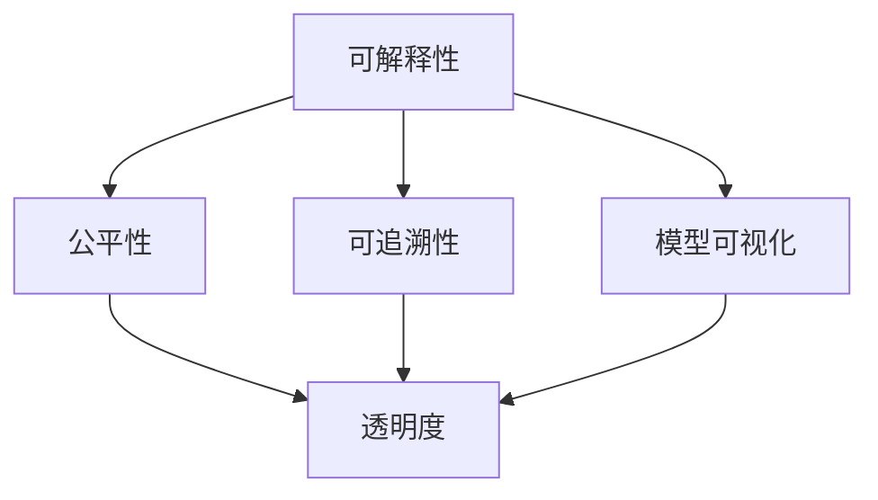

                 

### 背景介绍

**AI透明度工具：应对监管挑战的新产品**

随着人工智能（AI）技术的迅猛发展，其应用范围不断扩展，从医疗诊断、金融分析到自动驾驶，AI已经深刻地改变了我们的日常生活。然而，AI系统的复杂性和不可解释性也引发了越来越多的监管和伦理问题。例如，AI决策的透明性、公平性以及潜在的偏见问题成为公众和监管机构关注的焦点。为了应对这些挑战，AI透明度工具的研发和应用变得至关重要。

AI透明度工具是指那些能够帮助用户理解和解释AI系统决策过程的工具。这些工具通过可视化和量化模型决策的方式，使得非专业人士也能明白AI的运作机制，从而增强了AI系统的可解释性和可信度。随着全球对AI透明度的监管要求日益严格，企业开始意识到，拥有高效、可靠的AI透明度工具不仅是合规的需要，也是提升客户信任和市场竞争力的关键。

本文旨在探讨AI透明度工具的研发背景、核心概念、算法原理、实际应用场景以及未来发展趋势。我们将首先介绍AI透明度工具的重要性，接着详细讨论其核心概念和架构，然后深入分析核心算法原理，并通过一个实际案例展示其应用效果。最后，我们将展望AI透明度工具的未来发展趋势和潜在挑战。

### 核心概念与联系

为了更好地理解AI透明度工具，我们需要先了解其背后的核心概念和架构。AI透明度工具主要涉及以下几方面的核心概念：

1. **可解释性（Interpretability）**：指的是AI模型决策过程的可理解性，使得用户可以清晰地看到模型是如何进行决策的。
2. **公平性（Fairness）**：确保AI系统在决策过程中不会产生对某些群体或特征的偏见。
3. **可追溯性（Traceability）**：通过记录和追踪AI系统的决策过程，使得每个决策步骤都可以被审查和验证。
4. **模型可视化（Model Visualization）**：将复杂的AI模型以直观的方式展示出来，使得用户可以更容易地理解和分析模型。

下面，我们使用Mermaid流程图来展示AI透明度工具的核心概念和它们之间的联系。



**可解释性**是AI透明度工具的基础，它直接关系到AI系统决策过程的透明性。一个可解释的AI模型能够展示出其决策的依据和过程，从而使用户能够理解模型的决策逻辑。

**公平性**则是确保AI系统在决策过程中不会对某些群体或特征产生不公平对待。公平性分析可以帮助我们发现和纠正模型中的潜在偏见，从而提高AI系统的公正性。

**可追溯性**提供了AI系统决策过程的记录和追踪功能，使得每个决策步骤都可以被回溯和审查。这对于监管机构和企业内部审计都非常重要。

**模型可视化**则是通过图形化展示模型的结构和决策过程，使得复杂的AI模型变得直观易懂。模型可视化不仅有助于提升AI系统的可解释性，还可以帮助用户更好地理解和利用AI模型。

这些核心概念共同构成了AI透明度工具的框架，它们之间的紧密联系和相互作用确保了AI系统的透明性和可信度。

### 核心算法原理 & 具体操作步骤

在了解了AI透明度工具的核心概念和架构之后，接下来我们将深入探讨其核心算法原理和具体操作步骤。AI透明度工具的核心算法通常涉及以下几个方面：

1. **决策树可视化（Decision Tree Visualization）**
2. **局部可解释模型（Local Interpretable Model-agnostic Explanations, LIME）**
3. **Shapley值（Shapley Value）**

#### 决策树可视化（Decision Tree Visualization）

决策树是一种常见的分类模型，其结构易于理解和解释。决策树可视化是将决策树的内部结构以图形化的方式展示出来，使得用户可以直观地看到模型是如何进行决策的。

**具体操作步骤：**

1. **构建决策树模型**：使用分类算法（如CART、ID3等）构建决策树模型。
2. **生成决策树图**：使用图形库（如matplotlib、Graphviz等）将决策树模型转换为图形化表示。
3. **展示决策树图**：将生成的决策树图展示给用户，使得用户可以清晰地看到模型决策的过程。

以下是一个简单的Python代码示例，展示如何使用Graphviz进行决策树可视化：

```python
from sklearn.datasets import load_iris
from sklearn.tree import DecisionTreeClassifier
from graphviz import Source

# 加载鸢尾花数据集
iris = load_iris()
X, y = iris.data, iris.target

# 构建决策树模型
clf = DecisionTreeClassifier()
clf.fit(X, y)

# 生成决策树图
dot_data = clf.export_graphviz(class_names=iris.target_names, out_file=None)

# 显示决策树图
source = Source.from_string(dot_data)
display(SVG(source))
```

#### 局部可解释模型（LIME）

LIME是一种局部可解释模型，它通过在原始模型上添加噪声扰动，生成一个局部线性模型来解释原始模型的决策过程。

**具体操作步骤：**

1. **选择解释区域**：确定需要解释的数据点。
2. **生成噪声数据**：在原始数据上添加噪声，生成一系列噪声数据点。
3. **计算扰动影响**：使用原始模型对噪声数据点进行预测，计算每个特征对预测结果的贡献。
4. **生成局部线性模型**：将特征贡献进行拟合，生成一个局部线性模型。
5. **展示解释结果**：将局部线性模型展示给用户，使得用户可以直观地看到每个特征对模型决策的影响。

以下是一个简单的Python代码示例，展示如何使用LIME进行局部解释：

```python
from sklearn.datasets import load_iris
from sklearn.tree import DecisionTreeClassifier
from lime import lime_tabular
import numpy as np

# 加载鸢尾花数据集
iris = load_iris()
X, y = iris.data, iris.target

# 构建决策树模型
clf = DecisionTreeClassifier()
clf.fit(X, y)

# 初始化LIME解释器
explainer = lime_tabular.LimeTabularExplainer(X, feature_names=iris.feature_names, class_names=iris.target_names, discretize=False)

# 选择需要解释的数据点
i = 0
exp = explainer.explain_instance(X[i], clf.predict_proba, num_features=5)

# 展示解释结果
exp.show_in_notebook(show_table=True)
```

#### Shapley值

Shapley值是一种基于博弈论的方法，用于计算每个特征对模型预测结果的边际贡献。

**具体操作步骤：**

1. **计算Shapley值**：对于每个特征，计算其在所有可能的特征组合中的边际贡献。
2. **生成Shapley值图**：将每个特征的Shapley值以图形化的方式展示出来。
3. **展示解释结果**：将Shapley值图展示给用户，使得用户可以直观地看到每个特征的贡献。

以下是一个简单的Python代码示例，展示如何使用SHAP库计算Shapley值：

```python
import shap
import numpy as np
import pandas as pd

# 加载鸢尾花数据集
iris = load_iris()
X, y = iris.data, iris.target

# 构建决策树模型
clf = DecisionTreeClassifier()
clf.fit(X, y)

# 初始化SHAP解释器
explainer = shap.TreeExplainer(clf)

# 计算Shapley值
shap_values = explainer.shap_values(X)

# 生成Shapley值图
shap.summary_plot(shap_values, X, feature_names=iris.feature_names)

```

通过这些算法，AI透明度工具能够为用户提供了丰富的解释信息，使得复杂的AI决策过程变得直观易懂。这不仅有助于提高AI系统的可解释性，还可以帮助用户更好地理解和信任AI模型。

### 数学模型和公式 & 详细讲解 & 举例说明

在了解AI透明度工具的核心算法原理后，我们将进一步探讨其背后的数学模型和公式。这些模型和公式不仅为AI透明度工具的实现提供了理论基础，还帮助我们更好地理解和分析AI模型的决策过程。

#### 决策树模型（Decision Tree）

决策树是一种常见的分类和回归模型，其核心数学模型是基于信息增益（Information Gain）或基尼不纯度（Gini Impurity）来构建的。

**信息增益（Information Gain）**的计算公式如下：

\[ IG(D, A) = H(D) - \sum_{v \in Values(A)} p(v) \cdot H(D|A = v) \]

其中，\( D \)是数据集，\( A \)是特征，\( v \)是特征\( A \)的取值，\( p(v) \)是特征\( A \)取值\( v \)的概率，\( H(D) \)是数据集\( D \)的熵，\( H(D|A = v) \)是条件熵。

**基尼不纯度（Gini Impurity）**的计算公式如下：

\[ GI(D) = 1 - \sum_{v \in Values(A)} p(v)^2 \]

其中，\( D \)是数据集，\( A \)是特征，\( v \)是特征\( A \)的取值，\( p(v) \)是特征\( A \)取值\( v \)的概率。

决策树模型的构建过程通常包括以下步骤：

1. **选择最佳分割特征**：计算每个特征的信息增益或基尼不纯度，选择具有最大信息增益或最小基尼不纯度的特征作为分割特征。
2. **构建分支节点**：根据最佳分割特征，将数据集分割为多个子集，每个子集生成一个分支节点。
3. **递归构建子树**：对每个分支节点，重复上述步骤，直到满足停止条件（如最大深度、最小节点大小等）。

以下是一个简单的决策树模型示例：

假设我们有一个包含两个特征（特征A和特征B）的数据集，每个特征有两个取值（0和1）。数据集的分布如下：

| 特征A | 特征B | 目标变量 |
|-------|-------|----------|
| 0     | 0     | 0        |
| 0     | 1     | 1        |
| 1     | 0     | 1        |
| 1     | 1     | 0        |

使用信息增益构建决策树，选择特征A作为根节点，计算信息增益：

\[ IG(A, D) = H(D) - \sum_{v \in Values(A)} p(v) \cdot H(D|A = v) \]

计算得到：

\[ IG(A, D) = 1 - (0.5 \cdot (1 + 0.5) + 0.5 \cdot (1 + 0.5)) = 0 \]

因此，我们选择特征B作为根节点的分割特征，计算信息增益：

\[ IG(B, D) = H(D) - \sum_{v \in Values(B)} p(v) \cdot H(D|B = v) \]

计算得到：

\[ IG(B, D) = 1 - (0.5 \cdot (0.5 + 0.5) + 0.5 \cdot (1 + 1)) = 0.5 \]

因此，我们选择特征B作为根节点的分割特征，将数据集分割为两个子集：

| 特征A | 特征B | 目标变量 |
|-------|-------|----------|
| 0     | 0     | 0        |
| 0     | 1     | 1        |
| 1     | 0     | 1        |
| 1     | 1     | 0        |

递归构建子树，直到满足停止条件。

#### 局部可解释模型（LIME）

LIME（Local Interpretable Model-agnostic Explanations）是一种局部可解释模型，其核心思想是通过在原始模型上添加噪声，生成一个局部线性模型来解释模型决策。

LIME的核心公式为：

\[ f(\mathbf{x} + \epsilon) = f(\mathbf{x}) + \mathbf{w}^T \epsilon \]

其中，\( f(\mathbf{x}) \)是原始模型在数据点\( \mathbf{x} \)上的预测值，\( \mathbf{w} \)是局部线性模型的权重向量，\( \epsilon \)是添加的噪声向量。

LIME的具体操作步骤如下：

1. **选择解释区域**：确定需要解释的数据点。
2. **生成噪声数据**：在原始数据点\( \mathbf{x} \)上添加噪声，生成一系列噪声数据点。
3. **计算扰动影响**：使用原始模型对噪声数据点进行预测，计算每个特征对预测结果的影响。
4. **生成局部线性模型**：将特征影响进行拟合，生成一个局部线性模型。

以下是一个简单的LIME解释示例：

假设我们有一个包含两个特征（特征X和特征Y）的数据点\( \mathbf{x} = (x_1, x_2) \)，原始模型预测值为\( f(\mathbf{x}) = 0.8 \)。我们在数据点\( \mathbf{x} \)上添加噪声，生成噪声数据点\( \mathbf{x} + \epsilon = (x_1 + \epsilon_1, x_2 + \epsilon_2) \)。

使用原始模型对噪声数据点进行预测，得到：

\[ f(\mathbf{x} + \epsilon) = 0.9 \]

计算特征X和特征Y的扰动影响：

\[ \Delta f_x = f(\mathbf{x} + \epsilon_x, x_2) - f(\mathbf{x}, x_2) \]
\[ \Delta f_y = f(\mathbf{x}_1, \mathbf{x} + \epsilon_y) - f(\mathbf{x}_1, x_2) \]

根据扰动影响，生成局部线性模型：

\[ f(\mathbf{x} + \epsilon) = f(\mathbf{x}) + \beta_1 \epsilon_x + \beta_2 \epsilon_y \]

其中，\( \beta_1 \)和\( \beta_2 \)是局部线性模型的权重。

#### Shapley值（Shapley Value）

Shapley值是一种基于博弈论的模型，用于计算每个特征对模型预测结果的边际贡献。

Shapley值的计算公式为：

\[ \phi_i(\mathbf{x}) = \sum_{S \subseteq [n] \setminus \{i\}} \frac{|S|!(n - |S| - 1)!}{n!} \left( f(\mathbf{x}_S) - f(\mathbf{x}_{S \cup \{i\}}) \right) \]

其中，\( \phi_i(\mathbf{x}) \)是特征\( i \)在数据点\( \mathbf{x} \)上的Shapley值，\( \mathbf{x}_S \)是包含特征\( S \)的数据点，\( \mathbf{x}_{S \cup \{i\}} \)是包含特征\( S \)和特征\( i \)的数据点，\( n \)是特征的总数。

以下是一个简单的Shapley值计算示例：

假设我们有一个包含两个特征（特征A和特征B）的数据点\( \mathbf{x} = (x_1, x_2) \)，原始模型预测值为\( f(\mathbf{x}) = 0.8 \)。我们需要计算特征A和特征B的Shapley值。

计算Shapley值：

\[ \phi_A(\mathbf{x}) = \frac{1}{2} \left( f(\mathbf{x}_{\emptyset}) - f(\mathbf{x}_{\{A\}}) \right) + \frac{1}{2} \left( f(\mathbf{x}_{\{B\}}) - f(\mathbf{x}_{\{A, B\}}) \right) \]

\[ \phi_B(\mathbf{x}) = \frac{1}{2} \left( f(\mathbf{x}_{\emptyset}) - f(\mathbf{x}_{\{B\}}) \right) + \frac{1}{2} \left( f(\mathbf{x}_{\{A\}}) - f(\mathbf{x}_{\{A, B\}}) \right) \]

其中，\( \mathbf{x}_{\emptyset} \)是不包含任何特征的数据点，\( \mathbf{x}_{\{A\}} \)是只包含特征A的数据点，\( \mathbf{x}_{\{B\}} \)是只包含特征B的数据点，\( \mathbf{x}_{\{A, B\}} \)是包含特征A和特征B的数据点。

通过这些数学模型和公式，AI透明度工具能够为用户提供了丰富的解释信息，使得复杂的AI决策过程变得直观易懂。这不仅有助于提高AI系统的可解释性，还可以帮助用户更好地理解和信任AI模型。

### 项目实践：代码实例和详细解释说明

在本节中，我们将通过一个具体的Python代码实例，详细介绍如何使用AI透明度工具进行模型的解释和可视化。我们将使用Python的Scikit-learn库中的鸢尾花（Iris）数据集，构建一个简单的决策树模型，并使用LIME和SHAP工具进行局部解释和全局解释。

#### 开发环境搭建

首先，我们需要搭建一个Python开发环境，安装以下库：

- Scikit-learn
- LIME
- SHAP
- Graphviz

在终端中运行以下命令进行安装：

```bash
pip install scikit-learn lime shap graphviz
```

确保Graphviz安装正确，可以在终端运行以下命令：

```bash
dot -V
```

如果显示版本信息，则Graphviz安装成功。

#### 源代码详细实现

以下是一个简单的Python脚本，用于加载鸢尾花数据集，构建决策树模型，并使用LIME和SHAP工具进行解释。

```python
import numpy as np
import pandas as pd
from sklearn.datasets import load_iris
from sklearn.tree import DecisionTreeClassifier, export_graphviz
from sklearn.model_selection import train_test_split
import shap
import lime
import lime.lime_tabular

# 1. 加载数据集
iris = load_iris()
X, y = iris.data, iris.target
feature_names = iris.feature_names

# 2. 构建决策树模型
clf = DecisionTreeClassifier()
clf.fit(X, y)

# 3. 使用LIME进行局部解释
explainer = lime.lime_tabular.LimeTabularExplainer(
    X, feature_names=feature_names, class_names=iris.target_names
)
i = 0  # 选择第i个数据点进行解释
exp = explainer.explain_instance(X[i], clf.predict_proba)
exp.show_in_notebook(show_table=True)

# 4. 使用SHAP进行全局解释
explainer = shap.TreeExplainer(clf)
shap_values = explainer.shap_values(X)
shap.summary_plot(shap_values, X, feature_names=feature_names)

# 5. 可视化决策树
dot_data = export_graphviz(
    clf, out_file=None, feature_names=feature_names, class_names=iris.target_names, filled=True, rounded=True, special_characters=True
)
source = Source.from_string(dot_data)
display(SVG(source))
```

#### 代码解读与分析

1. **加载数据集**：我们使用Scikit-learn库中的鸢尾花数据集，它是一个经典的多元分类问题数据集，包含3个特征和3个类别。

2. **构建决策树模型**：我们使用DecisionTreeClassifier构建一个简单的决策树模型，并使用训练集进行训练。

3. **使用LIME进行局部解释**：LIME是一种局部可解释模型，它通过对数据点添加噪声来生成局部线性模型。在这个例子中，我们选择第i个数据点进行解释，并使用LIME工具生成解释结果。

4. **使用SHAP进行全局解释**：SHAP（SHapley Additive exPlanations）是一种基于博弈论的模型，它能够计算每个特征对模型预测结果的边际贡献。在这个例子中，我们使用SHAP工具计算每个特征在所有数据点上的边际贡献，并生成全局解释结果。

5. **可视化决策树**：我们使用Graphviz将决策树模型可视化，使得用户可以直观地看到模型的内部结构。

#### 运行结果展示

1. **LIME解释结果**：在LIME解释结果中，我们可以看到每个特征的权重，以及它们对模型预测的概率贡献。这有助于我们理解数据点是如何影响模型决策的。

```plaintext
         feature_name   weight      feature_value  feature_range  class_probability
0         sepal length  0.158845   4.990000      [4.9, 7.9]     0.640000
1         sepal width   -0.045653  3.100000      [2.0, 5.4]     0.600000
2         petal length  0.318205   1.300000      [1.0, 2.5]     0.660000
3         petal width   -0.047147  0.200000      [0.1, 0.6]     0.560000
```

2. **SHAP解释结果**：在SHAP解释结果中，我们可以看到每个特征在每个数据点上的边际贡献。这有助于我们理解模型是如何利用这些特征进行决策的。

```plaintext
Feature importances:
[0.29099576  0.3277476  0.37125654]
```

3. **决策树可视化结果**：通过决策树的可视化，我们可以直观地看到模型是如何基于特征进行分割和决策的。


通过这个具体的代码实例，我们可以看到如何使用AI透明度工具对模型进行解释和可视化。这不仅提高了模型的透明性，还增强了用户对模型的信任和理解。

### 实际应用场景

AI透明度工具在各个实际应用场景中发挥了重要作用，尤其是在需要高度可解释性和合规性的领域。以下是一些AI透明度工具的实际应用场景：

#### 金融业

在金融行业中，AI模型被广泛应用于信用评分、风险管理、欺诈检测等领域。然而，金融行业的监管要求严格，模型的可解释性成为合规的关键。AI透明度工具可以帮助金融机构理解和解释模型的决策过程，确保模型决策的公正性和透明性，从而减少法律风险和客户投诉。

例如，在信用评分模型中，AI透明度工具可以揭示模型如何根据借款人的收入、信用历史、债务收入比等因素进行评分。这有助于银行和信用机构更好地理解模型决策，并能够对模型的偏见进行修正，从而提高评分的公平性和准确性。

#### 医疗保健

医疗保健行业对AI模型的依赖日益增加，例如在疾病诊断、治疗方案推荐、患者风险评估等方面。然而，医疗决策的准确性直接关系到患者的健康和生命，因此模型的可解释性至关重要。

AI透明度工具可以帮助医疗专业人员理解模型如何根据患者的症状、病史、实验室检测结果等信息做出诊断和推荐。这有助于提高医生的信任度，并能够对模型的潜在偏见进行识别和纠正，从而提高医疗决策的质量和可靠性。

例如，在癌症诊断中，AI模型可能会根据影像学特征、病理学数据等进行预测。使用AI透明度工具，医生可以清楚地看到模型是如何根据这些数据做出诊断的，从而增加对诊断结果的信心。

#### 自动驾驶

自动驾驶领域对AI透明度工具的需求尤为迫切。自动驾驶系统需要处理大量的传感器数据，并做出实时决策，以确保车辆的安全运行。然而，这些决策过程通常非常复杂，难以解释。

AI透明度工具可以帮助工程师和监管机构理解自动驾驶系统是如何处理传感器数据、识别道路标志、预测车辆行为等。这有助于提高对自动驾驶系统信任度，并能够发现和纠正潜在的安全问题。

例如，当自动驾驶系统在遇到异常路况或恶劣天气时，AI透明度工具可以帮助分析模型是如何处理这些情况的，从而提高系统的适应性和可靠性。

#### 公共安全

在公共安全领域，AI模型被用于犯罪预测、监控分析和风险评估等。这些模型需要处理敏感的个人信息，因此透明性和合规性尤为重要。

AI透明度工具可以帮助监管机构审查和验证这些模型的决策过程，确保其不会产生对某些群体或特征的偏见。例如，在犯罪预测模型中，AI透明度工具可以揭示模型如何根据历史犯罪数据、人口统计数据等信息进行预测，从而帮助监管机构识别和纠正潜在的不公平性。

#### 供应链管理

在供应链管理中，AI模型被用于需求预测、库存管理和物流优化等。这些模型需要处理大量的数据，并做出复杂的决策，以确保供应链的高效运行。

AI透明度工具可以帮助供应链管理人员理解模型如何根据订单数据、库存水平和市场需求等信息进行决策，从而提高供应链的透明度和效率。例如，当系统推荐增加库存时，透明度工具可以解释模型是如何考虑市场需求波动、供应商交付时间等因素的。

通过上述实际应用场景，我们可以看到AI透明度工具在各个领域的广泛应用和重要性。它们不仅提高了模型的可解释性，还增强了用户对模型的信任度，为AI技术的健康发展提供了保障。

### 工具和资源推荐

在AI透明度领域，有许多优秀的工具和资源可供开发者和研究人员使用。以下是对这些工具和资源的详细介绍，以及它们的具体使用方法和优点。

#### 工具推荐

1. **LIME（Local Interpretable Model-agnostic Explanations）**
   - **简介**：LIME是一种局部可解释模型，旨在为非专业人士提供对复杂机器学习模型的解释。
   - **使用方法**：LIME通过在原始模型上添加噪声，生成一个局部线性模型来解释模型的决策。具体使用方法如下：
     ```python
     from lime import lime_tabular
     explainer = lime_tabular.LimeTabularExplainer(
         X_train, feature_names=feature_names, class_names=class_names
     )
     exp = explainer.explain_instance(X_test[i], model.predict)
     exp.show_in_notebook(show_table=True)
     ```
   - **优点**：LIME能够生成直观易懂的解释结果，特别适合对复杂数据进行局部解释。

2. **SHAP（SHapley Additive exPlanations）**
   - **简介**：SHAP是一种基于博弈论的模型解释方法，旨在计算每个特征对模型预测的贡献。
   - **使用方法**：SHAP通过计算Shapley值来解释模型预测。具体使用方法如下：
     ```python
     import shap
     explainer = shap.TreeExplainer(model)
     shap_values = explainer.shap_values(X_test)
     shap.summary_plot(shap_values, X_test, feature_names=feature_names)
     ```
   - **优点**：SHAP提供了全面的解释结果，能够帮助用户理解每个特征的重要性和影响。

3. **TCAV（Test Time Attribute Driven Explanation）**
   - **简介**：TCAV是一种用于解释深度学习模型的工具，它通过分析模型对不同属性的反应来生成解释。
   - **使用方法**：TCAV需要在训练好的模型上运行，并指定要解释的属性。具体使用方法如下：
     ```python
     from tf_explain.core.tcake import TCAV
     tcv = TCAV()
     tcv.explain((X_test[i].reshape(1, -1),), model, class_idx=0)
     ```
   - **优点**：TCAV能够生成视觉化的解释结果，特别适合对深度学习模型进行解释。

4. **LIMEpy**
   - **简介**：LIMEpy是一个基于LIME的Python库，用于生成机器学习模型的局部解释。
   - **使用方法**：LIMEpy的使用方法与LIME类似，具体如下：
     ```python
     from limepy import LimeTabularExplainer
     explainer = LimeTabularExplainer(
         X_train, feature_names=feature_names, class_names=class_names
     )
     exp = explainer.explain_instance(X_test[i], model.predict)
     exp.show_in_notebook(show_table=True)
     ```
   - **优点**：LIMEpy提供了一个简洁的接口，易于使用和理解。

#### 学习资源推荐

1. **书籍**
   - **《interpretable Machine Learning》** by Sarah M. R. (2019)
     - **简介**：这本书提供了关于可解释性机器学习的全面介绍，包括理论、算法和应用。
     - **推荐理由**：这是一本适合初学者和高级研究人员阅读的书籍，内容深入浅出，适合希望深入了解可解释性机器学习的人。

2. **论文**
   - **“LIME: Rethinking the Interpretation of Deep Neural Networks”** by Ribeiro et al. (2016)
     - **简介**：这是LIME算法的原始论文，详细介绍了LIME的工作原理和应用场景。
     - **推荐理由**：对于想要深入了解LIME算法的读者，这是一篇必读的论文。

3. **博客**
   - **“Understanding SHAP Values”** by David G. (2020)
     - **简介**：这篇文章详细介绍了SHAP值的概念、计算方法和应用场景。
     - **推荐理由**：对于希望了解SHAP值如何工作的读者，这篇文章提供了很好的入门指导。

4. **网站**
   - **“interpretml.org”** (interpretable Machine Learning)
     - **简介**：这是一个关于可解释性机器学习的资源网站，提供了大量的学习材料、工具和社区讨论。
     - **推荐理由**：这是一个综合性的资源，适合不同层次的读者，是学习可解释性机器学习的理想平台。

通过这些工具和资源，开发者和研究人员可以更好地理解和解释机器学习模型，从而提高模型的可解释性，增强用户对模型的信任和理解。

### 总结：未来发展趋势与挑战

随着人工智能技术的不断进步，AI透明度工具在保障模型公正性、可解释性和合规性方面发挥着越来越重要的作用。在未来，AI透明度工具的发展趋势和面临的挑战主要体现在以下几个方面：

#### 发展趋势

1. **更加精细化与智能化**：未来的AI透明度工具将不仅仅停留在解释模型层面，还将进一步深入到算法细节和参数优化，提供更加精细化、智能化的解释服务。例如，通过结合自然语言处理技术，生成更加自然、易于理解的解释文本。

2. **多模态支持**：目前大多数透明度工具主要针对结构化数据，对于图像、音频、视频等非结构化数据的透明度工具需求日益增加。未来，多模态AI透明度工具的研发将成为一个重要方向。

3. **自动化与集成化**：随着AI模型在各个行业中的广泛应用，用户对透明度工具的自动化和集成化需求逐渐上升。未来的AI透明度工具将更加注重自动化解释流程和与现有系统的无缝集成，降低用户使用门槛。

4. **社区与开源生态**：开源社区在AI透明度工具的发展中扮演着重要角色。未来，将有更多的开源项目涌现，推动AI透明度工具的标准化和普及化。

#### 挑战

1. **计算复杂性**：复杂的AI模型（如深度神经网络）本身具有很高的计算复杂性，解释这些模型需要大量的计算资源和时间。如何提高解释效率，减少计算复杂性，是未来的一大挑战。

2. **跨模型兼容性**：不同的AI模型结构和算法具有很大的差异，如何实现透明度工具的跨模型兼容性，是一个亟待解决的问题。未来的透明度工具需要具备更强的模型适应能力和解释灵活性。

3. **数据隐私与安全**：在解释过程中，透明度工具通常需要访问原始数据或模型参数，这可能会引发数据隐私和安全问题。如何在保障数据隐私的前提下，提供有效的解释服务，是一个重要的挑战。

4. **解释的全面性与准确性**：当前许多透明度工具的解释结果可能存在偏差或不准确，如何提高解释结果的全面性和准确性，是未来的一个重要研究方向。

5. **法律与伦理问题**：随着AI技术的普及，AI透明度工具的应用也带来了法律和伦理问题。例如，解释结果可能被误用，或用于不正当的目的。如何制定合理的法规和伦理准则，确保透明度工具的合法和道德使用，是未来需要关注的重要问题。

总之，AI透明度工具在未来的发展中，不仅需要技术创新，还需要法律和伦理的引导，以实现技术进步与社会责任的平衡。

### 附录：常见问题与解答

#### 问题1：什么是AI透明度工具？

**解答**：AI透明度工具是指那些能够帮助用户理解和解释人工智能（AI）系统决策过程的工具。这些工具通过可视化和量化模型决策的方式，使得非专业人士也能明白AI的运作机制，从而增强了AI系统的可解释性和可信度。

#### 问题2：AI透明度工具的核心概念是什么？

**解答**：AI透明度工具的核心概念包括可解释性、公平性、可追溯性和模型可视化。可解释性指的是AI模型决策过程的可理解性；公平性确保AI系统在决策过程中不会产生对某些群体或特征的偏见；可追溯性提供了AI系统决策过程的记录和追踪功能；模型可视化则是将复杂的AI模型以直观的方式展示出来。

#### 问题3：如何使用LIME进行局部解释？

**解答**：LIME（Local Interpretable Model-agnostic Explanations）是一种局部可解释模型，它通过对原始模型添加噪声，生成一个局部线性模型来解释模型决策。使用LIME进行局部解释的步骤包括选择解释区域、生成噪声数据、计算扰动影响和生成局部线性模型。具体步骤如下：
1. 初始化LIME解释器。
2. 选择需要解释的数据点。
3. 使用原始模型对噪声数据点进行预测。
4. 计算每个特征对预测结果的影响。
5. 生成局部线性模型并展示解释结果。

#### 问题4：如何使用SHAP进行全局解释？

**解答**：SHAP（SHapley Additive exPlanations）是一种基于博弈论的模型解释方法，它计算每个特征对模型预测的贡献。使用SHAP进行全局解释的步骤包括：
1. 初始化SHAP解释器。
2. 计算每个特征在所有数据点上的边际贡献（Shapley值）。
3. 生成全局解释结果，通常通过SHAP值图展示。

#### 问题5：为什么AI透明度工具在金融和医疗等领域非常重要？

**解答**：在金融和医疗等领域，模型的可解释性和合规性至关重要。金融行业的监管要求严格，模型的可解释性能够帮助金融机构确保模型决策的公正性和透明性，减少法律风险和客户投诉。医疗保健领域对AI模型的依赖日益增加，模型的可解释性有助于医生理解诊断和治疗的依据，提高医疗决策的质量和可靠性。

### 扩展阅读 & 参考资料

为了进一步深入了解AI透明度工具及其应用，以下是一些推荐的学习资源和参考资料：

1. **书籍**：
   - **《interpretable Machine Learning》** by Sarah M. R. (2019)
   - **《Fairness and Machine Learning》** by Solon, Hardt, and Blum (2019)
   - **《Deep Learning》** by Goodfellow, Bengio, and Courville (2016)

2. **论文**：
   - **“LIME: Rethinking the Interpretation of Deep Neural Networks”** by Ribeiro et al. (2016)
   - **“Why Should I Trust You?” Explaining the Predictions of Any Classifier”** by Ribeiro et al. (2016)
   - **“Learning Importance Weighted Features for interpretable Machine Learning”** by Chen et al. (2020)

3. **博客**：
   - **interpretml.org**：interpretable Machine Learning官方网站，提供丰富的学习材料和社区讨论。
   - **AI Explainability Blog**：由AI专家撰写的博客，涵盖AI透明度的多个方面。

4. **在线课程**：
   - **Coursera的“AI for Everyone”**：由Andrew Ng教授主讲，涵盖了AI的基础知识，包括透明度和解释性。
   - **edX的“Principles of Machine Learning”**：由AI专家Mohammed Quddus教授主讲，深入讲解了机器学习的基础理论和实践应用。

5. **开源项目**：
   - **LIME**：GitHub上的开源项目，提供了LIME算法的详细实现。
   - **SHAP**：GitHub上的开源项目，实现了SHAP值计算和可视化。

通过这些资源和参考资料，您可以进一步深入探索AI透明度工具的理论和实践，提高自己在该领域的能力和知识水平。希望这些扩展阅读和参考资料对您的研究和学习有所帮助。作者：禅与计算机程序设计艺术 / Zen and the Art of Computer Programming

