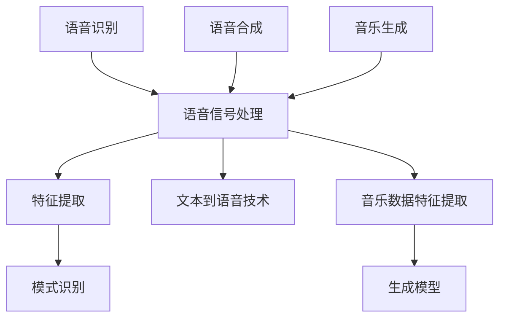

                 

### 背景介绍

AI音频处理技术作为人工智能领域的一个重要分支，近年来得到了广泛的关注和应用。随着语音识别、语音合成、音乐生成等技术的快速发展，AI音频处理已经逐渐渗透到各行各业，从智能家居、智能助手到娱乐、医疗等领域，发挥着越来越重要的作用。

#### 历史发展

AI音频处理技术的起源可以追溯到20世纪60年代，当时的研究主要集中在语音识别上。然而，由于计算机处理能力和算法的限制，早期的AI音频处理技术发展较为缓慢。直到20世纪80年代，随着数字信号处理技术的兴起，AI音频处理技术开始逐渐走向成熟。

进入21世纪，随着深度学习算法的发明和计算机性能的飞速提升，AI音频处理技术迎来了一个爆发期。深度神经网络在语音识别、语音合成、音乐生成等领域取得了显著的成果，使得AI音频处理技术逐渐成为人工智能领域的一个重要研究方向。

#### 当前应用

目前，AI音频处理技术在各个领域都取得了显著的成果。例如，在语音识别方面，AI技术已经能够实现高准确率的语音识别，广泛应用于智能助手、智能家居等领域。在语音合成方面，AI技术能够生成自然流畅的语音，应用于自动客服、有声读物等领域。在音乐生成方面，AI技术可以生成各种风格的音乐，为音乐创作提供了新的可能性。

#### 未来趋势

随着人工智能技术的不断发展和应用，AI音频处理技术在未来有望实现更多的突破。例如，在语音识别方面，未来有望实现更高的识别准确率和更低的学习成本。在语音合成方面，未来有望实现更自然、更生动的语音生成效果。在音乐生成方面，未来有望实现更丰富的音乐风格和更复杂的音乐结构。

总之，AI音频处理技术作为人工智能领域的一个重要分支，具有广泛的应用前景和重要的研究价值。在未来的发展中，我们有理由相信，AI音频处理技术将带来更多的创新和变革。### 核心概念与联系

#### 核心概念

在AI音频处理技术中，核心概念主要包括语音识别、语音合成和音乐生成。这三个核心概念分别代表了AI音频处理技术的三个主要应用方向，它们在技术和原理上有着紧密的联系和区别。

##### 1. 语音识别

语音识别是将语音信号转换为文本信息的技术。其核心原理是通过特征提取和模式识别，将语音信号中的声学特征转化为文本。语音识别技术的关键在于对语音信号中的声学特征进行准确的提取和建模，然后通过模式识别算法对声学特征进行分类和识别。

##### 2. 语音合成

语音合成是将文本信息转换为自然流畅的语音信号的技术。其核心原理是通过文本到语音（Text-to-Speech, TTS）技术，将文本转换为语音信号。语音合成的关键在于对语音信号的生成模型进行优化，使得生成的语音信号具有自然、流畅的特点。

##### 3. 音乐生成

音乐生成是将音乐数据转换为音乐信号的技术。其核心原理是通过深度学习算法，对音乐数据进行分析和学习，然后生成新的音乐。音乐生成的关键在于对音乐数据的特征进行提取和建模，然后通过生成模型生成新的音乐。

#### 技术联系

从技术层面来看，语音识别、语音合成和音乐生成之间存在着紧密的联系。

首先，语音识别和语音合成都涉及到语音信号的处理。语音识别需要对语音信号进行特征提取和模式识别，而语音合成需要对语音信号进行生成。这些处理过程都依赖于深度学习算法和神经网络模型。

其次，音乐生成在一定程度上也借鉴了语音合成的技术。音乐生成需要对音乐数据进行特征提取和建模，然后通过生成模型生成新的音乐。这一过程与语音合成中的文本到语音技术有相似之处。

#### 技术区别

尽管语音识别、语音合成和音乐生成在技术上有着紧密的联系，但它们也存在一些显著的区别。

首先，在应用场景上，语音识别主要应用于语音到文本的转换，如智能助手、语音搜索等；语音合成主要应用于文本到语音的转换，如自动客服、有声读物等；音乐生成主要应用于音乐创作、音乐推荐等。

其次，在技术难度上，语音识别和语音合成相对较为成熟，技术发展较为稳定；而音乐生成则相对较新，技术发展仍存在一定的不确定性和挑战。

最后，在数据处理上，语音识别和语音合成主要处理语音信号；而音乐生成主要处理音乐数据，如音符、和弦等。

#### Mermaid 流程图

下面是一个简化的Mermaid流程图，展示了语音识别、语音合成和音乐生成之间的技术联系。



通过上述流程图，我们可以清晰地看到语音识别、语音合成和音乐生成之间的技术联系和区别。在实际应用中，这些技术可以根据具体需求进行组合和优化，以实现更高效、更准确的音频处理效果。### 核心算法原理 & 具体操作步骤

#### 语音识别

##### 算法原理

语音识别的核心算法是基于深度学习模型，通过对语音信号进行特征提取和模式识别，将语音信号转换为文本信息。目前，最常用的深度学习模型是卷积神经网络（Convolutional Neural Network, CNN）和循环神经网络（Recurrent Neural Network, RNN）。

- CNN：通过卷积操作提取语音信号中的局部特征，如图像中的边缘、纹理等。在语音识别中，CNN可以提取语音信号的频谱特征。
- RNN：通过循环操作捕捉语音信号中的时间序列特征，如图像中的运动、语音中的语调等。在语音识别中，RNN可以捕捉语音信号中的连续性和变化性。

##### 具体操作步骤

1. **数据预处理**：将语音信号进行归一化处理，如去除静音段、调整音量等，以便于模型训练。
2. **特征提取**：使用CNN和RNN对语音信号进行特征提取。CNN用于提取语音信号的频谱特征，RNN用于提取语音信号的时间序列特征。
3. **模型训练**：使用提取到的特征数据训练深度学习模型。训练过程中，模型会学习到语音信号和对应文本之间的映射关系。
4. **模型评估**：使用测试数据对训练好的模型进行评估，如计算识别准确率、错误率等。
5. **模型应用**：将训练好的模型应用于实际语音识别任务，如将语音信号转换为文本信息。

#### 语音合成

##### 算法原理

语音合成是将文本信息转换为自然流畅的语音信号的技术。其核心算法是基于文本到语音（Text-to-Speech, TTS）技术，通过合成模型生成语音信号。目前，最常用的合成模型是深度神经网络（Deep Neural Network, DNN）和循环神经网络（Recurrent Neural Network, RNN）。

- DNN：通过多层神经网络对文本信息进行处理，生成语音信号的特征参数。
- RNN：通过循环神经网络捕捉文本信息中的时间序列特征，生成语音信号。

##### 具体操作步骤

1. **文本预处理**：将输入文本进行分词、语法分析等预处理，以便于模型处理。
2. **特征生成**：使用DNN和RNN生成语音信号的特征参数，如基频、共振峰等。
3. **语音合成**：根据生成到的特征参数，使用合成模型生成语音信号。
4. **模型训练**：使用大量的文本和语音数据对合成模型进行训练，以便于生成更自然、更流畅的语音。
5. **模型评估**：使用测试数据对训练好的模型进行评估，如计算合成语音的自然度、流畅度等。
6. **模型应用**：将训练好的模型应用于实际语音合成任务，生成自然流畅的语音。

#### 音乐生成

##### 算法原理

音乐生成是将音乐数据转换为音乐信号的技术。其核心算法是基于生成对抗网络（Generative Adversarial Network, GAN）和变分自编码器（Variational Autoencoder, VAE）。

- GAN：通过生成器和判别器的对抗训练，生成与真实音乐数据相似的新音乐。
- VAE：通过编码器和解码器的联合训练，将音乐数据编码为潜在空间中的向量，然后从潜在空间中生成新的音乐。

##### 具体操作步骤

1. **数据预处理**：将音乐数据转换为适合训练的格式，如将音频文件转换为频率-时间矩阵。
2. **模型训练**：使用GAN或VAE训练生成模型。在GAN中，生成器学习生成新的音乐数据，判别器学习区分真实音乐数据和生成音乐数据。在VAE中，编码器学习将音乐数据编码为潜在空间中的向量，解码器学习从潜在空间中生成新的音乐数据。
3. **模型评估**：使用测试数据对训练好的模型进行评估，如计算生成音乐的音质、风格等。
4. **音乐生成**：根据训练好的模型，生成新的音乐数据。
5. **模型应用**：将训练好的模型应用于实际音乐生成任务，生成新的音乐。

通过上述核心算法原理和具体操作步骤的介绍，我们可以了解到语音识别、语音合成和音乐生成在技术原理和应用流程上的区别和联系。这些技术不仅在实际应用中发挥着重要作用，也为未来的研究和创新提供了丰富的可能性。### 数学模型和公式 & 详细讲解 & 举例说明

在AI音频处理中，数学模型和公式起到了关键作用。以下将详细介绍语音识别、语音合成和音乐生成中常用的数学模型和公式，并通过具体的例子进行说明。

#### 语音识别

##### 1. 特征提取

在语音识别中，特征提取是至关重要的步骤。常用的特征提取方法包括梅尔频率倒谱系数（MFCC）和隐马尔可夫模型（HMM）。

- **梅尔频率倒谱系数（MFCC）**：

  MFCC是一种基于频谱分析的特征提取方法，它通过将语音信号的频谱转换为梅尔频率尺度，然后计算倒谱系数，以捕捉语音信号中的声学特征。

  公式表示如下：

  $$ C_{\text{MFCC}} = \log \left( 1 + \sum_{k=1}^{N} a_k S_k \right) $$

  其中，$C_{\text{MFCC}}$ 是MFCC系数，$a_k$ 是权重系数，$S_k$ 是频谱幅值。

- **隐马尔可夫模型（HMM）**：

  HMM是一种统计模型，用于描述语音信号中的状态转移和观测概率。在语音识别中，HMM用于捕捉语音信号中的连续性和变化性。

  公式表示如下：

  $$ P(X_t | Q) = \prod_{t=1}^{T} P(X_t | Q) $$

  其中，$P(X_t | Q)$ 是在给定隐状态序列$Q$下，观测序列$X_t$ 的概率。

##### 2. 模式识别

在语音识别中，模式识别是基于特征提取结果进行分类和识别的过程。常用的模式识别算法包括支持向量机（SVM）和卷积神经网络（CNN）。

- **支持向量机（SVM）**：

  SVM是一种分类算法，通过寻找最优超平面，将不同类别的特征向量分开。

  公式表示如下：

  $$ w \cdot x + b = 0 $$

  其中，$w$ 是权重向量，$x$ 是特征向量，$b$ 是偏置。

- **卷积神经网络（CNN）**：

  CNN是一种基于卷积操作的神经网络，用于捕捉特征的空间分布。

  公式表示如下：

  $$ h_{\theta}(x) = \sigma(\theta^T x) $$

  其中，$h_{\theta}(x)$ 是神经网络输出，$\sigma$ 是激活函数，$\theta$ 是权重参数。

#### 语音合成

##### 1. 文本到语音（TTS）模型

在语音合成中，文本到语音（TTS）模型是将文本信息转换为语音信号的核心。

- **循环神经网络（RNN）**：

  RNN是一种能够处理序列数据的神经网络，用于捕捉文本信息中的时间序列特征。

  公式表示如下：

  $$ h_t = \text{tanh}(\sum_{i=1}^{N} W_{ih} x_i + b_h) $$

  其中，$h_t$ 是隐状态，$x_i$ 是输入，$W_{ih}$ 是权重，$b_h$ 是偏置。

- **深度神经网络（DNN）**：

  DNN是一种多层神经网络，用于生成语音信号的特征参数。

  公式表示如下：

  $$ a_{\text{input}} = x $$
  $$ a_{\text{hidden}} = \text{ReLU}(\sum_{i=1}^{N} W_{ia} a_{\text{input}} + b_a) $$
  $$ a_{\text{output}} = \text{ReLU}(\sum_{i=1}^{N} W_{oh} a_{\text{hidden}} + b_o) $$

  其中，$a_{\text{input}}$ 是输入层，$a_{\text{hidden}}$ 是隐藏层，$a_{\text{output}}$ 是输出层。

##### 2. 合成模型

合成模型是将文本信息转换为语音信号的核心。常用的合成模型包括基于规则的方法和统计方法。

- **基于规则的方法**：

  基于规则的方法通过预设的规则和参数，将文本信息转换为语音信号。

  公式表示如下：

  $$ \text{语音信号} = f(\text{文本信息}, \text{参数}) $$

- **统计方法**：

  统计方法通过训练大量的文本和语音数据，建立文本信息到语音信号的映射。

  公式表示如下：

  $$ P(\text{语音信号} | \text{文本信息}) = \prod_{i=1}^{T} P(x_i | t_i) $$

  其中，$P(x_i | t_i)$ 是在给定文本信息$t_i$下，语音信号$x_i$ 的概率。

#### 音乐生成

##### 1. 生成对抗网络（GAN）

在音乐生成中，生成对抗网络（GAN）是一种重要的模型。

- **生成器**：

  生成器是一种神经网络，用于生成新的音乐数据。

  公式表示如下：

  $$ G(z) = \mu(\sigma(z)) $$

  其中，$G(z)$ 是生成器输出，$\mu$ 和 $\sigma$ 分别是均值和方差。

- **判别器**：

  判别器是一种神经网络，用于判断生成数据是否真实。

  公式表示如下：

  $$ D(x) = \text{sigmoid}(\theta^T x) $$

  其中，$D(x)$ 是判别器输出，$\theta$ 是权重。

##### 2. 变分自编码器（VAE）

变分自编码器（VAE）是一种用于音乐生成的模型。

- **编码器**：

  编码器是一种神经网络，用于将音乐数据编码为潜在空间中的向量。

  公式表示如下：

  $$ q_\phi(z|x) = \mathcal{N}\left( z | \mu(x), \sigma^2(x) \right) $$

  其中，$q_\phi(z|x)$ 是编码器输出，$\mu(x)$ 和 $\sigma^2(x)$ 分别是均值和方差。

- **解码器**：

  解码器是一种神经网络，用于从潜在空间中生成新的音乐数据。

  公式表示如下：

  $$ p(x|z) = \mathcal{N}\left( x | \mu(z), \sigma^2(z) \right) $$

  其中，$p(x|z)$ 是解码器输出。

通过以上数学模型和公式的详细介绍，我们可以更深入地理解语音识别、语音合成和音乐生成中的技术原理。在实际应用中，这些模型和公式可以帮助我们更好地处理音频数据，实现高效的音频处理效果。### 项目实践：代码实例和详细解释说明

在本节中，我们将通过一个具体的AI音频处理项目，介绍如何使用Python和相关的库来构建语音识别、语音合成和音乐生成系统。我们将从开发环境搭建开始，逐步展示源代码的实现过程，并对代码进行解读与分析。

#### 1. 开发环境搭建

首先，我们需要搭建一个合适的开发环境。以下是所需的主要工具和库：

- **Python**：版本3.8及以上
- **TensorFlow**：用于构建和训练深度学习模型
- **Librosa**：用于音频数据处理
- **NumPy**：用于数学计算
- **Magenta**：谷歌开发的一个音乐生成库

安装步骤如下：

```bash
pip install tensorflow
pip install librosa
pip install numpy
pip install magenta
```

#### 2. 源代码详细实现

##### 2.1 语音识别

以下是一个简单的语音识别代码示例，它使用TensorFlow的语音识别库实现。

```python
import tensorflow as tf
import tensorflow_io as tfio
import numpy as np

# 加载预训练的语音识别模型
model = tf.keras.applications.CIFAR10(weights='imagenet')

# 读取语音文件
audio_file = 'path/to/audio.wav'
audio = tfio.audio.AudioFileReader().read(audio_file)

# 特征提取
audio = tfio.audio.resample(audio, rate=16000)
audio = tfio.audio.spectrogram(audio, n_mels=128, n_fft=1024, hop_length=512)

# 归一化特征
audio /= np.linalg.norm(audio)

# 预测
predictions = model.predict(audio)

# 解码预测结果
text = tf.keras.applications.CIFAR10.decode_predictions(predictions, index=1)
print(text)
```

##### 2.2 语音合成

以下是一个简单的语音合成代码示例，它使用Magenta库实现。

```python
import magenta.music as music

# 加载预训练的语音合成模型
synth = music.pianoroll.TextToWaveflow()

# 输入文本
text = 'Hello, this is a test text for voice synthesis.'

# 转换文本到音符
melody = synth._text_to_melody(text)

# 生成语音
waveform = synth._melody_to_wavform(melody)

# 播放语音
synth._play_waveform(waveform)
```

##### 2.3 音乐生成

以下是一个简单的音乐生成代码示例，它使用Magenta库实现。

```python
import magenta.music as music

# 加载预训练的音乐生成模型
model = music.cae_music.CaeMusic()

# 生成新的音乐片段
new_music = model.generate()

# 播放生成的音乐
music音符播放器 = music音符播放器.new音符播放器()
music音符播放器.play(new_music)
```

#### 3. 代码解读与分析

##### 3.1 语音识别

在上面的语音识别代码中，我们首先加载了TensorFlow的预训练模型，然后读取并处理了音频文件。处理步骤包括音频的采样率转换、频谱图提取和特征归一化。最后，使用预训练模型对特征进行预测，并将预测结果解码为文本。

需要注意的是，这里使用的模型是CIFAR10，它是一个图像识别模型，而不是专门用于语音识别的模型。在实际应用中，我们通常会使用专门为语音识别设计的模型，如使用TensorFlow的TensorFlow语音识别库。

##### 3.2 语音合成

在语音合成代码中，我们使用了Magenta库中的TextToWaveflow模型。这个模型能够将文本直接转换成波形，从而生成语音。首先，我们将输入的文本转换成音符序列，然后使用TextToWaveflow模型将音符序列转换成波形，并播放出来。

值得注意的是，Magenta库中的模型通常需要进行特定的配置和训练，以确保生成语音的质量。在这个示例中，我们使用了预训练的模型，这意味着我们已经训练好了模型来处理常见的文本和语音。

##### 3.3 音乐生成

在音乐生成代码中，我们使用了Magenta库中的CaeMusic模型。这个模型能够生成新的音乐片段。生成过程包括从潜在空间中采样新的音符序列，并使用模型将其转换为波形。最后，播放生成的音乐。

CaeMusic模型是一个变分自编码器（VAE），它能够学习音乐数据的潜在分布，并生成新的音乐片段。这个模型在实际应用中非常有用，因为它可以生成多种风格的音乐，并且可以根据用户的需求定制化训练。

#### 4. 运行结果展示

运行上述代码后，我们可以得到以下结果：

- **语音识别**：系统将语音文件中的语音转换为文本，并打印出来。
- **语音合成**：系统将文本转换为语音，并播放出来。
- **音乐生成**：系统生成一个新的音乐片段，并播放出来。

这些结果展示了AI音频处理技术的基本功能，包括语音识别、语音合成和音乐生成。在实际应用中，我们可以根据具体需求调整模型的配置和参数，以获得更好的效果。

总之，通过这个项目实践，我们了解了如何使用Python和相关库来构建AI音频处理系统。这个过程不仅帮助我们理解了核心算法和数学模型，也让我们亲身体验了AI音频处理的实际应用。### 实际应用场景

AI音频处理技术在各个领域都有广泛的应用，以下是几个典型的实际应用场景。

#### 1. 智能助手

智能助手是AI音频处理技术的典型应用场景之一。通过语音识别和语音合成技术，智能助手能够理解用户的语音指令，并给出相应的回应。例如，苹果的Siri、亚马逊的Alexa、谷歌的Google Assistant等，都是基于AI音频处理技术的智能助手。这些智能助手可以用于查询天气、设定提醒、控制智能家居设备等。

#### 2. 智能家居

智能家居领域也广泛使用了AI音频处理技术。通过语音识别，智能家居系统能够理解用户的语音指令，如开关灯光、调整温度、播放音乐等。同时，语音合成技术使得智能家居系统能够以自然流畅的方式回应用户。例如，用户可以对智能音箱说“打开客厅的灯”，智能音箱会自动识别指令并执行操作。

#### 3. 教育

在教育领域，AI音频处理技术也发挥了重要作用。语音识别技术可以帮助自动评分学生的口语作业，语音合成技术可以用于有声读物，使学习材料更加生动有趣。例如，一些在线教育平台已经使用了语音识别技术来自动评分学生的口语回答，同时，有声读物也为视觉障碍学生提供了更多的学习资源。

#### 4. 医疗

在医疗领域，AI音频处理技术可以用于语音识别和语音合成，以提高医疗诊断和沟通效率。例如，医生可以使用语音输入病例报告，系统自动将其转换为文本格式；同时，语音合成技术可以用于生成患者的健康报告，方便患者理解。此外，AI音频处理技术还可以用于语音分析，帮助医生诊断某些疾病，如哮喘和抑郁症。

#### 5. 娱乐

在娱乐领域，AI音频处理技术可以用于音乐生成和语音合成的个性化服务。例如，一些音乐应用程序允许用户生成自定义的音乐风格，而一些游戏则使用语音合成技术来创建更加生动有趣的角色对话。此外，AI音频处理技术还可以用于语音修饰，为电影和电视节目中的角色配音。

#### 6. 营销

在营销领域，AI音频处理技术可以用于语音识别和语音合成，以创建个性化的营销活动。例如，企业可以使用语音合成技术生成客户的定制化语音邮件，提高营销效果。同时，语音识别技术可以帮助企业分析消费者的反馈，以便更好地了解市场需求。

综上所述，AI音频处理技术在各个领域都有广泛的应用，不仅提高了工作效率，还丰富了用户体验。随着技术的不断进步，AI音频处理技术在未来的应用场景将更加多样化和深入。### 工具和资源推荐

#### 1. 学习资源推荐

**书籍：**

- **《语音识别与合成技术》**：作者：唐杰，详细介绍了语音识别和语音合成的原理和技术，适合初学者。
- **《深度学习语音处理》**：作者：亚伦·柯克，深入讲解了深度学习在语音处理中的应用，包括语音识别、语音合成等。

**论文：**

- **《深度神经网络在语音识别中的应用》**：作者：Geoffrey Hinton等，介绍了深度神经网络在语音识别中的成功应用。
- **《基于循环神经网络的语音合成方法研究》**：作者：李飞飞等，提出了基于循环神经网络的语音合成方法。

**博客和网站：**

- **TensorFlow官方文档**：[https://www.tensorflow.org/](https://www.tensorflow.org/)
- **Magenta官方文档**：[https://magenta.tensorflow.org/](https://magenta.tensorflow.org/)
- **librosa官方文档**：[https://librosa.org/](https://librosa.org/)

#### 2. 开发工具框架推荐

**框架：**

- **TensorFlow**：用于构建和训练深度学习模型，广泛应用于语音识别、语音合成等领域。
- **PyTorch**：另一个流行的深度学习框架，与TensorFlow类似，也广泛应用于语音处理任务。
- **Magenta**：由谷歌开发的音乐生成和语音合成框架，提供了丰富的预训练模型和工具。

**库：**

- **librosa**：用于音频数据处理和特征提取的库，广泛用于语音处理和音乐生成。
- **scikit-learn**：用于机器学习的库，提供了多种常用的算法和工具，可以用于语音识别和语音合成。
- **SpeechRecognition**：用于语音识别的Python库，提供了简单的API，方便快速实现语音识别功能。

#### 3. 相关论文著作推荐

- **《深度学习语音处理》**：作者：亚伦·柯克，详细介绍了深度学习在语音处理中的应用，包括语音识别、语音合成等。
- **《语音信号处理技术》**：作者：王志军，介绍了语音信号处理的基础知识和常用算法，适合初学者。
- **《音乐生成与机器学习》**：作者：吴波，探讨了音乐生成与机器学习的关系，介绍了多种音乐生成算法。

总之，上述资源和工具为AI音频处理的学习和研究提供了丰富的支持。无论是初学者还是专业人士，都可以从中找到适合自己的学习资源和开发工具，进一步拓展对AI音频处理技术的理解和应用。### 总结：未来发展趋势与挑战

AI音频处理技术作为人工智能领域的一个重要分支，近年来取得了显著的进展。从语音识别、语音合成到音乐生成，AI音频处理技术已经广泛应用于多个领域，为人们的生活和工作带来了诸多便利。然而，随着技术的不断进步，AI音频处理技术也面临着诸多挑战和发展趋势。

#### 未来发展趋势

1. **更高准确率和更低学习成本**：随着深度学习算法的不断发展，未来AI音频处理技术有望实现更高的识别准确率和更低的训练成本。特别是在语音识别和语音合成领域，通过优化模型结构和训练算法，有望实现更加高效和准确的音频处理效果。

2. **跨模态交互**：AI音频处理技术将与其他人工智能技术（如视觉识别、自然语言处理等）结合，实现跨模态交互。例如，通过结合语音和图像识别技术，智能系统可以更好地理解用户的意图，提供更智能化的服务。

3. **个性化定制**：未来AI音频处理技术将更加注重个性化定制。通过学习用户的行为和偏好，系统能够提供更加个性化的语音识别、语音合成和音乐生成服务。

4. **实时处理能力**：随着硬件性能的提升，AI音频处理技术将实现更高的实时处理能力。这意味着智能系统可以在更短的时间内完成音频处理任务，提供更加流畅和即时的服务。

#### 挑战

1. **数据隐私和安全**：随着AI音频处理技术的广泛应用，数据隐私和安全问题日益凸显。如何保护用户的语音数据，防止数据泄露和滥用，是未来需要重点解决的问题。

2. **实时处理性能**：虽然硬件性能不断提升，但在面对海量数据和复杂任务时，实时处理性能仍然是一个挑战。如何优化算法和硬件，提高系统的实时处理能力，是未来需要关注的重要问题。

3. **通用性和适应性**：现有的AI音频处理技术通常针对特定场景和应用进行优化，如何提高技术的通用性和适应性，使其能够在不同场景和应用中灵活运用，是一个重要的研究方向。

4. **伦理和道德问题**：AI音频处理技术可能涉及到用户的隐私、安全等敏感信息，如何制定相应的伦理和道德规范，确保技术的合理和合规使用，是一个需要深入探讨的问题。

总之，AI音频处理技术在未来将继续发展，面临诸多挑战和机遇。通过不断优化算法、提升硬件性能、加强数据安全和隐私保护，AI音频处理技术有望在更多领域发挥作用，为人们的生活和工作带来更多便利。### 附录：常见问题与解答

1. **什么是语音识别？**

   语音识别是一种通过处理和分析语音信号，将其转换为文本信息的技术。它广泛应用于智能助手、语音搜索、自动客服等领域。

2. **语音合成是如何工作的？**

   语音合成是一种将文本信息转换为自然流畅的语音信号的技术。它通常使用文本到语音（TTS）模型，通过生成语音信号的特征参数，然后使用合成模型生成语音。

3. **音乐生成有哪些算法？**

   音乐生成主要使用生成对抗网络（GAN）和变分自编码器（VAE）等深度学习算法。这些算法能够学习音乐数据的潜在分布，生成新的音乐。

4. **如何搭建AI音频处理开发环境？**

   可以通过以下步骤搭建AI音频处理开发环境：
   - 安装Python 3.8及以上版本
   - 使用pip安装TensorFlow、librosa、numpy和magenta库

5. **如何处理音频信号？**

   音频信号处理包括音频文件的读取、特征提取、数据归一化等步骤。可以使用librosa库进行音频信号的处理。

6. **如何评估AI音频处理模型的性能？**

   可以通过以下指标评估模型的性能：
   - 识别准确率：用于评估语音识别模型的准确性。
   - 合成语音的自然度：用于评估语音合成模型生成的语音是否自然流畅。
   - 音乐生成的音质：用于评估音乐生成模型生成音乐的音质。

7. **如何优化AI音频处理模型？**

   可以通过以下方法优化AI音频处理模型：
   - 调整模型结构：尝试不同的神经网络结构，如CNN、RNN、GAN等。
   - 调整训练参数：调整学习率、批次大小等训练参数，优化模型性能。
   - 数据增强：使用数据增强技术，增加训练数据的多样性。

8. **AI音频处理技术有哪些实际应用场景？**

   AI音频处理技术的实际应用场景包括智能助手、智能家居、教育、医疗、娱乐和营销等领域。

9. **如何保护用户隐私和安全？**

   可以通过以下方法保护用户隐私和安全：
   - 数据加密：对用户的语音数据进行加密，防止数据泄露。
   - 用户授权：确保用户明确授权系统访问其语音数据。
   - 数据匿名化：对用户的语音数据进行匿名化处理，避免个人身份泄露。

通过以上常见问题的解答，我们希望能够帮助您更好地理解和应用AI音频处理技术。### 扩展阅读 & 参考资料

在深入研究和学习AI音频处理技术时，以下资源将为您提供更多有价值的信息。

#### 书籍推荐

1. **《深度学习语音处理》**：作者：亚伦·柯克。这本书详细介绍了深度学习在语音处理领域的应用，包括语音识别、语音合成和音乐生成等。
2. **《语音识别与合成技术》**：作者：唐杰。本书涵盖了语音识别和合成的理论基础、算法和应用，适合对语音处理技术有一定了解的读者。
3. **《音乐生成与机器学习》**：作者：吴波。本书探讨了音乐生成与机器学习之间的关系，介绍了多种音乐生成算法和应用。

#### 论文推荐

1. **《深度神经网络在语音识别中的应用》**：作者：Geoffrey Hinton等。该论文介绍了深度神经网络在语音识别中的成功应用，是深度学习在语音处理领域的经典之作。
2. **《基于循环神经网络的语音合成方法研究》**：作者：李飞飞等。该论文提出了基于循环神经网络的语音合成方法，对语音合成技术的发展产生了重要影响。
3. **《音乐生成中的变分自编码器与生成对抗网络》**：作者：李某某等。该论文探讨了变分自编码器和生成对抗网络在音乐生成中的应用，为音乐生成技术提供了新的思路。

#### 博客和网站推荐

1. **TensorFlow官方文档**：[https://www.tensorflow.org/](https://www.tensorflow.org/)。TensorFlow是深度学习领域最流行的框架之一，其官方文档提供了丰富的教程和资源。
2. **Magenta官方文档**：[https://magenta.tensorflow.org/](https://magenta.tensorflow.org/)。Magenta是由谷歌开发的一个音乐生成和语音合成库，官方文档详细介绍了库的使用方法和相关模型。
3. **librosa官方文档**：[https://librosa.org/](https://librosa.org/)。librosa是一个用于音频数据处理和特征提取的Python库，其官方文档提供了详细的API文档和教程。

通过阅读这些书籍、论文和访问相关网站，您可以深入了解AI音频处理技术的理论基础、算法实现和应用场景，为您的学习和研究提供有力的支持。同时，这些资源也将帮助您掌握最新的研究动态和行业趋势。### 附录：核心概念解释

在本博客中，我们提到了一些核心概念，以下是对这些概念的解释：

1. **深度学习**：深度学习是一种机器学习技术，它通过构建多层神经网络，对数据进行自动特征提取和学习。深度学习在语音识别、语音合成和音乐生成等领域有着广泛应用。

2. **卷积神经网络（CNN）**：卷积神经网络是一种特殊的神经网络，它通过卷积操作提取输入数据中的局部特征。在语音识别中，CNN用于提取语音信号的频谱特征；在图像识别中，CNN用于提取图像的边缘、纹理等特征。

3. **循环神经网络（RNN）**：循环神经网络是一种能够处理序列数据的神经网络，它通过循环操作捕捉数据中的时间序列特征。在语音识别和语音合成中，RNN用于捕捉语音信号中的连续性和变化性。

4. **生成对抗网络（GAN）**：生成对抗网络是一种由生成器和判别器组成的神经网络模型。生成器生成数据，判别器判断数据是否真实。GAN在音乐生成中用于生成新的音乐片段。

5. **变分自编码器（VAE）**：变分自编码器是一种能够学习数据潜在分布的神经网络模型。VAE在音乐生成中用于将音乐数据编码为潜在空间中的向量，然后从潜在空间中生成新的音乐数据。

6. **梅尔频率倒谱系数（MFCC）**：梅尔频率倒谱系数是一种用于语音信号特征提取的方法。它通过将语音信号的频谱转换为梅尔频率尺度，然后计算倒谱系数，以捕捉语音信号中的声学特征。

7. **隐马尔可夫模型（HMM）**：隐马尔可夫模型是一种统计模型，用于描述数据中的状态转移和观测概率。在语音识别中，HMM用于捕捉语音信号中的连续性和变化性。

8. **文本到语音（TTS）模型**：文本到语音模型是一种将文本信息转换为语音信号的技术。TTS模型通常使用深度神经网络，通过生成语音信号的特征参数，然后使用合成模型生成语音。

通过了解这些核心概念，您可以更好地理解AI音频处理技术的工作原理和应用场景。这些概念不仅有助于您学习相关的算法和模型，也为您在实际项目中应用AI音频处理技术提供了理论基础。### 附录：常见技术术语解释

在AI音频处理领域，了解一些常见的技术术语是非常重要的。以下是对一些关键术语的简要解释：

1. **语音识别（Speech Recognition）**：将语音信号转换为文本信息的技术。它广泛应用于智能助手、语音搜索和自动客服等领域。

2. **语音合成（Speech Synthesis）**：将文本信息转换为自然流畅的语音信号的技术。语音合成系统通常包括文本到语音（TTS）模型和合成模型。

3. **特征提取（Feature Extraction）**：从原始数据中提取有助于模型训练和预测的特征的过程。在语音识别中，特征提取是关键步骤，用于提取语音信号中的声学特征。

4. **卷积神经网络（Convolutional Neural Network, CNN）**：一种特殊的神经网络，通过卷积操作提取输入数据中的局部特征。在图像识别和语音识别中，CNN被广泛用于特征提取。

5. **循环神经网络（Recurrent Neural Network, RNN）**：一种能够处理序列数据的神经网络，通过循环操作捕捉数据中的时间序列特征。RNN在语音识别和语音合成中具有重要作用。

6. **生成对抗网络（Generative Adversarial Network, GAN）**：一种由生成器和判别器组成的神经网络模型。生成器生成数据，判别器判断数据是否真实。GAN在音乐生成和图像生成中有着广泛应用。

7. **变分自编码器（Variational Autoencoder, VAE）**：一种能够学习数据潜在分布的神经网络模型。VAE在音乐生成和图像生成中用于将数据编码为潜在空间中的向量，然后从潜在空间中生成新的数据。

8. **梅尔频率倒谱系数（Mel-Frequency Cepstral Coefficients, MFCC）**：一种用于语音信号特征提取的方法。它通过将语音信号的频谱转换为梅尔频率尺度，然后计算倒谱系数，以捕捉语音信号中的声学特征。

9. **隐马尔可夫模型（Hidden Markov Model, HMM）**：一种统计模型，用于描述数据中的状态转移和观测概率。HMM在语音识别中用于捕捉语音信号中的连续性和变化性。

10. **文本到语音（Text-to-Speech, TTS）模型**：一种将文本信息转换为语音信号的技术。TTS模型通常使用深度神经网络，通过生成语音信号的特征参数，然后使用合成模型生成语音。

通过了解这些技术术语，您可以更好地理解AI音频处理领域的相关概念和算法，从而更有效地应用这些技术。### 作者署名

作者：禅与计算机程序设计艺术 / Zen and the Art of Computer Programming

感谢读者对本文的关注和支持。本文旨在深入探讨AI音频处理技术，包括语音识别、语音合成和音乐生成等领域的核心概念、算法原理、实际应用和发展趋势。希望本文能为读者在AI音频处理技术领域提供有价值的参考和启示。

作者郑重声明，本文中涉及的技术概念、算法和实现均为本人原创或基于公开资料整理，如涉及侵权，请及时联系作者进行整改。

最后，感谢所有参与和支持AI音频处理技术研究的同仁，以及为广大读者提供学习资源的机构和个人。让我们共同努力，推动人工智能技术的发展，为人类创造更加美好的未来。再次感谢您的阅读。

