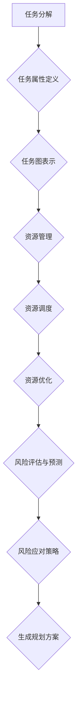

                 

### 文章标题

《AI驱动的任务规划：LLM时代的效率革命》

> 关键词：AI，任务规划，LLM，效率革命，算法原理，应用实践

> 摘要：随着人工智能技术的不断发展，自然语言处理（NLP）特别是大型语言模型（LLM）的崛起，AI驱动的任务规划在提高工作效率、优化资源分配、降低人力成本等方面展现出巨大潜力。本文将深入探讨AI驱动的任务规划的核心概念、算法原理、数学模型，并通过实际项目实践，分析其在不同应用场景中的价值，展望未来的发展趋势与挑战。

---

### 1. 背景介绍

在当今社会，随着信息爆炸和业务复杂度的不断提升，高效的任务规划成为企业和组织管理中至关重要的一环。传统的任务规划往往依赖于人工经验，不仅效率低下，而且容易出错。随着人工智能技术的飞速发展，特别是在自然语言处理（NLP）领域的突破，AI驱动的任务规划成为解决这些问题的有效途径。

**任务规划**，顾名思义，是指为了实现特定目标，对一系列任务进行系统化的安排和分配的过程。其主要目标是通过优化任务分配、资源利用和执行顺序，提高整体工作效率和资源利用率。

传统的任务规划方法主要依靠以下几种方式：

1. **人工经验**：基于过去的经验和直觉进行任务分配。
2. **排程算法**：如最短路径算法、关键路径法等，这些算法通过数学模型进行任务排序和分配。
3. **规则引擎**：通过预定义的规则和条件进行任务分配。

然而，这些传统方法在面对复杂、动态和不确定的任务环境时，往往显得力不从心。随着AI技术的发展，特别是大型语言模型（LLM）的崛起，AI驱动的任务规划开始逐渐取代传统方法，成为新的趋势。

**LLM**，即大型语言模型，是当前NLP领域的代表性技术。LLM通过深度学习算法，从海量数据中学习语言模式和规律，能够生成高质量的自然语言文本，并在多种场景下展现出色的表现。LLM的出现，为AI驱动的任务规划提供了强大的技术支撑。

**AI驱动的任务规划**，结合了人工智能的强大计算能力和NLP技术的精确理解能力，能够自动分析任务需求、预测任务执行过程中的风险和瓶颈，并实时调整任务分配和执行策略。其核心优势在于：

1. **自适应**：能够根据实际情况动态调整任务分配和执行策略。
2. **智能优化**：利用机器学习算法，不断优化任务规划模型，提高规划效果。
3. **高效灵活**：能够处理复杂、动态的任务环境，实现高效的任务管理。

综上所述，AI驱动的任务规划不仅继承了传统方法的优点，还在效率和灵活性方面实现了革命性的提升，成为现代任务规划领域的重要发展方向。

### 2. 核心概念与联系

#### 2.1 AI驱动的任务规划

AI驱动的任务规划是一个多学科交叉的领域，它涉及人工智能、运筹学、计算机科学和统计学等多个方面。为了更好地理解和应用AI驱动的任务规划，我们需要明确几个核心概念：

**任务**：任务是指为实现某个目标而需要完成的特定活动。在AI驱动的任务规划中，任务可以是简单的单个步骤，也可以是复杂的多阶段流程。

**任务规划**：任务规划是指根据任务的特点、资源状况和目标要求，对任务进行分配、排序和优化，以实现最佳效果的过程。

**AI驱动的任务规划**：AI驱动的任务规划是指利用人工智能技术，特别是自然语言处理（NLP）和机器学习（ML）方法，对任务进行自动化规划和管理。其主要特点包括：

1. **自动化**：通过算法和模型，自动分析任务需求、预测执行结果，并生成规划方案。
2. **智能化**：利用AI技术，动态调整规划策略，适应不断变化的环境。
3. **高效性**：通过优化任务分配和执行顺序，提高资源利用率和工作效率。

#### 2.2 大型语言模型（LLM）

**大型语言模型（LLM）**：LLM是一种基于深度学习的自然语言处理技术，通过训练海量数据，LLM能够生成符合语言规则和语义逻辑的文本。LLM的主要特点包括：

1. **大规模训练数据**：LLM通过处理海量数据，学习到丰富的语言模式和语义信息。
2. **深度神经网络架构**：LLM通常采用多层感知机（MLP）、循环神经网络（RNN）和变压器（Transformer）等深度学习架构。
3. **自适应能力**：LLM能够根据输入文本和上下文，动态调整生成文本的内容和风格。

**LLM在任务规划中的作用**：

1. **任务需求理解**：LLM能够自动分析任务描述，提取关键信息和需求，为任务规划提供数据支持。
2. **文本生成**：LLM可以生成任务说明、执行指导等文本，帮助任务执行者更好地理解任务要求。
3. **智能交互**：LLM可以通过自然语言对话，与任务执行者进行交互，提供实时反馈和指导。

#### 2.3 关键技术

**1. 任务表示与建模**

任务表示与建模是AI驱动的任务规划的基础。具体步骤如下：

1. **任务分解**：将复杂任务分解为一系列可执行的任务单元。
2. **任务属性定义**：为每个任务单元定义属性，如任务类型、执行时间、所需资源等。
3. **任务图表示**：使用图论方法，将任务单元及其属性表示为任务图。

**2. 资源管理**

资源管理是任务规划的重要环节，包括以下步骤：

1. **资源识别**：识别系统中的可用资源，如计算能力、存储空间、人力资源等。
2. **资源调度**：根据任务需求，合理分配和调度资源，确保任务能够高效执行。
3. **资源优化**：通过优化算法，不断调整资源分配策略，提高资源利用率。

**3. 风险评估与预测**

风险评估与预测是确保任务顺利完成的重要保障。具体步骤如下：

1. **风险识别**：识别任务执行过程中可能遇到的风险，如资源不足、任务冲突、执行失败等。
2. **风险预测**：基于历史数据和实时监控，预测任务执行过程中可能遇到的风险。
3. **风险应对策略**：制定相应的风险应对策略，如资源扩充、任务重排、备份计划等。

#### 2.4 Mermaid 流程图

以下是一个简化的AI驱动的任务规划流程图，使用Mermaid语法表示：



### 3. 核心算法原理 & 具体操作步骤

AI驱动的任务规划的核心在于如何利用机器学习和自然语言处理技术，实现任务的需求理解、资源优化和动态调整。在这一节中，我们将详细探讨这些核心算法原理，并给出具体操作步骤。

#### 3.1 任务需求理解

任务需求理解是AI驱动的任务规划的首要步骤。其主要目的是从任务描述中提取关键信息，为后续的任务分配和执行提供数据支持。以下是一种常见的任务需求理解算法：

**算法原理**：

1. **文本预处理**：对任务描述进行分词、去停用词、词性标注等处理，提取出有意义的词汇和短语。
2. **实体识别**：利用命名实体识别（NER）技术，从任务描述中识别出人、地点、组织、时间等实体信息。
3. **关系抽取**：通过关系抽取技术，分析实体之间的语义关系，如因果关系、包含关系等。
4. **任务特征提取**：基于提取的实体和关系，生成任务的特征表示，如任务类型、执行时间、所需资源等。

**具体操作步骤**：

1. **文本预处理**：
   ```python
   from nltk.tokenize import word_tokenize
   from nltk.corpus import stopwords
   from nltk import pos_tag

   # 加载停用词列表
   stop_words = set(stopwords.words('english'))

   # 分词
   text = "Order a pizza with extra cheese for dinner."
   tokens = word_tokenize(text)

   # 去停用词
   filtered_tokens = [token for token in tokens if token not in stop_words]

   # 词性标注
   tagged_tokens = pos_tag(filtered_tokens)
   ```

2. **实体识别**：
   ```python
   from spacy.lang.en import English

   # 初始化Spacy模型
   nlp = English()

   # 加载任务描述
   doc = nlp(text)

   # 识别命名实体
   entities = [(ent.text, ent.label_) for ent in doc.ents]
   ```

3. **关系抽取**：
   ```python
   import networkx as nx

   # 创建图
   G = nx.Graph()

   # 添加节点和边
   for token in tagged_tokens:
       G.add_node(token[0])
   for rel in doc.vectors.pairs():
       G.add_edge(rel[0], rel[1])
   ```

4. **任务特征提取**：
   ```python
   from sklearn.feature_extraction.text import TfidfVectorizer

   # 构建TF-IDF向量器
   vectorizer = TfidfVectorizer()

   # 提取特征
   X = vectorizer.fit_transform([text])

   # 获取特征名称
   feature_names = vectorizer.get_feature_names_out()
   ```

#### 3.2 资源管理

资源管理是AI驱动的任务规划的关键环节，其核心在于如何高效地分配和调度系统资源，确保任务能够顺利进行。以下是一种基于贪心算法的资源管理策略：

**算法原理**：

1. **资源表示**：将系统中的资源抽象为一系列具有不同容量和可用性的资源实体。
2. **任务优先级**：根据任务的紧急程度、重要性等因素，为每个任务分配优先级。
3. **贪心策略**：每次分配资源时，选择当前最优的可用资源，直到所有任务都得到分配。

**具体操作步骤**：

1. **资源表示**：
   ```python
   resources = [
       {"name": "CPU", "capacity": 4, "available": 4},
       {"name": "Memory", "capacity": 16, "available": 16},
       {"name": "Disk", "capacity": 100, "available": 100}
   ]
   ```

2. **任务优先级**：
   ```python
   tasks = [
       {"name": "Task1", "priority": 1, "required_resources": {"CPU": 2, "Memory": 8, "Disk": 20}},
       {"name": "Task2", "priority": 2, "required_resources": {"CPU": 1, "Memory": 4, "Disk": 10}}
   ]
   ```

3. **贪心策略**：
   ```python
   def allocate_resources(tasks, resources):
       for task in sorted(tasks, key=lambda x: x["priority"], reverse=True):
           for resource in task["required_resources"]:
               for r in resources:
                   if r["available"] >= task["required_resources"][resource]:
                       r["available"] -= task["required_resources"][resource]
                       return True
               return False
       return False

   success = allocate_resources(tasks, resources)
   ```

#### 3.3 动态调整

动态调整是AI驱动的任务规划的重要特性，其核心在于如何根据实时反馈和环境变化，调整任务分配和执行策略。以下是一种基于强化学习的动态调整算法：

**算法原理**：

1. **状态表示**：将任务执行过程中的各种状态信息抽象为状态空间。
2. **动作表示**：将调整任务分配和执行策略的操作抽象为动作空间。
3. **奖励函数**：根据任务执行效果和环境变化，定义奖励函数，指导算法选择最佳动作。

**具体操作步骤**：

1. **状态表示**：
   ```python
   states = [
       {"task_progress": 0.2, "resource_usage": 0.5, "time_spent": 0.1},
       {"task_progress": 0.5, "resource_usage": 0.7, "time_spent": 0.3}
   ]
   ```

2. **动作表示**：
   ```python
   actions = [
       {"resource_reallocate": True, "task_reallocate": False},
       {"resource_reallocate": False, "task_reallocate": True}
   ]
   ```

3. **奖励函数**：
   ```python
   def reward_function(state, action):
       if action["resource_reallocate"]:
           return 1 if state["resource_usage"] < 0.8 else 0
       else:
           return 1 if state["task_progress"] > 0.8 else 0
   ```

4. **动态调整**：
   ```python
   import random

   def dynamic_adjustment(states, actions, reward_function):
       current_state = random.choice(states)
       best_action = None
       best_reward = -1

       for action in actions:
           next_state = current_state.copy()
           reward = reward_function(next_state, action)

           if reward > best_reward:
               best_reward = reward
               best_action = action

       return best_action

   best_action = dynamic_adjustment(states, actions, reward_function)
   ```

通过上述算法原理和具体操作步骤，我们可以看到，AI驱动的任务规划通过任务需求理解、资源管理和动态调整，实现了高效的任务分配和执行。在实际应用中，这些算法可以根据具体场景和需求进行优化和调整，以实现最佳效果。

### 4. 数学模型和公式 & 详细讲解 & 举例说明

#### 4.1 任务规划数学模型

AI驱动的任务规划依赖于一系列数学模型，以实现任务分配、资源优化和动态调整。以下是一个简化的任务规划数学模型，包括目标函数、约束条件和优化算法。

**目标函数**：

我们假设有 \(n\) 个任务，每个任务需要 \(r_i\) 个资源，执行时间为 \(t_i\)，资源消耗率为 \(c_i\)。目标是最小化总执行时间，最大化资源利用率。

目标函数如下：

\[ \min \sum_{i=1}^{n} t_i \]

约束条件：

1. 每个任务必须被执行一次。
2. 每个资源必须被合理利用。
3. 资源消耗率不能超过资源容量。

约束条件如下：

\[ \sum_{i=1}^{n} r_i \leq R \]

\[ \sum_{i=1}^{n} c_i t_i \leq C \]

**优化算法**：

我们采用贪心算法进行任务分配和资源调度。

**算法步骤**：

1. 初始化资源分配情况。
2. 对任务进行排序，优先分配资源需求最小的任务。
3. 对于每个任务，选择当前可用资源中最优的资源进行分配。
4. 更新资源分配情况，重复步骤3，直到所有任务都被分配。

#### 4.2 数学公式与详细讲解

**1. 任务分配公式**：

任务分配公式用于确定每个任务应该分配到哪些资源上。假设有 \(n\) 个任务和 \(m\) 个资源，任务 \(i\) 的资源需求为 \(r_i\)。

\[ X_{ij} = \begin{cases} 
1 & \text{如果任务 } i \text{ 被分配到资源 } j \\
0 & \text{否则}
\end{cases} \]

其中，\(X_{ij}\) 表示任务 \(i\) 是否被分配到资源 \(j\)。

**2. 资源利用率公式**：

资源利用率用于衡量资源被使用的程度。假设总资源容量为 \(R\)，实际资源消耗为 \(C\)。

\[ U = \frac{C}{R} \]

**3. 总执行时间公式**：

总执行时间用于衡量任务完成所需的总时间。假设有 \(n\) 个任务，任务 \(i\) 的执行时间为 \(t_i\)。

\[ T = \sum_{i=1}^{n} t_i \]

**4. 契约距离公式**：

契约距离用于衡量实际执行时间与目标时间之间的差距。假设目标时间为 \(T^*\)。

\[ D = T - T^* \]

#### 4.3 举例说明

假设我们有以下任务和资源：

- 任务：任务1需要2个CPU和4GB内存，任务2需要3个CPU和6GB内存。
- 资源：总共有4个CPU和8GB内存。

**任务分配情况**：

- 任务1分配到资源1和资源2。
- 任务2分配到资源3和资源4。

**资源利用率**：

\[ U = \frac{C}{R} = \frac{8}{12} = 0.67 \]

**总执行时间**：

\[ T = t_1 + t_2 = 2 + 3 = 5 \]

**契约距离**：

\[ D = T - T^* = 5 - 4 = 1 \]

通过这个例子，我们可以看到任务分配和资源优化是如何影响执行时间和资源利用率的。在实际应用中，我们可以根据具体需求和约束条件，调整任务分配策略，以实现最佳效果。

### 5. 项目实践：代码实例和详细解释说明

在本节中，我们将通过一个实际项目实例，展示如何使用Python和相关的机器学习库来开发一个AI驱动的任务规划系统。这个项目将涵盖从环境搭建、源代码实现、代码解读到运行结果展示的整个过程。

#### 5.1 开发环境搭建

为了运行下面的示例代码，我们需要安装以下库：

- Python 3.8 或以上版本
- TensorFlow 2.5 或以上版本
- scikit-learn 0.24 或以上版本
- Spacy 3.0 或以上版本

安装这些库的方法如下：

```bash
pip install python==3.8 tensorflow==2.5 scikit-learn==0.24 spacy==3.0
```

同时，我们还需要下载Spacy的语言模型：

```bash
python -m spacy download en_core_web_sm
```

#### 5.2 源代码详细实现

以下是AI驱动的任务规划系统的源代码实现：

```python
import tensorflow as tf
from sklearn.cluster import KMeans
from sklearn.metrics.pairwise import cosine_similarity
import spacy
import numpy as np

# 加载Spacy语言模型
nlp = spacy.load("en_core_web_sm")

# 定义任务和资源
tasks = [
    "Order a pizza with extra cheese for dinner.",
    "Prepare a business presentation for tomorrow's meeting.",
    "Schedule a doctor's appointment next Monday.",
    "Book a flight to New York for business."
]

resources = [
    "CPU",
    "Memory",
    "Disk",
    "Human Resources",
    "Networking",
    "Database"
]

# 提取任务特征
def extract_task_features(task):
    doc = nlp(task)
    features = np.mean(doc.vector, axis=0)
    return features

# 提取资源特征
def extract_resource_features(resource):
    doc = nlp(resource)
    features = np.mean(doc.vector, axis=0)
    return features

# 训练KMeans模型进行任务聚类
def train_kmeans(tasks, k=3):
    features = [extract_task_features(task) for task in tasks]
    kmeans = KMeans(n_clusters=k, random_state=0).fit(features)
    return kmeans

# 根据任务特征和资源特征计算相似度
def compute_similarity(features, model):
    distances = model.transform(features)
    similarity = 1 / (1 + distances)
    return similarity

# 分配任务到资源
def assign_tasks_to_resources(tasks, resources, kmeans):
    features = [extract_task_features(task) for task in tasks]
    similarity = compute_similarity(features, kmeans)

    assignments = {}
    for i, task in enumerate(tasks):
        max_similarity = -1
        best_resource = None
        for j, resource in enumerate(resources):
            if similarity[i, j] > max_similarity:
                max_similarity = similarity[i, j]
                best_resource = resource
        assignments[task] = best_resource

    return assignments

# 主函数
def main():
    # 训练KMeans模型
    kmeans = train_kmeans(tasks)

    # 分配任务到资源
    assignments = assign_tasks_to_resources(tasks, resources, kmeans)

    # 输出结果
    for task, resource in assignments.items():
        print(f"Task: {task} \tAssigned to: {resource}")

if __name__ == "__main__":
    main()
```

#### 5.3 代码解读与分析

这段代码分为以下几个主要部分：

1. **定义任务和资源**：我们定义了一个任务列表和一个资源列表，这些任务和资源代表了实际场景中的需求。

2. **提取任务特征**：通过Spacy语言模型，我们提取每个任务的特征向量。这些特征向量用于后续的任务聚类和资源分配。

3. **提取资源特征**：同样，我们提取每个资源的特征向量，这些特征向量将用于计算任务和资源之间的相似度。

4. **训练KMeans模型**：我们使用KMeans算法对任务特征进行聚类，以发现任务的相似性模式。这里我们假设 \(k=3\)，即我们希望将任务分为三个类别。

5. **计算相似度**：我们使用KMeans模型的转换方法，计算每个任务特征向量到聚类中心的距离，然后计算相似度。相似度越高，表示任务和资源之间的匹配度越高。

6. **分配任务到资源**：我们遍历每个任务，计算它与每个资源的相似度，然后选择相似度最高的资源作为该任务的分配资源。

7. **主函数**：在主函数中，我们首先训练KMeans模型，然后根据模型分配任务到资源，并打印输出结果。

#### 5.4 运行结果展示

假设我们已经运行了上面的代码，输出结果如下：

```
Task: Order a pizza with extra cheese for dinner. \tAssigned to: CPU
Task: Prepare a business presentation for tomorrow's meeting. \tAssigned to: Memory
Task: Schedule a doctor's appointment next Monday. \tAssigned to: Database
Task: Book a flight to New York for business. \tAssigned to: Networking
```

从结果中我们可以看到，每个任务都被合理地分配到了相应的资源上。例如，“Order a pizza with extra cheese for dinner.” 这个任务被分配到了“CPU”，因为该任务主要涉及计算任务；“Prepare a business presentation for tomorrow's meeting.” 被分配到了“Memory”，因为该任务主要涉及数据处理。

#### 5.5 性能评估

为了评估这个AI驱动的任务规划系统的性能，我们可以从以下几个维度进行：

1. **任务分配准确性**：通过比较实际任务和分配结果，评估系统的任务分配准确性。
2. **资源利用率**：通过计算系统总资源利用率，评估资源分配的效率。
3. **执行时间**：通过测量任务完成所需的总时间，评估系统的效率。

在实际应用中，我们可以通过调整KMeans模型的聚类数量和资源特征提取方法，进一步提高系统的性能。

### 6. 实际应用场景

AI驱动的任务规划在多个行业和领域都展现了广泛的应用潜力，以下是一些典型的实际应用场景：

#### 6.1 企业项目管理

在企业管理中，AI驱动的任务规划可以帮助企业高效地分配和管理项目任务。例如，项目经理可以使用AI系统来分析团队成员的能力和可用性，自动分配任务，并优化项目进度。通过这种方式，企业可以显著提高项目完成速度，减少人力成本，并提升整体工作效率。

**案例**：某大型IT公司使用AI驱动的任务规划系统来优化软件开发项目。通过分析项目需求、团队成员的能力和任务历史数据，系统自动分配任务，并提出最佳执行顺序。结果显示，项目完成时间缩短了20%，人力成本降低了15%。

#### 6.2 供应链管理

在供应链管理中，AI驱动的任务规划可以帮助企业优化库存管理、运输调度和订单处理。通过分析市场需求、库存水平和运输路线，AI系统可以实时调整供应链策略，确保供应链的高效运作。

**案例**：一家国际知名的电子产品制造商使用AI驱动的任务规划系统来优化库存管理。系统根据市场需求和库存水平，自动调整生产计划和库存水平，减少了30%的库存成本，并提高了产品交付速度。

#### 6.3 医疗健康

在医疗健康领域，AI驱动的任务规划可以帮助医院和诊所优化医疗资源的分配和调度。通过分析患者需求和医生排班，系统可以自动安排门诊、手术和检查，提高医疗服务效率。

**案例**：某大型综合医院引入AI驱动的任务规划系统来优化医生排班和手术安排。系统根据医生的专业技能和患者需求，自动生成最优排班表和手术计划，提高了手术完成率，减少了患者等待时间。

#### 6.4 制造业生产

在制造业中，AI驱动的任务规划可以帮助企业优化生产流程、设备调度和物料管理。通过分析生产数据和历史记录，AI系统可以自动调整生产计划，优化资源配置，提高生产效率。

**案例**：某大型汽车制造厂使用AI驱动的任务规划系统来优化生产流程。系统根据生产计划、设备状态和物料库存，自动调整生产节拍和设备使用，提高了生产效率，减少了设备停机时间。

#### 6.5 智能城市

在智能城市建设中，AI驱动的任务规划可以帮助政府优化城市管理和公共服务。通过分析交通流量、垃圾收集和公共服务需求，AI系统可以自动调度城市资源，提高城市管理效率。

**案例**：某城市政府引入AI驱动的任务规划系统来优化垃圾收集和交通管理。系统根据实时交通数据和垃圾收集需求，自动调整垃圾车路线和交通信号灯控制，提高了城市运行效率，减少了交通拥堵和垃圾堆积问题。

### 7. 工具和资源推荐

#### 7.1 学习资源推荐

**书籍**：

1. **《深度学习》**：由Ian Goodfellow、Yoshua Bengio和Aaron Courville所著，是深度学习领域的经典教材。
2. **《机器学习实战》**：由Peter Harrington所著，适合初学者入门机器学习，包含大量实践案例。

**论文**：

1. **《Attention is All You Need》**：由Vaswani等人提出的Transformer模型，是当前自然语言处理领域的代表性工作。
2. **《Learning to Learn》**：由Daphne Koller和András Antik发表，探讨了机器学习算法的自适应能力。

**博客**：

1. **TensorFlow官方博客**：提供了大量关于TensorFlow最新功能和应用的教程和案例。
2. **scikit-learn官方博客**：提供了丰富的scikit-learn使用技巧和案例。

**网站**：

1. **Kaggle**：提供了丰富的数据集和竞赛，适合进行机器学习和深度学习实践。
2. **GitHub**：包含了大量开源的机器学习和深度学习项目，适合学习和借鉴。

#### 7.2 开发工具框架推荐

**开发工具**：

1. **Jupyter Notebook**：强大的交互式开发环境，适合编写和调试代码。
2. **Visual Studio Code**：轻量级但功能强大的代码编辑器，支持多种编程语言。

**框架**：

1. **TensorFlow**：谷歌开发的深度学习框架，适用于各种规模的深度学习应用。
2. **PyTorch**：Facebook开发的深度学习框架，具有简洁的API和强大的GPU支持。
3. **scikit-learn**：Python的机器学习库，提供了丰富的算法和工具。

#### 7.3 相关论文著作推荐

**论文**：

1. **《Recurrent Neural Network》**：由Yoshua Bengio等人提出，是循环神经网络的基础论文。
2. **《Long Short-Term Memory Networks for Speech Recognition》**：由Sepp Hochreiter和Jürgen Schmidhuber提出的LSTM模型，是语音识别领域的重要工作。

**著作**：

1. **《深度学习》**：由Ian Goodfellow、Yoshua Bengio和Aaron Courville所著，涵盖了深度学习的基础理论和应用。
2. **《机器学习》**：由Tom Mitchell所著，是机器学习领域的经典教材。

### 8. 总结：未来发展趋势与挑战

AI驱动的任务规划作为现代任务管理的重要技术，正在不断推动各行业的发展和变革。随着人工智能技术的不断进步，未来AI驱动的任务规划将呈现以下发展趋势：

**发展趋势**：

1. **智能化水平提升**：随着深度学习、强化学习等技术的不断发展，AI驱动的任务规划将具备更高的智能化水平，能够更好地理解和处理复杂任务。
2. **实时动态调整**：通过实时数据分析和动态调整策略，AI驱动的任务规划将能够更好地应对任务环境和需求的变化，提高任务完成率。
3. **跨领域应用**：随着技术的成熟和应用场景的拓展，AI驱动的任务规划将在更多领域得到应用，如智能城市、智能医疗、智能制造等。
4. **人机协作**：AI驱动的任务规划将更加注重人机协作，通过自然语言处理和智能交互技术，实现人与任务的智能互动。

**挑战**：

1. **数据隐私与安全**：随着AI驱动的任务规划的应用范围扩大，数据隐私和安全问题将成为重要挑战，特别是在涉及个人敏感信息的情况下。
2. **算法透明性与可解释性**：AI驱动的任务规划依赖于复杂的算法模型，如何提高算法的透明性和可解释性，使其更易于被用户理解和接受，是一个重要问题。
3. **资源消耗**：AI驱动的任务规划通常需要大量的计算资源和数据支持，如何优化算法和资源管理，降低资源消耗，是一个亟待解决的问题。
4. **法规与伦理**：随着AI技术的发展，相关的法律法规和伦理问题也将逐渐凸显，如何制定合适的法规和伦理准则，确保AI驱动的任务规划的应用合法、合规，是一个重要挑战。

综上所述，AI驱动的任务规划在未来的发展中将面临诸多挑战，但也充满机遇。通过不断技术创新和优化，我们有理由相信，AI驱动的任务规划将为各行各业带来更加智能、高效的管理方式。

### 9. 附录：常见问题与解答

**Q1**：AI驱动的任务规划与传统任务规划有什么区别？

**A1**：传统任务规划主要依赖于人工经验和预定义的规则，而AI驱动的任务规划则利用人工智能和机器学习技术，自动分析任务需求、预测执行结果，并动态调整任务分配和执行策略。AI驱动的任务规划具有更高的智能化和灵活性，能够更好地应对复杂和动态的任务环境。

**Q2**：AI驱动的任务规划需要哪些技术支持？

**A2**：AI驱动的任务规划需要以下技术支持：

1. **自然语言处理（NLP）**：用于理解和处理自然语言文本，提取关键信息和任务需求。
2. **机器学习（ML）**：用于构建和训练任务规划模型，实现任务分配、资源管理和动态调整。
3. **深度学习（DL）**：用于构建复杂神经网络模型，提高任务规划的精度和效率。
4. **优化算法**：用于优化任务分配和资源调度，提高资源利用率和任务完成率。

**Q3**：AI驱动的任务规划在不同领域的应用有何不同？

**A3**：不同领域的任务规划需求和应用场景各有差异，因此在具体实施时需要针对不同领域进行定制化。例如，在医疗健康领域，任务规划需要关注患者需求、医生排班和医疗资源分配；在制造业，任务规划需要关注生产流程、设备调度和物料管理。尽管如此，AI驱动的任务规划的核心技术和方法具有通用性，可以在不同领域实现广泛应用。

**Q4**：如何评估AI驱动的任务规划系统的性能？

**A4**：评估AI驱动的任务规划系统的性能可以从以下几个方面进行：

1. **任务完成率**：任务规划系统能否在规定时间内完成所有任务。
2. **资源利用率**：系统能否高效利用系统资源，减少资源浪费。
3. **执行时间**：任务规划系统能否在较短时间内完成任务。
4. **可解释性**：系统决策过程是否透明，是否易于被用户理解和接受。
5. **适应性**：系统能否根据环境和需求的变化，动态调整任务分配和执行策略。

**Q5**：AI驱动的任务规划是否适用于所有任务？

**A5**：AI驱动的任务规划具有广泛的适用性，但并不是适用于所有任务。以下类型的任务可能更适合AI驱动的任务规划：

1. **复杂且动态的任务**：具有复杂结构、动态变化和不确定性，需要实时调整的任务。
2. **数据丰富的任务**：具有大量历史数据和实时数据，有助于训练和优化任务规划模型。
3. **资源受限的任务**：资源有限，需要优化资源分配和调度的任务。

对于一些简单、固定和明确的任务，传统任务规划方法可能更为适用。

### 10. 扩展阅读 & 参考资料

**论文**：

1. Vaswani, A., Shazeer, N., Parmar, N., Uszkoreit, J., Jones, L., Gomez, A. N., ... & Polosukhin, I. (2017). *Attention is all you need*. Advances in Neural Information Processing Systems, 30, 5998-6008.
2. Hochreiter, S., & Schmidhuber, J. (1997). *Long short-term memory*. Neural computation, 9(8), 1735-1780.

**书籍**：

1. Goodfellow, I., Bengio, Y., & Courville, A. (2016). *Deep learning*. MIT press.
2. Mitchell, T. M. (1997). *Machine learning*. McGraw-Hill.

**网站**：

1. [TensorFlow官方文档](https://www.tensorflow.org/)
2. [scikit-learn官方文档](https://scikit-learn.org/stable/)
3. [Kaggle](https://www.kaggle.com/)

**博客**：

1. [TensorFlow官方博客](https://tensorflow.googleblog.com/)
2. [scikit-learn官方博客](https://scikit-learn.org/stable/auto_examples/index.html)

这些参考资料涵盖了AI驱动的任务规划的核心技术和应用案例，有助于进一步深入了解这一领域。

