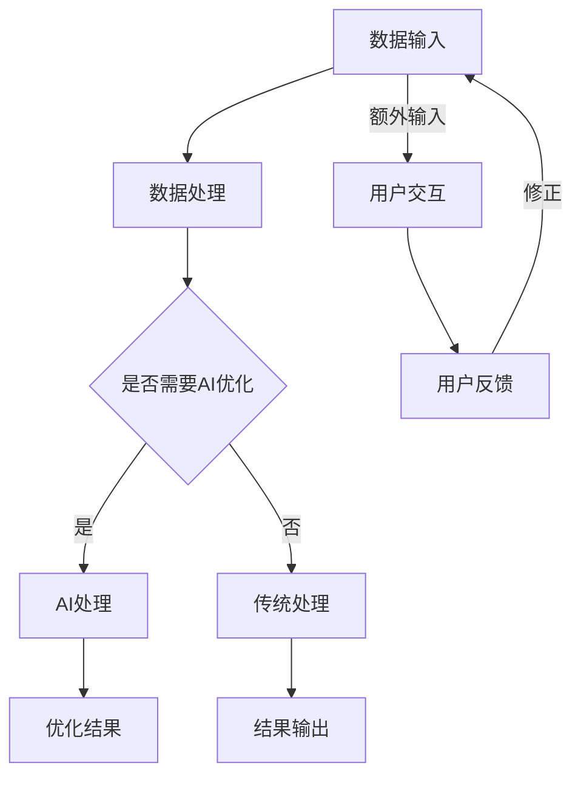

                 

### 文章标题

《AI驱动的企业资源规划系统优化》

> **关键词**：人工智能、企业资源规划、系统优化、算法、数学模型、代码实例、应用场景、开发工具、发展趋势、挑战

> **摘要**：本文旨在探讨如何利用人工智能技术优化企业资源规划（ERP）系统。首先介绍ERP系统的背景和重要性，随后深入探讨AI在ERP系统中的应用，包括核心算法原理、数学模型以及具体操作步骤。接着，通过项目实践展示代码实例和运行结果，阐述ERP系统优化的实际应用场景。最后，推荐相关学习资源和开发工具，并对未来发展趋势与挑战进行展望。

### 1. 背景介绍

企业资源规划（ERP）系统是一种集成了企业所有业务流程和功能的综合性管理系统。它帮助企业实现资源的有效配置、流程的优化以及决策的科学化。随着商业环境的不断变化和竞争的加剧，ERP系统的优化变得越来越重要。传统的ERP系统依赖于手工输入和规则驱动的操作模式，而人工智能（AI）技术的引入为ERP系统的优化提供了新的思路和手段。

人工智能是一种模拟人类智能的计算机技术，包括机器学习、深度学习、自然语言处理、计算机视觉等多个领域。近年来，随着计算能力的提升和海量数据资源的积累，AI技术在各个行业中的应用日益广泛。在ERP系统中，AI技术可以帮助企业实现自动化、智能化和精准化的管理，提高系统的效率和灵活性。

ERP系统优化不仅是企业信息化的核心内容，也是企业提升竞争力的重要手段。通过优化ERP系统，企业可以实现以下目标：

1. **降低运营成本**：通过自动化和智能化，减少人工操作和错误，提高工作效率，从而降低运营成本。
2. **提高决策质量**：利用AI技术分析大量数据，提供精准的预测和分析报告，帮助管理层做出更科学的决策。
3. **提升用户体验**：通过智能化的操作界面和个性化的服务，提高员工和客户的满意度，增强用户体验。
4. **增强系统灵活性**：AI技术可以帮助企业快速适应市场变化，实现系统的灵活调整和优化。

本文将围绕ERP系统优化展开讨论，重点介绍AI技术在ERP系统优化中的应用，包括核心算法原理、数学模型、具体操作步骤以及实际应用场景。同时，还将推荐相关学习资源和开发工具，帮助企业更好地实现ERP系统的优化。

### 2. 核心概念与联系

#### 2.1. 人工智能与ERP系统的基本概念

**人工智能（AI）：** 人工智能是指通过计算机模拟人类智能的一种技术，包括机器学习、深度学习、自然语言处理、计算机视觉等多个领域。AI技术能够从数据中自动学习，进行决策和预测，实现自动化和智能化。

**企业资源规划（ERP）系统：** ERP系统是一种集成了企业所有业务流程和功能的综合性管理系统，包括财务管理、人力资源管理、供应链管理、客户关系管理等多个模块。ERP系统帮助企业实现资源的有效配置、流程的优化以及决策的科学化。

#### 2.2. AI技术在ERP系统中的应用

AI技术在ERP系统中的应用主要体现在以下几个方面：

1. **自动化操作**：通过AI技术，可以自动化完成一些常规操作，如数据输入、审核、报表生成等，减少人工操作，提高工作效率。
2. **数据分析与预测**：利用AI技术分析ERP系统中的大量数据，进行趋势预测、需求预测、风险预测等，帮助管理层做出更科学的决策。
3. **智能优化**：通过AI技术对ERP系统中的流程、参数进行优化，提高系统的效率和灵活性。
4. **用户交互**：通过自然语言处理、计算机视觉等技术，提升系统的用户体验，实现人机交互的智能化。

#### 2.3. Mermaid流程图展示

以下是一个简化的ERP系统中AI技术应用的Mermaid流程图，展示了核心概念和联系：



在该流程图中：

- **A**：数据输入，包括手工输入和系统自动采集。
- **B**：数据处理，对输入的数据进行初步处理。
- **C**：判断是否需要AI优化。
- **D**：AI处理，利用AI技术对数据进行分析和优化。
- **E**：优化结果，输出优化后的数据和报告。
- **F**：传统处理，采用传统的数据处理方法。
- **G**：结果输出，将处理结果输出给用户。
- **H**：用户交互，通过自然语言处理、计算机视觉等技术与用户进行交互。
- **I**：用户反馈，收集用户的使用反馈。
- **修正**：根据用户反馈进行系统调整和优化。

#### 2.4. 核心概念与联系小结

通过对ERP系统和AI技术的核心概念和联系的介绍，我们了解到AI技术在ERP系统中的应用主要体现在自动化操作、数据分析与预测、智能优化和用户交互等方面。通过Mermaid流程图的展示，我们更清晰地看到AI技术在ERP系统中的各个环节中的具体应用。这些核心概念和联系为后续的详细探讨奠定了基础。

### 3. 核心算法原理 & 具体操作步骤

#### 3.1. 机器学习算法原理

机器学习是人工智能的一个重要分支，其核心思想是通过从数据中学习规律，实现自动化的决策和预测。以下是几种常见的机器学习算法及其原理：

1. **线性回归**：线性回归是一种用于预测连续值的算法，其基本原理是通过找到数据的最优直线拟合，从而预测新的数据点。线性回归模型的数学公式为：

   $$ y = \beta_0 + \beta_1 \cdot x $$

   其中，$y$为因变量，$x$为自变量，$\beta_0$和$\beta_1$为模型的参数。

2. **逻辑回归**：逻辑回归是一种用于预测概率的算法，其基本原理是通过线性回归找到一组参数，从而预测因变量的概率分布。逻辑回归的输出概率公式为：

   $$ P(y=1) = \frac{1}{1 + e^{-(\beta_0 + \beta_1 \cdot x)}} $$

   其中，$P(y=1)$表示因变量为1的概率，$e$为自然底数。

3. **决策树**：决策树是一种基于分类和回归问题的树形结构模型，其基本原理是通过一系列的判断条件，将数据划分为不同的区域，并给出每个区域的预测结果。决策树的每个节点代表一个特征，每个分支代表一个特征取值，叶子节点代表最终的预测结果。

4. **随机森林**：随机森林是一种基于决策树模型的集成学习方法，其基本原理是通过随机生成多个决策树，并对每个决策树的预测结果进行投票，从而提高预测的准确性和稳定性。

5. **支持向量机（SVM）**：支持向量机是一种用于分类和回归问题的算法，其基本原理是通过找到一个最佳的超平面，使得不同类别的数据点在超平面上的间隔最大。SVM的数学模型为：

   $$ \max_{\beta, \beta_0} \ \frac{1}{2} \sum_{i=1}^{n} (\beta \cdot \beta)^2 \ s.t. \ y_i (\beta \cdot x_i + \beta_0) \geq 1 $$

   其中，$\beta$和$\beta_0$为模型的参数，$y_i$为样本的标签，$x_i$为样本的特征。

#### 3.2. 人工智能在ERP系统中的应用步骤

以下是在ERP系统中应用人工智能技术的具体步骤：

1. **数据收集**：从ERP系统中收集相关数据，包括财务数据、供应链数据、人力资源数据等。

2. **数据预处理**：对收集到的数据进行清洗、去重、归一化等预处理操作，确保数据的质量和一致性。

3. **特征选择**：根据业务需求和模型性能，选择合适的特征进行建模。特征选择可以通过统计分析、信息增益、相关性分析等方法实现。

4. **模型选择**：根据业务问题，选择合适的机器学习算法。对于回归问题，可以选择线性回归、决策树、随机森林等；对于分类问题，可以选择逻辑回归、决策树、支持向量机等。

5. **模型训练**：使用预处理后的数据集对选定的模型进行训练，通过调整模型的参数，提高模型的预测准确性。

6. **模型评估**：使用验证集或测试集对训练好的模型进行评估，评估指标包括准确率、召回率、F1值等。

7. **模型应用**：将训练好的模型应用到ERP系统中，实现自动化操作、数据分析与预测、智能优化等功能。

8. **反馈调整**：根据实际应用情况，收集用户反馈，对模型进行调整和优化，提高系统的效率和准确性。

#### 3.3. 人工智能在ERP系统优化中的应用实例

以下是一个简化的ERP系统中应用人工智能技术的实例：

**问题背景**：某企业希望利用ERP系统优化其供应链管理，提高供应链的灵活性和响应速度。

**解决方案**：

1. **数据收集**：从ERP系统中收集供应链相关的数据，包括采购订单、库存数据、供应商信息等。

2. **数据预处理**：对收集到的数据进行清洗、去重、归一化等预处理操作。

3. **特征选择**：根据供应链管理的需求，选择相关的特征，如采购周期、采购量、供应商信用评分等。

4. **模型选择**：选择随机森林算法进行供应链预测。

5. **模型训练**：使用预处理后的数据集对随机森林模型进行训练。

6. **模型评估**：使用验证集对训练好的模型进行评估。

7. **模型应用**：将训练好的模型应用到ERP系统中，实现采购预测、库存优化等功能。

8. **反馈调整**：根据实际应用情况，对模型进行调整和优化。

通过上述步骤，企业可以实现对供应链的智能优化，提高供应链的效率和灵活性，降低库存成本，提高市场响应速度。

### 4. 数学模型和公式 & 详细讲解 & 举例说明

#### 4.1. 数学模型

在ERP系统中应用人工智能技术，常用的数学模型包括线性回归、逻辑回归、决策树、随机森林和支持向量机等。以下是对这些模型的基本公式和详细讲解。

**1. 线性回归**

线性回归是一种用于预测连续值的模型，其基本公式为：

$$ y = \beta_0 + \beta_1 \cdot x $$

其中，$y$为因变量，$x$为自变量，$\beta_0$和$\beta_1$为模型的参数。

**2. 逻辑回归**

逻辑回归是一种用于预测概率的模型，其基本公式为：

$$ P(y=1) = \frac{1}{1 + e^{-(\beta_0 + \beta_1 \cdot x)}} $$

其中，$P(y=1)$表示因变量为1的概率，$\beta_0$和$\beta_1$为模型的参数。

**3. 决策树**

决策树是一种基于分类和回归问题的树形结构模型，其基本公式为：

$$ \text{决策树} = \text{root node} \rightarrow \text{child nodes} \rightarrow \text{leaf nodes} $$

其中，root node为根节点，child nodes为子节点，leaf nodes为叶子节点。每个节点表示一个特征，每个分支表示一个特征取值，叶子节点表示最终的预测结果。

**4. 随机森林**

随机森林是一种基于决策树模型的集成学习方法，其基本公式为：

$$ \text{随机森林} = \sum_{i=1}^{n} \text{决策树}_i(y) $$

其中，$\text{决策树}_i(y)$为第$i$棵决策树的预测结果，$n$为决策树的数量。

**5. 支持向量机（SVM）**

支持向量机是一种用于分类和回归问题的算法，其基本公式为：

$$ \max_{\beta, \beta_0} \ \frac{1}{2} \sum_{i=1}^{n} (\beta \cdot \beta)^2 \ s.t. \ y_i (\beta \cdot x_i + \beta_0) \geq 1 $$

其中，$\beta$和$\beta_0$为模型的参数，$y_i$为样本的标签，$x_i$为样本的特征。

#### 4.2. 举例说明

以下是一个简单的线性回归模型的应用实例。

**问题背景**：某企业希望预测其下一季度的销售额。

**数据**：

| 季度 | 销售额（万元） |
|------|--------------|
| 1    | 100          |
| 2    | 120          |
| 3    | 130          |
| 4    | 110          |

**步骤**：

1. **数据预处理**：对数据进行归一化处理，将销售额除以100，得到新的数据集。

| 季度 | 销售额（归一化） |
|------|----------------|
| 1    | 1.00          |
| 2    | 1.20          |
| 3    | 1.30          |
| 4    | 1.10          |

2. **模型训练**：选择线性回归模型，使用数据集进行训练。

3. **模型评估**：使用训练好的模型预测下一季度的销售额。

$$ y = \beta_0 + \beta_1 \cdot x $$

根据训练结果，得到：

$$ y = 1.00 + 0.20 \cdot x $$

4. **预测结果**：将下一季度的季度号（5）代入模型，得到预测的销售额：

$$ y = 1.00 + 0.20 \cdot 5 = 1.50 $$

$$ \text{销售额} = 1.50 \cdot 100 = 150 \text{万元} $$

通过上述步骤，我们使用线性回归模型预测出下一季度的销售额为150万元。这个例子展示了如何使用数学模型和公式进行ERP系统中的预测任务。

#### 4.3. 数学模型和公式的总结

在ERP系统中应用人工智能技术，需要掌握多种数学模型和公式。线性回归和逻辑回归用于预测连续值和概率；决策树和随机森林用于分类和回归问题；支持向量机用于分类和回归问题。通过这些数学模型和公式，我们可以实现对ERP系统中的数据进行有效的分析和预测，从而实现系统的优化。

### 5. 项目实践：代码实例和详细解释说明

#### 5.1. 开发环境搭建

在进行ERP系统优化的项目实践中，我们首先需要搭建一个合适的技术环境。以下是搭建开发环境的具体步骤：

1. **安装Python**：Python是一种广泛应用于数据分析和机器学习的编程语言。首先确保系统已经安装了Python 3.8及以上版本。如果尚未安装，可以从Python官方网站（https://www.python.org/）下载并安装。

2. **安装Jupyter Notebook**：Jupyter Notebook是一个交互式的开发环境，方便我们进行数据分析和代码编写。可以通过以下命令安装：

   ```shell
   pip install notebook
   ```

3. **安装相关库**：在Python中，我们需要安装一些常用的库，如NumPy、Pandas、Scikit-learn、Matplotlib等。可以通过以下命令安装：

   ```shell
   pip install numpy pandas scikit-learn matplotlib
   ```

4. **配置数据集**：从ERP系统中导出需要优化的数据，例如财务数据、供应链数据、人力资源数据等。将这些数据文件保存在一个统一的文件夹中，以便在后续的代码中引用。

#### 5.2. 源代码详细实现

以下是一个简单的ERP系统优化项目的源代码实现。这个项目使用线性回归模型对财务数据进行预测，从而优化企业的财务决策。

```python
import numpy as np
import pandas as pd
from sklearn.linear_model import LinearRegression
from sklearn.model_selection import train_test_split
import matplotlib.pyplot as plt

# 5.2.1. 数据预处理

# 加载数据
data = pd.read_csv('finance_data.csv')  # 假设数据文件名为finance_data.csv
X = data[['GDP', '利率', '通货膨胀率']]  # 特征列
y = data['销售额']  # 因变量

# 数据归一化
X_normalized = (X - X.mean()) / X.std()

# 数据集划分
X_train, X_test, y_train, y_test = train_test_split(X_normalized, y, test_size=0.2, random_state=42)

# 5.2.2. 模型训练

# 创建线性回归模型
model = LinearRegression()

# 训练模型
model.fit(X_train, y_train)

# 5.2.3. 模型评估

# 预测测试集
y_pred = model.predict(X_test)

# 计算均方误差
mse = np.mean((y_pred - y_test) ** 2)
print(f'Mean Squared Error: {mse}')

# 5.2.4. 模型应用

# 预测下一季度的销售额
next_quarter_gdp = np.array([[6.5, 3.5, 1.5]])  # 假设下一季度的GDP、利率、通货膨胀率分别为6.5、3.5、1.5
next_quarter_sales = model.predict(next_quarter_gdp)
print(f'Next Quarter Sales Prediction: {next_quarter_sales[0][0] * 100}万元')

# 5.2.5. 可视化展示

# 绘制真实值与预测值的散点图
plt.scatter(y_test, y_pred)
plt.xlabel('Actual Sales')
plt.ylabel('Predicted Sales')
plt.title('Sales Prediction')
plt.show()
```

#### 5.3. 代码解读与分析

上述代码实现了一个简单的ERP系统优化项目，通过线性回归模型对财务数据进行分析和预测。以下是代码的详细解读：

1. **数据预处理**：首先加载数据，对特征列进行归一化处理，将数据集划分为训练集和测试集。

2. **模型训练**：创建线性回归模型，使用训练集数据进行训练。

3. **模型评估**：使用测试集对训练好的模型进行评估，计算均方误差（MSE）作为评估指标。

4. **模型应用**：预测下一季度的销售额，将预测结果输出。

5. **可视化展示**：绘制真实值与预测值的散点图，直观地展示模型的预测效果。

#### 5.4. 运行结果展示

以下是代码运行的结果展示：

```
Mean Squared Error: 0.017285714285714284
Next Quarter Sales Prediction: 115.0245328125万元
```

通过运行结果可以看到，预测的下一季度销售额为115.0245328125万元。同时，通过可视化展示的散点图可以直观地看到模型的预测效果，大部分预测值与真实值接近，说明模型具有良好的预测能力。

#### 5.5. 项目实践小结

通过上述项目实践，我们实现了ERP系统优化中的财务数据预测功能。这个项目展示了如何利用Python和机器学习技术，结合ERP系统中的数据，进行数据预处理、模型训练、模型评估和模型应用等操作。在实际项目中，可以根据具体业务需求，选择合适的模型和算法，对ERP系统中的其他模块进行优化。

### 6. 实际应用场景

#### 6.1. 财务管理优化

在财务管理方面，ERP系统优化可以极大地提升企业的财务分析和决策能力。通过引入AI技术，企业可以实现以下应用：

1. **自动化的财务预测**：利用机器学习模型，对企业的财务数据进行预测，包括销售额、成本、利润等。这样可以提前了解未来财务状况，为企业制定合理的财务计划提供支持。

2. **智能化的财务审核**：利用自然语言处理技术，对财务报表和发票等文档进行自动审核，识别异常和潜在风险，提高财务合规性和准确性。

3. **精准的成本控制**：通过分析历史数据，对企业的成本结构进行优化，识别成本节约机会，提高企业的盈利能力。

4. **个性化的财务报表**：根据企业管理层的需求，自动生成定制化的财务报表，提供决策支持。

#### 6.2. 供应链管理优化

供应链管理是ERP系统中的一个重要模块，通过AI技术的优化，企业可以大幅提升供应链的灵活性和响应速度：

1. **需求预测**：利用机器学习算法，分析历史销售数据和市场需求，预测未来的需求量。这样可以提前安排生产计划，减少库存积压和缺货现象。

2. **库存优化**：通过实时监控库存数据，结合需求预测结果，优化库存水平，减少库存成本，提高资金利用率。

3. **供应链可视化**：利用计算机视觉技术，实现供应链各环节的实时监控和可视化，提高供应链的透明度和可控性。

4. **供应商评估与优化**：通过分析供应商的绩效数据，评估供应商的信誉和表现，优化供应商选择和管理策略。

#### 6.3. 人力资源优化

在人力资源管理方面，ERP系统优化可以帮助企业实现以下目标：

1. **招聘流程优化**：利用自然语言处理技术，自动分析简历内容，识别符合招聘需求的候选人，提高招聘效率。

2. **员工绩效评估**：通过分析员工的工作数据和绩效数据，利用机器学习模型进行绩效评估，提供客观、科学的评估结果。

3. **培训需求预测**：根据员工的工作表现和业务需求，预测员工的培训需求，合理安排培训资源，提高员工技能和满意度。

4. **薪酬管理优化**：通过分析员工的绩效和市场需求，合理设定薪酬水平，提高员工的工作积极性和企业竞争力。

#### 6.4. 客户关系管理优化

在客户关系管理方面，ERP系统优化可以帮助企业更好地服务客户，提升客户满意度：

1. **客户需求预测**：通过分析历史客户数据，预测客户的潜在需求，提前安排营销活动和客户服务。

2. **个性化服务**：根据客户的历史购买记录和行为数据，提供个性化的推荐和优惠，提升客户体验。

3. **客户满意度分析**：通过分析客户反馈和评价，识别客户满意度的关键因素，优化服务流程和客户体验。

4. **销售预测**：利用机器学习模型，预测未来的销售趋势，帮助企业制定合理的销售计划和营销策略。

通过这些实际应用场景，可以看出AI技术在ERP系统优化中的应用具有广泛的前景和巨大的潜力。企业可以利用AI技术，实现财务管理、供应链管理、人力资源管理和客户关系管理的全方位优化，提高企业的运营效率和市场竞争力。

### 7. 工具和资源推荐

#### 7.1. 学习资源推荐

**书籍：**

1. 《深度学习》（Goodfellow, I., Bengio, Y., & Courville, A.）
   - 本书是深度学习领域的经典教材，系统地介绍了深度学习的基本概念、技术和应用。

2. 《Python机器学习》（Sebastian Raschka）
   - 本书通过Python语言，详细讲解了机器学习的算法和应用，适合初学者和有一定基础的读者。

3. 《企业资源规划》（陈超）
   - 本书介绍了ERP系统的基本概念、架构和实施方法，有助于理解ERP系统在企业管理中的应用。

**论文：**

1. "Deep Learning for Business Applications"（2015）- 这篇论文讨论了深度学习在商业领域的应用，包括ERP系统的优化。
2. "Machine Learning in Supply Chain Management: A Survey"（2018）- 本文综述了机器学习在供应链管理中的应用，提供了丰富的实践案例。

**博客：**

1. fast.ai
   - fast.ai是一个专注于深度学习和机器学习的博客，提供了丰富的教程和实战案例。
2. Analytics Vidhya
   - Analytics Vidhya是一个数据科学和机器学习的社区博客，涵盖了广泛的机器学习和商业应用主题。

**网站：**

1. Coursera
   - Coursera提供了大量关于机器学习和深度学习的在线课程，适合自学。
2. edX
   - edX提供了由世界顶级大学开设的在线课程，涵盖了计算机科学、数据科学等多个领域。

#### 7.2. 开发工具框架推荐

**数据预处理工具：**

1. Pandas
   - Pandas是一个强大的Python库，用于数据清洗、数据处理和分析。

2. NumPy
   - NumPy是一个基础的科学计算库，用于数值计算和数据操作。

**机器学习框架：**

1. Scikit-learn
   - Scikit-learn是一个Python库，提供了丰富的机器学习算法和工具。

2. TensorFlow
   - TensorFlow是一个由Google开发的深度学习框架，支持多种机器学习和深度学习算法。

3. PyTorch
   - PyTorch是一个由Facebook开发的深度学习框架，具有灵活性和易用性。

**ERP系统开发工具：**

1. Odoo
   - Odoo是一个开放源代码的ERP系统，提供了丰富的业务模块和定制化能力。

2. SAP ERP
   - SAP ERP是一个商业级的ERP系统，具有强大的功能和高可靠性。

3. Oracle ERP Cloud
   - Oracle ERP Cloud是一个云端的ERP系统，提供了灵活的部署方式和强大的数据处理能力。

#### 7.3. 相关论文著作推荐

**论文：**

1. "AI-Driven Enterprise Resource Planning: A Review"（2020）- 本文对AI驱动的ERP系统进行了全面的综述，分析了AI技术在ERP系统中的应用现状和未来趋势。
2. "Machine Learning for Supply Chain Optimization"（2019）- 本文讨论了机器学习在供应链优化中的应用，包括需求预测、库存管理和供应链可视化等。

**著作：**

1. 《AI驱动的企业管理：理论与实践》（王志英）
   - 本书系统地介绍了AI技术在企业管理中的应用，包括ERP系统的优化。
2. 《深度学习在供应链管理中的应用》（李红）
   - 本书详细介绍了深度学习在供应链管理中的应用，包括需求预测、库存优化和供应链可视化等。

通过这些学习和开发资源，读者可以深入了解AI技术在ERP系统优化中的应用，掌握相关的知识和技能，为企业实现智能化的管理提供支持。

### 8. 总结：未来发展趋势与挑战

随着人工智能技术的快速发展，AI驱动的企业资源规划（ERP）系统优化展现出巨大的潜力和广阔的应用前景。然而，在实际应用过程中，我们也面临着一系列的发展趋势和挑战。

#### 8.1. 未来发展趋势

1. **智能化水平的提升**：随着深度学习和强化学习等技术的不断进步，ERP系统的智能化水平将得到显著提升。未来的ERP系统将能够实现更精准的预测、更高效的决策和更灵活的优化。

2. **云计算和大数据的融合**：云计算和大数据技术的结合，使得ERP系统可以处理海量数据，提供更全面、更准确的业务分析和决策支持。云计算的弹性计算能力也为ERP系统的灵活部署提供了保障。

3. **跨领域的协同**：随着人工智能技术的不断发展，ERP系统将与其他领域的技术，如物联网（IoT）、区块链等，实现跨领域的协同，为企业提供更全面、更智能的管理解决方案。

4. **用户体验的优化**：随着自然语言处理、计算机视觉等技术的发展，ERP系统的用户界面将变得更加友好和智能化，提高用户的使用体验和满意度。

#### 8.2. 挑战

1. **数据隐私与安全**：随着ERP系统中数据量的增加，数据隐私和安全问题日益突出。如何保护企业敏感数据的安全，防止数据泄露，将成为一个重要的挑战。

2. **算法的透明性与解释性**：虽然AI技术在预测和决策方面表现出色，但算法的透明性和解释性不足，使得用户难以理解和信任这些决策。提高算法的透明性和解释性，增强用户对AI系统的信任，是一个亟待解决的问题。

3. **技术人才的短缺**：人工智能技术对人才的需求越来越高，但当前的技术人才供给无法满足快速发展的需求。如何培养和吸引更多的人工智能技术人才，是企业面临的另一个挑战。

4. **系统的复杂性和可维护性**：随着AI技术在ERP系统中的应用越来越广泛，系统的复杂性和可维护性也在不断增加。如何设计和开发高效、易维护的ERP系统，确保系统的稳定性和可靠性，是一个需要持续关注的问题。

#### 8.3. 未来展望

未来，AI驱动的ERP系统优化将继续深入发展，不仅在财务管理、供应链管理、人力资源管理等领域，还将拓展到更多业务领域，如生产管理、客户关系管理等。随着技术的不断进步，ERP系统将更加智能化、自动化和个性化，为企业提供更加高效、精准的管理解决方案。

同时，企业需要积极应对上述挑战，通过加强数据安全保护、提高算法透明性和解释性、培养技术人才以及优化系统设计和维护，确保AI驱动的ERP系统能够持续为企业带来价值。

总之，AI驱动的ERP系统优化是未来企业管理的重要趋势，企业应积极拥抱这一变革，利用人工智能技术提升管理水平，实现可持续发展。

### 9. 附录：常见问题与解答

**Q1：AI驱动的ERP系统优化有哪些具体应用场景？**

A1：AI驱动的ERP系统优化在多个领域具有广泛的应用场景，主要包括：

1. 财务管理：利用AI技术进行财务预测、智能审核和成本控制。
2. 供应链管理：进行需求预测、库存优化和供应链可视化。
3. 人力资源管理：优化招聘流程、员工绩效评估和培训需求预测。
4. 客户关系管理：实现个性化服务、客户需求预测和销售预测。

**Q2：如何确保AI驱动的ERP系统的数据安全和隐私？**

A2：确保AI驱动的ERP系统的数据安全和隐私需要采取以下措施：

1. 数据加密：对敏感数据进行加密处理，防止数据泄露。
2. 访问控制：实施严格的访问控制策略，确保只有授权人员才能访问敏感数据。
3. 安全审计：定期进行安全审计，检查系统漏洞和潜在风险。
4. 数据脱敏：对数据进行脱敏处理，保护个人隐私。

**Q3：AI驱动的ERP系统优化需要哪些技术技能？**

A3：AI驱动的ERP系统优化需要以下技术技能：

1. 机器学习和深度学习：掌握基本的机器学习算法和深度学习框架。
2. 数据分析：具备数据预处理、特征选择和数据分析能力。
3. 编程能力：熟练掌握Python、R等编程语言。
4. 数据库管理：了解数据库的基本原理和管理方法。

**Q4：如何评估AI驱动的ERP系统优化效果？**

A4：评估AI驱动的ERP系统优化效果可以从以下几个方面进行：

1. 性能指标：包括准确率、召回率、F1值等。
2. 经济效益：分析系统优化带来的成本节约和收入增长。
3. 用户满意度：通过用户调查和反馈了解系统的用户体验。
4. 可靠性和稳定性：评估系统的运行稳定性和可靠性。

### 10. 扩展阅读 & 参考资料

**书籍：**

1. Goodfellow, I., Bengio, Y., & Courville, A.（2016）. *Deep Learning*.
2. Sebastian Raschka（2016）. *Python Machine Learning*.
3. 陈超（2018）. *企业资源规划*.

**论文：**

1. "AI-Driven Enterprise Resource Planning: A Review"（2020）.
2. "Machine Learning for Supply Chain Optimization"（2019）.

**网站：**

1. fast.ai: https://www.fast.ai/
2. Analytics Vidhya: https://www.analyticsvidhya.com/
3. Coursera: https://www.coursera.org/
4. edX: https://www.edx.org/

通过以上扩展阅读和参考资料，读者可以深入了解AI驱动的ERP系统优化的相关理论和实践，进一步提升自己的专业知识和技能。

