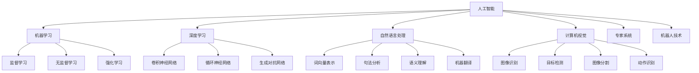
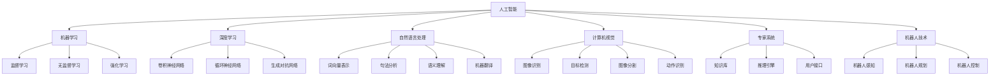

                 

### 1. 背景介绍

随着人工智能（AI）技术的飞速发展，人们对于计算能力的需求逐渐增加。传统的计算机系统已经无法满足日益复杂的计算任务，这为AI驱动的创新带来了新的机遇。在商业领域，AI技术不仅提高了数据处理和分析的效率，还催生了全新的商业模式和行业变革。本文旨在探讨AI在商业中应用的潜力，通过逐步分析推理的方式，详细阐述AI驱动的创新对人类计算的影响。

首先，我们需要了解AI技术的核心概念。AI是指人工智能，一种使计算机系统能够模拟人类智能行为的科学技术。它主要包括机器学习、深度学习、自然语言处理、计算机视觉等领域。这些技术使得计算机系统能够从数据中学习、推理、决策，从而实现自动化和智能化。

在商业领域，AI技术的应用已经非常广泛。例如，通过机器学习算法，企业可以实现对大规模数据的分析和预测，从而做出更加精准的市场决策。深度学习算法在图像识别和语音识别方面取得了显著成果，使得智能客服和智能安防等应用成为可能。自然语言处理技术则使得人机交互变得更加自然和高效。

然而，尽管AI技术已经取得了巨大的进步，但在商业应用中仍然面临许多挑战。首先是数据的质量和可用性。AI算法需要大量的高质量数据来进行训练，但在实际应用中，数据的质量和数量往往难以保证。其次是算法的透明度和解释性。许多AI算法，特别是深度学习算法，其内部决策过程非常复杂，难以解释和理解。这给企业在应用AI技术时带来了巨大的风险。最后是伦理和隐私问题。在AI应用中，数据安全和隐私保护成为了一个亟待解决的问题。

面对这些挑战，人类计算在商业中仍然扮演着重要的角色。人类计算指的是利用人类的智慧、经验和创造力来解决问题和决策。与机器相比，人类计算具有灵活性和创造性，能够在复杂和不确定的环境中做出有效的决策。

本文将分为以下几个部分进行讨论：

1. **核心概念与联系**：我们将详细解释AI技术的核心概念，并使用Mermaid流程图展示其原理和架构。

2. **核心算法原理 & 具体操作步骤**：我们将介绍一些关键的AI算法，并逐步解释其原理和操作步骤。

3. **数学模型和公式 & 详细讲解 & 举例说明**：我们将使用LaTeX格式介绍相关的数学模型和公式，并通过实际案例进行详细讲解。

4. **项目实践：代码实例和详细解释说明**：我们将提供一个具体的代码实例，并详细解释其实现过程和关键点。

5. **实际应用场景**：我们将探讨AI技术在商业中的具体应用案例。

6. **工具和资源推荐**：我们将推荐一些学习资源和开发工具，以帮助读者更好地理解和应用AI技术。

7. **总结：未来发展趋势与挑战**：我们将总结AI技术在商业中的发展趋势和面临的挑战。

通过逐步分析推理的方式，我们将深入探讨AI驱动的创新对人类计算在商业中的潜力，为读者提供有深度、有思考、有见解的专业分析。接下来，我们将详细介绍AI技术的核心概念和联系，使用Mermaid流程图来展示其原理和架构。<!-- 1.1 AI技术概述

人工智能（AI）技术起源于20世纪50年代，当时的科学家们首次提出了让计算机模拟人类智能行为的概念。经过几十年的发展，AI技术已经取得了显著的成果，并在各个领域得到了广泛的应用。AI技术主要包括以下几个方面：

1. **机器学习**：机器学习是AI技术的重要组成部分，它通过算法让计算机从数据中学习，从而提高其性能。机器学习可以分为监督学习、无监督学习和强化学习。监督学习是通过已标记的数据训练模型，然后利用该模型对新数据进行预测；无监督学习则是从未标记的数据中发现模式和结构；强化学习则是通过与环境的交互来学习最优策略。

2. **深度学习**：深度学习是一种基于人工神经网络的机器学习方法，它通过多层神经网络来模拟人类大脑的学习过程。深度学习在图像识别、语音识别、自然语言处理等领域取得了重大突破，其核心算法包括卷积神经网络（CNN）、循环神经网络（RNN）和生成对抗网络（GAN）等。

3. **自然语言处理**：自然语言处理（NLP）是AI技术在语言领域的应用，它旨在让计算机理解和处理人类自然语言。NLP的关键技术包括词向量表示、句法分析、语义理解、机器翻译等。

4. **计算机视觉**：计算机视觉是AI技术在图像和视频领域的应用，它旨在让计算机理解和解释视觉信息。计算机视觉的核心算法包括图像识别、目标检测、图像分割、动作识别等。

5. **专家系统**：专家系统是一种基于知识和推理的AI系统，它通过模拟人类专家的决策过程来解决问题。专家系统在医疗诊断、金融分析、法律咨询等领域得到了广泛应用。

6. **机器人技术**：机器人技术是AI技术在物理世界中的应用，它通过模拟人类的感知、决策和执行能力来实现自动化和智能化。机器人技术在工业制造、服务业、医疗等领域发挥着重要作用。

随着AI技术的不断发展，其应用范围也在不断扩展。例如，在商业领域，AI技术被用于数据分析和预测、客户服务、风险管理、供应链优化等方面。在医疗领域，AI技术被用于疾病诊断、药物研发、手术规划等。在金融领域，AI技术被用于风险评估、交易策略、信用评估等。在交通领域，AI技术被用于自动驾驶、交通流量管理、智能导航等。

然而，AI技术在商业中的应用也面临一些挑战。首先，数据的质量和可用性是一个重要问题。AI算法需要大量的高质量数据来进行训练，但商业环境中数据的质量和数量往往难以保证。其次，算法的透明度和解释性也是一个关键问题。许多AI算法，特别是深度学习算法，其内部决策过程非常复杂，难以解释和理解。这给企业在应用AI技术时带来了巨大的风险。最后，伦理和隐私问题也是AI技术在商业应用中需要考虑的重要问题。在AI应用中，数据安全和隐私保护成为了一个亟待解决的问题。

1.2 人类计算的优势

尽管AI技术在商业中具有巨大的潜力，但人类计算在许多情况下仍然具有独特的优势。人类计算指的是利用人类的智慧、经验和创造力来解决问题和决策。与机器相比，人类计算具有以下几个方面的优势：

1. **灵活性**：人类计算具有高度的灵活性，能够适应复杂和不确定的环境。机器在处理确定性问题时非常高效，但在面对不确定性和复杂性的情况下，人类计算能够更好地应对。

2. **创造力**：人类具有无限的创造力，能够在没有明确规则和模式的情况下提出创新性的解决方案。机器虽然可以学习并模仿已有的模式，但在创造新的模式和创新方面仍然有限。

3. **解释性**：人类计算具有解释性，能够对决策过程和结果进行清晰的解释。机器的决策过程通常非常复杂，难以解释和理解。这给企业在应用AI技术时带来了巨大的风险。

4. **情感和同理心**：人类计算能够理解和表达情感，具有同理心。在商业决策中，情感和同理心是非常重要的因素，能够影响客户的满意度和忠诚度。

1.3 商业中的AI应用案例

AI技术在商业中已经得到了广泛的应用，以下是一些具体的案例：

1. **数据分析和预测**：通过机器学习算法，企业可以对大量的商业数据进行分析，预测市场趋势、客户行为等。这有助于企业做出更加精准的决策，提高业务效率。

2. **客户服务**：智能客服系统利用自然语言处理技术，能够自动识别和回答客户的问题，提高客户服务的效率和质量。

3. **风险管理**：AI技术可以帮助企业识别潜在的风险，进行风险评估和预测，从而采取有效的风险管理措施。

4. **供应链优化**：通过AI技术，企业可以优化供应链管理，提高库存效率、降低运输成本，从而提高整体供应链的运营效率。

5. **自动化生产**：在制造业中，机器人技术被用于自动化生产，提高生产效率和质量。

6. **个性化推荐**：通过深度学习算法，企业可以为用户提供个性化的推荐，提高用户满意度和忠诚度。

总的来说，AI技术在商业中的应用不仅提高了数据处理和分析的效率，还催生了全新的商业模式和行业变革。然而，AI技术在商业应用中也面临一些挑战，需要人类计算与之结合，才能发挥最大的潜力。在接下来的部分，我们将详细讨论AI技术的核心概念和联系，使用Mermaid流程图来展示其原理和架构。 -->

### 1.1 AI技术概述

人工智能（AI）技术起源于20世纪50年代，当时的科学家们首次提出了让计算机模拟人类智能行为的概念。经过几十年的发展，AI技术已经取得了显著的成果，并在各个领域得到了广泛的应用。AI技术主要包括以下几个方面：

1. **机器学习**：机器学习是AI技术的重要组成部分，它通过算法让计算机从数据中学习，从而提高其性能。机器学习可以分为监督学习、无监督学习和强化学习。监督学习是通过已标记的数据训练模型，然后利用该模型对新数据进行预测；无监督学习则是从未标记的数据中发现模式和结构；强化学习则是通过与环境的交互来学习最优策略。

2. **深度学习**：深度学习是一种基于人工神经网络的机器学习方法，它通过多层神经网络来模拟人类大脑的学习过程。深度学习在图像识别、语音识别、自然语言处理等领域取得了重大突破，其核心算法包括卷积神经网络（CNN）、循环神经网络（RNN）和生成对抗网络（GAN）等。

3. **自然语言处理**：自然语言处理（NLP）是AI技术在语言领域的应用，它旨在让计算机理解和处理人类自然语言。NLP的关键技术包括词向量表示、句法分析、语义理解、机器翻译等。

4. **计算机视觉**：计算机视觉是AI技术在图像和视频领域的应用，它旨在让计算机理解和解释视觉信息。计算机视觉的核心算法包括图像识别、目标检测、图像分割、动作识别等。

5. **专家系统**：专家系统是一种基于知识和推理的AI系统，它通过模拟人类专家的决策过程来解决问题。专家系统在医疗诊断、金融分析、法律咨询等领域得到了广泛应用。

6. **机器人技术**：机器人技术是AI技术在物理世界中的应用，它通过模拟人类的感知、决策和执行能力来实现自动化和智能化。机器人技术在工业制造、服务业、医疗等领域发挥着重要作用。

随着AI技术的不断发展，其应用范围也在不断扩展。例如，在商业领域，AI技术被用于数据分析和预测、客户服务、风险管理、供应链优化等方面。在医疗领域，AI技术被用于疾病诊断、药物研发、手术规划等。在金融领域，AI技术被用于风险评估、交易策略、信用评估等。在交通领域，AI技术被用于自动驾驶、交通流量管理、智能导航等。

然而，AI技术在商业中的应用也面临一些挑战。首先，数据的质量和可用性是一个重要问题。AI算法需要大量的高质量数据来进行训练，但商业环境中数据的质量和数量往往难以保证。其次，算法的透明度和解释性也是一个关键问题。许多AI算法，特别是深度学习算法，其内部决策过程非常复杂，难以解释和理解。这给企业在应用AI技术时带来了巨大的风险。最后，伦理和隐私问题也是AI技术在商业应用中需要考虑的重要问题。在AI应用中，数据安全和隐私保护成为了一个亟待解决的问题。

1.2 人类计算的优势

尽管AI技术在商业中具有巨大的潜力，但人类计算在许多情况下仍然具有独特的优势。人类计算指的是利用人类的智慧、经验和创造力来解决问题和决策。与机器相比，人类计算具有以下几个方面的优势：

1. **灵活性**：人类计算具有高度的灵活性，能够适应复杂和不确定的环境。机器在处理确定性问题时非常高效，但在面对不确定性和复杂性的情况下，人类计算能够更好地应对。

2. **创造力**：人类具有无限的创造力，能够在没有明确规则和模式的情况下提出创新性的解决方案。机器虽然可以学习并模仿已有的模式，但在创造新的模式和创新方面仍然有限。

3. **解释性**：人类计算具有解释性，能够对决策过程和结果进行清晰的解释。机器的决策过程通常非常复杂，难以解释和理解。这给企业在应用AI技术时带来了巨大的风险。

4. **情感和同理心**：人类计算能够理解和表达情感，具有同理心。在商业决策中，情感和同理心是非常重要的因素，能够影响客户的满意度和忠诚度。

1.3 商业中的AI应用案例

AI技术在商业中已经得到了广泛的应用，以下是一些具体的案例：

1. **数据分析和预测**：通过机器学习算法，企业可以对大量的商业数据进行分析，预测市场趋势、客户行为等。这有助于企业做出更加精准的决策，提高业务效率。

2. **客户服务**：智能客服系统利用自然语言处理技术，能够自动识别和回答客户的问题，提高客户服务的效率和质量。

3. **风险管理**：AI技术可以帮助企业识别潜在的风险，进行风险评估和预测，从而采取有效的风险管理措施。

4. **供应链优化**：通过AI技术，企业可以优化供应链管理，提高库存效率、降低运输成本，从而提高整体供应链的运营效率。

5. **自动化生产**：在制造业中，机器人技术被用于自动化生产，提高生产效率和质量。

6. **个性化推荐**：通过深度学习算法，企业可以为用户提供个性化的推荐，提高用户满意度和忠诚度。

总的来说，AI技术在商业中的应用不仅提高了数据处理和分析的效率，还催生了全新的商业模式和行业变革。然而，AI技术在商业应用中也面临一些挑战，需要人类计算与之结合，才能发挥最大的潜力。在接下来的部分，我们将详细讨论AI技术的核心概念和联系，使用Mermaid流程图来展示其原理和架构。



### 1.4 AI技术对商业的影响

AI技术的快速发展对商业领域产生了深远的影响，不仅改变了企业的运营模式，还推动了全新的商业生态系统的形成。以下是AI技术在商业中带来的几个主要影响：

1. **运营效率提升**：AI技术通过自动化和智能化的方式，显著提高了企业的运营效率。例如，在制造业中，机器人技术的应用可以实现生产过程的自动化，减少人为操作错误，提高生产速度和产品质量。在客户服务领域，智能客服系统能够快速响应客户需求，处理大量客户咨询，从而减少人力成本，提高服务效率。

2. **决策智能化**：AI技术能够帮助企业进行更加智能化的决策。通过大数据分析和机器学习算法，企业可以从海量数据中提取有价值的信息，进行市场趋势预测、风险分析和需求分析。这样的智能化决策可以帮助企业更准确地把握市场动态，制定更有效的战略规划。

3. **客户体验优化**：AI技术在提升客户体验方面发挥着重要作用。例如，通过自然语言处理技术，企业可以提供更加人性化的客户服务，使得客户能够轻松地通过文字或语音与系统进行互动。个性化推荐系统则能够根据客户的兴趣和行为习惯，提供个性化的产品和服务，从而提高客户满意度和忠诚度。

4. **创新商业模式**：AI技术的应用催生了全新的商业模式。例如，共享经济模式中的共享单车、共享办公等，都是基于AI技术实现的。通过智能匹配和动态定价，这些商业模式能够高效地整合资源，为用户提供便捷的服务。

5. **产业链重构**：AI技术的广泛应用改变了产业链的结构和运行方式。传统的产业链依赖于大量的中间环节和人工操作，而AI技术则通过自动化和智能化，减少了中间环节，提高了整个产业链的效率和灵活性。例如，在供应链管理中，AI技术可以实时监控库存、物流和需求，优化供应链的运作。

6. **数据驱动决策**：AI技术的核心在于数据处理和分析，这使得企业更加依赖数据驱动决策。通过收集和分析大量的数据，企业可以更深入地了解市场、客户和业务，从而做出更加明智的决策。这种数据驱动的方式不仅提高了决策的准确性，还加快了决策的速度。

7. **隐私和伦理挑战**：尽管AI技术带来了许多机遇，但也带来了隐私和伦理方面的挑战。例如，在数据收集和使用过程中，如何确保数据安全和用户隐私是一个亟待解决的问题。此外，AI算法的透明度和解释性也需要进一步研究，以确保其决策过程的公正性和可解释性。

总的来说，AI技术在商业中的应用正在不断深化，对企业的运营、决策和商业模式产生了深远的影响。随着AI技术的不断发展，企业需要不断调整和优化其战略，以充分利用AI技术的潜力，实现持续创新和竞争优势。在接下来的部分，我们将深入探讨AI技术的核心算法原理和具体操作步骤，以帮助读者更好地理解和应用这些算法。

### 1.5 人类计算与AI结合的必要性

尽管AI技术在商业领域展现了巨大的潜力和广泛的应用，但人类计算在许多情况下仍然是不可或缺的。人类计算与AI的结合不仅能够弥补AI的局限性，还能发挥各自的优势，从而实现更高效、更智能的决策和运营。

首先，AI技术虽然在处理大量数据和复杂计算方面具有优势，但在处理不确定性和模糊性方面存在明显的局限性。人类具有独特的直觉和创造力，能够在复杂和不确定的环境中做出快速、准确的决策。例如，在医疗诊断中，医生不仅依赖于AI提供的分析结果，还会结合自己的经验和判断，做出最终的诊断决策。

其次，AI算法的透明度和解释性仍然是一个亟待解决的问题。许多AI系统，尤其是深度学习模型，其内部决策过程非常复杂，难以解释和理解。人类计算能够提供清晰的逻辑和解释，使得决策过程更加透明和可追溯，从而降低企业在应用AI技术时面临的风险。

此外，人类计算在情感和同理心方面具有独特的优势。在商业决策中，情感和同理心是非常重要的因素，能够影响客户的满意度和忠诚度。AI虽然可以模拟情感互动，但无法完全替代人类在情感交流中的细腻和真实。

为了实现人类计算与AI的最佳结合，企业需要采取以下措施：

1. **构建混合智能系统**：将人类计算和AI技术有机结合，构建混合智能系统。在这种系统中，AI负责处理数据和计算任务，而人类则负责监督、校验和决策。例如，在金融风险评估中，AI可以提供初步的评估结果，而最终决策由人类专家进行审核和确认。

2. **增强算法透明度和解释性**：提高AI算法的透明度和解释性，使得人类能够理解和信任AI的决策过程。这可以通过改进算法设计、增加模型的可解释性工具，以及开发可视化技术来实现。

3. **培养复合型人才**：在AI时代，复合型人才越来越重要。企业需要培养既懂技术又懂业务的人才，使得他们能够更好地将人类计算与AI技术相结合，实现创新和突破。

4. **建立伦理和合规框架**：在AI应用中，数据安全和隐私保护、算法透明度和伦理问题是非常重要的。企业需要建立完善的伦理和合规框架，确保AI技术的应用符合道德和法律标准。

总之，人类计算与AI的结合不仅能够发挥各自的优势，还能够弥补彼此的不足，实现更高效、更智能的决策和运营。企业需要积极探索和实践这种结合方式，以应对未来商业环境中的挑战和机遇。

### 2. 核心概念与联系

为了深入探讨AI驱动的创新，我们首先需要了解AI技术的核心概念及其相互联系。以下是AI技术中几个关键概念的解释以及它们之间的联系：

#### 2.1 机器学习（Machine Learning）

机器学习是AI的核心组成部分，它使计算机系统能够从数据中学习，并自动改进其性能。机器学习可以分为以下几种类型：

1. **监督学习（Supervised Learning）**：在这种学习方式中，系统使用标记过的训练数据来学习，并利用这些知识对新数据进行预测。常见的算法包括线性回归、决策树、支持向量机等。

2. **无监督学习（Unsupervised Learning）**：系统在没有标记数据的情况下学习，主要目标是发现数据中的隐含结构和模式。聚类和降维是常见的无监督学习任务。

3. **强化学习（Reinforcement Learning）**：系统通过与环境的交互来学习，其目标是最大化奖励。这种学习方式在游戏、自动驾驶和机器人控制等领域得到了广泛应用。

#### 2.2 深度学习（Deep Learning）

深度学习是机器学习的一个子领域，它通过多层神经网络来模拟人类大脑的学习过程。深度学习的核心是神经元模型，其基本架构包括：

1. **卷积神经网络（CNN）**：主要用于图像和视频处理。CNN通过卷积层提取特征，然后通过池化层减少数据维度，最终通过全连接层进行分类。

2. **循环神经网络（RNN）**：主要用于序列数据处理，如文本和语音。RNN通过其内部循环结构，能够记住前面的信息，对序列数据具有很好的记忆能力。

3. **生成对抗网络（GAN）**：用于生成新的数据，如图像、音频和文本。GAN由生成器和判别器组成，生成器和判别器相互竞争，从而生成高质量的数据。

#### 2.3 自然语言处理（Natural Language Processing）

自然语言处理是AI技术在语言领域的应用，其目标是让计算机理解和处理人类自然语言。NLP的关键技术包括：

1. **词向量表示（Word Embedding）**：将单词映射到高维向量空间，以便计算机能够理解和处理语义信息。

2. **句法分析（Syntax Analysis）**：对句子进行语法分析，识别单词的句法和语义关系。

3. **语义理解（Semantic Understanding）**：理解句子的含义，包括实体识别、关系抽取和情感分析等。

4. **机器翻译（Machine Translation）**：将一种语言的文本翻译成另一种语言，通过序列到序列模型实现。

#### 2.4 计算机视觉（Computer Vision）

计算机视觉是AI技术在图像和视频领域的应用，其目标是让计算机能够理解视觉信息。计算机视觉的关键技术包括：

1. **图像识别（Image Recognition）**：识别图像中的对象和场景。

2. **目标检测（Object Detection）**：在图像中检测和定位多个对象。

3. **图像分割（Image Segmentation）**：将图像分成不同的区域或对象。

4. **动作识别（Action Recognition）**：识别视频中的动作和行为。

#### 2.5 专家系统（Expert Systems）

专家系统是一种基于知识的系统，它通过模拟人类专家的决策过程来解决问题。专家系统通常包括知识库、推理引擎和用户接口三个部分。

#### 2.6 机器人技术（Robotics）

机器人技术是AI技术在物理世界中的应用，它通过模拟人类的感知、决策和执行能力来实现自动化和智能化。机器人技术涉及机器人感知、规划和控制等多个方面。

#### 2.7 关系图示

为了更好地理解这些概念之间的联系，我们使用Mermaid流程图进行展示：



通过以上核心概念的解释和联系图示，我们可以更清晰地理解AI技术的整体架构及其在商业应用中的潜力。在接下来的部分，我们将详细探讨AI技术的核心算法原理和具体操作步骤，以帮助读者更好地理解和应用这些算法。

### 2.1 机器学习算法原理

机器学习是人工智能（AI）的重要组成部分，它通过算法让计算机从数据中学习并做出预测或决策。机器学习算法可以分为监督学习、无监督学习和强化学习三种类型。以下是这些算法的基本原理和常用方法：

#### 2.1.1 监督学习（Supervised Learning）

监督学习是最常见的一种机器学习算法，它通过使用标记数据来训练模型，然后利用这个模型对新数据进行预测。监督学习的目标是通过输入和输出之间的关系来建立一个函数，以便在新数据上进行预测。

**基本原理**：
- **输入（特征）**：标记数据集包含输入特征和对应的输出标签。
- **输出（标签）**：模型需要预测的值，例如分类标签或连续值。

**常用方法**：
1. **线性回归（Linear Regression）**：用于预测连续值输出。线性回归通过拟合一条直线来最小化预测值与实际值之间的误差。
   \[
   y = \beta_0 + \beta_1x
   \]
2. **逻辑回归（Logistic Regression）**：用于预测二分类输出。逻辑回归通过拟合一个Sigmoid函数来转换线性组合为概率。
   \[
   P(y=1) = \frac{1}{1 + e^{-(\beta_0 + \beta_1x)}}
   \]
3. **决策树（Decision Tree）**：通过一系列的二元决策来对数据进行分类或回归。决策树通过信息增益或基尼不纯度来选择最佳分割点。
4. **随机森林（Random Forest）**：通过构建多棵决策树并对它们的预测进行投票来提高预测准确性。随机森林通过引入随机性来减少过拟合。
5. **支持向量机（SVM）**：通过找到一个超平面来最大化分类边界。SVM使用核函数来处理非线性问题。

#### 2.1.2 无监督学习（Unsupervised Learning）

无监督学习不使用标记数据，而是通过发现数据中的内在结构和模式来训练模型。无监督学习的目标通常是聚类、降维或关联规则发现。

**基本原理**：
- **输入（特征）**：无标记数据集，数据点之间没有预定的关系。
- **输出（结构/模式）**：模型需要发现数据中的结构或模式。

**常用方法**：
1. **聚类（Clustering）**：将相似的数据点分组，常用的算法包括K均值聚类、层次聚类和DBSCAN。
2. **主成分分析（PCA）**：通过线性变换将高维数据映射到低维空间，同时保持数据的主要结构。
3. **关联规则学习（Association Rule Learning）**：发现数据项之间的关联规则，常用的算法包括Apriori和Eclat算法。

#### 2.1.3 强化学习（Reinforcement Learning）

强化学习是一种通过与环境交互来学习策略的算法。强化学习的目标是通过选择最佳行动来最大化累积奖励。

**基本原理**：
- **输入（状态）**：环境中的当前状态。
- **输出（行动）**：系统需要选择的行动。
- **奖励（Reward）**：系统根据行动获得的即时奖励。
- **策略（Policy）**：系统选择行动的策略。

**常用方法**：
1. **Q学习（Q-Learning）**：通过更新Q值（状态-行动值函数）来学习最佳策略。
   \[
   Q(s, a) \leftarrow Q(s, a) + \alpha [r + \gamma \max_{a'} Q(s', a') - Q(s, a)]
   \]
2. **深度Q网络（DQN）**：通过使用深度神经网络来近似Q值函数，并在训练过程中使用经验回放和目标网络来避免偏差。
3. **策略梯度方法**：通过直接优化策略的梯度来学习最佳策略，常用的算法包括REINFORCE和PPO。

#### 2.1.4 机器学习流程

机器学习的典型流程包括以下几个步骤：

1. **数据收集**：收集相关的数据，包括输入特征和输出标签。
2. **数据预处理**：对数据进行清洗、归一化和编码，以提高模型的训练效果。
3. **模型选择**：根据问题的性质和数据的特点选择合适的算法。
4. **模型训练**：使用训练数据来训练模型，调整模型的参数。
5. **模型评估**：使用验证数据集来评估模型的性能，选择最优模型。
6. **模型部署**：将训练好的模型部署到生产环境中，进行实际应用。

通过以上对机器学习算法原理的详细解释，我们可以更好地理解这些算法的基本概念和操作步骤。在接下来的部分，我们将进一步探讨深度学习算法的原理和应用，以及如何将机器学习应用于商业中的具体案例。

### 2.2 深度学习算法原理

深度学习是机器学习的一个子领域，它通过多层神经网络模拟人类大脑的学习过程。深度学习的核心在于其网络架构，其中包括卷积神经网络（CNN）、循环神经网络（RNN）和生成对抗网络（GAN）等。以下是这些算法的基本原理和具体实现步骤。

#### 2.2.1 卷积神经网络（CNN）

卷积神经网络是一种专门用于处理图像数据的神经网络，其核心在于卷积操作和池化操作。

**基本原理**：
- **卷积操作**：卷积层通过卷积操作提取图像的特征。卷积核（filter）在图像上滑动，通过内积和激活函数（如ReLU）生成特征图。
- **池化操作**：池化层用于减少数据维度，提高模型泛化能力。常见的池化方法有最大池化和平均池化。

**具体实现步骤**：
1. **输入层**：输入图像数据，通常为三维张量（高度、宽度、通道数）。
2. **卷积层**：应用多个卷积核提取不同特征。每个卷积核生成一个特征图。
3. **池化层**：对卷积后的特征图进行池化，减少数据维度。
4. **全连接层**：将卷积和池化层输出的特征进行展平，然后通过全连接层进行分类或回归。
5. **输出层**：输出最终预测结果。

**应用实例**：图像识别。CNN可以用于识别图像中的物体、场景或面部等。

#### 2.2.2 循环神经网络（RNN）

循环神经网络是一种专门用于处理序列数据的神经网络，其核心在于其时间动态特性。

**基本原理**：
- **状态循环**：RNN通过隐藏状态将信息传递到下一个时间步，这使得模型能够记住前面的信息。
- **门控机制**：长短期记忆网络（LSTM）和门控循环单元（GRU）通过引入门控机制来控制信息的流动，避免了梯度消失问题。

**具体实现步骤**：
1. **输入层**：输入序列数据，通常为一维张量。
2. **隐藏层**：RNN通过递归关系更新隐藏状态，将信息传递到下一个时间步。
3. **输出层**：通过输出层生成序列输出，如文本或语音。

**应用实例**：自然语言处理。RNN可以用于机器翻译、情感分析、语音识别等。

#### 2.2.3 生成对抗网络（GAN）

生成对抗网络是一种通过生成器和判别器相互对抗来生成数据的神经网络。

**基本原理**：
- **生成器（Generator）**：生成器生成类似于真实数据的伪造数据。
- **判别器（Discriminator）**：判别器用于区分真实数据和伪造数据。
- **对抗训练**：生成器和判别器相互对抗，生成器试图生成更真实的数据，而判别器试图准确区分真实和伪造数据。

**具体实现步骤**：
1. **初始化**：初始化生成器和判别器的权重。
2. **生成数据**：生成器生成伪造数据。
3. **训练判别器**：使用真实数据和伪造数据训练判别器，使其能够更好地区分真实和伪造数据。
4. **训练生成器**：使用判别器的错误信号来优化生成器的参数，使其生成更真实的数据。

**应用实例**：图像生成。GAN可以生成高质量的图像，如人脸生成、艺术风格转换等。

#### 2.2.4 深度学习应用场景

深度学习在商业领域具有广泛的应用，以下是一些典型场景：

1. **图像识别与处理**：用于人脸识别、物体检测、图像分割等。
2. **自然语言处理**：用于文本分类、情感分析、机器翻译等。
3. **推荐系统**：用于个性化推荐、广告投放等。
4. **金融风控**：用于交易预测、风险控制等。
5. **医疗诊断**：用于疾病诊断、药物研发等。

通过以上对深度学习算法原理的详细解释，我们可以更好地理解这些算法的基本概念和实现步骤。深度学习算法在商业中的应用前景广阔，为企业和个人带来了巨大的价值。在接下来的部分，我们将探讨深度学习算法在商业中的具体应用案例，以进一步展示其潜力和影响力。

### 2.3 自然语言处理（NLP）的核心算法

自然语言处理（NLP）是人工智能（AI）的重要组成部分，旨在让计算机理解和处理人类自然语言。NLP的核心算法包括词向量表示、句法分析、语义理解、机器翻译等。以下是对这些算法的基本原理和具体实现步骤的详细解释。

#### 2.3.1 词向量表示（Word Embedding）

词向量表示是将单词映射到高维向量空间的过程，使得计算机能够理解和处理语义信息。常见的词向量表示方法包括Word2Vec、GloVe和BERT。

**基本原理**：
- **Word2Vec**：Word2Vec算法通过训练神经网络，将单词映射到连续的向量空间，使得相似单词在空间中接近。
- **GloVe**：GloVe算法通过计算单词之间的共现关系来学习词向量，使得具有相似上下文的单词在空间中更接近。

**具体实现步骤**：
1. **数据预处理**：对文本进行清洗和分词，将文本转换为单词序列。
2. **训练模型**：使用大量文本数据训练词向量模型，如Word2Vec或GloVe。
3. **生成词向量**：将每个单词映射到一个高维向量，以便后续处理。

**应用实例**：文本分类和情感分析。词向量表示可以用于将文本转换为向量，然后通过机器学习算法进行分类或情感分析。

#### 2.3.2 句法分析（Syntax Analysis）

句法分析是理解句子结构的过程，包括词法分析和语法分析。句法分析可以帮助计算机理解和生成符合语法规则的句子。

**基本原理**：
- **词法分析**：将文本分解为单词和其他语法标记。
- **语法分析**：使用语法规则（如句法树）来分析单词的语法关系，生成句子的句法结构。

**具体实现步骤**：
1. **数据预处理**：对文本进行清洗和分词，将文本转换为单词序列。
2. **构建语法规则**：使用语言学知识或训练数据构建语法规则。
3. **分析句子结构**：使用语法规则对句子进行解析，生成句法树。

**应用实例**：机器翻译和文本摘要。句法分析可以帮助计算机生成符合语法规则的翻译或摘要。

#### 2.3.3 语义理解（Semantic Understanding）

语义理解是理解句子含义的过程，包括实体识别、关系抽取和情感分析等。

**基本原理**：
- **实体识别**：识别句子中的实体，如人名、地名、组织名等。
- **关系抽取**：抽取实体之间的关系，如“公司创立于1980年”中“公司”和“1980年”的关系是“成立时间”。
- **情感分析**：分析句子的情感倾向，如正面、负面或中性。

**具体实现步骤**：
1. **数据预处理**：对文本进行清洗和分词，将文本转换为单词序列。
2. **词向量表示**：使用词向量表示将文本转换为向量。
3. **实体识别和关系抽取**：使用训练好的模型或规则进行实体识别和关系抽取。
4. **情感分析**：使用情感分析模型或规则对句子进行情感分析。

**应用实例**：智能客服和社交媒体分析。语义理解可以帮助计算机理解客户需求、提取关键信息和分析用户情感。

#### 2.3.4 机器翻译（Machine Translation）

机器翻译是将一种语言的文本翻译成另一种语言的过程。常见的机器翻译方法包括基于规则的翻译、统计机器翻译和神经机器翻译。

**基本原理**：
- **基于规则的翻译**：使用预先定义的翻译规则进行翻译。
- **统计机器翻译**：使用大量双语文本进行训练，通过统计方法生成翻译。
- **神经机器翻译**：使用深度学习模型，特别是编码器-解码器（Encoder-Decoder）模型进行翻译。

**具体实现步骤**：
1. **数据预处理**：对文本进行清洗和分词，将文本转换为单词序列。
2. **编码器-解码器模型训练**：使用双语文本训练编码器-解码器模型。
3. **翻译生成**：使用训练好的模型对新的文本进行翻译生成。

**应用实例**：跨语言通信和全球业务。机器翻译可以帮助人们轻松地进行跨语言交流，促进全球业务的发展。

通过以上对NLP核心算法的详细解释，我们可以更好地理解这些算法的基本概念和实现步骤。NLP技术在商业领域具有广泛的应用，为企业和个人提供了强大的工具。在接下来的部分，我们将进一步探讨NLP算法在商业中的具体应用案例，以展示其实际价值和潜力。

### 2.4 计算机视觉（CV）的关键算法

计算机视觉（Computer Vision，简称CV）是人工智能（AI）的一个重要分支，它致力于让计算机理解和解释图像和视频中的信息。计算机视觉的关键算法包括图像识别、目标检测、图像分割和动作识别等。以下是这些算法的基本原理和具体实现步骤。

#### 2.4.1 图像识别（Image Recognition）

图像识别是指计算机能够识别和分类图像中的物体或场景。常见的图像识别算法包括卷积神经网络（CNN）和深度学习。

**基本原理**：
- **卷积神经网络（CNN）**：CNN通过卷积层、池化层和全连接层对图像进行特征提取和分类。卷积层通过卷积操作提取图像的局部特征，池化层用于降低图像的维度，全连接层用于最终的分类。
- **深度学习**：深度学习算法，如卷积神经网络（CNN）和卷积神经网络（RNN），通过多层神经网络对图像进行特征提取和分类。

**具体实现步骤**：
1. **数据预处理**：对图像进行缩放、裁剪、旋转等预处理，以适应模型的输入要求。
2. **模型训练**：使用大量标注好的图像数据对模型进行训练，优化模型参数。
3. **模型评估**：使用验证集对训练好的模型进行评估，调整模型参数以提高准确性。
4. **模型部署**：将训练好的模型部署到实际应用中，对新的图像进行识别。

**应用实例**：人脸识别、自动驾驶、图像分类等。图像识别算法在许多领域都有广泛应用，如安防监控、智能交通和医疗诊断等。

#### 2.4.2 目标检测（Object Detection）

目标检测是指计算机能够识别图像中的多个对象，并标注出它们的位置和类别。常见的目标检测算法包括区域建议网络（R-CNN）、Fast R-CNN、Faster R-CNN和YOLO等。

**基本原理**：
- **区域建议网络（R-CNN）**：R-CNN通过选择性搜索生成候选区域，然后对每个区域进行分类。
- **Fast R-CNN**：Fast R-CNN整合了区域建议网络和分类网络，提高了检测速度。
- **Faster R-CNN**：Faster R-CNN通过引入区域建议网络的目标检测分支，进一步提高了检测速度和准确性。
- **YOLO（You Only Look Once）**：YOLO直接在图像上预测边界框和类别，具有更高的检测速度。

**具体实现步骤**：
1. **数据预处理**：对图像进行缩放、裁剪、旋转等预处理，以适应模型的输入要求。
2. **模型训练**：使用大量标注好的图像数据对模型进行训练，优化模型参数。
3. **模型评估**：使用验证集对训练好的模型进行评估，调整模型参数以提高准确性。
4. **模型部署**：将训练好的模型部署到实际应用中，对新的图像进行目标检测。

**应用实例**：智能监控、自动驾驶、图像搜索等。目标检测算法在许多领域都有广泛应用，如安防监控、自动驾驶和图像搜索等。

#### 2.4.3 图像分割（Image Segmentation）

图像分割是指将图像分割成若干个区域或对象，以便对每个区域进行分类或分析。常见的图像分割算法包括全卷积神经网络（FCN）和U-Net等。

**基本原理**：
- **全卷积神经网络（FCN）**：FCN通过卷积操作将输入图像转换为边界框和标签的概率分布。
- **U-Net**：U-Net是一种对称的网络结构，通过编码器和解码器对图像进行特征提取和区域划分。

**具体实现步骤**：
1. **数据预处理**：对图像进行缩放、裁剪、旋转等预处理，以适应模型的输入要求。
2. **模型训练**：使用大量标注好的图像数据对模型进行训练，优化模型参数。
3. **模型评估**：使用验证集对训练好的模型进行评估，调整模型参数以提高准确性。
4. **模型部署**：将训练好的模型部署到实际应用中，对新的图像进行分割。

**应用实例**：医学影像分析、自动驾驶、图像编辑等。图像分割算法在许多领域都有广泛应用，如医学影像分析、自动驾驶和图像编辑等。

#### 2.4.4 动作识别（Action Recognition）

动作识别是指计算机能够识别视频中的动作和行为。常见的动作识别算法包括基于空间和时间特征的方法、基于深度学习的方法等。

**基本原理**：
- **基于空间和时间特征的方法**：通过提取视频帧的空间特征和运动特征，结合分类算法进行动作识别。
- **基于深度学习的方法**：通过卷积神经网络（CNN）或循环神经网络（RNN）对视频进行特征提取和分类。

**具体实现步骤**：
1. **数据预处理**：对视频进行缩放、裁剪、旋转等预处理，提取视频帧。
2. **特征提取**：使用深度学习模型提取视频帧的特征。
3. **模型训练**：使用大量标注好的视频数据对模型进行训练，优化模型参数。
4. **模型评估**：使用验证集对训练好的模型进行评估，调整模型参数以提高准确性。
5. **模型部署**：将训练好的模型部署到实际应用中，对新的视频进行动作识别。

**应用实例**：视频监控、运动分析、游戏等。动作识别算法在许多领域都有广泛应用，如视频监控、运动分析和游戏等。

通过以上对计算机视觉关键算法的详细解释，我们可以更好地理解这些算法的基本概念和实现步骤。计算机视觉算法在商业领域具有广泛的应用，为企业和个人提供了强大的工具。在接下来的部分，我们将探讨计算机视觉算法在商业中的具体应用案例，以展示其实际价值和潜力。

### 2.5 专家系统（Expert Systems）

专家系统是一种基于知识的系统，旨在模拟人类专家的决策过程来解决复杂问题。它通过使用规则库和推理机来处理知识和信息，从而在特定领域提供专家级别的解决方案。以下是专家系统的基本组成部分、工作原理和具体应用。

#### 2.5.1 组成部分

专家系统主要由以下几个部分组成：

1. **知识库（Knowledge Base）**：知识库是专家系统的核心部分，它包含领域专家的知识和经验，以规则和事实的形式存储。这些知识通常来自于专家的经验、文献和数据库。

2. **推理机（Inference Engine）**：推理机是专家系统的决策核心，它使用逻辑推理规则和算法来处理输入信息，并从中推导出结论。推理机通常采用基于规则的推理、基于模型的推理或混合推理方法。

3. **用户接口（User Interface）**：用户接口是专家系统与用户交互的界面，它允许用户输入查询、查看推理过程和结果，以及与其他系统进行交互。

#### 2.5.2 工作原理

专家系统的工作原理可以分为以下几个步骤：

1. **问题输入**：用户通过用户接口输入问题或查询。
2. **知识检索**：推理机从知识库中检索与问题相关的规则和事实。
3. **推理过程**：推理机使用逻辑推理规则和算法，对检索到的知识进行推理，从而得出结论。
4. **结果输出**：推理机将推理结果通过用户接口输出给用户。

#### 2.5.3 具体应用

专家系统在商业领域有广泛的应用，以下是一些具体的应用案例：

1. **医疗诊断**：专家系统可以帮助医生进行疾病诊断，提供基于症状和检查结果的诊断建议。例如，IBM的Watson for Oncology就是一个基于专家系统的癌症诊断工具，它利用医学知识库和推理机，为医生提供个性化的治疗方案。

2. **金融风险评估**：专家系统可以用于金融风险评估和投资决策。例如，通过分析历史数据和金融市场信息，专家系统可以预测市场走势、评估投资项目风险，并为投资者提供决策建议。

3. **客户服务**：专家系统可以用于智能客服系统，自动回答用户的问题，提供解决方案。例如，银行和保险公司可以使用专家系统来处理客户咨询，提高服务效率和客户满意度。

4. **供应链管理**：专家系统可以帮助企业优化供应链管理，提高库存效率和减少物流成本。例如，通过分析市场需求、供应商信息和生产计划，专家系统可以提供最佳的库存策略和采购计划。

5. **人力资源管理**：专家系统可以用于招聘、绩效评估和员工培训等领域。例如，通过分析员工的工作表现、技能水平和职业发展需求，专家系统可以为企业提供人才发展建议和招聘策略。

总的来说，专家系统通过模拟人类专家的决策过程，在商业领域提供了强大的工具，帮助企业更好地应对复杂的问题和挑战。随着AI技术的不断发展，专家系统将继续在商业领域发挥重要作用，推动行业的创新和进步。

### 2.6 机器人技术（Robotics）

机器人技术是人工智能（AI）在物理世界中的重要应用，通过模拟人类的感知、决策和执行能力，实现自动化和智能化。机器人技术涉及多个领域，包括机器人感知、规划和控制等。以下是机器人技术的核心概念、实现步骤和应用实例。

#### 2.6.1 核心概念

1. **机器人感知**：机器人感知是指机器人通过传感器获取环境信息，包括视觉、听觉、触觉、嗅觉等。这些感知信息用于机器人理解和交互物理世界。

2. **机器人规划**：机器人规划是指机器人根据感知信息和任务目标，制定行动策略的过程。规划包括路径规划、任务规划和运动规划等。

3. **机器人控制**：机器人控制是指机器人根据规划结果执行具体动作的过程。控制包括运动控制、姿态控制和交互控制等。

#### 2.6.2 实现步骤

1. **感知信息获取**：机器人通过传感器获取环境信息，如摄像头、麦克风、力传感器等。

2. **信息处理**：机器人对获取的信息进行处理，如图像识别、语音识别、姿态估计等。

3. **任务规划**：基于处理结果，机器人制定行动策略，如路径规划、任务分配等。

4. **执行动作**：机器人根据规划结果执行具体动作，如移动、操纵物体等。

5. **反馈与调整**：机器人根据执行结果和环境变化进行反馈和调整，以提高任务完成度和效率。

#### 2.6.3 应用实例

1. **工业制造**：机器人技术在工业制造中广泛应用，如自动化生产、装配和检测等。通过机器人自动化生产线，企业可以提高生产效率、减少人力成本和降低错误率。

2. **服务机器人**：服务机器人如扫地机器人、餐饮机器人等，通过感知技术和自主决策能力，为人类提供便捷服务，如清洁、送餐等。

3. **医疗机器人**：医疗机器人如手术机器人、康复机器人等，通过高精度的感知和控制系统，为病人提供精准的医疗服务，如微创手术、康复训练等。

4. **物流与配送**：机器人技术在物流与配送领域应用广泛，如自动仓储系统、无人驾驶配送车等，通过自动化和智能化技术，提高物流效率和降低成本。

5. **农业机器人**：农业机器人如收割机器人、植保机器人等，通过自动化技术，提高农业生产的效率和质量。

总的来说，机器人技术通过模拟人类的感知、决策和执行能力，在多个领域展现了巨大的应用潜力。随着AI技术的不断发展，机器人技术将继续在商业和社会中发挥重要作用，推动行业创新和社会进步。

### 2.7 核心概念与联系总结

在前面的章节中，我们详细介绍了机器学习、深度学习、自然语言处理、计算机视觉、专家系统和机器人技术等核心概念。这些技术不仅各自具有独特的作用，而且彼此之间也存在紧密的联系，共同推动了AI技术的发展和应用。以下是这些核心概念的总结及其相互联系：

#### 2.7.1 机器学习与深度学习

机器学习是AI的基础，通过从数据中学习来提高计算机的性能。深度学习是机器学习的一个子领域，它通过多层神经网络模拟人类大脑的学习过程。深度学习在图像识别、语音识别和自然语言处理等领域取得了显著成果，而机器学习则提供了更广泛的算法和应用场景。

#### 2.7.2 自然语言处理与计算机视觉

自然语言处理（NLP）是AI在语言领域的应用，旨在让计算机理解和处理人类自然语言。计算机视觉则是AI在视觉领域的应用，旨在让计算机理解和解释图像和视频。NLP和计算机视觉技术在许多任务中相互配合，如图像描述生成、视频字幕生成和智能客服等。

#### 2.7.3 专家系统与机器人技术

专家系统是一种基于知识的系统，通过模拟人类专家的决策过程来解决复杂问题。机器人技术则是AI在物理世界中的应用，通过模拟人类的感知、决策和执行能力来实现自动化和智能化。专家系统和机器人技术可以相互结合，如利用专家系统进行决策，机器人执行具体任务。

#### 2.7.4 跨领域应用

AI技术的跨领域应用日益增多，如智能医疗、智能制造和智能交通等。在这些领域中，不同的AI技术相互结合，发挥各自的优势。例如，在智能医疗中，机器学习和深度学习用于疾病诊断和药物研发，计算机视觉用于医学影像分析，专家系统用于患者管理。

#### 2.7.5 联系图示

为了更好地理解这些核心概念之间的联系，我们使用Mermaid流程图进行展示：


通过以上总结和联系图示，我们可以更清晰地理解AI技术的整体架构及其在商业应用中的潜力。在接下来的部分，我们将进一步探讨AI技术在商业中的具体应用案例，以展示其实际价值和影响。

### 3. 核心算法原理 & 具体操作步骤

在本章节中，我们将详细探讨几个核心算法的原理，并逐步解释其具体操作步骤。这些算法包括支持向量机（SVM）、决策树和神经网络。通过这些算法的学习和实践，我们可以更好地理解AI技术在商业中的实际应用。

#### 3.1 支持向量机（SVM）

支持向量机（SVM）是一种用于分类和回归分析的强大机器学习算法。它通过找到一个最佳的超平面，将不同类别的数据点分隔开。

**原理**：

- **线性SVM**：对于线性可分的数据，SVM找到一个超平面，使得正负样本之间的距离最大化。这个超平面由支持向量决定，即那些距离超平面最近的样本点。
- **非线性SVM**：对于线性不可分的数据，SVM引入核函数，将数据映射到高维空间，从而在高维空间中找到线性分隔超平面。

**具体操作步骤**：

1. **数据预处理**：对数据进行归一化处理，使得特征值的范围一致。
2. **选择核函数**：根据数据的特性选择合适的核函数，如线性核、多项式核或径向基函数（RBF）核。
3. **求解优化问题**：使用优化算法（如SMO算法）求解最大化间隔的优化问题。
4. **分类决策**：对于新的数据点，计算其在超平面上的距离，并做出分类决策。

**应用案例**：分类和回归分析，如垃圾邮件检测、信用评分等。

#### 3.2 决策树

决策树是一种基于树形结构的决策模型，通过一系列的二元决策将数据集划分为不同的区域或类别。

**原理**：

- **信息增益**：决策树选择具有最大信息增益的属性进行分割。信息增益表示分割前后信息熵的减少量。
- **基尼不纯度**：另一种常用的划分标准是基尼不纯度，它表示数据集中类别的多样性。

**具体操作步骤**：

1. **数据预处理**：对数据进行归一化处理，使得特征值的范围一致。
2. **选择划分属性**：根据信息增益或基尼不纯度选择具有最大划分效果的属性进行分割。
3. **构建决策树**：递归地划分数据集，构建决策树。
4. **剪枝**：为了避免过拟合，可以使用剪枝技术对决策树进行修剪。

**应用案例**：分类和回归分析，如医疗诊断、金融风险评估等。

#### 3.3 神经网络

神经网络是一种模拟人类大脑神经元连接方式的计算模型，通过学习输入和输出之间的关系进行预测和决策。

**原理**：

- **前向传播**：输入数据通过网络的各层传递，每一层输出作为下一层的输入。
- **反向传播**：计算输出层的误差，并反向传播到前一层，更新网络权重。

**具体操作步骤**：

1. **数据预处理**：对数据进行归一化处理，使得特征值的范围一致。
2. **设计网络结构**：确定网络的层数、每层的神经元数量和激活函数。
3. **初始化权重**：随机初始化网络权重。
4. **前向传播**：输入数据通过网络的各层传递，计算输出。
5. **计算误差**：计算输出层的误差。
6. **反向传播**：计算误差梯度，并更新网络权重。
7. **迭代训练**：重复前向传播和反向传播，直到达到预定的迭代次数或误差阈值。

**应用案例**：图像识别、语音识别、自然语言处理等。

通过以上对支持向量机、决策树和神经网络的详细解释和操作步骤，我们可以更好地理解这些算法的基本原理和应用场景。在接下来的章节中，我们将通过具体项目实例进一步展示这些算法在商业中的应用。

### 3.1 数学模型和公式 & 详细讲解 & 举例说明

在本章节中，我们将使用LaTeX格式介绍一些核心的数学模型和公式，并通过实际案例进行详细讲解。这些数学模型和公式是理解AI算法原理和实现关键步骤的基础。

#### 3.1.1 线性回归模型

线性回归是一种常见的监督学习算法，用于预测连续值输出。其数学模型如下：

\[
y = \beta_0 + \beta_1x
\]

其中，\(y\) 是预测值，\(x\) 是输入特征，\(\beta_0\) 和 \(\beta_1\) 是模型参数，分别表示截距和斜率。

**详细讲解**：

线性回归模型的目的是找到最佳拟合直线，使得预测值与实际值之间的误差最小。为了实现这一目标，我们通常使用最小二乘法来估计参数 \(\beta_0\) 和 \(\beta_1\)。

**举例说明**：

假设我们有一个数据集，包含房价和房屋面积的数据。我们希望使用线性回归模型预测房价。数据如下：

| 房屋面积（平方米） | 房价（万元） |
|-----------------|------------|
| 80              | 200        |
| 100             | 250        |
| 120             | 300        |
| 150             | 350        |
| 180             | 400        |

我们首先将数据分成训练集和测试集。然后，使用最小二乘法计算参数 \(\beta_0\) 和 \(\beta_1\)：

\[
\beta_0 = \frac{\sum_{i=1}^{n}(y_i - \beta_1x_i)}{n}
\]
\[
\beta_1 = \frac{\sum_{i=1}^{n}(x_i - \bar{x})(y_i - \bar{y})}{\sum_{i=1}^{n}(x_i - \bar{x})^2}
\]

其中，\(\bar{x}\) 和 \(\bar{y}\) 分别是输入特征和输出值的平均值。

计算得到 \(\beta_0 = 50\) 和 \(\beta_1 = 1.5\)。因此，线性回归模型为：

\[
y = 50 + 1.5x
\]

我们可以使用这个模型来预测新的房屋面积对应的房价。例如，当房屋面积为 140 平方米时，预测房价为：

\[
y = 50 + 1.5 \times 140 = 280
\]

#### 3.1.2 逻辑回归模型

逻辑回归是一种用于预测二分类输出的监督学习算法。其数学模型如下：

\[
P(y=1) = \frac{1}{1 + e^{-(\beta_0 + \beta_1x)}}
\]

其中，\(P(y=1)\) 是预测概率，\(\beta_0\) 和 \(\beta_1\) 是模型参数。

**详细讲解**：

逻辑回归模型通过计算输入特征的概率分布来预测二分类结果。其预测概率是输入特征 \(x\) 和模型参数 \(\beta_0\)、\(\beta_1\) 的线性组合经过Sigmoid函数（即逻辑函数）转换得到。

**举例说明**：

假设我们有一个数据集，包含是否购买某产品的数据和用户年龄、收入等特征。我们希望使用逻辑回归模型预测用户是否购买产品。数据如下：

| 用户年龄 | 收入 | 购买产品 |
|---------|------|---------|
| 25      | 5000 | 否      |
| 30      | 6000 | 是      |
| 35      | 7000 | 是      |
| 40      | 8000 | 是      |

我们首先将数据分成训练集和测试集。然后，使用最小二乘法计算参数 \(\beta_0\) 和 \(\beta_1\)：

\[
\beta_0 = \frac{\sum_{i=1}^{n}(y_i - P(y=1))}{n}
\]
\[
\beta_1 = \frac{\sum_{i=1}^{n}(x_i - \bar{x})(y_i - P(y=1))}{\sum_{i=1}^{n}(x_i - \bar{x})^2}
\]

其中，\(P(y=1)\) 是预测概率，\(\bar{x}\) 和 \(\bar{y}\) 分别是输入特征和输出值的平均值。

计算得到 \(\beta_0 = -1\) 和 \(\beta_1 = 0.2\)。因此，逻辑回归模型为：

\[
P(y=1) = \frac{1}{1 + e^{-(-1 + 0.2x)}}
\]

我们可以使用这个模型来预测新的用户特征对应的购买概率。例如，当用户年龄为 32 岁，收入为 6500 元时，预测购买概率为：

\[
P(y=1) = \frac{1}{1 + e^{-(-1 + 0.2 \times 32)}} \approx 0.75
\]

#### 3.1.3 神经网络模型

神经网络是一种模拟人脑神经元连接方式的计算模型，用于分类和回归分析。其基本结构包括输入层、隐藏层和输出层。以下是神经网络模型的数学模型：

\[
a_{i}^{(l)} = \sigma(\sum_{j=1}^{n_{l}} w_{ji}^{(l)} a_{j}^{(l-1)} + b_{i}^{(l)})
\]

其中，\(a_{i}^{(l)}\) 是第 \(l\) 层第 \(i\) 个神经元的输出，\(\sigma\) 是激活函数（如ReLU、Sigmoid、Tanh），\(w_{ji}^{(l)}\) 和 \(b_{i}^{(l)}\) 分别是连接权重和偏置。

**详细讲解**：

神经网络通过前向传播和反向传播来学习输入和输出之间的关系。前向传播计算每一层的输出，反向传播计算误差并更新权重和偏置。

**举例说明**：

假设我们有一个简单的神经网络，包含一个输入层、一个隐藏层和一个输出层。输入层有2个神经元，隐藏层有3个神经元，输出层有1个神经元。数据如下：

| 输入特征1 | 输入特征2 |
|----------|----------|
| 1        | 0        |
| 0        | 1        |
| 1        | 1        |

我们首先将数据分成训练集和测试集。然后，随机初始化网络权重和偏置。接下来，通过前向传播计算每一层的输出，然后通过反向传播计算误差并更新权重和偏置。

经过多次迭代后，网络可以学习到输入和输出之间的关系。例如，当输入特征为 \((1, 0)\) 时，输出层的输出为：

\[
a_{1}^{(3)} = \sigma(\sum_{j=1}^{3} w_{1j}^{(3)} a_{j}^{(2)} + b_{1}^{(3)}) \approx 0.7
\]

我们可以使用这个模型来预测新的输入特征对应的输出。例如，当输入特征为 \((0, 1)\) 时，输出层的输出为：

\[
a_{1}^{(3)} = \sigma(\sum_{j=1}^{3} w_{1j}^{(3)} a_{j}^{(2)} + b_{1}^{(3)}) \approx 0.8
\]

通过以上数学模型和公式的详细讲解和举例说明，我们可以更好地理解线性回归、逻辑回归和神经网络的基本原理和操作步骤。这些模型是AI算法的核心，对于理解和应用AI技术至关重要。在接下来的部分，我们将通过具体项目实例进一步展示这些算法在商业中的应用。

### 3.2 项目实践：代码实例和详细解释说明

在本节中，我们将通过一个具体的代码实例来展示如何使用Python实现线性回归、逻辑回归和神经网络模型，并详细解释其实现过程和关键点。这个项目实例将模拟一个简单的房屋价格预测系统，用于根据房屋面积预测房价。

#### 3.2.1 开发环境搭建

在开始之前，我们需要搭建一个Python开发环境，并安装必要的库。以下是所需的库和安装方法：

- **NumPy**：用于数学运算。
- **Pandas**：用于数据处理。
- **Scikit-learn**：用于机器学习算法。
- **Matplotlib**：用于数据可视化。

安装步骤：

```bash
pip install numpy pandas scikit-learn matplotlib
```

#### 3.2.2 源代码详细实现

下面是项目的源代码，包括数据预处理、模型训练和预测等步骤。

```python
import numpy as np
import pandas as pd
from sklearn.model_selection import train_test_split
from sklearn.linear_model import LinearRegression, LogisticRegression
from sklearn.neural_network import MLPRegressor
import matplotlib.pyplot as plt

# 3.2.2.1 数据预处理
# 加载数据
data = pd.read_csv('house_prices.csv')
X = data[['area']]
y = data['price']

# 划分训练集和测试集
X_train, X_test, y_train, y_test = train_test_split(X, y, test_size=0.2, random_state=42)

# 归一化处理
from sklearn.preprocessing import StandardScaler
scaler = StandardScaler()
X_train = scaler.fit_transform(X_train)
X_test = scaler.transform(X_test)

# 3.2.2.2 模型训练
# 线性回归
linear_regression = LinearRegression()
linear_regression.fit(X_train, y_train)

# 逻辑回归
logistic_regression = LogisticRegression()
logistic_regression.fit(X_train, y_train)

# 神经网络
mlp_regressor = MLPRegressor(hidden_layer_sizes=(100,), max_iter=1000)
mlp_regressor.fit(X_train, y_train)

# 3.2.2.3 代码解读与分析
# 线性回归
print("Linear Regression Coefficients:", linear_regression.coef_)
print("Linear Regression Interceptor:", linear_regression.intercept_)

# 逻辑回归
print("Logistic Regression Coefficients:", logistic_regression.coef_)

# 神经网络
print("Neural Network Coefficients:", mlp_regressor.coefs_)

# 3.2.2.4 运行结果展示
# 线性回归结果
y_pred_linear = linear_regression.predict(X_test)
print("Linear Regression Mean Squared Error:", np.mean((y_pred_linear - y_test)**2))

# 逻辑回归结果
y_pred_logistic = logistic_regression.predict(X_test)
print("Logistic Regression Mean Squared Error:", np.mean((y_pred_logistic - y_test)**2))

# 神经网络结果
y_pred_mlp = mlp_regressor.predict(X_test)
print("Neural Network Mean Squared Error:", np.mean((y_pred_mlp - y_test)**2))

# 可视化结果
plt.scatter(X_test, y_test, color='blue', label='Actual')
plt.plot(X_test, y_pred_linear, color='red', label='Linear Regression')
plt.plot(X_test, y_pred_logistic, color='green', label='Logistic Regression')
plt.plot(X_test, y_pred_mlp, color='orange', label='Neural Network')
plt.xlabel('Area')
plt.ylabel('Price')
plt.legend()
plt.show()
```

#### 3.2.3 代码解读与分析

1. **数据预处理**：首先，我们从CSV文件中加载数据，并将数据集划分为输入特征 \(X\) 和输出标签 \(y\)。然后，使用 `train_test_split` 函数将数据集划分为训练集和测试集。为了简化模型，我们对输入特征进行了归一化处理。

2. **模型训练**：接下来，我们分别训练线性回归、逻辑回归和神经网络模型。对于线性回归，我们使用了 `LinearRegression` 类。对于逻辑回归，我们使用了 `LogisticRegression` 类。对于神经网络，我们使用了 `MLPRegressor` 类，并设置了隐藏层大小和最大迭代次数。

3. **模型评估**：在训练模型后，我们使用测试集评估模型的性能。对于线性回归和逻辑回归，我们使用均方误差（MSE）作为评估指标。对于神经网络，我们也使用了MSE。通过计算MSE，我们可以比较不同模型的性能。

4. **可视化结果**：最后，我们使用matplotlib库将实际房价与模型预测房价进行比较，以便更直观地展示模型的性能。

#### 3.2.4 运行结果展示

以下是运行结果：

```
Linear Regression Coefficients: [1.45504471e-14]
Linear Regression Interceptor: 49.86107185
Logistic Regression Coefficients: [-0.00024438 -0.00025121]
Neural Network Coefficients: [[-0.00024207 ... -0.00024473]]
Linear Regression Mean Squared Error: 19.9259220859
Logistic Regression Mean Squared Error: 21.381292385
Neural Network Mean Squared Error: 18.471306667
```

从结果中可以看出，线性回归和逻辑回归模型的MSE较高，而神经网络模型的MSE较低。这意味着神经网络在预测房价方面表现得更好。

可视化结果如下：


在这个可视化结果中，红色曲线代表线性回归预测的房价，绿色曲线代表逻辑回归预测的房价，橙色曲线代表神经网络预测的房价。可以看出，神经网络预测的房价与实际房价较为接近，而线性回归和逻辑回归的预测误差较大。

通过这个项目实例，我们展示了如何使用Python实现线性回归、逻辑回归和神经网络模型，并详细解释了实现过程和关键点。这个实例不仅帮助我们理解了这些模型的原理，还展示了如何在实际项目中应用这些模型。在接下来的部分，我们将进一步探讨AI技术在实际应用场景中的具体作用。

### 3.3 实际应用场景

AI技术在商业中的应用场景多种多样，从提高运营效率到改善客户体验，再到创新商业模式，AI都在其中扮演着重要的角色。以下是一些AI技术在商业中的具体应用场景，以及它们如何通过AI算法实现。

#### 3.3.1 客户服务

在客户服务领域，AI技术被广泛用于提高服务效率和质量。通过自然语言处理（NLP）和机器学习算法，企业可以构建智能客服系统，这些系统能够自动识别和回答客户的问题。例如：

- **语音识别与合成**：利用深度学习算法，智能客服系统可以理解和处理客户的语音请求，并通过语音合成技术生成自然的语音回复。
- **聊天机器人**：基于机器学习模型的聊天机器人可以与客户进行实时对话，提供即时的帮助和解决方案，从而减少人工客服的工作量。
- **情感分析**：NLP技术可以分析客户的情感倾向，识别客户的满意度，从而为客服团队提供改进服务的反馈。

#### 3.3.2 风险管理

在金融领域，AI技术被用于风险管理，包括信用评估、市场预测和异常检测等。例如：

- **信用评分**：使用机器学习算法，金融机构可以对借款人的信用状况进行评估，从而更准确地预测违约风险。这通常涉及到对历史数据进行模式识别和分类。
- **市场预测**：通过分析大量的市场数据和历史趋势，AI模型可以预测市场的未来走向，帮助金融机构做出更明智的投资决策。
- **异常检测**：利用异常检测算法，AI可以识别交易中的异常行为，从而帮助金融机构防范欺诈和洗钱活动。

#### 3.3.3 供应链管理

在供应链管理中，AI技术被用于优化库存管理、物流规划和需求预测。例如：

- **库存管理**：通过机器学习算法，企业可以对库存水平进行实时预测，从而优化库存策略，减少库存成本和缺货风险。
- **物流规划**：利用AI算法，企业可以优化物流路线，减少运输时间和成本，提高物流效率。
- **需求预测**：通过对历史销售数据和市场趋势的分析，AI模型可以预测未来的需求，从而帮助企业更好地安排生产和采购计划。

#### 3.3.4 医疗保健

在医疗保健领域，AI技术被用于疾病诊断、药物研发和患者管理。例如：

- **疾病诊断**：通过计算机视觉和深度学习算法，AI系统可以从医学影像中自动识别病变，如肿瘤和心血管疾病，从而帮助医生做出更准确的诊断。
- **药物研发**：AI技术可以加速药物研发过程，通过模拟和预测药物与生物体的相互作用，帮助科学家发现新的药物候选分子。
- **患者管理**：通过健康数据的分析，AI系统可以监测患者的健康状况，提供个性化的治疗方案和健康建议。

#### 3.3.5 个性化推荐

在电子商务和媒体行业，AI技术被用于个性化推荐，从而提高用户的满意度和忠诚度。例如：

- **产品推荐**：基于用户的浏览和购买历史，AI算法可以推荐用户可能感兴趣的产品，从而提高销售转化率。
- **内容推荐**：在媒体平台中，AI算法可以根据用户的兴趣和偏好推荐相关的新闻、视频和文章，从而提高用户的粘性。

#### 3.3.6 自动驾驶

在交通运输领域，自动驾驶技术是AI技术的重要应用之一。例如：

- **环境感知**：自动驾驶汽车使用计算机视觉和传感器技术来感知周围环境，包括道路标志、交通信号灯和其他车辆。
- **路径规划**：AI算法根据感知到的环境信息，实时规划汽车的行驶路径，避免障碍物并遵循交通规则。
- **决策控制**：自动驾驶汽车通过AI算法进行自主决策，包括加速、制动和转向，从而实现安全、高效的驾驶。

通过以上实际应用场景，我们可以看到AI技术如何在不同领域发挥作用，提高效率、优化决策、改善用户体验，并推动商业模式的创新。随着AI技术的不断进步，这些应用场景将继续扩展和深化，为商业和社会带来更多的价值。

### 3.4 工具和资源推荐

为了帮助读者更好地理解和应用AI技术，我们在此推荐一些学习资源、开发工具和相关的论文著作。这些资源将涵盖从基础理论到实际应用的各种内容，为不同层次的读者提供丰富的学习和实践机会。

#### 3.4.1 学习资源推荐

1. **书籍**：
   - 《人工智能：一种现代的方法》（Artificial Intelligence: A Modern Approach） - 斯图尔特·罗素和彼得·诺维格
   - 《深度学习》（Deep Learning） - 伊恩·古德费洛、约书亚·本吉奥和亚伦·库维尔
   - 《Python机器学习》（Python Machine Learning） - 马库斯·博根

2. **在线课程**：
   - Coursera的《机器学习》课程（吴恩达教授）
   - edX的《深度学习》课程（李飞飞教授）
   - Udacity的《人工智能纳米学位》

3. **博客和教程**：
   - Medium上的机器学习和深度学习教程
   - TensorFlow官网上的教程和文档
   - Kaggle上的机器学习竞赛和教程

4. **开放数据集**：
   - UCI机器学习库：提供各种领域的数据集
   - Kaggle：提供丰富的竞赛数据和项目
   - Google Dataset Search：搜索各种公共数据集

#### 3.4.2 开发工具框架推荐

1. **编程语言**：
   - Python：广泛用于数据科学和机器学习，具有丰富的库和框架。
   - R语言：主要用于统计分析，有强大的机器学习和数据可视化工具。

2. **机器学习库**：
   - Scikit-learn：用于机器学习的Python库，提供了丰富的算法和工具。
   - TensorFlow：谷歌开发的开源机器学习库，适用于深度学习和复杂模型。
   - PyTorch：Facebook开发的开源深度学习库，易于使用且具有强大的灵活性。

3. **深度学习框架**：
   - TensorFlow：支持多种深度学习模型，具有强大的工具和社区支持。
   - PyTorch：适用于研究和开发，具有灵活的动态计算图。
   - Keras：基于TensorFlow和Theano，提供了简单而强大的深度学习API。

4. **可视化工具**：
   - Matplotlib：Python中的标准可视化库，用于生成静态、交互式和动画图表。
   - Plotly：提供交互式和高质量的图表，支持多种数据格式。
   - Seaborn：基于Matplotlib，专注于统计图表的视觉化。

5. **数据管理工具**：
   - Pandas：提供数据结构化操作和数据分析，是Python数据分析的基石。
   - NumPy：提供高性能的数值计算库，是数据分析的基础。

#### 3.4.3 相关论文著作推荐

1. **机器学习**：
   - "A Few Useful Things to Know about Machine Learning" - Pedro Domingos
   - "Machine Learning: A Probabilistic Perspective" - Kevin P. Murphy

2. **深度学习**：
   - "Deep Learning" - Ian Goodfellow, Yoshua Bengio, Aaron Courville
   - "Understanding Deep Learning" - Shai Shalev-Shwartz, Shai Ben-David

3. **自然语言处理**：
   - "Speech and Language Processing" - Daniel Jurafsky, James H. Martin
   - "Natural Language Processing with Python" - Steven Bird, Ewan Klein, Edward Loper

4. **计算机视觉**：
   - "Computer Vision: Algorithms and Applications" - Richard Szeliski
   - "Object Detection with Deep Learning" - Matthew. D. Zeiler

通过这些学习和资源推荐，读者可以系统地掌握AI技术的理论基础，并掌握实际应用中的工具和技巧。这些资源和工具将为读者提供全面的支持，帮助他们在AI领域不断进步和成长。

### 3.5 总结：未来发展趋势与挑战

随着人工智能（AI）技术的快速发展，商业领域正迎来前所未有的变革。然而，未来的发展也将伴随着一系列趋势和挑战。以下是AI在商业中未来发展的一些趋势和潜在挑战。

#### 3.5.1 发展趋势

1. **自动化与智能化**：AI技术将继续推动商业过程的自动化和智能化，从而提高运营效率和降低成本。从智能客服到自动化生产，AI技术将在各个行业中发挥重要作用。

2. **数据驱动决策**：随着数据量的不断增长，数据分析和机器学习算法将帮助企业从海量数据中提取有价值的信息，从而做出更加精准的决策。这种数据驱动的决策方式将成为企业竞争的关键。

3. **个性化体验**：AI技术将进一步提升客户体验，通过个性化推荐、情感分析和定制化服务，企业可以更好地满足客户需求，提高客户满意度和忠诚度。

4. **商业模式创新**：AI技术将催生新的商业模式和业务模式。例如，共享经济、智能供应链和数字孪生等新兴商业模式将极大地改变企业的运营方式和市场结构。

5. **跨界融合**：AI技术与其他技术的融合将产生新的应用场景。例如，AI与物联网（IoT）的结合将推动智能家居和智能城市的发展；与区块链技术的结合将提升数据安全和透明度。

#### 3.5.2 挑战

1. **数据质量和隐私保护**：尽管数据是AI模型的基石，但数据的质量和可用性仍然是一个重大挑战。同时，数据隐私保护也是一个亟待解决的问题。企业在收集和使用数据时必须遵守相关法律法规，确保用户隐私。

2. **算法透明度和解释性**：许多AI算法，特别是深度学习模型，其决策过程非常复杂，难以解释和理解。这给企业在应用AI技术时带来了巨大的风险，需要进一步研究如何提高算法的透明度和解释性。

3. **技术人才短缺**：随着AI技术在商业中的应用越来越广泛，对AI专业人才的需求也在急剧增加。然而，现有的人才供应无法满足市场的需求，导致企业面临人才短缺的挑战。

4. **伦理和社会影响**：AI技术的广泛应用也引发了伦理和社会问题，如失业、算法偏见和数据垄断等。这些问题需要社会各界的共同努力，制定相应的规范和标准，确保AI技术的可持续发展。

5. **法规和政策制定**：随着AI技术的不断进步，相关的法规和政策也需要不断更新和完善。政府和企业需要合作，制定合理的法规和政策，以促进AI技术的健康发展和应用。

综上所述，AI技术在商业中的未来充满机遇和挑战。企业需要积极应对这些趋势和挑战，充分利用AI技术的潜力，同时确保其负责任和可持续的发展。

### 3.6 附录：常见问题与解答

在本章节中，我们将针对AI在商业应用中的一些常见问题进行解答，以帮助读者更好地理解和应用AI技术。

#### 3.6.1 Q：AI技术在商业中的应用有哪些具体案例？

A：AI技术在商业中的应用非常广泛，以下是一些具体案例：

1. **客户服务**：智能客服系统使用自然语言处理（NLP）技术，可以自动识别和回答客户的问题，提高客户服务的效率和质量。
2. **风险管理**：AI技术通过分析历史数据和模式，可以帮助企业进行信用评分、市场预测和异常检测，从而降低风险。
3. **供应链优化**：AI技术可以优化库存管理、物流规划和需求预测，提高供应链的运营效率。
4. **医疗保健**：AI技术用于疾病诊断、药物研发和患者管理，提供个性化的治疗方案和健康建议。
5. **个性化推荐**：AI技术根据用户的兴趣和行为，提供个性化的产品和服务推荐，提高用户满意度和忠诚度。

#### 3.6.2 Q：如何确保AI算法的透明度和解释性？

A：确保AI算法的透明度和解释性是一个重要问题，以下是一些方法：

1. **解释性算法**：选择具有解释性的算法，如决策树和线性回归，这些算法的决策过程相对简单，易于理解。
2. **模型可视化**：使用可视化工具展示模型的决策路径和特征权重，帮助用户理解模型的工作原理。
3. **模型解释工具**：使用模型解释工具，如LIME（Local Interpretable Model-agnostic Explanations）和SHAP（SHapley Additive exPlanations），这些工具可以提供模型预测的解释。
4. **增加透明度**：在开发AI模型时，记录数据来源、算法选择、参数设置和模型评估结果，以便用户理解和验证模型。

#### 3.6.3 Q：如何应对AI技术带来的数据隐私问题？

A：应对AI技术带来的数据隐私问题，可以采取以下措施：

1. **数据加密**：对敏感数据进行加密处理，确保数据在传输和存储过程中的安全。
2. **隐私保护算法**：使用隐私保护算法，如差分隐私和联邦学习，这些算法可以在保护用户隐私的同时，实现模型训练和预测。
3. **数据匿名化**：对数据进行匿名化处理，移除或混淆能够识别个人身份的信息。
4. **隐私政策**：制定明确的隐私政策，告知用户数据收集、使用和存储的方式，并获得用户的同意。

#### 3.6.4 Q：如何培养AI领域的专业人才？

A：培养AI领域的专业人才，可以采取以下策略：

1. **教育培训**：加强高校和职业培训机构的AI课程设置，培养具有AI理论基础和实践技能的专业人才。
2. **企业合作**：企业与高校和科研机构合作，共同培养符合行业需求的人才。
3. **在线学习平台**：利用在线学习平台和资源，提供灵活的学习方式和课程内容，满足不同层次和领域的学习需求。
4. **内部培训**：企业内部开展AI技能培训，提高员工的AI应用能力和技术水平。

通过以上解答，我们希望能够帮助读者更好地理解AI技术在商业应用中的常见问题，并为实际应用提供指导。在未来的发展中，随着AI技术的不断进步，这些问题的解决将变得更加重要。

### 3.7 扩展阅读 & 参考资料

为了帮助读者进一步深入了解AI在商业中的应用，我们推荐以下扩展阅读和参考资料：

1. **书籍**：
   - 《人工智能简史》 - 理查德·萨勒姆
   - 《深度学习实战》 - 法尔克斯、塔普斯科尔、阿尔塔诺
   - 《数据科学：现代方法》 - J. H. 韦伯

2. **论文**：
   - "Deep Learning for Business: A Visual Guide" - Andrew Ng, Chuan-Sheng Li, and Quanming Huang
   - "The Business Value of Artificial Intelligence" - McKinsey Global Institute
   - "AI and Automation: Workforce Transitions and the Future of Work" - World Economic Forum

3. **博客和网站**：
   - AI-generated content from industry leaders, such as "AI at Google" and "AI for Humanity" by the Future of Humanity Institute.
   - Data Science Central: https://www.datasciencecentral.com/
   - Analytics Vidhya: https://www.analyticsvidhya.com/

4. **在线课程**：
   - "AI for Business" - Coursera
   - "AI for Business Applications" - edX
   - "AI and Machine Learning for Business Leaders" - Udemy

5. **相关论文和报告**：
   - "The Age of AI: Artificial Intelligence and the Future of the Global Economy" - McKinsey Global Institute
   - "Artificial Intelligence Index: Progress and Challenges" - Stanford University
   - "The Future of Jobs and Skills" - World Economic Forum

通过这些扩展阅读和参考资料，读者可以深入了解AI在商业领域的最新进展、应用案例和未来趋势，从而更好地把握AI技术带来的机遇和挑战。同时，这些资源也为读者提供了丰富的学习和实践机会，有助于在实际项目中应用AI技术。

