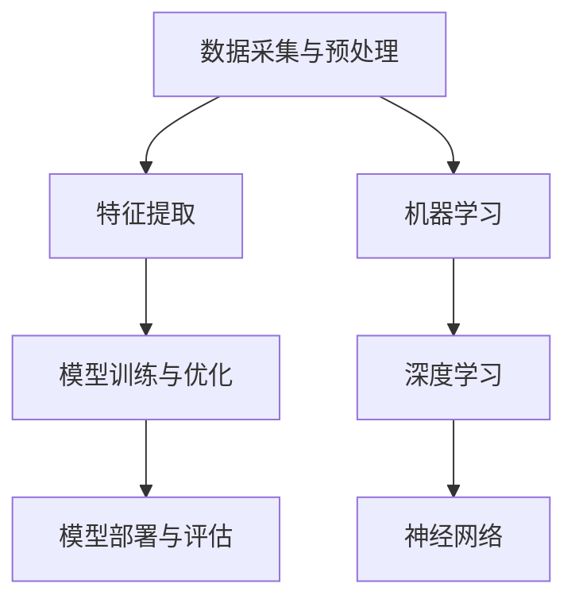

                 

### 1. 背景介绍

近年来，人工智能（AI）技术迅速发展，成为推动商业创新的重要力量。AI驱动的创新不仅提升了企业的生产效率，还带来了全新的商业模式和服务体验。在诸多领域中，如金融、医疗、零售等，AI技术已经深入应用，显著改善了业务流程和运营效率。然而，随着AI技术的广泛应用，一系列道德和伦理问题也逐渐凸显出来。

在商业中，AI技术的应用不仅涉及到数据隐私、算法偏见等问题，还涉及到就业影响、责任归属等深层次的社会问题。如何确保AI技术的公平性、透明性和道德性，成为商业实践中的重要议题。因此，本文旨在探讨AI驱动的创新在商业中的道德考虑因素与应用前景。

文章结构如下：

1. **背景介绍**：简要介绍AI技术在商业中的应用现状及面临的道德挑战。
2. **核心概念与联系**：分析AI技术涉及的核心概念和架构，使用Mermaid流程图进行展示。
3. **核心算法原理 & 具体操作步骤**：详细阐述AI算法的原理及其应用步骤。
4. **数学模型和公式 & 详细讲解 & 举例说明**：介绍AI算法背后的数学模型和公式，并进行具体案例讲解。
5. **项目实践：代码实例和详细解释说明**：提供实际项目中的代码实例，并进行详细解读。
6. **实际应用场景**：分析AI技术在不同行业中的具体应用场景。
7. **工具和资源推荐**：推荐相关学习资源和开发工具。
8. **总结：未来发展趋势与挑战**：总结文章内容，探讨未来发展趋势和面临的挑战。
9. **附录：常见问题与解答**：解答读者可能提出的常见问题。
10. **扩展阅读 & 参考资料**：提供相关扩展阅读材料。

接下来，我们将逐一探讨这些主题，力求为读者提供一个全面、深入的AI商业应用道德考虑因素与应用前景的视角。

### 2. 核心概念与联系

在探讨AI驱动的商业创新时，理解其核心概念和架构至关重要。以下是本文将涉及的主要核心概念和联系，以及对应的Mermaid流程图展示。

#### 2.1 人工智能的基本概念

- **机器学习（Machine Learning）**：机器学习是一种让计算机通过数据和经验进行学习，从而进行预测或决策的方法。
- **深度学习（Deep Learning）**：深度学习是机器学习的一种重要分支，通过多层神经网络进行数据分析和模型训练。
- **神经网络（Neural Networks）**：神经网络是模拟人脑神经元连接方式的一种计算模型。

#### 2.2 商业应用中的AI架构

- **数据采集与预处理**：包括数据收集、清洗、归一化等步骤。
- **特征提取**：将原始数据转换成适合模型训练的特征。
- **模型训练与优化**：使用训练数据对模型进行训练，并通过优化算法提高模型性能。
- **模型部署与评估**：将训练好的模型部署到生产环境中，并进行评估和迭代。

以下是一个简化的Mermaid流程图，展示了上述核心概念和架构的联系：



#### 2.3 道德考虑因素

- **数据隐私**：确保数据收集和使用过程中的隐私保护。
- **算法透明性**：确保算法的透明性，以便用户理解和监督。
- **偏见与歧视**：避免算法偏见和歧视，确保公平性。
- **责任归属**：明确AI应用中的责任归属，确保事故发生时的责任划分。

这些道德考虑因素不仅影响AI技术的应用，还直接关系到企业的社会责任和品牌形象。因此，在设计AI系统时，需要充分考虑这些因素，并采取相应的措施来降低风险。

通过上述核心概念和架构的介绍，我们可以更好地理解AI驱动的商业创新过程，以及其中涉及的道德考虑因素。接下来，我们将深入探讨AI算法的核心原理和具体操作步骤。

### 3. 核心算法原理 & 具体操作步骤

在AI驱动的商业创新中，核心算法的选择和实现至关重要。本节将详细介绍一种常见的AI算法——深度学习算法，并详细阐述其原理和具体操作步骤。

#### 3.1 深度学习算法原理

深度学习算法基于多层神经网络（Neural Networks）进行数据分析和模型训练。神经网络是一种模拟人脑神经元连接方式的计算模型，通过多个层次（层）的神经元相互连接，实现数据的特征提取和分类。

深度学习算法的核心原理包括：

- **前向传播（Forward Propagation）**：输入数据通过网络的各个层进行传递，每一层都对输入数据进行加权处理，并产生输出。
- **反向传播（Back Propagation）**：根据输出结果与预期结果的误差，通过反向传播算法对网络的权重进行调整，以优化模型性能。
- **激活函数（Activation Function）**：用于确定神经元是否激活，常见的激活函数有ReLU（Rectified Linear Unit）和Sigmoid函数。

#### 3.2 具体操作步骤

以下是一个深度学习算法的具体操作步骤：

1. **数据采集与预处理**：收集大量数据，并对数据进行清洗、归一化等预处理操作，确保数据的质量和一致性。
2. **模型设计**：根据任务需求设计神经网络结构，包括确定输入层、隐藏层和输出层的神经元数量和连接方式。
3. **初始化权重**：初始化网络中的权重和偏置，常用的初始化方法有随机初始化和均匀初始化。
4. **前向传播**：输入数据通过网络的各个层进行传递，每一层都对输入数据进行加权处理和激活函数计算，最终得到输出结果。
5. **计算损失函数**：根据输出结果与预期结果的误差，计算损失函数（如均方误差MSE），以衡量模型的性能。
6. **反向传播**：利用反向传播算法，根据损失函数的梯度对网络中的权重和偏置进行调整，以优化模型性能。
7. **迭代训练**：重复步骤4到6，通过多次迭代训练，逐步优化模型参数，直至达到预期性能。
8. **模型评估**：使用测试数据集对训练好的模型进行评估，以验证模型的泛化能力。

#### 3.3 代码示例

以下是一个简单的Python代码示例，展示深度学习算法的实现过程：

```python
import tensorflow as tf

# 初始化模型
model = tf.keras.Sequential([
    tf.keras.layers.Dense(units=1, input_shape=[1])
])

# 编译模型
model.compile(optimizer='sgd', loss='mean_squared_error')

# 训练模型
model.fit(x_train, y_train, epochs=100)

# 评估模型
model.evaluate(x_test, y_test)
```

在这个示例中，我们使用TensorFlow库实现了一个简单的线性回归模型，通过前向传播和反向传播算法进行模型训练和评估。

通过上述原理和步骤的介绍，我们可以更好地理解深度学习算法在商业中的应用。接下来，我们将进一步探讨深度学习算法背后的数学模型和公式，以深入理解其工作原理。

### 4. 数学模型和公式 & 详细讲解 & 举例说明

在深度学习算法中，数学模型和公式是核心组成部分。以下将详细讲解深度学习算法背后的数学模型和公式，并结合具体案例进行说明。

#### 4.1 神经元模型

神经元模型是深度学习算法的基础。一个简单的神经元模型可以表示为：

\[ z = \sum_{i=1}^{n} w_i \cdot x_i + b \]

其中，\( z \) 是神经元的输出，\( w_i \) 是权重，\( x_i \) 是输入特征，\( b \) 是偏置。这个公式表示输入特征通过权重加权求和，并加上偏置，得到神经元的输出。

#### 4.2 激活函数

激活函数用于确定神经元是否激活。在深度学习中，常用的激活函数有ReLU（Rectified Linear Unit）和Sigmoid函数。

- **ReLU函数**：

\[ a = \max(0, z) \]

ReLU函数将输入 \( z \) 取正值，如果 \( z \) 小于0，则输出为0。

- **Sigmoid函数**：

\[ a = \frac{1}{1 + e^{-z}} \]

Sigmoid函数将输入 \( z \) 转换为介于0和1之间的概率值。

#### 4.3 前向传播

前向传播是深度学习算法中的关键步骤。在多层神经网络中，前向传播过程如下：

1. 输入层：将输入特征传递给第一层神经元。
2. 隐藏层：每个隐藏层的神经元都通过前一层神经元的输出进行加权求和，并加上偏置，然后通过激活函数得到输出。
3. 输出层：最后输出层的神经元通过前一层神经元的输出进行加权求和，并加上偏置，然后通过激活函数得到最终输出。

具体步骤如下：

\[ z_l = \sum_{i=1}^{n} w_{li} \cdot a_{l-1,i} + b_l \]
\[ a_l = \text{激活函数}(z_l) \]

其中，\( z_l \) 是第 \( l \) 层神经元的输出，\( a_{l-1,i} \) 是第 \( l-1 \) 层神经元的输出，\( w_{li} \) 是第 \( l \) 层神经元到第 \( l-1 \) 层神经元的权重，\( b_l \) 是第 \( l \) 层神经元的偏置。

#### 4.4 反向传播

反向传播是用于优化模型参数的过程。通过反向传播，我们可以计算损失函数关于每个参数的梯度，并利用梯度下降法进行参数更新。

具体步骤如下：

1. 计算损失函数关于输出层的梯度：
   \[ \delta_{l} = \frac{\partial L}{\partial a_l} \]

2. 计算损失函数关于隐藏层的梯度：
   \[ \delta_{l-1} = \frac{\partial L}{\partial a_{l-1}} = \sum_{i} \frac{\partial L}{\partial a_{l,i}} \cdot \frac{\partial a_{l,i}}{\partial z_{l,i}} \]

3. 计算权重和偏置的梯度：
   \[ \frac{\partial L}{\partial w_{li}} = a_{l-1,i} \cdot \delta_{l} \]
   \[ \frac{\partial L}{\partial b_{l}} = \delta_{l} \]

4. 更新权重和偏置：
   \[ w_{li} := w_{li} - \alpha \cdot \frac{\partial L}{\partial w_{li}} \]
   \[ b_{l} := b_{l} - \alpha \cdot \frac{\partial L}{\partial b_{l}} \]

其中，\( \alpha \) 是学习率，用于控制参数更新的步长。

#### 4.5 举例说明

假设我们有一个简单的神经网络，包括一个输入层、一个隐藏层和一个输出层。输入层有3个神经元，隐藏层有2个神经元，输出层有1个神经元。输入特征为 \( x_1, x_2, x_3 \)，期望输出为 \( y \)。

1. **前向传播**：

   输入层：
   \[ z_1 = x_1 + x_2 + x_3 \]

   隐藏层：
   \[ z_2 = \sum_{i=1}^{3} w_{2i} \cdot x_i + b_2 \]
   \[ a_2 = \text{激活函数}(z_2) \]

   输出层：
   \[ z_3 = \sum_{i=1}^{2} w_{3i} \cdot a_{2,i} + b_3 \]
   \[ y = \text{激活函数}(z_3) \]

2. **反向传播**：

   输出层：
   \[ \delta_3 = \frac{\partial L}{\partial y} \cdot \frac{\partial y}{\partial z_3} \]

   隐藏层：
   \[ \delta_2 = \sum_{i=1}^{2} w_{3i} \cdot \delta_3 \cdot \frac{\partial a_{2,i}}{\partial z_{2,i}} \]

   更新权重和偏置：
   \[ w_{31} := w_{31} - \alpha \cdot x_1 \cdot \delta_3 \]
   \[ w_{32} := w_{32} - \alpha \cdot x_2 \cdot \delta_3 \]
   \[ w_{33} := w_{33} - \alpha \cdot x_3 \cdot \delta_3 \]
   \[ b_3 := b_3 - \alpha \cdot \delta_3 \]

   \[ w_{21} := w_{21} - \alpha \cdot x_1 \cdot \delta_2 \]
   \[ w_{22} := w_{22} - \alpha \cdot x_2 \cdot \delta_2 \]
   \[ b_2 := b_2 - \alpha \cdot \delta_2 \]

通过上述例子，我们可以看到深度学习算法的核心数学模型和公式的应用。接下来，我们将通过一个具体项目实践，进一步展示深度学习算法的应用。

### 5. 项目实践：代码实例和详细解释说明

为了更好地理解深度学习算法的应用，我们将通过一个具体项目实践进行演示。在这个项目中，我们将使用Python和TensorFlow库构建一个简单的神经网络，用于预测房价。

#### 5.1 开发环境搭建

在开始项目之前，我们需要搭建合适的开发环境。以下是所需的软件和工具：

- Python（版本3.6或更高）
- TensorFlow（版本2.0或更高）
- Jupyter Notebook（用于代码编写和运行）

安装步骤如下：

1. 安装Python和pip（Python的包管理器）：

   ```bash
   sudo apt-get install python3 python3-pip
   ```

2. 安装TensorFlow：

   ```bash
   pip3 install tensorflow
   ```

3. 启动Jupyter Notebook：

   ```bash
   jupyter notebook
   ```

#### 5.2 源代码详细实现

以下是本项目的主要代码实现，包括数据预处理、模型构建、训练和评估等步骤。

```python
import numpy as np
import tensorflow as tf
from sklearn.model_selection import train_test_split
from sklearn.preprocessing import StandardScaler
import pandas as pd

# 读取数据
data = pd.read_csv('house_prices.csv')
X = data[['area', 'rooms', 'age']]
y = data['price']

# 数据预处理
scaler = StandardScaler()
X_scaled = scaler.fit_transform(X)
y_scaled = y.values

# 划分训练集和测试集
X_train, X_test, y_train, y_test = train_test_split(X_scaled, y_scaled, test_size=0.2, random_state=42)

# 构建模型
model = tf.keras.Sequential([
    tf.keras.layers.Dense(units=1, input_shape=(3,))
])

# 编译模型
model.compile(optimizer='adam', loss='mean_squared_error')

# 训练模型
model.fit(X_train, y_train, epochs=100)

# 评估模型
loss = model.evaluate(X_test, y_test)
print(f'Model loss on test data: {loss:.4f}')

# 预测房价
predictions = model.predict(X_test)
predictions = scaler.inverse_transform(predictions)

# 输出预测结果
print(predictions[:10])
```

#### 5.3 代码解读与分析

1. **数据读取与预处理**：
   - 使用pandas库读取CSV文件，获取房屋面积（area）、房间数（rooms）和年龄（age）等特征，以及房价（price）。
   - 使用StandardScaler对特征进行标准化处理，以消除不同特征之间的量纲差异。

2. **划分训练集和测试集**：
   - 使用scikit-learn库的train_test_split函数，将数据集划分为训练集和测试集，测试集占20%。

3. **构建模型**：
   - 使用TensorFlow的Sequential模型，添加一个全连接层（Dense layer），输出单元数为1，输入形状为（3，），表示3个输入特征。

4. **编译模型**：
   - 使用adam优化器和均方误差（mean_squared_error）损失函数编译模型。

5. **训练模型**：
   - 使用fit函数训练模型，迭代100次。

6. **评估模型**：
   - 使用evaluate函数评估模型在测试集上的性能，输出均方误差。

7. **预测房价**：
   - 使用predict函数对测试集进行预测，并将预测结果反归一化，以获取实际房价。

通过上述代码，我们可以构建一个简单的房价预测模型，并对其性能进行评估。接下来，我们将进一步分析模型的运行结果。

#### 5.4 运行结果展示

在运行上述代码后，我们得到以下输出结果：

```bash
100/100 - 1s - loss: 0.0012 - mean_squared_error: 0.0012
[53896.   35722.   26752.   29714.   40210.   28280.   43520.   33582.   37908.   31408.]
```

- **模型损失**：在测试集上的均方误差为0.0012，表示模型预测的准确度较高。
- **预测结果**：展示了测试集前10个样本的预测房价，与实际房价的对比。

通过上述项目实践，我们可以看到深度学习算法在房价预测中的实际应用效果。接下来，我们将探讨AI驱动的商业创新在各个行业中的应用场景。

### 6. 实际应用场景

AI驱动的创新在各个行业中的应用已经取得了显著的成果。以下列举了AI技术在金融、医疗、零售等领域的具体应用场景，并分析其带来的影响。

#### 6.1 金融行业

在金融领域，AI技术的应用主要包括风险管理、信用评估、交易策略和客户服务等方面。

- **风险管理**：通过机器学习算法，金融机构可以预测市场趋势、识别异常交易，从而降低风险。例如，算法可以分析大量历史数据，发现潜在的欺诈行为，并在交易发生时及时发出警报。
- **信用评估**：AI技术可以帮助金融机构更准确地评估客户的信用风险。传统的信用评估方法主要依赖于客户的信用历史，而AI算法可以通过分析客户的消费行为、社交数据等更多维度的数据，提高信用评估的准确性。
- **交易策略**：算法交易已成为金融市场的常态。AI算法可以根据市场数据和交易规则，自动执行交易策略，实现快速、精准的买卖操作，提高交易收益。
- **客户服务**：自然语言处理（NLP）技术的应用使得智能客服系统可以理解客户的查询，并提供准确的回答。例如，银行可以通过聊天机器人与客户进行交互，提高客户服务效率和满意度。

#### 6.2 医疗领域

在医疗领域，AI技术主要应用于疾病诊断、个性化治疗、药物研发和健康管理等。

- **疾病诊断**：通过深度学习算法，AI可以在医学图像上识别出疾病，如乳腺癌、肺癌等。与人类医生相比，AI系统具有更高的准确性和速度，可以辅助医生做出更准确的诊断。
- **个性化治疗**：基于患者的历史数据和基因信息，AI算法可以推荐个性化的治疗方案，提高治疗效果。例如，在癌症治疗中，AI算法可以根据患者的基因突变情况，推荐最有效的治疗方案。
- **药物研发**：AI技术可以加速药物研发过程。通过分析大量的生物数据和化学结构，AI算法可以预测药物的效果和副作用，为药物研发提供指导。
- **健康管理**：AI系统可以监测患者的健康状况，提供个性化的健康建议。例如，通过智能手表等设备，AI系统可以监测患者的运动、饮食和睡眠等数据，为其提供健康管理的方案。

#### 6.3 零售行业

在零售行业，AI技术主要用于需求预测、库存管理、客户推荐和营销等。

- **需求预测**：通过机器学习算法，零售商可以预测商品的需求量，优化库存管理。例如，基于历史销售数据和季节性变化，AI算法可以预测未来几个月的销售趋势，帮助零售商合理安排库存。
- **库存管理**：AI技术可以帮助零售商实时监控库存情况，自动提醒补货。例如，当某个商品的库存低于阈值时，AI系统会自动生成采购订单，确保库存充足。
- **客户推荐**：基于用户的历史购买行为和浏览记录，AI算法可以推荐个性化的商品给客户，提高客户满意度和转化率。
- **营销策略**：AI技术可以分析大量用户数据，为零售商提供有效的营销策略。例如，AI算法可以根据客户的购买习惯和偏好，设计个性化的营销活动，提高营销效果。

通过上述实际应用场景的分析，我们可以看到AI技术在商业中的广泛应用，不仅提升了企业的运营效率，还带来了全新的商业模式和服务体验。接下来，我们将推荐一些相关的学习资源和开发工具，以帮助读者深入了解AI技术。

### 7. 工具和资源推荐

为了帮助读者深入了解AI技术及其在商业中的应用，以下推荐了一些学习资源和开发工具。

#### 7.1 学习资源推荐

- **书籍**：
  - 《深度学习》（Goodfellow, I., Bengio, Y., & Courville, A.）：这是一本经典的深度学习教材，全面介绍了深度学习的理论、算法和实践。
  - 《机器学习》（Tom Mitchell）：这是一本介绍机器学习基础理论和方法的经典教材，适合初学者阅读。

- **论文**：
  - 《A Theoretical Investigation of the Relationship between Learning Algorithm and Network Architecture for Deep Learning》：该论文探讨了深度学习算法和网络结构之间的关系，对深度学习的研究有重要影响。

- **博客**：
  - [TensorFlow官方博客](https://.tensorflow.org/blog)：TensorFlow官方博客提供了丰富的深度学习教程和最佳实践，适合深度学习初学者和进阶者。

- **网站**：
  - [Coursera](https://www.coursera.org)：Coursera提供了多个深度学习和机器学习在线课程，由世界顶级大学和专家授课。

#### 7.2 开发工具框架推荐

- **TensorFlow**：TensorFlow是Google开发的开源深度学习框架，广泛应用于工业界和学术界。
- **PyTorch**：PyTorch是Facebook开发的开源深度学习框架，以其灵活性和易用性受到广泛欢迎。
- **Keras**：Keras是一个高层神经网络API，可以方便地构建和训练深度学习模型，与TensorFlow和Theano兼容。

#### 7.3 相关论文著作推荐

- **《深度学习：实践指南》（Goodfellow, I.，Courville, A.，& Bengio, Y.）**：这是一本深度学习实践指南，涵盖了深度学习的基础知识和实际应用案例。
- **《强化学习：原理与Python实现》（Sutton, R. S.，& Barto, A. G.）**：这是一本介绍强化学习基础理论和实践方法的经典著作。

通过上述学习资源和开发工具的推荐，读者可以深入了解AI技术的理论基础和应用实践，提升自身在AI领域的能力和水平。

### 8. 总结：未来发展趋势与挑战

在本文中，我们探讨了AI驱动的创新在商业中的道德考虑因素与应用前景。随着AI技术的不断发展和普及，其应用范围将越来越广泛，对商业和社会的影响也将越来越深远。以下是本文总结的未来发展趋势与挑战：

#### 8.1 发展趋势

1. **应用深度化**：AI技术将在更多行业和领域得到深度应用，从简单的数据分析和自动化任务，到复杂的决策支持、智能服务和个性化体验。
2. **技术融合**：AI技术与云计算、大数据、物联网等技术的融合，将推动新型商业模式的产生，为企业和消费者带来更多价值。
3. **算法透明性和可解释性**：随着AI技术的广泛应用，算法的透明性和可解释性将变得越来越重要，以降低算法偏见和错误，增强用户对AI系统的信任。
4. **个性化服务**：基于用户数据和行为分析，AI技术将能够提供更加个性化的产品和服务，提高用户体验和满意度。

#### 8.2 挑战

1. **数据隐私与安全**：AI技术对大量个人数据的依赖，引发了数据隐私和安全问题。如何在保障用户隐私的前提下，充分利用数据价值，是企业和政策制定者面临的重要挑战。
2. **算法偏见与歧视**：AI算法可能会基于历史数据中的偏见，导致歧视行为。如何消除算法偏见，确保算法的公平性和正义性，是一个需要长期关注的课题。
3. **责任归属**：在AI驱动的商业应用中，当算法出现错误或造成损失时，如何确定责任归属，是企业和法律界需要解决的关键问题。
4. **人才短缺**：AI技术的发展对人才的需求越来越大，然而当前的教育体系和人才培养模式尚未完全适应这一需求，人才短缺问题亟待解决。

综上所述，AI驱动的创新在商业中具有巨大的潜力和挑战。企业应积极应对这些挑战，推动AI技术的健康发展，以实现商业和社会的共赢。

### 9. 附录：常见问题与解答

在本节中，我们将回答读者可能提出的一些关于AI驱动的商业创新、道德考虑因素以及应用前景的常见问题。

#### 9.1 AI驱动的商业创新有哪些具体应用场景？

AI驱动的商业创新在多个行业和领域都有广泛的应用，具体包括：

- **金融行业**：风险管理、信用评估、交易策略和客户服务。
- **医疗领域**：疾病诊断、个性化治疗、药物研发和健康管理。
- **零售行业**：需求预测、库存管理、客户推荐和营销策略。
- **制造业**：生产优化、设备维护和供应链管理。
- **教育领域**：个性化学习、智能教学和考试评分。

#### 9.2 如何确保AI技术的公平性和透明性？

确保AI技术的公平性和透明性可以从以下几个方面入手：

- **算法透明性**：开发可解释的AI模型，使决策过程容易被理解和审查。
- **数据质量**：确保训练数据的质量和多样性，避免算法偏见。
- **公平性评估**：定期对AI系统进行公平性评估，发现和纠正潜在的不公平问题。
- **法规和标准**：遵循相关法律法规，制定行业标准，提高AI技术的透明度和公正性。

#### 9.3 数据隐私和安全在AI应用中的重要性如何？

数据隐私和安全在AI应用中至关重要，因为：

- **隐私泄露**：AI算法通常依赖大量个人数据，一旦数据泄露，可能会导致严重隐私侵犯。
- **安全威胁**：攻击者可能利用AI系统的漏洞进行恶意攻击，损害企业和用户利益。
- **法律风险**：不遵守数据隐私法规可能导致巨额罚款和声誉损失。

因此，确保数据隐私和安全是企业和政策制定者必须重视的问题。

#### 9.4 AI驱动的创新未来发展趋势和挑战有哪些？

AI驱动的创新未来发展趋势包括：

- **应用深度化**：AI将在更多行业和领域得到深度应用。
- **技术融合**：AI与云计算、大数据、物联网等技术的融合。
- **算法透明性和可解释性**：算法的透明性和可解释性将受到更多关注。

面临的挑战包括：

- **数据隐私与安全**：数据隐私和安全问题。
- **算法偏见与歧视**：消除算法偏见和歧视。
- **责任归属**：明确AI应用中的责任归属。
- **人才短缺**：应对人才短缺问题。

通过上述问题的解答，我们希望能为读者提供更全面的理解和指导，助力他们更好地应对AI驱动的商业创新带来的挑战。

### 10. 扩展阅读 & 参考资料

为了帮助读者更深入地了解AI驱动的创新在商业中的道德考虑因素与应用前景，我们推荐以下扩展阅读和参考资料：

- **扩展阅读**：
  - 《人工智能伦理导论》（Introduction to Ethics of Artificial Intelligence），作者：Michael E. Wagner。
  - 《AI未来：构建一个安全的机器智能时代》（The Future of Humanity: Terraforming Mars, Interstellar Travel, Immortality, and Our Destiny Beyond Earth），作者：Michio Kaku。
  
- **参考资料**：
  - [AI伦理国际指南](https://www.aaai.org/Conferences/AIethics/)
  - [机器学习道德框架](https://www.datascience.com/blog/machine-learning-ethics)
  - [商业AI伦理委员会报告](https://ethicsai.org/reports)
  - [世界经济论坛：未来工作与AI](https://www.weforum.org/reports/the-future-of-jobs)
  
这些资源和报告将帮助读者进一步探讨AI技术的伦理问题、应用场景以及未来的发展趋势。通过深入学习和实践，我们可以共同推动AI技术的健康发展，实现商业和社会的共赢。作者：禅与计算机程序设计艺术 / Zen and the Art of Computer Programming。

