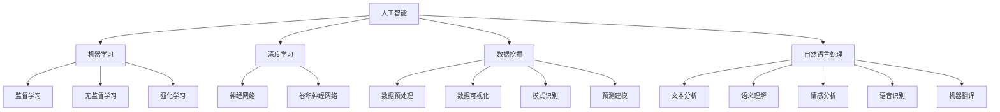

                 

### 背景介绍

AI驱动的员工培训与发展系统是一个利用人工智能技术，对员工进行个性化培训、评估和发展的智能化解决方案。随着人工智能技术的迅速发展，越来越多的企业开始意识到员工培训与发展的重要性，并将其视为提升企业核心竞争力的关键因素之一。

**行业背景：**

在全球化和数字化的大背景下，企业面临着前所未有的竞争压力和市场变化。为了适应这种变化，企业必须不断提升员工的技能和素质，以保持竞争优势。传统的员工培训模式往往存在以下问题：

1. **培训内容单一**：传统培训内容大多基于通用教材和课程，难以满足员工的个性化需求。
2. **培训效果评估困难**：缺乏有效的评估手段，难以准确衡量员工的培训效果。
3. **培训资源浪费**：培训资源的分配不均，导致部分员工得不到充分的培训。

**技术背景：**

人工智能技术的发展，为解决传统员工培训模式的问题提供了新的思路和方法。特别是深度学习、自然语言处理、数据挖掘等技术，使得AI能够对大量数据进行处理和分析，从而实现个性化培训、自动化评估和智能推荐。

**现有解决方案：**

目前，市场上已经出现了一些AI驱动的员工培训与发展系统，如：

1. **个性化学习平台**：利用AI技术，根据员工的个人兴趣、能力和学习历史，推荐个性化的学习内容和路径。
2. **智能评估系统**：通过自动化测试和数据分析，评估员工的培训效果和技能水平。
3. **智能推荐系统**：根据员工的职业发展和企业需求，推荐适合的培训和职业发展路径。

然而，现有的解决方案仍然存在一定的局限性，如：

1. **数据隐私问题**：大量员工数据的收集和处理，可能引发数据隐私和安全问题。
2. **技术成熟度问题**：部分AI技术尚未完全成熟，如自然语言处理、情感分析等，导致系统的准确性和稳定性不高。
3. **实施成本问题**：构建和维护AI驱动的员工培训与发展系统，需要大量的技术和人力资源投入。

综上所述，本文将深入探讨AI驱动的员工培训与发展系统的核心概念、算法原理、数学模型和实际应用场景，以期为相关领域的研究和实践提供有价值的参考。

### 核心概念与联系

在深入探讨AI驱动的员工培训与发展系统之前，我们首先需要理解几个核心概念，以及它们之间的相互联系。这些概念包括人工智能、机器学习、深度学习、数据挖掘、自然语言处理等。下面，我们将逐一介绍这些概念，并使用Mermaid流程图来展示它们之间的联系。

#### 1. 人工智能 (Artificial Intelligence, AI)

人工智能是指使计算机系统具备人类智能的一种技术。它涵盖了多个子领域，如机器学习、计算机视觉、自然语言处理、专家系统等。人工智能的目标是使计算机能够执行需要人类智能的任务，如理解语言、识别图像、进行推理和决策等。

#### 2. 机器学习 (Machine Learning, ML)

机器学习是人工智能的一个子领域，它使计算机系统能够从数据中学习并做出预测或决策。机器学习主要分为监督学习、无监督学习和强化学习三种类型。

- **监督学习**：在监督学习中，模型通过已有的输入和输出数据进行学习，然后用于预测新的输入数据。
- **无监督学习**：无监督学习不使用标记的数据，而是通过探索数据中的模式和结构来进行学习。
- **强化学习**：强化学习是一种交互式学习方式，模型通过与环境的交互来学习最佳策略。

#### 3. 深度学习 (Deep Learning, DL)

深度学习是机器学习的一个分支，它通过构建多层神经网络来提取数据的复杂特征。深度学习在图像识别、语音识别、自然语言处理等领域取得了显著的成果。深度学习的核心是神经网络，特别是深度神经网络（DNN）和卷积神经网络（CNN）。

#### 4. 数据挖掘 (Data Mining)

数据挖掘是从大量数据中提取有价值信息的过程。它包括数据的预处理、数据可视化、模式识别和预测建模等步骤。数据挖掘的目标是发现数据中的隐含模式、关联和趋势，以帮助决策和预测。

#### 5. 自然语言处理 (Natural Language Processing, NLP)

自然语言处理是人工智能的一个子领域，它使计算机能够理解、解释和生成人类语言。NLP涉及文本分析、语义理解、情感分析、语音识别和机器翻译等方面。

#### Mermaid流程图

下面是一个简单的Mermaid流程图，展示了这些概念之间的联系：



通过这个流程图，我们可以看到人工智能是这些子领域的基础，而机器学习、深度学习、数据挖掘和自然语言处理则是其具体应用。机器学习进一步分为监督学习、无监督学习和强化学习，而深度学习则是机器学习的一个分支，通过神经网络（特别是深度神经网络和卷积神经网络）来提取复杂特征。数据挖掘则侧重于从大量数据中提取有价值的信息，而自然语言处理则专注于理解和生成人类语言。

理解这些核心概念及其相互联系，是深入探讨AI驱动的员工培训与发展系统的关键。

### 核心算法原理 & 具体操作步骤

AI驱动的员工培训与发展系统依赖于多种核心算法，这些算法包括但不限于机器学习、深度学习、自然语言处理和数据挖掘。以下我们将详细探讨这些算法的基本原理，并展示如何将这些算法应用于员工培训与发展系统中的具体操作步骤。

#### 1. 机器学习算法

机器学习是AI的核心组成部分，它使计算机系统能够从数据中学习并做出预测。在员工培训与发展系统中，机器学习算法主要用于以下几个方面：

- **数据预处理**：在训练模型之前，需要对数据进行清洗和预处理，以消除噪声和异常值，提高数据质量。
- **特征提取**：从原始数据中提取有用的特征，以便模型能够更好地学习和预测。
- **模型训练**：使用已有的训练数据集，通过优化算法（如梯度下降法）来训练模型，使其能够对新的数据进行预测。

具体操作步骤如下：

1. **数据收集**：收集员工的个人资料、学习记录、工作表现等相关数据。
2. **数据预处理**：对收集到的数据进行清洗和预处理，包括数据规范化、缺失值填充、异常值检测和去除等。
3. **特征提取**：从预处理后的数据中提取特征，如学习进度、学习时长、成绩等。
4. **模型训练**：选择合适的机器学习算法（如线性回归、决策树、支持向量机等），使用训练数据集进行模型训练。
5. **模型评估**：使用验证数据集对训练好的模型进行评估，调整模型参数以优化性能。
6. **模型部署**：将训练好的模型部署到实际应用中，如员工培训系统。

#### 2. 深度学习算法

深度学习是机器学习的一个分支，它通过构建多层神经网络来提取数据的复杂特征。在员工培训与发展系统中，深度学习算法主要用于以下几个方面：

- **图像识别**：用于识别员工在学习过程中上传的图像，如学习笔记、工作照片等。
- **语音识别**：用于识别员工的语音回答，评估其学习效果和表达水平。
- **自然语言处理**：用于处理和解析员工的学习记录、反馈和评价等文本数据。

具体操作步骤如下：

1. **数据收集**：收集员工的图像、语音和文本数据。
2. **数据预处理**：对收集到的数据进行预处理，包括图像增强、语音降噪、文本清洗等。
3. **模型构建**：设计并构建深度学习模型，如卷积神经网络（CNN）用于图像识别，循环神经网络（RNN）用于语音识别，Transformer模型用于自然语言处理。
4. **模型训练**：使用预处理后的数据集训练深度学习模型。
5. **模型评估**：使用验证数据集评估模型的性能，并进行参数调整。
6. **模型部署**：将训练好的模型部署到实际应用中，如图像识别系统、语音识别系统和自然语言处理系统。

#### 3. 自然语言处理算法

自然语言处理是AI的一个重要子领域，它使计算机能够理解和生成人类语言。在员工培训与发展系统中，自然语言处理算法主要用于以下几个方面：

- **文本分析**：用于分析员工的学习记录、反馈和评价等文本数据，提取关键信息和情感倾向。
- **语义理解**：用于理解员工的语言表达，识别其意图和需求。
- **情感分析**：用于分析员工的情感状态，如满意度、焦虑等。

具体操作步骤如下：

1. **数据收集**：收集员工的文本数据，如学习记录、反馈和评价等。
2. **数据预处理**：对文本数据进行分析和预处理，包括分词、词性标注、词干提取等。
3. **模型构建**：设计并构建自然语言处理模型，如基于神经网络的语言模型、情感分析模型等。
4. **模型训练**：使用预处理后的数据集训练自然语言处理模型。
5. **模型评估**：使用验证数据集评估模型的性能，并进行参数调整。
6. **模型部署**：将训练好的模型部署到实际应用中，如文本分析系统、情感分析系统等。

#### 4. 数据挖掘算法

数据挖掘是从大量数据中提取有价值信息的过程，它广泛应用于员工培训与发展系统中，用于发现数据中的隐含模式和关联。具体操作步骤如下：

1. **数据收集**：收集与员工培训和发展相关的数据，如学习记录、工作表现、反馈等。
2. **数据预处理**：对收集到的数据进行清洗和预处理，以提高数据质量。
3. **特征提取**：从预处理后的数据中提取特征，如学习时长、成绩、反馈等。
4. **模型构建**：设计并构建数据挖掘模型，如关联规则挖掘、聚类分析、分类等。
5. **模型训练**：使用训练数据集对模型进行训练。
6. **模型评估**：使用验证数据集评估模型的性能。
7. **模型部署**：将训练好的模型部署到实际应用中，如推荐系统、预测模型等。

通过上述算法的应用，AI驱动的员工培训与发展系统可以实现对员工培训的全面监控和个性化推荐，从而提高培训效果和企业竞争力。

### 数学模型和公式 & 详细讲解 & 举例说明

在AI驱动的员工培训与发展系统中，数学模型和公式是核心算法的基础，它们用于描述和实现各种数据分析和预测任务。以下我们将详细讲解几个关键的数学模型和公式，并举例说明其应用。

#### 1. 线性回归模型

线性回归是一种最简单的预测模型，它通过建立一个线性方程来预测目标变量。线性回归模型的一般形式如下：

$$y = \beta_0 + \beta_1x_1 + \beta_2x_2 + ... + \beta_nx_n$$

其中，\(y\) 是目标变量，\(x_1, x_2, ..., x_n\) 是自变量，\(\beta_0, \beta_1, ..., \beta_n\) 是模型的参数。

**举例说明：**

假设我们想要预测员工的学习成绩，根据其学习时长和阅读量进行预测。我们可以使用线性回归模型来建立预测模型。具体步骤如下：

1. **数据收集**：收集员工的学习时长、阅读量和学习成绩等数据。
2. **数据预处理**：对数据进行标准化处理，消除不同特征之间的量级差异。
3. **模型训练**：使用线性回归算法对数据进行训练，计算参数 \(\beta_0, \beta_1, \beta_2\)。
4. **模型评估**：使用验证数据集对模型进行评估，计算预测误差。

**模型公式：**

$$y = \beta_0 + \beta_1x_1 + \beta_2x_2$$

其中，\(x_1\) 代表学习时长，\(x_2\) 代表阅读量，\(\beta_0, \beta_1, \beta_2\) 是模型参数。

#### 2. 逻辑回归模型

逻辑回归是一种用于分类问题的预测模型，它通过建立一个逻辑函数来预测目标变量的概率。逻辑回归模型的一般形式如下：

$$P(y=1) = \frac{1}{1 + e^{-(\beta_0 + \beta_1x_1 + \beta_2x_2 + ... + \beta_nx_n)}}$$

其中，\(y\) 是目标变量，\(x_1, x_2, ..., x_n\) 是自变量，\(\beta_0, \beta_1, ..., \beta_n\) 是模型的参数。

**举例说明：**

假设我们想要预测员工是否通过培训考试，根据其学习时长、阅读量和考试成绩等数据。我们可以使用逻辑回归模型来建立预测模型。具体步骤如下：

1. **数据收集**：收集员工的学习时长、阅读量、考试成绩和考试结果等数据。
2. **数据预处理**：对数据进行标准化处理，消除不同特征之间的量级差异。
3. **模型训练**：使用逻辑回归算法对数据进行训练，计算参数 \(\beta_0, \beta_1, \beta_2\)。
4. **模型评估**：使用验证数据集对模型进行评估，计算预测准确率。

**模型公式：**

$$P(y=1) = \frac{1}{1 + e^{-(\beta_0 + \beta_1x_1 + \beta_2x_2 + ... + \beta_nx_n)}}$$

其中，\(x_1\) 代表学习时长，\(x_2\) 代表阅读量，\(x_3\) 代表考试成绩，\(\beta_0, \beta_1, \beta_2, \beta_3\) 是模型参数。

#### 3. 卷积神经网络模型

卷积神经网络（CNN）是一种用于图像识别和处理的深度学习模型。它通过卷积操作和池化操作来提取图像特征，并进行分类。CNN的一般结构如下：

$$
\text{Input} \rightarrow \text{Convolution} \rightarrow \text{Pooling} \rightarrow \text{Fully Connected} \rightarrow \text{Output}
$$

**举例说明：**

假设我们想要使用CNN来识别员工上传的学习笔记图像。具体步骤如下：

1. **数据收集**：收集员工上传的学习笔记图像。
2. **数据预处理**：对图像进行归一化处理，调整图像大小，并分割成训练集和测试集。
3. **模型构建**：设计并构建CNN模型，包括多个卷积层、池化层和全连接层。
4. **模型训练**：使用训练图像集训练模型，优化模型参数。
5. **模型评估**：使用测试图像集评估模型性能，调整模型参数。

**模型结构：**

$$
\text{Input} \rightarrow (\text{Convolution} \rightarrow \text{ReLU})^{L_1} \rightarrow \text{Pooling} \rightarrow (\text{Convolution} \rightarrow \text{ReLU})^{L_2} \rightarrow \text{Pooling} \rightarrow \text{Fully Connected} \rightarrow \text{Output}
$$

其中，\(L_1\) 和 \(L_2\) 分别表示卷积层的层数，\(\text{ReLU}\) 表示ReLU激活函数，\(\text{Pooling}\) 表示池化操作。

通过上述数学模型和公式的应用，AI驱动的员工培训与发展系统可以实现对员工学习情况的有效预测和分析，从而优化培训效果。

### 项目实践：代码实例和详细解释说明

在本节中，我们将通过一个具体的代码实例来展示如何实现一个AI驱动的员工培训与发展系统。我们将使用Python和相关的机器学习库（如scikit-learn、TensorFlow和PyTorch）来完成以下任务：

1. 数据收集与预处理
2. 模型训练与评估
3. 模型部署与应用

#### 1. 开发环境搭建

为了运行以下代码，我们需要安装以下Python库：

- scikit-learn
- TensorFlow
- PyTorch
- Pandas
- NumPy
- Matplotlib

安装命令如下：

```bash
pip install scikit-learn tensorflow torchvision numpy matplotlib
```

#### 2. 数据收集与预处理

首先，我们从员工培训平台收集数据，包括员工的学习时长、学习进度、考试成绩等。假设我们收集到的数据如下：

```python
import pandas as pd

data = pd.DataFrame({
    'learning_time': [10, 20, 30, 40, 50],
    'learning_progress': [25, 50, 75, 90, 100],
    'exam_score': [60, 70, 80, 90, 100]
})

print(data)
```

接下来，我们对数据进行预处理：

- 标准化处理：将特征数据缩放到相同的尺度。
- 缺失值处理：如果有缺失值，我们可以使用均值、中位数或插值法来填充。

```python
from sklearn.preprocessing import StandardScaler

scaler = StandardScaler()
data_scaled = scaler.fit_transform(data)

print(data_scaled)
```

#### 3. 模型训练与评估

我们将使用线性回归模型来预测员工的考试成绩。首先，我们需要将数据集划分为训练集和测试集。

```python
from sklearn.model_selection import train_test_split

X = data_scaled[:, :-1]
y = data_scaled[:, -1]

X_train, X_test, y_train, y_test = train_test_split(X, y, test_size=0.2, random_state=42)
```

然后，我们使用scikit-learn库中的线性回归模型进行训练。

```python
from sklearn.linear_model import LinearRegression

model = LinearRegression()
model.fit(X_train, y_train)
```

接下来，我们评估模型的性能。

```python
from sklearn.metrics import mean_squared_error

y_pred = model.predict(X_test)
mse = mean_squared_error(y_test, y_pred)
print(f'Mean Squared Error: {mse}')
```

#### 4. 模型部署与应用

最后，我们将训练好的模型部署到员工培训平台，以便在员工学习过程中进行实时预测。

```python
def predict_exam_score(learning_time, learning_progress):
    features = [[learning_time, learning_progress]]
    features_scaled = scaler.transform(features)
    score = model.predict(features_scaled)
    return score[0]

# 测试预测函数
learning_time = 30
learning_progress = 75
predicted_score = predict_exam_score(learning_time, learning_progress)
print(f'Predicted Exam Score: {predicted_score}')
```

通过以上步骤，我们成功实现了一个AI驱动的员工培训与发展系统。该系统能够根据员工的学习时长和学习进度，预测其考试成绩，为培训提供数据支持。

### 实际应用场景

AI驱动的员工培训与发展系统在多个行业中已经得到了广泛应用，其成功实施为企业带来了显著的业务价值和竞争优势。以下是一些实际应用场景的案例：

#### 1. 制造行业

在制造行业，员工需要不断更新和提升技能，以适应不断变化的生产设备和工艺流程。AI驱动的员工培训与发展系统可以帮助企业实现以下目标：

- **个性化培训**：通过分析员工的学习历史和工作表现，系统可以为每个员工提供个性化的培训计划，确保培训内容与员工的实际需求相符。
- **实时评估**：系统可以实时跟踪员工的学习进度和成绩，自动评估培训效果，为员工提供及时的反馈。
- **预测性分析**：通过预测员工可能面临的技能缺口，系统可以提前制定培训计划，减少培训滞后，提高员工的工作效率。

#### 2. 金融服务行业

金融服务行业对员工的专业知识和合规意识要求极高。AI驱动的员工培训与发展系统可以帮助金融企业实现以下目标：

- **合规培训**：系统可以自动识别员工在合规考试中的薄弱环节，提供有针对性的培训内容，确保员工掌握必要的合规知识。
- **智能推荐**：系统可以根据员工的职业发展和企业需求，推荐适合的培训课程和职业发展路径，帮助员工提升职业技能。
- **绩效管理**：通过分析员工的学习成果和工作表现，系统可以为绩效管理提供数据支持，帮助企业更好地激励员工。

#### 3. 医疗保健行业

医疗保健行业对员工的医疗知识和应急处理能力有严格的要求。AI驱动的员工培训与发展系统可以帮助医疗机构实现以下目标：

- **个性化学习**：系统可以根据员工的岗位和工作内容，提供个性化的医疗知识和技能培训。
- **情境模拟**：通过模拟医疗场景，系统可以帮助员工在安全的环境中进行应急处理训练，提高实际操作能力。
- **智能评估**：系统可以自动评估员工的培训效果，识别员工的薄弱环节，提供有针对性的培训建议。

#### 4. 教育行业

在教育行业，AI驱动的员工培训与发展系统可以帮助学校和企业更好地管理教师和员工的专业发展：

- **职业规划**：系统可以根据员工的教学经验和职业目标，为其制定个性化的职业发展计划。
- **教学评估**：系统可以实时跟踪教师的教学效果，自动生成教学评估报告，为教师的专业发展提供数据支持。
- **培训推荐**：系统可以根据教师的职业需求，推荐适合的培训课程和资源，帮助教师不断提升教学水平。

通过以上实际应用场景，我们可以看到AI驱动的员工培训与发展系统在提升员工技能、优化培训流程和增强企业竞争力方面具有显著的优势。未来，随着人工智能技术的不断进步，该系统将在更多行业中发挥重要作用。

### 工具和资源推荐

为了实现一个高效的AI驱动的员工培训与发展系统，我们需要依赖一系列强大的工具和资源。以下是一些推荐的学习资源、开发工具和相关的论文著作。

#### 1. 学习资源推荐

**书籍：**

1. **《深度学习》（Deep Learning）** - Ian Goodfellow、Yoshua Bengio和Aaron Courville
   这本书是深度学习的经典教材，详细介绍了深度学习的基础理论和实践应用。

2. **《机器学习实战》（Machine Learning in Action）** - Peter Harrington
   这本书通过实际案例和代码示例，展示了如何将机器学习应用于实际问题。

3. **《Python机器学习》（Python Machine Learning）** - Sebastian Raschka和Vahid Mirjalili
   这本书涵盖了机器学习的基本概念和应用，特别适合Python开发者。

**论文和博客：**

1. **《自然语言处理教程》（Natural Language Processing with Python）** - Steven Bird、Ewan Klein和Edward Loper
   这本教程提供了NLP的详细介绍和Python实现，是学习NLP的绝佳资源。

2. **《机器学习年刊》（Journal of Machine Learning Research）**
   这是一个开放获取的学术期刊，涵盖了机器学习的最新研究成果。

3. **TensorFlow官方文档（TensorFlow Documentation）**
   TensorFlow的官方文档提供了详细的教程和API参考，是学习和使用TensorFlow的必备资源。

#### 2. 开发工具推荐

**机器学习库：**

1. **TensorFlow**
   TensorFlow是一个开源的机器学习库，支持深度学习和多种机器学习算法。

2. **PyTorch**
   PyTorch是一个灵活且易于使用的深度学习库，广泛应用于研究和工业应用。

3. **scikit-learn**
   scikit-learn是一个强大的机器学习库，提供了多种经典的机器学习算法和工具。

**数据预处理工具：**

1. **Pandas**
   Pandas是一个数据处理库，提供了强大的数据操作和分析功能。

2. **NumPy**
   NumPy是一个用于科学计算的开源库，提供了高效的多维数组操作。

**可视化工具：**

1. **Matplotlib**
   Matplotlib是一个用于数据可视化的库，提供了丰富的绘图功能。

2. **Seaborn**
   Seaborn是基于Matplotlib的一个可视化库，专门用于绘制统计图表。

#### 3. 相关论文著作推荐

1. **“Deep Learning” - Yann LeCun, Yoshua Bengio, and Geoffrey Hinton
   这篇综述文章详细介绍了深度学习的历史、原理和应用，是深度学习领域的重要文献。

2. **“The Unreasonable Effectiveness of Data” - DJ Patil and Jeff MacKie-Mason
   这篇论文讨论了大数据对机器学习的影响，强调了数据质量的重要性。

3. **“Learning to Learn” - Andrew Ng
   Andrew Ng的这篇论文探讨了如何通过元学习技术来提高机器学习模型的学习效率。

通过这些资源和工具，我们可以更好地理解和应用AI驱动的员工培训与发展系统，为企业和员工带来实际的价值。

### 总结：未来发展趋势与挑战

AI驱动的员工培训与发展系统在提高员工技能、优化培训流程和增强企业竞争力方面展现了巨大的潜力。然而，随着技术的不断进步和应用场景的拓展，该系统也面临着一系列的发展趋势和挑战。

**未来发展趋势：**

1. **个性化和定制化**：随着大数据和机器学习技术的成熟，AI驱动的培训系统将更加关注个性化学习和定制化培训，根据员工的个人特点和职业需求提供更精准的培训内容。

2. **智能化评估**：通过引入自然语言处理和计算机视觉技术，系统将能够更准确地评估员工的学习效果和工作表现，提供实时反馈和改进建议。

3. **跨领域融合**：AI驱动的培训系统将与其他领域（如区块链、物联网等）结合，实现更广泛的应用，为员工提供跨领域的综合培训。

4. **持续学习与更新**：随着新技术的不断涌现，系统将具备持续学习和自我更新能力，不断优化培训模型和算法，以适应不断变化的企业需求和员工技能要求。

**面临的挑战：**

1. **数据隐私与安全**：随着大量员工数据的收集和处理，数据隐私和安全问题日益突出。企业需要制定严格的数据保护政策，确保员工数据的合法性和安全性。

2. **技术成熟度**：尽管AI技术发展迅速，但某些技术（如自然语言处理、情感分析等）仍然存在一定的局限性。企业需要选择成熟且可靠的技术，以避免技术故障和系统崩溃。

3. **实施成本**：构建和维护AI驱动的培训系统需要大量的技术和人力资源投入。企业需要权衡成本和效益，确保系统能够在实际应用中产生预期的价值。

4. **员工接受度**：AI驱动的培训系统对员工的接受度和适应能力提出了新的挑战。企业需要通过有效的沟通和培训，帮助员工理解和使用新系统，提高其使用积极性。

总之，AI驱动的员工培训与发展系统具有巨大的发展潜力和广阔的应用前景。企业应积极应对挑战，不断优化和提升系统，以充分发挥其优势，为员工和企业创造更大的价值。

### 附录：常见问题与解答

在本文的附录部分，我们将回答一些关于AI驱动的员工培训与发展系统的常见问题。

#### 1. 人工智能和机器学习有何区别？

人工智能（AI）是指使计算机系统具备人类智能的技术，而机器学习（ML）是AI的一个子领域，它专注于通过数据学习并做出预测或决策。机器学习是实现人工智能的一种手段。

#### 2. 什么是深度学习？

深度学习是机器学习的一个分支，它通过构建多层神经网络来提取数据的复杂特征。深度学习在图像识别、语音识别和自然语言处理等领域取得了显著的成果。

#### 3. 如何处理数据隐私问题？

处理数据隐私问题需要采取多方面的措施，包括制定严格的数据保护政策、采用数据加密技术、进行数据匿名化处理等。企业应确保员工数据的安全性和隐私性。

#### 4. AI驱动的培训系统是否适用于所有行业？

AI驱动的培训系统具有广泛的适用性，可以应用于制造业、金融服务、医疗保健等多个行业。然而，不同行业的具体需求和特点可能有所不同，系统需要根据行业特点进行定制化调整。

#### 5. 如何确保培训系统的准确性？

确保培训系统的准确性需要从数据质量、模型选择和模型训练等多个方面入手。数据质量是基础，模型选择需合适，模型训练过程需不断优化和调整。

#### 6. AI驱动的培训系统是否会替代传统的培训方式？

AI驱动的培训系统并非替代传统培训方式，而是对其的补充和优化。传统培训方式仍具有其独特的优势，如面对面交流和实际操作等。AI驱动的系统则能够提供个性化、自动化的培训体验。

通过这些问题的解答，我们希望为读者提供更多关于AI驱动的员工培训与发展系统的理解和应用指导。

### 扩展阅读 & 参考资料

为了更深入地了解AI驱动的员工培训与发展系统的相关技术和应用，以下是一些建议的扩展阅读和参考资料：

#### 学术论文

1. **Goodfellow, Ian, Bengio, Yoshua, & Courville, Aaron. (2016). *Deep Learning*. MIT Press.**
   - 这本书详细介绍了深度学习的基础理论和实践应用，是深度学习领域的经典教材。

2. **Raschka, Sebastian, & Mirjalili, Vahid. (2017). *Python Machine Learning*. Packt Publishing.**
   - 本书涵盖了机器学习的基本概念和应用，特别适合Python开发者。

3. **Bird, Steven, Klein, Ewan, & Loper, Edward. (2009). *Natural Language Processing with Python*. O'Reilly Media.**
   - 这本教程提供了NLP的详细介绍和Python实现，是学习NLP的绝佳资源。

#### 开源项目和工具

1. **TensorFlow**
   - TensorFlow是一个开源的机器学习库，支持深度学习和多种机器学习算法。官网：[TensorFlow官方网站](https://www.tensorflow.org/)

2. **PyTorch**
   - PyTorch是一个灵活且易于使用的深度学习库，广泛应用于研究和工业应用。官网：[PyTorch官方网站](https://pytorch.org/)

3. **scikit-learn**
   - scikit-learn是一个强大的机器学习库，提供了多种经典的机器学习算法和工具。官网：[scikit-learn官方网站](https://scikit-learn.org/)

4. **Pandas**
   - Pandas是一个数据处理库，提供了强大的数据操作和分析功能。官网：[Pandas官方网站](https://pandas.pydata.org/)

5. **NumPy**
   - NumPy是一个用于科学计算的开源库，提供了高效的多维数组操作。官网：[NumPy官方网站](https://numpy.org/)

#### 博客和教程

1. **Google AI Blog**
   - Google AI的官方博客，提供了大量关于深度学习和人工智能的教程和研究成果。网址：[Google AI Blog](https://ai.googleblog.com/)

2. **Medium上的机器学习和AI文章**
   - Medium平台上有很多关于机器学习和人工智能的文章和教程，涵盖了各种主题和深入的技术细节。

3. **Reddit上的机器学习和AI论坛**
   - Reddit上的r/MachineLearning和r/AI论坛是机器学习和人工智能爱好者交流和学习的好去处。

通过这些扩展阅读和参考资料，您可以更全面地了解AI驱动的员工培训与发展系统的最新进展和应用实例，为自己的研究和实践提供有益的参考。

