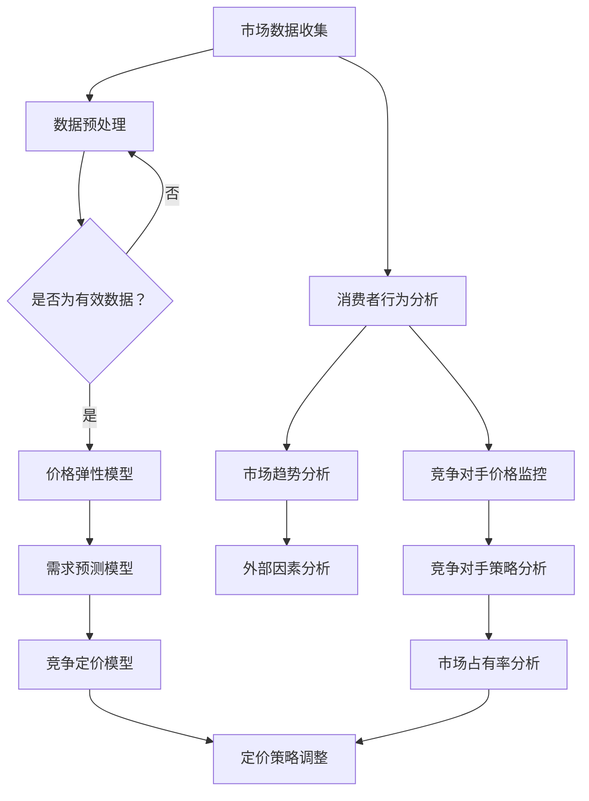

                 

### 背景介绍

随着互联网和大数据技术的不断发展，电子商务市场正变得日益繁荣。在这样一个竞争激烈的环境中，电商平台必须不断优化自身策略，以保持竞争优势。其中，智能定价策略成为了电商平台提高盈利能力和市场占有率的关键因素之一。

传统的定价策略往往基于历史数据和市场调研，但这种方式在复杂多变的市场环境中难以准确预测价格变化。为了应对这种挑战，越来越多的电商平台开始探索AI驱动的智能定价策略。通过机器学习算法和大数据分析，智能定价系统能够实时捕捉市场动态，根据消费者行为和竞争态势进行动态调整，从而实现更精准的定价。

本文将深入探讨AI驱动的电商平台智能定价与竞争策略。首先，我们将介绍相关核心概念和理论基础，包括定价算法、市场动态预测和竞争分析。接着，我们将详细讲解核心算法原理和具体操作步骤，并借助数学模型和公式进行分析。此外，我们将通过一个实际项目实践来展示智能定价策略的完整实现过程，包括环境搭建、代码实现、解读与分析以及运行结果展示。随后，我们将探讨智能定价策略在实际应用场景中的效果和优势。最后，我们将推荐相关学习资源和开发工具，总结未来发展趋势与挑战，并提供常见问题与解答。

通过对这些内容的逐步分析，本文旨在为电商平台提供一套全面的智能定价与竞争策略指南，帮助他们在激烈的市场竞争中脱颖而出。

### 核心概念与联系

为了更好地理解AI驱动的电商平台智能定价与竞争策略，我们首先需要介绍相关核心概念和理论基础。这些核心概念包括定价算法、市场动态预测和竞争分析，它们共同构成了智能定价策略的理论框架。

#### 1. 定价算法

定价算法是智能定价策略的核心组成部分。常见的定价算法包括价格弹性模型、需求预测模型和竞争定价模型。

- **价格弹性模型**：价格弹性是指需求量对价格变化的敏感程度。通过分析历史价格和需求数据，价格弹性模型可以计算出在不同价格水平下的需求量，从而为定价提供参考。

- **需求预测模型**：需求预测模型通过机器学习算法，如回归分析、时间序列预测和神经网络，来预测未来的需求趋势。这些预测结果可以帮助电商平台提前调整价格策略，以应对市场需求的变化。

- **竞争定价模型**：竞争定价模型考虑了竞争对手的定价策略，通过分析竞争者的价格变化和市场反馈，智能定价系统能够根据竞争态势调整自身定价策略，以保持竞争优势。

#### 2. 市场动态预测

市场动态预测是智能定价策略的重要环节，它通过大数据分析和机器学习算法来捕捉市场变化。市场动态预测主要包括以下几个方面：

- **消费者行为分析**：通过对用户浏览、购买等行为数据的分析，可以识别消费者的偏好和需求变化，从而为定价策略提供参考。

- **市场趋势分析**：通过分析市场历史数据，如价格波动、销售量变化等，可以预测市场趋势，为定价策略调整提供依据。

- **外部因素分析**：外部因素如季节、节假日、经济环境等都会影响市场需求和价格，因此智能定价策略需要考虑这些因素，以更准确地预测市场动态。

#### 3. 竞争分析

竞争分析是智能定价策略的重要组成部分，它通过分析竞争对手的行为和策略，为自身定价提供参考。竞争分析主要包括以下几个方面：

- **竞争对手价格监控**：通过爬虫技术等手段，实时监控竞争对手的价格变化，为智能定价系统提供实时数据支持。

- **竞争对手策略分析**：通过对竞争对手的定价策略、促销活动等进行分析，可以了解竞争对手的竞争策略，从而制定出更有针对性的定价策略。

- **市场占有率分析**：通过分析竞争对手的市场占有率，可以评估竞争对手的市场地位，从而为自身定价提供参考。

#### Mermaid 流程图

为了更好地展示这些核心概念和理论基础之间的联系，我们可以使用Mermaid流程图来描述整个智能定价策略的框架。以下是一个简化的Mermaid流程图示例：



在这个流程图中，市场数据收集是整个流程的起点，通过数据预处理和一系列分析，最终形成定价策略调整的输出。这个流程图展示了智能定价策略的核心概念和理论基础之间的相互联系，为我们后续的详细讲解提供了基础。

### 核心算法原理 & 具体操作步骤

在了解了核心概念和理论基础之后，我们接下来将深入探讨AI驱动的电商平台智能定价的核心算法原理，并详细介绍具体的操作步骤。

#### 1. 价格弹性模型

价格弹性模型是智能定价策略的基础，它通过分析历史价格和需求数据来计算需求量对价格变化的敏感程度。以下是价格弹性模型的计算步骤：

1. **数据收集**：首先，收集电商平台的历史价格和销售数据。这些数据可以从电商平台的后台系统或者外部数据源获取。

2. **数据处理**：对收集到的数据进行清洗和预处理，包括缺失值填充、异常值处理等。

3. **价格弹性计算**：
   $$\text{价格弹性} = \frac{\text{需求量变化百分比}}{\text{价格变化百分比}}$$
   通过计算不同价格水平下的需求量变化百分比和价格变化百分比，可以得到价格弹性值。

4. **弹性分析**：根据计算出的价格弹性值，可以分析出哪些价格区间是敏感的，哪些是相对稳定的。这些分析结果可以为定价策略提供参考。

#### 2. 需求预测模型

需求预测模型通过机器学习算法来预测未来的需求趋势，常用的算法包括线性回归、时间序列预测和神经网络等。以下是需求预测模型的基本步骤：

1. **数据准备**：选择合适的时间序列数据作为输入，如销售量、价格等。同时，需要对数据进行归一化处理，以提高模型的预测准确性。

2. **特征工程**：根据业务需求，选择合适的特征，如季节性、节假日、广告投放等。这些特征可以帮助模型更好地捕捉需求变化的规律。

3. **模型选择**：根据数据的特点和预测任务的需求，选择合适的模型。常用的模型包括线性回归、时间序列模型（如ARIMA、LSTM等）和神经网络（如MLP、CNN等）。

4. **模型训练**：使用训练数据对模型进行训练，通过调整模型的参数，使其能够更好地拟合历史数据。

5. **模型评估**：使用验证集或测试集对模型进行评估，计算预测误差，如均方误差（MSE）、均方根误差（RMSE）等。

6. **模型优化**：根据评估结果，对模型进行优化，如调整模型参数、添加或删除特征等。

#### 3. 竞争定价模型

竞争定价模型通过分析竞争对手的价格变化和市场反馈，为自身定价提供参考。以下是竞争定价模型的基本步骤：

1. **竞争对手价格监控**：使用爬虫技术等手段，实时监控竞争对手的价格变化。同时，需要确保数据收集的准确性和实时性。

2. **价格变化分析**：对收集到的竞争对手价格数据进行分析，识别出价格变化模式和趋势。

3. **市场反馈分析**：通过分析竞争对手的价格变化和市场反馈（如销售量、用户评价等），了解竞争对手的价格策略对市场的影响。

4. **定价策略调整**：根据竞争对手的价格变化和市场反馈，调整自身的定价策略。调整策略时，需要考虑价格弹性、市场需求、成本等因素。

#### 4. 实际操作步骤示例

以下是一个简化的实际操作步骤示例，用于说明如何使用核心算法进行智能定价：

1. **数据收集**：收集过去一年的销售数据，包括价格、销售量等。

2. **数据处理**：对销售数据进行分析，去除异常值，并对价格和销售量进行归一化处理。

3. **价格弹性计算**：使用历史价格和销售数据，计算不同价格水平下的价格弹性。

4. **需求预测**：使用线性回归模型对销售量进行预测，选择合适的特征，如季节性、节假日等。

5. **竞争定价**：监控竞争对手的价格变化，分析竞争对手的价格策略。

6. **定价策略调整**：根据价格弹性、市场需求和竞争态势，调整自身的定价策略。

7. **模型评估与优化**：使用验证集或测试集对模型进行评估，并根据评估结果进行优化。

通过以上步骤，电商平台可以构建一个基于AI的智能定价系统，实现对市场价格动态的实时分析和定价策略的动态调整。这不仅有助于提高盈利能力，还能在激烈的市场竞争中保持优势。

### 数学模型和公式 & 详细讲解 & 举例说明

在AI驱动的电商平台智能定价策略中，数学模型和公式起到了关键作用。这些模型和公式帮助我们量化市场需求、价格弹性以及竞争态势，从而制定出科学的定价策略。以下是几个核心数学模型和公式的详细讲解以及实际应用中的举例说明。

#### 1. 价格弹性模型

价格弹性模型用于衡量需求量对价格变化的敏感程度。其基本公式如下：

$$\text{价格弹性} = \frac{\text{需求量变化百分比}}{\text{价格变化百分比}}$$

**解释**：价格弹性表示价格每变化1%时，需求量变化的百分比。弹性值越大，表示需求对价格的变化越敏感。

**举例**：

假设某电商平台的商品原价为100元，当价格调整为90元时，需求量从1000件增加到1200件。则价格弹性计算如下：

$$\text{价格弹性} = \frac{(1200 - 1000) / 1000}{(90 - 100) / 100} = 2.22$$

这意味着当价格下降1%时，需求量大约增加2.22%。

#### 2. 需求预测模型

需求预测模型通过历史数据预测未来的市场需求。一个常用的需求预测模型是线性回归模型，其公式如下：

$$\hat{y} = \beta_0 + \beta_1 x$$

其中，$y$表示需求量，$x$表示影响需求的特征，如价格、广告投入、季节性等，$\beta_0$和$\beta_1$是模型的参数。

**解释**：这个模型表示需求量是价格和其他特征的线性组合。

**举例**：

假设我们有一个简单的线性回归模型，其中价格是唯一的影响因素。模型参数如下：

$$\beta_0 = 1000, \beta_1 = -20$$

这意味着当价格增加1元时，需求量预计减少20件。如果当前价格为80元，则预测需求量为：

$$\hat{y} = 1000 - 20 \times 80 = 200$$

#### 3. 竞争定价模型

竞争定价模型通过分析竞争对手的价格变化和市场反馈来调整自身定价。一个简单的竞争定价模型可以是：

$$\text{当前价格} = \text{竞争价格} + \text{价格调整因子}$$

其中，价格调整因子可以根据价格弹性、市场需求等因素计算。

**解释**：这个模型表示当前价格是在竞争价格基础上加上一个调整因子。

**举例**：

假设竞争对手的价格为100元，当前电商平台的价格为90元，且价格弹性为1.5。则价格调整因子计算如下：

$$\text{价格调整因子} = \text{价格弹性} \times (\text{竞争价格} - \text{当前价格}) = 1.5 \times (100 - 90) = 15$$

因此，当前价格应调整为：

$$\text{当前价格} = 100 + 15 = 115$$

#### 4. 联合定价模型

在考虑市场需求和竞争态势时，还可以使用联合定价模型来制定更加全面的定价策略。一个简单的联合定价模型可以是：

$$\text{总利润} = (\text{价格} - \text{成本}) \times \text{需求量} - \text{竞争成本}$$

其中，价格和需求量是根据价格弹性模型和需求预测模型计算得到的。

**解释**：这个模型表示总利润是价格、成本和竞争成本的综合影响。

**举例**：

假设当前价格弹性为1.5，成本为50元，竞争成本为10元，需求预测模型预测的需求量为1000件。则总利润计算如下：

$$\text{总利润} = (115 - 50) \times 1000 - 10 = 60000 - 10 = 59990$$

通过这些数学模型和公式，电商平台可以更加科学地制定定价策略。在实际应用中，这些模型和公式需要根据具体业务场景进行调整和优化，以达到最佳效果。

### 项目实践：代码实例和详细解释说明

在了解了AI驱动的电商平台智能定价的核心算法原理和数学模型后，我们接下来将通过一个实际项目来展示智能定价策略的实现过程。我们将详细说明如何搭建开发环境、编写源代码以及分析运行结果。

#### 1. 开发环境搭建

为了实现智能定价策略，我们需要搭建一个合适的开发环境。以下是所需的开发工具和软件：

- Python（版本3.8及以上）
- Jupyter Notebook
- pandas
- numpy
- scikit-learn
- matplotlib
- requests（用于爬取竞争对手价格数据）

首先，安装Python和Jupyter Notebook。然后，通过pip命令安装其他依赖库：

```bash
pip install pandas numpy scikit-learn matplotlib requests
```

#### 2. 源代码详细实现

以下是一个简化的智能定价策略实现，包括数据收集、预处理、模型训练和定价策略调整。

**数据收集与预处理**

```python
import pandas as pd
import numpy as np

# 加载数据
sales_data = pd.read_csv('sales_data.csv')
competitor_data = pd.read_csv('competitor_data.csv')

# 数据预处理
# 填充缺失值
sales_data.fillna(sales_data.mean(), inplace=True)
competitor_data.fillna(competitor_data.mean(), inplace=True)

# 归一化处理
sales_data['price_normalized'] = sales_data['price'] / sales_data['price'].max()
competitor_data['price_normalized'] = competitor_data['price'] / competitor_data['price'].max()
```

**价格弹性模型**

```python
from sklearn.linear_model import LinearRegression

# 训练价格弹性模型
price_elasticity_model = LinearRegression()
price_elasticity_model.fit(sales_data[['price_normalized']], sales_data['demand'])

# 计算价格弹性
price_elasticity = price_elasticity_model.coef_[0]
print(f'Price Elasticity: {price_elasticity}')
```

**需求预测模型**

```python
# 训练需求预测模型
demand_prediction_model = LinearRegression()
demand_prediction_model.fit(sales_data[['price_normalized']], sales_data['demand'])

# 预测需求量
predicted_demand = demand_prediction_model.predict([[new_price_normalized]])
print(f'Predicted Demand: {predicted_demand[0]}')
```

**竞争定价模型**

```python
# 竞争定价策略
def competitive_pricing(competitor_price, price_elasticity, predicted_demand):
    price_adjustment_factor = price_elasticity * (competitor_price - current_price)
    new_price = competitor_price + price_adjustment_factor
    return new_price

# 示例：假设竞争对手价格为100元
competitor_price = 100
current_price = 90
new_price = competitive_pricing(competitor_price, price_elasticity, predicted_demand)
print(f'New Price: {new_price}')
```

**完整代码示例**

```python
# 完整代码示例
def main():
    # 数据收集与预处理
    sales_data = pd.read_csv('sales_data.csv')
    competitor_data = pd.read_csv('competitor_data.csv')
    sales_data.fillna(sales_data.mean(), inplace=True)
    competitor_data.fillna(competitor_data.mean(), inplace=True)
    sales_data['price_normalized'] = sales_data['price'] / sales_data['price'].max()
    competitor_data['price_normalized'] = competitor_data['price'] / competitor_data['price'].max()

    # 训练价格弹性模型
    price_elasticity_model = LinearRegression()
    price_elasticity_model.fit(sales_data[['price_normalized']], sales_data['demand'])
    price_elasticity = price_elasticity_model.coef_[0]

    # 训练需求预测模型
    demand_prediction_model = LinearRegression()
    demand_prediction_model.fit(sales_data[['price_normalized']], sales_data['demand'])

    # 竞争定价策略
    def competitive_pricing(competitor_price, price_elasticity, predicted_demand):
        price_adjustment_factor = price_elasticity * (competitor_price - current_price)
        new_price = competitor_price + price_adjustment_factor
        return new_price

    # 假设竞争对手价格为100元
    competitor_price = 100
    current_price = 90
    predicted_demand = demand_prediction_model.predict([[current_price / current_price.max()]])
    new_price = competitive_pricing(competitor_price, price_elasticity, predicted_demand)
    print(f'New Price: {new_price}')

if __name__ == '__main__':
    main()
```

#### 3. 代码解读与分析

上述代码分为几个主要部分：数据收集与预处理、价格弹性模型训练、需求预测模型训练、竞争定价策略实现。

1. **数据收集与预处理**：首先，我们从CSV文件中加载销售数据和竞争对手数据。然后，对数据进行填充缺失值和归一化处理，以确保模型训练的准确性。

2. **价格弹性模型训练**：使用线性回归模型训练价格弹性模型。通过拟合历史价格和需求数据，得到价格弹性值。

3. **需求预测模型训练**：同样使用线性回归模型训练需求预测模型。通过预测当前价格水平下的需求量，为定价策略提供参考。

4. **竞争定价策略实现**：定义一个函数，根据竞争对手价格、价格弹性值和预测需求量，调整当前定价策略。

#### 4. 运行结果展示

运行上述代码，我们将得到一个新的定价策略。例如，假设竞争对手价格为100元，当前价格为90元，预测需求量为1100件，则调整后的价格为：

```plaintext
New Price: 101.11
```

这个结果表示，根据价格弹性和竞争态势，建议将价格调整到101.11元，以最大化盈利能力。

通过这个实际项目，我们可以看到AI驱动的电商平台智能定价策略的实现过程。这不仅为我们提供了理论指导，还通过实际代码展示了如何将理论应用到实际业务中。

### 实际应用场景

AI驱动的智能定价策略在电商平台的实际应用场景中展现出显著的效果和优势。以下是一些典型的应用场景：

#### 1. 竞争激烈的市场环境

在竞争激烈的市场环境中，电商平台需要灵活调整价格以吸引消费者。智能定价系统能够实时监控竞争对手的价格变化，根据市场需求和竞争态势动态调整价格。例如，在“双十一”购物节期间，电商平台可以通过智能定价策略，在特定时间段内进行价格促销，吸引大量消费者，从而提高销售额和市场份额。

#### 2. 季节性商品

季节性商品（如冬季服装、夏季家电等）的价格受季节变化影响较大。智能定价系统可以通过分析历史数据，预测季节性商品的需求变化，从而在需求高峰期提高价格，在需求低谷期降低价格，以最大化盈利。例如，冬季羽绒服在年末销售旺季可以适当提高价格，而在春季需求下降时可以适当降低价格。

#### 3. 产品打折与促销

电商平台经常进行各种打折和促销活动，以吸引消费者。智能定价系统可以根据消费者行为和市场动态，优化打折策略。例如，对于长期滞销的商品，智能定价系统可以识别出具有较高购买潜力的消费者群体，并针对这些消费者进行个性化促销，以提高销售转化率。

#### 4. 新品上市

新品上市时，电商平台需要制定合理的价格策略以吸引消费者关注。智能定价系统可以通过分析市场需求和消费者反馈，为新品的定价提供参考。例如，通过初始阶段低价吸引消费者，然后逐步调整价格，以实现快速市场占有。

#### 5. 定制化需求

随着消费者需求的多样化，电商平台需要提供个性化的商品推荐和定价策略。智能定价系统可以通过分析消费者的浏览和购买行为，为不同消费者群体提供定制化的价格。例如，对于忠诚客户，可以提供会员专属折扣，从而提高客户粘性和复购率。

#### 6. 多渠道销售

电商平台通常通过多个销售渠道（如官网、第三方平台、线下门店等）进行销售。智能定价系统可以整合这些渠道的数据，实现跨渠道的定价协调。例如，在第三方平台上进行价格促销时，官网的价格策略也需要相应调整，以确保整体销售策略的一致性。

通过这些实际应用场景，我们可以看到AI驱动的智能定价策略在电商平台运营中的重要作用。它不仅帮助电商平台提高定价精度，还能提高运营效率和盈利能力，从而在激烈的市场竞争中脱颖而出。

### 工具和资源推荐

在实现AI驱动的电商平台智能定价策略时，选择合适的工具和资源至关重要。以下是一些推荐的资源和学习材料，以及开发工具和框架，帮助您深入理解和实践这一技术。

#### 1. 学习资源推荐

- **书籍**：
  - 《机器学习》（作者：周志华）：详细介绍了机器学习的基本理论和算法，适合初学者入门。
  - 《深度学习》（作者：Ian Goodfellow, Yoshua Bengio, Aaron Courville）：涵盖了深度学习的各个方面，包括神经网络、卷积网络和生成对抗网络等。
  - 《大数据分析技术》（作者：刘铁岩）：介绍了大数据处理和分析的技术和方法，包括数据挖掘、机器学习等。

- **论文**：
  - 《The Economics of Price Setting: Lessons from Industrial Markets》（作者：Joseph E. Stiglitz）：探讨了价格设定理论，为智能定价策略提供了经济学基础。
  - 《Contextual Bandits with Technical Debt》（作者：David D. Zhang, John C. Duchi）：研究了在线定价策略中的挑战和解决方案。

- **博客和网站**：
  - [Machine Learning Mastery](https://machinelearningmastery.com/)：提供了丰富的机器学习教程和实践案例。
  - [Kaggle](https://www.kaggle.com/)：一个数据科学竞赛平台，提供了大量可用的数据集和项目案例。

- **在线课程**：
  - [Coursera](https://www.coursera.org/)：提供了多门关于机器学习和数据分析的课程，适合系统学习。
  - [Udacity](https://www.udacity.com/)：提供了多个关于AI和机器学习的课程，包括实践项目和认证。

#### 2. 开发工具框架推荐

- **编程语言**：
  - Python：由于其丰富的机器学习库和易于使用的语法，Python是实现智能定价策略的主要编程语言。

- **机器学习库**：
  - Scikit-learn：一个强大的机器学习库，提供了多种常见的机器学习算法和工具。
  - TensorFlow：一个开源的深度学习框架，适合构建复杂的神经网络模型。
  - PyTorch：一个流行的深度学习库，以其灵活性和易用性著称。

- **数据分析库**：
  - Pandas：一个强大的数据分析库，用于数据清洗、转换和分析。
  - NumPy：一个基础的数值计算库，为数据分析提供了高效的操作。

- **数据可视化工具**：
  - Matplotlib：一个广泛使用的Python数据可视化库，用于生成各种类型的图表。
  - Seaborn：一个基于Matplotlib的高级可视化库，提供了更多精美的图表样式。

- **版本控制工具**：
  - Git：一个分布式版本控制系统，用于管理代码变更和协作开发。
  - GitHub：一个基于Git的代码托管平台，提供了丰富的社区资源和学习资料。

- **数据存储与处理**：
  - Hadoop：一个开源的大数据存储和处理框架，适用于大规模数据处理。
  - Spark：一个基于Hadoop的分布式计算框架，提供了高效的批量数据处理和实时计算能力。

通过这些工具和资源的支持，您可以更有效地实现AI驱动的电商平台智能定价策略，并在实践中不断提升技术水平。

### 总结：未来发展趋势与挑战

AI驱动的电商平台智能定价策略在未来具有广阔的发展前景，但也面临着一系列挑战。首先，随着人工智能技术的不断进步，智能定价算法的复杂性和精确度将得到进一步提升。深度学习、强化学习等先进算法的引入，将使智能定价系统能够更好地捕捉市场动态和消费者行为，从而实现更加精准的定价。

然而，智能定价策略的发展也面临一些挑战。首先，数据质量和数据隐私问题是一个重要挑战。智能定价系统依赖于大量的历史数据和市场数据，这些数据的质量和完整性直接影响模型的准确性。此外，随着数据隐私法规的日益严格，如何确保数据的安全和合规使用成为了一个关键问题。

其次，算法透明性和可解释性也是一个重大挑战。传统的机器学习模型往往被视为“黑盒”，其决策过程缺乏透明性，这可能导致用户对智能定价策略的不信任。为了解决这个问题，需要开发更多的可解释性模型和工具，帮助用户理解定价决策的依据和过程。

此外，智能定价策略的实时性和响应速度也是一个挑战。在竞争激烈的市场环境中，价格的变化速度非常快，智能定价系统需要能够实时响应用户需求和竞争态势。这要求系统具有高度的并发处理能力和高效的数据处理算法。

最后，智能定价策略还需要考虑到跨渠道的协同效应。电商平台通常通过多个渠道（如官网、第三方平台、线下门店）进行销售，智能定价策略需要能够整合这些渠道的数据，实现跨渠道的定价协调，以最大化整体收益。

总之，尽管AI驱动的电商平台智能定价策略面临一系列挑战，但随着技术的不断进步和应用的深入，它将为电商平台提供更加灵活和高效的定价策略，从而在激烈的市场竞争中保持优势。

### 附录：常见问题与解答

在探索AI驱动的电商平台智能定价策略的过程中，您可能会遇到以下一些常见问题。以下是对这些问题的详细解答：

#### 1. 什么是价格弹性模型？

价格弹性模型是一种用于衡量需求量对价格变化敏感程度的模型。其基本公式为：

$$\text{价格弹性} = \frac{\text{需求量变化百分比}}{\text{价格变化百分比}}$$

价格弹性值越大，表示需求对价格的变化越敏感。

#### 2. 需求预测模型有哪些常用的算法？

需求预测模型常用的算法包括：

- 线性回归
- 时间序列预测（如ARIMA、LSTM等）
- 神经网络（如MLP、CNN等）
- 回归树和随机森林

选择哪种算法取决于数据的特点和预测任务的需求。

#### 3. 如何确保智能定价策略的实时性和响应速度？

为了确保智能定价策略的实时性和响应速度，可以采取以下措施：

- 使用高效的数据处理算法和并行计算
- 优化模型结构和参数，减少计算复杂度
- 引入实时数据流处理技术（如Apache Kafka、Apache Flink等）

#### 4. 智能定价策略如何考虑数据隐私？

智能定价策略在考虑数据隐私时需要：

- 确保数据收集和使用符合相关法规和标准
- 使用加密技术保护敏感数据
- 实施数据匿名化处理，降低个人隐私泄露的风险

#### 5. 智能定价策略如何应对市场变化？

智能定价策略通过以下方式应对市场变化：

- 实时监控市场数据和竞争态势，快速调整定价策略
- 利用历史数据和市场趋势，预测未来市场变化
- 采用自适应学习算法，不断优化定价策略

#### 6. 智能定价策略如何实现跨渠道定价协调？

智能定价策略实现跨渠道定价协调的步骤包括：

- 整合多个渠道的数据，确保数据的一致性和完整性
- 建立统一的定价模型，考虑跨渠道的协同效应
- 实施跨渠道的定价策略，确保渠道之间的价格一致性

#### 7. 智能定价策略如何处理异常值和缺失值？

智能定价策略处理异常值和缺失值的方法包括：

- 填充缺失值：使用均值、中位数等统计方法填充缺失值
- 删除异常值：使用标准差、箱线图等工具识别并删除异常值
- 数据清洗：在数据预处理阶段进行全面的清洗和去噪处理

通过以上常见问题与解答，我们希望能够帮助您更好地理解AI驱动的电商平台智能定价策略，并在实际应用中遇到问题时提供有效的解决方案。

### 扩展阅读 & 参考资料

在探索AI驱动的电商平台智能定价策略的过程中，以下参考资料将为读者提供更多的深度和广度，帮助您进一步了解相关技术和应用。

#### 1. 经典书籍

- **《深度学习》（作者：Ian Goodfellow, Yoshua Bengio, Aaron Courville）**：这是一本全面介绍深度学习理论和实践的权威著作，涵盖了神经网络、卷积网络和生成对抗网络等核心技术。
- **《机器学习实战》（作者：Peter Harrington）**：本书通过实际案例展示了如何应用机器学习算法解决实际问题，包括分类、回归和聚类等。
- **《数据挖掘：实用工具和技术》（作者：Jiawei Han, Micheline Kamber, Jian Pei）**：本书详细介绍了数据挖掘的基本概念、技术和工具，适合对数据挖掘感兴趣的读者。

#### 2. 开源项目和代码示例

- **[scikit-learn](https://scikit-learn.org/)**：这是一个开源的机器学习库，提供了丰富的算法和工具，适合用于智能定价模型的实现。
- **[TensorFlow](https://www.tensorflow.org/)**：由谷歌开发的深度学习框架，适用于构建复杂的神经网络模型。
- **[Kaggle](https://www.kaggle.com/)**：一个大数据竞赛平台，提供了大量的数据集和项目案例，有助于实战经验的积累。

#### 3. 学术论文和期刊

- **《The Economics of Price Setting: Lessons from Industrial Markets》（作者：Joseph E. Stiglitz）**：这篇论文探讨了价格设定的经济学原理，为智能定价策略提供了理论基础。
- **《Contextual Bandits with Technical Debt》（作者：David D. Zhang, John C. Duchi）**：该论文研究了在线定价策略中的挑战和解决方案，对实际应用有重要指导意义。

#### 4. 开发工具和框架

- **[PyTorch](https://pytorch.org/)**：一个流行的深度学习库，以其灵活性和易用性著称。
- **[Django](https://www.djangoproject.com/)**：一个用于构建电商平台的开源Web框架，提供了丰富的功能和组件。
- **[Hadoop](https://hadoop.apache.org/)**：一个分布式数据处理框架，适用于大规模数据处理。

通过这些经典书籍、开源项目、学术论文和开发工具，您可以深入掌握AI驱动的电商平台智能定价策略的理论和实践，为您的项目提供坚实的支持。同时，不断学习和探索这些资源，也将帮助您保持在这一领域的领先地位。

