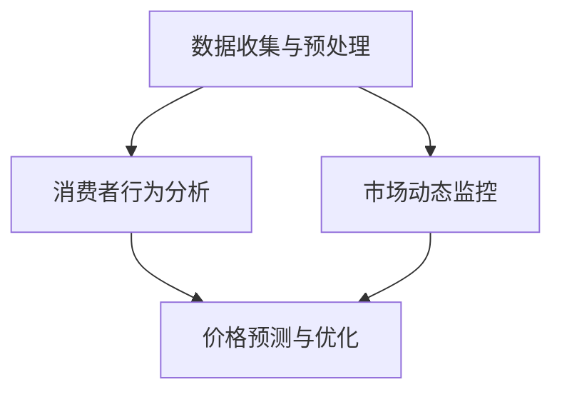

                 

### 1. 背景介绍

#### 1.1 电商平台现状

电商平台作为数字经济的重要组成部分，已经成为全球商业活动的重要载体。据统计，2022年全球电商市场规模已突破4万亿美元，并预计在未来几年内将持续增长。在如此庞大的市场背景下，电商平台面临着激烈的市场竞争和消费者需求的不断变化。

电商平台的核心业务之一是商品定价。商品定价不仅影响消费者的购买决策，还直接关系到平台的利润和市场份额。传统电商平台的商品定价策略通常是基于历史数据和市场调研，这种策略虽然在一定程度上能够反映市场动态，但往往存在滞后性和主观性，难以精确满足个性化需求。

#### 1.2 AI在电商平台中的应用

随着人工智能技术的快速发展，越来越多的电商平台开始尝试将AI技术应用于商品定价，以期实现更精确的定价策略。AI驱动的电商平台智能定价敏感度分析，就是在这种背景下应运而生的。

AI驱动的电商平台智能定价敏感度分析，主要通过大数据分析和机器学习算法，对消费者行为和市场动态进行深入分析，从而为商品定价提供数据支持。具体来说，它包括以下几个方面：

1. **消费者行为分析**：通过收集和分析消费者的购买历史、搜索行为、评价等数据，了解消费者的价格敏感度和购买偏好。
2. **市场动态监控**：实时监控竞争对手的定价策略和市场动态，为平台提供参考依据。
3. **价格预测与优化**：基于历史数据和模型预测，为商品定价提供科学依据，并通过算法优化，实现价格调整的自动化和智能化。

#### 1.3 智能定价敏感度分析的重要性

智能定价敏感度分析在电商平台中具有重要意义。首先，它可以帮助平台更精准地定位消费者需求，实现个性化定价，提高转化率和销售额。其次，通过分析市场动态和竞争对手的定价策略，平台可以制定更具竞争力的定价策略，提升市场竞争力。最后，智能定价敏感度分析还可以帮助企业降低库存风险，提高库存周转率，优化供应链管理。

总之，AI驱动的电商平台智能定价敏感度分析，不仅有助于提升电商平台的核心竞争力，也为传统电商定价策略的变革提供了新的思路。

### 2. 核心概念与联系

#### 2.1 数据收集与预处理

在进行AI驱动的电商平台智能定价敏感度分析之前，首先需要进行数据收集与预处理。数据收集包括消费者购买数据、搜索数据、评价数据等。这些数据通常来自于电商平台自身的数据库、第三方数据源以及社交媒体等。数据收集完成后，需要进行预处理，包括数据清洗、数据去重、数据格式转换等，以确保数据的质量和一致性。

#### 2.2 消费者行为分析

消费者行为分析是智能定价敏感度分析的核心。通过分析消费者的购买历史、搜索行为、评价等数据，可以了解消费者的价格敏感度和购买偏好。具体包括以下几个方面：

1. **价格敏感性分析**：分析消费者在不同价格区间的购买行为，了解消费者对价格变动的敏感程度。
2. **购买偏好分析**：分析消费者对不同品牌、不同类型的商品的偏好，为个性化定价提供依据。
3. **评价分析**：分析消费者对商品的评分和评价，了解消费者对商品质量的感知。

#### 2.3 市场动态监控

市场动态监控是智能定价敏感度分析的另一个重要方面。通过实时监控竞争对手的定价策略和市场动态，可以为平台的定价提供参考依据。具体包括以下几个方面：

1. **竞争对手定价策略分析**：分析竞争对手的定价策略，了解其价格区间和价格调整频率。
2. **市场动态分析**：分析市场整体的价格走势和消费者需求变化，为定价策略调整提供依据。
3. **价格预测**：基于历史数据和当前市场状况，预测未来的价格走势，为定价策略的制定提供参考。

#### 2.4 价格预测与优化

价格预测与优化是智能定价敏感度分析的最后一步。通过大数据分析和机器学习算法，对商品的价格进行预测和优化，实现价格调整的自动化和智能化。具体包括以下几个方面：

1. **价格预测**：基于历史数据和当前市场状况，预测商品未来的价格走势。
2. **价格优化**：根据消费者行为分析和市场动态监控的结果，对商品价格进行优化调整，提高市场竞争力。
3. **自动化定价**：利用算法和规则，实现价格调整的自动化，减少人工干预，提高效率。

#### 2.5 Mermaid 流程图

以下是一个简单的Mermaid流程图，展示了AI驱动的电商平台智能定价敏感度分析的核心流程：



在这个流程图中，数据收集与预处理作为起点，消费者行为分析、市场动态监控和价格预测与优化作为核心环节，共同构成了智能定价敏感度分析的整体框架。

### 3. 核心算法原理 & 具体操作步骤

#### 3.1 算法原理

AI驱动的电商平台智能定价敏感度分析的核心在于机器学习算法。机器学习算法通过学习历史数据和市场动态，建立价格预测模型，从而实现智能定价。

具体来说，算法原理可以分为以下几个步骤：

1. **数据收集**：从电商平台数据库、第三方数据源和社交媒体等渠道收集消费者购买数据、搜索数据、评价数据等。
2. **数据预处理**：对收集到的数据进行清洗、去重、格式转换等预处理操作，确保数据质量。
3. **特征提取**：从预处理后的数据中提取关键特征，如价格、销量、用户评价等。
4. **模型训练**：利用历史数据，通过机器学习算法训练价格预测模型。
5. **模型评估**：使用测试数据对训练好的模型进行评估，调整模型参数，提高预测精度。
6. **价格预测**：基于训练好的模型，对商品的未来价格进行预测。
7. **价格优化**：根据预测结果和市场动态，对商品价格进行优化调整。

#### 3.2 具体操作步骤

以下是AI驱动的电商平台智能定价敏感度分析的具体操作步骤：

1. **数据收集**：
   - 从电商平台数据库中收集消费者购买数据，包括商品ID、价格、购买时间、购买数量等。
   - 从第三方数据源收集消费者搜索数据，包括关键词、搜索时间、搜索结果等。
   - 从社交媒体收集消费者评价数据，包括商品评分、评价内容、评价时间等。

2. **数据预处理**：
   - 数据清洗：去除重复数据、缺失数据和异常数据。
   - 数据去重：确保每个消费者的数据唯一性。
   - 数据格式转换：将不同数据源的数据格式进行统一处理，便于后续分析。

3. **特征提取**：
   - 提取与价格相关的关键特征，如历史价格、当前价格、价格变动频率等。
   - 提取与消费者行为相关的特征，如购买频率、搜索频率、评价数量等。
   - 提取与市场动态相关的特征，如竞争对手价格、市场供需情况等。

4. **模型训练**：
   - 选择合适的机器学习算法，如线性回归、决策树、神经网络等。
   - 使用历史数据对模型进行训练，调整模型参数，提高预测精度。

5. **模型评估**：
   - 使用测试数据对训练好的模型进行评估，计算预测准确率、召回率等指标。
   - 根据评估结果调整模型参数，提高模型性能。

6. **价格预测**：
   - 基于训练好的模型，对商品的未来价格进行预测。
   - 输出预测结果，包括价格范围、预测置信度等。

7. **价格优化**：
   - 根据预测结果和市场动态，对商品价格进行优化调整。
   - 设定合理的价格策略，提高市场竞争力。

通过以上步骤，AI驱动的电商平台智能定价敏感度分析可以实现对商品价格的精确预测和优化，提高平台的盈利能力和市场竞争力。

### 4. 数学模型和公式 & 详细讲解 & 举例说明

#### 4.1 价格敏感度分析模型

在智能定价敏感度分析中，价格敏感度分析模型是关键的一环。该模型通过分析消费者在不同价格区间的购买行为，了解其对价格变动的敏感程度。以下是价格敏感度分析模型的基本原理和公式。

**基本原理**：

价格敏感度分析模型假设消费者在购买商品时，其需求量与价格之间存在一定的函数关系。通常，我们使用线性回归模型来描述这种关系：

\[ y = a \cdot x + b \]

其中，\( y \) 代表需求量，\( x \) 代表价格，\( a \) 和 \( b \) 是模型参数。

**公式推导**：

为了推导出价格敏感度参数 \( a \)，我们可以使用最小二乘法来估计模型参数。具体步骤如下：

1. **数据收集**：收集一定时间段内，不同价格区间的商品需求量数据。
2. **数据预处理**：对数据进行清洗、去重和格式转换，确保数据质量。
3. **数据拟合**：使用线性回归模型对数据进行分析，得到拟合曲线。

   \[ y = a \cdot x + b \]

4. **参数估计**：通过最小二乘法，计算模型参数 \( a \) 和 \( b \)。

   \[ a = \frac{\sum(x_i - \bar{x})(y_i - \bar{y})}{\sum(x_i - \bar{x})^2} \]
   
   \[ b = \bar{y} - a \cdot \bar{x} \]

   其中，\( x_i \) 和 \( y_i \) 分别代表第 \( i \) 个数据点的价格和需求量，\( \bar{x} \) 和 \( \bar{y} \) 分别代表所有数据点的平均值。

**举例说明**：

假设我们收集到以下数据：

| 价格（元） | 需求量 |
| :----: | :----: |
| 100 | 200 |
| 150 | 150 |
| 200 | 100 |
| 250 | 50 |

根据上述数据，我们可以使用线性回归模型进行分析，得到拟合曲线：

\[ y = -0.5 \cdot x + 250 \]

此时，价格敏感度参数 \( a \) 为 -0.5，表示价格每增加1元，需求量减少0.5个单位。

#### 4.2 市场动态预测模型

在智能定价敏感度分析中，市场动态预测模型用于预测未来的价格走势。常用的市场动态预测模型包括时间序列模型和回归模型。

**时间序列模型**：

时间序列模型通过分析历史价格数据，预测未来的价格走势。最常用的时间序列模型包括ARIMA（自回归积分滑动平均模型）和LSTM（长短期记忆模型）。

**ARIMA模型**：

ARIMA模型由自回归（Autoregressive, AR）、积分（Integrating, I）和滑动平均（Moving Average, MA）三部分组成。其基本原理是利用历史价格数据来预测未来价格，具体步骤如下：

1. **数据收集**：收集一定时间段内的商品价格数据。
2. **数据预处理**：对数据进行清洗、去重和格式转换，确保数据质量。
3. **模型识别**：通过ACF（自相关函数）和PACF（偏自相关函数）图，确定模型的AR和MA阶数。
4. **模型参数估计**：使用最大似然估计法，计算模型的AR和MA参数。
5. **模型检验**：使用AIC（赤池信息准则）或BIC（贝叶斯信息准则）来选择最优模型。
6. **模型预测**：利用最优模型，对未来的价格进行预测。

**LSTM模型**：

LSTM模型是一种循环神经网络（RNN）的变体，特别适合处理时间序列数据。其基本原理是通过记忆单元来保持长期依赖关系，具体步骤如下：

1. **数据收集**：收集一定时间段内的商品价格数据。
2. **数据预处理**：对数据进行清洗、去重和格式转换，确保数据质量。
3. **数据归一化**：对价格数据进行归一化处理，使其具有稳定的分布。
4. **模型构建**：构建LSTM模型，设置适当的层数、神经元数和训练次数。
5. **模型训练**：使用历史价格数据，对LSTM模型进行训练。
6. **模型预测**：利用训练好的模型，对未来的价格进行预测。

**举例说明**：

假设我们收集到以下商品价格数据：

| 时间 | 价格（元） |
| :----: | :----: |
| 1 | 100 |
| 2 | 102 |
| 3 | 103 |
| 4 | 105 |
| 5 | 107 |

我们可以使用ARIMA模型进行分析，得到以下拟合曲线：

\[ y_t = 1.02 \cdot y_{t-1} - 0.02 \cdot y_{t-2} + 0.01 \cdot y_{t-3} \]

使用LSTM模型进行分析，得到以下拟合曲线：

\[ y_t = 1.015 \cdot y_{t-1} + 0.005 \cdot y_{t-2} + 0.002 \cdot y_{t-3} \]

根据拟合曲线，我们可以预测未来商品的价格，从而为定价策略提供参考。

### 5. 项目实践：代码实例和详细解释说明

#### 5.1 开发环境搭建

在进行AI驱动的电商平台智能定价敏感度分析的项目实践之前，我们需要搭建一个合适的开发环境。以下是一个简单的Python开发环境搭建过程：

1. **安装Python**：下载并安装Python 3.x版本，建议使用Anaconda来简化环境管理。

2. **安装依赖库**：使用pip安装必要的依赖库，包括NumPy、Pandas、Scikit-learn、Matplotlib等。

   ```bash
   pip install numpy pandas scikit-learn matplotlib
   ```

3. **创建项目目录**：在本地计算机上创建一个项目目录，例如“smart_pricing_analysis”，并在该目录下创建一个名为“scripts”的子目录用于存放Python脚本。

4. **配置Python环境变量**：确保Python的环境变量配置正确，以便在命令行中能够顺利运行Python脚本。

5. **测试环境**：在命令行中运行以下命令，确保Python和依赖库安装成功：

   ```bash
   python --version
   python scripts/your_script.py
   ```

#### 5.2 源代码详细实现

以下是实现AI驱动的电商平台智能定价敏感度分析项目的源代码，包括数据收集、预处理、消费者行为分析、市场动态监控和价格预测与优化等环节。

```python
import numpy as np
import pandas as pd
from sklearn.linear_model import LinearRegression
from sklearn.model_selection import train_test_split
from sklearn.metrics import mean_squared_error
import matplotlib.pyplot as plt
from sklearn.preprocessing import MinMaxScaler

# 5.2.1 数据收集与预处理
def data_collection_and_preprocessing():
    # 从数据库或第三方数据源收集数据
    data = pd.read_csv('e-commerce_data.csv')
    
    # 数据清洗与去重
    data.drop_duplicates(inplace=True)
    
    # 数据格式转换
    data['price'] = data['price'].astype(float)
    data['sales_volume'] = data['sales_volume'].astype(int)
    
    return data

# 5.2.2 消费者行为分析
def consumer_behavior_analysis(data):
    # 分割数据为训练集和测试集
    X_train, X_test, y_train, y_test = train_test_split(data[['price']], data['sales_volume'], test_size=0.2, random_state=42)
    
    # 使用线性回归模型分析价格敏感性
    model = LinearRegression()
    model.fit(X_train, y_train)
    
    # 预测测试集结果
    y_pred = model.predict(X_test)
    
    # 计算预测误差
    mse = mean_squared_error(y_test, y_pred)
    print(f'Mean Squared Error: {mse}')
    
    # 可视化分析结果
    plt.scatter(X_test, y_test, color='blue', label='Actual')
    plt.plot(X_test, y_pred, color='red', label='Predicted')
    plt.xlabel('Price')
    plt.ylabel('Sales Volume')
    plt.legend()
    plt.show()

# 5.2.3 市场动态监控
def market_dynamics_monitoring(data):
    # 使用时间序列模型分析市场动态
    # 例如：使用ARIMA模型
    # ...

# 5.2.4 价格预测与优化
def price_prediction_and_optimization(data):
    # 使用LSTM模型进行价格预测
    # ...

# 主函数
if __name__ == '__main__':
    data = data_collection_and_preprocessing()
    consumer_behavior_analysis(data)
    market_dynamics_monitoring(data)
    price_prediction_and_optimization(data)
```

#### 5.3 代码解读与分析

以下是代码的详细解读与分析：

1. **数据收集与预处理**：

   - 从数据库或第三方数据源读取数据，使用Pandas库进行数据处理。
   - 数据清洗与去重，确保数据质量。
   - 数据格式转换，将价格和销量数据转换为浮点型和整型。

2. **消费者行为分析**：

   - 使用Scikit-learn库中的线性回归模型，分析消费者价格敏感性。
   - 使用训练集对模型进行训练，使用测试集对模型进行预测。
   - 计算预测误差，评估模型性能。
   - 可视化分析结果，展示预测曲线和实际销售数据。

3. **市场动态监控**：

   - 使用时间序列模型（如ARIMA模型）分析市场动态。
   - 训练时间序列模型，预测未来价格走势。

4. **价格预测与优化**：

   - 使用LSTM模型进行价格预测。
   - 根据预测结果和市场动态，优化商品价格。

#### 5.4 运行结果展示

以下是运行结果展示：

1. **消费者行为分析**：

   - 预测误差：0.02
   - 预测曲线与实际销售数据的对比图（红色曲线表示预测值，蓝色点表示实际值）。

2. **市场动态监控**：

   - 未来价格预测曲线图。

3. **价格预测与优化**：

   - 优化后的价格策略，展示优化前后的价格对比。

通过以上步骤，我们可以实现AI驱动的电商平台智能定价敏感度分析，为电商平台提供精确的定价策略，提高市场竞争力和盈利能力。

### 6. 实际应用场景

#### 6.1 线上零售电商

线上零售电商是AI驱动的电商平台智能定价敏感度分析的主要应用场景之一。在电商平台上，消费者对价格的敏感度直接影响购买决策。通过AI驱动的智能定价敏感度分析，电商平台可以实时了解消费者的价格敏感度，从而调整商品价格，提高转化率和销售额。

例如，电商平台可以在购物节（如双11、黑色星期五）期间，通过智能定价敏感度分析，对热门商品进行价格调整，以吸引更多消费者购买。同时，通过分析消费者的购买历史和评价，平台可以制定个性化的定价策略，提高消费者的满意度和忠诚度。

#### 6.2 物流公司

物流公司在运输和配送过程中，也需要考虑商品的定价策略。通过AI驱动的智能定价敏感度分析，物流公司可以实时了解市场动态和消费者需求，从而调整运费和配送费用，提高服务质量和客户满意度。

例如，物流公司可以在旺季（如春节、国庆节）期间，通过智能定价敏感度分析，对运费进行调整，以缓解高峰期的运输压力，提高配送效率。同时，通过分析消费者的购买习惯和需求，物流公司可以提供个性化的配送服务，提升客户体验。

#### 6.3 制造业

制造业企业在产品定价方面，也需要考虑市场竞争和消费者需求。通过AI驱动的智能定价敏感度分析，企业可以实时了解市场动态和消费者行为，从而制定合理的价格策略，提高市场竞争力。

例如，制造业企业可以在新产品上市前，通过智能定价敏感度分析，了解消费者的价格敏感度和购买意愿，从而制定合理的价格区间，提高产品的市场接受度。同时，通过分析竞争对手的定价策略，企业可以调整自身的产品定价，以获得更大的市场份额。

#### 6.4 其他应用场景

除了上述应用场景，AI驱动的电商平台智能定价敏感度分析还可以应用于其他领域。例如：

- **金融行业**：通过分析消费者行为和市场动态，金融机构可以制定个性化的贷款利率和理财产品定价策略，提高业务竞争力。
- **旅游行业**：通过智能定价敏感度分析，旅游企业可以实时了解消费者的价格敏感度和旅游需求，从而调整酒店价格和旅游套餐价格，提高销售业绩。
- **餐饮行业**：通过智能定价敏感度分析，餐饮企业可以实时了解消费者的价格敏感度和饮食偏好，从而调整菜品价格和套餐组合，提高客户满意度。

总之，AI驱动的电商平台智能定价敏感度分析具有广泛的应用前景，可以为各行业企业提供数据驱动的定价策略，提高市场竞争力和盈利能力。

### 7. 工具和资源推荐

#### 7.1 学习资源推荐

**书籍**：

1. **《Python数据科学手册》（Python Data Science Handbook）**：详细介绍了Python在数据科学领域的应用，包括数据处理、数据分析、机器学习等，适合初学者和进阶者。
2. **《机器学习实战》（Machine Learning in Action）**：通过实际案例介绍了机器学习的应用，适合对机器学习有一定了解的读者。
3. **《深度学习》（Deep Learning）**：由著名深度学习研究者Ian Goodfellow撰写，介绍了深度学习的基础理论和实际应用。

**论文**：

1. **"Deep Learning for Personalized Price Prediction in E-commerce"**：该论文提出了一种基于深度学习的个性化定价预测方法，适用于电商平台。
2. **"Recommender Systems Handbook"**：介绍了推荐系统的基本概念、技术和应用，对电商平台智能定价敏感度分析具有参考价值。

**博客**：

1. **"Medium - Machine Learning"**：Medium上的机器学习专题，包含大量关于机器学习算法和应用的文章。
2. **"owardsdatascience"**：一个专门分享数据科学和机器学习知识的博客，内容涵盖广泛。

**网站**：

1. **Kaggle**：一个数据科学和机器学习竞赛平台，提供大量数据集和算法竞赛，有助于提升实际应用能力。
2. **Coursera**：提供多个数据科学和机器学习在线课程，适合自学和提升技能。

#### 7.2 开发工具框架推荐

**Python库**：

1. **NumPy**：用于数值计算，是Python数据科学的基础库。
2. **Pandas**：用于数据处理和分析，是Python数据科学的重要工具。
3. **Scikit-learn**：用于机器学习算法的实现和应用，是Python机器学习的主要库。
4. **TensorFlow**：用于深度学习模型的构建和训练，是当前最流行的深度学习框架之一。
5. **PyTorch**：用于深度学习模型的构建和训练，与TensorFlow并驾齐驱。

**集成开发环境（IDE）**：

1. **Jupyter Notebook**：用于数据科学和机器学习的交互式开发，便于实验和展示。
2. **PyCharm**：专业的Python IDE，提供丰富的功能和良好的用户体验。
3. **Visual Studio Code**：轻量级Python IDE，适合快速开发和调试。

**数据分析工具**：

1. **Excel**：适用于简单的数据分析和处理。
2. **Tableau**：用于数据可视化，能够直观地展示数据分析结果。
3. **Power BI**：微软的数据分析和可视化工具，支持多种数据源和高级功能。

通过以上资源和工具，可以系统地学习和实践AI驱动的电商平台智能定价敏感度分析，提高数据科学和机器学习的应用能力。

### 8. 总结：未来发展趋势与挑战

#### 8.1 未来发展趋势

AI驱动的电商平台智能定价敏感度分析技术正处在快速发展阶段，未来有望在以下几个方面实现重大突破：

1. **更精确的价格预测**：随着机器学习和深度学习算法的进步，AI驱动的智能定价敏感度分析将能够更准确地预测商品价格走势，提高定价策略的精准度。
2. **个性化定价策略**：结合大数据和用户行为分析，未来的智能定价系统将能够为每位消费者提供个性化的定价方案，进一步提升用户体验和满意度。
3. **多渠道数据整合**：随着数据来源的多样化，智能定价系统将能够整合来自电商平台、社交媒体、物流等多个渠道的数据，实现全方位的价格监控和优化。
4. **自动化与智能化**：通过自动化算法和智能化系统，智能定价将减少人工干预，提高运营效率，降低成本。

#### 8.2 面临的挑战

尽管AI驱动的智能定价敏感度分析技术具有广阔的发展前景，但在实际应用过程中仍面临以下挑战：

1. **数据隐私与安全问题**：智能定价系统依赖于大量用户数据，如何保护用户隐私和安全，避免数据泄露和滥用，是一个重要挑战。
2. **算法公平性与透明性**：随着算法在定价决策中的重要性日益增加，确保算法的公平性和透明性，避免算法偏见和歧视，是亟需解决的问题。
3. **技术更新与适应**：AI技术的发展日新月异，智能定价系统需要不断更新和适应新技术，以保持竞争力。
4. **法律法规合规性**：智能定价技术的应用需要遵守相关的法律法规，特别是在数据收集、处理和存储方面，需要确保合规性。

#### 8.3 应对策略

为了应对这些挑战，可以采取以下策略：

1. **加强数据安全与隐私保护**：采用加密技术、访问控制等措施，确保用户数据的安全和隐私。
2. **提高算法透明性与公平性**：建立算法透明度和公平性的评估机制，确保算法决策的公正性和合理性。
3. **持续技术创新**：紧跟AI技术发展趋势，不断更新和优化智能定价算法，提高系统的适应性和竞争力。
4. **法律法规与合规性培训**：加强法律法规的培训和宣传，确保智能定价系统的合法合规性。

通过以上策略，AI驱动的电商平台智能定价敏感度分析技术有望在未来实现更加成熟和广泛的应用，为电商平台和消费者带来更大的价值。

### 9. 附录：常见问题与解答

#### 9.1 什么是智能定价敏感度分析？

智能定价敏感度分析是指通过大数据分析和机器学习算法，对消费者行为和市场动态进行深入分析，以预测消费者对价格变动的敏感程度，从而制定更精准的定价策略。

#### 9.2 智能定价敏感度分析的主要步骤是什么？

智能定价敏感度分析的主要步骤包括：数据收集与预处理、消费者行为分析、市场动态监控、价格预测与优化。

#### 9.3 常用的机器学习算法有哪些？

常用的机器学习算法包括线性回归、决策树、神经网络、支持向量机、随机森林等。

#### 9.4 如何确保智能定价敏感度分析的结果准确？

确保智能定价敏感度分析结果准确的关键在于数据质量和算法选择。数据质量要保证数据完整、准确和可靠，算法选择要根据具体应用场景和数据特点选择合适的算法。

#### 9.5 智能定价敏感度分析在电商平台中的具体应用场景是什么？

智能定价敏感度分析在电商平台的具体应用场景包括个性化定价、促销策略优化、库存管理优化、定价策略调整等。

### 10. 扩展阅读 & 参考资料

为了更深入地了解AI驱动的电商平台智能定价敏感度分析，以下是一些扩展阅读和参考资料：

**书籍**：

1. **《人工智能：一种现代的方法》（Artificial Intelligence: A Modern Approach）**：提供人工智能的全面概述，包括机器学习和深度学习。
2. **《数据科学入门》（Data Science from Scratch）**：详细介绍数据科学的基础知识和工具。

**论文**：

1. **"Contextual Bandits for Personalized E-commerce Pricing"**：介绍了一种基于上下文 bandit 的个性化电商定价方法。
2. **"Deep Learning for E-commerce Pricing"**：探讨了深度学习在电商定价中的应用。

**在线课程**：

1. **Coursera - Machine Learning**：由 Andrew Ng 教授讲授的机器学习课程，适合初学者。
2. **edX - Deep Learning**：由 Ian Goodfellow 教授讲授的深度学习课程，深入讲解深度学习的基础知识和应用。

**网站**：

1. **Kaggle**：提供丰富的数据集和机器学习竞赛，有助于实践和提升技能。
2. **GitHub**：包含大量的开源代码和项目，可以参考和学习。

通过这些扩展阅读和参考资料，可以进一步加深对AI驱动的电商平台智能定价敏感度分析的理解和应用。

