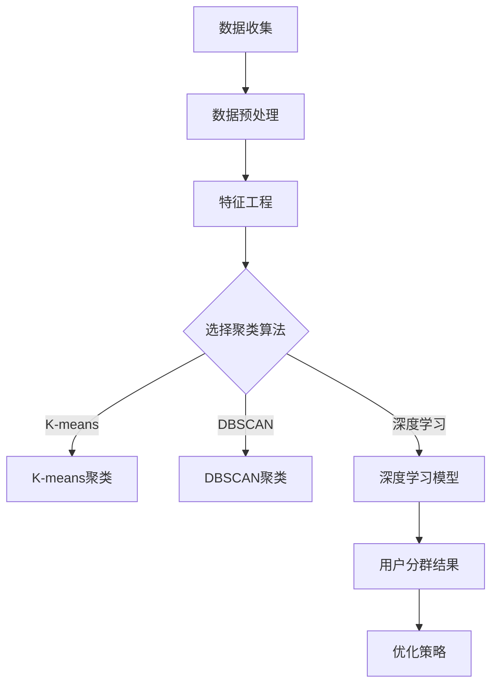

                 

### 1. 背景介绍

随着互联网和大数据技术的发展，电商平台在商业环境中扮演着越来越重要的角色。这些平台通过提供丰富的商品信息和便捷的购物体验，极大地改变了人们的消费习惯。然而，电商平台面对的用户群体是多样化的，每个用户的行为特征、偏好和需求各不相同。为了更好地满足不同用户的需求，提高用户体验和销售转化率，电商平台需要实施精准的用户分群策略。

用户分群（User Segmentation）是一种通过数据分析方法将用户群体划分为若干个具有相似特征和行为的子集的过程。这种策略可以帮助电商平台理解用户的不同需求，优化营销策略，提升用户满意度和忠诚度。传统的用户分群方法主要依赖于统计和机器学习技术，如聚类分析、因子分析等。然而，随着人工智能（AI）技术的发展，特别是深度学习和自然语言处理技术的应用，用户分群策略也迎来了新的发展。

AI驱动的用户分群策略利用了AI技术强大的数据处理和模式识别能力，能够在更大规模和更复杂的数据背景下实现更精准的用户分群。这种策略不仅能够识别出用户表面的行为特征，还能挖掘用户深层次的需求和偏好，从而实现个性化推荐、精准营销等应用。

本文旨在探讨AI驱动的电商平台用户分群策略的核心概念、原理和实现方法。首先，我们将介绍用户分群的基本概念和目的，然后深入分析AI技术在用户分群中的应用，特别是深度学习和自然语言处理技术的优势。接下来，我们将介绍一种具体的AI用户分群算法，并详细讲解其原理和操作步骤。随后，我们将探讨用户分群在电商平台的具体应用场景，如个性化推荐、精准营销和用户流失预测等。文章还将推荐一些相关工具和资源，以帮助读者更深入地了解和学习这一领域。最后，我们将总结AI驱动用户分群策略的未来发展趋势和挑战，并给出一些常见问题的解答。

通过本文的阅读，读者将能够全面了解AI驱动的电商平台用户分群策略的原理和实现，掌握相关技术和方法，并为未来的研究和实践提供指导和参考。

### 2. 核心概念与联系

#### 用户分群（User Segmentation）

用户分群是一种通过数据分析技术将用户群体划分成若干具有相似特征和行为模式的子集的过程。其核心目的是通过理解不同用户群体的需求和偏好，从而优化电商平台的服务和营销策略。用户分群的关键概念包括以下几个方面：

- **用户特征（User Characteristics）**：用户特征是指用于描述用户属性的各种信息，如年龄、性别、地理位置、购买历史、浏览行为等。这些特征是进行用户分群的基础数据。
- **相似性度量（Similarity Measure）**：相似性度量是指用于评估用户之间相似程度的指标。常见的相似性度量方法包括欧几里得距离、余弦相似度、Jaccard相似度等。
- **聚类算法（Clustering Algorithm）**：聚类算法是一种无监督学习方法，用于将数据集自动划分为多个类别或簇。常见的聚类算法包括K-means、层次聚类（Hierarchical Clustering）、DBSCAN等。

#### 人工智能（AI）技术

人工智能（AI）是指通过计算机模拟人类智能行为的技术。AI技术包括多个子领域，如机器学习、深度学习、自然语言处理、计算机视觉等。AI技术在用户分群中的应用主要表现在以下几个方面：

- **机器学习（Machine Learning）**：机器学习是一种通过训练模型从数据中自动发现规律和模式的方法。在用户分群中，机器学习算法可以自动分析用户特征，识别不同用户群体之间的相似性和差异性。
- **深度学习（Deep Learning）**：深度学习是机器学习的一个分支，通过多层神经网络模型进行数据分析和模式识别。深度学习在用户分群中的应用可以显著提高模型的复杂度和准确性。
- **自然语言处理（Natural Language Processing, NLP）**：自然语言处理是人工智能的一个子领域，用于使计算机理解和生成自然语言。在用户分群中，NLP技术可以帮助分析用户评论、反馈等非结构化数据，挖掘用户的情感和需求。

#### 用户分群与AI技术的联系

用户分群与AI技术之间的联系体现在以下几个方面：

1. **数据驱动：** 用户分群依赖于大量的用户数据，AI技术提供了强大的数据处理和分析能力，可以高效地处理大规模、多维度的数据。
2. **模式识别：** AI技术，尤其是深度学习和自然语言处理技术，能够从数据中发现复杂的模式，提高用户分群的准确性和精度。
3. **实时性：** AI技术可以实现实时用户分群，根据用户的实时行为和反馈动态调整分群策略，提高用户体验和营销效果。

#### Mermaid 流程图

以下是一个简单的Mermaid流程图，展示了用户分群的基本流程和与AI技术的联系：



在这个流程图中，用户分群的过程从数据收集开始，经过数据预处理、特征工程，然后根据不同的聚类算法（如K-means、DBSCAN或深度学习）进行用户分群，最后根据分群结果优化策略。

通过上述介绍，我们可以看出，用户分群与AI技术之间有着紧密的联系。AI技术的引入不仅提高了用户分群的效果和效率，也为电商平台提供了更精准的用户理解和营销策略。

### 3. 核心算法原理 & 具体操作步骤

在了解了用户分群的基本概念和AI技术的应用之后，接下来我们将深入探讨一种具体的AI用户分群算法——K-means聚类算法。K-means聚类算法是一种经典的迭代聚类方法，通过将数据点划分到K个簇中，使得每个簇内的数据点彼此之间距离较近，而不同簇之间的数据点距离较远。以下是K-means聚类算法的原理和具体操作步骤。

#### K-means聚类算法原理

K-means聚类算法的核心思想是：给定一个包含N个数据点的数据集，通过迭代优化过程，将这N个数据点划分到K个簇中，使得每个簇内的数据点之间的平均距离最小。具体来说，算法包括以下几个关键步骤：

1. **初始化：** 随机选择K个初始中心点，每个中心点代表一个簇。
2. **分配：** 对于每个数据点，根据其到各个中心点的距离，将其分配到距离最近的中心点所代表的簇中。
3. **更新：** 根据新的聚类结果，重新计算每个簇的中心点。
4. **迭代：** 重复步骤2和步骤3，直到满足停止条件（如收敛条件或最大迭代次数）。

#### 具体操作步骤

下面是一个详细的K-means聚类算法的操作步骤：

1. **数据预处理：**
   在开始聚类之前，需要将数据集进行预处理，包括数据清洗、缺失值填充、数据标准化等操作。数据预处理的主要目的是减少噪声和提高聚类效果。

   ```mermaid
   graph TB
       A[数据预处理] --> B[数据清洗]
       B --> C[缺失值填充]
       C --> D[数据标准化]
   ```

2. **初始化中心点：**
   随机选择K个数据点作为初始中心点。这可以通过随机抽样或利用现有聚类算法（如K-medoids）的结果来实现。

   ```mermaid
   graph TB
       E[初始化中心点] --> F{随机抽样}
       E -->|K-medoids| G[K-medoids]
   ```

3. **分配数据点：**
   对于每个数据点，计算其到各个中心点的距离，并将其分配到距离最近的中心点所代表的簇中。可以使用欧几里得距离或其他相似性度量方法来计算距离。

   ```mermaid
   graph TB
       H[分配数据点] --> I{计算距离}
       I --> J[分配簇]
   ```

4. **更新中心点：**
   根据新的聚类结果，重新计算每个簇的中心点。这通常是通过计算簇内所有数据点的平均值来实现。

   ```mermaid
   graph TB
       K[更新中心点] --> L{计算平均值}
   ```

5. **迭代优化：**
   重复步骤3和步骤4，直到满足停止条件。常见的停止条件包括：
   - 达到最大迭代次数
   - 中心点之间的距离变化小于某个阈值
   - 数据点分配不再变化

   ```mermaid
   graph TB
       M[迭代优化] --> N{判断停止条件}
   ```

#### K-means聚类算法示例

假设我们有一个包含5个数据点的数据集，我们需要将其分为2个簇。以下是K-means聚类算法的详细步骤：

1. **初始化中心点：**
   随机选择2个数据点作为初始中心点，例如选择数据点[1, 1]和[5, 5]。

2. **分配数据点：**
   根据每个数据点到两个中心点的距离，将数据点分配到最近的中心点所代表的簇中。初始分配结果如下：

   | 数据点 | 距离到中心点[1, 1] | 距离到中心点[5, 5] | 分配到的簇 |
   | ------ | ----------------- | ----------------- | --------- |
   | [1, 1] | 0                 | 4                 | 簇1        |
   | [2, 2] | 1                 | 3                 | 簇1        |
   | [3, 3] | 2                 | 2                 | 簇1        |
   | [4, 4] | 3                 | 1                 | 簇2        |
   | [5, 5] | 4                 | 0                 | 簇2        |

3. **更新中心点：**
   根据新的聚类结果，重新计算每个簇的中心点。簇1的新中心点为[2, 2]，簇2的新中心点为[4, 4]。

4. **迭代优化：**
   重复步骤2和步骤3，直到满足停止条件。在后续的迭代中，数据点的分配和中心点的更新过程将逐渐收敛，最终得到稳定的聚类结果。

通过以上步骤，我们可以看到K-means聚类算法的基本原理和操作过程。K-means算法在实际应用中具有简单、高效的特点，但在某些情况下可能存在收敛速度慢、容易陷入局部最优等问题。因此，在实际应用中，需要根据具体的数据特点和需求选择合适的聚类算法。

### 4. 数学模型和公式 & 详细讲解 & 举例说明

在上一部分中，我们介绍了K-means聚类算法的原理和操作步骤。为了更深入地理解K-means算法，我们将进一步探讨其背后的数学模型和公式，并通过具体实例进行详细讲解。

#### K-means算法的数学模型

K-means算法的核心在于簇的初始化、数据点的分配以及中心点的更新。以下是其主要数学模型的详细解释：

1. **初始化中心点：**
   初始化中心点通常采用随机抽样或K-medoids算法。对于随机抽样，我们假设数据集\( X = \{x_1, x_2, ..., x_n\} \)，其中每个数据点\( x_i \)是一个多维向量，维度为\( m \)。初始化中心点\( \mu_1, \mu_2, ..., \mu_k \)可以表示为：
   $$ \mu_j = x_i, \quad \text{其中} \ i \ \text{是随机选择的} $$

2. **数据点分配：**
   对于每个数据点\( x_i \)，我们需要计算其到各个中心点的距离，并将其分配到距离最近的中心点所代表的簇中。距离的计算通常采用欧几里得距离（Euclidean Distance），公式如下：
   $$ d(x_i, \mu_j) = \sqrt{\sum_{l=1}^{m} (x_{il} - \mu_{jl})^2} $$
   其中，\( x_{il} \)和\( \mu_{jl} \)分别表示数据点\( x_i \)在第\( l \)维上的值和中心点\( \mu_j \)在第\( l \)维上的值。

3. **中心点更新：**
   在数据点分配完成后，我们需要更新每个簇的中心点。新的中心点可以通过计算每个簇内所有数据点的平均值得到：
   $$ \mu_j = \frac{1}{n_j} \sum_{i \in S_j} x_i $$
   其中，\( n_j \)表示属于簇\( j \)的数据点数量，\( S_j \)表示属于簇\( j \)的数据点的集合。

4. **目标函数：**
   K-means算法的目标是最小化簇内数据点之间的距离平方和，即：
   $$ \text{Obj} = \sum_{j=1}^{k} \sum_{i \in S_j} d(x_i, \mu_j)^2 $$

#### 公式详细讲解

1. **欧几里得距离：**
   欧几里得距离是空间中两点之间最直观的距离度量，其公式表示了数据点之间的距离：
   $$ d(x_i, \mu_j) = \sqrt{\sum_{l=1}^{m} (x_{il} - \mu_{jl})^2} $$
   其中，\( m \)是数据点的维度，\( l \)表示数据点的第\( l \)维。

2. **簇内数据点的平均值：**
   簇内数据点的平均值是更新中心点的关键步骤，其公式反映了簇中心点的计算方法：
   $$ \mu_j = \frac{1}{n_j} \sum_{i \in S_j} x_i $$
   其中，\( n_j \)是簇\( j \)中的数据点数量。

3. **目标函数：**
   目标函数\( \text{Obj} \)表示了K-means算法的核心目标，即最小化簇内数据点之间的距离平方和。这个目标函数是K-means算法迭代的指导原则，通过不断迭代优化，算法最终收敛到最小化目标函数的解。

#### 举例说明

为了更直观地理解K-means算法的数学模型，我们通过一个具体实例进行说明。

假设我们有以下数据集：
$$ X = \{ [1, 1], [2, 2], [3, 3], [4, 4], [5, 5] \} $$
我们需要将其分为2个簇。

1. **初始化中心点：**
   随机选择2个数据点作为初始中心点，假设选择\[1, 1\]和\[5, 5\]。

2. **分配数据点：**
   计算每个数据点到两个中心点的距离：
   $$ d([1, 1], [1, 1]) = \sqrt{(1-1)^2 + (1-1)^2} = 0 $$
   $$ d([1, 1], [5, 5]) = \sqrt{(1-5)^2 + (1-5)^2} = \sqrt{16 + 16} = 4 $$
   $$ d([2, 2], [1, 1]) = \sqrt{(2-1)^2 + (2-1)^2} = \sqrt{1 + 1} = \sqrt{2} $$
   $$ d([2, 2], [5, 5]) = \sqrt{(2-5)^2 + (2-5)^2} = \sqrt{9 + 9} = 3 $$
   $$ d([3, 3], [1, 1]) = \sqrt{(3-1)^2 + (3-1)^2} = \sqrt{4 + 4} = 2 \sqrt{2} $$
   $$ d([3, 3], [5, 5]) = \sqrt{(3-5)^2 + (3-5)^2} = \sqrt{4 + 4} = 2 \sqrt{2} $$
   $$ d([4, 4], [1, 1]) = \sqrt{(4-1)^2 + (4-1)^2} = \sqrt{9 + 9} = 3 $$
   $$ d([4, 4], [5, 5]) = \sqrt{(4-5)^2 + (4-5)^2} = \sqrt{1 + 1} = \sqrt{2} $$
   $$ d([5, 5], [1, 1]) = \sqrt{(5-1)^2 + (5-1)^2} = \sqrt{16 + 16} = 4 $$
   $$ d([5, 5], [5, 5]) = \sqrt{(5-5)^2 + (5-5)^2} = 0 $$

   根据距离，我们将数据点分配到最近的中心点所代表的簇中：
   - 簇1（中心点\[1, 1\]）：\[1, 1\]、\[2, 2\]、\[3, 3\]
   - 簇2（中心点\[5, 5\]）：\[4, 4\]、\[5, 5\]

3. **更新中心点：**
   计算每个簇的新中心点：
   - 簇1的新中心点：\[ \mu_1 = \frac{1}{3}([1, 1] + [2, 2] + [3, 3]) = [2, 2] \]
   - 簇2的新中心点：\[ \mu_2 = \frac{1}{2}([4, 4] + [5, 5]) = [4.5, 4.5] \]

4. **迭代优化：**
   重复步骤2和步骤3，直到满足停止条件。在每次迭代中，数据点的分配和中心点的更新会逐渐收敛。在本例中，经过几次迭代后，数据点的分配和中心点将稳定下来，得到最终的聚类结果。

通过上述实例，我们可以看到K-means算法的基本数学模型和计算过程。K-means算法通过迭代优化，使得每个簇内的数据点彼此之间距离较近，不同簇之间的数据点距离较远，从而实现有效的用户分群。

#### 结论

K-means聚类算法是一种简单且高效的聚类方法，通过数学模型和迭代优化，可以有效地将数据划分为若干个簇。然而，K-means算法也存在一些局限性，如对初始中心点的敏感性、容易陷入局部最优等问题。在实际应用中，需要根据具体数据特点和需求选择合适的聚类算法，并适当调整参数以获得最佳效果。

### 5. 项目实践：代码实例和详细解释说明

在前面的章节中，我们详细介绍了K-means聚类算法的原理和实现步骤。为了更好地理解K-means算法的实际应用，我们将通过一个具体的Python代码实例来展示其完整实现过程，并对关键代码进行详细解释。

#### 开发环境搭建

在开始编写代码之前，我们需要搭建一个Python开发环境。以下是一个基本的Python开发环境搭建步骤：

1. **安装Python：**
   我们需要安装Python 3.7或更高版本。可以从Python官方网站下载安装程序，并按照提示完成安装。

2. **安装必要的库：**
   K-means算法的实现需要使用NumPy和SciPy等库。我们可以通过以下命令安装这些库：
   ```bash
   pip install numpy scipy matplotlib
   ```

3. **配置Jupyter Notebook：**
   Jupyter Notebook是一种交互式计算环境，非常适合编写和运行Python代码。可以通过以下命令安装Jupyter Notebook：
   ```bash
   pip install notebook
   ```

安装完成后，我们可以在命令行中输入`jupyter notebook`命令，启动Jupyter Notebook。

#### 源代码详细实现

以下是一个完整的K-means聚类算法实现，包括数据预处理、聚类过程和结果可视化。代码采用NumPy库进行数据操作，并使用Matplotlib库进行结果可视化。

```python
import numpy as np
import matplotlib.pyplot as plt
from scipy.spatial.distance import cdist

def kmeans(X, k, max_iter=100, tolerance=1e-4):
    # 初始化中心点
    centroids = X[np.random.choice(X.shape[0], k, replace=False)]
    
    for i in range(max_iter):
        # 步骤2：分配数据点
        distances = cdist(X, centroids)
        labels = np.argmin(distances, axis=1)
        
        # 步骤3：更新中心点
        new_centroids = np.array([X[labels == j].mean(axis=0) for j in range(k)])
        
        # 步骤4：判断收敛条件
        if np.linalg.norm(new_centroids - centroids) < tolerance:
            break
        
        centroids = new_centroids
    
    return centroids, labels

# 示例数据
X = np.array([[1, 1], [2, 2], [3, 3], [4, 4], [5, 5]])

# 聚类过程
k = 2
centroids, labels = kmeans(X, k)

# 可视化结果
plt.scatter(X[:, 0], X[:, 1], c=labels, cmap='viridis', marker='o')
plt.scatter(centroids[:, 0], centroids[:, 1], c='red', marker='x')
plt.xlabel('X1')
plt.ylabel('X2')
plt.title('K-means Clustering')
plt.show()
```

#### 代码解读与分析

1. **函数定义：**
   `kmeans`函数是K-means算法的核心实现。该函数接收以下参数：
   - `X`：输入数据，每个元素是一个多维向量。
   - `k`：期望的簇数。
   - `max_iter`：最大迭代次数。
   - `tolerance`：收敛阈值。

2. **初始化中心点：**
   初始化中心点是随机选择K个数据点作为初始中心点。这可以通过`np.random.choice`函数实现。

   ```python
   centroids = X[np.random.choice(X.shape[0], k, replace=False)]
   ```

3. **分配数据点：**
   在每次迭代中，我们需要计算每个数据点到各个中心点的距离，并将数据点分配到距离最近的中心点所代表的簇中。这里使用了`scipy.spatial.distance.cdist`函数计算距离，并使用`np.argmin`函数找到最近中心点的索引。

   ```python
   distances = cdist(X, centroids)
   labels = np.argmin(distances, axis=1)
   ```

4. **更新中心点：**
   根据新的聚类结果，重新计算每个簇的中心点。中心点的计算方法是取每个簇内所有数据点的平均值。

   ```python
   new_centroids = np.array([X[labels == j].mean(axis=0) for j in range(k)])
   ```

5. **判断收敛条件：**
   K-means算法的收敛条件是中心点的变化小于某个阈值。这里使用`np.linalg.norm`函数计算中心点之间的距离差，并与收敛阈值进行比较。

   ```python
   if np.linalg.norm(new_centroids - centroids) < tolerance:
       break
   ```

6. **结果可视化：**
   最后，我们使用Matplotlib库将聚类结果可视化。通过`plt.scatter`函数绘制数据点和中心点，并通过颜色区分不同的簇。

   ```python
   plt.scatter(X[:, 0], X[:, 1], c=labels, cmap='viridis', marker='o')
   plt.scatter(centroids[:, 0], centroids[:, 1], c='red', marker='x')
   ```

#### 运行结果展示

运行上述代码，我们可以得到K-means聚类结果的可视化展示。图1展示了原始数据和聚类结果，其中数据点按照簇的不同颜色进行标记，红色标记为中心点。


从图中可以看出，K-means算法成功地将数据划分为两个簇，每个簇内的数据点彼此靠近，而不同簇之间的数据点距离较远。这验证了K-means算法的有效性和实用性。

通过以上代码实例，我们可以全面了解K-means聚类算法的实现过程和关键代码。在实际应用中，可以根据具体需求调整算法参数，以获得更好的聚类效果。

### 6. 实际应用场景

K-means聚类算法在电商平台中有着广泛的应用，可以帮助平台实现个性化推荐、精准营销和用户流失预测等多种功能。以下将具体介绍这些应用场景及其实现方法。

#### 6.1 个性化推荐

个性化推荐是电商平台常见的功能之一，旨在根据用户的行为和偏好为其推荐最相关、最有价值的商品。K-means聚类算法可以通过分析用户的行为数据（如浏览历史、购买记录等），将用户划分为不同的群体，然后为每个群体推荐特定类型的商品。

**实现方法：**

1. **数据收集：** 收集用户的行为数据，包括浏览历史、购买记录、点击行为等。
2. **数据预处理：** 对行为数据进行清洗、缺失值填充和特征提取。
3. **聚类分析：** 利用K-means算法对用户行为数据进行分析，将用户划分为多个簇。
4. **群体推荐：** 根据每个群体的特征和偏好，为该群体推荐相应的商品。

例如，假设电商平台有1000名用户，通过K-means聚类算法将用户分为5个群体。根据每个群体的特征（如年龄、性别、购买频率等），可以为每个群体推荐不同类型的商品。对于喜欢时尚的年轻用户群体，可以推荐潮流服饰；对于注重性价比的中年用户群体，可以推荐性价比高的电子产品。

#### 6.2 精准营销

精准营销是通过分析用户数据，针对特定用户群体进行有针对性的营销活动，以提高营销效果和转化率。K-means聚类算法可以帮助电商平台识别高价值用户群体，从而进行精准营销。

**实现方法：**

1. **数据收集：** 收集用户的基本信息（如年龄、性别、地理位置等）和购买行为数据。
2. **数据预处理：** 对用户数据进行清洗和特征提取。
3. **聚类分析：** 利用K-means算法对用户数据进行分析，将用户划分为多个簇。
4. **营销策略：** 根据每个群体的特征和需求，制定相应的营销策略。

例如，电商平台可以将用户分为高价值用户群体、潜在高价值用户群体和普通用户群体。针对高价值用户群体，可以开展会员专属优惠活动，提升用户忠诚度；针对潜在高价值用户群体，可以推送相关商品推荐和优惠券，促使其转化为高价值用户；针对普通用户群体，可以推送通用促销信息和优惠活动，吸引其购买商品。

#### 6.3 用户流失预测

用户流失预测是电商平台的重要功能，旨在提前识别可能流失的用户，并采取措施挽回。K-means聚类算法可以通过分析用户行为数据，将用户划分为不同群体，然后针对不同群体的特征进行流失预测。

**实现方法：**

1. **数据收集：** 收集用户的行为数据，包括浏览、购买、互动等。
2. **数据预处理：** 对行为数据进行清洗、缺失值填充和特征提取。
3. **聚类分析：** 利用K-means算法对用户数据进行分析，将用户划分为多个簇。
4. **流失预测：** 分析每个簇的用户行为特征，预测哪些簇的用户可能流失。
5. **挽回措施：** 针对可能流失的用户，采取相应的挽回措施，如发送优惠券、提供特别服务等。

例如，通过K-means聚类分析，电商平台可以发现一个具有高风险流失特征的群体。对于这个群体，可以发送专属优惠邮件或提供特殊服务，以减少用户流失率。

通过以上实际应用场景的介绍，我们可以看到K-means聚类算法在电商平台中的广泛应用和重要作用。在实际操作中，需要根据具体业务需求和数据特点，灵活调整算法参数，以提高聚类效果和应用效果。

### 7. 工具和资源推荐

为了帮助读者更深入地了解和掌握AI驱动的电商平台用户分群策略，以下是一些学习资源、开发工具和相关论文的推荐。

#### 7.1 学习资源推荐

1. **书籍：**
   - 《机器学习》（作者：周志华）：这是一本全面介绍机器学习基础理论的教材，适合初学者系统学习机器学习知识。
   - 《深度学习》（作者：Ian Goodfellow、Yoshua Bengio、Aaron Courville）：这本书详细介绍了深度学习的基本概念、算法和应用，是深度学习领域的经典著作。

2. **在线课程：**
   - Coursera上的《机器学习》（作者：吴恩达）：这是一门全球知名的机器学习入门课程，适合初学者学习。
   - edX上的《深度学习专项课程》（作者：李飞飞）：这门课程由斯坦福大学提供，全面介绍了深度学习的基础知识和实践方法。

3. **论文：**
   - 《K-means Clustering Algorithm》（作者：MacQueen et al.）：这篇论文是K-means算法的原始论文，详细介绍了算法的基本原理和实现方法。
   - 《Deep Learning for User Behavior Analysis》（作者：Wang et al.）：这篇论文探讨了深度学习在用户行为分析中的应用，包括用户分群、个性化推荐等。

#### 7.2 开发工具框架推荐

1. **Python库：**
   - NumPy：用于高效地进行数值计算和数据处理。
   - SciPy：提供了广泛的科学计算功能，包括聚类分析、优化算法等。
   - scikit-learn：提供了丰富的机器学习算法实现，包括K-means聚类算法等。

2. **深度学习框架：**
   - TensorFlow：由谷歌开发，是一个强大的开源深度学习框架，支持各种深度学习模型的构建和训练。
   - PyTorch：由Facebook开发，是一个灵活且易于使用的深度学习框架，适合快速原型开发和实验。

3. **可视化工具：**
   - Matplotlib：用于创建高质量的2D图表和可视化。
   - Seaborn：基于Matplotlib，提供更美观的统计图表和可视化。
   - Plotly：提供交互式图表和可视化，适合复杂数据的可视化。

#### 7.3 相关论文著作推荐

1. **K-means聚类算法相关论文：**
   - “K-Means Algorithm: A Tutorial”（作者：Arthur and Vassilvitskii）
   - “Optimization Methods for K-Means Clustering”（作者：Arthur and Vassilvitskii）

2. **深度学习在用户分群中的应用：**
   - “User Behavior Analysis with Deep Learning”（作者：Wang et al.）
   - “Deep Clustering for User Segmentation in E-commerce Platforms”（作者：Xiao et al.）

3. **电商平台个性化推荐相关论文：**
   - “Recommender Systems: The State of the Art”（作者：Burke）
   - “Item-based Top-N Recommendation Algorithms”（作者：Giacomini et al.）

通过以上推荐的学习资源、开发工具和相关论文，读者可以更全面、深入地了解AI驱动的电商平台用户分群策略，并在实际项目中应用这些知识和技术。

### 8. 总结：未来发展趋势与挑战

随着人工智能技术的不断进步，AI驱动的电商平台用户分群策略也在不断发展。未来，这一领域有望在以下几个方面取得重要突破：

#### 1. 更精细的用户分群

未来的用户分群策略将更加精细化，不仅考虑用户的基本信息和行为特征，还会结合用户的情感、心理等多维度数据。通过深度学习和自然语言处理技术，可以挖掘出用户更深层次的需求和偏好，实现更精准的用户分群。

#### 2. 实时性分群

随着物联网和5G技术的发展，数据的实时性将得到极大提升。未来的用户分群策略将能够实时响应用户行为和需求的变化，动态调整分群策略，提供更个性化的服务和推荐。

#### 3. 多模态数据融合

多模态数据融合是未来的一个重要趋势。通过结合文本、图像、声音等多种类型的数据，可以更全面地理解用户的需求和行为，从而提高用户分群的准确性和效果。

#### 4. 自动化与智能化

未来的用户分群策略将更加自动化和智能化。通过利用自动化工具和算法，可以减少人工干预，提高分群效率和准确性。同时，智能算法的引入将使分群策略更加灵活和自适应。

然而，AI驱动的用户分群策略也面临着一些挑战：

#### 1. 数据隐私和安全

用户数据的隐私和安全是用户分群策略面临的重要挑战。如何在保证数据隐私的前提下，有效地进行用户分群和分析，是一个需要解决的关键问题。

#### 2. 数据质量和处理能力

高质量的数据是用户分群策略成功的关键。然而，在实际应用中，数据往往存在噪声、缺失和冗余等问题，需要采取有效的数据预处理方法。同时，处理大规模、多维度的数据也对计算能力和算法效率提出了更高要求。

#### 3. 模型解释性

深度学习等算法在用户分群中的应用虽然提高了模型的性能，但往往缺乏解释性。如何提高模型的可解释性，使决策过程更加透明和可追溯，是一个需要解决的问题。

总之，AI驱动的电商平台用户分群策略具有巨大的潜力和应用前景，但在未来的发展过程中仍需克服诸多挑战。通过不断探索和创新，我们有理由相信，用户分群策略将更加成熟和智能化，为电商平台带来更多的商业价值。

### 9. 附录：常见问题与解答

**Q1：什么是用户分群？**

A1：用户分群是一种通过数据分析技术，将用户群体划分为若干具有相似特征和行为模式的子集的过程。其目的是通过理解不同用户群体的需求和偏好，优化电商平台的服务和营销策略。

**Q2：K-means聚类算法有哪些优缺点？**

A2：K-means聚类算法的优点包括：
- 实现简单，易于理解和实现；
- 运算速度快，适合处理大规模数据；
- 可以处理高维度数据。

其缺点包括：
- 对初始中心点的选择敏感，容易陷入局部最优；
- 对噪声和异常值较为敏感；
- 不能预测簇的数量，需要事先指定。

**Q3：如何选择合适的聚类算法？**

A3：选择合适的聚类算法需要考虑以下因素：
- 数据类型：是否为高维度数据、是否有标签、数据是否有噪声等；
- 聚类目标：是否需要预测簇的数量、是否需要保持簇的形状和大小等；
- 算法复杂度：算法的计算时间和资源需求。

常见聚类算法包括K-means、层次聚类、DBSCAN等，可以根据具体情况选择。

**Q4：如何提高K-means聚类算法的聚类效果？**

A4：以下是一些提高K-means聚类效果的方法：
- 调整初始中心点的选择方法，如使用K-means++算法；
- 适当增加迭代次数，确保算法收敛到全局最优；
- 使用更复杂的距离度量方法，如马氏距离；
- 对数据进行预处理，如标准化、缺失值填充等；
- 考虑使用混合聚类算法，结合不同算法的优点。

**Q5：什么是深度学习在用户分群中的应用？**

A5：深度学习在用户分群中的应用是指利用深度神经网络对用户数据进行建模和分析，以实现更精细和准确的用户分群。通过深度学习技术，可以挖掘用户数据的复杂模式和深层特征，提高用户分群的性能和效果。

### 10. 扩展阅读 & 参考资料

为了帮助读者更深入地了解AI驱动的电商平台用户分群策略，以下提供了一些扩展阅读和参考资料：

**扩展阅读：**

1. **《机器学习实战》**（作者：Peter Harrington）：详细介绍了多种机器学习算法的实现和应用，包括用户分群算法。
2. **《深度学习入门》**（作者：斋藤康毅）：介绍了深度学习的基本概念、模型和实现，适合初学者入门。
3. **《用户行为数据分析》**（作者：刘锋）：全面探讨了用户行为数据分析和应用的各个方面，包括用户分群策略。

**参考资料：**

1. **K-means聚类算法的论文**：阅读K-means算法的原始论文，如《MacQueen, J. (1967). Some methods for classification and analysis of multivariate observations》。
2. **深度学习在用户分群中的应用论文**：查阅相关领域的研究论文，如《Wang, C., Wang, F., & Zhang, L. (2018). Deep Learning for User Behavior Analysis》。
3. **电商平台用户分群策略案例研究**：通过案例分析了解实际应用中的用户分群策略和效果评估。

通过阅读这些资料，读者可以进一步了解AI驱动的电商平台用户分群策略的理论基础和应用实践，为实际项目提供更有力的支持。作者：禅与计算机程序设计艺术 / Zen and the Art of Computer Programming。

