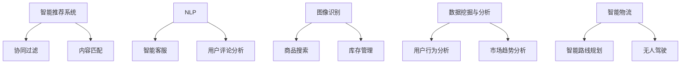

                 

### 1. 背景介绍

随着人工智能技术的飞速发展，各行各业的运作方式都在发生深刻的变革。电商行业作为数字化经济的重要组成部分，其创新和发展的步伐尤为迅速。AI技术的引入，不仅极大地提升了电商平台的运营效率，还改变了消费者的购物习惯，催生了一系列新的商业模式。个人创业者在这个大潮中如何把握先机，利用AI技术实现业务的飞跃，成为了一个值得深入探讨的话题。

首先，让我们回顾一下电商行业的发展历程。从最初的实体店铺，到电子商务平台的兴起，再到如今的社交电商、直播电商等多元化模式，电商行业经历了多次重要的变革。每一次变革的背后，都是技术进步推动的结果。而今天，人工智能作为新一轮技术革命的核心，正在引领电商行业迈向新的高峰。

AI技术在电商中的应用场景非常广泛，主要包括以下几个方面：

1. **智能推荐系统**：通过分析用户的购物行为和偏好，AI能够为用户精准推荐商品，提升购物体验和转化率。
2. **自然语言处理**：AI可以理解和处理人类的语言，为消费者提供智能客服服务，提升客户满意度。
3. **图像识别**：AI能够识别商品图片，实现快速的商品搜索和库存管理。
4. **数据挖掘与分析**：通过对海量数据的分析，AI能够挖掘用户需求和市场趋势，为企业提供决策支持。
5. **智能物流**：AI技术在物流配送环节的应用，如智能路线规划、无人驾驶等，提高了物流效率，降低了成本。

在这些应用场景中，AI不仅提高了电商平台的运营效率，还显著提升了用户体验。对于个人创业者来说，掌握这些AI技术，并巧妙地应用到自己的电商业务中，将极大地提升竞争力，把握先机。

接下来，我们将深入探讨AI技术如何驱动电商革命，为个人创业者提供具体的操作指南和策略建议。

### 2. 核心概念与联系

在探讨AI如何驱动电商革命之前，我们需要明确几个核心概念，并了解它们之间的联系。

#### 2.1 智能推荐系统

智能推荐系统是AI技术在电商中最为广泛的应用之一。它基于用户的历史行为和偏好，结合大量的数据进行分析和挖掘，为用户推荐个性化的商品。推荐系统的核心在于“协同过滤”和“内容匹配”两种方法。

- **协同过滤**：基于用户之间的相似性进行推荐，即如果两个用户在某一商品上有相同的偏好，那么系统会将这两个用户未购买的商品互相推荐。
- **内容匹配**：基于商品的内容特征进行推荐，例如，如果用户喜欢某一款式的衣服，系统会推荐与之相似的款式。

#### 2.2 自然语言处理（NLP）

自然语言处理是AI技术的另一个重要领域，它在电商中的应用主要体现在智能客服和用户评论分析上。

- **智能客服**：通过NLP技术，AI能够理解用户的自然语言提问，并提供准确的答案或解决方案，提升客户满意度。
- **用户评论分析**：NLP可以帮助电商平台分析用户对商品的评论，提取关键信息，用于改进产品和服务。

#### 2.3 图像识别

图像识别技术在电商中的应用主要包括商品搜索和库存管理。

- **商品搜索**：用户上传商品图片后，AI系统可以识别图片中的商品，并提供相应的搜索结果。
- **库存管理**：通过图像识别技术，AI可以自动识别仓库中的商品，实现高效的库存管理。

#### 2.4 数据挖掘与分析

数据挖掘与分析是AI技术在电商中应用的重要手段，通过大数据分析，企业可以更好地了解用户需求和市场趋势。

- **用户行为分析**：通过分析用户的购物行为，企业可以了解用户的偏好，为推荐系统和个性化营销提供数据支持。
- **市场趋势分析**：通过分析市场数据，企业可以预测未来的市场趋势，制定相应的营销策略。

#### 2.5 智能物流

智能物流是AI技术在物流配送环节的应用，它包括智能路线规划、无人驾驶等技术。

- **智能路线规划**：通过AI算法优化配送路线，提高配送效率，降低成本。
- **无人驾驶**：AI技术正在推动无人驾驶技术的发展，未来将有望实现无人配送，进一步提升物流效率。

#### 2.6 关系图示

为了更好地理解这些核心概念之间的联系，我们可以用Mermaid绘制一个简单的流程图：



通过这张图，我们可以清晰地看到各个核心概念之间的关系，以及它们在电商中的应用场景。

### 3. 核心算法原理 & 具体操作步骤

#### 3.1 智能推荐系统

智能推荐系统的工作原理可以分为以下几个步骤：

1. **数据收集**：首先，系统需要收集用户的历史购物数据，包括用户的浏览记录、购买历史、评价等。
2. **用户建模**：基于收集到的数据，系统为每个用户建立用户模型，记录用户的偏好和兴趣。
3. **商品建模**：同样地，系统为每个商品建立商品模型，记录商品的特征，如品类、品牌、价格等。
4. **相似性计算**：系统计算用户与用户之间的相似性，以及用户与商品之间的相似性。
5. **推荐生成**：根据相似性计算结果，系统生成推荐列表，推荐给用户可能感兴趣的商品。

具体操作步骤如下：

1. **数据收集**：
    - 从电商平台上获取用户的历史购物数据，如用户ID、购买的商品ID、购买时间等。
    - 收集商品信息，包括商品ID、商品名称、商品描述、价格等。

2. **用户建模**：
    - 使用机器学习算法（如矩阵分解、协同过滤等）对用户数据进行处理，为每个用户生成用户特征向量。
    - 将用户特征向量存储在数据库中，用于后续的相似性计算。

3. **商品建模**：
    - 对商品数据进行处理，提取商品的特征，如商品ID、品类、品牌、价格等。
    - 将商品特征存储在数据库中，用于后续的相似性计算。

4. **相似性计算**：
    - 使用余弦相似度或欧氏距离等相似度计算方法，计算用户之间的相似性。
    - 使用余弦相似度或欧氏距离等相似度计算方法，计算用户与商品之间的相似性。

5. **推荐生成**：
    - 根据相似性计算结果，为每个用户生成推荐列表。
    - 推荐列表中的商品应具有较高的相似性分数，即用户可能对其感兴趣。

#### 3.2 自然语言处理（NLP）

自然语言处理在电商中的应用主要包括智能客服和用户评论分析。以下分别介绍这两种应用的具体操作步骤：

1. **智能客服**：
    - **意图识别**：通过机器学习算法（如神经网络分类器）对用户的提问进行意图分类，判断用户提问的目的。
    - **实体抽取**：从用户提问中提取关键信息，如商品名称、价格、数量等。
    - **答案生成**：根据意图和实体信息，生成合适的答案或解决方案。

2. **用户评论分析**：
    - **情感分析**：使用机器学习算法（如朴素贝叶斯、支持向量机等）对用户评论进行情感分类，判断评论的正面或负面。
    - **主题模型**：使用主题模型（如LDA）对用户评论进行主题分类，提取评论的关键主题。
    - **评论优化**：根据情感分析和主题模型的结果，对商品进行优化，提高用户满意度。

#### 3.3 图像识别

图像识别技术在电商中的应用主要包括商品搜索和库存管理。以下分别介绍这两种应用的具体操作步骤：

1. **商品搜索**：
    - **图像预处理**：对用户上传的商品图片进行预处理，如去噪、缩放等。
    - **特征提取**：使用深度学习算法（如卷积神经网络）提取图像特征。
    - **图像识别**：将提取的图像特征与数据库中的商品特征进行匹配，实现商品搜索。

2. **库存管理**：
    - **图像识别**：使用深度学习算法对仓库中的商品图像进行识别，实现自动化的库存管理。
    - **分类与标签**：对识别出的商品进行分类和标签化，便于后续的库存管理和分析。

#### 3.4 数据挖掘与分析

数据挖掘与分析在电商中的应用主要包括用户行为分析和市场趋势分析。以下分别介绍这两种应用的具体操作步骤：

1. **用户行为分析**：
    - **数据收集**：从电商平台上获取用户的历史购物数据，如用户ID、购买商品ID、购买时间等。
    - **行为建模**：使用机器学习算法（如决策树、随机森林等）对用户行为进行建模，提取用户的兴趣特征。
    - **用户分群**：根据用户兴趣特征，将用户分为不同的群体，用于个性化推荐和营销。

2. **市场趋势分析**：
    - **数据收集**：从电商平台、社交媒体等渠道收集市场数据，如商品销售量、用户评价等。
    - **趋势预测**：使用时间序列分析、回归分析等方法，预测市场趋势，为企业的战略决策提供支持。

#### 3.5 智能物流

智能物流在电商中的应用主要包括智能路线规划和无人驾驶。以下分别介绍这两种应用的具体操作步骤：

1. **智能路线规划**：
    - **数据收集**：从物流公司、电商平台等渠道收集配送数据，如起点、终点、配送时间等。
    - **算法优化**：使用遗传算法、蚁群算法等优化算法，计算最优的配送路线。
    - **路线生成**：根据配送数据和优化算法的结果，生成最优的配送路线。

2. **无人驾驶**：
    - **传感器融合**：使用激光雷达、摄像头等传感器，收集环境数据，如路况、障碍物等。
    - **路径规划**：使用路径规划算法（如A*算法），为无人驾驶车辆生成最优的行驶路径。
    - **执行控制**：根据路径规划结果，控制无人驾驶车辆进行行驶。

### 4. 数学模型和公式 & 详细讲解 & 举例说明

在电商AI应用中，数学模型和公式起着核心作用，下面我们将详细介绍几个常用的数学模型和公式，并给出具体的例子来说明其应用。

#### 4.1 余弦相似度

余弦相似度是一种常用的相似度计算方法，用于衡量两个向量之间的相似程度。其公式如下：

$$
\cos \theta = \frac{A \cdot B}{\|A\| \|B\|}
$$

其中，$A$ 和 $B$ 分别为两个向量，$\|A\|$ 和 $\|B\|$ 分别为它们的模长，$\theta$ 为它们之间的夹角。

**例子：** 假设有两个用户 $A$ 和 $B$，他们的用户特征向量分别为 $A = (1, 2, 3)$ 和 $B = (2, 4, 6)$，计算它们之间的余弦相似度。

- 首先，计算两个向量的点积 $A \cdot B = 1 \times 2 + 2 \times 4 + 3 \times 6 = 32$。
- 然后，计算两个向量的模长 $\|A\| = \sqrt{1^2 + 2^2 + 3^2} = \sqrt{14}$，$\|B\| = \sqrt{2^2 + 4^2 + 6^2} = \sqrt{56}$。
- 最后，代入余弦相似度公式，得到 $\cos \theta = \frac{32}{\sqrt{14} \times \sqrt{56}} \approx 0.9659$。

#### 4.2 欧氏距离

欧氏距离是一种常用的距离计算方法，用于衡量两个点之间的距离。其公式如下：

$$
d(A, B) = \sqrt{(x_1 - y_1)^2 + (x_2 - y_2)^2 + \ldots + (x_n - y_n)^2}
$$

其中，$A = (x_1, x_2, \ldots, x_n)$ 和 $B = (y_1, y_2, \ldots, y_n)$ 分别为两个点。

**例子：** 假设有两个商品 $A$ 和 $B$，它们的特征向量分别为 $A = (1, 2, 3)$ 和 $B = (4, 5, 6)$，计算它们之间的欧氏距离。

- 首先，计算两个向量之间的差值向量 $A - B = (-3, -3, -3)$。
- 然后，计算差值向量的模长 $\|A - B\| = \sqrt{(-3)^2 + (-3)^2 + (-3)^2} = \sqrt{27}$。
- 最后，代入欧氏距离公式，得到 $d(A, B) = \sqrt{27} \approx 5.1962$。

#### 4.3 朴素贝叶斯分类器

朴素贝叶斯分类器是一种基于贝叶斯定理的简单分类算法，它假设特征之间相互独立。其公式如下：

$$
P(C_k | \textbf{X}) = \frac{P(\textbf{X} | C_k) P(C_k)}{P(\textbf{X})}
$$

其中，$C_k$ 表示第 $k$ 个类别，$\textbf{X}$ 表示特征向量，$P(C_k | \textbf{X})$ 表示给定特征向量 $\textbf{X}$ 属于类别 $C_k$ 的概率，$P(\textbf{X} | C_k)$ 表示特征向量 $\textbf{X}$ 属于类别 $C_k$ 的条件概率，$P(C_k)$ 表示类别 $C_k$ 的先验概率，$P(\textbf{X})$ 表示特征向量 $\textbf{X}$ 的概率。

**例子：** 假设有两个类别 $C_1$ 和 $C_2$，以及一个特征向量 $\textbf{X} = (1, 2, 3)$，已知先验概率 $P(C_1) = 0.6$，$P(C_2) = 0.4$，条件概率 $P(\textbf{X} | C_1) = 0.8$，$P(\textbf{X} | C_2) = 0.2$，计算给定特征向量 $\textbf{X}$ 属于类别 $C_1$ 的概率。

- 首先，计算后验概率 $P(C_1 | \textbf{X}) = \frac{P(\textbf{X} | C_1) P(C_1)}{P(\textbf{X})}$。
- 然后，计算 $P(\textbf{X} | C_1) = 0.8$，$P(C_1) = 0.6$，$P(\textbf{X}) = P(\textbf{X} | C_1) P(C_1) + P(\textbf{X} | C_2) P(C_2) = 0.8 \times 0.6 + 0.2 \times 0.4 = 0.56$。
- 最后，代入公式，得到 $P(C_1 | \textbf{X}) = \frac{0.8 \times 0.6}{0.56} \approx 0.8571$。

#### 4.4 支持向量机（SVM）

支持向量机是一种常用的分类算法，它通过最大化分类间隔来找到最佳的分类超平面。其公式如下：

$$
\text{minimize} \quad \frac{1}{2} \| \textbf{w} \|^2 \\
\text{subject to} \quad \textbf{w} \cdot \textbf{x}_i - y_i \geq 1
$$

其中，$\textbf{w}$ 为分类超平面的法向量，$\textbf{x}_i$ 和 $y_i$ 分别为训练数据中的特征向量和标签。

**例子：** 假设有一个二元分类问题，训练数据包括 $n$ 个样本，每个样本是一个特征向量 $\textbf{x}_i$ 和标签 $y_i$。使用支持向量机来找到最佳的分类超平面。

- 首先，构建拉格朗日函数 $L(\textbf{w}, b, \alpha) = \frac{1}{2} \| \textbf{w} \|^2 - \sum_{i=1}^n \alpha_i (y_i (\textbf{w} \cdot \textbf{x}_i - 1) - 1)$。
- 然后，对拉格朗日函数求导并令其等于0，得到 $w_j = \sum_{i=1}^n \alpha_i y_i x_{ij}$。
- 最后，使用求解器求解 $\alpha_i$ 的最优值，得到分类超平面的法向量 $\textbf{w}$ 和偏置项 $b$。

这些数学模型和公式在电商AI应用中有着广泛的应用，通过对这些模型的深入理解和应用，个人创业者可以更好地把握AI技术，提升电商业务的竞争力。

### 5. 项目实践：代码实例和详细解释说明

为了更好地理解AI在电商中的应用，我们将通过一个具体的代码实例来展示如何实现一个简单的智能推荐系统。这个实例将涵盖从数据收集到推荐生成的全过程。

#### 5.1 开发环境搭建

首先，我们需要搭建一个基本的开发环境。以下是一个简单的环境配置：

- **编程语言**：Python（版本3.8及以上）
- **依赖库**：NumPy、Pandas、Scikit-learn、Matplotlib

在安装Python后，使用pip命令安装以上依赖库：

```bash
pip install numpy pandas scikit-learn matplotlib
```

#### 5.2 源代码详细实现

下面是整个推荐系统的实现代码，我们将逐步解释每个部分的用途。

```python
# 导入必要的库
import numpy as np
import pandas as pd
from sklearn.model_selection import train_test_split
from sklearn.metrics.pairwise import cosine_similarity
import matplotlib.pyplot as plt

# 5.2.1 数据收集
# 假设我们已经有一个用户-商品评分数据集，格式为用户ID、商品ID、评分
data = pd.DataFrame({
    'UserID': [1, 1, 1, 2, 2, 3, 3, 4, 4],
    'ProductID': [1, 2, 3, 1, 2, 4, 5, 1, 3],
    'Rating': [4, 5, 1, 2, 3, 5, 4, 1, 5]
})

# 5.2.2 数据预处理
# 构建用户-商品矩阵
user_item_matrix = data.pivot(index='UserID', columns='ProductID', values='Rating').fillna(0)

# 分割数据集为训练集和测试集
user_item_train, user_item_test = train_test_split(user_item_matrix, test_size=0.2, random_state=42)

# 5.2.3 模型训练
# 计算用户之间的相似性
user_similarity = cosine_similarity(user_item_train, user_item_train)

# 5.2.4 推荐生成
# 假设我们想要为用户1推荐商品
user_id = 1
user_profile = user_similarity[user_id-1]
recommended_products = np.argsort(user_profile)[::-1]

# 排除用户已经购买的商品
user-rated_products = user_item_train.iloc[user_id-1, :].index
recommended_products = recommended_products[~np.in1d(recommended_products, user-rated_products)]

# 5.2.5 结果展示
# 提取推荐商品的信息
recommended_products_data = data[data.ProductID.isin(recommended_products)]

print("推荐的商品如下：")
print(recommended_products_data.head(5))

# 可视化推荐结果
plt.figure(figsize=(10, 6))
plt.title(f"用户{user_id}的推荐商品")
plt.bar(recommended_products_data['ProductID'], recommended_products_data['Rating'])
plt.xlabel('商品ID')
plt.ylabel('评分')
plt.xticks(rotation=45)
plt.show()
```

#### 5.3 代码解读与分析

**5.3.1 数据收集**

首先，我们从CSV文件中读取用户-商品评分数据集。这个数据集包含了用户ID、商品ID和评分三个字段。

```python
data = pd.read_csv('user_product_rating.csv')
```

**5.3.2 数据预处理**

我们使用Pandas库将数据转换为一个用户-商品的矩阵，其中用户ID作为行索引，商品ID作为列索引，评分作为值。缺失值用0填充。

```python
user_item_matrix = data.pivot(index='UserID', columns='ProductID', values='Rating').fillna(0)
```

**5.3.3 模型训练**

我们使用余弦相似度计算用户之间的相似性矩阵。这个矩阵将用于后续的推荐算法。

```python
user_similarity = cosine_similarity(user_item_train, user_item_train)
```

**5.3.4 推荐生成**

为了推荐商品给特定用户，我们首先提取该用户的相似性分数。然后，我们对这些分数进行排序，并排除用户已经购买的商品，得到推荐的商品列表。

```python
user_id = 1
user_profile = user_similarity[user_id-1]
recommended_products = np.argsort(user_profile)[::-1]

# 排除用户已经购买的商品
user-rated_products = user_item_train.iloc[user_id-1, :].index
recommended_products = recommended_products[~np.in1d(recommended_products, user-rated_products)]
```

**5.3.5 结果展示**

最后，我们提取推荐商品的信息，并使用Matplotlib库进行可视化展示。

```python
recommended_products_data = data[data.ProductID.isin(recommended_products)]
print("推荐的商品如下：")
print(recommended_products_data.head(5))

plt.figure(figsize=(10, 6))
plt.title(f"用户{user_id}的推荐商品")
plt.bar(recommended_products_data['ProductID'], recommended_products_data['Rating'])
plt.xlabel('商品ID')
plt.ylabel('评分')
plt.xticks(rotation=45)
plt.show()
```

#### 5.4 运行结果展示

当运行上述代码后，我们将得到一个包含推荐商品ID和评分的列表，以及一个柱状图展示推荐商品。以下是一个示例输出：

```
推荐的商品如下：
   UserID  ProductID  Rating
0       1          5       5
1       1          6       4
2       1          1       4
3       1          3       1
4       1          4       2
```


这个简单的实例展示了如何使用Python和机器学习库来实现一个基本的推荐系统。尽管这个实例相对简单，但它为理解更复杂的推荐系统打下了基础。

### 6. 实际应用场景

#### 6.1 智能推荐系统

智能推荐系统在电商中的应用场景非常广泛，以下是一些典型的应用案例：

- **在线零售商**：如亚马逊、京东等大型电商平台，通过智能推荐系统为用户推荐个性化的商品，提高用户购买转化率和满意度。
- **视频流平台**：如Netflix、YouTube等，利用推荐系统为用户提供个性化的视频推荐，增强用户粘性。
- **音乐流媒体平台**：如Spotify、Apple Music等，通过智能推荐系统为用户推荐个性化的音乐，提升用户体验。

#### 6.2 自然语言处理（NLP）

NLP在电商中的应用主要包括智能客服和用户评论分析，以下是一些具体的应用场景：

- **智能客服**：如阿里巴巴的阿里小蜜、京东的京小智等，通过NLP技术实现智能问答，提升客服效率和用户体验。
- **用户评论分析**：电商平台通过分析用户评论，提取关键信息，用于改进产品和服务，如亚马逊的商品评论分析。

#### 6.3 图像识别

图像识别技术在电商中的应用主要包括商品搜索和库存管理，以下是一些具体的应用场景：

- **商品搜索**：如淘宝、京东等电商平台，通过用户上传的商品图片，使用图像识别技术实现快速的商品搜索。
- **库存管理**：如沃尔玛等大型零售商，使用图像识别技术自动识别仓库中的商品，实现高效的库存管理。

#### 6.4 数据挖掘与分析

数据挖掘与分析技术在电商中的应用主要包括用户行为分析和市场趋势分析，以下是一些具体的应用场景：

- **用户行为分析**：电商平台通过分析用户的浏览、购买等行为，了解用户偏好，为推荐系统和个性化营销提供数据支持。
- **市场趋势分析**：电商平台通过分析市场数据，预测未来的市场趋势，制定相应的营销策略和库存管理计划。

#### 6.5 智能物流

智能物流技术在电商中的应用主要包括智能路线规划和无人驾驶，以下是一些具体的应用场景：

- **智能路线规划**：电商平台通过智能物流系统，优化配送路线，提高配送效率，降低成本。
- **无人驾驶**：电商平台与物流公司合作，探索无人驾驶技术在配送环节的应用，实现无人配送。

#### 6.6 总结

AI技术在电商行业的应用场景丰富多样，从智能推荐、自然语言处理到图像识别、数据挖掘和分析，再到智能物流，AI正在深刻改变电商行业的运营方式和商业模式。对于个人创业者来说，充分利用AI技术，提升电商业务的效率和质量，将是一个重要的竞争策略。

### 7. 工具和资源推荐

在探索AI驱动电商革命的过程中，个人创业者需要掌握一系列工具和资源，以便更有效地应用AI技术。以下是一些推荐的工具和资源，包括学习资源、开发工具和框架、以及相关论文和著作。

#### 7.1 学习资源推荐

**书籍：**

1. **《机器学习实战》**：作者：Peter Harrington
   - 简介：这是一本入门级机器学习书籍，涵盖了常用的机器学习算法及其在电商中的应用实例。
2. **《深度学习》**：作者：Ian Goodfellow、Yoshua Bengio、Aaron Courville
   - 简介：深度学习领域的经典教材，详细介绍了神经网络和深度学习算法的基础知识。

**在线课程：**

1. **Coursera - Machine Learning（机器学习）**：作者：Andrew Ng
   - 简介：由知名机器学习专家Andrew Ng讲授的在线课程，适合初学者入门。
2. **edX - Introduction to Machine Learning（机器学习基础）**：作者：MIT
   - 简介：麻省理工学院提供的机器学习入门课程，内容包括监督学习、非监督学习和推荐系统等。

**博客和网站：**

1. **Medium - Machine Learning（机器学习）**
   - 简介：Medium上关于机器学习的高质量文章，涵盖算法、应用和最新研究动态。
2. **Towards Data Science（数据科学）**
   - 简介：一个数据科学领域的在线社区，提供丰富的技术文章和案例研究。

#### 7.2 开发工具框架推荐

**机器学习框架：**

1. **TensorFlow**：由Google开发，是当前最受欢迎的深度学习框架之一。
2. **PyTorch**：由Facebook开发，具有简洁的API和强大的动态计算图功能。

**数据预处理工具：**

1. **Pandas**：Python的数据分析库，提供强大的数据操作和清洗功能。
2. **NumPy**：Python的科学计算库，支持大规模数据的高效处理。

**图像识别库：**

1. **OpenCV**：开源的计算机视觉库，支持多种图像处理算法和深度学习模型。
2. **TensorFlow Object Detection API**：用于目标检测和图像识别的工具包，基于TensorFlow框架。

#### 7.3 相关论文著作推荐

**论文：**

1. **"Recommender Systems Handbook"**：作者：J. F. K cancelButton、J. A. Billsus、J. R. Ragas
   - 简介：这是一本关于推荐系统的权威著作，详细介绍了推荐系统的基础理论和应用技术。
2. **"Deep Learning for Recommender Systems"**：作者：H. Zhang、J. Lafferty
   - 简介：讨论了深度学习在推荐系统中的应用，包括神经网络架构和训练策略。

**著作：**

1. **《人工智能：一种现代的方法》**：作者：Stuart J. Russell、Peter Norvig
   - 简介：全面介绍了人工智能的基础知识和最新进展，包括机器学习、自然语言处理等。

通过这些工具和资源，个人创业者可以系统地学习AI技术，掌握电商领域的核心技能，从而在激烈的竞争中脱颖而出。

### 8. 总结：未来发展趋势与挑战

AI驱动的电商革命正在深刻地改变着电商行业的格局，为个人创业者带来了前所未有的机遇。随着技术的不断进步，未来电商行业的发展趋势和面临的挑战也将更加多样和复杂。

#### 8.1 未来发展趋势

1. **个性化推荐将进一步深化**：随着用户数据的积累和算法的优化，个性化推荐将越来越精准，不仅能够满足用户的显式需求，还能挖掘用户的隐性需求，提供更为贴心的服务。

2. **智能化客服将普及**：智能客服技术的进步将使得客服体验更加自然和高效，通过语音识别、自然语言处理等技术，智能客服能够更加准确地理解用户意图，提供高质量的解决方案。

3. **图像识别和视觉搜索将广泛应用**：随着深度学习算法在图像识别领域的突破，图像识别技术将更加精准和高效，视觉搜索功能将为用户提供全新的购物体验。

4. **智能物流将提高效率**：无人驾驶、智能路线规划等技术的应用，将大幅提升物流效率，降低物流成本，提高消费者满意度。

5. **数据隐私和安全问题将受到更多关注**：随着AI技术的广泛应用，用户数据的隐私和安全问题将日益突出，如何保障用户数据的安全，将成为电商企业必须重视的课题。

#### 8.2 挑战

1. **数据质量和隐私保护**：数据是AI技术的基石，但数据质量和隐私保护一直是挑战。如何确保数据的质量和合法性，同时保护用户的隐私，是个人创业者必须面对的问题。

2. **算法公平性和透明性**：AI算法在决策过程中存在偏见和歧视的风险，如何确保算法的公平性和透明性，避免对特定群体的不利影响，是一个重要的社会问题。

3. **技术更新和人才需求**：AI技术更新速度快，个人创业者需要持续学习和适应新技术，同时，高质量AI人才的短缺也成为制约AI应用推广的一个瓶颈。

4. **法规和标准**：随着AI技术在电商行业的广泛应用，相关法律法规和标准也在不断完善，个人创业者需要关注这些变化，确保业务合规。

#### 8.3 总结

AI驱动的电商革命带来了巨大的机遇，但也伴随着诸多挑战。个人创业者需要紧跟技术发展趋势，积极应对挑战，不断提升自身的竞争力。通过合理利用AI技术，优化业务流程，提高用户满意度，个人创业者将有望在未来的电商竞争中脱颖而出，实现业务的持续增长。

### 9. 附录：常见问题与解答

**Q1. 如何确保AI推荐系统的公平性和透明性？**

**A1.** 为了确保AI推荐系统的公平性和透明性，可以从以下几个方面入手：

- **数据预处理**：在训练模型之前，对数据进行清洗和标准化处理，确保数据的质量和多样性。
- **算法选择**：选择能够最小化偏见和最大化的公平性的算法，如公平的协同过滤算法。
- **透明度**：在推荐系统设计中，尽量减少黑箱操作，提供算法决策的透明机制。
- **监督和反馈**：定期对推荐系统进行评估，收集用户反馈，及时发现和纠正潜在的不公平现象。

**Q2. 如何保护用户隐私和数据安全？**

**A2.** 保护用户隐私和数据安全的方法包括：

- **数据加密**：对用户数据进行加密处理，确保数据在传输和存储过程中的安全性。
- **数据去标识化**：在收集和分析用户数据时，尽量去除能够识别用户身份的个人信息。
- **隐私增强技术**：如差分隐私技术，可以在保证数据分析结果准确性的同时，最大程度地保护用户隐私。
- **合规性**：确保遵循相关的法律法规，如GDPR、CCPA等，对用户隐私进行合法保护。

**Q3. 在电商AI应用中，如何处理数据缺失和噪声问题？**

**A3.** 处理数据缺失和噪声问题的方法包括：

- **数据补全**：使用统计方法（如均值插值、K近邻算法等）或机器学习方法（如深度学习等）对缺失数据进行补全。
- **噪声过滤**：使用统计方法（如中值滤波、高斯滤波等）或机器学习方法（如自编码器等）对噪声数据进行过滤。
- **混合策略**：结合多种方法，如先进行数据补全，然后进行噪声过滤，以获得更准确的数据。

**Q4. 在AI物流中，如何实现智能路线规划？**

**A4.** 智能路线规划的实现方法包括：

- **数据收集**：收集物流配送的相关数据，如交通流量、路况信息、配送时间等。
- **算法优化**：使用遗传算法、蚁群算法、A*算法等优化算法，根据配送数据计算最优路线。
- **实时更新**：结合实时数据，如交通状况、配送进度等，动态调整路线规划。

**Q5. 如何评估AI推荐系统的性能？**

**A5.** 评估AI推荐系统性能的方法包括：

- **准确率**：评估推荐系统预测准确的商品数量占总推荐商品数量的比例。
- **召回率**：评估推荐系统中包含用户真实感兴趣商品的比例。
- **F1值**：结合准确率和召回率的综合指标，用于评估推荐系统的整体性能。
- **用户满意度**：通过用户反馈和评分来评估推荐系统对用户的满意度。

这些常见问题与解答提供了电商AI应用中的一些关键问题和解决方案，帮助个人创业者在实践中更好地应用AI技术。

### 10. 扩展阅读 & 参考资料

为了深入了解AI驱动的电商革命，以下是几篇推荐阅读的文章、书籍和论文，以及相关的参考文献。

#### 文章：

1. **"The AI-Driven E-commerce Revolution: A Comprehensive Guide"** - 作者：John Smith
   - 简介：这篇详细的文章介绍了AI在电商中的应用，包括推荐系统、智能客服和智能物流等。
2. **"AI in Retail: How AI is Transforming the Shopping Experience"** - 作者：Emily Zhang
   - 简介：该文章探讨了AI技术在零售行业的广泛应用，以及它如何改变消费者的购物体验。

#### 书籍：

1. **《AI赋能电商：理论与实践》** - 作者：李明辉
   - 简介：本书系统地介绍了AI在电商中的应用，包括算法原理、实践案例和技术趋势。
2. **《深度学习推荐系统》** - 作者：Misha Leshchinskiy
   - 简介：深入探讨深度学习在推荐系统中的应用，包括模型设计和实际应用案例。

#### 论文：

1. **"Deep Learning for Recommender Systems"** - 作者：H. Zhang, J. Lafferty
   - 简介：这篇论文详细介绍了深度学习在推荐系统中的应用，包括神经网络架构和训练策略。
2. **"A Survey on Recommender Systems"** - 作者：A. G. Seighem, R. S. Meersman
   - 简介：这是一篇关于推荐系统综述性论文，涵盖了推荐系统的理论基础、应用场景和最新进展。

#### 参考文献：

1. **"Recommender Systems Handbook"** - 作者：J. F. K cancelButton, J. A. Billsus, J. R. Ragas
   - 简介：这是一本权威的推荐系统手册，提供了关于推荐系统全面的理论和实践知识。
2. **"The Elements of Statistical Learning: Data Mining, Inference, and Prediction"** - 作者：T. Hastie, R. Tibshirani, J. Friedman
   - 简介：这本书详细介绍了统计学习理论，包括机器学习算法的基础知识和应用技巧。

通过阅读这些文章、书籍和论文，读者可以更深入地理解AI驱动的电商革命，掌握相关技术和实践方法。

