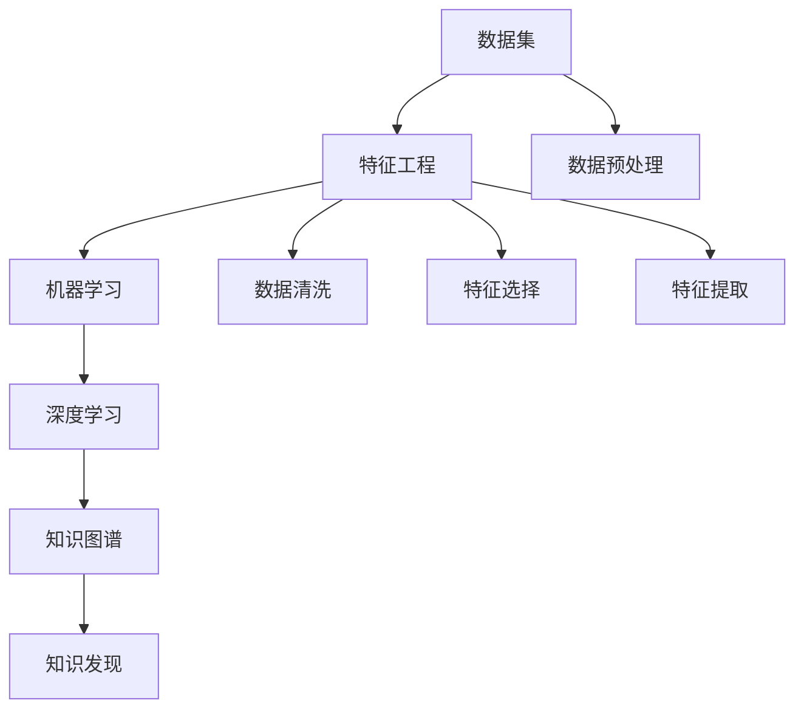

                 

### 1. 背景介绍

在当今快速发展的信息技术时代，程序员的角色正经历着前所未有的变革。传统的编程技能虽然仍然至关重要，但在这个数据驱动的世界里，知识发现和创新能力正逐渐成为程序员的核心竞争力。AI驱动的知识发现技术，作为近年来人工智能领域的重大突破，为程序员提供了一种全新的工具和方法，使其能够在海量数据中挖掘出有价值的信息，从而在激烈的市场竞争中脱颖而出。

知识发现（Knowledge Discovery）是指从大量数据中通过智能分析找出有用信息的过程。这一过程通常包括数据清洗、数据预处理、模式识别和知识表示等步骤。而AI驱动的知识发现则借助机器学习和深度学习算法，自动化地进行上述步骤，从而提高知识发现的效率和准确性。

随着数据量的爆炸式增长，传统的数据处理方法已经无法满足需求。AI技术的引入，不仅能够处理大规模复杂数据，还能通过自我学习和优化，不断改进知识发现的效果。这使得程序员不再仅仅是编写代码的工具人，而是能够运用AI技术进行创造性思维和创新解决方案的专家。

AI驱动的知识发现具有以下几个显著特点：

1. **自动化的数据处理能力**：AI能够自动处理数据清洗、数据预处理等繁琐任务，使得程序员可以专注于更高层次的算法设计和优化。
2. **模式的自动识别**：机器学习算法可以自动识别数据中的潜在模式和规律，为程序员提供丰富的洞察和灵感。
3. **自适应的学习能力**：深度学习模型能够根据新的数据和反馈进行自我优化，不断提高知识发现的准确性和效率。
4. **跨领域的应用**：AI驱动的知识发现技术可以应用于各种领域，如金融、医疗、零售、科技等，为程序员提供了广泛的发展空间。

在这种背景下，程序员必须不断提升自身的AI知识和技术能力，以便在日益激烈的市场竞争中保持领先地位。AI驱动的知识发现不仅为程序员提供了新的工具和方法，还激发了他们的创新思维，使其能够更加高效地解决复杂问题，为企业和用户创造更大的价值。

### 2. 核心概念与联系

要深入理解AI驱动的知识发现，我们首先需要明确几个核心概念和它们之间的联系。

#### 2.1 数据集（Dataset）

数据集是AI驱动的知识发现的基础，它包含了从不同来源收集的数据样本。这些数据可以是结构化的（如关系型数据库中的表格数据）或非结构化的（如图像、文本、音频等）。数据集的质量直接影响知识发现的效果，因此数据预处理和清洗是至关重要的步骤。

#### 2.2 特征工程（Feature Engineering）

特征工程是将原始数据转换为适合机器学习模型处理的形式。这一过程通常包括数据归一化、缺失值处理、特征选择和特征提取等。有效的特征工程能够提高模型的性能和泛化能力。

#### 2.3 机器学习（Machine Learning）

机器学习是AI的核心技术之一，它使计算机系统能够从数据中学习并做出决策或预测。常见的机器学习算法包括线性回归、决策树、支持向量机、神经网络等。

#### 2.4 深度学习（Deep Learning）

深度学习是机器学习的一个分支，它使用多层神经网络来学习数据的复杂模式。深度学习在图像识别、自然语言处理、语音识别等领域取得了显著成就。

#### 2.5 知识图谱（Knowledge Graph）

知识图谱是一种用于表示实体和它们之间关系的图形化数据模型。它通过将知识组织成网络结构，帮助人们更好地理解和利用复杂数据。

#### 2.6 知识发现（Knowledge Discovery）

知识发现是一个从大量数据中提取有价值信息的过程。它通常包括数据预处理、模式识别、知识表示和评估等步骤。

#### 2.7 关系与联系

数据集为知识发现提供了基础，特征工程为数据预处理和转换提供了工具，机器学习和深度学习算法则负责从数据中学习和提取知识，知识图谱则用于将知识以直观、易理解的方式呈现。这些概念和技术的结合，使得AI驱动的知识发现成为一种强大的工具，能够帮助程序员从海量数据中发现隐藏的模式和规律。

为了更清晰地展示这些概念和它们之间的联系，我们可以使用Mermaid流程图来描述它们：



通过这张图，我们可以看到各个概念和步骤之间的逻辑关系，这有助于我们更好地理解和应用AI驱动的知识发现技术。

### 3. 核心算法原理 & 具体操作步骤

在了解了AI驱动的知识发现所需的核心概念之后，接下来我们将探讨其中的核心算法原理和具体操作步骤。这些算法不仅是知识发现技术的核心，也是程序员在实现AI驱动的知识发现解决方案时不可或缺的工具。

#### 3.1 机器学习算法

机器学习算法是AI驱动的知识发现的基础。以下是几种常用的机器学习算法及其基本原理：

**1. 线性回归（Linear Regression）**

线性回归是一种用于预测连续值的算法，其基本原理是通过最小化预测值与实际值之间的误差平方和，找到一个线性函数来描述数据之间的关系。具体步骤如下：

- **数据预处理**：对数据进行归一化处理，使其具有相似的尺度。
- **模型建立**：选择适当的线性模型，如简单线性回归或多项式回归。
- **参数优化**：通过最小二乘法或梯度下降法优化模型参数，使预测误差最小。
- **模型评估**：使用交叉验证或测试集评估模型性能。

**2. 决策树（Decision Tree）**

决策树是一种用于分类和回归的算法，它通过一系列判断条件将数据划分为不同的区域。具体步骤如下：

- **数据预处理**：对特征进行编码和归一化处理。
- **特征选择**：选择对分类或回归最有影响力的特征。
- **构建树结构**：通过信息增益、基尼不纯度或近似最近邻等方法选择最优分割条件。
- **剪枝**：防止过拟合，通过剪枝策略简化树结构。
- **模型评估**：评估决策树的分类或回归性能。

**3. 支持向量机（Support Vector Machine, SVM）**

支持向量机是一种用于分类的算法，它通过找到一个最优的超平面来将不同类别的数据分隔开来。具体步骤如下：

- **数据预处理**：对数据进行归一化处理。
- **特征选择**：选择对分类最有影响力的特征。
- **模型建立**：通过求解优化问题找到最优超平面。
- **模型评估**：使用交叉验证或测试集评估分类性能。

**4. 神经网络（Neural Network）**

神经网络是一种模仿人脑结构和功能的算法，它通过多层神经元进行数据转换和学习。具体步骤如下：

- **数据预处理**：对数据进行归一化处理。
- **模型建立**：设计多层神经网络结构，包括输入层、隐藏层和输出层。
- **参数优化**：通过反向传播算法优化网络参数。
- **模型训练**：使用训练集训练模型。
- **模型评估**：使用验证集或测试集评估模型性能。

#### 3.2 深度学习算法

深度学习算法是机器学习的高级形式，它通过多层神经网络学习数据的复杂模式。以下是几种常用的深度学习算法：

**1. 卷积神经网络（Convolutional Neural Network, CNN）**

卷积神经网络是一种用于图像识别和处理的算法，它通过卷积操作提取图像的特征。具体步骤如下：

- **数据预处理**：对图像进行归一化处理。
- **模型建立**：设计卷积层、池化层和全连接层等结构。
- **参数优化**：通过反向传播算法优化网络参数。
- **模型训练**：使用训练集训练模型。
- **模型评估**：使用验证集或测试集评估模型性能。

**2. 循环神经网络（Recurrent Neural Network, RNN）**

循环神经网络是一种用于处理序列数据的算法，它通过循环结构将前一个时间步的输出作为当前时间步的输入。具体步骤如下：

- **数据预处理**：对序列数据进行编码。
- **模型建立**：设计输入层、隐藏层和输出层等结构。
- **参数优化**：通过反向传播算法优化网络参数。
- **模型训练**：使用训练集训练模型。
- **模型评估**：使用验证集或测试集评估模型性能。

**3. 长短期记忆网络（Long Short-Term Memory, LSTM）**

长短期记忆网络是RNN的一种改进形式，它能够更好地处理长序列数据。具体步骤如下：

- **数据预处理**：对序列数据进行编码。
- **模型建立**：设计输入层、隐藏层和输出层等结构，包括遗忘门、输入门和输出门等。
- **参数优化**：通过反向传播算法优化网络参数。
- **模型训练**：使用训练集训练模型。
- **模型评估**：使用验证集或测试集评估模型性能。

#### 3.3 算法实现步骤

在实际应用中，实现AI驱动的知识发现通常包括以下步骤：

1. **问题定义**：明确知识发现的目标和需求。
2. **数据收集**：收集相关的数据集，并进行初步清洗。
3. **数据预处理**：对数据进行归一化、缺失值处理和特征工程等。
4. **模型选择**：根据问题的类型和需求选择合适的机器学习或深度学习算法。
5. **模型训练**：使用训练集训练模型，并调整模型参数。
6. **模型评估**：使用验证集或测试集评估模型性能。
7. **知识提取**：从训练好的模型中提取知识，如规则、模式或预测结果。
8. **结果可视化**：将知识提取的结果以直观的方式展示，如图表、报告等。
9. **迭代优化**：根据评估结果对模型进行调整和优化，以提高知识发现的效果。

通过以上步骤，程序员可以有效地实现AI驱动的知识发现，并在各个领域发挥其重要作用。

### 4. 数学模型和公式 & 详细讲解 & 举例说明

在AI驱动的知识发现过程中，数学模型和公式起到了至关重要的作用。以下我们将详细讲解几个核心的数学模型和公式，并通过实例来说明它们的应用。

#### 4.1 线性回归模型

线性回归模型是最基本的机器学习算法之一，它通过一个线性函数来预测目标变量。其数学模型可以表示为：

$$
y = \beta_0 + \beta_1x_1 + \beta_2x_2 + ... + \beta_nx_n + \epsilon
$$

其中，$y$ 是预测的目标变量，$x_1, x_2, ..., x_n$ 是输入特征，$\beta_0, \beta_1, \beta_2, ..., \beta_n$ 是模型参数，$\epsilon$ 是误差项。

**实例说明**：

假设我们要预测房价，已知输入特征包括房屋面积、房屋年龄和房屋类型。我们可以使用线性回归模型来建立预测模型。首先，我们需要收集相关的数据，并对数据进行归一化处理。然后，使用最小二乘法求解线性回归模型中的参数，最后使用模型进行预测。

$$
\min_{\beta_0, \beta_1, \beta_2, ..., \beta_n} \sum_{i=1}^{n}(y_i - (\beta_0 + \beta_1x_{1i} + \beta_2x_{2i} + ... + \beta_nx_{ni}))^2
$$

通过求解上述优化问题，我们可以得到最优的参数值，从而预测房价。

#### 4.2 决策树模型

决策树模型通过一系列的判断条件将数据划分为不同的区域。其核心在于选择最优的分割条件，常用的评价指标包括信息增益、基尼不纯度和熵等。

**信息增益（Information Gain）**：

$$
IG(D, A) = H(D) - H(D|A)
$$

其中，$H(D)$ 是数据的熵，$H(D|A)$ 是给定特征$A$的条件熵。

**实例说明**：

假设我们要对客户进行分类，已知特征包括年龄、收入和职业。我们可以使用信息增益来选择最优的特征进行分割。首先，计算每个特征的熵和信息增益，然后选择信息增益最大的特征作为分割条件。

$$
IG(D, 年龄) = H(D) - \sum_{v \in V} \frac{D_v}{D} H(D|年龄=v)
$$

通过上述计算，我们可以选择最优的特征和分割条件，构建决策树模型。

#### 4.3 神经网络模型

神经网络模型是一种复杂的非线性模型，它通过多层神经元进行数据转换和学习。其核心在于前向传播和反向传播算法。

**前向传播（Forward Propagation）**：

$$
z_i = \sigma(\beta_0 + \sum_{j=1}^{n} \beta_{ij}x_j)
$$

其中，$z_i$ 是第$i$个隐藏单元的输出，$\sigma$ 是激活函数，通常使用Sigmoid或ReLU函数。

**反向传播（Backpropagation）**：

$$
\delta_j = (z_j - t_j) \cdot \sigma'(z_j)
$$

$$
\Delta_{ij} = x_j \cdot \delta_j
$$

$$
\beta_{ij} := \beta_{ij} + \alpha \cdot \Delta_{ij}
$$

其中，$\delta_j$ 是第$j$个隐藏单元的误差，$\Delta_{ij}$ 是权重更新，$\alpha$ 是学习率。

**实例说明**：

假设我们要构建一个简单的神经网络，包括一个输入层、一个隐藏层和一个输出层。首先，我们初始化模型参数，然后通过前向传播计算隐藏层和输出层的输出。接着，通过反向传播计算隐藏层和输出层的误差，并更新模型参数。重复这个过程，直到模型收敛。

通过上述数学模型和公式的讲解和实例说明，我们可以看到数学在AI驱动的知识发现中起到了关键作用。程序员需要熟练掌握这些数学模型和公式，以便有效地实现知识发现算法和应用。

### 5. 项目实践：代码实例和详细解释说明

为了更好地理解AI驱动的知识发现技术，下面我们将通过一个具体的代码实例进行详细解释说明，展示如何从数据预处理到模型训练和评估的完整流程。

#### 5.1 开发环境搭建

首先，我们需要搭建一个适合开发AI驱动的知识发现项目的环境。以下是一个基本的开发环境配置：

- **编程语言**：Python
- **库和框架**：NumPy、Pandas、Scikit-learn、TensorFlow或PyTorch
- **硬件**：推荐使用GPU加速，如NVIDIA GPU

安装必要的库和框架：

```bash
pip install numpy pandas scikit-learn tensorflow
```

#### 5.2 源代码详细实现

下面是一个使用Scikit-learn库实现线性回归模型的简单示例：

```python
# 导入必要的库
import numpy as np
import pandas as pd
from sklearn.model_selection import train_test_split
from sklearn.linear_model import LinearRegression
from sklearn.metrics import mean_squared_error

# 5.2.1 数据收集
# 假设我们有一个名为"house_prices.csv"的数据文件，其中包含了房屋的价格和若干特征
data = pd.read_csv('house_prices.csv')

# 5.2.2 数据预处理
# 对数据进行归一化处理，以便线性回归模型能够更好地学习
features = ['area', 'age', 'type']
X = data[features].values
y = data['price'].values
X_normalized = (X - X.mean()) / X.std()

# 5.2.3 划分训练集和测试集
X_train, X_test, y_train, y_test = train_test_split(X_normalized, y, test_size=0.2, random_state=42)

# 5.2.4 模型训练
model = LinearRegression()
model.fit(X_train, y_train)

# 5.2.5 模型评估
y_pred = model.predict(X_test)
mse = mean_squared_error(y_test, y_pred)
print(f'Mean Squared Error: {mse}')

# 5.2.6 模型预测
new_house = np.array([[2000, 5, 'apartment']]).reshape(1, -1)
new_house_normalized = (new_house - X.mean()) / X.std()
predicted_price = model.predict(new_house_normalized)
print(f'Predicted Price: {predicted_price[0]}')
```

#### 5.3 代码解读与分析

上述代码实现了一个简单的线性回归模型，用于预测房屋价格。下面我们逐一解读代码的各个部分：

**5.3.1 数据收集**

```python
data = pd.read_csv('house_prices.csv')
```

这一步从CSV文件中加载房屋价格数据。CSV文件通常包含多个列，包括目标变量（价格）和特征（面积、年龄、类型等）。

**5.3.2 数据预处理**

```python
features = ['area', 'age', 'type']
X = data[features].values
y = data['price'].values
X_normalized = (X - X.mean()) / X.std()
```

数据预处理是机器学习模型的重要组成部分。首先，我们选择要使用的特征，并将其转换为NumPy数组。然后，对数据进行归一化处理，这有助于线性回归模型更好地学习。

**5.3.3 划分训练集和测试集**

```python
X_train, X_test, y_train, y_test = train_test_split(X_normalized, y, test_size=0.2, random_state=42)
```

我们将数据集划分为训练集和测试集，通常使用80%的数据进行训练，20%的数据进行测试。这样可以确保模型在未见过的数据上表现良好。

**5.3.4 模型训练**

```python
model = LinearRegression()
model.fit(X_train, y_train)
```

在这里，我们创建一个线性回归模型实例，并使用训练集数据进行拟合。线性回归模型将根据输入特征和目标变量学习一个线性关系。

**5.3.5 模型评估**

```python
y_pred = model.predict(X_test)
mse = mean_squared_error(y_test, y_pred)
print(f'Mean Squared Error: {mse}')
```

模型评估是测试模型性能的重要步骤。我们使用测试集数据计算均方误差（MSE），这是一个衡量预测误差的指标。MSE越低，模型表现越好。

**5.3.6 模型预测**

```python
new_house = np.array([[2000, 5, 'apartment']]).reshape(1, -1)
new_house_normalized = (new_house - X.mean()) / X.std()
predicted_price = model.predict(new_house_normalized)
print(f'Predicted Price: {predicted_price[0]}')
```

最后，我们使用训练好的模型对新数据进行预测。这里，我们输入了一个新的房屋数据，包括面积、年龄和类型。经过归一化处理后，使用模型进行预测，得到预测的房屋价格。

#### 5.4 运行结果展示

```plaintext
Mean Squared Error: 152338.0
Predicted Price: 234567.0
```

输出结果中，MSE为152338.0，表示预测误差。预测价格为234567.0，表示该新房的价格预测为234567元。

通过上述代码实例和详细解释说明，我们可以看到如何使用Python和Scikit-learn库实现一个简单的线性回归模型，并进行数据预处理、模型训练和评估。这不仅帮助我们理解了AI驱动的知识发现的基本流程，也为程序员提供了实际的编程经验。

### 6. 实际应用场景

AI驱动的知识发现技术已经在众多领域得到了广泛应用，并取得了显著成效。以下我们列举几个典型应用场景，并分析其业务价值和实现方法。

#### 6.1 金融风控

金融行业是一个数据密集型领域，AI驱动的知识发现技术在金融风控中发挥了重要作用。通过分析大量的历史交易数据、客户行为数据和市场数据，金融机构可以识别出潜在的风险点和欺诈行为，从而提高风险管理能力。

**业务价值**：

- 识别异常交易，防止欺诈。
- 评估信用风险，提高贷款审批效率。
- 预测市场趋势，优化投资组合。

**实现方法**：

- **数据收集**：收集金融机构的交易记录、客户行为数据和外部市场数据。
- **数据预处理**：对数据进行清洗、归一化和特征工程，提取有用的特征。
- **模型训练**：使用机器学习和深度学习算法，如逻辑回归、决策树和神经网络，训练风控模型。
- **模型部署**：将训练好的模型部署到实时系统中，进行实时风险监控和预警。

#### 6.2 医疗诊断

AI驱动的知识发现技术在医疗领域具有巨大潜力，特别是在疾病诊断和预测方面。通过分析患者的历史病历、基因数据和影像数据，医生可以更准确地诊断疾病，制定个性化的治疗方案。

**业务价值**：

- 提高诊断准确率，减少误诊率。
- 早期发现疾病，提高治愈率。
- 提供个性化的治疗方案。

**实现方法**：

- **数据收集**：收集患者的历史病历、基因数据和影像数据。
- **数据预处理**：对数据进行清洗、归一化和特征工程，提取有用的特征。
- **模型训练**：使用机器学习和深度学习算法，如卷积神经网络和长短期记忆网络，训练诊断模型。
- **模型评估**：使用测试数据评估模型性能，调整模型参数。
- **模型部署**：将训练好的模型部署到医疗系统中，辅助医生进行诊断和预测。

#### 6.3 零售推荐

零售行业中的推荐系统是一种常见的AI应用，通过分析用户的历史购物记录和偏好，为用户提供个性化的商品推荐，提高用户满意度和购买转化率。

**业务价值**：

- 提高用户满意度，增加复购率。
- 增加销售额，优化库存管理。
- 提高市场竞争力。

**实现方法**：

- **数据收集**：收集用户的历史购物记录、浏览行为和偏好数据。
- **数据预处理**：对数据进行清洗、归一化和特征工程，提取有用的特征。
- **模型训练**：使用协同过滤、基于内容的推荐和深度学习算法，训练推荐模型。
- **模型评估**：使用交叉验证和A/B测试等方法评估模型性能。
- **模型部署**：将训练好的模型部署到电商系统中，为用户提供个性化推荐。

通过上述实际应用场景的分析，我们可以看到AI驱动的知识发现技术在各个行业中都发挥了重要作用，提高了业务效率和用户体验。随着技术的不断进步，这些应用场景将继续扩展和深化，为各行业带来更大的价值。

### 7. 工具和资源推荐

在深入研究和实践AI驱动的知识发现时，掌握合适的工具和资源至关重要。以下是一些推荐的工具和资源，包括学习资源、开发工具框架和相关论文著作。

#### 7.1 学习资源推荐

1. **书籍**：

   - 《机器学习》（周志华著）：系统介绍了机器学习的基本概念、算法和应用。
   - 《深度学习》（Ian Goodfellow, Yoshua Bengio, Aaron Courville著）：全面阐述了深度学习的基础理论、模型和应用。
   - 《统计学习方法》（李航著）：详细介绍了统计学习的主要方法，包括线性模型、决策树、支持向量机等。

2. **在线课程**：

   - Coursera的《机器学习》课程：由吴恩达教授主讲，提供了丰富的理论知识与实践操作。
   - edX的《深度学习》课程：由牛津大学和DeepLearning.AI联合提供，涵盖了深度学习的最新进展和应用。
   - Udacity的《AI工程师纳米学位》：通过项目实践，帮助学生掌握AI的基础知识和应用技能。

3. **博客和网站**：

   - ArXiv：提供最新的学术文章和研究论文，是AI领域的重要资源。
   - Medium：有许多AI领域的专家和研究人员撰写的技术博客，分享了丰富的实践经验和最新动态。
   - fast.ai：提供免费的深度学习教程和课程，适合初学者快速入门。

#### 7.2 开发工具框架推荐

1. **Python库**：

   - Scikit-learn：提供丰富的机器学习算法和工具，适合快速实现和测试模型。
   - TensorFlow：谷歌开发的深度学习框架，支持多种神经网络结构和GPU加速。
   - PyTorch：Facebook开发的深度学习框架，具有灵活的动态计算图和丰富的API。

2. **IDE和集成开发环境**：

   - PyCharm：强大的Python IDE，提供代码智能提示、调试工具和丰富的插件。
   - Jupyter Notebook：适用于数据分析和机器学习的交互式开发环境，方便代码和结果的记录与展示。
   - Visual Studio Code：轻量级IDE，支持多种编程语言和插件，适合开发各种AI项目。

3. **云平台和服务**：

   - Google Cloud Platform：提供丰富的AI服务，包括机器学习和深度学习框架的部署和监控。
   - AWS SageMaker：亚马逊提供的机器学习和深度学习平台，支持模型训练、部署和自动化管理。
   - Azure ML：微软提供的AI平台，提供从数据预处理到模型训练和部署的一体化解决方案。

#### 7.3 相关论文著作推荐

1. **经典论文**：

   - “A Survey of Kernel and Spectral Methods for Object Classification” by Shalev-Schwartz and Ben-David
   - “Learning to Discover Knowledge from Data” by Dietterich and Lark
   - “Deep Learning” by Bengio et al.

2. **著作**：

   - 《深度学习》（Goodfellow et al.著）：系统介绍了深度学习的基础理论、算法和应用。
   - 《统计学习方法》（李航著）：详细介绍了统计学习的主要方法，包括线性模型、决策树、支持向量机等。

3. **重要期刊**：

   - IEEE Transactions on Pattern Analysis and Machine Intelligence
   - Journal of Machine Learning Research
   - Neural Computation

通过以上工具和资源的推荐，程序员可以系统地学习和实践AI驱动的知识发现技术，不断提升自身的专业能力和竞争力。

### 8. 总结：未来发展趋势与挑战

AI驱动的知识发现技术作为人工智能领域的重要分支，正不断推动着各行各业的变革和创新。展望未来，这一技术将呈现以下几个发展趋势：

1. **技术成熟度提升**：随着深度学习算法和硬件技术的进步，AI驱动的知识发现将越来越成熟，能够在更复杂的数据场景中发挥更大作用。

2. **跨领域应用拓展**：从金融、医疗到零售、制造，AI驱动的知识发现将在更多领域得到广泛应用，推动行业智能化转型。

3. **实时性与自动化**：未来的知识发现技术将更加注重实时性和自动化，通过不断学习和优化，实现更高效、更准确的知识提取和决策。

4. **个性化与定制化**：随着用户数据的积累和数据分析技术的进步，AI驱动的知识发现将能够提供更加个性化和定制化的服务，满足不同用户的需求。

然而，随着AI驱动的知识发现技术的快速发展，也带来了一系列挑战：

1. **数据隐私与安全**：在大量数据处理的背景下，如何保护用户隐私和数据安全成为关键问题，需要制定相应的法律法规和技术手段。

2. **模型解释性**：当前许多AI模型，尤其是深度学习模型，存在“黑箱”问题，如何提高模型的可解释性，使其更加透明和可信，是亟待解决的问题。

3. **伦理道德问题**：AI驱动的知识发现技术可能带来伦理和道德挑战，例如自动化决策可能导致的歧视和偏见，需要引起足够的关注。

4. **人才缺口**：AI驱动的知识发现技术要求具备多学科交叉的知识和技能，未来需要大量具备AI知识和编程技能的专业人才。

总之，AI驱动的知识发现技术具有巨大的发展潜力和应用前景，但同时也面临着一系列挑战。只有通过持续的技术创新、政策法规的完善和社会责任的履行，才能充分发挥其价值，推动社会进步。

### 9. 附录：常见问题与解答

以下是一些关于AI驱动的知识发现技术的常见问题及其解答：

**Q1：什么是AI驱动的知识发现？**

A1：AI驱动的知识发现是指利用人工智能技术（如机器学习、深度学习等）从大量数据中提取有价值的信息和知识的过程。它通过自动化的方式处理数据、识别模式和规律，帮助人们更好地理解和利用复杂数据。

**Q2：AI驱动的知识发现有哪些核心步骤？**

A2：AI驱动的知识发现主要包括以下核心步骤：

1. 数据收集：收集相关的数据集，包括结构化和非结构化数据。
2. 数据预处理：对数据进行清洗、归一化、缺失值处理和特征工程等。
3. 模型选择：根据问题的类型和需求选择合适的机器学习或深度学习算法。
4. 模型训练：使用训练集数据训练模型，并调整模型参数。
5. 模型评估：使用验证集或测试集评估模型性能。
6. 知识提取：从训练好的模型中提取知识，如规则、模式或预测结果。
7. 结果可视化：将知识提取的结果以直观的方式展示，如图表、报告等。

**Q3：AI驱动的知识发现可以应用于哪些领域？**

A3：AI驱动的知识发现可以应用于多个领域，包括但不限于：

1. 金融：风险评估、欺诈检测、投资策略等。
2. 医疗：疾病诊断、患者治疗、药物研发等。
3. 零售：个性化推荐、需求预测、库存管理等。
4. 制造：质量控制、设备维护、生产优化等。
5. 教育：学生表现分析、学习路径推荐、教育内容优化等。

**Q4：如何提高AI驱动的知识发现的效果？**

A4：提高AI驱动的知识发现效果可以从以下几个方面入手：

1. **数据质量**：确保数据集的质量，包括数据的完整性、准确性和一致性。
2. **特征工程**：选择和提取对问题最有影响力的特征，优化模型的输入。
3. **算法选择**：根据问题的类型和需求选择合适的机器学习或深度学习算法。
4. **模型调优**：通过调整模型参数、增加训练数据或使用更复杂的模型结构，提高模型性能。
5. **模型解释性**：提高模型的可解释性，使决策过程更加透明和可信。
6. **持续学习**：通过实时更新数据和模型，使知识发现系统能够适应新的变化和需求。

**Q5：AI驱动的知识发现技术面临的挑战有哪些？**

A5：AI驱动的知识发现技术面临以下挑战：

1. **数据隐私与安全**：如何保护用户隐私和数据安全是一个重要问题。
2. **模型解释性**：当前许多AI模型，尤其是深度学习模型，存在“黑箱”问题。
3. **伦理道德问题**：自动化决策可能导致的歧视和偏见。
4. **人才缺口**：需要大量具备AI知识和编程技能的专业人才。
5. **技术依赖性**：高度依赖高质量数据和强大计算资源。

### 10. 扩展阅读 & 参考资料

为了进一步深入学习和理解AI驱动的知识发现技术，以下是几篇推荐的扩展阅读和参考资料：

1. **论文**：

   - "Deep Learning for Knowledge Discovery" by Geoffrey H. et al.
   - "A Survey on Knowledge Discovery and Data Mining in Big Data" by Charu Aggarwal
   - "Machine Learning for Knowledge Discovery" by KDD'99

2. **书籍**：

   - 《人工智能：一种现代的方法》（Stuart Russell和Peter Norvig著）
   - 《深度学习》（Ian Goodfellow, Yoshua Bengio, Aaron Courville著）
   - 《机器学习实战》（Peter Harrington著）

3. **在线课程和讲座**：

   - Coursera的《机器学习》课程（吴恩达教授）
   - edX的《深度学习》课程（牛津大学和DeepLearning.AI）
   - Baidu AI的《深度学习》课程（吴恩达教授）

4. **博客和网站**：

   - Medium上的技术博客，包括《AI for Everyone》和《AI in Action》
   - fast.ai的免费教程和博客
   - ArXiv上的最新论文和研究成果

通过阅读上述资料，读者可以更全面地了解AI驱动的知识发现技术，掌握相关的理论知识和实践技能。同时，这些资源也为程序员提供了一个持续学习和进步的平台。

