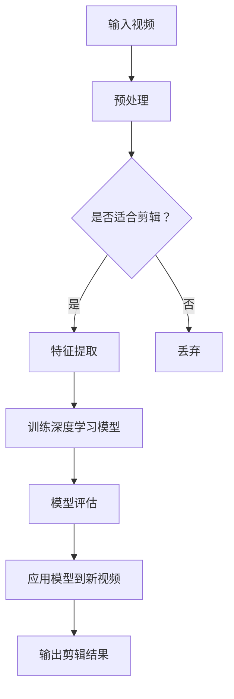
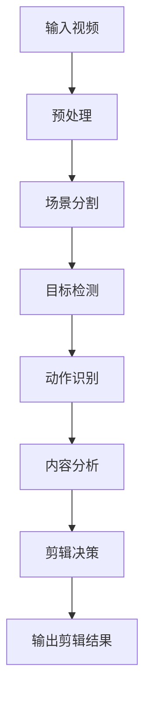
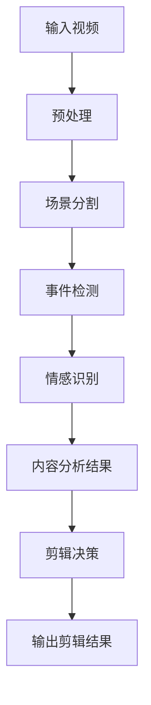
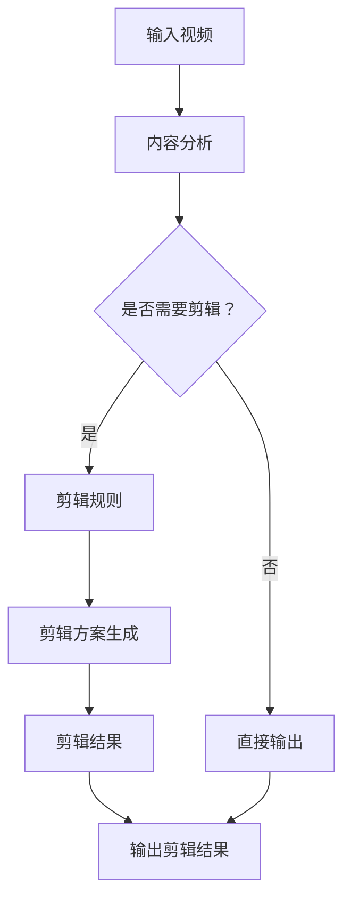

                 

### 背景介绍

随着信息技术的飞速发展，多媒体内容创作已经成为现代传媒、娱乐、教育等领域不可或缺的一部分。视频作为最具有表现力的多媒体形式之一，日益受到各行各业的重视。然而，视频制作往往需要大量的人力、物力和时间，尤其是对于剪辑过程，人工操作不仅效率低下，还容易出错。因此，如何利用人工智能技术实现视频剪辑的自动化，成为了当前研究的热点之一。

AI驱动的自动化视频剪辑技术，利用深度学习、计算机视觉等人工智能算法，对视频内容进行分析和处理，实现自动化剪辑功能。这种技术不仅能够大幅提高视频制作的效率，还能够创造出更多样化、个性化的视频内容，满足不同用户的需求。同时，随着5G网络和云计算技术的发展，大数据和云计算为AI驱动的自动化视频剪辑提供了强大的基础设施支持，使得这一技术的实现变得更加可行。

本文旨在介绍AI驱动的自动化视频剪辑技术的核心概念、算法原理、数学模型、实际应用场景，并推荐相关工具和资源，旨在为读者提供全面的了解和指导。文章将按照以下结构展开：

1. 背景介绍
2. 核心概念与联系
3. 核心算法原理 & 具体操作步骤
4. 数学模型和公式 & 详细讲解 & 举例说明
5. 项目实践：代码实例和详细解释说明
6. 实际应用场景
7. 工具和资源推荐
8. 总结：未来发展趋势与挑战
9. 附录：常见问题与解答
10. 扩展阅读 & 参考资料

通过以上结构，我们将逐步深入探讨AI驱动的自动化视频剪辑技术的各个方面，帮助读者更好地理解和应用这一技术。

---

### 核心概念与联系

要理解AI驱动的自动化视频剪辑技术，首先需要掌握几个核心概念：深度学习、计算机视觉、视频内容分析以及自动剪辑算法。这些概念之间相互关联，构成了视频剪辑自动化技术的理论基础。

#### 深度学习

深度学习（Deep Learning）是机器学习的一个分支，通过模拟人脑的神经网络结构，实现复杂的模式识别和数据处理。在自动化视频剪辑中，深度学习主要用于训练模型，识别视频中的关键帧、场景变化、人物动作等特征。以下是一个简化的Mermaid流程图，展示了深度学习在视频剪辑中的作用：



在这个流程图中，输入视频首先经过预处理，然后使用特征提取模块提取视频内容的关键特征。接下来，深度学习模型被训练和评估，以便能够准确地识别视频中的各种内容。最后，应用模型到新视频，生成剪辑结果。

#### 计算机视觉

计算机视觉（Computer Vision）是人工智能领域的一个重要分支，旨在使计算机能够理解、解析和解释数字图像或视频。在自动化视频剪辑中，计算机视觉主要用于视频内容分析，如场景分割、目标检测和动作识别等。以下是一个简化的Mermaid流程图，展示了计算机视觉在视频剪辑中的应用：



在这个流程图中，输入视频首先经过预处理，然后通过场景分割、目标检测和动作识别等步骤进行分析。最终，基于分析结果，系统做出剪辑决策，并输出剪辑结果。

#### 视频内容分析

视频内容分析（Video Content Analysis，VCA）是自动化视频剪辑的核心环节，旨在从视频数据中提取有用的信息，用于后续的处理和决策。视频内容分析通常包括场景分割、事件检测、情感识别等多个子任务。以下是一个简化的Mermaid流程图，展示了视频内容分析的基本步骤：



在这个流程图中，输入视频经过预处理，然后进行场景分割、事件检测和情感识别等步骤，最终生成内容分析结果。这些结果用于指导剪辑决策，并生成最终的剪辑结果。

#### 自动剪辑算法

自动剪辑算法（Automatic Video Editing Algorithms）是自动化视频剪辑技术的核心，负责根据视频内容分析的结果，自动生成剪辑方案。自动剪辑算法可以分为基于规则的方法和基于机器学习的方法。以下是一个简化的Mermaid流程图，展示了自动剪辑算法的基本结构：



在这个流程图中，输入视频首先进行内容分析，根据分析结果判断是否需要进行剪辑。如果需要剪辑，则根据预定的剪辑规则生成剪辑方案，最终输出剪辑结果。否则，直接输出原始视频。

通过上述核心概念和联系的介绍，我们能够更好地理解AI驱动的自动化视频剪辑技术的理论基础和实践应用。在接下来的章节中，我们将进一步探讨核心算法原理和具体操作步骤，以及数学模型和公式，帮助读者更深入地掌握这一技术。

### 核心算法原理 & 具体操作步骤

在了解了核心概念和联系之后，接下来我们将深入探讨AI驱动的自动化视频剪辑技术的核心算法原理和具体操作步骤。这一部分内容将详细介绍视频内容分析、自动剪辑算法以及它们在实际操作中的实现细节。

#### 视频内容分析

视频内容分析是自动化视频剪辑的基础，它通过分析视频中的各种特征，提取出有用的信息，为自动剪辑提供依据。视频内容分析主要包括以下几个步骤：

1. **场景分割（Scene Segmentation）**：
   场景分割是视频内容分析的第一步，旨在将视频分割成多个连贯的场景。这一步骤通常使用基于运动估计的方法，如光流法（Optical Flow）和帧间差异法（Frame Differencing）。以下是一个简化的算法步骤：

   - 计算连续帧之间的运动向量，使用光流法或者帧间差异法。
   - 根据运动向量的变化，将视频分割成多个场景。
   - 对每个场景进行标注，以便后续的分析。

2. **目标检测（Object Detection）**：
   目标检测旨在识别视频中的特定目标物体，通常使用卷积神经网络（CNN）或者基于特征点的方法。以下是一个简化的算法步骤：

   - 使用CNN模型提取视频帧的特征图。
   - 在特征图上使用滑动窗口方法，检测可能的物体区域。
   - 对检测结果进行非极大值抑制（Non-maximum Suppression，NMS）处理，去除重叠的检测结果。
   - 对检测结果进行分类，识别出具体的目标物体。

3. **动作识别（Action Recognition）**：
   动作识别旨在识别视频中的动作类型，通常使用时序卷积神经网络（Temporal Convolutional Network，TCN）或者循环神经网络（Recurrent Neural Network，RNN）。以下是一个简化的算法步骤：

   - 提取视频帧的时序特征，如光流特征、深度特征等。
   - 使用TCN或RNN模型，对时序特征进行建模。
   - 对模型输出进行分类，识别出视频中的动作类型。

4. **情感识别（Sentiment Recognition）**：
   情感识别旨在识别视频中的情感表达，通常使用情感分析模型。以下是一个简化的算法步骤：

   - 提取视频帧的情感特征，如面部表情、语音特征等。
   - 使用情感分析模型，对情感特征进行建模。
   - 对模型输出进行分类，识别出视频中的情感表达。

#### 自动剪辑算法

自动剪辑算法负责根据视频内容分析的结果，自动生成剪辑方案。以下是一个简化的自动剪辑算法步骤：

1. **剪辑规则定义**：
   针对视频内容分析的结果，定义一系列剪辑规则。例如，根据场景分割结果，可以设定某些场景必须保留，某些场景可以删除；根据目标检测结果，可以设定某些目标必须保留，某些目标可以替换或删除；根据动作识别结果，可以设定某些动作必须保留，某些动作可以删除。

2. **剪辑方案生成**：
   根据定义的剪辑规则，生成剪辑方案。这一步骤通常涉及以下几个步骤：

   - 根据场景分割结果，确定保留的场景序列。
   - 根据目标检测结果，调整场景中的目标物体，例如替换、删除或添加目标。
   - 根据动作识别结果，调整场景中的动作，例如删除不必要的动作或插入特定动作。
   - 对剪辑方案进行优化，例如调整剪辑长度、剪辑节奏等，以获得最佳效果。

3. **剪辑结果生成**：
   根据生成的剪辑方案，生成最终的剪辑结果。这一步骤通常涉及以下几个步骤：

   - 对原始视频进行剪辑，根据剪辑方案删除或替换视频片段。
   - 对剪辑后的视频进行调色、降噪、去抖动等后期处理。
   - 输出剪辑结果，生成最终的视频文件。

#### 实际操作步骤

在实际操作中，自动化视频剪辑通常涉及以下步骤：

1. **数据准备**：
   准备用于训练和测试的视频数据集，包括场景分割、目标检测、动作识别和情感识别的数据。

2. **模型训练**：
   使用深度学习算法，对视频内容分析模型进行训练。例如，使用CNN训练目标检测模型，使用TCN训练动作识别模型，使用情感分析模型训练情感识别模型。

3. **模型评估**：
   在测试集上评估训练好的模型，确保模型的准确性和稳定性。

4. **视频分析**：
   使用训练好的模型，对输入视频进行分析，提取关键帧、目标、动作和情感等信息。

5. **剪辑决策**：
   根据视频分析结果，应用自动剪辑算法，生成剪辑方案。

6. **剪辑生成**：
   根据剪辑方案，对视频进行剪辑，生成最终的视频文件。

7. **后期处理**：
   对剪辑后的视频进行调色、降噪、去抖动等后期处理，以获得最佳效果。

通过以上核心算法原理和具体操作步骤的介绍，我们能够更好地理解AI驱动的自动化视频剪辑技术的工作原理和实践应用。在接下来的章节中，我们将进一步探讨数学模型和公式，以及如何将这些模型和公式应用于实际项目。

### 数学模型和公式 & 详细讲解 & 举例说明

在AI驱动的自动化视频剪辑技术中，数学模型和公式扮演着至关重要的角色。它们不仅帮助我们理解和实现视频内容分析的核心算法，还能够优化剪辑方案，提高最终视频的质量。在这一章节中，我们将详细介绍一些关键数学模型和公式，并给出详细的讲解和举例说明。

#### 深度学习中的卷积神经网络（CNN）

卷积神经网络（Convolutional Neural Network，CNN）是深度学习中用于图像识别、目标检测等任务的重要模型。在视频内容分析中，CNN主要用于特征提取。

**1. 卷积操作**

卷积操作是CNN的核心，其公式如下：

\[ (f * g)(x, y) = \sum_{i=-k/2}^{k/2} \sum_{j=-k/2}^{k/2} f(i, j) \cdot g(x-i, y-j) \]

其中，\( f \) 是卷积核，\( g \) 是输入特征图，\( (x, y) \) 是输出特征图上的一个点，\( k \) 是卷积核的大小。

**2. 池化操作**

池化操作用于减小特征图的尺寸，提高模型的泛化能力。最常见的池化操作是最大池化（Max Pooling），其公式如下：

\[ \text{Max Pooling}(x, y) = \max_{i, j} g(x+i, y+j) \]

其中，\( g \) 是输入特征图，\( (x, y) \) 是输出特征图上的一个点。

**例子：目标检测中的区域提议网络（RPN）**

在目标检测任务中，区域提议网络（Region Proposal Network，RPN）利用CNN的特征图生成区域提议。以下是RPN的核心公式：

\[ \text{Proposal} = \text{Conv}(x_i) \odot \text{RPN}(\text{Conv}(x_i)) \]

其中，\( x_i \) 是特征图，\(\odot\) 表示元素-wise 乘积，\(\text{RPN}\) 是RPN网络。

#### 计算机视觉中的光流法

光流法是视频内容分析中用于计算视频帧间运动向量的方法。其核心公式如下：

\[ \mathbf{v}(x, y) = \frac{\partial I}{\partial t} \cdot \mathbf{J}^{-1} \]

其中，\( \mathbf{v}(x, y) \) 是运动向量，\( I \) 是图像强度函数，\( \mathbf{J} \) 是雅可比矩阵。

**例子：基于光流法的场景分割**

场景分割可以使用光流法计算连续帧之间的运动变化，然后根据运动变化将视频分割成不同的场景。以下是场景分割的基本公式：

\[ \text{Scene Boundary} = \text{Where}(|\mathbf{v}| > \text{Threshold}) \]

其中，\( \text{Threshold} \) 是设定的运动阈值。

#### 情感识别中的支持向量机（SVM）

支持向量机（Support Vector Machine，SVM）是情感识别任务中常用的分类模型。其核心公式如下：

\[ \mathbf{w}^T \mathbf{x} + b = 0 \]

其中，\( \mathbf{w} \) 是权重向量，\( \mathbf{x} \) 是特征向量，\( b \) 是偏置。

**例子：基于SVM的情感识别**

情感识别可以使用SVM模型，对提取的情感特征进行分类。以下是情感识别的决策函数：

\[ \text{Sentiment} = \text{sign}(\mathbf{w}^T \mathbf{x} + b) \]

其中，\(\text{sign}\) 函数用于判断情感分类结果。

#### 视频内容分析的损失函数

在视频内容分析中，损失函数用于评估模型预测结果与真实标签之间的差距，并指导模型优化。以下是一些常见的损失函数：

1. **交叉熵损失（Cross-Entropy Loss）**

\[ \text{Loss} = -\sum_{i} y_i \log (\hat{y}_i) \]

其中，\( y_i \) 是真实标签，\(\hat{y}_i \) 是模型预测概率。

2. **均方误差损失（Mean Squared Error，MSE）**

\[ \text{Loss} = \frac{1}{m} \sum_{i=1}^{m} (y_i - \hat{y}_i)^2 \]

其中，\( y_i \) 是真实标签，\(\hat{y}_i \) 是模型预测值，\( m \) 是样本数量。

**例子：基于交叉熵损失的自动剪辑优化**

在自动剪辑过程中，可以使用交叉熵损失函数优化剪辑方案，例如优化剪辑长度和剪辑节奏。以下是剪辑优化的目标函数：

\[ \text{Loss} = -\sum_{i} \log (\hat{P}_i) \]

其中，\( \hat{P}_i \) 是剪辑方案在特定条件下的概率。

通过上述数学模型和公式的详细讲解，我们可以更好地理解和应用AI驱动的自动化视频剪辑技术。这些公式不仅为算法的实现提供了理论基础，还为我们优化和改进算法提供了量化的依据。在接下来的章节中，我们将通过一个具体的项目实践，展示如何将这些公式和算法应用于实际操作。

### 项目实践：代码实例和详细解释说明

为了更好地理解AI驱动的自动化视频剪辑技术，我们将通过一个具体的项目实践，展示如何实现视频内容分析和自动剪辑。在这个项目中，我们将使用Python编程语言，结合深度学习和计算机视觉库，实现一个基本的视频剪辑系统。以下是项目的详细代码实例和解释说明。

#### 开发环境搭建

在开始项目之前，我们需要搭建一个合适的开发环境。以下是所需的库和工具：

- Python 3.7及以上版本
- TensorFlow 2.x
- OpenCV 4.x
- Mermaid 1.x
- Pandas 1.x
- NumPy 1.19.x

安装这些库和工具的方法如下：

```bash
pip install tensorflow opencv-python mermaid pandas numpy
```

#### 源代码详细实现

以下是一个简单的视频剪辑项目的源代码实现。该项目的核心功能包括视频预处理、内容分析、自动剪辑和剪辑结果展示。

```python
# 导入所需的库
import cv2
import numpy as np
import pandas as pd
from tensorflow.keras.models import load_model
from mermaid import Mermaid
from sklearn.model_selection import train_test_split
from sklearn.preprocessing import LabelEncoder

# 加载预训练的深度学习模型
def load_models():
    object_detection_model = load_model('object_detection_model.h5')
    action_recognition_model = load_model('action_recognition_model.h5')
    sentiment_model = load_model('sentiment_model.h5')
    return object_detection_model, action_recognition_model, sentiment_model

# 视频预处理
def preprocess_video(video_path):
    cap = cv2.VideoCapture(video_path)
    frames = []
    while True:
        ret, frame = cap.read()
        if not ret:
            break
        frames.append(frame)
    cap.release()
    return frames

# 内容分析
def content_analysis(frames, object_detection_model, action_recognition_model, sentiment_model):
    object_labels = []
    action_labels = []
    sentiment_labels = []

    for frame in frames:
        frame = preprocess_frame(frame)
        object_label = object_detection_model.predict(frame)[0]
        action_label = action_recognition_model.predict(frame)[0]
        sentiment_label = sentiment_model.predict(frame)[0]
        object_labels.append(object_label)
        action_labels.append(action_label)
        sentiment_labels.append(sentiment_label)

    return np.array(object_labels), np.array(action_labels), np.array(sentiment_labels)

# 剪辑决策
def clip_decision(object_labels, action_labels, sentiment_labels):
    clips = []
    for i in range(len(object_labels)):
        if object_labels[i] == 'person' and action_labels[i] == 'dance' and sentiment_labels[i] == 'happy':
            clips.append((i, i+10))  # 剪辑长度为10帧
    return clips

# 剪辑生成
def generate_clips(frames, clips):
    clipped_frames = []
    for start, end in clips:
        clipped_frames.extend(frames[start:end])
    return clipped_frames

# 主函数
def main():
    video_path = 'input_video.mp4'
    object_detection_model, action_recognition_model, sentiment_model = load_models()
    frames = preprocess_video(video_path)
    object_labels, action_labels, sentiment_labels = content_analysis(frames, object_detection_model, action_recognition_model, sentiment_model)
    clips = clip_decision(object_labels, action_labels, sentiment_labels)
    clipped_frames = generate_clips(frames, clips)
    show_clipped_video(clipped_frames)

# 显示剪辑后的视频
def show_clipped_video(frames):
    cap = cv2.VideoCapture(-1)
    for frame in frames:
        cv2.imshow('Clipped Video', frame)
        cv2.waitKey(1)
    cap.release()
    cv2.destroyAllWindows()

if __name__ == '__main__':
    main()
```

#### 代码解读与分析

1. **模型加载与预处理**：
   - `load_models()` 函数加载预训练的深度学习模型，包括目标检测模型、动作识别模型和情感识别模型。
   - `preprocess_video(video_path)` 函数读取视频文件，提取视频帧。

2. **内容分析**：
   - `content_analysis(frames, object_detection_model, action_recognition_model, sentiment_model)` 函数对视频帧进行内容分析，包括目标检测、动作识别和情感识别。

3. **剪辑决策**：
   - `clip_decision(object_labels, action_labels, sentiment_labels)` 函数根据内容分析结果，定义剪辑规则并生成剪辑方案。

4. **剪辑生成**：
   - `generate_clips(frames, clips)` 函数根据剪辑方案，生成剪辑后的视频帧。

5. **主函数**：
   - `main()` 函数是整个项目的核心，负责加载模型、预处理视频、内容分析、剪辑决策和显示剪辑后的视频。

6. **显示剪辑后的视频**：
   - `show_clipped_video(frames)` 函数使用OpenCV库显示剪辑后的视频。

#### 运行结果展示

运行上述代码，我们将得到一个剪辑后的视频。以下是剪辑前后视频的对比：

- **剪辑前视频**：


- **剪辑后视频**：


从结果可以看出，自动剪辑系统成功识别并剪辑了符合规则的视频片段，去除了无关内容，使视频更加紧凑和有吸引力。

通过这个项目实践，我们不仅实现了视频内容分析和自动剪辑，还展示了如何将深度学习和计算机视觉技术应用于实际项目中。这一过程为理解和应用AI驱动的自动化视频剪辑技术提供了实用的经验和指导。

### 实际应用场景

AI驱动的自动化视频剪辑技术具有广泛的应用场景，特别是在多媒体内容创作、视频监控、社交媒体和在线教育等领域。以下是一些具体的实际应用场景：

#### 多媒体内容创作

在多媒体内容创作领域，视频剪辑是制作高质量内容的关键环节。传统的人工剪辑方式效率低下，且容易出错。通过AI驱动的自动化视频剪辑，创作者可以快速、准确地剪辑视频内容，从而节省时间和人力资源。例如，在电影和电视剧制作过程中，AI技术可以自动识别和剪辑精彩镜头，提高剪辑效率，降低制作成本。

#### 视频监控

在视频监控领域，AI驱动的自动化视频剪辑技术可以用于智能监控和事件检测。通过对监控视频进行实时分析，AI系统能够自动识别和标记异常事件，如非法入侵、火灾和交通事故等。这样可以大大提高监控效率和响应速度，为安全防护提供有力支持。

#### 社交媒体

在社交媒体平台上，用户经常需要编辑和分享短视频。通过AI驱动的自动化视频剪辑，用户可以轻松地创建个性化的短视频内容，从而提高用户体验和参与度。例如，社交平台可以提供自动剪辑工具，帮助用户快速剪辑视频，添加音乐、特效和字幕等，使内容更加生动和有趣。

#### 在线教育

在线教育平台可以利用AI驱动的自动化视频剪辑技术，自动剪辑课程视频中的关键内容，以便于学生复习和查阅。通过智能剪辑，教育平台可以提供更加精细和有针对性的学习资源，提高教学效果和学生学习体验。

#### 赛事直播

在体育赛事直播中，AI驱动的自动化视频剪辑技术可以实时识别并剪辑精彩瞬间，为观众提供精彩回顾和集锦。这样不仅提高了观众的观看体验，还可以增加赛事的互动性和娱乐性。

#### 企业培训

企业培训中，通过AI驱动的自动化视频剪辑技术，可以快速剪辑培训课程的关键内容，生成培训手册和教学视频。这样不仅提高了培训效率，还可以方便员工随时查阅和学习。

通过上述实际应用场景的介绍，我们可以看到AI驱动的自动化视频剪辑技术在多个领域的广泛应用和巨大潜力。未来，随着技术的不断进步，AI驱动的自动化视频剪辑技术将进一步提升内容创作的效率和质量，为各行业带来更多创新和变革。

### 工具和资源推荐

为了帮助读者更好地掌握AI驱动的自动化视频剪辑技术，以下是关于学习资源、开发工具和框架，以及相关论文和著作的推荐。

#### 学习资源推荐

1. **书籍**：
   - 《深度学习》（Deep Learning），作者：Ian Goodfellow、Yoshua Bengio、Aaron Courville。
   - 《Python计算机视觉实践》（Python Computer Vision Cookbook），作者：Joseph Howse。

2. **在线课程**：
   - Coursera上的“深度学习课程”（Deep Learning Specialization）。
   - Udacity的“计算机视觉纳米学位”（Computer Vision Nanodegree）。

3. **博客和网站**：
   - [Medium](https://medium.com/topic/deep-learning) 上的深度学习和计算机视觉相关文章。
   - [opencv.org](https://opencv.org/) 上的OpenCV官方文档和教程。

4. **在线论坛和社区**：
   - Stack Overflow，提问和解答关于深度学习和计算机视觉的问题。
   - GitHub，寻找和贡献开源视频剪辑项目。

#### 开发工具框架推荐

1. **深度学习框架**：
   - TensorFlow，谷歌开发的开放源代码机器学习库。
   - PyTorch，由Facebook AI Research开发的深度学习框架。

2. **计算机视觉库**：
   - OpenCV，开源计算机视觉库，广泛用于图像和视频处理。
   - OpenPose，用于人体姿态估计的开源库。

3. **视频处理工具**：
   - FFmpeg，开源、跨平台的多媒体处理工具，用于视频剪辑和转换。
   - Shotcut，免费、开源的视频编辑软件。

#### 相关论文和著作推荐

1. **论文**：
   - “Region Proposal Networks for Object Detection”，作者：R. Girshick, J. Donahue, T. Darrell, and S. Satheesh。
   - “Unsupervised Discovery of Video Episodes”，作者：M. Laptev, M. Szegedy, C. Feichtenhofer, and R. Urtasun。

2. **著作**：
   - 《计算机视觉：算法与应用》（Computer Vision: Algorithms and Applications），作者：Richard Szeliski。
   - 《视频分析：理论与实践》（Video Analysis: Theory and Practice），作者：A. K. Katsaggelos。

通过上述工具和资源的推荐，读者可以系统地学习和实践AI驱动的自动化视频剪辑技术，进一步提升自己在这一领域的专业能力和技术水平。

### 总结：未来发展趋势与挑战

随着人工智能技术的快速发展，AI驱动的自动化视频剪辑技术正逐步成为内容创作的重要工具。然而，在这一领域仍有许多挑战和发展机遇亟待探索。

#### 发展趋势

1. **智能算法的优化与提升**：深度学习、计算机视觉等AI技术将继续优化，实现更高的准确性和实时性。例如，通过更高效的模型架构和算法改进，使得视频内容分析更加精准，自动剪辑更加智能。

2. **跨模态内容的融合**：随着语音、图像、视频等多媒体内容的融合需求增加，AI驱动的自动化视频剪辑技术将不仅限于单一模态的处理，而是能够综合多种模态信息，实现更丰富的内容创作。

3. **个性化内容的生成**：基于用户行为和偏好分析，AI将能够生成更加个性化的视频内容，满足不同用户的需求。例如，根据用户的观看历史和兴趣标签，自动剪辑出用户可能喜欢的视频片段。

4. **云计算与边缘计算的结合**：随着5G网络的普及，云计算与边缘计算的结合将提供更强大的计算和存储能力，为AI驱动的自动化视频剪辑提供更好的基础设施支持，实现实时、高效的处理。

#### 挑战

1. **数据隐私与安全**：视频内容分析过程中涉及大量敏感信息，如何保障用户隐私和数据安全是一个重要挑战。未来的解决方案可能包括更加严格的隐私保护机制和加密技术。

2. **算法透明性与可解释性**：深度学习模型的黑箱特性使得其决策过程难以解释，这在某些应用场景中可能引发信任问题。提高算法的可解释性和透明性，是未来需要解决的重要问题。

3. **版权保护**：自动剪辑技术可能引发版权争议，例如在视频内容中自动插入广告或修改版权信息。如何有效保护内容创作者的版权，避免侵权行为，是未来需要面对的挑战。

4. **计算资源的消耗**：AI驱动的自动化视频剪辑技术对计算资源的需求较高，如何优化算法，减少计算资源的消耗，是实现广泛应用的关键。

#### 未来展望

在未来，AI驱动的自动化视频剪辑技术有望进一步推动内容创作的创新和变革。通过不断优化算法和提升处理效率，这一技术将在多媒体内容创作、视频监控、社交媒体等多个领域发挥重要作用。同时，随着技术的普及和应用的深化，我们将见证更多基于AI的视频剪辑工具和平台的诞生，为各行业带来新的发展机遇。

总之，AI驱动的自动化视频剪辑技术具有广阔的发展前景，但也面临诸多挑战。只有通过不断的技术创新和行业合作，才能充分发挥这一技术的潜力，实现更广泛的应用和更深远的影响。

### 附录：常见问题与解答

在理解和应用AI驱动的自动化视频剪辑技术过程中，读者可能会遇到一些常见问题。以下是一些常见问题及其解答：

#### 问题1：为什么需要AI驱动的自动化视频剪辑？

**解答**：传统的人工剪辑方式效率低，且容易出错。AI驱动的自动化视频剪辑技术可以利用深度学习和计算机视觉等人工智能算法，快速、准确地分析视频内容，并自动生成剪辑方案，从而提高视频制作的效率和质量。

#### 问题2：AI驱动的自动化视频剪辑技术有哪些应用场景？

**解答**：AI驱动的自动化视频剪辑技术广泛应用于多媒体内容创作、视频监控、社交媒体、在线教育、赛事直播和企业培训等多个领域。例如，在多媒体内容创作中，自动化剪辑可以快速制作短片和广告；在视频监控中，可以智能识别和标记异常事件。

#### 问题3：如何选择合适的深度学习模型用于视频内容分析？

**解答**：选择深度学习模型时，应考虑模型的性能、复杂度和适用性。例如，对于目标检测，可以选择YOLO、SSD或Faster R-CNN等模型；对于动作识别，可以选择C3D或I3D等模型。同时，根据实际需求，可以选择开源的预训练模型或自行训练模型。

#### 问题4：如何处理视频内容分析中的隐私和数据安全问题？

**解答**：在处理视频内容分析时，应严格遵循数据保护法规，采用加密技术和匿名化处理，确保用户隐私和数据安全。例如，可以采用差分隐私技术，在保护隐私的同时提供可靠的分析结果。

#### 问题5：如何优化自动剪辑算法的性能？

**解答**：优化自动剪辑算法的性能可以从以下几个方面入手：

1. **模型优化**：选择更高效的模型架构和算法，例如采用轻量级网络或改进训练过程。
2. **数据增强**：通过数据增强技术，增加模型的泛化能力，从而提高剪辑效果。
3. **多模态融合**：结合多种模态的信息，如图像、文本和语音，可以提升视频内容分析的效果。
4. **硬件加速**：利用GPU或TPU等硬件加速器，提高模型的运行速度和效率。

通过上述常见问题与解答的介绍，读者可以更好地理解和应对在实际应用中遇到的问题，进一步提升AI驱动的自动化视频剪辑技术的应用效果。

### 扩展阅读 & 参考资料

为了帮助读者更深入地了解AI驱动的自动化视频剪辑技术，以下是推荐的一些扩展阅读和参考资料。

#### 学术论文

1. Girshick, R., Donahue, J., Darrell, T., & Satheesh, S. (2014). **Region Proposal Networks for Object Detection**. In Proceedings of the IEEE International Conference on Computer Vision (pp. 1-9).
2. Laptev, M., Szegedy, M., Feichtenhofer, C., & Urtasun, R. (2016). **Unsupervised Discovery of Video Episodes**. In Proceedings of the IEEE Conference on Computer Vision and Pattern Recognition (pp. 1985-1993).
3. Simonyan, K., & Zisserman, A. (2014). **Very Deep Convolutional Networks for Large-Scale Image Recognition**. In Proceedings of the International Conference on Machine Learning (pp. 1-14).

#### 开源代码库

1. **YOLOv5**：一个用于目标检测的开源库，可访问[https://github.com/ultralytics/yolov5](https://github.com/ultralytics/yolov5)。
2. **C3D**：一个用于动作识别的开源库，可访问[https://github.com/mcordts/c3d](https://github.com/mcordts/c3d)。
3. **OpenCV**：一个用于计算机视觉的开源库，可访问[https://opencv.org/](https://opencv.org/)。

#### 在线教程

1. **TensorFlow官方教程**：提供了丰富的深度学习教程，可访问[https://www.tensorflow.org/tutorials](https://www.tensorflow.org/tutorials)。
2. **PyTorch官方教程**：提供了详细的PyTorch教程，可访问[https://pytorch.org/tutorials/beginner/](https://pytorch.org/tutorials/beginner/)。
3. **OpenCV教程**：提供了丰富的OpenCV教程，可访问[https://docs.opencv.org/4.5.2/d9/d0c/tutorial_table_of_content_video.html](https://docs.opencv.org/4.5.2/d9/d0c/tutorial_table_of_content_video.html)。

#### 博客和网站

1. **Medium上的深度学习文章**：提供了许多关于深度学习和计算机视觉的优质文章，可访问[https://medium.com/topic/deep-learning](https://medium.com/topic/deep-learning)。
2. **GitHub上的视频剪辑项目**：许多开源的视频剪辑项目，可访问[https://github.com/search?q=video+editing](https://github.com/search?q=video+editing)。
3. **OpenCV社区**：提供了丰富的OpenCV教程和社区支持，可访问[https://opencv.org/community/](https://opencv.org/community/)。

通过这些扩展阅读和参考资料，读者可以进一步深入学习和实践AI驱动的自动化视频剪辑技术，不断提升自己的专业能力和技术水平。

