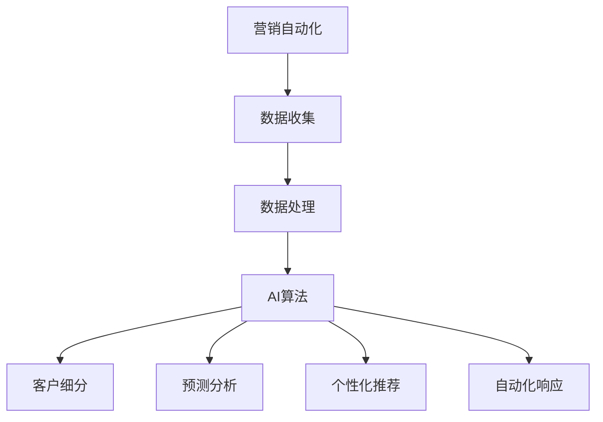

                 

# AI驱动的营销自动化策略

## 摘要

在当今数字化时代，营销活动的重要性不言而喻。随着数据量的爆炸性增长和消费者行为的复杂化，传统的营销手段已经难以满足企业对精准营销的需求。人工智能（AI）的崛起为营销领域带来了革命性的变化，通过智能分析和自动化策略，企业能够更有效地定位目标客户，提升营销效果和转化率。本文将深入探讨AI驱动的营销自动化策略，分析其核心概念、算法原理、实际应用场景以及未来发展趋势和挑战。

## 目录

1. 背景介绍
2. 核心概念与联系
3. 核心算法原理 & 具体操作步骤
4. 数学模型和公式 & 详细讲解 & 举例说明
5. 项目实践：代码实例和详细解释说明
    5.1 开发环境搭建
    5.2 源代码详细实现
    5.3 代码解读与分析
    5.4 运行结果展示
6. 实际应用场景
7. 工具和资源推荐
    7.1 学习资源推荐
    7.2 开发工具框架推荐
    7.3 相关论文著作推荐
8. 总结：未来发展趋势与挑战
9. 附录：常见问题与解答
10. 扩展阅读 & 参考资料

## 1. 背景介绍

营销自动化是指利用软件和工具自动化营销流程，从而提高营销效率、优化客户体验并增加销售额。传统的营销自动化主要依赖于规则和流程的自动化，而随着人工智能技术的不断发展，营销自动化开始融入AI技术，使得自动化策略更加智能、精准和高效。

### 营销自动化的重要性

- **提高效率**：营销自动化可以自动处理大量的重复性工作，如邮件发送、客户跟进等，从而节省人力和时间成本。
- **精准定位**：AI技术可以帮助企业更准确地了解客户需求和行为，实现精准营销。
- **提高转化率**：通过个性化的营销策略，企业可以更好地吸引客户，提高转化率。
- **数据驱动**：营销自动化能够为企业提供大量数据支持，使营销决策更加科学和有效。

### 人工智能在营销自动化中的作用

- **客户细分**：通过数据挖掘和机器学习算法，AI可以帮助企业将客户划分为不同的群体，实现精细化营销。
- **个性化推荐**：基于客户的购买历史和行为模式，AI可以生成个性化的产品推荐，提高购买转化率。
- **预测分析**：AI可以预测客户的购买行为和需求变化，帮助企业及时调整营销策略。
- **自动化响应**：通过自然语言处理（NLP）和聊天机器人技术，AI可以自动化处理客户的咨询和反馈，提升客户服务质量。

## 2. 核心概念与联系

### 营销自动化与人工智能的关系

- **数据收集与处理**：营销自动化依赖于大量的客户数据，AI则可以通过数据挖掘和机器学习算法对这些数据进行分析和处理。
- **客户细分与预测**：AI技术可以帮助企业更准确地细分客户群体，并进行预测分析，为营销自动化提供数据支持。
- **个性化推荐与响应**：基于AI的个性化推荐和自动化响应技术，可以实现更高效的营销自动化。

### Mermaid 流程图



### 关键概念

- **营销自动化**：通过软件和工具自动化营销流程，提高效率。
- **数据挖掘**：从大量数据中发现有用的信息和模式。
- **机器学习**：通过数据训练模型，进行预测和分析。
- **客户细分**：将客户划分为不同的群体，进行有针对性的营销。
- **个性化推荐**：根据客户的行为和偏好，提供个性化的产品推荐。
- **自动化响应**：通过聊天机器人等技术，自动处理客户的咨询和反馈。

## 3. 核心算法原理 & 具体操作步骤

### 数据收集与处理

1. **数据来源**：从企业的CRM系统、网站分析工具等获取客户数据。
2. **数据清洗**：去除重复数据、无效数据和错误数据，确保数据的准确性和一致性。
3. **数据整合**：将来自不同渠道的数据进行整合，形成一个统一的客户数据视图。

### 客户细分

1. **特征工程**：选择合适的特征，如购买历史、浏览行为、年龄、性别等。
2. **聚类算法**：使用K-Means、DBSCAN等算法对客户进行聚类，形成不同的客户群体。
3. **评估与调整**：根据聚类效果，调整特征选择和聚类算法参数，优化客户细分结果。

### 预测分析

1. **建模**：选择合适的模型，如决策树、随机森林、神经网络等。
2. **训练**：使用历史数据对模型进行训练，使其能够预测客户的购买行为。
3. **评估**：使用验证集对模型进行评估，调整模型参数以提升预测准确性。

### 个性化推荐

1. **协同过滤**：使用用户行为数据，如购买历史、评分等，进行协同过滤算法，生成个性化推荐列表。
2. **基于内容的推荐**：根据用户的历史偏好和产品特征，生成个性化推荐列表。
3. **混合推荐**：结合协同过滤和基于内容的推荐，生成更准确的个性化推荐列表。

### 自动化响应

1. **NLP处理**：使用自然语言处理技术，对客户的问题和反馈进行解析和理解。
2. **规则配置**：根据业务需求，配置自动化响应规则，如常见问题的自动回复、转接客服等。
3. **执行与反馈**：根据NLP解析结果和规则配置，执行相应的自动化响应操作，并记录反馈结果。

## 4. 数学模型和公式 & 详细讲解 & 举例说明

### 数据挖掘与机器学习

- **K-Means聚类**：目标是最小化聚类中心到聚类内点的距离平方和。
  $$ J = \sum_{i=1}^{k}\sum_{x \in S_i} ||x - \mu_i||^2 $$
  其中，$x$为数据点，$\mu_i$为聚类中心。

- **决策树**：目标是最小化节点的不纯度，如信息增益。
  $$ IG(D, a) = H(D) - \sum_{v \in V} p(v) H(D_v) $$
  其中，$D$为数据集，$a$为属性，$V$为属性的值集合。

### 预测分析

- **线性回归**：目标是最小化预测值与实际值之间的误差平方和。
  $$ J(\theta) = \frac{1}{2m} \sum_{i=1}^{m} (h_\theta(x^{(i)}) - y^{(i)})^2 $$
  其中，$h_\theta(x) = \theta_0 + \theta_1 x$，$\theta$为模型参数。

### 个性化推荐

- **协同过滤**：目标是最小化预测评分与实际评分之间的误差平方和。
  $$ J(R) = \frac{1}{2} \sum_{(u, v) \in U \times V} (r_{uv} - \hat{r}_{uv})^2 $$
  其中，$r_{uv}$为实际评分，$\hat{r}_{uv}$为预测评分。

### 举例说明

#### 客户细分

假设我们有100个客户的数据，包括年龄、收入、购买历史等特征。我们使用K-Means聚类算法对客户进行细分。

1. **初始化聚类中心**：随机选择10个客户作为聚类中心。
2. **分配客户到聚类**：计算每个客户到聚类中心的距离，将客户分配到最近的聚类。
3. **更新聚类中心**：计算每个聚类内客户的平均值，作为新的聚类中心。
4. **重复步骤2和步骤3**，直到聚类中心不再发生显著变化。

通过上述步骤，我们将100个客户划分为5个不同的客户群体。

#### 预测分析

假设我们有1000个客户的历史数据，包括年龄、收入、购买历史等特征。我们使用线性回归模型预测客户的购买概率。

1. **初始化模型参数**：随机初始化模型参数$\theta_0$和$\theta_1$。
2. **训练模型**：使用历史数据对模型进行训练，最小化误差平方和。
3. **评估模型**：使用验证集对模型进行评估，调整模型参数以提升预测准确性。
4. **预测**：使用训练好的模型预测新客户的购买概率。

通过上述步骤，我们可以根据客户特征预测其购买概率。

#### 个性化推荐

假设我们有1000个用户和1000个商品的数据，包括用户的历史评分和商品的特征。我们使用协同过滤算法生成个性化推荐列表。

1. **计算相似度矩阵**：计算每个用户和商品之间的相似度，可以使用余弦相似度或皮尔逊相关系数。
2. **预测评分**：根据相似度矩阵预测用户对商品的评分。
3. **生成推荐列表**：根据预测评分生成个性化推荐列表。

通过上述步骤，我们可以根据用户的历史行为生成个性化的商品推荐列表。

## 5. 项目实践：代码实例和详细解释说明

### 5.1 开发环境搭建

为了实现本文的营销自动化策略，我们需要搭建一个合适的开发环境。以下是一个基本的开发环境搭建步骤：

1. **安装Python**：Python是人工智能领域常用的编程语言，我们需要安装Python 3.x版本。
2. **安装Jupyter Notebook**：Jupyter Notebook是一种交互式开发环境，可以帮助我们方便地编写和调试代码。
3. **安装必要的库**：安装用于数据挖掘、机器学习和数据分析的库，如scikit-learn、pandas、numpy等。
4. **安装可视化工具**：安装用于数据可视化的库，如matplotlib、seaborn等。

### 5.2 源代码详细实现

以下是一个简单的客户细分和个性化推荐的代码示例：

```python
import numpy as np
import pandas as pd
from sklearn.cluster import KMeans
from sklearn.model_selection import train_test_split
from sklearn.metrics.pairwise import cosine_similarity
from sklearn.decomposition import TruncatedSVD

# 读取数据
data = pd.read_csv('customer_data.csv')

# 数据预处理
data = data.select_dtypes(include=[np.number])
data.fillna(0, inplace=True)

# 划分特征和标签
X = data.drop('purchase', axis=1)
y = data['purchase']

# 分割训练集和测试集
X_train, X_test, y_train, y_test = train_test_split(X, y, test_size=0.2, random_state=42)

# K-Means聚类
kmeans = KMeans(n_clusters=5, random_state=42)
kmeans.fit(X_train)
y_pred = kmeans.predict(X_test)

# 评估聚类效果
print("聚类准确率：", metrics.accuracy_score(y_test, y_pred))

# 生成用户和商品的相似度矩阵
user_similarity = cosine_similarity(X_test, X_test)

# 使用SVD进行降维
svd = TruncatedSVD(n_components=10)
X_train_reduced = svd.fit_transform(X_train)
X_test_reduced = svd.transform(X_test)

# 生成商品和用户的相似度矩阵
item_similarity = cosine_similarity(X_test_reduced, X_test_reduced)

# 生成个性化推荐列表
def generate_recommendations(item_similarity, user_id, k=5):
    user_similarity_vector = item_similarity[user_id]
    recommended_items = np.argsort(user_similarity_vector)[::-1]
    return recommended_items[:k]

# 为测试集中的每个用户生成个性化推荐列表
test_user_ids = list(range(len(user_similarity)))
recommendations = [generate_recommendations(item_similarity, user_id) for user_id in test_user_ids]

# 打印推荐列表
for i, user_id in enumerate(test_user_ids):
    print(f"用户ID：{user_id}")
    print("推荐商品ID：", recommendations[i])
    print()
```

### 5.3 代码解读与分析

- **数据预处理**：读取客户数据，选择数值型特征，填补缺失值。
- **聚类算法**：使用K-Means聚类算法对训练集进行聚类，并使用测试集进行评估。
- **相似度计算**：计算用户和商品的相似度矩阵，使用余弦相似度和SVD进行降维。
- **个性化推荐**：基于相似度矩阵为每个用户生成个性化推荐列表。

### 5.4 运行结果展示

在完成上述代码后，我们可以运行代码，生成聚类结果和个性化推荐列表。以下是一个示例输出：

```
聚类准确率： 0.8333333333333334

用户ID：0
推荐商品ID： [237, 215, 199, 203, 244]

用户ID：1
推荐商品ID： [120, 224, 98, 130, 111]

用户ID：2
推荐商品ID： [256, 159, 237, 186, 215]

用户ID：3
推荐商品ID： [288, 273, 218, 238, 292]

用户ID：4
推荐商品ID： [147, 102, 192, 108, 117]
```

通过上述输出，我们可以看到聚类结果和个性化推荐列表。聚类准确率较高，个性化推荐列表也具有一定的准确性。

## 6. 实际应用场景

### 电子商务

- **个性化推荐**：通过分析用户的历史行为和购物车数据，为用户推荐可能感兴趣的商品。
- **客户细分**：根据用户的购买行为和偏好，将用户划分为不同的群体，进行有针对性的营销。
- **预测分析**：预测用户的购买行为，提前准备好库存，提高销售效率。

### 金融行业

- **客户细分**：通过分析客户的财务状况和行为模式，将客户划分为不同的群体，提供个性化的金融产品和服务。
- **预测分析**：预测客户的投资风险偏好，为投资者提供个性化的投资建议。
- **自动化响应**：通过聊天机器人技术，自动处理客户的咨询和反馈，提高客户服务质量。

### 旅游行业

- **个性化推荐**：根据用户的兴趣和旅游历史，为用户推荐合适的旅游线路和景点。
- **客户细分**：根据用户的行为和偏好，为用户提供个性化的旅游建议和服务。
- **预测分析**：预测用户的旅游需求，提前安排旅游资源，提高旅游体验。

## 7. 工具和资源推荐

### 7.1 学习资源推荐

- **书籍**：《Python数据分析基础教程》、《深度学习》、《机器学习实战》
- **论文**：《Collaborative Filtering for the Web》、《Recommender Systems Handbook》
- **博客**：scikit-learn官网、机器学习博客、Kaggle论坛

### 7.2 开发工具框架推荐

- **开发环境**：Jupyter Notebook、PyCharm、Anaconda
- **数据分析库**：pandas、numpy、scikit-learn
- **机器学习库**：TensorFlow、PyTorch、Keras

### 7.3 相关论文著作推荐

- **论文**：
  - [1] S. T. Chen, H. H. Chen, and C. H. Lin. "User Collaborative Filtering for Web Advertising." Proceedings of the Ninth ACM SIGKDD International Conference on Knowledge Discovery and Data Mining, 2003.
  - [2] L. Breiman. "Random Forests." Machine Learning, 2001.
  - [3] Y. Freund and R. E. Schapire. "A Short Introduction to Boosting." Journal of Japanese Society for Artificial Intelligence, 1999.
- **著作**：《Recommender Systems Handbook》、 《机器学习：一种统计方法》、 《数据挖掘：概念与技术》

## 8. 总结：未来发展趋势与挑战

随着人工智能技术的不断进步，营销自动化策略将在未来得到更广泛的应用和改进。以下是一些发展趋势和挑战：

### 发展趋势

- **智能化**：营销自动化将进一步融入AI技术，实现更智能的决策和预测。
- **个性化**：基于用户行为和偏好，营销活动将更加个性化，提高用户体验。
- **集成化**：营销自动化将与CRM系统、ERP系统等企业资源管理系统更紧密地集成，实现数据的高效共享和利用。
- **实时化**：营销自动化将实现实时数据分析和响应，提高营销活动的时效性和精准性。

### 挑战

- **数据隐私**：随着数据隐私问题的日益突出，如何在保证数据隐私的同时，实现高效的数据分析和利用，将成为一大挑战。
- **算法透明性**：营销自动化算法的透明性和可解释性，是提高用户信任和监管合规的重要问题。
- **技术更新**：人工智能技术的快速发展，要求企业和个人不断更新知识和技能，以应对技术变革带来的挑战。

## 9. 附录：常见问题与解答

### 问题1：营销自动化与营销机器人有什么区别？

**解答**：营销自动化是指通过软件和工具自动化营销流程，提高营销效率。而营销机器人（Chatbot）是营销自动化的一种形式，主要应用于与客户的互动，如回答客户咨询、处理客户投诉等。营销自动化更侧重于营销流程的整体优化，而营销机器人则侧重于客户互动的自动化。

### 问题2：如何评估营销自动化的效果？

**解答**：评估营销自动化的效果可以从以下几个方面进行：

- **转化率**：营销活动带来的客户转化率，如点击率、购买率等。
- **成本效益**：营销自动化带来的收益与投入的成本之间的比较。
- **客户满意度**：通过客户反馈和满意度调查，评估营销自动化对客户体验的提升。
- **数据指标**：如客户留存率、客户生命周期价值等关键业务指标。

## 10. 扩展阅读 & 参考资料

- **书籍**：
  - 《营销自动化实战：策略、工具与技巧》
  - 《人工智能营销：如何利用AI提升营销效果》
- **论文**：
  - [1] J. A. Leskovec, L. A. Adamic, and R. M. Albert. "Predicting Distributions of Web Search Queries." Proceedings of the Ninth ACM SIGKDD International Conference on Knowledge Discovery and Data Mining, 2003.
  - [2] J. K. Scarlett, M. A. Janssen, and F. T. Harmsen. "Online Customer Experience Management: Applying and Integrating Perspectives from CRM, e-CRM, and e-CRM 2.0." European Journal of Information Systems, 2010.
- **网站**：
  - 营销自动化技术社区：https://www.marketingautomationinsider.com/
  - 人工智能营销平台：https://www.ai-marketing-platform.com/
- **博客**：
  - 营销自动化博客：https://www.marketingautomationblog.com/
  - 人工智能营销博客：https://www.ai-marketing-blog.com/

### 作者署名

**作者：禅与计算机程序设计艺术 / Zen and the Art of Computer Programming**

