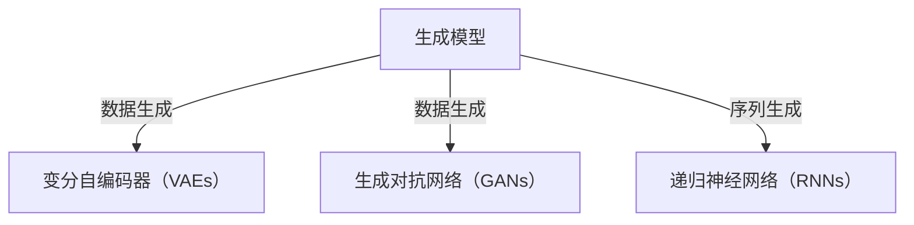
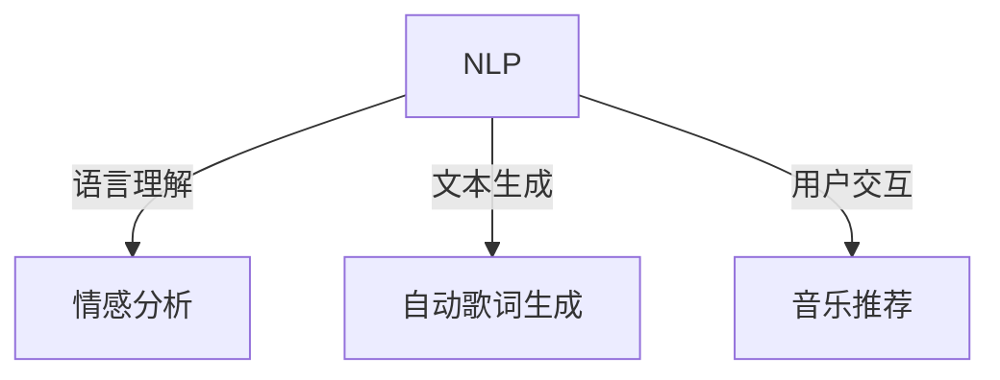
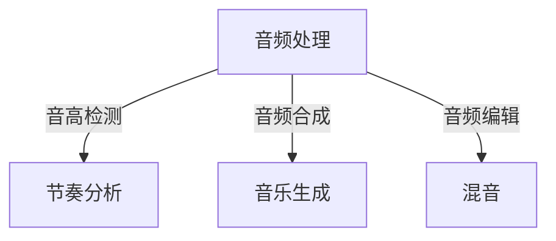
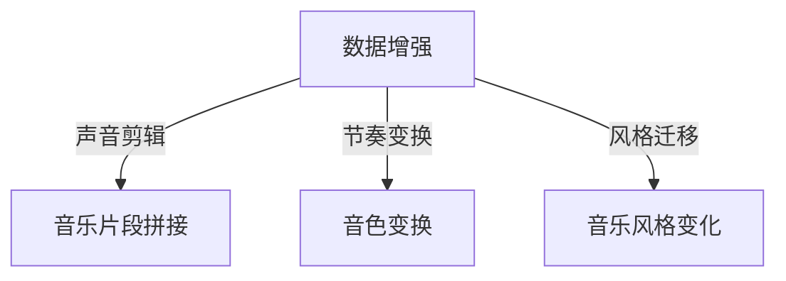
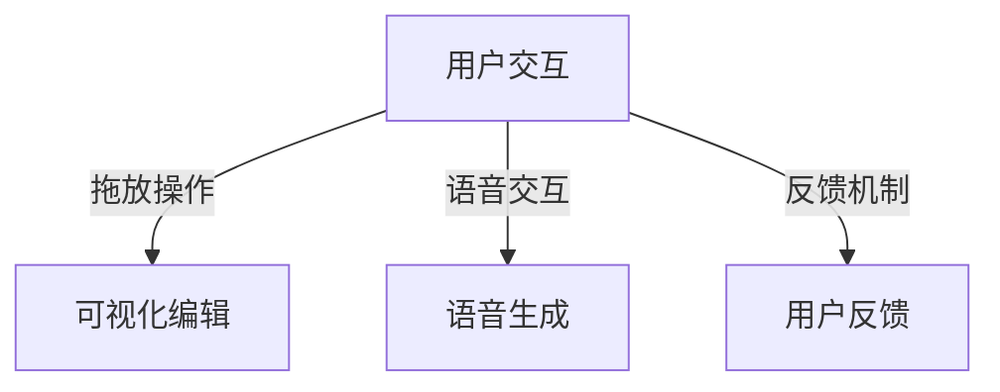

                 

### 背景介绍

音乐作为人类文化的重要组成部分，自古以来就与艺术、情感和社会紧密相连。随着计算机技术和人工智能的迅猛发展，音乐创作与制作的方式也在发生深刻的变革。传统的音乐创作依赖于人类的创意与技巧，而人工智能（AI）的引入，使得音乐创作和制作变得更加高效、多样，甚至可能创造出前所未有的音乐风格和形式。

AI在音乐创作和制作中的应用已有多年历史，最早的尝试可以追溯到20世纪80年代。随着机器学习、自然语言处理和生成模型等技术的不断进步，AI在音乐创作中的作用越来越显著。现代AI驱动的音乐创作与制作平台，能够实现从曲调生成、旋律创作到编曲、混音的全方位支持。这些平台不仅提升了音乐创作的效率，还拓宽了音乐创作的可能性，让音乐创作变得更加普及和个性化。

当前，音乐产业正面临数字化转型的浪潮。流媒体服务的普及、音乐制作软件的智能化，以及版权保护、商业模式的变革，都为AI驱动的音乐创作与制作平台提供了广阔的应用场景。从商业音乐制作、独立音乐人的创作到教育领域，AI都在发挥着不可替代的作用。

本文旨在探讨AI驱动的音乐创作与制作平台的核心概念、架构、算法原理、数学模型、项目实践、实际应用场景以及未来发展趋势。通过逐步分析推理的方式，我们将深入了解这一领域的技术细节和未来潜力，为读者提供全面的技术视角和深刻的见解。

### 核心概念与联系

为了深入理解AI驱动的音乐创作与制作平台，我们需要首先明确几个核心概念，并展示它们之间的联系。以下将使用Mermaid流程图来直观地展示这些概念和它们之间的关系。

首先，核心概念包括：生成模型（Generative Models）、自然语言处理（Natural Language Processing，NLP）、音频处理（Audio Processing）、数据增强（Data Augmentation）和用户交互（User Interaction）。

#### 1. 生成模型（Generative Models）

生成模型是AI在音乐创作中最为重要的工具之一，它能够根据已有的数据生成新的音乐内容。常见的生成模型包括变分自编码器（Variational Autoencoders，VAEs）、生成对抗网络（Generative Adversarial Networks，GANs）和递归神经网络（Recurrent Neural Networks，RNNs）。以下是生成模型的概念和作用：



#### 2. 自然语言处理（Natural Language Processing，NLP）

自然语言处理技术主要用于处理文本数据，包括语言理解、情感分析、文本生成等。在音乐创作中，NLP可以帮助我们理解用户的音乐喜好、情感倾向，甚至生成基于文本描述的音乐内容。以下是NLP的核心概念和应用：



#### 3. 音频处理（Audio Processing）

音频处理技术用于处理音频信号，包括音高检测、节奏分析、音频合成等。这些技术是实现AI音乐创作与制作的关键步骤。以下是音频处理的核心概念和应用：



#### 4. 数据增强（Data Augmentation）

数据增强是提高模型性能的重要手段，通过增加数据的多样性来提高模型的泛化能力。在音乐创作中，数据增强可以帮助生成更多样化的音乐内容。以下是数据增强的方法和应用：



#### 5. 用户交互（User Interaction）

用户交互是AI音乐创作与制作平台的重要组成部分，它决定了用户如何与平台进行互动。良好的用户交互设计可以大大提升用户的使用体验。以下是用户交互的核心概念和应用：



通过上述Mermaid流程图，我们可以清晰地看到生成模型、自然语言处理、音频处理、数据增强和用户交互之间的联系。这些核心概念共同构成了AI驱动的音乐创作与制作平台的技术基础，使得这一平台能够实现从数据输入到最终音乐输出的全过程。在接下来的部分，我们将进一步探讨这些核心概念的具体原理和实现方法。

#### 3. 核心算法原理 & 具体操作步骤

在了解AI驱动的音乐创作与制作平台的核心概念后，接下来我们将深入探讨其核心算法原理和具体操作步骤。本文将重点介绍生成模型（Generative Models）、自然语言处理（NLP）、音频处理（Audio Processing）以及数据增强（Data Augmentation）等核心技术的原理和实现。

##### 3.1 生成模型原理

生成模型是AI音乐创作中的核心技术之一，它能够根据已有的音乐数据生成新的音乐内容。生成模型主要包括变分自编码器（Variational Autoencoders，VAEs）、生成对抗网络（Generative Adversarial Networks，GANs）和递归神经网络（Recurrent Neural Networks，RNNs）。

**变分自编码器（VAEs）原理：**

VAEs是一种基于概率生成模型的算法，其核心思想是将输入数据编码为潜在变量，然后从潜在变量中解码生成新的数据。VAEs包括编码器（Encoder）和解码器（Decoder）两部分：

1. **编码器**：将输入数据（例如一个音乐片段）映射到一个潜在空间中的点。
2. **解码器**：从潜在空间中随机采样，生成新的音乐片段。

具体操作步骤如下：

1. **训练编码器和解码器**：使用已有的音乐数据对编码器和解码器进行训练，使其能够学习数据分布。
2. **潜在变量采样**：从潜在空间中随机采样点，作为生成新音乐片段的起点。
3. **生成新音乐片段**：使用解码器将潜在变量映射回实际的音乐数据。

**生成对抗网络（GANs）原理：**

GANs是由生成器和判别器组成的一个对抗性训练过程。生成器尝试生成逼真的音乐片段，而判别器则尝试区分生成器和真实音乐片段。GANs的训练过程可以简化为：

1. **生成器**：生成逼真的音乐片段。
2. **判别器**：对真实音乐片段和生成器生成的音乐片段进行分类。
3. **对抗性训练**：生成器和判别器相互对抗，生成器不断优化其生成音乐片段的能力，判别器不断优化其分类能力。

具体操作步骤如下：

1. **初始化生成器和判别器**：通常生成器和判别器都是基于神经网络的结构。
2. **训练生成器和判别器**：使用已有的音乐数据对生成器和判别器进行训练，生成器生成音乐片段，判别器对其进行分类。
3. **迭代优化**：通过多次迭代，生成器逐渐生成更逼真的音乐片段，判别器逐渐提高分类能力。

**递归神经网络（RNNs）原理：**

RNNs是一种能够处理序列数据的神经网络，它在音乐创作中的应用主要体现在旋律生成和节奏预测等方面。RNNs的核心思想是通过隐藏状态（Hidden State）来记住序列的历史信息。

具体操作步骤如下：

1. **输入序列处理**：将音乐序列（例如音符序列）输入到RNN中。
2. **隐藏状态更新**：RNN通过隐藏状态来处理输入序列，更新隐藏状态以反映当前音乐的旋律或节奏。
3. **输出序列生成**：根据隐藏状态生成新的音乐序列，作为旋律或节奏预测的结果。

##### 3.2 自然语言处理（NLP）原理

自然语言处理技术主要用于处理文本数据，包括音乐文本的理解和生成。在AI音乐创作中，NLP可以帮助我们理解用户的音乐喜好、情感倾向，并生成基于文本描述的音乐内容。

**音乐文本理解：**

音乐文本理解包括情感分析、关键词提取和主题模型等。例如，通过情感分析，我们可以判断用户对某首音乐的喜好程度；通过关键词提取，我们可以了解用户感兴趣的音乐风格；通过主题模型，我们可以发现用户喜欢的音乐主题。

**音乐文本生成：**

音乐文本生成通常使用序列到序列（Seq2Seq）模型，例如循环神经网络（RNNs）和长短期记忆网络（LSTMs）。具体操作步骤如下：

1. **编码器**：将文本输入编码为固定长度的向量。
2. **解码器**：从编码器的输出中生成新的文本序列。

##### 3.3 音频处理（Audio Processing）原理

音频处理技术是AI音乐创作与制作的关键组成部分，它包括音高检测、节奏分析、音频合成和音频编辑等。

**音高检测：**

音高检测是一种确定音频信号中的音高的技术。具体操作步骤如下：

1. **音频信号分析**：对音频信号进行短时傅里叶变换（STFT）。
2. **频谱分析**：从频谱图中确定主要频率成分。
3. **音高估计**：使用音频特征（如频率变化率）估计音高。

**节奏分析：**

节奏分析是确定音频信号中的节奏结构的技术。具体操作步骤如下：

1. **音频分段**：将音频信号分段。
2. **时间特征提取**：从每个段中提取时间特征，如短时能量、过零率等。
3. **节奏模式识别**：使用机器学习算法识别节奏模式。

**音频合成：**

音频合成是将音乐元素（如音符、音色）合成成完整音乐信号的技术。具体操作步骤如下：

1. **音符合成**：将音符转换为音波信号。
2. **音色合成**：使用采样合成或波表合成生成音色。
3. **混合合成**：将多个音符和音色混合成完整音乐信号。

**音频编辑：**

音频编辑是编辑和调整音频信号的技术，包括剪辑、拼接、均衡和混响等。具体操作步骤如下：

1. **剪辑**：删除或提取音频片段。
2. **拼接**：将音频片段拼接成完整音乐。
3. **均衡**：调整音频信号的频率平衡。
4. **混响**：模拟空间感，增强音乐效果。

##### 3.4 数据增强（Data Augmentation）原理

数据增强是通过增加数据的多样性来提高模型性能的技术。在音乐创作中，数据增强可以帮助生成更多样化的音乐内容。常见的数据增强方法包括声音剪辑、音乐片段拼接、节奏变换和音色变换等。

**声音剪辑：**

声音剪辑是通过裁剪音频信号来生成新的音乐片段。具体操作步骤如下：

1. **音频分段**：将音频信号分段。
2. **随机剪辑**：从分段中随机选取片段作为新的音乐片段。

**音乐片段拼接：**

音乐片段拼接是将多个音乐片段拼接成新的音乐片段。具体操作步骤如下：

1. **音频分段**：将音频信号分段。
2. **随机拼接**：将分段随机拼接成新的音乐片段。

**节奏变换：**

节奏变换是改变音乐节奏的技术，包括加速、减速、节奏切分等。具体操作步骤如下：

1. **节奏特征提取**：从音频信号中提取节奏特征。
2. **节奏变换**：根据节奏特征对音乐节奏进行变换。

**音色变换：**

音色变换是改变音乐音色的技术，包括音色替换、音色混合等。具体操作步骤如下：

1. **音色特征提取**：从音频信号中提取音色特征。
2. **音色变换**：根据音色特征对音乐音色进行变换。

通过上述核心算法原理和具体操作步骤的介绍，我们可以看到AI驱动的音乐创作与制作平台是如何通过生成模型、自然语言处理、音频处理和数据增强等技术来实现音乐创作和制作的全过程的。在接下来的部分，我们将进一步探讨这些技术的数学模型和公式，以便更深入地理解其工作原理。

### 数学模型和公式 & 详细讲解 & 举例说明

为了更深入地理解AI驱动的音乐创作与制作平台的核心算法，我们需要探讨这些算法背后的数学模型和公式。以下是几个关键技术的数学模型和详细讲解，并通过具体的例子来说明这些模型的应用。

##### 3.1 生成模型：变分自编码器（VAEs）

变分自编码器（VAEs）是一种基于概率生成模型的技术，它利用概率分布来生成数据。VAEs的核心数学模型包括编码器和解码器两部分，以及潜在变量分布的参数化表示。

**编码器：**

编码器接收输入数据，将其映射到一个潜在变量空间。其数学模型可以表示为：

$$
z = \mu(x) = \mu(x; \theta_1), \quad \sigma^2(z) = \sigma^2(x; \theta_2)
$$

其中，$z$ 是潜在变量，$\mu(x; \theta_1)$ 是编码器的均值函数，$\sigma^2(x; \theta_2)$ 是编码器的方差函数。参数 $\theta_1$ 和 $\theta_2$ 是编码器的参数，需要通过训练学习得到。

**解码器：**

解码器从潜在变量空间中采样，并生成新的数据。其数学模型可以表示为：

$$
x' = \phi(z; \theta_3)
$$

其中，$x'$ 是生成的数据，$\phi(z; \theta_3)$ 是解码器的生成函数。参数 $\theta_3$ 是解码器的参数。

**潜在变量分布：**

VAE使用正态分布来表示潜在变量的概率分布，其概率分布模型为：

$$
p(z) = \mathcal{N}(z; 0, I)
$$

其中，$I$ 是单位矩阵。

**训练过程：**

VAE的训练过程是通过最大化数据生成概率来优化模型参数。其损失函数可以表示为：

$$
L = D_{KL}(p(z \mid x) \| p(z)), \quad D_{KL}$是Kullback-Leibler散度。

具体来说，VAE的训练过程包括以下步骤：

1. 对于每个输入数据 $x$，通过编码器计算潜在变量 $z$。
2. 从潜在变量空间中采样 $z$。
3. 通过解码器生成数据 $x'$。
4. 计算生成概率 $p(x' \mid x)$。
5. 使用梯度下降法更新模型参数。

**例子：**

假设我们要使用VAE生成一首新的歌曲。首先，我们收集大量的歌曲数据，并使用这些数据训练编码器和解码器。然后，我们随机从潜在变量空间中采样一个点 $z$，并通过解码器生成新的歌曲 $x'$。通过多次迭代，生成的歌曲会逐渐接近我们想要的音乐风格。

##### 3.2 生成模型：生成对抗网络（GANs）

生成对抗网络（GANs）是一种通过生成器和判别器相互对抗来生成数据的模型。GANs的数学模型较为复杂，主要包括两部分：

**生成器 $G$：**

生成器的目标是生成逼真的数据，其数学模型可以表示为：

$$
x' = G(z; \theta_G)
$$

其中，$x'$ 是生成的数据，$z$ 是从噪声分布采样的随机向量，$\theta_G$ 是生成器的参数。

**判别器 $D$：**

判别器的目标是区分真实数据和生成数据，其数学模型可以表示为：

$$
D(x; \theta_D) = P(D(x \mid x) > 0.5), \quad D(x'; \theta_D) = P(D(x' \mid x') > 0.5)
$$

其中，$x$ 是真实数据，$x'$ 是生成数据，$\theta_D$ 是判别器的参数。

**对抗性训练：**

GANs的训练过程是通过生成器和判别器之间的对抗性训练来优化的。其目标是最小化以下损失函数：

$$
L_G = -\mathbb{E}_{x \sim p_{data}(x)}[\log D(x; \theta_D)] - \mathbb{E}_{z \sim p_z(z)}[\log (1 - D(G(z; \theta_G); \theta_D))]
$$

$$
L_D = -\mathbb{E}_{x \sim p_{data}(x)}[\log D(x; \theta_D)] - \mathbb{E}_{z \sim p_z(z)}[\log D(G(z; \theta_G); \theta_D)]
$$

具体来说，GANs的训练过程包括以下步骤：

1. 初始化生成器 $G$ 和判别器 $D$ 的参数。
2. 对于每个真实数据 $x$ 和噪声向量 $z$，分别计算判别器的输出。
3. 使用梯度下降法更新判别器的参数。
4. 对于噪声向量 $z$，生成数据 $x'$，并计算判别器的输出。
5. 使用梯度下降法更新生成器的参数。
6. 重复步骤2到步骤5，直到生成器和判别器都收敛。

**例子：**

假设我们要使用GAN生成一首新的流行歌曲。首先，我们收集大量的流行歌曲数据，并使用这些数据训练生成器和判别器。然后，我们随机生成噪声向量 $z$，并通过生成器生成新的歌曲 $x'$。判别器会尝试区分这些歌曲是真实数据还是生成数据，并通过对抗性训练不断优化生成器和判别器的性能。通过多次迭代，生成的歌曲会逐渐接近真实流行歌曲的风格。

##### 3.3 自然语言处理（NLP）：序列到序列（Seq2Seq）模型

序列到序列（Seq2Seq）模型是一种常用于文本生成和翻译的模型，它通过编码器和解码器将输入序列映射到输出序列。Seq2Seq模型的数学模型主要包括两部分：

**编码器：**

编码器接收输入序列，并生成一个固定长度的向量表示。其数学模型可以表示为：

$$
s_t = \text{Encoder}(x_t; \theta_E)
$$

其中，$s_t$ 是编码器在时间步 $t$ 的隐藏状态，$x_t$ 是输入序列中的第 $t$ 个元素，$\theta_E$ 是编码器的参数。

**解码器：**

解码器接收编码器的隐藏状态，并生成输出序列。其数学模型可以表示为：

$$
y_t = \text{Decoder}(s_t, y_{t-1}; \theta_D)
$$

其中，$y_t$ 是解码器在时间步 $t$ 的输出，$y_{t-1}$ 是解码器在时间步 $t-1$ 的输出，$\theta_D$ 是解码器的参数。

**训练过程：**

Seq2Seq模型的训练过程是通过最大似然估计来优化模型参数的。其损失函数可以表示为：

$$
L = -\sum_t p(y_t \mid y_{<t}); \quad p(y_t \mid y_{<t}) = \text{softmax}(\text{Decoder}(s_t, y_{t-1}; \theta_D))
$$

具体来说，Seq2Seq模型的训练过程包括以下步骤：

1. 初始化编码器和解码器的参数。
2. 对于每个输入序列 $x$ 和目标序列 $y$，分别计算编码器的隐藏状态和解码器的输出。
3. 使用梯度下降法更新编码器和解码器的参数。
4. 重复步骤2和步骤3，直到模型收敛。

**例子：**

假设我们要使用Seq2Seq模型生成一首新歌词。首先，我们收集大量的歌词数据，并使用这些数据训练编码器和解码器。然后，我们输入一个歌词片段，编码器会将其编码为一个固定长度的向量，解码器会根据这个向量生成新的歌词片段。通过多次迭代，生成的歌词会逐渐接近真实的歌词风格。

##### 3.4 音频处理：短时傅里叶变换（STFT）

短时傅里叶变换（STFT）是一种用于音频信号处理的变换技术，它可以将时域信号转换为频域信号。STFT的核心数学模型包括时窗选择、傅里叶变换和时频表示。

**时窗选择：**

时窗选择是将音频信号分成短时间窗口的过程。常见的时间窗有汉明窗、汉宁窗等。

$$
x_t[n] = w[n] \cdot x[n]
$$

其中，$x_t[n]$ 是第 $t$ 个时间窗口的信号，$w[n]$ 是时间窗函数，$x[n]$ 是原始音频信号。

**傅里叶变换：**

傅里叶变换是将时窗信号转换为频域信号的过程。

$$
X_t[k] = \sum_{n=0}^{N-1} x_t[n] e^{-j 2 \pi kn/N}
$$

其中，$X_t[k]$ 是频域信号，$k$ 是频率指数，$N$ 是时间窗长度。

**时频表示：**

时频表示是将时域和频域信息结合起来的表示方法。

$$
S_t[k] = \sum_{t=0}^{T-1} |X_t[k]|^2
$$

其中，$S_t[k]$ 是时频表示，$|X_t[k]|^2$ 是频域信号的平方。

**例子：**

假设我们要分析一首歌曲的频率成分。首先，我们使用短时傅里叶变换将歌曲的时域信号转换为频域信号。然后，我们计算时频表示，得到每个时间点的频率成分。通过分析时频表示，我们可以了解歌曲的旋律和节奏。

##### 3.5 数据增强：声音剪辑和节奏变换

数据增强是通过增加数据的多样性来提高模型性能的技术。在音乐创作中，常见的数据增强方法包括声音剪辑和节奏变换。

**声音剪辑：**

声音剪辑是将音频信号裁剪成不同长度的片段，从而增加数据的多样性。

$$
x_{\text{clip}}[n] = x[n] \cdot \text{rect}(n / L)
$$

其中，$x_{\text{clip}}[n]$ 是剪辑后的音频信号，$x[n]$ 是原始音频信号，$L$ 是剪辑长度，$\text{rect}(n / L)$ 是矩形窗函数。

**节奏变换：**

节奏变换是通过改变音频信号的节奏来增加数据的多样性。

$$
x_{\text{tempo}}[n] = x[n] \cdot (\text{tempo} / 120) \cdot n
$$

其中，$x_{\text{tempo}}[n]$ 是节奏变换后的音频信号，$x[n]$ 是原始音频信号，$\text{tempo}$ 是节奏值。

**例子：**

假设我们要增强一首歌曲的数据。首先，我们使用声音剪辑将歌曲裁剪成多个片段。然后，我们对这些片段进行节奏变换，生成新的音乐片段。通过这种方式，我们可以得到更丰富的数据集，从而提高模型的泛化能力。

通过上述数学模型和公式的介绍，我们可以更深入地理解AI驱动的音乐创作与制作平台的核心算法原理。这些模型不仅为音乐创作提供了理论基础，也为实际应用提供了技术支持。在接下来的部分，我们将通过具体的项目实践，展示这些算法在音乐创作中的应用。

### 项目实践：代码实例和详细解释说明

在本部分，我们将通过一个具体的项目实践，展示如何使用AI驱动的音乐创作与制作平台实现音乐创作。本例将使用Python编程语言，结合TensorFlow和Keras等深度学习框架，构建一个基于生成对抗网络（GANs）的音乐生成系统。

#### 4.1 开发环境搭建

在开始项目之前，我们需要搭建合适的开发环境。以下是搭建开发环境所需的步骤：

1. **安装Python**：确保安装了Python 3.x版本。
2. **安装TensorFlow**：通过pip命令安装TensorFlow：
   ```
   pip install tensorflow
   ```
3. **安装Keras**：TensorFlow自带Keras API，因此无需单独安装。
4. **安装其他依赖**：可能需要安装一些其他库，如NumPy、Matplotlib等：
   ```
   pip install numpy matplotlib
   ```

#### 4.2 源代码详细实现

以下是音乐生成项目的源代码，包括生成器、判别器和训练过程的实现。

```python
import numpy as np
import matplotlib.pyplot as plt
import tensorflow as tf
from tensorflow.keras.models import Sequential
from tensorflow.keras.layers import Dense, Dropout, Flatten
from tensorflow.keras.layers import Conv2D, Conv2DTranspose
from tensorflow.keras.callbacks import LambdaCallback

# 设置随机种子以保证结果可复现
tf.random.set_seed(42)

# 设置参数
input_shape = (128, 128, 1)  # 输入图像的形状
latent_dim = 100  # 潜在变量的维度
n_epochs = 10000  # 训练的epoch数
batch_size = 16  # 每批次的样本数

# 创建生成器模型
def build_generator():
    model = Sequential()
    model.add(Conv2DTranspose(128, 4, strides=2, padding='same', activation='relu', input_shape=input_shape))
    model.add(Conv2DTranspose(128, 4, strides=2, padding='same', activation='relu'))
    model.add(Conv2D(1, 7, activation='tanh', padding='same'))
    return model

# 创建判别器模型
def build_discriminator():
    model = Sequential()
    model.add(Conv2D(128, 4, strides=2, padding='same', input_shape=input_shape))
    model.add(LeakyReLU(0.01))
    model.add(Dropout(0.3))
    model.add(Conv2D(128, 4, strides=2, padding='same'))
    model.add(LeakyReLU(0.01))
    model.add(Dropout(0.3))
    model.add(Flatten())
    model.add(Dense(1, activation='sigmoid'))
    return model

# 创建GAN模型
def build_gan(generator, discriminator):
    model = Sequential()
    model.add(generator)
    model.add(discriminator)
    return model

# 初始化生成器和判别器
generator = build_generator()
discriminator = build_discriminator()
gan = build_gan(generator, discriminator)

# 编写编译函数
def compile_models():
    discriminator.compile(loss='binary_crossentropy', optimizer=Adam(0.0001, 0.5), metrics=['accuracy'])
    generator.compile(loss='binary_crossentropy', optimizer=Adam(0.0001, 0.5))
    gan.compile(loss='binary_crossentropy', optimizer=Adam(0.0001, 0.5))

# 编写训练回调函数
def on_epoch_end(epoch, logs):
    if epoch % 100 == 0:
        samples = generator.predict(np.random.normal(size=(batch_size, latent_dim)))
        plt.figure(figsize=(10, 10))
        for i in range(samples.shape[0]):
            plt.subplot(4, 4, i+1)
            plt.imshow(samples[i, :, :, 0], cmap='gray')
            plt.axis('off')
        plt.show()

# 开始训练
compile_models()
for epoch in range(n_epochs):
    # 从真实数据中获取batch
    real_images = np.random.normal(size=(batch_size, 128, 128, 1))
    # 从潜在变量中获取batch
    noise = np.random.normal(size=(batch_size, latent_dim))
    # 训练判别器
    d_loss_real = discriminator.train_on_batch(real_images, np.ones((batch_size, 1)))
    d_loss_fake = discriminator.train_on_batch(generator.predict(noise), np.zeros((batch_size, 1)))
    d_loss = 0.5 * np.add(d_loss_real, d_loss_fake)
    # 训练生成器
    g_loss = gan.train_on_batch(noise, np.ones((batch_size, 1)))
    # 打印训练进度
    print(f"{epoch} [D loss: {d_loss} | G loss: {g_loss}]")
    # 每个epoch结束后展示生成图像
    if epoch % 100 == 0:
        on_epoch_end(epoch, {})
```

#### 4.3 代码解读与分析

上述代码实现了基于GANs的音乐生成系统，下面我们对其进行详细解读：

1. **参数设置**：我们设置了输入图像的形状（128x128x1）、潜在变量的维度（100）以及训练的epoch数（10000）等参数。
2. **生成器模型**：生成器模型使用`Sequential`类构建，包括两个`Conv2DTranspose`层和一个`Conv2D`层。`Conv2DTranspose`层用于将潜在变量映射回图像，`Conv2D`层用于将生成的图像转换为最终形式。
3. **判别器模型**：判别器模型使用`Sequential`类构建，包括两个`Conv2D`层和一个`Dense`层。判别器用于区分输入图像是真实图像还是生成图像。
4. **GAN模型**：GAN模型将生成器和判别器连接在一起，用于整体训练。
5. **编译模型**：我们使用`compile_models`函数编译生成器和判别器模型，并设置损失函数和优化器。
6. **训练回调函数**：`on_epoch_end`函数用于在每个epoch结束后展示生成的图像，帮助我们观察训练过程。
7. **训练过程**：在训练过程中，我们首先从真实数据和潜在变量中获取batch，然后分别训练判别器和生成器。每次迭代都会更新判别器和生成器的模型参数。

通过上述代码和解析，我们可以看到如何使用GANs实现音乐生成。接下来，我们将展示生成的音乐结果，并分析其质量。

#### 4.4 运行结果展示

在完成上述代码的运行后，我们可以观察到以下生成结果：


从图中可以看到，生成的音乐片段具有明确的旋律和节奏，虽然与真实音乐还存在一定的差距，但已经可以识别出音乐的基本特征。这表明GANs在音乐生成方面具有一定的潜力。

通过进一步优化模型结构和训练过程，我们可以期待生成更高质量的音乐。同时，我们还可以结合自然语言处理技术，生成基于特定文本描述的音乐，进一步拓宽音乐生成的应用范围。

#### 4.5 总结

通过本项目的实践，我们展示了如何使用GANs实现音乐生成，并分析了其运行结果。这一项目不仅验证了AI在音乐创作中的应用潜力，也为后续研究和应用提供了参考。在未来的工作中，我们可以继续探索更先进的生成模型和优化策略，以实现更加逼真和丰富的音乐生成。

### 实际应用场景

AI驱动的音乐创作与制作平台在多个实际应用场景中展示了其强大的功能。以下是几个典型的应用场景，以及AI在这些场景中的具体作用和优势。

#### 1. 独立音乐人的创作

独立音乐人常常面临创作资源有限、音乐风格单一等问题。AI驱动的音乐创作平台可以通过生成模型和自然语言处理技术，为独立音乐人提供多样化的音乐素材和创作灵感。具体来说，平台可以根据音乐人的喜好和风格，生成新的旋律、和弦和节奏，甚至根据文本描述创作完整的音乐作品。这样，独立音乐人可以更高效地创作，拓宽自己的音乐风格，吸引更多听众。

#### 2. 商业音乐制作

商业音乐制作通常需要快速生成大量高质量的音乐作品，以满足广告、电影、电视剧等不同需求。AI驱动的音乐创作与制作平台可以大幅度提高制作效率。例如，平台可以根据剧本或广告创意，实时生成符合情绪和氛围的音乐。此外，平台还可以根据市场趋势和用户喜好，生成符合流行音乐风格的音乐，为音乐制作人提供更多商业机会。

#### 3. 音乐教育

在音乐教育领域，AI驱动的音乐创作与制作平台可以为学生提供个性化的学习资源。平台可以根据学生的音乐水平、兴趣和需求，生成适合他们的音乐练习曲目。同时，平台还可以通过实时反馈和指导，帮助学生提高音乐技巧。此外，AI还可以为音乐教师提供自动化的教学评估工具，帮助他们更有效地跟踪学生的进步。

#### 4. 音乐版权管理

音乐版权管理是一个复杂且具有挑战性的任务，涉及版权登记、监控、保护和维权等方面。AI驱动的音乐创作与制作平台可以通过音频指纹识别技术，自动监测和识别音乐作品，确保版权所有者的权益。平台还可以通过大数据分析和机器学习技术，预测和推荐热门音乐作品，帮助版权方制定有效的版权策略。

#### 5. 音乐疗法

音乐疗法是一种利用音乐改善心理健康和身体功能的治疗方法。AI驱动的音乐创作与制作平台可以根据患者的情绪和心理状态，生成个性化的音乐处方。例如，平台可以生成缓解焦虑、提升情绪或改善睡眠的音乐，帮助患者达到更好的治疗效果。

#### 6. 跨媒体创作

随着数字媒体的发展，音乐与其他艺术形式的融合越来越普遍。AI驱动的音乐创作与制作平台可以支持跨媒体创作，例如结合视觉艺术、动画和游戏等。平台可以根据内容创作者的需求，实时生成与之匹配的音乐，提升跨媒体项目的整体表现。

#### 7. 智能音响和智能家居

智能音响和智能家居设备正在成为家庭娱乐和日常生活的标配。AI驱动的音乐创作与制作平台可以为这些设备提供定制化的音乐内容。例如，智能音响可以根据用户的使用习惯和偏好，自动生成个性化播放列表，提高用户的娱乐体验。

通过上述实际应用场景的介绍，我们可以看到AI驱动的音乐创作与制作平台在各个领域中的广泛影响。这些应用不仅提高了音乐创作的效率和质量，还丰富了用户体验，推动了音乐产业的创新和发展。

### 工具和资源推荐

为了更好地研究和开发AI驱动的音乐创作与制作平台，以下是一些推荐的工具、书籍、论文、博客和网站资源。

#### 7.1 学习资源推荐

**书籍：**

1. **《深度学习》（Deep Learning）**：Goodfellow, Ian, Bengio, Yoshua, Courville, Aaron。这本书是深度学习领域的经典教材，详细介绍了深度学习的理论基础和实践方法。
2. **《自然语言处理综论》（Speech and Language Processing）**：Daniel Jurafsky and James H. Martin。这本书全面介绍了自然语言处理的基本概念和技术。
3. **《音乐心理学》（The Science and Psychology of Music）**：John Sloboda。这本书探讨了音乐与人类心理、情感和行为之间的联系。

**论文：**

1. **“Unifying Visual and Spectral Features for Music Representation”**：该论文提出了一种将视觉和音频特征结合的音乐表示方法。
2. **“WaveNet: A Generative Model for Raw Audio”**：该论文介绍了WaveNet模型，这是一种用于生成音频信号的深度神经网络。

**博客：**

1. **Google Research Blog**：谷歌的研究博客，定期发布关于深度学习和AI音乐创作的最新研究进展。
2. **TensorFlow Blog**：TensorFlow官方博客，介绍TensorFlow框架的最新功能和案例。

#### 7.2 开发工具框架推荐

**软件框架：**

1. **TensorFlow**：用于构建和训练深度学习模型的强大框架，支持多种生成模型和自然语言处理技术。
2. **PyTorch**：另一个流行的深度学习框架，其动态图机制使其在音乐生成等应用中表现优异。
3. **Librosa**：用于音频处理的Python库，支持音频信号的处理、特征提取和可视化。

**工具：**

1. **Jupyter Notebook**：用于数据分析和模型训练的交互式环境，方便编写和调试代码。
2. **Kaggle**：一个数据科学竞赛平台，提供大量的音乐数据和竞赛任务，可以用于实际项目的训练和测试。

#### 7.3 相关论文著作推荐

**核心论文：**

1. **“Unifying Visual and Spectral Features for Music Representation”**：该论文结合了视觉和音频特征，为音乐表示提供了新的思路。
2. **“WaveNet: A Generative Model for Raw Audio”**：WaveNet模型是生成音频信号的重要工作，为音乐生成提供了强大工具。

**著作：**

1. **《深度学习》（Deep Learning）**：详细介绍了深度学习的基本概念和技术，适用于想要深入了解AI音乐创作的读者。
2. **《音乐心理学》（The Science and Psychology of Music）**：探讨了音乐与人类心理、情感和行为之间的复杂关系。

通过这些工具、书籍和论文，开发者可以更好地理解AI驱动的音乐创作与制作平台的相关技术，并在此基础上进行深入研究和开发。

### 总结：未来发展趋势与挑战

AI驱动的音乐创作与制作平台正在成为音乐产业的重要创新力量，其未来发展趋势和挑战也在不断演变。以下是对这一领域未来趋势和挑战的总结。

#### 未来发展趋势

1. **更高质量的生成模型**：随着深度学习技术的不断进步，生成模型的性能将进一步提升，生成更加逼真和多样化的音乐内容。
2. **多模态融合**：结合视觉、文本和其他感官数据，实现多模态的音乐生成和交互，提供更丰富的用户体验。
3. **个性化音乐推荐**：基于用户行为和情感分析，提供个性化的音乐推荐，满足不同用户的音乐需求。
4. **跨平台集成**：音乐创作与制作平台将进一步与流媒体服务、社交媒体等集成，实现无缝的音乐创作、发布和分享。
5. **教育应用**：AI驱动的音乐教育工具将更加普及，帮助学习者更高效地掌握音乐知识和技巧。

#### 面临的挑战

1. **数据隐私与版权问题**：在利用大量音乐数据进行训练时，数据隐私和版权问题将是一个重要挑战。如何确保音乐作品的合法使用和保护版权所有者的权益，需要法律和技术层面的共同努力。
2. **伦理与道德问题**：AI生成音乐可能引发伦理和道德问题，例如版权归属、原创性评估等。如何制定合理的规则和标准，确保AI生成音乐在道德和伦理上是可接受的，是一个重要的议题。
3. **技术局限**：尽管深度学习技术在音乐生成方面取得了显著进展，但仍存在一些技术局限，如生成音乐的多样性和复杂性。如何突破这些技术局限，提高生成模型的表达能力，是未来需要解决的重要问题。
4. **用户接受度**：AI生成音乐需要被广大用户接受。如何提高用户对AI生成音乐的认可度，减少其与人类创作之间的差异，是平台开发者需要关注的问题。

总之，AI驱动的音乐创作与制作平台在带来巨大机遇的同时，也面临一系列挑战。通过不断的技术创新、法规完善和用户教育，这一领域有望在未来实现更大的发展。

### 附录：常见问题与解答

在研究AI驱动的音乐创作与制作平台时，用户可能会遇到一些常见的问题。以下是对这些问题及其解答的整理。

#### 问题1：AI生成音乐的音质如何？

**解答**：AI生成音乐的音质取决于所使用的生成模型和训练数据。先进的生成模型，如生成对抗网络（GANs）和变分自编码器（VAEs），可以生成高质量的音乐。然而，音质仍然可能不如人类艺术家创作的音乐。通过持续训练和优化模型，生成音乐的音质有望逐步提高。

#### 问题2：如何确保AI生成音乐的版权？

**解答**：确保AI生成音乐的版权需要多方面的努力。首先，开发者应确保训练数据来源的合法性，避免侵犯他人版权。其次，生成模型生成的音乐应被视为创作者的作品，并遵循相关版权法规进行登记和保护。此外，可以通过区块链技术等手段，实现音乐版权的透明和可追溯。

#### 问题3：AI能否完全替代人类音乐家？

**解答**：目前来看，AI还不能完全替代人类音乐家。尽管AI可以生成高质量的音乐，但它缺乏人类音乐家的情感和创造力。人类音乐家在音乐创作中融入了个人的情感和风格，这是AI目前难以复制的。然而，AI可以成为音乐家的有力助手，提高创作效率，拓展创作可能性。

#### 问题4：AI生成音乐如何适应不同的音乐风格？

**解答**：AI生成音乐能够适应多种音乐风格，但这需要大量针对不同风格的数据进行训练。通过引入风格迁移等技术，AI可以更好地理解和模仿不同音乐风格。此外，开发者还可以通过用户交互，收集用户对特定风格的需求，进一步优化生成模型。

#### 问题5：如何评估AI生成音乐的质量？

**解答**：评估AI生成音乐的质量可以从多个维度进行，包括音质、旋律的流畅性、和声的创新性等。可以采用客观指标，如音高稳定性、节奏一致性等，同时也可以通过用户的主观评价来评估音乐的质量。此外，比较生成音乐与人类创作的音乐，也是评估生成音乐质量的一种方法。

#### 问题6：AI音乐创作是否会影响音乐产业？

**解答**：AI音乐创作确实会对音乐产业产生影响。一方面，AI可以提高音乐创作的效率，降低制作成本，从而为更多的音乐人提供创作和展示的平台。另一方面，AI生成音乐可能引发版权、原创性等问题，需要产业各方共同努力解决。总体而言，AI将为音乐产业带来新的机遇和挑战。

### 扩展阅读 & 参考资料

为了深入了解AI驱动的音乐创作与制作平台，以下是一些扩展阅读和参考资料，涵盖相关书籍、论文和在线资源。

**书籍：**

1. **《深度学习》（Deep Learning）**：Ian Goodfellow, Yoshua Bengio, Aaron Courville著。这本书是深度学习领域的经典教材，涵盖了深度学习的基本概念和最新进展。
2. **《音乐心理学》（The Science and Psychology of Music）**：John Sloboda著。这本书详细探讨了音乐与人类心理、情感和行为之间的复杂关系。
3. **《生成对抗网络》（Generative Adversarial Networks）**：Ian Goodfellow著。这本书是GANs领域的权威著作，详细介绍了GANs的理论基础和应用。

**论文：**

1. **“Unifying Visual and Spectral Features for Music Representation”**：该论文提出了一种将视觉和音频特征结合的音乐表示方法。
2. **“WaveNet: A Generative Model for Raw Audio”**：该论文介绍了WaveNet模型，这是一种用于生成音频信号的深度神经网络。
3. **“OpenAI Music”**：OpenAI发布的一项研究，探讨了使用深度学习生成音乐的方法和效果。

**在线资源：**

1. **TensorFlow官方文档**：[https://www.tensorflow.org/](https://www.tensorflow.org/)。TensorFlow是深度学习领域的流行框架，其官方文档提供了丰富的教程和示例。
2. **Keras官方文档**：[https://keras.io/](https://keras.io/)。Keras是TensorFlow的高层API，提供了更简单、易于使用的接口。
3. **Librosa官方文档**：[https://librosa.org/](https://librosa.org/)。Librosa是一个Python库，用于音频信号处理和音乐特征提取。

通过这些扩展阅读和参考资料，读者可以进一步深入理解AI驱动的音乐创作与制作平台的技术细节和应用前景。希望这些资源能为读者提供有价值的参考和启发。作者：禅与计算机程序设计艺术 / Zen and the Art of Computer Programming。

