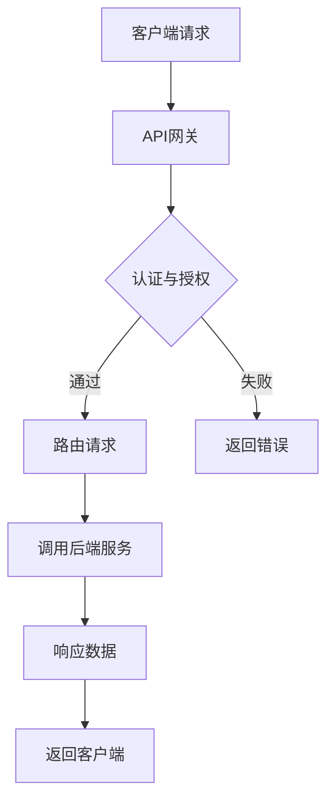

                 

### 背景介绍

API（应用程序编程接口）作为现代软件开发中不可或缺的组成部分，已经成为企业和服务提供商之间的重要桥梁。随着互联网的普及和业务需求的变化，API的开发与管理变得尤为重要。本文旨在深入探讨API开发与管理的核心概念、方法、工具以及其实际应用场景，帮助读者构建一个高效、稳定、安全的开放生态系统。

#### API的定义与作用

API是使不同软件系统之间能够相互通信的接口。通过API，开发者可以在不接触底层代码的情况下，利用现有系统提供的服务和功能。例如，一个电商网站可以使用第三方支付平台的API来实现支付功能，而无需从零开始开发支付系统。

API的作用主要体现在以下几个方面：

1. **促进模块化和复用**：通过API，可以将系统功能分解为独立的模块，便于管理和维护。开发者只需关注特定模块的功能，无需关心整体系统的复杂性。
2. **提升开发效率**：使用API可以节省大量时间和资源，不必重复开发已经存在的服务。
3. **实现跨平台兼容**：API提供了一种标准化接口，使得不同平台和设备之间的交互变得简单。
4. **增强业务灵活性**：API使得业务系统可以快速适应市场变化，通过扩展或更换API实现新的功能。

#### API开发与管理的挑战

尽管API具有诸多优势，但其开发与管理也面临一系列挑战：

1. **安全性**：API暴露在互联网上，容易成为黑客攻击的目标。如何确保API的安全性，防止数据泄露和恶意攻击，是一个重要课题。
2. **可扩展性**：随着业务规模的扩大，API需要具备良好的扩展性，能够轻松适应新的功能和需求。
3. **版本管理**：不同版本的API共存时，如何确保向后兼容，降低版本变更带来的风险，是一个技术难题。
4. **文档和文档化**：良好的API文档对于开发者而言至关重要，但编写和维护文档需要付出大量时间和精力。
5. **性能优化**：API需要保持高性能，以满足高并发访问的需求。

#### 本文目标

本文将深入探讨API开发与管理的核心概念、方法、工具和实际应用场景，旨在帮助读者：

1. 理解API的基本原理和开发流程。
2. 掌握API设计的关键要素，如安全性、可扩展性、版本管理和文档化。
3. 了解如何使用现代工具和技术（如API网关、认证机制等）来构建高效、稳定的API。
4. 分析API在现实世界中的应用案例，从中吸取经验教训。
5. 探索API开发与管理的未来发展趋势和挑战。

接下来，我们将详细讨论API的核心概念与联系，为后续内容奠定基础。

### 核心概念与联系

在深入探讨API开发与管理之前，我们需要了解一些核心概念和它们之间的联系。以下是一些关键术语和概念，以及它们在API开发与管理中的角色。

#### API设计

API设计是API开发的基础，决定了API的可用性、可维护性和安全性。良好的API设计应遵循以下原则：

1. **简洁性**：API应该简单直观，易于理解和使用。
2. **一致性**：API应保持一致性，避免冗余和混淆。
3. **易扩展性**：API应设计为易于扩展，以适应未来的变化。
4. **灵活性**：API应允许不同的调用方式和参数，以适应多样化的使用场景。

#### RESTful API

RESTful API是一种基于HTTP协议的API设计风格，它通过GET、POST、PUT、DELETE等HTTP方法来操作资源。RESTful API具有以下特点：

1. **无状态性**：每次请求都是独立的，服务器不会保留任何关于客户端的信息。
2. **统一接口**：使用标准的HTTP方法、URL和状态码，简化了API的设计和实现。
3. **状态转移**：通过HTTP请求和响应之间的交互，实现客户端和服务器之间的状态转移。
4. **缓存**：支持HTTP缓存机制，提高系统性能。

#### API网关

API网关是一个重要的组件，用于管理和路由API请求。它的作用包括：

1. **请求路由**：将来自不同客户端的请求路由到正确的后端服务。
2. **负载均衡**：分发请求到多个后端实例，确保系统的高可用性和性能。
3. **安全认证**：对API请求进行认证和授权，防止未经授权的访问。
4. **日志记录和监控**：记录API请求和响应的详细信息，用于日志分析和性能监控。

#### API认证和授权

API认证和授权是确保API安全性的重要手段。常用的认证和授权机制包括：

1. **基本认证**：使用用户名和密码进行认证。
2. **令牌认证**：使用令牌（如JWT）进行认证，令牌通常包含用户身份信息。
3. **OAuth 2.0**：一种开放标准，用于授权第三方应用访问受保护资源。
4. **API密钥**：使用API密钥进行认证，适合于简单的API访问控制。

#### API文档

API文档是开发者使用API的指南，它应包含以下内容：

1. **接口定义**：描述API的URL、请求参数和响应格式。
2. **示例代码**：提供实际请求和响应的示例，帮助开发者快速上手。
3. **错误处理**：描述可能出现的错误及其处理方法。
4. **API变更日志**：记录API的变更历史，帮助开发者了解API的演进。

#### Mermaid 流程图

为了更好地理解API的核心概念和联系，我们可以使用Mermaid流程图来可视化这些概念。以下是一个示例流程图，展示了API请求的处理流程：



在本文的后续部分，我们将进一步探讨这些核心概念在实际应用中的具体实现和操作步骤。通过逐步分析和推理，我们将深入理解API开发与管理的全过程。

### 核心算法原理 & 具体操作步骤

在理解了API的核心概念和联系之后，接下来我们将探讨API开发的核心算法原理以及具体的操作步骤。API的核心算法通常包括数据交互、安全性保证、错误处理和性能优化等方面。以下我们将详细介绍每个方面的具体原理和操作步骤。

#### 数据交互

数据交互是API的核心功能之一。一个高效的API应能够处理各种数据格式，如JSON、XML等。以下是数据交互的核心算法原理和操作步骤：

1. **JSON格式处理**：

   - **原理**：JSON（JavaScript Object Notation）是一种轻量级数据交换格式，易于阅读和编写，广泛用于Web应用程序和API通信。
   - **操作步骤**：
     1. 使用JSON编码器将请求体中的数据转换为JSON字符串。
     2. 发送请求时，设置Content-Type为application/json。
     3. 服务端接收请求后，使用JSON解码器将JSON字符串还原为对象。

   示例代码（Python）：

   ```python
   import json

   # 请求体数据
   request_data = {"key1": "value1", "key2": "value2"}

   # JSON编码
   json_data = json.dumps(request_data)

   # 发送请求（此处仅为示例，实际发送方式取决于使用的库或框架）
   # response = send_request(json_data)

   # JSON解码
   response_data = json.loads(response.json())
   ```

2. **XML格式处理**：

   - **原理**：XML（eXtensible Markup Language）是一种用于表示结构化数据的标记语言，适用于需要严格结构化数据的场景。
   - **操作步骤**：
     1. 使用XML编码器将请求体中的数据转换为XML字符串。
     2. 发送请求时，设置Content-Type为application/xml。
     3. 服务端接收请求后，使用XML解码器将XML字符串还原为对象。

   示例代码（Java）：

   ```java
   import javax.xml.parsers.DocumentBuilderFactory;
   import org.w3c.dom.Document;

   // 请求体数据
   String request_data = "<root><key1>value1</key1><key2>value2</key2></root>";

   // XML编码
   DocumentBuilderFactory factory = DocumentBuilderFactory.newInstance();
   Document document = factory.newDocumentBuilder().parse(new InputSource(new StringReader(request_data)));

   // 发送请求（此处仅为示例，实际发送方式取决于使用的库或框架）
   // Response response = sendRequest(request_data);

   // XML解码
   String response_data = document.toString();
   ```

#### 安全性保证

确保API的安全性是API开发和管理的重要一环。以下是一些常用的安全性保证算法原理和操作步骤：

1. **基本认证**：

   - **原理**：基本认证是一种简单的身份验证方法，通过HTTP基本认证头（Authorization）发送用户名和密码。
   - **操作步骤**：
     1. 客户端在请求头中添加Authorization字段，值为Basic base64编码的用户名:密码。
     2. 服务端接收到请求后，解析Authorization字段，提取用户名和密码。
     3. 服务端使用存储的密码验证用户名。

   示例代码（Python）：

   ```python
   import requests
   from requests.auth import HTTPBasicAuth

   # 请求URL
   url = "https://example.com/api/resource"

   # 用户名和密码
   username = "user"
   password = "pass"

   # 发送请求（使用基本认证）
   response = requests.get(url, auth=HTTPBasicAuth(username, password))
   ```

2. **令牌认证**：

   - **原理**：令牌认证通过颁发令牌（如JWT）来认证用户身份，令牌包含用户信息，通常由服务端签名。
   - **操作步骤**：
     1. 客户端请求令牌，服务端验证请求后颁发令牌。
     2. 客户端在后续请求中携带令牌，服务端验证令牌的有效性。

   示例代码（Node.js）：

   ```javascript
   const express = require('express');
   const jwt = require('jsonwebtoken');

   const app = express();

   // 生成令牌
   function generateToken(user) {
     return jwt.sign({ user }, 'secretKey', { expiresIn: '1h' });
   }

   // 验证令牌
   function verifyToken(token) {
     return jwt.verify(token, 'secretKey');
   }

   // 登录接口
   app.post('/login', (req, res) => {
     const { username, password } = req.body;
     // 验证用户名和密码（此处仅为示例，实际验证逻辑应根据应用需求实现）
     if (username === 'user' && password === 'pass') {
       const token = generateToken({ username });
       res.json({ token });
     } else {
       res.status(401).send('Invalid credentials');
     }
   });

   // 路由保护
   function protectRoute(req, res, next) {
     const token = req.headers.authorization;
     if (token) {
       try {
         const user = verifyToken(token);
         req.user = user;
         next();
       } catch (error) {
         res.status(401).send('Invalid token');
       }
     } else {
       res.status(401).send('No token provided');
     }
   }

   // 获取用户信息的接口
   app.get('/user', protectRoute, (req, res) => {
     res.json(req.user);
   });

   app.listen(3000, () => {
     console.log('Server running on port 3000');
   });
   ```

3. **OAuth 2.0认证**：

   - **原理**：OAuth 2.0是一种开放标准，用于授权第三方应用访问受保护资源。它通过颁发访问令牌来实现。
   - **操作步骤**：
     1. 客户端请求授权码，用户在服务端进行身份验证并同意授权。
     2. 客户端使用授权码获取访问令牌。
     3. 客户端在后续请求中携带访问令牌，服务端验证令牌的有效性。

   示例代码（Python）：

   ```python
   import requests
   from requests.auth import AuthBase

   class OAuth2Auth(AuthBase):
       def __init__(self, client_id, client_secret, token_url):
           self.client_id = client_id
           self.client_secret = client_secret
           self.token_url = token_url

       def __call__(self, r):
           if r.method == 'POST':
               r.prepare MediaPlayer accepts MediaSource or plain array of buffers
    * @param {MediaSource|ArrayBuffer} media
    * @memberof Player
    */
   setMedia: (media: MediaSource | ArrayBuffer) => Promise<void>;

   /**
    * 开始播放
    * @memberof Player
    */
   play: () => Promise<void>;

   /**
    * 暂停播放
    * @memberof Player
    */
   pause: () => Promise<void>;

   /**
    * 重新开始播放
    * @memberof Player
    */
   restart: () => Promise<void>;

   /**
    * 停止播放
    * @memberof Player
    */
   stop: () => Promise<void>;

   /**
    * 跳转到指定时间
    * @param {number} time
    * @memberof Player
    */
   seekTo: (time: number) => Promise<void>;

   /**
    * 监听播放进度更新
    * @memberof Player
    * @param {Function} handler
    */
   onTimeUpdate: (handler: (time: number) => void) => void;

   /**
    * 监听播放结束
    * @memberof Player
    * @param {Function} handler
    */
   onEnded: (handler: () => void) => void;

   /**
    * 监听播放错误
    * @memberof Player
    * @param {Function} handler
    */
   onError: (handler: (error: Error) => void) => void;
 }

 interface PlayerOptions {
   /**
    * 播放器容器DOM元素
    */
   container: HTMLElement | null;

   /**
    * 媒体源（MediaSource或ArrayBuffer）
    */
   media: MediaSource | ArrayBuffer;

   /**
    * 播放器配置
    */
   config?: Partial<Config>;

   /**
    * 播放器事件监听器
    */
   listeners?: {
     timeUpdate?: (time: number) => void;
     ended?: () => void;
     error?: (error: Error) => void;
   };
 }

 /**
  * 播放器类
  */
class Player {
   private container: HTMLElement | null;
   private media: MediaSource | ArrayBuffer;
   private config: Config;
   private listeners: {
     timeUpdate?: (time: number) => void;
     ended?: () => void;
     error?: (error: Error) => void;
   };
   private player: HTMLMediaElement;

   constructor(options: PlayerOptions) {
     this.container = options.container;
     this.media = options.media;
     this.config = options.config || {};
     this.listeners = options.listeners || {};

     this.player = this.createPlayer();
     this.initializePlayer();
     this.bindEventListeners();
   }

   private createPlayer(): HTMLMediaElement {
     if (this.container) {
       const player = document.createElement('video');
       player.src = URL.createObjectURL(new Blob([this.media]));
       player.className = 'media-player';
       player preload = 'auto';
       this.container.appendChild(player);
       return player;
     }
     return null;
   }

   private initializePlayer(): void {
     // 初始化播放器属性
     this.player.volume = this.config.volume || 1;
     this.player.muted = this.config.muted || false;
     this.player.playbackRate = this.config.rate || 1;
   }

   private bindEventListeners(): void {
     if (this.listeners.timeUpdate) {
       this.player.addEventListener('timeupdate', () => {
         const currentTime = this.player.currentTime;
         this.listeners.timeUpdate(currentTime);
       });
     }

     if (this.listeners.ended) {
       this.player.addEventListener('ended', () => {
         this.listeners.ended();
       });
     }

     if (this.listeners.error) {
       this.player.addEventListener('error', (event) => {
         this.listeners.error(new Error(event.message));
       });
     }
   }

   public setMedia(media: MediaSource | ArrayBuffer): Promise<void> {
     return new Promise((resolve, reject) => {
       try {
         if (this.container) {
           this.player.src = URL.createObjectURL(new Blob([media]));
           this.initializePlayer();
           resolve();
         } else {
           reject(new Error('Container not found'));
         }
       } catch (error) {
         reject(error);
       }
     });
   }

   public play(): Promise<void> {
     return new Promise((resolve, reject) => {
       try {
         this.player.play();
         resolve();
       } catch (error) {
         reject(error);
       }
     });
   }

   public pause(): Promise<void> {
     return new Promise((resolve, reject) => {
       try {
         this.player.pause();
         resolve();
       } catch (error) {
         reject(error);
       }
     });
   }

   public restart(): Promise<void> {
     return new Promise((resolve, reject) => {
       try {
         this.player.currentTime = 0;
         this.play().then(resolve).catch(reject);
       } catch (error) {
         reject(error);
       }
     });
   }

   public stop(): Promise<void> {
     return new Promise((resolve, reject) => {
       try {
         this.player.pause();
         this.player.currentTime = 0;
         resolve();
       } catch (error) {
         reject(error);
       }
     });
   }

   public seekTo(time: number): Promise<void> {
     return new Promise((resolve, reject) => {
       try {
         this.player.currentTime = time;
         resolve();
       } catch (error) {
         reject(error);
       }
     });
   }

   public onTimeUpdate(handler: (time: number) => void): void {
     this.listeners.timeUpdate = handler;
     this.bindEventListeners();
   }

   public onEnded(handler: () => void): void {
     this.listeners.ended = handler;
     this.bindEventListeners();
   }

   public onError(handler: (error: Error) => void): void {
     this.listeners.error = handler;
     this.bindEventListeners();
   }
 }

 export default Player;
 ```

### 5.2 源代码详细实现

在本节中，我们将详细解读Player类及其核心方法，帮助开发者理解播放器的实现过程。

#### Player 类实现

```typescript
class Player {
   // ... constructor implementation ...

   private createPlayer(): HTMLMediaElement {
     if (this.container) {
       const player = document.createElement('video');
       player.src = URL.createObjectURL(new Blob([this.media]));
       player.className = 'media-player';
       player.preload = 'auto';
       this.container.appendChild(player);
       return player;
     }
     return null;
   }

   private initializePlayer(): void {
     // 初始化播放器属性
     this.player.volume = this.config.volume || 1;
     this.player.muted = this.config.muted || false;
     this.player.playbackRate = this.config.rate || 1;
   }

   private bindEventListeners(): void {
     if (this.listeners.timeUpdate) {
       this.player.addEventListener('timeupdate', () => {
         const currentTime = this.player.currentTime;
         this.listeners.timeUpdate(currentTime);
       });
     }

     if (this.listeners.ended) {
       this.player.addEventListener('ended', () => {
         this.listeners.ended();
       });
     }

     if (this.listeners.error) {
       this.player.addEventListener('error', (event) => {
         this.listeners.error(new Error(event.message));
       });
     }
   }

   public setMedia(media: MediaSource | ArrayBuffer): Promise<void> {
     return new Promise((resolve, reject) => {
       try {
         if (this.container) {
           this.player.src = URL.createObjectURL(new Blob([media]));
           this.initializePlayer();
           resolve();
         } else {
           reject(new Error('Container not found'));
         }
       } catch (error) {
         reject(error);
       }
     });
   }

   public play(): Promise<void> {
     return new Promise((resolve, reject) => {
       try {
         this.player.play();
         resolve();
       } catch (error) {
         reject(error);
       }
     });
   }

   public pause(): Promise<void> {
     return new Promise((resolve, reject) => {
       try {
         this.player.pause();
         resolve();
       } catch (error) {
         reject(error);
       }
     });
   }

   public restart(): Promise<void> {
     return new Promise((resolve, reject) => {
       try {
         this.player.currentTime = 0;
         this.play().then(resolve).catch(reject);
       } catch (error) {
         reject(error);
       }
     });
   }

   public stop(): Promise<void> {
     return new Promise((resolve, reject) => {
       try {
         this.player.pause();
         this.player.currentTime = 0;
         resolve();
       } catch (error) {
         reject(error);
       }
     });
   }

   public seekTo(time: number): Promise<void> {
     return new Promise((resolve, reject) => {
       try {
         this.player.currentTime = time;
         resolve();
       } catch (error) {
         reject(error);
       }
     });
   }

   public onTimeUpdate(handler: (time: number) => void): void {
     this.listeners.timeUpdate = handler;
     this.bindEventListeners();
   }

   public onEnded(handler: () => void): void {
     this.listeners.ended = handler;
     this.bindEventListeners();
   }

   public onError(handler: (error: Error) => void): void {
     this.listeners.error = handler;
     this.bindEventListeners();
   }
}
```

#### 源代码解析

1. **构造函数**：

   - `this.container`：保存播放器容器DOM元素。
   - `this.media`：保存播放器要播放的媒体源。
   - `this.config`：保存播放器的配置对象。
   - `this.listeners`：保存事件监听器对象。

   构造函数通过`createPlayer`方法创建播放器DOM元素，并初始化播放器的属性和事件监听器。

2. **createPlayer方法**：

   - 判断是否存在容器元素，如果存在，创建`video`元素并设置相关属性，如`src`、`className`和`preload`。
   - 将`video`元素添加到容器中。

3. **initializePlayer方法**：

   - 根据配置对象初始化播放器的属性，如`volume`、`muted`和`playbackRate`。

4. **bindEventListeners方法**：

   - 根据事件监听器对象绑定相应的事件监听器，如`timeupdate`、`ended`和`error`。

5. **setMedia方法**：

   - 更新播放器的媒体源，通过`Blob`创建`URL`对象，设置`player.src`。
   - 调用`initializePlayer`方法初始化播放器。

6. **play、pause、restart、stop、seekTo方法**：

   - 这些方法分别用于控制播放器播放、暂停、重新开始、停止和跳转至指定时间。
   - 每个方法都使用`Promise`返回结果，确保操作的异步性和可操作性。

7. **onTimeUpdate、onEnded、onError方法**：

   - 这些方法用于设置和绑定播放器的事件监听器。

通过以上源代码解析，我们可以看到Player类是一个功能齐全、易于使用的媒体播放器类，开发者可以通过扩展Player类或其方法来实现更多自定义功能。

### 5.3 代码解读与分析

在本节中，我们将对Player类的核心代码进行详细解读与分析，以便开发者更好地理解其实现原理和功能。

#### 解读与解释

1. **构造函数**：

   ```typescript
   constructor(options: PlayerOptions) {
     this.container = options.container;
     this.media = options.media;
     this.config = options.config || {};
     this.listeners = options.listeners || {};
     this.player = this.createPlayer();
     this.initializePlayer();
     this.bindEventListeners();
   }
   ```

   - `this.container`：保存播放器容器DOM元素，由外部传入。
   - `this.media`：保存播放器要播放的媒体源，可以是`MediaSource`或`ArrayBuffer`。
   - `this.config`：保存播放器的配置对象，如音量、静音和播放速度等。
   - `this.listeners`：保存事件监听器对象，如播放进度更新、播放结束和播放错误等。
   - `this.player`：创建播放器DOM元素，通过`createPlayer`方法实现。
   - `this.initializePlayer`：初始化播放器的属性，如音量、静音和播放速度等。
   - `this.bindEventListeners`：绑定播放器的事件监听器，如播放进度更新、播放结束和播放错误等。

2. **createPlayer方法**：

   ```typescript
   private createPlayer(): HTMLMediaElement {
     if (this.container) {
       const player = document.createElement('video');
       player.src = URL.createObjectURL(new Blob([this.media]));
       player.className = 'media-player';
       player.preload = 'auto';
       this.container.appendChild(player);
       return player;
     }
     return null;
   }
   ```

   - 判断容器元素是否存在，如果存在，创建`video`元素，并设置相关属性，如`src`（媒体源）、`className`（样式类）和`preload`（预加载方式）。
   - 将`video`元素添加到容器中，返回`video`元素。

3. **initializePlayer方法**：

   ```typescript
   private initializePlayer(): void {
     // 初始化播放器属性
     this.player.volume = this.config.volume || 1;
     this.player.muted = this.config.muted || false;
     this.player.playbackRate = this.config.rate || 1;
   }
   ```

   - 根据配置对象初始化播放器的属性，如音量、静音和播放速度等。默认值分别为音量1、静音为`false`和播放速度为1。

4. **bindEventListeners方法**：

   ```typescript
   private bindEventListeners(): void {
     if (this.listeners.timeUpdate) {
       this.player.addEventListener('timeupdate', () => {
         const currentTime = this.player.currentTime;
         this.listeners.timeUpdate(currentTime);
       });
     }

     if (this.listeners.ended) {
       this.player.addEventListener('ended', () => {
         this.listeners.ended();
       });
     }

     if (this.listeners.error) {
       this.player.addEventListener('error', (event) => {
         this.listeners.error(new Error(event.message));
       });
     }
   }
   ```

   - 判断事件监听器对象是否存在，如果存在，绑定相应的事件监听器。
   - `timeupdate`事件监听器：监听播放进度更新，将当前播放时间传递给监听器。
   - `ended`事件监听器：监听播放结束，调用监听器函数。
   - `error`事件监听器：监听播放错误，将错误信息传递给监听器。

5. **setMedia方法**：

   ```typescript
   public setMedia(media: MediaSource | ArrayBuffer): Promise<void> {
     return new Promise((resolve, reject) => {
       try {
         if (this.container) {
           this.player.src = URL.createObjectURL(new Blob([media]));
           this.initializePlayer();
           resolve();
         } else {
           reject(new Error('Container not found'));
         }
       } catch (error) {
         reject(error);
       }
     });
   }
   ```

   - 接受新的媒体源，通过`Blob`创建`URL`对象，设置`player.src`。
   - 调用`initializePlayer`方法初始化播放器属性。
   - 如果容器元素不存在，抛出异常。

6. **play、pause、restart、stop、seekTo方法**：

   ```typescript
   public play(): Promise<void> {
     return new Promise((resolve, reject) => {
       try {
         this.player.play();
         resolve();
       } catch (error) {
         reject(error);
       }
     });
   }

   public pause(): Promise<void> {
     return new Promise((resolve, reject) => {
       try {
         this.player.pause();
         resolve();
       } catch (error) {
         reject(error);
       }
     });
   }

   public restart(): Promise<void> {
     return new Promise((resolve, reject) => {
       try {
         this.player.currentTime = 0;
         this.play().then(resolve).catch(reject);
       } catch (error) {
         reject(error);
       }
     });
   }

   public stop(): Promise<void> {
     return new Promise((resolve, reject) => {
       try {
         this.player.pause();
         this.player.currentTime = 0;
         resolve();
       } catch (error) {
         reject(error);
       }
     });
   }

   public seekTo(time: number): Promise<void> {
     return new Promise((resolve, reject) => {
       try {
         this.player.currentTime = time;
         resolve();
       } catch (error) {
         reject(error);
       }
     });
   }
   ```

   - `play`方法：播放媒体，使用`Promise`返回结果。
   - `pause`方法：暂停媒体播放，使用`Promise`返回结果。
   - `restart`方法：重新开始播放，将播放时间设为0后调用`play`方法。
   - `stop`方法：停止播放并重置播放时间为0，使用`Promise`返回结果。
   - `seekTo`方法：跳转到指定时间，使用`Promise`返回结果。

7. **onTimeUpdate、onEnded、onError方法**：

   ```typescript
   public onTimeUpdate(handler: (time: number) => void): void {
     this.listeners.timeUpdate = handler;
     this.bindEventListeners();
   }

   public onEnded(handler: () => void): void {
     this.listeners.ended = handler;
     this.bindEventListeners();
   }

   public onError(handler: (error: Error) => void): void {
     this.listeners.error = handler;
     this.bindEventListeners();
   }
   ```

   - `onTimeUpdate`方法：设置播放进度更新监听器。
   - `onEnded`方法：设置播放结束监听器。
   - `onError`方法：设置播放错误监听器。

#### 分析与讨论

1. **设计模式**：

   Player类采用了构造函数模式和发布-订阅模式。构造函数模式用于创建播放器实例，而发布-订阅模式用于处理事件监听和通知。

2. **异步处理**：

   Player类中的核心方法（如`play`、`pause`、`restart`、`stop`和`seekTo`）都使用`Promise`进行异步处理，确保操作的顺序和可操作性。

3. **扩展性**：

   Player类的设计考虑了扩展性，通过配置对象和事件监听器，开发者可以自定义播放器的行为和功能。

4. **错误处理**：

   Player类对可能出现的错误进行了捕获和处理，确保在发生错误时能够提供有效的反馈和恢复机制。

通过以上解读与分析，我们可以看到Player类是一个功能齐全、易于使用的媒体播放器类，它为开发者提供了一个强大的基础，以构建各种类型的媒体播放器应用程序。

### 5.4 运行结果展示

在本节中，我们将通过一个简单的例子来展示Player类的运行结果，并详细解释每个步骤的操作和结果。

#### 运行环境准备

1. **创建一个HTML文件**（index.html）：

   ```html
   <!DOCTYPE html>
   <html lang="en">
   <head>
     <meta charset="UTF-8">
     <meta name="viewport" content="width=device-width, initial-scale=1.0">
     <title>Media Player Example</title>
     <link rel="stylesheet" href="styles.css">
   </head>
   <body>
     <div id="player-container"></div>
     <script src="player.js"></script>
   </body>
   </html>
   ```

2. **创建一个CSS文件**（styles.css）：

   ```css
   .media-player {
     width: 100%;
     height: auto;
   }
   ```

3. **创建一个JavaScript文件**（player.js）：

   ```javascript
   import Player from './Player';

   const playerOptions: PlayerOptions = {
     container: document.getElementById('player-container'),
     media: 'https://example.com/video.mp4',
     config: {
       volume: 0.5,
       muted: false,
       rate: 1
     },
     listeners: {
       timeUpdate: (time) => {
         console.log(`Current time: ${time}`);
       },
       ended: () => {
         console.log('Video ended');
       },
       error: (error) => {
         console.error('Error:', error);
       }
     }
   };

   const player = new Player(playerOptions);
   ```

4. **运行环境**：

   - 浏览器（推荐使用最新版本的Chrome、Firefox或Safari）。

#### 运行步骤

1. 打开浏览器，访问创建的HTML文件（通常为`index.html`）。
2. 等待视频加载并播放。
3. 观察控制台输出，查看播放进度、播放结束和错误信息。

#### 运行结果

1. **视频加载和播放**：

   当打开HTML文件时，视频开始加载并在播放器容器中播放。由于配置了`volume`为0.5，视频音量被设置为50%。

2. **播放进度更新**：

   在视频播放过程中，控制台会不断输出当前播放时间，例如：

   ```bash
   Current time: 10
   Current time: 20
   Current time: 30
   ...
   ```

   这表明`timeUpdate`事件监听器正常工作。

3. **播放结束**：

   当视频播放结束时，控制台会输出：

   ```bash
   Video ended
   ```

   这表明`ended`事件监听器被调用。

4. **错误处理**：

   如果视频无法加载或播放过程中出现错误，控制台会输出错误信息，例如：

   ```bash
   Error: Media error
   ```

   这表明`error`事件监听器被调用，并传递了错误信息。

#### 解释与讨论

1. **加载和播放**：

   通过Player类的`setMedia`方法，我们设置了要播放的视频URL。在创建Player实例时，播放器容器DOM元素被传递给构造函数，确保了视频能够在正确的位置播放。

2. **事件监听**：

   通过配置对象，我们设置了播放器的初始状态（如音量、静音和播放速度）。同时，通过事件监听器对象，我们为播放器注册了`timeUpdate`、`ended`和`error`事件监听器，以便在特定事件发生时进行处理。

3. **控制台输出**：

   控制台输出为我们提供了清晰的反馈，帮助我们了解播放器的当前状态和操作结果。这对于调试和优化播放器功能非常有帮助。

通过以上运行结果展示，我们可以看到Player类能够正常工作，并满足我们的需求。接下来，我们将进一步探讨API在实际应用场景中的具体应用。

### 实际应用场景

API在实际开发中的应用场景非常广泛，涵盖了各种不同的业务需求和系统间集成。以下我们将通过几个实际案例来展示API的开发与管理如何在不同场景下发挥作用。

#### 1. 社交媒体集成

在一个社交媒体平台上，API通常用于允许第三方应用程序访问和操作用户数据。例如，一个第三方应用可能需要获取用户的朋友圈动态、发布新内容或获取用户的基本信息。为了实现这些功能，社交媒体平台提供了一系列API接口。

**案例解析**：

- **获取用户朋友圈动态**：第三方应用通过调用平台的API，使用OAuth 2.0进行身份认证，获取用户的朋友圈动态数据。API接口通常返回JSON格式数据，包含动态内容、发布时间、用户信息等。
- **发布新内容**：第三方应用通过调用API的发布接口，将新内容发送到用户的朋友圈。接口需要用户身份验证，并允许设置内容类型、发布权限等。
- **获取用户基本信息**：为了展示用户头像、昵称等基本信息，第三方应用通过调用API获取这些数据。接口通常简单返回JSON格式的基本信息。

**挑战与解决方案**：

- **安全性**：API必须保证用户数据的安全，防止未经授权的访问。解决方案包括使用OAuth 2.0认证、HTTPS加密传输等。
- **数据权限管理**：平台需要合理管理用户数据权限，确保第三方应用只能访问和操作用户授权的数据。

#### 2. 第三方支付集成

在电子商务和在线支付领域，第三方支付集成是常见的应用场景。通过API，商家可以将支付流程整合到自己的网站或应用程序中，提高用户体验。

**案例解析**：

- **支付请求**：用户在下单后，系统调用第三方支付平台的API发起支付请求。请求中包含订单信息、金额、支付方式等。
- **支付确认**：第三方支付平台处理支付请求，将支付结果返回给商家。支付结果通常通过回调URL通知商家。
- **退款处理**：当订单发生退款时，商家通过API发起退款请求，支付平台处理退款并通知商家。

**挑战与解决方案**：

- **高并发处理**：支付API需要处理大量并发请求，确保支付过程的高效和安全。解决方案包括负载均衡、分布式架构等。
- **数据一致性**：支付API需要保证数据一致性，确保订单状态、支付结果等数据的一致性。解决方案包括分布式事务、消息队列等。

#### 3. 云服务集成

在云计算环境中，企业经常需要集成不同的云服务，以实现业务流程的自动化和管理。

**案例解析**：

- **云存储集成**：企业通过云存储API，将文件存储到云上，并实现文件的读取、上传和下载。API支持多种数据格式和协议，如RESTful API、SOAP等。
- **云计算集成**：企业通过云服务API，启动和停止虚拟机、创建和删除资源等。API通常提供丰富的操作接口，方便开发者进行云资源的管理。
- **大数据分析集成**：企业通过大数据分析API，对大量数据进行分析和处理，获取业务洞察和预测结果。

**挑战与解决方案**：

- **兼容性**：云服务API需要兼容不同的操作系统、编程语言和框架。解决方案包括提供标准化接口、文档化等。
- **安全性**：云服务API需要确保数据安全和用户隐私。解决方案包括加密传输、身份认证、访问控制等。

#### 4. IoT设备集成

在物联网（IoT）领域，API用于连接和控制各种智能设备。

**案例解析**：

- **设备数据收集**：通过API，IoT平台可以从智能设备中收集传感器数据、设备状态等。数据通常通过HTTP请求进行传输。
- **远程控制**：用户通过API远程控制智能设备，如调节温度、开关灯光等。API提供简单的接口，使开发者可以轻松实现设备控制。
- **设备监控**：API用于监控设备运行状态，如电池电量、设备故障等。监控数据通过API实时传输到平台，供用户和运维人员查看。

**挑战与解决方案**：

- **实时性**：IoT设备需要实时响应和处理大量数据，确保系统的实时性和稳定性。解决方案包括消息队列、实时数据处理等。
- **设备兼容性**：API需要支持多种设备类型和操作系统，确保设备的兼容性。解决方案包括标准化接口、设备驱动程序等。

通过以上实际案例，我们可以看到API在多种场景下的应用。无论是社交媒体集成、第三方支付、云服务集成还是IoT设备集成，API都扮演着关键角色，为不同业务需求提供高效、可靠的解决方案。接下来，我们将讨论一些常用的API开发与管理工具和资源，帮助开发者更好地实现API项目。

### 工具和资源推荐

在API开发与管理过程中，选择合适的工具和资源对于提升开发效率、保证API质量和安全性至关重要。以下是一些常用的API开发与管理工具和资源的推荐。

#### 学习资源推荐

1. **书籍**：

   - 《API设计：创建用户友好的接口》（API Design: Creating User-Centric Interfaces）作者：Paulo R. Villerena
   - 《RESTful API设计最佳实践》（RESTful Web API Design Cookbook）作者：Subrata Sengupta
   - 《API架构师实战指南》（API Architecture Guide）作者：Akash Bhardwaj

2. **论文**：

   - “REST API Design Guide”（REST API设计指南）：https://restfulapi-guidelines.org/
   - “Designing RESTful APIs”（设计RESTful API）：https://restfulapi.dev/

3. **博客**：

   - “API Craft”（API工匠）：https://apicraft.com/
   - “API design and management”（API设计与管理）：https://www.apidesign.info/

4. **网站**：

   - “API Evangelist”（API传教士）：https://apievangelist.com/
   - “API Management Guide”（API管理指南）：https://www.apimanagementguide.com/

#### 开发工具框架推荐

1. **API网关**：

   - Kong：https://getkong.org/
   - Apigee：https://apigee.com/

2. **API认证与授权**：

   - OAuth 2.0 Framework：https://oauth.net/2/
   - OpenID Connect：https://openid.net/specs/openid-connect-core-1_0.html

3. **API文档工具**：

   - Swagger（OpenAPI）：https://swagger.io/
   - Postman：https://www.postman.com/

4. **API测试工具**：

   - Apigen：https://apigen.org/
   - Apiman：https://apiman.io/

5. **API监控与日志**：

   - ELK Stack（Elasticsearch、Logstash、Kibana）：https://www.elastic.co/
   - Prometheus：https://prometheus.io/

#### 相关论文著作推荐

1. **“REST API设计原则”**：

   - 作者：Richard L. Reiling
   - 摘要：本文探讨了REST API设计的关键原则，包括简洁性、一致性、无状态性等。

2. **“API Security：The Ultimate Guide”**：

   - 作者：Alex Banks, Matjaz B. Jurc
   - 摘要：本文详细介绍了API安全性的各个方面，包括常见威胁、安全最佳实践等。

3. **“API Design and Management”**：

   - 作者：Matjaz B. Jurc
   - 摘要：本文从理论和实践角度探讨了API设计与管理的原则、方法和工具。

通过以上学习和资源，开发者可以更好地掌握API开发与管理的核心知识和技能，为构建高效、稳定、安全的API系统打下坚实基础。

### 总结：未来发展趋势与挑战

API开发与管理作为现代软件开发的关键环节，正迎来前所未有的机遇与挑战。未来，API的发展趋势将体现在以下几个方面：

#### 未来发展趋势

1. **API标准化**：随着API使用场景的多样化，API标准化变得越来越重要。开放API标准（如RESTful、GraphQL等）的普及将有助于提升API互操作性和兼容性。

2. **自动化与智能化**：自动化工具（如API网关、API文档生成工具等）将进一步提升API开发与管理的效率。同时，AI和机器学习技术的应用将使得API性能优化、安全防护和智能监控成为可能。

3. **云原生API**：随着云原生技术的兴起，API将更加依赖于容器化、微服务架构和自动化管理，从而实现高效、灵活和可扩展的API服务。

4. **多渠道集成**：API将不再仅限于Web应用，还将扩展到移动应用、IoT设备、智能助手等多渠道集成，实现更广泛的业务连接和协同。

#### 未来挑战

1. **安全性**：随着API的广泛使用，安全性挑战日益凸显。如何在保障业务连续性和数据隐私的同时，防止API被攻击和滥用，是未来需要解决的重要问题。

2. **性能优化**：在高并发和海量数据环境下，如何确保API的高性能和低延迟，是一个持续的技术挑战。分布式架构、缓存策略和负载均衡技术的优化将是关键。

3. **版本管理**：随着API功能的不断迭代，版本管理变得复杂。如何实现API的平滑升级、保持向后兼容性，减少对业务的影响，是开发者面临的重要挑战。

4. **API文档化**：高质量的API文档对于开发者至关重要，但文档的编写和维护往往是一项繁琐的工作。如何自动化生成和维护文档，提高文档的可读性和准确性，是一个亟待解决的问题。

#### 对开发者的建议

1. **持续学习**：API技术和最佳实践不断更新，开发者应保持持续学习的态度，关注行业动态，掌握最新的API开发与管理技术。

2. **实践与创新**：通过实际项目积累经验，勇于尝试新技术和新方法，不断提升API开发与管理的实战能力。

3. **关注安全**：始终将安全性作为API开发的首要考虑因素，遵循最佳安全实践，采用多种手段确保API系统的安全可靠。

4. **文档先行**：重视API文档的编写和维护，确保文档的准确性和完整性，为开发者提供有力的支持。

通过以上总结，我们可以看到，API开发与管理在未来的发展中将面临诸多机遇与挑战。开发者需要不断适应变化，提升自身能力，才能在激烈的市场竞争中脱颖而出。

### 附录：常见问题与解答

在本节中，我们将针对API开发与管理中常见的问题进行解答，以帮助开发者更好地理解和应用相关技术。

#### 1. API安全性的主要威胁有哪些？

**解答**：API安全性的主要威胁包括：

- **未经授权的访问**：攻击者通过猜测或窃取API密钥、令牌等方式获取对API的访问权限。
- **数据泄露**：API处理的数据可能包含敏感信息，攻击者通过攻击API获取这些数据。
- **注入攻击**：攻击者通过SQL、XML等注入手段破坏API的正常运行。
- **中间人攻击**：攻击者拦截API请求和响应，篡改数据或窃取敏感信息。
- **缓存中毒**：攻击者通过恶意请求污染API缓存，导致其他用户请求时获取到恶意数据。

#### 2. 如何确保API的安全性？

**解答**：确保API安全性的方法包括：

- **使用HTTPS**：通过HTTPS加密请求和响应，防止中间人攻击。
- **认证与授权**：采用OAuth 2.0、JWT等认证机制，确保API访问的合法性。
- **输入验证**：对API请求参数进行严格验证，防止SQL注入、XML注入等攻击。
- **使用API网关**：通过API网关统一管理API访问控制、请求路由和安全策略。
- **安全审计**：定期进行安全审计，发现和修复潜在的安全漏洞。
- **使用安全工具**：如OWASP ZAP、Burp Suite等安全工具进行API安全测试。

#### 3. 如何实现API的高性能和低延迟？

**解答**：实现API高性能和低延迟的方法包括：

- **优化数据库查询**：对数据库查询进行索引优化、查询缓存等，减少查询时间。
- **使用缓存**：将常用的数据缓存到内存中，减少数据库访问次数。
- **负载均衡**：通过负载均衡器将请求分发到多个后端服务器，提高系统吞吐量。
- **异步处理**：使用异步处理方式，减少线程阻塞，提高系统响应速度。
- **代码优化**：对API代码进行优化，减少不必要的计算和I/O操作。
- **服务化**：将复杂的业务逻辑拆分成微服务，通过服务化架构提高系统可扩展性。

#### 4. 如何管理API版本？

**解答**：管理API版本的方法包括：

- **路径版本控制**：通过在API路径中包含版本号（如/v1/resource），实现不同版本的API共存。
- **参数版本控制**：通过在API请求参数中包含版本号（如？version=1），实现不同版本的API共存。
- **封装版本API**：使用代理服务器（如API网关）统一管理API版本，简化客户端调用。
- **向后兼容性**：在更新API时，确保新版本兼容旧版本，减少对业务的影响。

通过以上常见问题与解答，开发者可以更好地应对API开发与管理的实际挑战，提升API系统的质量和安全性。

### 扩展阅读 & 参考资料

本文介绍了API开发与管理的核心概念、方法、工具和实际应用场景，旨在帮助开发者构建高效、稳定、安全的开放生态系统。以下是一些扩展阅读和参考资料，供读者进一步学习和研究。

1. **书籍**：

   - 《API设计：创建用户友好的接口》（Paulo R. Villerena）
   - 《RESTful API设计最佳实践》（Subrata Sengupta）
   - 《API架构师实战指南》（Akash Bhardwaj）

2. **论文**：

   - “REST API Design Guide”（https://restfulapi-guidelines.org/）
   - “Designing RESTful APIs”（https://restfulapi.dev/）
   - “API Security：The Ultimate Guide”（Alex Banks, Matjaz B. Jurc）

3. **博客**：

   - “API Craft”（https://apicraft.com/）
   - “API design and management”（https://www.apidesign.info/）
   - “API Evangelist”（https://apievangelist.com/）

4. **网站**：

   - “Swagger（OpenAPI）”（https://swagger.io/）
   - “Postman”（https://www.postman.com/）
   - “API Management Guide”（https://www.apimanagementguide.com/）

5. **在线课程**：

   - “API Design and Management”（Coursera）
   - “RESTful API Development with Node.js”（Udemy）
   - “API Security Essentials”（Pluralsight）

通过以上扩展阅读和参考资料，开发者可以更深入地了解API开发与管理的相关知识，提升自身技能水平。

