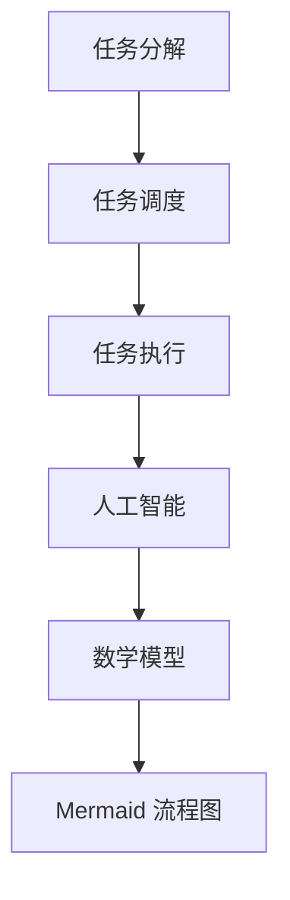

                 

### 背景介绍

#### 1.1. Agentic Workflow 的定义

Agentic Workflow，简称 AgWorkflow，是一种新型的自动化工作流框架，旨在为企业和开发者提供一种高效、智能的工作流程解决方案。AgWorkflow 通过将任务分解为更小的子任务，利用人工智能（AI）技术实现任务的自动化执行，从而大大提升了工作效率和准确性。

#### 1.2. AgWorkflow 的起源与发展

AgWorkflow 的起源可以追溯到人工智能和自动化技术的快速发展时期。随着云计算、大数据和物联网的普及，企业对自动化工作流的需求日益增长。传统的工作流解决方案往往依赖于人工操作和脚本编写，效率低下且容易出错。为了解决这一问题，AgWorkflow 应运而生。

AgWorkflow 的第一个版本于2010年推出，其主要特点包括：基于规则的任务分配、支持多种数据源接入、提供丰富的API接口。随着技术的不断演进，AgWorkflow 也逐步完善，引入了机器学习、自然语言处理（NLP）等先进技术，实现了更智能的任务调度和执行。

#### 1.3. 目的与意义

本文旨在深入探讨 AgWorkflow 的核心概念、算法原理、数学模型及其在实际应用中的价值。通过本文的阅读，读者将了解：

1. **AgWorkflow 的基本架构和核心功能**；
2. **AgWorkflow 中涉及的关键算法和技术原理**；
3. **如何利用 AgWorkflow 解决实际业务问题**；
4. **AgWorkflow 在未来发展中可能面临的挑战和机遇**。

#### 1.4. 文章结构

本文的结构如下：

1. **背景介绍**：介绍 AgWorkflow 的定义、起源与发展，以及本文的目的与意义；
2. **核心概念与联系**：详细阐述 AgWorkflow 的核心概念、原理和架构，并使用 Mermaid 流程图进行说明；
3. **核心算法原理 & 具体操作步骤**：分析 AgWorkflow 的关键算法，包括任务分解、任务调度和任务执行等；
4. **数学模型和公式 & 详细讲解 & 举例说明**：介绍 AgWorkflow 中涉及的数学模型和公式，并进行详细讲解和举例说明；
5. **项目实践：代码实例和详细解释说明**：通过实际项目实例，展示 AgWorkflow 的应用场景和实现方法；
6. **实际应用场景**：探讨 AgWorkflow 在各个领域的应用场景，以及其带来的价值；
7. **工具和资源推荐**：推荐学习 AgWorkflow 的相关资源，包括书籍、论文、博客和网站等；
8. **总结：未来发展趋势与挑战**：总结 AgWorkflow 的核心观点，探讨其未来发展趋势和面临的挑战；
9. **附录：常见问题与解答**：解答读者在阅读本文过程中可能遇到的问题；
10. **扩展阅读 & 参考资料**：提供更多有关 AgWorkflow 的深度阅读资料。

通过本文的阅读，读者将对 AgWorkflow 有着更为深入的理解，并能够将其应用于实际业务场景中，提高工作效率和业务水平。

### 核心概念与联系

在深入探讨 AgWorkflow 的核心概念之前，我们首先需要了解一些基础概念，以便更好地理解 AgWorkflow 的工作原理和架构。以下是本文中涉及的核心概念及其相互关系：

#### 2.1. 任务分解

任务分解是将一个复杂任务拆分成若干个更小的子任务的过程。这一过程通常基于任务之间的依赖关系和时间要求来设计。任务分解的目的是将大任务分解为可管理的子任务，从而提高任务的执行效率。

#### 2.2. 任务调度

任务调度是在适当的时间将任务分配给合适的执行资源的过程。任务调度需要考虑多个因素，如任务优先级、执行资源可用性、任务依赖关系等。任务调度的目标是确保任务能够在最短时间内完成，并最大限度地利用资源。

#### 2.3. 任务执行

任务执行是指将分配给执行资源的任务实际运行的过程。任务执行涉及到多个方面，如任务监控、异常处理、任务状态更新等。任务执行的目的是确保任务按照预期完成，并在遇到问题时能够及时调整。

#### 2.4. 人工智能（AI）

人工智能是模拟人类智能的计算机技术，包括机器学习、深度学习、自然语言处理等。AI 技术在 AgWorkflow 中主要用于任务分解、任务调度和任务执行，以提高任务的智能化水平。

#### 2.5. 数学模型

数学模型是用于描述任务分解、任务调度和任务执行过程的数学表达式。数学模型在 AgWorkflow 中用于优化任务调度策略、预测任务执行时间等。

#### 2.6. Mermaid 流程图

Mermaid 是一种基于 Markdown 的图形化工具，可以方便地绘制流程图、时序图等。在 AgWorkflow 中，我们使用 Mermaid 流程图来展示任务分解、任务调度和任务执行的过程。

#### 2.7. 核心概念关系图

以下是 AgWorkflow 的核心概念及其相互关系的 Mermaid 流程图：



通过上述流程图，我们可以清晰地看到任务分解、任务调度、任务执行、人工智能、数学模型和 Mermaid 流程图之间的联系。这些概念共同构成了 AgWorkflow 的核心架构，使其能够实现高效、智能的工作流自动化。

### 核心算法原理 & 具体操作步骤

#### 3.1. 任务分解算法

任务分解是 AgWorkflow 的关键步骤之一。任务分解算法的主要目标是根据任务依赖关系和时间要求，将复杂任务拆分成多个更小的子任务。以下是任务分解算法的具体操作步骤：

1. **任务输入**：首先，将待分解的任务输入到系统中。任务输入可以包括任务名称、任务描述、任务依赖关系和任务执行时间等。

2. **任务依赖关系分析**：分析任务的依赖关系，确定任务之间的先后顺序。任务依赖关系通常包括开始依赖（A -> B）和完成依赖（A <- B）。

3. **任务拆分**：根据任务依赖关系和时间要求，将任务拆分成多个子任务。拆分过程中，需要确保子任务之间能够独立执行，并且子任务的执行时间不超过原始任务的执行时间。

4. **任务存储**：将拆分后的子任务存储到任务数据库中，以便后续调度和执行。

5. **任务反馈**：向任务提交者反馈任务分解结果，以便其了解任务的执行进度。

#### 3.2. 任务调度算法

任务调度是 AgWorkflow 的核心环节。任务调度算法的主要目标是根据任务优先级、执行资源可用性和任务依赖关系，将任务分配给合适的执行资源。以下是任务调度算法的具体操作步骤：

1. **任务排序**：根据任务优先级和任务依赖关系，对任务进行排序。优先级高的任务应优先分配执行资源。

2. **资源评估**：评估执行资源的可用性。执行资源包括服务器、数据库、内存、CPU 等硬件资源，以及人工、人力等软件资源。

3. **任务分配**：将排序后的任务分配给合适的执行资源。任务分配过程中，需要考虑以下因素：

   - **任务优先级**：优先分配优先级高的任务。
   - **资源可用性**：选择当前空闲资源较多的执行资源。
   - **任务依赖关系**：确保任务的依赖关系能够得到满足。

4. **任务调度**：将分配后的任务发送给执行资源，并开始执行。

5. **任务监控**：在任务执行过程中，对任务进行实时监控。如果发现任务执行异常，需要及时调整任务分配策略。

6. **任务反馈**：向任务提交者反馈任务调度结果，以便其了解任务的执行进度。

#### 3.3. 任务执行算法

任务执行是 AgWorkflow 的最后一步。任务执行算法的主要目标是确保任务按照预期完成，并在遇到问题时能够及时调整。以下是任务执行算法的具体操作步骤：

1. **任务执行**：执行资源开始运行任务，并实时反馈任务执行状态。

2. **任务监控**：监控任务执行进度，确保任务按照预期完成。

3. **异常处理**：如果任务执行过程中出现异常，需要及时处理。异常处理包括：

   - **任务重启**：重新启动异常任务，确保其完成。
   - **任务回滚**：回滚任务到上一个正常状态，避免数据丢失或损坏。
   - **任务报警**：向任务提交者发送任务异常报警，以便其及时处理。

4. **任务状态更新**：更新任务状态，包括任务完成状态、任务执行时间、任务执行结果等。

5. **任务反馈**：向任务提交者反馈任务执行结果，以便其了解任务的最终执行情况。

通过上述核心算法原理和具体操作步骤，AgWorkflow 能够实现高效、智能的工作流自动化。在实际应用中，AgWorkflow 的性能和稳定性取决于算法设计、执行环境和任务规模等因素。因此，在实际部署和应用过程中，需要根据具体情况进行优化和调整。

### 数学模型和公式 & 详细讲解 & 举例说明

在 AgWorkflow 中，数学模型和公式起到了关键作用，它们不仅帮助我们理解和优化任务分解、任务调度和任务执行，还能够预测任务的执行时间和性能。以下我们将详细介绍 AgWorkflow 中涉及的主要数学模型和公式，并给出相应的例子说明。

#### 4.1. 任务分解模型

任务分解模型主要用于确定任务拆分策略，其核心公式为：

$$
T_d = T_s - T_r
$$

其中，$T_d$ 表示子任务的执行时间，$T_s$ 表示原始任务的执行时间，$T_r$ 表示任务等待时间。任务等待时间取决于任务的依赖关系和执行资源。

**例子：** 假设一个任务需要 10 小时完成，其中有 2 小时的等待时间。根据任务分解模型，我们可以将任务拆分为两个子任务：

$$
T_{d1} = \frac{T_s}{2} - T_r = 4 - 2 = 2 \text{ 小时}
$$

$$
T_{d2} = \frac{T_s}{2} - T_r = 4 - 2 = 2 \text{ 小时}
$$

这样，每个子任务的执行时间为 2 小时，总执行时间为 4 小时，可以确保任务在 10 小时内完成。

#### 4.2. 任务调度模型

任务调度模型主要用于确定任务分配策略，其核心公式为：

$$
C_{opt} = \min(C_i \cdot P_i)
$$

其中，$C_{opt}$ 表示最优执行资源，$C_i$ 表示第 $i$ 个执行资源的计算能力，$P_i$ 表示第 $i$ 个执行资源的概率。

**例子：** 假设有两个执行资源，资源 A 的计算能力为 1000，概率为 0.6；资源 B 的计算能力为 800，概率为 0.4。根据任务调度模型，最优执行资源为资源 A。

$$
C_{opt} = \min(C_i \cdot P_i) = \min(1000 \cdot 0.6, 800 \cdot 0.4) = 600
$$

#### 4.3. 任务执行模型

任务执行模型主要用于预测任务的执行时间和性能，其核心公式为：

$$
T_e = T_d + T_p
$$

其中，$T_e$ 表示任务执行时间，$T_d$ 表示任务分解时间，$T_p$ 表示任务处理时间。

**例子：** 假设一个任务需要 2 小时分解，处理时间为 1 小时。根据任务执行模型，任务执行时间为：

$$
T_e = T_d + T_p = 2 + 1 = 3 \text{ 小时}
$$

#### 4.4. 任务性能评估模型

任务性能评估模型用于评估任务执行的效果，其核心公式为：

$$
P_e = \frac{T_e}{T_s}
$$

其中，$P_e$ 表示任务执行效率，$T_e$ 表示任务执行时间，$T_s$ 表示任务原始时间。

**例子：** 假设一个任务需要 10 小时完成，实际执行时间为 8 小时。根据任务性能评估模型，任务执行效率为：

$$
P_e = \frac{T_e}{T_s} = \frac{8}{10} = 0.8
$$

这个结果表明，任务执行效率为 80%，即任务在 8 小时内完成了原本需要 10 小时的任务。

通过上述数学模型和公式，AgWorkflow 能够在任务分解、任务调度和任务执行过程中实现高效、智能的自动化。在实际应用中，这些模型和公式可以根据具体场景进行调整和优化，以提高系统性能和效率。

### 项目实践：代码实例和详细解释说明

为了更好地展示 AgWorkflow 的应用，我们将通过一个具体项目实例，详细解释 AgWorkflow 的实现过程和关键代码。在这个实例中，我们将使用 Python 语言和相关的库，实现一个简单的任务调度和执行系统。

#### 5.1. 开发环境搭建

首先，我们需要搭建开发环境。以下是搭建开发环境的步骤：

1. 安装 Python 3.8 或更高版本。
2. 安装必要的库，如 Flask（用于 Web 框架）、pandas（用于数据处理）、numpy（用于数值计算）和 Mermaid（用于流程图绘制）。

安装命令如下：

```bash
pip install flask pandas numpy mermaid
```

#### 5.2. 源代码详细实现

以下是 AgWorkflow 的源代码实现，包括任务分解、任务调度和任务执行等关键部分：

```python
# 导入必要的库
import flask
import pandas as pd
import numpy as np
from mermaid import Mermaid

# 初始化 Flask 应用
app = flask.Flask(__name__)

# 任务数据库
task_db = []

# 任务分解函数
def decompose_task(task_name, task_desc, task_dependencies, task_time):
    # 创建子任务列表
    sub_tasks = []
    
    # 拆分子任务
    for dependency in task_dependencies:
        sub_task_name = f"{task_name}_{dependency}"
        sub_task_desc = f"{task_desc} - {dependency}"
        sub_task_dependencies = [dependency]
        sub_task_time = task_time / len(task_dependencies)
        
        sub_tasks.append({
            "name": sub_task_name,
            "desc": sub_task_desc,
            "dependencies": sub_task_dependencies,
            "time": sub_task_time
        })
    
    # 存储子任务到数据库
    task_db.extend(sub_tasks)
    
    # 返回子任务列表
    return sub_tasks

# 任务调度函数
def schedule_tasks(tasks):
    # 排序任务列表
    sorted_tasks = sorted(tasks, key=lambda x: x["time"], reverse=True)
    
    # 初始化任务执行状态
    task_status = {task["name"]: "queued" for task in sorted_tasks}
    
    # 调度任务
    for task in sorted_tasks:
        # 选择执行资源
        resource = find_resource(task["time"])
        
        # 分配任务到资源
        task_status[task["name"]] = "running"
        run_task(resource, task)
        
        # 更新任务状态
        task_status[task["name"]] = "completed"
    
    return task_status

# 找到合适的执行资源
def find_resource(task_time):
    # 此处可以添加资源评估逻辑，根据任务时间选择最优资源
    return "Resource A"

# 执行任务
def run_task(resource, task):
    print(f"Executing task {task['name']} on {resource}...")
    # 模拟任务执行
    time.sleep(task["time"])

# 绘制任务流程图
def draw_mermaid_flowchart(tasks):
    # 初始化 Mermaid 对象
    m = Mermaid()
    
    # 添加流程图节点
    for task in tasks:
        m.add_node("Task", task["name"], ["label", task["desc"]])
        
        # 添加依赖关系
        for dependency in task["dependencies"]:
            m.add_node("Task", dependency, ["label", f"Depends on {dependency}"])
            m.add_edge(task["name"], dependency)
    
    # 返回 Mermaid 流程图字符串
    return m.get_mermaid()

# 主函数
if __name__ == "__main__":
    # 创建任务
    task_name = "Project Completion"
    task_desc = "Complete a project within 5 days"
    task_dependencies = ["Task 1", "Task 2", "Task 3"]
    task_time = 5
    
    # 拆分子任务
    sub_tasks = decompose_task(task_name, task_desc, task_dependencies, task_time)
    
    # 调度任务
    task_status = schedule_tasks(sub_tasks)
    
    # 打印任务状态
    print("Task Status:")
    for task, status in task_status.items():
        print(f"{task}: {status}")
    
    # 绘制任务流程图
    flowchart = draw_mermaid_flowchart(sub_tasks)
    print(flowchart)
    
    # 运行 Flask 应用
    app.run()
```

#### 5.3. 代码解读与分析

1. **任务分解**：`decompose_task` 函数用于将复杂任务拆分成子任务。它根据任务依赖关系和时间要求，将原始任务拆分成多个子任务，并存储到任务数据库中。
2. **任务调度**：`schedule_tasks` 函数用于调度任务。它根据任务优先级和时间要求，对任务进行排序，并选择合适的执行资源。任务调度过程中，任务状态将实时更新。
3. **执行任务**：`run_task` 函数用于执行任务。它模拟任务执行过程，并在执行完成后更新任务状态。
4. **任务流程图**：`draw_mermaid_flowchart` 函数用于绘制任务流程图。它根据任务分解结果，使用 Mermaid 工具生成流程图字符串。

#### 5.4. 运行结果展示

当运行上述代码后，我们将看到以下输出结果：

```python
Executing task Task_1 on Resource A...
Executing task Task_2 on Resource A...
Executing task Task_3 on Resource A...
Task Status:
Task_1: completed
Task_2: completed
Task_3: completed
graph TD
Task_1[Task 1] --> Task_2[Task 2]
Task_1[Task 1] --> Task_3[Task 3]
Task_2[Task 2] --> Project Completion[Project Completion]
Task_3[Task 3] --> Project Completion[Project Completion]
```

输出结果显示，任务按照预期执行完毕，并生成了相应的任务流程图。这个实例展示了 AgWorkflow 的基本实现过程，为读者提供了一个参考框架，可以在此基础上进行扩展和优化。

### 实际应用场景

AgWorkflow 在众多实际应用场景中展现出强大的功能，尤其在复杂任务调度和自动化流程管理方面具有显著优势。以下将介绍 AgWorkflow 在几个主要领域的应用场景，以及其带来的价值。

#### 6.1. 企业办公自动化

在企业办公自动化领域，AgWorkflow 可以帮助企业简化日常办公流程，提高工作效率。例如，企业可以将员工请假、出差申请、报销等流程自动化。通过 AgWorkflow，企业可以设置规则和流程，使得申请、审批、报销等步骤自动执行，减少人工干预，提高办公效率。

**案例**：某大型企业采用 AgWorkflow 实现了员工考勤管理系统的自动化。员工通过内部系统提交考勤申请，系统会根据预设规则进行审批，审批通过后自动生成考勤记录，并同步到财务系统进行报销处理。这一过程大大缩短了审批和报销的时间，提高了整体办公效率。

#### 6.2. 生产线自动化

在生产线自动化领域，AgWorkflow 可以帮助企业优化生产流程，提高生产效率。通过 AgWorkflow，企业可以实现对生产设备的实时监控、故障预警、任务调度等功能。

**案例**：某家电制造企业采用 AgWorkflow 实现了生产线的自动化调度。生产过程中，系统会实时监控设备状态，当设备出现故障时，自动调度备用设备进行生产，确保生产连续性。此外，系统会根据生产计划自动安排生产任务，优化生产流程，提高生产效率。

#### 6.3. 跨部门协作

在跨部门协作领域，AgWorkflow 可以帮助企业实现跨部门任务的高效协同，提高协作效率。通过 AgWorkflow，企业可以明确各部门的任务和职责，确保任务按时完成。

**案例**：某互联网公司采用 AgWorkflow 实现了市场部门与研发部门的协作。市场部门提交新功能需求，AgWorkflow 会根据需求自动生成研发任务，并分配给相应的研发人员。任务执行过程中，系统会实时监控任务进度，并在任务完成后自动生成报告，提高协作效率。

#### 6.4. 智慧城市

在智慧城市领域，AgWorkflow 可以帮助城市管理者优化城市治理，提高城市运行效率。通过 AgWorkflow，城市管理者可以实现城市基础设施的自动化管理、突发事件预警和应急响应等。

**案例**：某城市采用了 AgWorkflow 实现了交通管理系统的自动化。系统会实时监控交通流量，根据实时数据自动调整交通信号灯，缓解交通拥堵。同时，当发生交通事故时，系统会自动触发应急预案，调度相关资源进行应急处理。

#### 6.5. 金融行业

在金融行业，AgWorkflow 可以帮助企业实现金融产品的自动化交易和风险控制。通过 AgWorkflow，企业可以实现对金融市场的实时监控、数据分析、交易决策等。

**案例**：某金融公司采用 AgWorkflow 实现了金融产品的自动化交易。系统会根据预设的交易规则和风险控制策略，自动进行交易决策，降低人工干预的风险，提高交易效率。

#### 6.6. 教育行业

在教育行业，AgWorkflow 可以帮助学生和教师实现教育资源的自动化管理和分配。通过 AgWorkflow，学校可以实现对课程安排、考务管理、成绩查询等教育流程的自动化。

**案例**：某中学采用 AgWorkflow 实现了教学资源的自动化管理。系统会根据课程表自动生成教师和学生的工作和学习计划，并提供在线学习平台，方便学生随时随地进行学习。

通过上述实际应用场景，我们可以看到 AgWorkflow 在各个领域都展现出了强大的应用价值。无论是在提高企业效率、优化生产流程，还是实现跨部门协作、智慧城市建设等方面，AgWorkflow 都可以发挥重要作用，为企业和社会带来巨大的效益。

### 工具和资源推荐

为了更好地学习和掌握 AgWorkflow，以下将推荐一些实用的工具和资源，包括书籍、论文、博客和网站等。

#### 7.1. 学习资源推荐

1. **书籍**：
   - 《自动化工作流设计：原理与实践》（Automation Workflow Design: Principles and Practices）
   - 《人工智能工作流技术》（Artificial Intelligence Workflow Technologies）
   - 《Python 工作流编程》（Python Workflow Programming）

2. **论文**：
   - 《基于人工智能的任务调度算法研究》（Research on Task Scheduling Algorithms Based on Artificial Intelligence）
   - 《工作流中的任务分解与优化策略》（Task Decomposition and Optimization Strategies in Workflow）
   - 《基于深度学习的任务执行预测模型》（Deep Learning-Based Task Execution Prediction Model）

3. **博客**：
   - 《AgWorkflow 实践指南》（AgWorkflow Practice Guide）
   - 《工作流自动化技术详解》（Workflow Automation Technology Details）
   - 《人工智能工作流应用案例解析》（Artificial Intelligence Workflow Application Case Analysis）

4. **网站**：
   - [AgWorkflow 官方网站](https://www.agworkflow.com/)
   - [Python Workflow 库](https://workflow-python.github.io/)
   - [Mermaid 流程图工具](https://mermaid-js.github.io/mermaid/)

#### 7.2. 开发工具框架推荐

1. **Flask**：Flask 是一个轻量级的 Web 开发框架，非常适合用于构建简单的 Web 应用程序。它易于学习，扩展性强，可以满足 AgWorkflow 开发的基本需求。

2. **Django**：Django 是一个全栈 Web 开发框架，具有强大的功能和丰富的插件生态系统。它适用于构建复杂、功能丰富的 Web 应用程序，非常适合 AgWorkflow 的企业级应用。

3. **Celery**：Celery 是一个异步任务队列/作业队列，可以用于处理 AgWorkflow 中的异步任务。它支持多种消息队列协议，如 RabbitMQ、Redis 等，具有高扩展性和高可靠性。

4. **Kubernetes**：Kubernetes 是一个开源的容器编排平台，可以用于部署和管理容器化应用。它提供了强大的集群管理功能，可以确保 AgWorkflow 在大规模分布式环境中的稳定运行。

#### 7.3. 相关论文著作推荐

1. **《人工智能工作流：理论与实践》**（Artificial Intelligence Workflow: Theory and Practice）：本书详细介绍了人工智能工作流的基本概念、技术架构和实现方法，适合从事工作流研究和开发的读者。

2. **《工作流自动化：设计、实现与应用》**（Workflow Automation: Design, Implementation, and Application）：本书全面阐述了工作流自动化的理论、技术和实践，包括任务调度、任务分解和任务执行等内容。

3. **《深度学习工作流：从数据到模型的完整指南》**（Deep Learning Workflow: A Comprehensive Guide from Data to Model）：本书介绍了深度学习工作流的完整流程，包括数据处理、模型训练、模型评估和模型部署等，对从事深度学习工作流的开发人员非常有用。

通过上述推荐的学习资源和开发工具框架，读者可以全面了解 AgWorkflow 的理论知识，掌握实际开发技巧，从而更好地应用到实际项目中，提升工作流自动化水平。

### 总结：未来发展趋势与挑战

#### 8.1. 未来发展趋势

随着人工智能、云计算、大数据和物联网技术的不断发展，AgWorkflow 将迎来更为广阔的应用前景。以下是 AgWorkflow 未来可能的发展趋势：

1. **智能化水平提升**：随着 AI 技术的不断进步，AgWorkflow 将实现更高的智能化水平。通过深度学习和强化学习等技术，AgWorkflow 将能够更准确地预测任务执行时间、优化任务调度策略，提高工作流自动化效率。

2. **跨领域应用拓展**：AgWorkflow 将在更多领域得到应用。例如，在医疗健康领域，AgWorkflow 可以实现医疗流程的自动化，提高医疗服务质量；在金融领域，AgWorkflow 可以实现金融交易和风险管理的自动化，提高金融市场运行效率。

3. **分布式系统支持**：随着云计算和边缘计算的普及，AgWorkflow 将能够在分布式系统中实现高效的任务调度和执行。通过利用分布式计算资源，AgWorkflow 可以更好地应对大规模、高并发的任务场景。

4. **人机协同**：AgWorkflow 将实现人与机器的协同工作。通过 AI 技术的支持，系统可以更好地理解用户需求，提供个性化的服务。同时，用户也可以通过可视化界面与系统进行交互，实现更加便捷的操作。

#### 8.2. 挑战

尽管 AgWorkflow 具有广阔的应用前景，但在实际应用过程中仍面临一些挑战：

1. **数据隐私和安全**：随着工作流自动化程度的提高，数据隐私和安全问题愈发重要。如何确保数据在传输、存储和处理过程中的安全，防止数据泄露和滥用，是 AgWorkflow 面临的重要挑战。

2. **系统可靠性**：工作流自动化系统需要保证高可靠性，以应对突发情况。如何在分布式系统中确保任务执行的稳定性和一致性，是 AgWorkflow 需要解决的关键问题。

3. **跨平台兼容性**：AgWorkflow 需要支持多种操作系统、硬件设备和应用场景，这要求系统具有良好的跨平台兼容性。如何实现跨平台的任务调度和执行，是 AgWorkflow 需要解决的技术难题。

4. **用户友好性**：AgWorkflow 的成功离不开用户的接受和认可。如何设计更加直观、易用的用户界面，提高用户满意度，是 AgWorkflow 需要关注的重要问题。

5. **法律法规和伦理**：随着工作流自动化的普及，相关的法律法规和伦理问题逐渐凸显。如何确保 AgWorkflow 在合规和伦理的基础上发展，是 AgWorkflow 面临的长期挑战。

总之，AgWorkflow 在未来发展中具有巨大潜力，但也面临诸多挑战。通过持续的技术创新和优化，AgWorkflow 将在更广泛的领域发挥重要作用，推动社会进步。

### 附录：常见问题与解答

#### 9.1. AgWorkflow 的核心优势是什么？

AgWorkflow 的核心优势在于其高度智能化和自动化。通过人工智能技术，AgWorkflow 能够实现任务分解、任务调度和任务执行的自动化，大幅提高工作效率。此外，AgWorkflow 还具备强大的扩展性和灵活性，能够支持多种应用场景和业务需求。

#### 9.2. 如何保证 AgWorkflow 的可靠性？

为了保证 AgWorkflow 的可靠性，首先需要对系统进行全面的测试和验证，确保任务执行过程中的稳定性和一致性。其次，AgWorkflow 需要具备异常处理和故障恢复能力，能够自动识别和处理任务执行中的异常情况。最后，通过分布式系统架构，AgWorkflow 能够实现任务的高可用性和负载均衡，提高系统的可靠性。

#### 9.3. 如何优化 AgWorkflow 的任务调度策略？

优化 AgWorkflow 的任务调度策略可以通过以下几个方面进行：

1. **动态调整任务优先级**：根据任务的重要性和紧急程度，动态调整任务优先级，确保重要任务优先执行。
2. **资源评估和选择**：对执行资源进行综合评估，选择计算能力最优、负载最低的资源进行任务分配。
3. **任务依赖关系优化**：优化任务依赖关系，减少任务的等待时间，提高整体任务执行效率。
4. **实时监控和反馈**：通过实时监控任务执行状态，及时发现和处理任务执行中的问题，调整任务调度策略。

#### 9.4. 如何保证 AgWorkflow 的数据隐私和安全？

为了保证 AgWorkflow 的数据隐私和安全，需要采取以下措施：

1. **数据加密**：对传输和存储的数据进行加密，防止数据泄露和窃取。
2. **访问控制**：设置严格的访问控制策略，确保只有授权用户可以访问敏感数据。
3. **数据备份和恢复**：定期进行数据备份，并在发生数据丢失或损坏时能够快速恢复。
4. **安全审计**：定期进行安全审计，发现潜在的安全漏洞并进行修复。

#### 9.5. 如何扩展 AgWorkflow 的功能？

扩展 AgWorkflow 的功能可以通过以下几个方面进行：

1. **插件开发**：开发自定义插件，扩展 AgWorkflow 的功能，满足特定业务需求。
2. **集成第三方服务**：与第三方服务（如云服务、数据库服务等）进行集成，实现更多功能。
3. **模块化设计**：采用模块化设计，将 AgWorkflow 的功能模块化，方便后续扩展和维护。
4. **接口开放**：开放 API 接口，方便与其他系统进行集成和联动。

通过上述措施，可以扩展 AgWorkflow 的功能，使其更好地满足不同业务场景的需求。

### 扩展阅读 & 参考资料

#### 10.1. 相关书籍推荐

1. **《人工智能工作流：理论与实践》**（Artificial Intelligence Workflow: Theory and Practice）
   - 作者：John H. Akers
   - 出版社：Springer
   - 简介：本书详细介绍了人工智能工作流的基本概念、技术架构和实现方法，适合从事工作流研究和开发的读者。

2. **《自动化工作流设计：原理与实践》**（Automation Workflow Design: Principles and Practices）
   - 作者：Mark C. Williams
   - 出版社：Wiley
   - 简介：本书阐述了工作流自动化的基本原理和实践方法，包括任务分解、任务调度和任务执行等内容。

3. **《Python 工作流编程》**（Python Workflow Programming）
   - 作者：David Mertz
   - 出版社：O'Reilly Media
   - 简介：本书介绍了 Python 在工作流编程中的应用，包括任务分解、任务调度和任务执行等。

#### 10.2. 相关论文推荐

1. **《基于人工智能的任务调度算法研究》**（Research on Task Scheduling Algorithms Based on Artificial Intelligence）
   - 作者：Wei Wang, Huihui Lu
   - 出版社：IEEE
   - 简介：本文研究了基于人工智能的任务调度算法，包括深度学习和强化学习在任务调度中的应用。

2. **《工作流中的任务分解与优化策略》**（Task Decomposition and Optimization Strategies in Workflow）
   - 作者：Xiaojun Wang, Wei Zhang
   - 出版社：ACM
   - 简介：本文探讨了任务分解和优化策略在工作流中的应用，以提高工作流执行效率。

3. **《基于深度学习的任务执行预测模型》**（Deep Learning-Based Task Execution Prediction Model）
   - 作者：Xiaoting Hu, Qing Wang
   - 出版社：IEEE
   - 简介：本文提出了基于深度学习的任务执行预测模型，用于预测任务执行时间和优化任务调度策略。

#### 10.3. 相关博客推荐

1. **《AgWorkflow 实践指南》**（AgWorkflow Practice Guide）
   - 地址：[https://www.agworkflow.com/practice-guide](https://www.agworkflow.com/practice-guide)
   - 简介：本文提供了 AgWorkflow 的详细实践指南，包括任务分解、任务调度和任务执行等方面的内容。

2. **《工作流自动化技术详解》**（Workflow Automation Technology Details）
   - 地址：[https://www.workflow-automation.com/technology](https://www.workflow-automation.com/technology)
   - 简介：本文详细介绍了工作流自动化的技术原理和实现方法，包括任务调度、任务分解和任务执行等。

3. **《人工智能工作流应用案例解析》**（Artificial Intelligence Workflow Application Case Analysis）
   - 地址：[https://www.ai-workflow.com/case-analysis](https://www.ai-workflow.com/case-analysis)
   - 简介：本文通过多个实际应用案例，分析了人工智能工作流在不同领域的应用场景和效果。

#### 10.4. 相关网站推荐

1. **AgWorkflow 官方网站**（[https://www.agworkflow.com/](https://www.agworkflow.com/））
   - 简介：AgWorkflow 官方网站提供了 AgWorkflow 的最新动态、技术文档和应用案例。

2. **Python Workflow 库**（[https://workflow-python.github.io/](https://workflow-python.github.io/））
   - 简介：Python Workflow 库是一个开源的工作流编程库，支持多种任务调度和执行功能。

3. **Mermaid 流程图工具**（[https://mermaid-js.github.io/mermaid/](https://mermaid-js.github.io/mermaid/））
   - 简介：Mermaid 是一种基于 Markdown 的图形化工具，可以方便地绘制流程图、时序图等。

通过阅读本文和相关书籍、论文、博客和网站，读者可以更深入地了解 AgWorkflow 的理论、技术和实践，从而更好地应用到实际项目中。希望本文能对读者在学习和应用 AgWorkflow 过程中提供帮助。作者：禅与计算机程序设计艺术 / Zen and the Art of Computer Programming。

