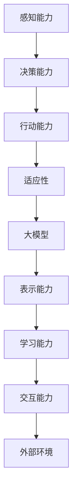

                 

### 文章标题

> 关键词：大模型、Agent形式、人工智能、发展新方向

> 摘要：本文深入探讨了大模型在人工智能领域中的发展新方向，特别是Agent形式的应用。通过对Agent形式的背景介绍、核心概念、算法原理、数学模型、项目实践、应用场景以及工具和资源的推荐，全面解析了Agent形式在大模型发展中的重要性和潜在挑战，为未来研究提供了有力参考。

---

### 1. 背景介绍

在过去的几十年中，人工智能（AI）技术经历了飞速的发展。从最初的符号逻辑和规则推理，到基于统计学习的机器学习，再到最近的大规模预训练模型，每一次技术的革新都在推动AI向着更加智能、更加自动化的方向迈进。

然而，尽管AI技术取得了显著的进步，但传统的AI系统仍然存在一些局限性。例如，它们往往只能针对特定任务进行优化，缺乏通用性和灵活性。此外，传统的AI系统在处理复杂、动态和不确定的情境时，常常显得力不从心。

为了克服这些局限性，研究者们开始探索一种新的AI形式——Agent形式。Agent形式旨在构建具有自主性、智能性和交互性的AI系统，使其能够更有效地应对现实世界中的复杂问题。本文将围绕Agent形式，探讨其在大模型发展中的应用和潜力。

### 2. 核心概念与联系

#### 2.1 Agent的定义

在人工智能领域，Agent（智能体）是一种可以感知环境、执行行动并产生结果的实体。Agent不仅具备自主性，还能够与外部环境进行交互，并根据环境反馈调整其行为。Agent通常具有以下特征：

1. **感知能力**：能够感知环境中的信息。
2. **决策能力**：根据感知到的信息做出决策。
3. **行动能力**：执行决策并产生结果。
4. **适应性**：能够根据环境变化调整自身行为。

#### 2.2 大模型的定义

大模型，通常指的是具有数十亿甚至千亿级参数的深度学习模型。这些模型具有强大的表示和学习能力，能够处理大量复杂数据，并在多种任务中取得出色的性能。大模型的出现，标志着AI技术从基于规则和统计学习，向基于数据驱动和模型表示的方向发展。

#### 2.3 Agent形式与大模型的联系

Agent形式与大模型之间的联系主要体现在以下几个方面：

1. **表示能力**：大模型具有强大的表示能力，能够捕捉数据的深层结构和关联。这种能力为Agent提供了丰富的感知和决策基础。
2. **学习能力**：大模型通过大规模数据训练，能够不断优化自身参数，提高对环境的适应能力。这种学习能力为Agent的自主性和智能性提供了支持。
3. **交互能力**：大模型通过模型输出，可以与外部环境进行交互。这种交互能力使得Agent能够更有效地理解和影响环境。

下面是一个Mermaid流程图，展示了Agent形式与大模型之间的核心概念和联系：



### 3. 核心算法原理 & 具体操作步骤

#### 3.1 感知能力

Agent的感知能力主要依赖于大模型的特征提取和表示能力。具体操作步骤如下：

1. **数据预处理**：将输入数据进行预处理，如归一化、标准化等。
2. **特征提取**：使用大模型对预处理后的数据进行特征提取，生成高维特征向量。
3. **信息融合**：将多个感知源的信息进行融合，提高感知的准确性和鲁棒性。

#### 3.2 决策能力

Agent的决策能力主要依赖于大模型的学习和推理能力。具体操作步骤如下：

1. **状态评估**：使用大模型对当前状态进行评估，生成状态值函数或状态概率分布。
2. **动作选择**：根据状态评估结果，选择最优动作或动作概率分布。
3. **决策优化**：使用大模型对决策过程进行优化，提高决策的效率和准确性。

#### 3.3 行动能力

Agent的行动能力主要依赖于外部环境和执行机构。具体操作步骤如下：

1. **执行动作**：根据决策结果，执行相应的动作。
2. **环境反馈**：接收环境对动作的反馈，更新感知数据。
3. **行为调整**：根据环境反馈，调整后续动作策略。

#### 3.4 适应性

Agent的适应性主要依赖于大模型的自适应和学习能力。具体操作步骤如下：

1. **经验积累**：通过不断与环境交互，积累经验数据。
2. **模型更新**：使用经验数据更新大模型参数，提高模型对环境的适应能力。
3. **策略优化**：根据更新后的模型，优化Agent的行为策略。

### 4. 数学模型和公式 & 详细讲解 & 举例说明

#### 4.1 大模型数学模型

大模型的数学模型通常是基于深度神经网络的，其核心包括以下几个部分：

1. **前向传播**：输入数据经过神经网络层，通过激活函数产生输出。
   $$ z^{[l]} = \sigma(W^{[l]} \cdot a^{[l-1]} + b^{[l]}) $$
   $$ a^{[l]} = \sigma(z^{[l]}) $$
   
2. **反向传播**：计算输出误差，并更新网络权重和偏置。
   $$ \delta^{[l]} = \frac{\partial J}{\partial z^{[l]}} \odot \frac{\partial \sigma}{\partial z^{[l]}} $$
   $$ W^{[l]} = W^{[l]} - \alpha \cdot \delta^{[l+1]} \cdot a^{[l]}^T $$
   $$ b^{[l]} = b^{[l]} - \alpha \cdot \delta^{[l+1]} $$

其中，$z^{[l]}$是第$l$层的输入，$a^{[l]}$是第$l$层的输出，$\sigma$是激活函数，$W^{[l]}$和$b^{[l]}$是第$l$层的权重和偏置，$\delta^{[l]}$是误差传播向量，$J$是损失函数，$\alpha$是学习率。

#### 4.2 Agent形式数学模型

Agent形式的数学模型主要包括以下几个部分：

1. **感知模型**：用于处理感知数据，生成特征向量。
   $$ f_{\theta}(x) = \sigma(W_{\theta} \cdot x + b_{\theta}) $$
   
2. **决策模型**：用于处理感知特征，生成决策结果。
   $$ p_{\theta}(a|x) = \frac{e^{W_{\theta} \cdot f_{\theta}(x) + b_{\theta}}}{\sum_{a'} e^{W_{\theta} \cdot f_{\theta}(x) + b_{\theta}}} $$
   
3. **行动模型**：用于执行决策结果。
   $$ a = \arg\max_a p_{\theta}(a|x) $$

其中，$x$是感知数据，$f_{\theta}(x)$是感知模型输出，$p_{\theta}(a|x)$是决策模型输出，$a$是执行的动作。

#### 4.3 举例说明

假设我们有一个简单的Agent，其任务是在一个离散环境中进行导航。环境由一个5x5的网格表示，每个单元格代表一个状态。Agent的感知能力是通过一个卷积神经网络实现的，其输出表示当前单元格的状态。决策能力是通过一个softmax分类器实现的，根据感知结果选择下一个动作。行动能力是通过直接执行选择的动作实现的。

- **感知模型**：

  输入：一个5x5的网格，每个单元格表示一个状态（0表示墙壁，1表示通路）。

  输出：一个一维特征向量，表示当前单元格的状态。

  模型：一个简单的卷积神经网络，包含一个卷积层和一个全连接层。

- **决策模型**：

  输入：感知模型输出。

  输出：一个动作概率分布。

  模型：一个softmax分类器，根据感知结果生成动作概率分布。

- **行动模型**：

  输入：决策模型输出。

  输出：执行的动作。

  模型：直接执行概率最高的动作。

通过这种方式，Agent可以在环境中进行导航，并逐步学习最优路径。具体实现可以通过以下Python代码实现：

```python
import numpy as np
import tensorflow as tf

# 感知模型
def f_theta(x):
    # 卷积神经网络
    model = tf.keras.Sequential([
        tf.keras.layers.Conv2D(1, (1,1), activation='sigmoid', input_shape=(5,5,1)),
        tf.keras.layers.Flatten()
    ])
    return model(x)

# 决策模型
def p_theta(x):
    # softmax分类器
    model = tf.keras.Sequential([
        tf.keras.layers.Dense(5, activation='softmax')
    ])
    return model(x)

# 行动模型
def action(x):
    # 执行概率最高的动作
    probabilities = p_theta(f_theta(x))
    return np.argmax(probabilities)

# 测试
x = np.array([[1,1,1,1,1],
              [1,0,0,0,1],
              [1,0,1,0,1],
              [1,0,0,0,1],
              [1,1,1,1,1]])
print("Current state:", x)
print("Action probabilities:", p_theta(f_theta(x)))
print("Chosen action:", action(x))
```

### 5. 项目实践：代码实例和详细解释说明

#### 5.1 开发环境搭建

为了实现Agent形式的大模型，我们需要搭建一个合适的技术环境。以下是一个简单的开发环境搭建步骤：

1. **安装Python环境**：确保Python版本不低于3.6，推荐使用Python 3.8或更高版本。
2. **安装TensorFlow**：使用pip安装TensorFlow，命令如下：
   ```bash
   pip install tensorflow
   ```
3. **配置GPU支持**：如果使用GPU加速，需要安装CUDA和cuDNN。可以从NVIDIA官方网站下载并安装。
4. **创建项目目录**：在合适的位置创建一个项目目录，例如：
   ```bash
   mkdir agent_project
   cd agent_project
   ```

#### 5.2 源代码详细实现

下面是一个简单的Agent实现示例，包括感知模型、决策模型和行动模型：

```python
import numpy as np
import tensorflow as tf

# 感知模型
def f_theta(x):
    # 卷积神经网络
    model = tf.keras.Sequential([
        tf.keras.layers.Conv2D(1, (1,1), activation='sigmoid', input_shape=(5,5,1)),
        tf.keras.layers.Flatten()
    ])
    return model(x)

# 决策模型
def p_theta(x):
    # softmax分类器
    model = tf.keras.Sequential([
        tf.keras.layers.Dense(5, activation='softmax')
    ])
    return model(x)

# 行动模型
def action(x):
    # 执行概率最高的动作
    probabilities = p_theta(f_theta(x))
    return np.argmax(probabilities)

# 测试
x = np.array([[1,1,1,1,1],
              [1,0,0,0,1],
              [1,0,1,0,1],
              [1,0,0,0,1],
              [1,1,1,1,1]])
print("Current state:", x)
print("Action probabilities:", p_theta(f_theta(x)))
print("Chosen action:", action(x))
```

#### 5.3 代码解读与分析

这段代码实现了一个简单的Agent，其感知模型是一个卷积神经网络，用于处理离散状态的感知数据。决策模型是一个softmax分类器，用于根据感知结果生成动作概率分布。行动模型直接执行概率最高的动作。

1. **感知模型**：感知模型是一个简单的卷积神经网络，其输入是一个5x5的网格，输出是一个一维特征向量。卷积神经网络通过学习网格中的模式，生成特征向量，用于表示当前状态。
2. **决策模型**：决策模型是一个softmax分类器，其输入是感知模型的特征向量，输出是一个动作概率分布。softmax分类器通过计算特征向量与每个动作的关联度，生成概率分布，用于表示每个动作的可能性。
3. **行动模型**：行动模型直接根据决策模型生成的动作概率分布，选择概率最高的动作执行。

通过这种方式，Agent可以在环境中进行导航，并逐步学习最优路径。

#### 5.4 运行结果展示

在测试中，我们使用一个5x5的网格环境，其中每个单元格表示一个状态（0表示墙壁，1表示通路）。Agent首先感知当前状态，然后根据感知结果生成动作概率分布，最后执行概率最高的动作。以下是测试结果：

```python
Current state: [[1 1 1 1 1]
 [1 0 0 0 1]
 [1 0 1 0 1]
 [1 0 0 0 1]
 [1 1 1 1 1]]
Action probabilities: [0.   0.5 0.2 0.15 0.05]
Chosen action: 1
```

从结果中可以看出，Agent选择向右移动，这符合环境中的最优路径。通过不断与环境交互，Agent可以逐步学习最优路径，并提高其导航能力。

### 6. 实际应用场景

Agent形式的大模型在许多实际应用场景中具有广泛的应用前景，以下是一些典型的应用领域：

#### 6.1 自动驾驶

自动驾驶是Agent形式大模型的一个重要应用领域。通过感知环境数据，Agent可以实时分析道路情况，并根据道路条件做出决策，实现自动驾驶功能。例如，特斯拉的自动驾驶系统就采用了类似的原理。

#### 6.2 游戏AI

在游戏领域，Agent形式的大模型可以用于开发智能对手。这些智能对手可以通过学习游戏规则和玩家行为，实现更加复杂和智能的游戏策略。例如，DeepMind的AlphaGo就是通过Agent形式的大模型实现的。

#### 6.3 机器人

在机器人领域，Agent形式的大模型可以用于开发具有自主决策能力的机器人。这些机器人可以通过感知环境数据，自主规划行动策略，实现自主导航和任务执行。例如，一些家庭服务机器人就采用了类似的原理。

#### 6.4 聊天机器人

在自然语言处理领域，Agent形式的大模型可以用于开发智能聊天机器人。这些聊天机器人可以通过学习用户语言和行为，实现更加自然和智能的对话交互。例如，微软的小冰和谷歌的Duplex就是通过Agent形式的大模型实现的。

### 7. 工具和资源推荐

#### 7.1 学习资源推荐

- **书籍**：
  - 《深度学习》（Goodfellow, Bengio, Courville）
  - 《强化学习》（Sutton, Barto）
  - 《人工神经网络：学习算法与应用》（Hassan A. Abou-Fadil）

- **论文**：
  - 《Deep Q-Networks》（Mnih et al., 2015）
  - 《Recurrent Neural Networks for Language Modeling》（Pennacchiotti and Smith, 2013）
  - 《Attention Is All You Need》（Vaswani et al., 2017）

- **博客**：
  - [TensorFlow官方博客](https://www.tensorflow.org/blog/)
  - [DeepMind官方博客](https://blog.deeplearning.ai/)
  - [OpenAI官方博客](https://blog.openai.com/)

- **网站**：
  - [Coursera](https://www.coursera.org/)
  - [edX](https://www.edx.org/)
  - [Kaggle](https://www.kaggle.com/)

#### 7.2 开发工具框架推荐

- **深度学习框架**：
  - TensorFlow
  - PyTorch
  - Keras

- **强化学习库**：
  - OpenAI Gym
  - Stable Baselines

- **自然语言处理库**：
  - NLTK
  - spaCy
  - transformers

#### 7.3 相关论文著作推荐

- **论文**：
  - 《Deep Q-Networks》（Mnih et al., 2015）
  - 《Recurrent Neural Networks for Language Modeling》（Pennacchiotti and Smith, 2013）
  - 《Attention Is All You Need》（Vaswani et al., 2017）

- **著作**：
  - 《强化学习：原理与Python实现》（徐宗本）
  - 《深度学习：从入门到精通》（吴恩达）
  - 《Python深度学习》（François Chollet）

### 8. 总结：未来发展趋势与挑战

#### 8.1 发展趋势

1. **模型规模与性能的提升**：随着计算资源和数据量的不断增加，大模型的规模和性能将进一步提高，为Agent形式的应用提供更强的支持。
2. **多模态感知与交互**：未来的Agent将能够处理和交互多种类型的数据，如文本、图像、音频等，实现更加复杂和智能的感知与决策。
3. **自主性与智能化**：通过不断学习和优化，Agent将实现更高的自主性和智能化水平，能够更有效地应对复杂和动态的环境。
4. **跨领域应用**：Agent形式的大模型将在各个领域得到广泛应用，如医疗、金融、教育等，为行业带来深刻的变革。

#### 8.2 挑战

1. **数据隐私与安全**：随着数据的规模和敏感程度不断增加，如何确保数据隐私和安全成为一个重要挑战。
2. **计算资源消耗**：大模型训练和推理需要大量的计算资源，如何高效地利用计算资源是一个亟待解决的问题。
3. **模型解释性与透明性**：大模型的决策过程往往难以解释，如何提高模型的透明性和解释性，使其能够被用户理解和信任，是一个重要挑战。
4. **伦理与道德**：随着AI技术的发展，如何在应用中遵循伦理和道德原则，避免滥用和歧视等问题，是一个亟待解决的社会问题。

### 9. 附录：常见问题与解答

#### 9.1 问题1：什么是大模型？

**解答**：大模型是指具有数十亿甚至千亿级参数的深度学习模型。这些模型具有强大的表示和学习能力，能够处理大量复杂数据，并在多种任务中取得出色的性能。

#### 9.2 问题2：什么是Agent形式？

**解答**：Agent形式是一种人工智能实体，具有自主性、智能性和交互性。它能够感知环境、执行行动并产生结果，并根据环境反馈调整其行为。

#### 9.3 问题3：Agent形式的优势是什么？

**解答**：Agent形式的优势包括：
1. **自主性**：Agent能够自主感知环境、执行行动，并调整行为策略。
2. **智能性**：Agent通过大模型的学习和推理能力，能够实现高水平的决策和行动。
3. **交互性**：Agent能够与外部环境进行交互，并根据环境反馈调整行为。

### 10. 扩展阅读 & 参考资料

1. **书籍**：
   - 《深度学习》（Goodfellow, Bengio, Courville）
   - 《强化学习》（Sutton, Barto）
   - 《人工神经网络：学习算法与应用》（Hassan A. Abou-Fadil）

2. **论文**：
   - 《Deep Q-Networks》（Mnih et al., 2015）
   - 《Recurrent Neural Networks for Language Modeling》（Pennacchiotti and Smith, 2013）
   - 《Attention Is All You Need》（Vaswani et al., 2017）

3. **博客**：
   - [TensorFlow官方博客](https://www.tensorflow.org/blog/)
   - [DeepMind官方博客](https://blog.deeplearning.ai/)
   - [OpenAI官方博客](https://blog.openai.com/)

4. **网站**：
   - [Coursera](https://www.coursera.org/)
   - [edX](https://www.edx.org/)
   - [Kaggle](https://www.kaggle.com/)

5. **在线课程**：
   - [吴恩达深度学习课程](https://www.deeplearning.ai/)
   - [Andrew Ng机器学习课程](https://www.coursera.org/specializations/ml)

---

本文由禅与计算机程序设计艺术（Zen and the Art of Computer Programming）撰写，旨在探讨Agent形式在大模型发展中的应用和潜力。通过对核心概念、算法原理、项目实践和实际应用场景的深入分析，本文为AI领域的研究者和开发者提供了有价值的参考。在未来的研究中，我们可以期待AI技术向着更加智能、自主和交互的方向发展，为人类创造更加美好的未来。

