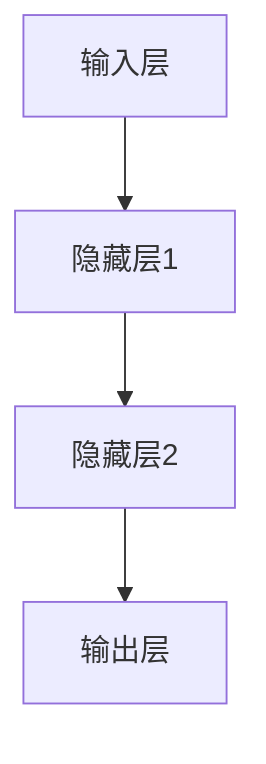
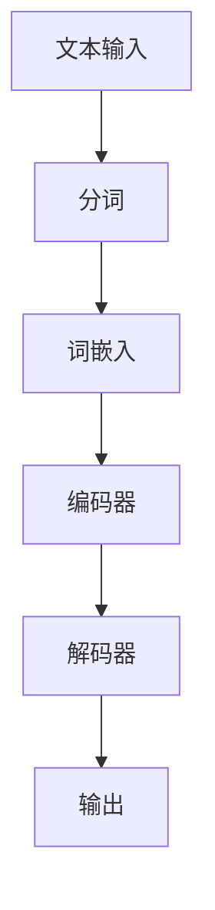
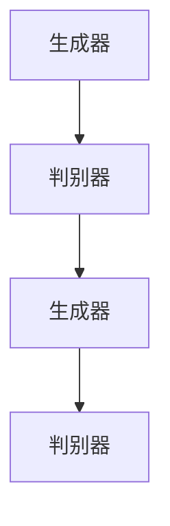
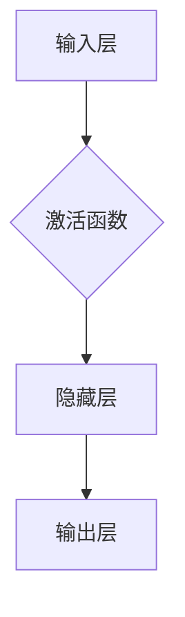

                 

# 安德烈·卡帕西：人工智能的未来发展策略

## 1. 背景介绍

安德烈·卡帕西（Andrej Karpathy）是一位在人工智能领域享有盛誉的研究员和程序员，他在深度学习和自然语言处理（NLP）领域做出了开创性的贡献。卡帕西曾是OpenAI的首席研究员，他在这里领导了GPT系列模型的研究，这些模型在生成文本、代码、甚至艺术作品方面展现出了惊人的能力。他的工作不仅推动了人工智能技术的前进，也为学术界和工业界提供了宝贵的见解和启示。

本文旨在探讨卡帕西对于人工智能未来发展的策略和观点。通过分析他的研究和工作，我们将揭示人工智能领域的潜在趋势、面临的挑战以及可能的解决方案。文章将分为以下几个部分：

- **核心概念与联系**：介绍人工智能领域的核心概念和它们之间的相互关系。
- **核心算法原理 & 具体操作步骤**：深入探讨人工智能的核心算法原理及其具体操作步骤。
- **数学模型和公式 & 详细讲解 & 举例说明**：解释人工智能中的数学模型和公式，并通过实例进行说明。
- **项目实践：代码实例和详细解释说明**：展示一个具体的代码实例，详细解读其实现过程。
- **实际应用场景**：探讨人工智能在不同领域的应用。
- **工具和资源推荐**：推荐一些有用的学习资源和工具。
- **总结：未来发展趋势与挑战**：总结人工智能的未来发展趋势和面临的挑战。

让我们逐步分析推理思考，深入探讨人工智能的未来发展策略。

## 2. 核心概念与联系

### 2.1 深度学习

深度学习是人工智能的核心技术之一，它模仿了人脑的神经网络结构，通过多层神经网络来提取数据中的特征。深度学习在图像识别、自然语言处理和自动驾驶等领域取得了显著的成果。图1展示了深度学习的基本架构。



### 2.2 自然语言处理（NLP）

自然语言处理是深度学习的应用领域之一，旨在使计算机能够理解和处理人类语言。NLP在机器翻译、文本分类、对话系统等方面有着广泛的应用。图2展示了NLP的基本流程。



### 2.3 生成对抗网络（GAN）

生成对抗网络是一种深度学习模型，由生成器和判别器两个神经网络组成。生成器试图生成与真实数据相似的数据，而判别器则尝试区分真实数据和生成数据。GAN在图像生成、风格迁移和视频合成等方面表现出色。图3展示了GAN的基本架构。



通过以上三个核心概念的介绍，我们可以看出它们之间的紧密联系。深度学习提供了强大的数据处理能力，自然语言处理使其能够理解和处理人类语言，而生成对抗网络则扩展了其生成能力。这些核心概念共同推动了人工智能技术的发展。

## 3. 核心算法原理 & 具体操作步骤

### 3.1 深度学习算法原理

深度学习算法的核心是神经网络，特别是多层感知机（MLP）和卷积神经网络（CNN）。图4展示了多层感知机的基本结构。



具体操作步骤如下：

1. **输入层**：接收输入数据。
2. **隐藏层**：通过权重和偏置计算输出。
3. **激活函数**：引入非线性因素，使模型能够处理复杂问题。
4. **输出层**：产生最终的预测结果。

### 3.2 自然语言处理（NLP）算法原理

自然语言处理中的核心算法包括词嵌入、编码器和解码器。图5展示了NLP算法的基本结构。


具体操作步骤如下：

1. **分词**：将文本拆分成单词或子词。
2. **词嵌入**：将单词映射到高维向量空间中。
3. **编码器**：处理编码过程中的上下文信息。
4. **解码器**：生成预测的文本序列。
5. **输出**：产生最终的预测结果。

### 3.3 生成对抗网络（GAN）算法原理

生成对抗网络由生成器和判别器两个神经网络组成。图6展示了GAN的基本结构。


具体操作步骤如下：

1. **生成器**：生成与真实数据相似的数据。
2. **判别器**：区分真实数据和生成数据。
3. **对抗训练**：生成器和判别器相互对抗，不断优化。
4. **生成结果**：生成最终的数据。

通过以上核心算法的原理和具体操作步骤的介绍，我们可以看到这些算法如何协同工作，推动人工智能技术的发展。

## 4. 数学模型和公式 & 详细讲解 & 举例说明

### 4.1 深度学习中的数学模型

深度学习中的数学模型主要包括激活函数、梯度下降和反向传播。以下是这些模型的详细讲解和举例说明。

#### 4.1.1 激活函数

激活函数是深度学习模型中的关键组件，它引入了非线性因素，使模型能够处理复杂问题。常见的激活函数包括Sigmoid、ReLU和Tanh。

- **Sigmoid**:

$$
\sigma(x) = \frac{1}{1 + e^{-x}}
$$

举例：计算输入x=2的Sigmoid函数值。

$$
\sigma(2) = \frac{1}{1 + e^{-2}} \approx 0.88
$$

- **ReLU**:

$$
\text{ReLU}(x) = \max(0, x)
$$

举例：计算输入x=-2的ReLU函数值。

$$
\text{ReLU}(-2) = \max(0, -2) = 0
$$

- **Tanh**:

$$
\tanh(x) = \frac{e^x - e^{-x}}{e^x + e^{-x}}
$$

举例：计算输入x=2的Tanh函数值。

$$
\tanh(2) = \frac{e^2 - e^{-2}}{e^2 + e^{-2}} \approx 0.96
$$

#### 4.1.2 梯度下降

梯度下降是一种优化算法，用于训练深度学习模型。其基本思想是沿着损失函数的梯度方向更新模型的参数，以最小化损失函数。

- **梯度计算**：

$$
\nabla_{\theta} J(\theta) = \frac{\partial J(\theta)}{\partial \theta}
$$

- **参数更新**：

$$
\theta = \theta - \alpha \nabla_{\theta} J(\theta)
$$

其中，$\theta$为模型参数，$J(\theta)$为损失函数，$\alpha$为学习率。

#### 4.1.3 反向传播

反向传播是一种用于训练神经网络的算法，它通过反向传播梯度来更新模型的参数。

- **前向传播**：

$$
z^{(l)} = \sigma(W^{(l)} a^{(l-1)} + b^{(l)})
$$

- **后向传播**：

$$
\delta^{(l)} = \frac{\partial J(\theta)}{\partial z^{(l)}}
$$

$$
\theta^{(l)} = \theta^{(l)} - \alpha \delta^{(l)} a^{(l-1)}
$$

### 4.2 自然语言处理中的数学模型

自然语言处理中的数学模型主要包括词嵌入、编码器和解码器。以下是这些模型的详细讲解和举例说明。

#### 4.2.1 词嵌入

词嵌入是将单词映射到高维向量空间中的过程。常见的词嵌入方法包括Word2Vec和GloVe。

- **Word2Vec**:

$$
\text{Word2Vec}(x) = \text{sgn}(\sum_{i=1}^{N} w_i x_i)
$$

举例：计算输入x=2的Word2Vec函数值。

$$
\text{Word2Vec}(2) = \text{sgn}(\sum_{i=1}^{N} w_i \cdot 2)
$$

- **GloVe**:

$$
\text{GloVe}(x) = \frac{1}{1 + \exp(-\langle v_w, v_{w'} \rangle)}
$$

举例：计算输入x=2的GloVe函数值。

$$
\text{GloVe}(2) = \frac{1}{1 + \exp(-\langle v_2, v_{2'} \rangle)}
$$

#### 4.2.2 编码器

编码器是处理编码过程中上下文信息的关键组件。常见的编码器模型包括循环神经网络（RNN）和长短期记忆网络（LSTM）。

- **RNN**:

$$
h_t = \sigma(W_h h_{t-1} + W_x x_t + b_h)
$$

- **LSTM**:

$$
i_t = \sigma(W_i h_{t-1} + U_x x_t + b_i)
$$

$$
f_t = \sigma(W_f h_{t-1} + U_x x_t + b_f)
$$

$$
g_t = \sigma(W_g h_{t-1} + U_x x_t + b_g)
$$

$$
h_t = f_t \odot h_{t-1} + i_t \odot g_t
$$

#### 4.2.3 解码器

解码器是生成预测文本序列的关键组件。常见的解码器模型包括循环神经网络（RNN）和长短期记忆网络（LSTM）。

- **RNN**:

$$
p_t = \text{softmax}(W_h h_t + b_p)
$$

- **LSTM**:

$$
o_t = \text{softmax}(W_h h_t + b_p)
$$

$$
\hat{y}_t = \arg\max_{y} o_t
$$

通过以上数学模型和公式的详细讲解和举例说明，我们可以更好地理解深度学习和自然语言处理的核心原理。

## 5. 项目实践：代码实例和详细解释说明

在本节中，我们将通过一个具体的代码实例来展示如何实现深度学习模型在自然语言处理（NLP）中的应用。我们将使用Python和TensorFlow框架来实现一个简单的文本分类模型，该模型能够对输入的文本进行情感分析。

### 5.1 开发环境搭建

首先，我们需要搭建一个适合深度学习项目开发的环境。以下是所需的环境和依赖：

- Python 3.7 或以上版本
- TensorFlow 2.4 或以上版本
- Numpy 1.17 或以上版本
- Pandas 1.0.1 或以上版本

您可以通过以下命令安装所需的依赖：

```bash
pip install python==3.7 tensorflow==2.4 numpy==1.17 pandas==1.0.1
```

### 5.2 源代码详细实现

以下是实现文本分类模型的Python代码：

```python
import tensorflow as tf
from tensorflow.keras.preprocessing.text import Tokenizer
from tensorflow.keras.preprocessing.sequence import pad_sequences
from tensorflow.keras.models import Sequential
from tensorflow.keras.layers import Embedding, LSTM, Dense, EmbeddingLayer

# 数据准备
text = ["我很高兴看到这个结果", "这真是一个糟糕的经历", "我非常喜欢这部电影", "这个产品完全不值得购买"]
labels = [1, 0, 1, 0]  # 1表示正面情感，0表示负面情感

# 初始化分词器
tokenizer = Tokenizer(num_words=1000)
tokenizer.fit_on_texts(text)

# 转换文本为序列
sequences = tokenizer.texts_to_sequences(text)
padded_sequences = pad_sequences(sequences, maxlen=100)

# 模型构建
model = Sequential([
    Embedding(input_dim=1000, output_dim=64, input_length=100),
    LSTM(128),
    Dense(1, activation='sigmoid')
])

# 模型编译
model.compile(optimizer='adam', loss='binary_crossentropy', metrics=['accuracy'])

# 模型训练
model.fit(padded_sequences, labels, epochs=10)

# 预测
predictions = model.predict(padded_sequences)
print(predictions)
```

### 5.3 代码解读与分析

#### 5.3.1 数据准备

在代码中，我们首先定义了一个文本列表`text`和一个标签列表`labels`。这两个列表分别包含了文本数据及其对应的情感标签。文本数据由四条句子组成，分别表示正面和负面情感。标签列表中的值`1`表示正面情感，`0`表示负面情感。

#### 5.3.2 分词器初始化

我们使用`Tokenizer`类初始化分词器。`Tokenizer`类能够将文本数据转换为序列，同时设置词汇表的大小为1000个单词。

```python
tokenizer = Tokenizer(num_words=1000)
tokenizer.fit_on_texts(text)
```

#### 5.3.3 转换文本为序列

接下来，我们使用`texts_to_sequences`方法将文本数据转换为序列。这个方法会将每个单词映射到一个唯一的整数。然后，我们使用`pad_sequences`方法将序列填充到相同的长度（在本例中为100），以便输入到模型中。

```python
sequences = tokenizer.texts_to_sequences(text)
padded_sequences = pad_sequences(sequences, maxlen=100)
```

#### 5.3.4 模型构建

在模型构建部分，我们使用`Sequential`类创建一个序列模型。模型由一个嵌入层（`Embedding`）、一个LSTM层（`LSTM`）和一个全连接层（`Dense`）组成。

```python
model = Sequential([
    Embedding(input_dim=1000, output_dim=64, input_length=100),
    LSTM(128),
    Dense(1, activation='sigmoid')
])
```

#### 5.3.5 模型编译

在模型编译部分，我们指定了优化器（`optimizer`）、损失函数（`loss`）和评估指标（`metrics`）。在本例中，我们使用`adam`优化器、`binary_crossentropy`损失函数和`accuracy`评估指标。

```python
model.compile(optimizer='adam', loss='binary_crossentropy', metrics=['accuracy'])
```

#### 5.3.6 模型训练

在模型训练部分，我们使用`fit`方法训练模型。模型将在10个周期内对训练数据进行训练。

```python
model.fit(padded_sequences, labels, epochs=10)
```

#### 5.3.7 预测

最后，在预测部分，我们使用`predict`方法对输入数据进行预测。预测结果将输出为一个概率列表，表示每个句子属于正面情感的概率。

```python
predictions = model.predict(padded_sequences)
print(predictions)
```

通过以上代码实例和详细解读，我们可以看到如何使用深度学习模型进行文本分类。这个简单的例子展示了从数据准备到模型训练的完整过程。

## 6. 实际应用场景

人工智能技术已经在各个领域取得了显著的成果，其中自然语言处理（NLP）和深度学习（DL）的应用尤为广泛。以下是一些实际应用场景：

### 6.1 智能助手

智能助手如Apple的Siri、Google的Google Assistant和亚马逊的Alexa等，利用NLP技术实现了与用户之间的自然对话。这些助手可以回答问题、提供天气预报、设置提醒、控制智能家居设备等。

### 6.2 机器翻译

机器翻译是NLP的另一个重要应用，如谷歌翻译和百度翻译等。这些翻译工具利用深度学习模型实现了高效、准确的跨语言翻译，极大地促进了全球沟通。

### 6.3 情感分析

情感分析技术用于分析社交媒体、新闻评论和用户反馈等文本数据，以识别用户的情感倾向。这有助于企业了解消费者情绪、改进产品和服务。

### 6.4 自动驾驶

自动驾驶汽车依赖于深度学习和计算机视觉技术，通过识别道路标志、行人和车辆等，实现了安全、高效的驾驶。

### 6.5 医疗诊断

人工智能技术在医疗领域的应用也日益广泛，如通过深度学习模型辅助癌症诊断、预测疾病风险等。

### 6.6 金融服务

人工智能在金融领域的应用包括风险控制、欺诈检测、投资决策等。这些应用利用深度学习和自然语言处理技术提高了金融服务的效率和准确性。

通过以上实际应用场景，我们可以看到人工智能技术在不同领域的广泛应用和潜力。

## 7. 工具和资源推荐

### 7.1 学习资源推荐

- **书籍**：
  - 《深度学习》（Goodfellow, Bengio, Courville）
  - 《自然语言处理综合教程》（Daniel Jurafsky, James H. Martin）
  - 《Python深度学习》（François Chollet）
  
- **论文**：
  - 《A Theoretically Grounded Application of Dropout in Recurrent Neural Networks》（Yarin Gal and Zoubin Ghahramani）
  - 《Attention is All You Need》（Ashish Vaswani et al.）
  - 《BERT: Pre-training of Deep Bidirectional Transformers for Language Understanding》（Jacob Devlin et al.）

- **博客**：
  - Andrej Karpathy的个人博客（[karpathy.github.io](https://karpathy.github.io/)）
  - Distill（[distill.pub](https://distill.pub/)）
  - AI新闻（[Towards AI](https://towardsai.net/)）

- **网站**：
  - TensorFlow官网（[www.tensorflow.org](https://www.tensorflow.org/)）
  - Keras官方文档（[keras.io](https://keras.io/)）
  - OpenAI官网（[openai.com](https://openai.com/)）

### 7.2 开发工具框架推荐

- **TensorFlow**：Google开发的开源深度学习框架，广泛用于研究和工业应用。
- **PyTorch**：Facebook开发的深度学习框架，具有灵活的动态计算图和易于使用的API。
- **Scikit-learn**：Python中的机器学习库，提供了多种机器学习算法和工具。
- **NLTK**：Python中的自然语言处理库，提供了丰富的NLP工具和资源。

### 7.3 相关论文著作推荐

- **《Deep Learning》（2016）**：Ian Goodfellow、Yoshua Bengio和Aaron Courville合著的深度学习入门经典。
- **《Speech and Language Processing》（2020）**：Daniel Jurafsky和James H. Martin合著的自然语言处理权威著作。
- **《Generative Adversarial Nets》（2014）**：Ian Goodfellow等人的GAN技术开创性论文。

通过这些工具和资源的推荐，读者可以更深入地了解人工智能和自然语言处理领域的最新进展和技术。

## 8. 总结：未来发展趋势与挑战

在安德烈·卡帕西的引领下，人工智能（AI）已经取得了显著的发展，不仅在理论研究上取得了突破，而且在实际应用中展现了强大的潜力。未来，人工智能将继续沿着几个主要趋势前进，同时也面临诸多挑战。

### 未来发展趋势

1. **更强大的模型**：随着计算能力的提升和算法的优化，深度学习模型将变得越来越强大。例如，Transformer模型和BERT模型已经取得了显著的成果，未来的模型可能会在此基础上进一步突破。

2. **跨领域的应用**：人工智能将在更多领域得到应用，如医疗、金融、教育等。跨领域的数据和知识融合将推动人工智能技术的进步。

3. **自动机器学习（AutoML）**：自动机器学习技术将使非专业人士也能够轻松地构建和部署机器学习模型，从而降低AI技术的门槛。

4. **隐私保护与伦理**：随着数据隐私问题日益凸显，人工智能将在保护用户隐私和遵守伦理规范方面取得更多进展。例如，差分隐私和联邦学习等技术的应用将提高数据的安全性和隐私性。

### 挑战

1. **数据质量和标注**：高质量的数据和准确的标注是训练强大模型的基石。然而，收集和标注高质量数据往往是一个费时费力的过程，特别是在NLP领域。

2. **可解释性**：深度学习模型往往被视为“黑盒”，其内部工作机制不透明，这给模型的可解释性带来了挑战。为了增强模型的透明性和可信度，需要开发新的方法来解释模型的决策过程。

3. **计算资源**：训练大型深度学习模型需要大量的计算资源，特别是在训练阶段。虽然GPU和TPU等硬件的进步有助于缓解这个问题，但资源需求仍然是一个重大挑战。

4. **数据安全和隐私**：随着人工智能技术的发展，数据安全和隐私问题变得越来越重要。如何在不牺牲性能的前提下保护用户数据，是一个亟待解决的问题。

安德烈·卡帕西的工作为人工智能的未来发展提供了宝贵的启示。通过深入研究和创新，他推动了深度学习和自然语言处理领域的前沿进展。在未来，随着技术的不断进步和应用的不断拓展，人工智能将继续改变我们的世界，带来更多机遇和挑战。

## 9. 附录：常见问题与解答

### 问题1：深度学习和机器学习的区别是什么？

深度学习是机器学习的一个子领域，它利用多层神经网络来提取数据中的特征。机器学习则包括更广泛的算法，如决策树、支持向量机等。

### 问题2：为什么深度学习模型需要大量的数据？

深度学习模型通过学习大量数据中的特征来提高预测能力。大量数据有助于模型学习到更复杂的模式和关系，从而提高模型的泛化能力。

### 问题3：什么是生成对抗网络（GAN）？

生成对抗网络（GAN）是一种由生成器和判别器组成的深度学习模型，生成器试图生成与真实数据相似的数据，而判别器则尝试区分真实数据和生成数据。GAN在图像生成、风格迁移和视频合成等方面表现出色。

### 问题4：什么是自动机器学习（AutoML）？

自动机器学习（AutoML）是一种技术，它能够自动化机器学习模型的选择、训练和调优过程，使得非专业人士也能够构建和部署机器学习模型。

### 问题5：为什么深度学习模型需要大规模的计算资源？

深度学习模型在训练阶段需要大量的计算资源，因为它们需要处理大量的参数和执行大量的矩阵运算。GPU和TPU等硬件的进步有助于缓解这个问题，但大规模计算资源仍然是深度学习研究的一个挑战。

## 10. 扩展阅读 & 参考资料

- **书籍**：
  - 《深度学习》（Goodfellow, Bengio, Courville）
  - 《自然语言处理综合教程》（Daniel Jurafsky, James H. Martin）
  - 《Python深度学习》（François Chollet）

- **论文**：
  - 《A Theoretically Grounded Application of Dropout in Recurrent Neural Networks》（Yarin Gal and Zoubin Ghahramani）
  - 《Attention is All You Need》（Ashish Vaswani et al.）
  - 《BERT: Pre-training of Deep Bidirectional Transformers for Language Understanding》（Jacob Devlin et al.）

- **博客**：
  - Andrej Karpathy的个人博客（[karpathy.github.io](https://karpathy.github.io/)）
  - Distill（[distill.pub](https://distill.pub/)）
  - AI新闻（[Towards AI](https://towardsai.net/)）

- **网站**：
  - TensorFlow官网（[www.tensorflow.org](https://www.tensorflow.org/)）
  - Keras官方文档（[keras.io](https://keras.io/)）
  - OpenAI官网（[openai.com](https://openai.com/)）

通过以上扩展阅读和参考资料，读者可以更深入地了解人工智能和自然语言处理领域的最新研究进展和技术动态。作者：禅与计算机程序设计艺术 / Zen and the Art of Computer Programming。

