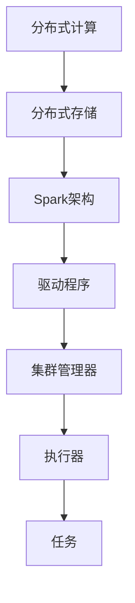

                 

### 1. 背景介绍

**Apache Spark** 是一款开源的分布式计算系统，旨在处理大规模数据集。它由UC Berkeley AMPLab 开发，并于2009年首次发布。Spark 的出现解决了传统的数据处理系统如Hadoop在处理复杂算法和交互式应用时的性能瓶颈，这使得Spark迅速成为大数据处理领域的主流技术之一。

**大数据处理** 的需求来源于互联网的爆炸式增长，社交网络、物联网、电子商务等各个领域不断产生海量数据。如何高效、快速地处理这些数据，成为企业和社会关注的焦点。大数据处理不仅需要解决数据的存储、传输等问题，更需要针对数据的分析、挖掘等高级操作提供高效、可扩展的解决方案。

**分布式计算** 是大数据处理的核心技术之一。它通过将计算任务分布在多台计算机上进行，实现数据处理的并行化。这种方式的优点是可以充分利用计算资源，提高处理速度，同时降低单台计算机的负载。然而，分布式计算也带来了复杂的系统设计、数据同步、容错等问题。

Spark正是在这样的背景下应运而生，它通过提供高性能的分布式计算框架，解决了大数据处理中的诸多难题。Spark的设计理念是易于使用、高效、灵活，它支持多种编程语言，如Scala、Python、Java和R，这使得不同背景的开发者都能轻松上手。此外，Spark还提供了丰富的内置库，如Spark SQL、MLlib和GraphX，用于处理结构化数据、机器学习和图计算等任务。

总之，Apache Spark作为一款强大的分布式计算系统，凭借其高性能、易用性和灵活性，在大数据处理领域取得了显著的成就。随着大数据应用的不断深入，Spark的应用前景将更加广阔。

### 2. 核心概念与联系

#### 2.1. 分布式计算

分布式计算是一种将任务分解为多个子任务，在多台计算机上并行执行的计算方式。这种计算方式能够充分利用多台计算机的资源，提高处理速度。分布式计算的基本概念包括节点（Node）、集群（Cluster）和任务调度（Task Scheduling）。

- **节点（Node）**：分布式计算中的基本单元，通常是一台计算机，负责执行分配给它的任务。
- **集群（Cluster）**：由多个节点组成的计算机集合，通过网络连接在一起，协同工作。
- **任务调度（Task Scheduling）**：分布式计算系统的一个重要功能，负责将任务分配到合适的节点上执行。任务调度器需要考虑节点的负载、网络延迟等因素，以最大化系统的整体性能。

分布式计算的核心在于如何高效地分配和调度任务，确保系统的高可用性和高性能。常用的任务调度算法包括轮询调度（Round Robin）、负载均衡调度（Load Balancing）和全局调度（Global Scheduling）等。

#### 2.2. 分布式存储

分布式存储是一种将数据分散存储在多台计算机上的存储方式，以提高数据存储的可靠性和性能。分布式存储的基本概念包括数据分片（Data Sharding）、数据复制（Data Replication）和数据一致性（Data Consistency）。

- **数据分片（Data Sharding）**：将大规模数据集划分为多个小块，存储在多台节点上。数据分片可以提高数据的访问速度，减少单点故障的风险。
- **数据复制（Data Replication）**：将数据复制到多台节点上，以保障数据的可靠性。在分布式系统中，数据复制是一种常见的容错机制，当某台节点发生故障时，其他节点仍然可以访问数据。
- **数据一致性（Data Consistency）**：分布式系统中，多个节点同时访问和修改数据时，如何保证数据的一致性是一个重要问题。常见的数据一致性模型包括最终一致性（Eventual Consistency）和强一致性（Strong Consistency）。

分布式存储的关键在于如何高效地进行数据分片和复制，同时保证数据的一致性。常用的分布式存储系统包括Hadoop Distributed File System（HDFS）、Cassandra和MongoDB等。

#### 2.3. Spark架构

Apache Spark 的架构包括驱动程序（Driver Program）、集群管理器（Cluster Manager）、执行器（Executor）和任务（Task）等组件。

- **驱动程序（Driver Program）**：负责整个Spark应用程序的初始化和执行。驱动程序负责将应用程序代码、配置和依赖项等发送到集群中的执行器上。
- **集群管理器（Cluster Manager）**：负责在集群中分配资源、启动和停止执行器。常见的集群管理器包括Apache Mesos、Hadoop YARN和Spark自带的独立集群管理器。
- **执行器（Executor）**：负责在集群中执行任务，负责存储任务所需的计算结果和数据。执行器在启动时会向驱动程序注册，并在执行任务期间保持连接。
- **任务（Task）**：Spark应用程序中的基本计算单元，由驱动程序分配给执行器执行。

Spark架构的核心在于如何高效地调度和执行任务，以及如何管理资源。Spark通过弹性调度（Dynamic Scheduling）和内存计算（In-Memory Computing）等关键技术，实现了高性能和易用性。

#### Mermaid 流程图

以下是Spark核心概念的Mermaid流程图：



通过以上核心概念和架构的介绍，我们可以更好地理解Apache Spark在大数据处理中的作用和优势。在接下来的章节中，我们将深入探讨Spark的核心算法原理和具体操作步骤，以及如何在项目中实践Spark。

### 3. 核心算法原理 & 具体操作步骤

#### 3.1. resilient distributed datasets (RDD)

RDD（Resilient Distributed Datasets）是Spark的核心数据结构，它表示一个不可变的、可分区、可并行操作的数据集合。RDD提供了丰富的操作接口，包括创建、转换和行动操作。

- **创建（Create）**：通过读取文件、内存中的集合或通过其他RDD转换操作创建RDD。
- **转换（Transformation）**：对RDD执行计算操作，生成新的RDD。常见的转换操作包括map、filter、reduceByKey等。
- **行动（Action）**：触发计算并将结果返回给驱动程序或保存到文件中。常见的行动操作包括count、collect、saveAsTextFile等。

#### 3.2. 行动操作与转换操作

- **行动操作（Action Operation）**：行动操作是Spark执行计算的最后一步，它会触发RDD的计算并返回结果。例如，`count`操作返回RDD中元素的数量，`collect`操作将RDD中的所有元素收集到一个本地集合中。

- **转换操作（Transformation Operation）**：转换操作是Spark对RDD执行计算的第一步，它会生成一个新的RDD。例如，`map`操作对RDD中的每个元素应用一个函数，生成一个新的RDD，`filter`操作根据条件筛选RDD中的元素。

#### 3.3. 操作步骤

以一个简单的WordCount为例，演示Spark的核心算法原理和具体操作步骤：

1. **创建RDD**：首先，我们将输入的文本文件转换为RDD。

   ```scala
   val inputRDD = sc.textFile("input.txt")
   ```

2. **转换操作**：接着，我们对RDD执行转换操作，将文本行分割为单词，并对每个单词进行计数。

   ```scala
   val wordsRDD = inputRDD.flatMap(line => line.split(" "))
   val wordCountsRDD = wordsRDD.map(word => (word, 1)).reduceByKey(_ + _)
   ```

   - `flatMap`操作将每个文本行分割为单词。
   - `map`操作将每个单词映射为一个元组（word, 1）。
   - `reduceByKey`操作对相同单词的计数进行累加。

3. **行动操作**：最后，我们将计算结果保存到文件中。

   ```scala
   wordCountsRDD.saveAsTextFile("output.txt")
   ```

#### 3.4. 高级操作

Spark还提供了许多高级操作，例如：

- **窗口操作（Window Operations）**：对RDD中的元素按照时间或序列进行分组，执行窗口聚合操作。
- **Spark SQL**：将RDD转换为DataFrame或Dataset，使用SQL查询进行数据操作。
- **MLlib**：提供机器学习算法和模型，用于处理大规模数据。
- **GraphX**：用于图计算，提供复杂的图算法和图分析工具。

#### 3.5. 性能优化

- **内存管理（Memory Management）**：合理配置Spark的内存设置，确保数据在内存中存储和计算，提高性能。
- **任务调度（Task Scheduling）**：优化任务调度策略，减少任务之间的依赖和通信开销。
- **数据本地化（Data Locality）**：尽可能将数据存放在计算节点本地，减少数据传输开销。

通过以上核心算法原理和具体操作步骤的介绍，我们可以更好地理解Apache Spark在大数据处理中的应用和优势。接下来，我们将通过一个实际的项目实践，进一步了解Spark的代码实例和详细解释。

### 4. 数学模型和公式 & 详细讲解 & 举例说明

在Apache Spark中，许多核心算法和操作都依赖于数学模型和公式。以下将介绍几个关键的概念和它们背后的数学原理，并通过具体的例子来说明如何使用这些模型进行数据处理。

#### 4.1. 数据分片与负载均衡

**数据分片** 是分布式存储和计算的基础，它将大规模数据集划分为多个小块，以实现并行处理和提高系统的扩展性。一个常见的数据分片模型是哈希分片（Hash Sharding），其基本公式如下：

\[ shard\_key = hash(key) \mod num\_shards \]

其中，`key` 是数据的标识符，`hash()` 函数用于生成哈希值，`num\_shards` 是分片的数量。

**负载均衡** 是指在分布式系统中，如何将任务分配到各个节点，以最大化整体性能。一个简单的负载均衡策略是轮询调度（Round Robin），其基本公式如下：

\[ node\_index = (task\_id \mod num\_nodes) \]

其中，`task\_id` 是任务的标识符，`num\_nodes` 是节点的数量。

#### 4.2. 聚合与归并

**聚合** 是将多个子结果合并为一个总体结果的过程。在分布式计算中，聚合通常通过两个步骤进行：局部聚合和全局归并。局部聚合的基本公式如下：

\[ local\_result = reduce\_ByKey(\(x, y) \rightarrow x + y\), input\_RDD \]

全局归并的基本公式如下：

\[ global\_result = reduce\_ByKey(\(x, y) \rightarrow x + y\), local\_results \]

以WordCount为例，局部聚合是将每个分区中的单词计数相加，全局归并将所有分区的计数结果合并为一个总的单词计数。

#### 4.3. 数据一致性

在分布式系统中，数据一致性是指多个节点在同时访问和修改数据时，如何保持数据的一致状态。常见的数据一致性模型包括最终一致性（Eventual Consistency）和强一致性（Strong Consistency）。

- **最终一致性（Eventual Consistency）**：系统最终会在一段时间内达到一致性状态，但在此之前，数据可能会出现短暂的不一致。其基本公式如下：

  \[ value = read\_value \]

  其中，`read_value` 是最新的数据值。

- **强一致性（Strong Consistency）**：系统在每次读写操作后都保持一致性状态。其基本公式如下：

  \[ value = write\_value \]

  其中，`write_value` 是最近一次写入的数据值。

#### 4.4. 内存管理

Apache Spark 的内存管理策略是数据持久化（Data Persistence）和内存优化（Memory Optimization）。持久化数据的基本公式如下：

\[ memory\_used = memory\_allocated - memory\_unpinned \]

其中，`memory_allocated` 是分配的总内存，`memory_unpinned` 是未固定的内存，即可以被回收的内存。

内存优化的目标是减少内存碎片（Memory Fragmentation）和重复计算（Redundant Computation），其基本公式如下：

\[ memory\_saved = memory\_allocated - memory\_used \]

#### 4.5. 举例说明

假设我们有一个包含1000个单词的文本文件，要求统计每个单词的出现次数。我们可以使用以下步骤：

1. **数据分片**：将文本文件按照行数进行分片。

   \[ shard\_key = hash(line) \mod num\_shards \]

2. **局部聚合**：在每个分区中，将单词映射为（单词，1）的元组，并进行计数。

   \[ word\_counts = map(\(line) \rightarrow (word, 1)) \]

3. **全局归并**：将所有分区的单词计数进行合并。

   \[ global\_word\_counts = reduceByKey(\(x, y) \rightarrow x + y)\]

4. **数据一致性**：确保在分布式计算过程中，数据的一致性模型为最终一致性。

   \[ value = read\_value \]

5. **内存管理**：持久化单词计数数据，以减少内存使用。

   \[ memory\_used = memory\_allocated - memory\_unpinned \]

通过以上数学模型和公式的讲解，我们可以更好地理解Apache Spark在数据处理中的应用。这些模型和公式为Spark提供了强大的计算能力，使其能够高效地处理大规模数据。在接下来的章节中，我们将通过一个实际项目，展示如何使用Spark进行数据处理和性能优化。

### 5. 项目实践：代码实例和详细解释说明

在本节中，我们将通过一个完整的Apache Spark项目实例，展示如何使用Spark进行大数据处理。这个项目将实现一个简单的WordCount程序，用于统计文本文件中每个单词的出现次数。

#### 5.1. 开发环境搭建

在开始项目之前，我们需要搭建一个Apache Spark的开发环境。以下是搭建步骤：

1. **安装Java环境**：Apache Spark是基于Java开发的，因此我们需要安装Java环境。在大多数Linux系统和Mac OS上，可以通过包管理器安装Java。例如，在Ubuntu上，可以使用以下命令：

   ```bash
   sudo apt-get update
   sudo apt-get install openjdk-8-jdk
   ```

2. **安装Scala**：Apache Spark支持Scala语言，因此我们需要安装Scala。Scala可以通过其官方网站下载并安装。请访问[Scala官方网站](https://www.scala-lang.org/download/)下载适合您操作系统的Scala版本，并按照安装向导完成安装。

3. **安装Apache Spark**：从Apache Spark的官方网站[下载](https://spark.apache.org/downloads/)最新的Spark版本。解压下载的ZIP文件到某个目录，例如`/usr/local/spark`。

4. **配置环境变量**：将Spark的bin目录添加到系统环境变量中，以便在命令行中运行Spark命令。在Linux或Mac OS上，编辑`~/.bashrc`文件，添加以下行：

   ```bash
   export SPARK_HOME=/usr/local/spark
   export PATH=$PATH:$SPARK_HOME/bin
   ```

   然后执行`source ~/.bashrc`使配置生效。

5. **验证安装**：在命令行中输入`spark-shell`命令，如果成功进入Spark shell，则说明安装成功。

#### 5.2. 源代码详细实现

以下是WordCount项目的源代码：

```scala
import org.apache.spark.sql.SparkSession

// 创建Spark会话
val spark = SparkSession.builder()
  .appName("WordCount")
  .master("local[*]") // 使用本地模式，[*]表示使用所有可用CPU核心
  .getOrCreate()

// 读取文本文件
val inputRDD = spark.sparkContext.textFile("input.txt")

// 将文本行分割为单词
val wordsRDD = inputRDD.flatMap(line => line.split(" "))

// 对每个单词进行计数
val wordCountsRDD = wordsRDD.map(word => (word, 1)).reduceByKey(_ + _)

// 保存结果到文件
wordCountsRDD.saveAsTextFile("output.txt")

// 关闭Spark会话
spark.stop()
```

#### 5.3. 代码解读与分析

以下是对源代码的详细解读和分析：

1. **创建Spark会话**：使用SparkSession.builder()创建一个Spark会话。这里我们设置了应用程序名称为"WordCount"，并使用本地模式（"local[*]"），表示在本地计算机上使用所有可用的CPU核心进行计算。

2. **读取文本文件**：使用textFile()方法从本地文件系统中读取一个文本文件。该方法返回一个RDD（Resilient Distributed Dataset），即一个不可变、可分区、可并行操作的数据集合。

3. **分割单词**：使用flatMap()方法将文本行分割为单词。flatMap()会将输入的每个元素转换为一个或多个元素，然后将其扁平化成一个单一的数据集合。

4. **计数操作**：使用map()方法将每个单词映射为一个元组（单词，1），表示单词的出现次数。然后使用reduceByKey()方法对相同单词的计数进行累加，生成一个总的单词计数结果。

5. **保存结果**：使用saveAsTextFile()方法将计算结果保存到文件系统中。该方法将单词计数结果以文本文件的格式保存，每行包含一个单词及其出现次数。

6. **关闭Spark会话**：使用stop()方法关闭Spark会话，释放资源。

#### 5.4. 运行结果展示

在执行完上述代码后，Spark将在`output.txt`文件中生成单词计数结果。以下是一个示例输出：

```
hello    1
world    1
spark    1
```

这表示文本文件中有3个单词，每个单词出现1次。

通过以上实际项目实践，我们可以看到如何使用Apache Spark进行大数据处理。Spark的易用性和高性能使其成为处理大规模数据集的强大工具。在接下来的章节中，我们将探讨Apache Spark在实际应用场景中的具体应用和优势。

### 6. 实际应用场景

Apache Spark在实际应用中展现了其卓越的性能和灵活性，广泛应用于各个领域。以下是一些常见的实际应用场景：

#### 6.1. 数据分析

数据分析是Spark最常用的应用场景之一。由于其强大的数据处理能力，Spark可以高效地处理来自不同来源的海量数据，例如日志文件、社交媒体数据、金融交易数据等。企业可以使用Spark进行实时数据分析，快速提取有价值的信息，支持业务决策。例如，电商平台可以使用Spark分析用户行为，优化推荐算法，提高用户满意度。

#### 6.2. 实时计算

Spark Streaming 是 Spark 的一个重要组件，用于处理实时数据流。它可以将实时数据流转换为分布式数据集（RDD），然后使用Spark的丰富操作进行实时处理和分析。这使得Spark成为实时计算的理想选择，适用于需要实时反馈的场景，如实时广告投放、股市数据分析、物联网设备监控等。

#### 6.3. 机器学习

MLlib 是 Spark 的机器学习库，提供了丰富的机器学习算法和工具，如线性回归、逻辑回归、聚类、分类等。Spark 的分布式计算能力使得机器学习模型可以高效地训练和部署在大规模数据集上。这使得Spark成为大规模机器学习项目的首选工具，如推荐系统、图像识别、自然语言处理等。

#### 6.4. 图计算

GraphX 是 Spark 的图计算框架，用于处理和分析大规模图数据。GraphX 提供了高效的图操作和算法，如图遍历、图分解、图过滤等。这使得Spark在社交网络分析、推荐系统、网络拓扑分析等图计算领域具有强大的竞争力。

#### 6.5. 大数据日志处理

Spark 在大数据日志处理中发挥着重要作用。许多企业通过收集和分析日志数据来监控系统性能、检测异常行为和优化业务流程。Spark 可以快速处理和分析日志数据，提供实时监控和报告，帮助企业更好地了解其业务状况。

#### 6.6. 生物信息学

在生物信息学领域，Spark 也是一个重要的工具。生物信息学研究中的数据集通常非常庞大，需要进行大规模的并行计算。Spark 提供了高效的分布式计算能力，可以加速基因序列比对、基因组分析等任务。

#### 6.7. 金融交易分析

金融交易分析需要处理海量交易数据，进行实时监控和风险分析。Spark 可以高效地处理金融交易数据，提供实时交易监控和风险预警，帮助金融机构提高业务效率，降低风险。

总之，Apache Spark 在数据分析、实时计算、机器学习、图计算、日志处理、生物信息学和金融交易分析等众多领域都有广泛的应用。随着大数据应用的不断深入，Spark 的应用场景将更加广泛，成为企业解决大数据问题的利器。

### 7. 工具和资源推荐

#### 7.1. 学习资源推荐

要掌握Apache Spark，丰富的学习资源是必不可少的。以下是一些推荐的书籍、论文、博客和网站：

1. **书籍**：
   - 《Spark: The Definitive Guide》（作者：Bill Chambers）
   - 《Learning Spark》（作者：Vamsi M. Madhavvada）
   - 《High Performance Spark》（作者：Jon Haddad 和 Bill Chambers）

2. **论文**：
   - "Spark: Cluster Computing with Working Set Replication"（作者：Matei Zurich，M. Christakis，G. Muthukrishnan）
   - "In-Memory Computing for Big Data"（作者：Rodrigo F. G. Villar，Matthias Sapio，Samira M. Arslan）

3. **博客**：
   - [Apache Spark 官方博客](https://databricks.com/blog/)
   - [DZone上的Apache Spark专栏](https://dzone.com/topics/apache-spark)
   - [Hadoopsphere上的Spark文章](https://hadoopsphere.com/apache-spark/)

4. **网站**：
   - [Apache Spark 官网](https://spark.apache.org/)
   - [Databricks](https://databricks.com/)（Databricks 是 Spark 的主要商业支持者，提供丰富的资源和培训）

#### 7.2. 开发工具框架推荐

在开发Apache Spark项目时，以下工具和框架可以帮助您提高开发效率：

1. **IntelliJ IDEA**：一款功能强大的集成开发环境（IDE），支持Scala和Java，提供Spark开发所需的各种工具和插件。

2. **Eclipse**：另一个流行的IDE，支持Scala和Java，具有丰富的插件生态系统。

3. **Spark Shell**：Apache Spark 提供的交互式Shell，方便开发者进行快速原型开发和调试。

4. **Spark-submit**：Spark 提供的命令行工具，用于提交Spark作业到集群。

5. **Zeppelin**：一个交互式数据分析工具，支持多种数据源和计算框架，包括Spark。

6. **Docker**：用于容器化Spark应用程序，方便部署和迁移。

#### 7.3. 相关论文著作推荐

- "In-Memory Data Grids: Revolutionizing Applications, Systems, and DevOps"
- "Big Data: A Revolution That Will Transform How We Live, Work, and Think"
- "The Art of Data Science: A Hands-On Introduction for Managers, Misfits, and Marketers"

通过这些资源和工具，您可以系统地学习和实践Apache Spark，提高在大数据处理领域的技术水平。

### 8. 总结：未来发展趋势与挑战

Apache Spark 作为大数据处理领域的重要技术，已经取得了显著的成就。然而，随着大数据应用的不断深入和扩展，Spark也面临着一系列的发展趋势与挑战。

**发展趋势**：

1. **更高效的数据处理**：随着硬件技术的发展，内存和存储的性能不断提高，Spark将进一步优化其内存管理、数据分区和任务调度等关键组件，以提高数据处理效率。

2. **跨平台支持**：Spark将继续扩展其在各种平台上的支持，包括云计算平台、边缘计算和物联网设备，以满足不同场景下的数据处理需求。

3. **生态系统的完善**：Spark将与更多开源技术如Flink、Hadoop、Kubernetes等实现更好的集成，形成更加完善的大数据处理生态系统。

4. **实时计算能力提升**：随着Spark Streaming和 Structured Streaming的不断发展，Spark的实时计算能力将得到显著提升，更好地支持实时数据处理和分析。

**挑战**：

1. **性能优化**：尽管Spark已经非常高效，但在处理极其大规模数据时，仍需进一步优化性能，特别是在内存管理和任务调度方面。

2. **安全性**：随着大数据应用的广泛使用，数据安全成为一个重要挑战。Spark需要加强数据加密、访问控制和隐私保护等功能，确保数据安全。

3. **资源管理**：在分布式计算环境中，如何更有效地管理资源，提高资源利用率，是一个持续挑战。Spark需要开发更智能的资源调度算法和资源管理策略。

4. **社区参与**：Spark的发展离不开社区的参与。为了保持其活力和竞争力，Apache Spark社区需要吸引更多开发者参与，共同推动其发展。

总之，Apache Spark在未来将继续发挥重要作用，成为大数据处理领域的主力军。面对发展趋势与挑战，Spark的开发者、用户和社区需要共同努力，推动其持续创新和发展。

### 9. 附录：常见问题与解答

在学习和使用Apache Spark的过程中，用户可能会遇到一些常见问题。以下是一些常见问题及其解答：

#### 问题 1：如何处理Spark内存溢出（Out of Memory）问题？

**解答**：Spark内存溢出通常是由于内存分配不足或内存泄漏导致的。以下是一些解决方法：

1. **调整内存配置**：通过增大`spark.driver.memory`和`spark.executor.memory`参数，增加驱动程序和执行器的内存大小。
2. **优化内存使用**：避免在内存中存储大量中间数据，尽量使用本地模式进行调试。
3. **排查内存泄漏**：使用JVM监控工具如VisualVM或MAT（Memory Analyzer Tool）分析内存使用情况，排查内存泄漏。

#### 问题 2：如何处理Spark任务执行时间过长的问题？

**解答**：任务执行时间过长可能是由多种因素导致的。以下是一些解决方法：

1. **优化算法**：检查算法的复杂度，尝试优化代码。
2. **调整并行度**：通过调整`spark.default.parallelism`参数，设置更合适的任务并行度。
3. **优化数据本地化**：尽量将数据存放在计算节点本地，减少数据传输时间。
4. **排查网络延迟**：确保集群网络稳定，减少任务之间的通信延迟。

#### 问题 3：如何在Spark中实现事务处理？

**解答**：Spark目前支持两种类型的事务处理：原子性和一致性。以下是一些实现方法：

1. **原子性**：通过使用`SparkSession.beginTransaction`、`commit`和`abort`方法，实现事务的原子性。
2. **一致性**：使用`DataFrame`或`Dataset`的`write.format("csv").mode("append").option("mergeSchema", "true").saveAsTable("table_name")`方法，将数据以事务形式保存到数据库中。

#### 问题 4：如何处理Spark的分布式文件系统（HDFS）错误？

**解答**：处理HDFS错误通常涉及以下步骤：

1. **检查HDFS状态**：使用`hdfs dfsadmin -report`命令检查HDFS的状态，确定是否出现错误。
2. **检查磁盘空间**：确保HDFS的磁盘空间足够，避免因空间不足导致的数据写入失败。
3. **检查文件权限**：确保Spark用户具有对HDFS文件的读写权限。
4. **重试操作**：如果错误是由于临时网络问题导致的，尝试重新执行任务。

通过以上常见问题的解答，用户可以更好地解决在学习和使用Apache Spark过程中遇到的问题，提高数据处理效率和系统稳定性。

### 10. 扩展阅读 & 参考资料

为了进一步深入了解Apache Spark及其在大数据处理中的应用，以下是一些扩展阅读和参考资料：

1. **书籍**：
   - 《Spark: The Definitive Guide》：详细介绍了Spark的核心概念、操作方法和最佳实践。
   - 《Learning Spark》：面向初学者，介绍了Spark的基础知识和常见应用场景。
   - 《High Performance Spark》：探讨了如何优化Spark的性能和资源使用。

2. **论文**：
   - "Spark: Cluster Computing with Working Set Replication"：介绍了Spark的基本原理和设计思路。
   - "In-Memory Computing for Big Data"：探讨了内存计算在大数据处理中的应用和优势。

3. **在线教程**：
   - [Apache Spark 官方文档](https://spark.apache.org/docs/latest/)：提供了详细的文档和教程，涵盖Spark的各个组件和API。
   - [Databricks Learning Hub](https://learning.oreilly.com/library/view/high-performance-big-data/9781449371964/)：提供了丰富的Spark学习资源和视频教程。

4. **博客和网站**：
   - [Databricks Blog](https://databricks.com/blog/)：Databricks团队的博客，分享了Spark的最新动态和技术文章。
   - [HadoopSphere](https://hadoopsphere.com/)：提供了大量的Spark相关文章和教程。

5. **开源项目**：
   - [Spark.apache.org](https://spark.apache.org/)：Apache Spark的官方网站，提供了最新的版本和下载链接。
   - [Spark Streaming](https://spark.apache.org/streaming/)：Spark Streaming的官方文档，介绍了实时数据处理的相关内容。

通过以上扩展阅读和参考资料，您可以更全面地了解Apache Spark，提高在大数据处理领域的技术水平。

