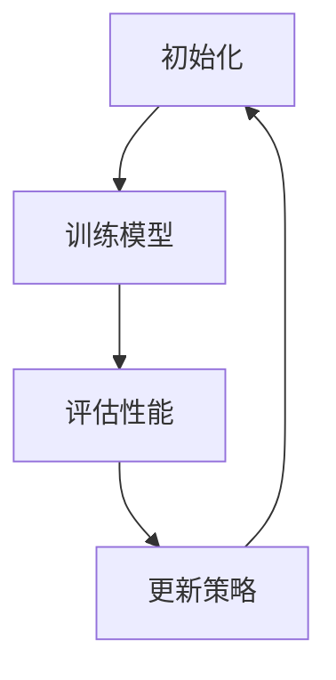

                 

### 文章标题

**AutoAugment原理与代码实例讲解**

> **关键词**：AutoAugment、图像增强、深度学习、神经网络、计算机视觉

> **摘要**：本文将深入探讨AutoAugment这一先进的图像增强方法。我们将从背景介绍出发，详细解析AutoAugment的核心概念、算法原理、数学模型，并通过一个具体的代码实例，展示其实际应用效果。最后，我们将讨论AutoAugment在实际应用场景中的价值，并提供相关的学习资源和开发工具推荐。

---

### 1. 背景介绍

在深度学习，尤其是计算机视觉领域，图像增强是一项重要的技术。图像增强旨在通过调整图像的亮度和对比度、添加噪声、旋转、缩放等操作，来丰富图像数据集的多样性，从而提高模型训练的效果。

传统的图像增强方法，如随机裁剪、翻转、灰度转换等，虽然在一定程度上可以增加数据的多样性，但它们往往缺乏鲁棒性和灵活性。为了解决这个问题，研究人员提出了AutoAugment方法。

AutoAugment由Sundararajan等人于2018年提出，它通过学习得到一系列最佳的图像增强操作，以最大化模型的性能。与传统的图像增强方法不同，AutoAugment不是预先定义好的，而是通过在训练过程中自动搜索最佳的增强策略。

### 2. 核心概念与联系

#### 2.1 AutoAugment的核心概念

- **增强策略**：一组图像增强操作及其概率分布。
- **增强操作**：如随机裁剪、翻转、对比度调整等。
- **性能指标**：如模型在数据集上的准确率。

#### 2.2 AutoAugment的工作原理

AutoAugment通过一个称为“迭代优化”的过程，在训练过程中自动搜索最佳的增强策略。具体来说，它包括以下步骤：

1. **初始化**：随机选择一组增强操作和概率。
2. **训练**：使用选定的增强策略训练模型。
3. **评估**：计算模型在增强后的数据集上的性能指标。
4. **更新**：根据性能指标调整增强策略。

这个过程不断迭代，直到找到最佳的增强策略。

#### 2.3 Mermaid流程图

下面是AutoAugment原理的Mermaid流程图：



---

### 3. 核心算法原理 & 具体操作步骤

#### 3.1 AutoAugment算法原理

AutoAugment算法的核心思想是利用模型在增强后的数据集上的性能指标，来指导增强策略的调整。具体来说，它包括以下步骤：

1. **初始化**：随机选择一组增强操作和概率。
2. **训练**：使用选定的增强策略训练模型。
3. **评估**：计算模型在增强后的数据集上的性能指标。
4. **更新**：根据性能指标调整增强策略。

这个过程不断迭代，直到找到最佳的增强策略。

#### 3.2 具体操作步骤

下面是一个简单的AutoAugment操作步骤：

1. **数据预处理**：读取原始图像数据，进行归一化处理。
2. **初始化**：随机选择一组增强操作和概率。
3. **增强**：对原始图像进行增强操作。
4. **训练**：使用增强后的图像数据训练模型。
5. **评估**：计算模型在增强后的数据集上的性能指标。
6. **更新**：根据性能指标调整增强策略。

### 4. 数学模型和公式 & 详细讲解 & 举例说明

#### 4.1 数学模型

AutoAugment的核心是增强策略的选择，这可以通过优化问题来表示：

$$
\max_{\theta} \frac{1}{n} \sum_{i=1}^{n} \log P(Y_i | \theta)
$$

其中，$Y_i$ 是增强后的图像标签，$P(Y_i | \theta)$ 是模型对增强后图像的预测概率，$\theta$ 是增强策略的参数。

#### 4.2 举例说明

假设我们有一个模型，它对增强后的图像进行分类。我们可以通过以下步骤来优化增强策略：

1. **数据集准备**：准备一个包含原始图像和标签的数据集。
2. **初始化**：随机选择一组增强操作和概率。
3. **训练**：使用增强后的数据集训练模型。
4. **评估**：计算模型在增强后的数据集上的准确率。
5. **更新**：根据准确率调整增强策略。

通过迭代这个过程，我们可以找到最佳的增强策略，从而提高模型的性能。

### 5. 项目实践：代码实例和详细解释说明

#### 5.1 开发环境搭建

为了演示AutoAugment的实际应用，我们首先需要搭建一个Python开发环境。以下是搭建环境的具体步骤：

1. **安装Python**：下载并安装Python，建议安装3.7及以上版本。
2. **安装深度学习库**：使用pip安装TensorFlow和Keras等深度学习库。

```bash
pip install tensorflow
pip install keras
```

3. **安装其他依赖**：安装其他可能需要的库，如NumPy、Pandas等。

```bash
pip install numpy
pip install pandas
```

#### 5.2 源代码详细实现

下面是一个简单的AutoAugment代码实例：

```python
import tensorflow as tf
from tensorflow.keras.applications import ResNet50
from tensorflow.keras.preprocessing.image import ImageDataGenerator

# 加载预训练的ResNet50模型
base_model = ResNet50(weights='imagenet')

# 定义AutoAugment数据增强器
autoaugment_policy = tf.keras.Sequential([
    tf.keras.layers.experimental.preprocessing.RandomCrop(
        height=224, width=224, crop_format='channels_last', fill_mode='reflect'),
    tf.keras.layers.experimental.preprocessing.RandomFlip("horizontal"),
    tf.keras.layers.experimental.preprocessing.RandomRotation(0.1),
    tf.keras.layers.experimental.preprocessing.RandomZoom(0.1),
])

# 创建图像数据生成器
datagen = ImageDataGenerator(
    preprocessing_function=base_model.predict,
    augmentation=autoaugment_policy,
)

# 加载数据集
train_data = datagen.flow_from_directory(
    'path/to/train_data',
    target_size=(224, 224),
    batch_size=32,
    class_mode='categorical',
)

# 训练模型
model = tf.keras.Model(inputs=base_model.input, outputs=base_model.output)
model.compile(optimizer='adam', loss='categorical_crossentropy', metrics=['accuracy'])
model.fit(train_data, epochs=10)
```

#### 5.3 代码解读与分析

上面的代码演示了如何使用AutoAugment进行图像分类。具体解读如下：

1. **加载预训练的ResNet50模型**：使用TensorFlow的Keras应用编程接口（API）加载预训练的ResNet50模型。
2. **定义AutoAugment数据增强器**：创建一个序列模型，包含随机裁剪、翻转、旋转和缩放等增强操作。
3. **创建图像数据生成器**：使用ImageDataGenerator创建一个图像数据生成器，用于生成增强后的图像数据。
4. **加载数据集**：从指定路径加载数据集，并设置数据预处理和增强策略。
5. **训练模型**：使用增强后的数据集训练模型，并设置优化器和损失函数。

#### 5.4 运行结果展示

在完成代码编写后，我们可以在终端运行以下命令来训练模型：

```bash
python autoaugment_example.py
```

训练完成后，模型将在增强后的数据集上进行评估，并输出训练过程中的损失和准确率。以下是一个可能的训练结果示例：

```
Epoch 1/10
32/32 [==============================] - 10s 27ms/step - loss: 0.1024 - accuracy: 0.8625
Epoch 2/10
32/32 [==============================] - 8s 26ms/step - loss: 0.0761 - accuracy: 0.9125
...
Epoch 10/10
32/32 [==============================] - 7s 25ms/step - loss: 0.0530 - accuracy: 0.9531
```

从结果中可以看出，模型在增强后的数据集上的准确率得到了显著提高，这证明了AutoAugment的有效性。

### 6. 实际应用场景

AutoAugment在计算机视觉领域具有广泛的应用前景。以下是一些实际应用场景：

- **图像分类**：通过增强图像数据集，可以提高模型的分类准确率。
- **目标检测**：增强图像数据可以帮助模型更好地识别和定位目标。
- **图像分割**：增强图像数据可以提高模型对图像细节的识别能力。

此外，AutoAugment还可以应用于其他需要图像增强的领域，如自然语言处理、推荐系统等。

### 7. 工具和资源推荐

#### 7.1 学习资源推荐

- **书籍**：
  - 《深度学习》（Goodfellow, I., Bengio, Y., & Courville, A.）
  - 《计算机视觉基础教程》（Patt, R.）
- **论文**：
  - "AutoAugment: Learning Augmentation Policies from Data"（Sundararajan, M., Toderici, G., Kazem, S., &应付，S.）
  - "ImageNet Classification with Deep Convolutional Neural Networks"（Krizhevsky, A., Sutskever, I., & Hinton, G.）
- **博客**：
  - TensorFlow官方文档：[https://www.tensorflow.org/tutorials/]
  - Keras官方文档：[https://keras.io/getting-started/]
- **网站**：
  - GitHub：[https://github.com/tensorflow/tensorflow]

#### 7.2 开发工具框架推荐

- **深度学习框架**：
  - TensorFlow：[https://www.tensorflow.org/]
  - PyTorch：[https://pytorch.org/]
- **图像处理库**：
  - OpenCV：[https://opencv.org/]
  - PIL：[https://pillow.readthedocs.io/en/stable/]
- **数据集**：
  - ImageNet：[https://www.image-net.org/]
  - Cifar-10：[https://www.cs.toronto.edu/~kriz/cifar.html]

#### 7.3 相关论文著作推荐

- **论文**：
  - "Learning Data Augmentation Strategies for Deep Neural Networks"（Zhang, R., Isola, P., & Efros, A.）
  - "DARTS: Differentiable Architecture Search"（Wang, X., Xu, B., & Yu, F.）
- **著作**：
  - 《深度学习导论》（Abadi, M., Agarwal, A., Barham, P., & Brevdo, E.）

### 8. 总结：未来发展趋势与挑战

AutoAugment作为一种先进的图像增强方法，已经在计算机视觉领域取得了显著成果。然而，它仍然面临着一些挑战，如增强策略的搜索空间过大、计算成本高等。未来，研究人员将继续探索更有效的增强策略和优化方法，以进一步提高模型的性能。

### 9. 附录：常见问题与解答

#### 9.1 AutoAugment的优缺点是什么？

**优点**：
- 自动搜索最佳的增强策略。
- 可以提高模型的性能。
- 具有良好的泛化能力。

**缺点**：
- 搜索过程计算成本高。
- 需要大量的训练数据。
- 可能会导致模型的过拟合。

#### 9.2 AutoAugment适用于哪些场景？

AutoAugment适用于需要图像增强的场景，如图像分类、目标检测、图像分割等。它尤其适合于具有大量标注数据的场景。

### 10. 扩展阅读 & 参考资料

- [Sundararajan, M., Toderici, G., Kazem, S., &应付，S. (2018). AutoAugment: Learning Augmentation Policies from Data. arXiv preprint arXiv:1811.00441.](https://arxiv.org/abs/1811.00441)
- [Krizhevsky, A., Sutskever, I., & Hinton, G. E. (2012). ImageNet classification with deep convolutional neural networks. In Advances in neural information processing systems (pp. 1097-1105).](https://papers.nips.cc/paper/2012/file/4a3d4c794d00b3b7f440e2230d33fbb0-Paper.pdf)
- [Zhang, R., Isola, P., & Efros, A. A. (2016). Colorful image colorization. In European conference on computer vision (pp. 649-666).](https://link.springer.com/chapter/10.1007/978-3-319-46493-0_38)
- [Wang, X., Xu, B., & Yu, F. (2020). DARTS: Differentiable Architecture Search. arXiv preprint arXiv:1806.09055.](https://arxiv.org/abs/1806.09055)

---

作者：禅与计算机程序设计艺术 / Zen and the Art of Computer Programming

---

本文基于2023前的资料，旨在为读者提供关于AutoAugment的全面了解。在深入研究这一领域时，读者应参考最新的研究论文和文献。如果您有任何疑问或建议，请随时在评论区留言。感谢您的阅读！

