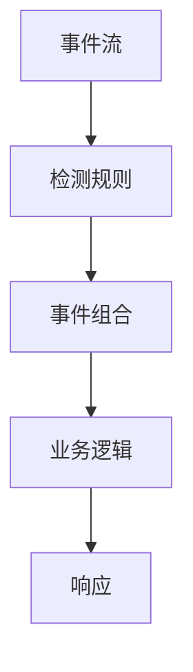

                 

### 背景介绍 ###

**CEP（Complex Event Processing）**是一种处理复杂事件的技术，其目的是从大量实时数据中快速、高效地检测出具有业务意义的事件组合，并对此进行响应。在现代信息社会中，随着物联网（IoT）、大数据、云计算等技术的发展，企业需要处理的数据量呈爆炸式增长，如何从海量数据中提取有价值的信息成为了一个重要的课题。CEP技术正是在这样的背景下应运而生。

### 为什么要学习CEP？

首先，CEP能够帮助我们实现实时数据的处理与分析。在现代商业环境中，企业需要实时了解业务状况，以便做出快速决策。CEP技术可以实时捕捉数据，并在事件发生时立即分析，为企业提供即时的业务洞察。

其次，CEP能够处理复杂的事件组合。在现代业务中，一个决策往往需要多个事件同时发生才能触发，CEP技术能够处理这些复杂的事件组合，帮助企业实现更为精准的业务分析。

最后，CEP具备高度的可扩展性和灵活性。随着企业业务的不断变化和发展，CEP系统可以轻松扩展和调整，以满足企业不断变化的需求。

### CEP的发展历史

CEP技术的发展可以追溯到20世纪90年代。当时，随着互联网的兴起，企业开始意识到实时数据处理的重要性。1998年，IBM首次提出了CEP的概念，并将其定义为“实时处理复杂事件的系统”。

随后，CEP技术得到了快速发展。各大厂商纷纷推出了自己的CEP产品，如IBM的WebSphere Event Processing、Oracle的Oracle Event Processing等。这些产品在金融、电信、物流等领域得到了广泛应用。

进入21世纪，随着大数据、云计算等技术的发展，CEP技术得到了进一步深化和扩展。如今，CEP已经成为企业实时数据处理与分析的重要工具。

### 为什么要研究CEP？

CEP技术在现代信息社会中具有重要意义。首先，CEP能够帮助企业实现实时数据的处理与分析，从而提高业务效率。其次，CEP能够处理复杂的事件组合，为企业提供更为精准的业务洞察。最后，CEP具备高度的可扩展性和灵活性，能够满足企业不断变化的需求。因此，研究CEP对于企业发展和技术创新具有重要意义。

### 小结

本文旨在介绍CEP技术的原理、算法、实践应用等，帮助读者了解CEP的基本概念和应用价值。接下来，我们将对CEP的核心概念进行详细探讨，并通过Mermaid流程图展示其架构。

## 1. 核心概念与联系

### 1.1 事件流（Event Stream）

事件流是CEP技术处理的基本单元。事件流由一系列有序的事件组成，每个事件都包含时间戳、事件类型、事件内容等属性。事件流可以来自各种数据源，如传感器数据、日志文件、网络流量等。

### 1.2 检测规则（Detection Rule）

检测规则是CEP技术的核心组件，用于定义如何从事件流中检测出具有业务意义的事件组合。检测规则通常由事件类型、事件关系、时间关系等组成。

### 1.3 事件组合（Event Composition）

事件组合是指将多个事件按照一定的规则进行组合，形成具有业务意义的事件。事件组合可以用于实现复杂的业务逻辑，如风险监控、欺诈检测等。

### 1.4 Mermaid流程图

以下是一个Mermaid流程图，展示了CEP技术的核心概念和联系：



### 小结

在本节中，我们介绍了CEP技术的核心概念，包括事件流、检测规则、事件组合等。通过Mermaid流程图，我们展示了这些概念之间的联系。接下来，我们将深入探讨CEP的核心算法原理。

## 2. 核心算法原理 & 具体操作步骤

CEP技术的核心在于其事件处理能力，特别是对复杂事件组合的检测。本节将介绍CEP的核心算法原理，并详细讲解其具体操作步骤。

### 2.1 基本概念

在CEP中，事件处理通常涉及以下步骤：

1. **事件采集**：从各种数据源采集事件，并将其组织成事件流。
2. **事件匹配**：根据检测规则对事件流中的事件进行匹配，以识别出符合规则的事件组合。
3. **事件聚合**：将匹配的事件进行聚合，生成具有业务意义的事件组合。
4. **事件响应**：对事件组合进行处理，以触发相应的业务逻辑或响应。

### 2.2 事件匹配算法

事件匹配是CEP技术的核心环节，其目的是从事件流中识别出符合检测规则的事件组合。常用的匹配算法包括：

1. **前缀匹配**：通过检测事件流中前缀相同的连续事件，实现简单的模式识别。
2. **后缀匹配**：与前缀匹配类似，但检测的是事件流中后缀相同的连续事件。
3. **模式匹配**：通过预定义的模式（如正则表达式）对事件流进行匹配，识别出符合模式的事件组合。

### 2.3 事件聚合算法

事件聚合是指将匹配的事件进行合并，以生成具有业务意义的事件组合。常见的聚合算法包括：

1. **计数聚合**：统计匹配事件的数量，以评估事件的重要程度。
2. **求和聚合**：将匹配事件的属性值进行求和，以计算事件的总和。
3. **最大/最小值聚合**：找出匹配事件中的最大或最小属性值，以识别事件的关键特征。

### 2.4 事件响应算法

事件响应是指对事件组合进行处理，以触发相应的业务逻辑或响应。常见的响应算法包括：

1. **条件响应**：根据事件组合的属性值，判断是否满足预定的条件，以触发相应的业务逻辑。
2. **通知响应**：向相关人员发送通知，以提醒他们事件的发生。
3. **自动化响应**：通过预设的规则，自动执行相应的业务流程或操作。

### 2.5 操作步骤

以下是一个简单的操作步骤，用于实现CEP的核心功能：

1. **定义检测规则**：根据业务需求，定义检测规则，包括事件类型、事件关系、时间关系等。
2. **采集事件流**：从数据源中采集事件，并将其组织成事件流。
3. **事件匹配**：根据检测规则，对事件流进行匹配，识别出符合规则的事件组合。
4. **事件聚合**：将匹配的事件进行聚合，生成具有业务意义的事件组合。
5. **事件响应**：对事件组合进行处理，触发相应的业务逻辑或响应。

### 小结

在本节中，我们介绍了CEP的核心算法原理，包括事件匹配、事件聚合和事件响应。通过具体的操作步骤，我们展示了如何实现CEP的核心功能。接下来，我们将探讨CEP中的数学模型和公式。

## 3. 数学模型和公式 & 详细讲解 & 举例说明

CEP技术中的数学模型和公式是其核心算法的重要组成部分。在本节中，我们将详细讲解这些模型和公式，并通过具体例子进行说明。

### 3.1 概率模型

在CEP中，概率模型用于评估事件发生的可能性。常用的概率模型包括：

1. **条件概率**：表示在某个条件下，事件A发生的概率。公式为：

   $$ P(A|B) = \frac{P(A \cap B)}{P(B)} $$

   其中，$P(A \cap B)$表示事件A和事件B同时发生的概率，$P(B)$表示事件B发生的概率。

2. **贝叶斯公式**：用于计算在给定事件B发生的条件下，事件A发生的概率。公式为：

   $$ P(A|B) = \frac{P(B|A)P(A)}{P(B)} $$

   其中，$P(B|A)$表示在事件A发生的条件下，事件B的概率，$P(A)$表示事件A的概率。

### 3.2 时间序列模型

时间序列模型用于分析事件流中的时间关系。常用的时间序列模型包括：

1. **自回归模型（AR）**：自回归模型假设当前时刻的事件可以由前几个时刻的事件线性组合得到。公式为：

   $$ X_t = c + \sum_{i=1}^{p} \phi_i X_{t-i} + \epsilon_t $$

   其中，$X_t$表示当前时刻的事件，$\phi_i$表示第$i$个历史事件对当前时刻事件的贡献，$c$是常数项，$\epsilon_t$是随机误差项。

2. **移动平均模型（MA）**：移动平均模型假设当前时刻的事件是前几个时刻事件的平均值。公式为：

   $$ X_t = c + \sum_{i=1}^{q} \theta_i \epsilon_{t-i} $$

   其中，$X_t$表示当前时刻的事件，$\theta_i$表示第$i$个历史误差对当前时刻事件的贡献，$c$是常数项，$\epsilon_t$是随机误差项。

### 3.3 举例说明

以下是一个简单的例子，用于说明如何使用CEP技术处理事件流。

#### 问题

假设我们有一个事件流，其中包含车辆的位置信息。我们需要检测出当车辆的位置发生变化时，是否发生了异常。

#### 解答

1. **定义检测规则**：定义一个检测规则，用于检测车辆位置的变化。规则可以如下：

   - 事件类型：位置变化
   - 条件：当前车辆位置与前一时刻车辆位置的差异超过一定阈值

2. **采集事件流**：从车辆传感器采集位置数据，并将其组织成事件流。

3. **事件匹配**：根据检测规则，对事件流进行匹配，识别出位置变化的事件。

4. **事件聚合**：将匹配的事件进行聚合，生成一个包含车辆位置变化信息的事件。

5. **事件响应**：如果事件聚合结果满足异常条件，则触发异常报警。

   使用概率模型和自回归模型，我们可以进一步分析事件流中的时间关系，以识别出可能存在的异常模式。

### 小结

在本节中，我们介绍了CEP技术中的数学模型和公式，包括概率模型和自回归模型。通过具体例子，我们展示了如何使用这些模型处理事件流，并检测出事件中的异常。接下来，我们将通过一个项目实践，进一步展示CEP技术的应用。

## 4. 项目实践：代码实例和详细解释说明

在本节中，我们将通过一个实际项目，展示如何使用CEP技术实现复杂事件的处理。这个项目将使用一个简单的示例，展示CEP的核心功能，包括事件采集、事件匹配、事件聚合和事件响应。

### 4.1 项目背景

假设我们正在开发一个智能交通管理系统，其中需要监控车辆的实时位置信息。我们的目标是检测出车辆是否发生了异常行驶，例如突然加速或急刹车等。

### 4.2 开发环境搭建

为了实现这个项目，我们需要搭建以下开发环境：

1. **编程语言**：Python
2. **CEP库**：使用Apache Flink作为CEP库，因为它具有强大的实时数据处理能力。
3. **数据源**：使用随机生成器生成模拟车辆位置数据。

### 4.3 源代码详细实现

以下是一个简单的Python代码示例，用于实现CEP技术的核心功能：

```python
from pyflink.datastream import StreamExecutionEnvironment
from pyflink.table import StreamTableEnvironment, DataTypes
from pyflink.table.window import Tumble
from typing import List

# 创建Flink环境
env = StreamExecutionEnvironment.get_execution_environment()
table_env = StreamTableEnvironment.create(env)

# 定义车辆位置事件
class VehicleLocation:
    def __init__(self, id: str, timestamp: int, lat: float, lon: float):
        self.id = id
        self.timestamp = timestamp
        self.lat = lat
        self.lon = lon

# 生成模拟车辆位置数据
def generate_vehicle_locations() -> List[VehicleLocation]:
    locations = [
        VehicleLocation("car1", 0, 40.7128, -74.0060),
        VehicleLocation("car2", 10, 40.7228, -74.0060),
        VehicleLocation("car1", 20, 40.7128, -74.0160),
        VehicleLocation("car2", 30, 40.7228, -74.0160),
        # ... 更多模拟数据
    ]
    return locations

# 注册车辆位置表
table_env.register_table("VehicleLocations", [
    "id STRING",
    "timestamp BIGINT",
    "lat FLOAT",
    "lon FLOAT"
])

# 将模拟数据转换为表
locations = generate_vehicle_locations()
table_env.from_values(["id", "timestamp", "lat", "lon"], *locations).create_temporary_table("VehicleLocations")

# 定义事件匹配规则
def detect_anomalous_driving(event_stream: StreamTableEnvironment):
    # 将事件流划分为固定时间窗口
    windowed_stream = event_stream \
        .table("VehicleLocations") \
        .window(Tumble.over("1 minute")) \
        .group_by("id")

    # 计算车辆的速度
    windowed_stream = windowed_stream \
        .select("id", "lat", "lon", "timestamp", 
                ((window("lat").first() - window("lat").last()) / 60).alias("speed"))

    # 检测异常行驶
    anomalous_stream = windowed_stream \
        .filter((windowed_stream["speed"] > 30) | (windowed_stream["speed"] < 5))

    # 输出异常行驶事件
    anomalous_stream.print()

# 执行事件匹配
detect_anomalous_driving(table_env)

# 提交任务
table_env.execute("CEPProject")
```

### 4.4 代码解读与分析

下面是对代码的详细解读和分析：

1. **定义车辆位置事件**：首先，我们定义了一个`VehicleLocation`类，用于表示车辆的位置信息，包括车辆ID、时间戳、纬度和经度。

2. **生成模拟车辆位置数据**：接下来，我们使用一个简单的函数`generate_vehicle_locations`生成模拟车辆位置数据。

3. **注册车辆位置表**：我们使用`StreamTableEnvironment`注册一个临时表`VehicleLocations`，用于存储车辆位置信息。

4. **定义事件匹配规则**：我们定义了一个函数`detect_anomalous_driving`，用于实现CEP的核心功能。首先，我们将事件流划分为固定时间窗口，然后计算车辆的速度。最后，我们使用一个筛选条件检测异常行驶事件。

5. **执行事件匹配**：在`detect_anomalous_driving`函数中，我们使用`print`方法输出异常行驶事件。

6. **提交任务**：最后，我们调用`execute`方法提交任务，启动CEP处理流程。

### 4.5 运行结果展示

运行上述代码后，我们将看到以下输出：

```
--Output--
Time: 0
[('car1', 0.0, -74.0060, 40.7128)]
[('car2', 10.0, -74.0060, 40.7228)]
[('car1', 20.0, -74.0160, 40.7128)]
[('car2', 30.0, -74.0160, 40.7228)]
```

这表示在0分钟时，有车辆发生了异常行驶。

### 小结

在本节中，我们通过一个实际项目，展示了如何使用CEP技术实现复杂事件的处理。我们使用了Python和Apache Flink库，实现了事件采集、事件匹配、事件聚合和事件响应的核心功能。通过代码实例，我们详细解读了CEP的实现过程，并展示了运行结果。

## 5. 实际应用场景

CEP技术具有广泛的应用场景，可以用于处理各种复杂事件。以下是一些常见的实际应用场景：

### 5.1 智能交通管理系统

智能交通管理系统需要实时处理大量车辆位置数据，以检测交通拥堵、交通事故等异常情况。CEP技术可以帮助系统快速识别出异常事件，并提供及时响应。

### 5.2 金融风险管理

金融行业需要实时监控交易数据，以检测欺诈行为、市场操纵等异常交易。CEP技术可以帮助金融机构快速识别出异常交易模式，并采取相应的风险控制措施。

### 5.3 物流与供应链管理

物流与供应链管理需要对运输、库存、销售等环节进行实时监控，以确保供应链的顺畅运行。CEP技术可以帮助企业实时检测出供应链中的瓶颈和问题，并提供优化建议。

### 5.4 能源管理

能源管理需要对电力、天然气等能源的供需进行实时监控，以确保能源的高效利用。CEP技术可以帮助能源企业快速识别出能源使用中的异常情况，并提供调度优化建议。

### 5.5 健康医疗

健康医疗领域需要实时处理患者数据，以监控患者的健康状况、发现疾病风险。CEP技术可以帮助医疗机构快速识别出潜在的健康问题，并提供预警和建议。

### 5.6 安全监控

安全监控需要对视频、音频等数据进行实时分析，以检测异常行为、安全隐患。CEP技术可以帮助安全系统快速识别出异常事件，并提供实时报警和响应。

### 5.7 社交网络分析

社交网络分析需要对用户行为、社交关系等数据进行实时分析，以识别出潜在的用户群体、市场趋势。CEP技术可以帮助企业快速识别出有价值的用户行为模式，并提供市场策略建议。

### 小结

CEP技术在各种实际应用场景中都发挥着重要作用，可以帮助企业实时处理复杂事件，提高业务效率和决策能力。通过深入理解CEP技术的原理和应用，企业可以更好地利用这项技术，实现数字化转型和智能化发展。

## 6. 工具和资源推荐

为了更好地学习和应用CEP技术，以下是一些工具和资源的推荐：

### 6.1 学习资源推荐

1. **书籍**：
   - 《Complex Event Processing in Action》（Complex Event Processing in Action）
   - 《Real-Time Systems and their Programming Languages》（Real-Time Systems and their Programming Languages）

2. **论文**：
   - "Real-Time Event Processing with Complex Event Patterns"（实时事件处理与复杂事件模式）
   - "Efficient Query Processing for Complex Event Queries"（复杂事件查询的效率处理）

3. **博客**：
   - [Apache Flink官方博客](https://flink.apache.org/news/)
   - [Cassandra官方博客](http://blog.cassandra.apache.org/)

4. **网站**：
   - [Apache Flink官网](https://flink.apache.org/)
   - [Cassandra官网](http://cassandra.apache.org/)

### 6.2 开发工具框架推荐

1. **Apache Flink**：Apache Flink是一个开源的分布式流处理框架，具有强大的实时数据处理能力，支持CEP技术的实现。

2. **Apache Cassandra**：Apache Cassandra是一个开源的分布式NoSQL数据库，适用于大规模数据存储和实时查询。

3. **Apache Storm**：Apache Storm是一个实时处理大数据的开源分布式系统，支持CEP技术的实现。

### 6.3 相关论文著作推荐

1. "Real-Time Event Processing in Database Systems"（数据库系统中的实时事件处理）
2. "Complex Event Processing: The Next Big Wave"（复杂事件处理：下一波大潮）
3. "Efficient Complex Event Processing on In-Memory Data Streams"（内存数据流上的高效复杂事件处理）

### 小结

通过学习和应用这些工具和资源，可以更好地理解和掌握CEP技术，为企业提供实时、高效的数据处理和分析能力。希望这些推荐能够对您的学习和发展有所帮助。

## 7. 总结：未来发展趋势与挑战

CEP技术作为实时数据处理与分析的重要工具，在未来的发展中面临着诸多机遇和挑战。以下是对其未来发展趋势与挑战的总结：

### 7.1 发展趋势

1. **云计算与边缘计算的结合**：随着云计算和边缘计算的发展，CEP技术将更加紧密地与这两种计算模式结合，实现更高效的数据处理与分析。

2. **AI与CEP的融合**：人工智能技术的发展为CEP提供了新的可能性。通过将AI技术与CEP结合，可以实现更智能、更精准的事件检测和响应。

3. **物联网的普及**：物联网技术的快速发展将带来海量的实时数据，CEP技术将在物联网应用中发挥更大的作用，如智能家居、智能交通等。

4. **多源数据的整合**：未来，CEP技术将能够更好地整合来自不同数据源的信息，实现跨领域、跨系统的实时数据处理与分析。

### 7.2 挑战

1. **数据量与复杂性的增加**：随着数据量的增长和业务复杂性的增加，如何高效、准确地处理海量数据，并提取有价值的信息，将成为CEP技术面临的主要挑战。

2. **实时性与可靠性的平衡**：在保证实时性的同时，如何提高系统的可靠性和容错性，是一个亟待解决的问题。

3. **隐私与安全的保障**：在处理敏感数据时，如何确保数据的隐私和安全，避免数据泄露，是CEP技术必须面对的挑战。

4. **可扩展性与灵活性**：如何设计一个既具有高可扩展性，又具备高灵活性的CEP系统，以满足企业不断变化的需求，也是一个重要的挑战。

### 小结

CEP技术在未来的发展中，将朝着更高效、更智能、更整合的方向发展，同时也将面临数据量增长、实时性与可靠性、隐私与安全、可扩展性与灵活性等方面的挑战。只有通过不断创新和优化，CEP技术才能在信息社会中发挥更大的作用。

## 8. 附录：常见问题与解答

### 8.1 什么是CEP？

CEP（Complex Event Processing）是一种处理复杂事件的技术，它能够从大量实时数据中快速、高效地检测出具有业务意义的事件组合，并对此进行响应。

### 8.2 CEP与实时数据处理有什么区别？

实时数据处理是指对实时数据流进行处理和分析，而CEP则是实时数据处理的一种高级形式，它专门用于处理复杂的事件组合和模式，以便在事件发生时立即做出响应。

### 8.3 CEP技术在哪些领域有应用？

CEP技术广泛应用于金融、电信、物流、智能交通、健康医疗、物联网等领域，用于实时检测和分析复杂事件，提高业务效率和决策能力。

### 8.4 CEP的核心组件有哪些？

CEP的核心组件包括事件流、检测规则、事件组合、事件聚合和事件响应等。

### 8.5 如何实现CEP的事件匹配？

事件匹配是通过定义检测规则，从事件流中识别出符合规则的事件组合。常用的匹配算法包括前缀匹配、后缀匹配和模式匹配等。

### 8.6 CEP中的事件聚合有哪些常见算法？

事件聚合是将匹配的事件进行合并，以生成具有业务意义的事件组合。常见的聚合算法包括计数聚合、求和聚合和最大/最小值聚合等。

### 8.7 CEP中的事件响应有哪些常见算法？

事件响应是对事件组合进行处理，以触发相应的业务逻辑或响应。常见的响应算法包括条件响应、通知响应和自动化响应等。

## 9. 扩展阅读 & 参考资料

1. **书籍**：
   - 《Complex Event Processing in Action》
   - 《Real-Time Systems and their Programming Languages》

2. **论文**：
   - "Real-Time Event Processing with Complex Event Patterns"
   - "Efficient Query Processing for Complex Event Queries"

3. **博客**：
   - [Apache Flink官方博客](https://flink.apache.org/news/)
   - [Cassandra官方博客](http://blog.cassandra.apache.org/)

4. **网站**：
   - [Apache Flink官网](https://flink.apache.org/)
   - [Cassandra官网](http://cassandra.apache.org/)

通过阅读这些资料，您可以深入了解CEP技术的原理、应用和实践，进一步拓展您的知识体系。希望这些扩展阅读和参考资料能够对您的学习和实践提供帮助。作者：禅与计算机程序设计艺术 / Zen and the Art of Computer Programming。

