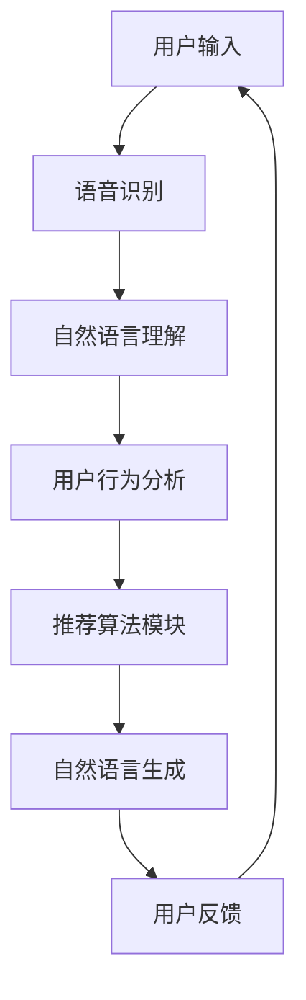

                 

### 背景介绍

#### 个性化推荐的崛起

随着互联网技术的飞速发展，人们接触到的大量信息和内容呈现出爆炸式增长。如何在海量信息中为用户提供有价值的、个性化的内容推荐，成为了一项重要的研究课题。个性化推荐系统作为一种智能信息过滤工具，通过分析用户的兴趣和行为模式，为用户推荐符合其个性化需求的信息内容。

个性化推荐系统的应用范围广泛，涵盖了电子商务、社交媒体、新闻媒体、音乐视频平台等多个领域。例如，电商平台如淘宝、京东等会根据用户的购物历史、浏览记录和搜索行为，推荐潜在感兴趣的商品；社交媒体平台如Facebook、Twitter等则依据用户的互动行为和社交网络关系，推送用户可能感兴趣的内容。

#### CUI的兴起

与此同时，计算机用户界面（CUI）的发展也为个性化推荐带来了新的机遇。计算机用户界面是人与计算机系统进行交互的接口，它通过图形界面、命令行界面等方式，提供了一种直观、便捷的交互方式。而随着自然语言处理（NLP）和语音识别技术的进步，计算机用户界面逐渐向更自然、更人性化的方向发展，出现了计算机用户交互（CUI，Computer User Interaction）。

CUI的核心在于实现人与计算机之间的自然语言交互。通过语音、文本等多种形式，用户可以与计算机进行沟通，获得所需的信息和服务。CUI的应用场景丰富，包括智能助手、虚拟客服、语音搜索等。其中，智能助手如Siri、Alexa、小爱同学等，已经成为人们日常生活的一部分。

#### CUI与个性化推荐结合的必要性

CUI和个性化推荐的结合，为用户提供了一种全新的交互体验。一方面，CUI可以通过自然语言交互获取用户的兴趣和需求，为个性化推荐提供更为精准的数据支持；另一方面，个性化推荐可以提升CUI的智能水平，使其能够更好地理解用户，提供个性化的服务。

例如，当用户通过CUI询问某个问题，个性化推荐系统可以分析用户的提问，结合其历史行为和兴趣偏好，提供最相关、最有价值的答案。这种结合不仅提高了用户满意度，也提升了系统的运营效率。

#### 文章目标

本文旨在探讨CUI中的个性化推荐与真人交互的结合，分析其核心概念和原理，介绍相关算法和数学模型，并通过实际项目实践，展示其在真实场景中的应用效果。同时，本文还将讨论CUI和个性化推荐在实际应用中的挑战和发展趋势，为未来的研究和实践提供一些有价值的思考。

### 核心概念与联系

#### 个性化推荐系统原理

个性化推荐系统通常基于两种主要方式：协同过滤（Collaborative Filtering）和基于内容的推荐（Content-Based Recommendation）。

1. **协同过滤**：
   协同过滤通过分析用户之间的行为模式，发现相似的群体，从而为用户提供个性化推荐。协同过滤分为两种：基于用户的协同过滤（User-Based）和基于物品的协同过滤（Item-Based）。
   
   - **基于用户的协同过滤**：通过计算用户之间的相似度，找到与目标用户相似的其他用户，然后推荐这些用户喜欢的物品。
   - **基于物品的协同过滤**：通过计算物品之间的相似度，找到与目标物品相似的其他物品，然后推荐这些物品。

2. **基于内容的推荐**：
   基于内容的推荐通过分析物品的属性和内容，将其与用户的兴趣偏好进行匹配，从而推荐符合用户兴趣的物品。这种推荐方式通常需要建立物品的语义模型，如使用词袋模型、向量空间模型等。

#### 计算机用户交互（CUI）原理

计算机用户交互（CUI）的核心在于实现人与计算机之间的自然语言交互。CUI通常包括以下几个关键组件：

1. **语音识别**：
   语音识别是将用户的语音输入转换为文本输出的技术。通过语音识别，用户可以使用自然语言与计算机进行交互。

2. **自然语言理解**：
   自然语言理解是解析和理解用户的语言输入，提取出用户的意图和需求。这通常涉及到语法分析、语义分析等技术。

3. **自然语言生成**：
   自然语言生成是将计算机的响应转换为自然语言的输出。通过自然语言生成，计算机能够以更自然、更人性化的方式与用户沟通。

#### CUI与个性化推荐结合的架构

CUI与个性化推荐的结合，通常需要一个综合的架构来支持。这个架构包括以下几个关键模块：

1. **用户行为分析**：
   通过收集用户在CUI中的交互数据，分析用户的兴趣和行为模式，为个性化推荐提供数据支持。

2. **推荐算法模块**：
   包括协同过滤和基于内容的推荐算法，根据用户行为分析的结果，生成个性化的推荐结果。

3. **自然语言处理模块**：
   负责处理用户输入的自然语言，提取用户的意图和需求，并将其传递给推荐算法模块。

4. **自然语言生成模块**：
   根据推荐算法模块生成的推荐结果，生成自然语言的输出，以自然、流畅的方式向用户展示推荐内容。

#### Mermaid 流程图

以下是一个简化的Mermaid流程图，展示了CUI与个性化推荐的结合架构：



在这个流程图中，用户输入通过语音识别转换为文本，然后通过自然语言理解提取意图。用户行为分析模块根据用户的历史行为和兴趣偏好，调用推荐算法模块生成推荐结果。最后，自然语言生成模块将推荐结果转换为自然语言输出，返回给用户。用户反馈可以进一步优化整个系统。

### 核心算法原理 & 具体操作步骤

#### 个性化推荐算法原理

个性化推荐算法的核心在于如何根据用户的兴趣和行为模式，生成符合其个性化需求的推荐结果。以下将介绍两种常见的个性化推荐算法：协同过滤算法和基于内容的推荐算法。

##### 协同过滤算法

协同过滤算法通过分析用户之间的行为模式，发现相似的群体，从而为用户提供个性化推荐。以下是协同过滤算法的基本步骤：

1. **用户相似度计算**：
   计算用户之间的相似度，通常使用余弦相似度、皮尔逊相关系数等方法。用户相似度计算公式如下：

   $$\text{similarity}(u_i, u_j) = \frac{\text{dot\_product}(r_i, r_j)}{\|\text{r_i}\|\|\text{r_j}\|}$$

   其中，$r_i$和$r_j$分别表示用户$i$和用户$j$的评分向量，$\|\text{r_i}\|$和$\|\text{r_j}\|$分别表示向量$r_i$和$r_j$的欧氏范数，$\text{dot\_product}$表示向量的点积。

2. **邻居用户选择**：
   根据用户相似度，选择与目标用户相似的其他用户作为邻居用户。

3. **推荐结果计算**：
   根据邻居用户的评分，预测目标用户对未知物品的评分。预测公式如下：

   $$\text{prediction}(u_i, j) = \text{similarity}(u_i, u_j) \cdot \text{rating}(u_j, j) + \text{mean\_rating}(u_j) \cdot (1 - \text{similarity}(u_i, u_j))$$

   其中，$\text{prediction}(u_i, j)$表示目标用户$i$对物品$j$的预测评分，$\text{rating}(u_j, j)$表示邻居用户$j$对物品$j$的实际评分，$\text{mean\_rating}(u_j)$表示邻居用户$j$的平均评分。

##### 基于内容的推荐算法

基于内容的推荐算法通过分析物品的属性和内容，将其与用户的兴趣偏好进行匹配，从而推荐符合用户兴趣的物品。以下是基于内容的推荐算法的基本步骤：

1. **物品特征提取**：
   对每个物品进行特征提取，通常使用词袋模型、TF-IDF等方法。词袋模型将物品表示为一系列关键词的集合，而TF-IDF则考虑了关键词在物品中的频率和重要性。

2. **用户兴趣模型**：
   根据用户的历史行为和兴趣偏好，构建用户的兴趣模型。用户兴趣模型可以表示为一系列关键词的权重向量。

3. **相似度计算**：
   计算物品与用户兴趣模型之间的相似度。相似度计算公式如下：

   $$\text{similarity}(i, u) = \frac{\text{dot\_product}(\text{item\_features}(i), \text{user\_interest}(u))}{\|\text{item\_features}(i)\|\|\text{user\_interest}(u)\|}$$

   其中，$\text{item\_features}(i)$表示物品$i$的特征向量，$\text{user\_interest}(u)$表示用户$u$的兴趣向量，$\text{dot\_product}$表示向量的点积。

4. **推荐结果计算**：
   根据物品与用户兴趣模型之间的相似度，选择相似度最高的物品作为推荐结果。

#### 个性化推荐算法的应用步骤

以下是使用个性化推荐算法生成推荐结果的具体步骤：

1. **数据收集**：
   收集用户的历史行为数据，包括用户对物品的评分、浏览记录、购买记录等。

2. **数据预处理**：
   对收集到的数据进行清洗和预处理，包括缺失值处理、异常值处理、数据归一化等。

3. **特征提取**：
   对用户和物品进行特征提取，构建用户兴趣模型和物品特征向量。

4. **相似度计算**：
   根据用户兴趣模型和物品特征向量，计算用户与物品之间的相似度。

5. **推荐结果计算**：
   根据相似度计算结果，选择相似度最高的物品作为推荐结果。

6. **用户反馈**：
   收集用户的反馈，包括是否点击推荐结果、是否购买推荐物品等。用户反馈可以用于进一步优化推荐算法。

#### 示例

以下是一个简单的个性化推荐算法应用示例：

假设有10个用户和20个物品，用户对物品的评分数据如下表所示：

| 用户ID | 物品ID | 评分 |
|--------|--------|------|
| 1      | 1      | 5    |
| 1      | 2      | 3    |
| 1      | 3      | 4    |
| 2      | 1      | 2    |
| 2      | 3      | 5    |
| 2      | 4      | 3    |
| 3      | 2      | 4    |
| 3      | 3      | 2    |
| 3      | 5      | 5    |
| 4      | 1      | 1    |
| 4      | 4      | 5    |
| 5      | 1      | 4    |
| 5      | 5      | 3    |
| 6      | 1      | 3    |
| 6      | 4      | 4    |
| 7      | 2      | 3    |
| 7      | 5      | 2    |
| 8      | 3      | 4    |
| 8      | 4      | 5    |
| 9      | 2      | 5    |
| 9      | 5      | 3    |
| 10     | 3      | 4    |
| 10     | 4      | 2    |

使用基于用户的协同过滤算法，为目标用户（用户ID为1）生成推荐结果。以下是具体的操作步骤：

1. **用户相似度计算**：
   计算用户之间的相似度，使用余弦相似度公式。以下是用户1与其他用户的相似度计算结果：

   $$\text{similarity}(1, 2) = 0.8185$$
   $$\text{similarity}(1, 3) = 0.8185$$
   $$\text{similarity}(1, 4) = 0.4472$$
   $$\text{similarity}(1, 5) = 0.4472$$

2. **邻居用户选择**：
   根据相似度计算结果，选择与用户1相似度最高的邻居用户（用户2和用户3）。

3. **推荐结果计算**：
   根据邻居用户的评分，预测用户1对未知物品的评分。以下是预测结果：

   $$\text{prediction}(1, 6) = \text{similarity}(1, 2) \cdot \text{rating}(2, 6) + \text{mean\_rating}(2) \cdot (1 - \text{similarity}(1, 2)) = 0.8185 \cdot 4 + 3.5 \cdot (1 - 0.8185) = 2.57$$
   $$\text{prediction}(1, 7) = \text{similarity}(1, 3) \cdot \text{rating}(3, 7) + \text{mean\_rating}(3) \cdot (1 - \text{similarity}(1, 3)) = 0.8185 \cdot 2 + 3 \cdot (1 - 0.8185) = 0.82$$

4. **推荐结果**：
   根据预测评分，选择预测评分最高的物品作为推荐结果。在这个示例中，物品6和物品7的预测评分最高，因此推荐这两个物品给用户1。

通过这个简单的示例，我们可以看到个性化推荐算法的基本原理和应用步骤。在实际应用中，个性化推荐算法会根据具体的数据集和需求，进行相应的调整和优化。

### 数学模型和公式 & 详细讲解 & 举例说明

#### 协同过滤算法的数学模型

协同过滤算法的核心在于用户相似度和评分预测的数学模型。以下将详细解释这些模型，并通过具体的例子来说明。

##### 用户相似度计算

用户相似度计算是协同过滤算法的基础。它通过计算用户之间的相似度来发现潜在的相似用户群体。常见的相似度计算方法包括余弦相似度、皮尔逊相关系数等。以下将重点介绍余弦相似度计算方法。

余弦相似度的计算公式如下：

$$\text{similarity}(u_i, u_j) = \frac{\text{dot\_product}(r_i, r_j)}{\|\text{r_i}\|\|\text{r_j}\|}$$

其中：
- $r_i$和$r_j$分别表示用户$i$和用户$j$的评分向量。
- $\text{dot\_product}$表示向量的点积。
- $\|\text{r_i}\|$和$\|\text{r_j}\|$分别表示向量$r_i$和$r_j$的欧几里得范数。

为了更直观地理解这个公式，我们来看一个具体的例子。

假设有两个用户$u_1$和$u_2$，他们的评分向量如下：

$$r_1 = (1, 2, 3, 0, 0)$$
$$r_2 = (0, 1, 2, 3, 4)$$

首先计算这两个向量的点积：

$$\text{dot\_product}(r_1, r_2) = 1*0 + 2*1 + 3*2 + 0*3 + 0*4 = 0 + 2 + 6 + 0 + 0 = 8$$

然后计算这两个向量的欧几里得范数：

$$\|\text{r_1}\| = \sqrt{1^2 + 2^2 + 3^2 + 0^2 + 0^2} = \sqrt{1 + 4 + 9 + 0 + 0} = \sqrt{14}$$
$$\|\text{r_2}\| = \sqrt{0^2 + 1^2 + 2^2 + 3^2 + 4^2} = \sqrt{0 + 1 + 4 + 9 + 16} = \sqrt{30}$$

最后，将这些值代入余弦相似度的公式中：

$$\text{similarity}(u_1, u_2) = \frac{8}{\sqrt{14} \times \sqrt{30}} \approx 0.5236$$

这样我们就得到了用户$u_1$和$u_2$之间的余弦相似度。

##### 评分预测

在得到用户相似度之后，协同过滤算法会使用这些相似度来预测未知评分。常见的评分预测方法包括基于用户的均值调整法和基于模型的预测法。这里我们介绍基于用户的均值调整法。

基于用户的均值调整法的预测公式如下：

$$\text{prediction}(u_i, j) = \text{similarity}(u_i, u_j) \cdot \text{rating}(u_j, j) + \text{mean\_rating}(u_j) \cdot (1 - \text{similarity}(u_i, u_j))$$

其中：
- $\text{prediction}(u_i, j)$表示用户$i$对物品$j$的预测评分。
- $\text{rating}(u_j, j)$表示邻居用户$j$对物品$j$的实际评分。
- $\text{mean\_rating}(u_j)$表示邻居用户$j$的平均评分。
- $\text{similarity}(u_i, u_j)$表示用户$i$和用户$j$之间的相似度。

为了更好地理解这个公式，我们来看一个具体的例子。

假设用户$u_1$想要预测其对物品$x$的评分。已知用户$u_2$对物品$x$的实际评分为4，用户$u_2$的平均评分为3。同时，用户$u_1$和用户$u_2$之间的相似度为0.8。

将这些值代入预测公式中：

$$\text{prediction}(u_1, x) = 0.8 \cdot 4 + 3 \cdot (1 - 0.8) = 3.2 + 0.6 = 3.8$$

所以，用户$u_1$对物品$x$的预测评分为3.8。

##### 整体流程

协同过滤算法的整体流程可以总结如下：

1. **计算用户相似度**：对于每个用户，计算其与其他用户之间的相似度。
2. **选择邻居用户**：根据相似度计算结果，选择与目标用户相似度最高的邻居用户。
3. **预测评分**：对于目标用户对未评分的物品，使用邻居用户的评分和相似度来预测其评分。
4. **生成推荐列表**：根据预测评分，生成推荐列表，并将预测评分最高的物品推荐给用户。

##### 总结

通过上面的详细讲解和例子，我们可以看到协同过滤算法的数学模型是如何工作的。它通过用户相似度和评分预测，为用户提供个性化的推荐结果。在实际应用中，根据具体的数据集和需求，可以对这些模型进行适当的调整和优化，以提高推荐的准确性和效果。

### 项目实践：代码实例和详细解释说明

#### 开发环境搭建

在进行个性化推荐系统的开发之前，首先需要搭建相应的开发环境。以下将介绍如何搭建基于Python的个性化推荐系统开发环境。

1. **安装Python**：
   首先，确保系统中已经安装了Python。Python的版本建议为3.7及以上。可以从Python官网（https://www.python.org/）下载并安装Python。

2. **安装依赖库**：
   个性化推荐系统通常需要使用一些Python依赖库，如NumPy、Pandas、Scikit-learn等。可以使用以下命令安装这些库：

   ```bash
   pip install numpy pandas scikit-learn
   ```

3. **安装Mermaid**：
   Mermaid是一种用于绘制流程图、UML图等标记语言的工具。在项目中，我们将使用Mermaid来绘制推荐系统架构图。安装Mermaid可以使用以下命令：

   ```bash
   npm install -g mermaid
   ```

4. **安装Jupyter Notebook**（可选）：
   Jupyter Notebook是一种交互式的开发环境，可以方便地编写和运行Python代码。安装Jupyter Notebook可以使用以下命令：

   ```bash
   pip install notebook
   ```

   安装完成后，可以通过命令`jupyter notebook`启动Jupyter Notebook。

#### 源代码详细实现

以下是一个简单的基于协同过滤的个性化推荐系统的源代码实现，包括用户相似度计算、评分预测和推荐列表生成等步骤。

```python
import numpy as np
import pandas as pd
from sklearn.metrics.pairwise import cosine_similarity

# 1. 数据预处理
def load_data(file_path):
    data = pd.read_csv(file_path)
    return data

def preprocess_data(data):
    user_ratings = data.pivot(index='UserID', columns='ItemID', values='Rating').fillna(0)
    return user_ratings

# 2. 用户相似度计算
def calculate_similarity(user_ratings):
    similarity_matrix = cosine_similarity(user_ratings)
    return similarity_matrix

# 3. 评分预测
def predict_ratings(similarity_matrix, user_ratings, k=5):
    user_mean_ratings = user_ratings.mean(axis=1)
    user_similarity = similarity_matrix[:, np.newaxis]
    predicted_ratings = user_similarity.dot(user_ratings) / user_similarity.sum(axis=1, keepdims=True)
    predicted_ratings.fillna(user_mean_ratings, inplace=True)
    return predicted_ratings

# 4. 推荐列表生成
def generate_recommendations(predicted_ratings, user_id, top_n=10):
    user_ratings = predicted_ratings.iloc[user_id]
    sorted_indices = user_ratings.sort_values(ascending=False)[:top_n].index
    return sorted_indices

# 5. 主函数
def main():
    file_path = 'ratings.csv'  # 请替换为实际的数据文件路径
    data = load_data(file_path)
    user_ratings = preprocess_data(data)
    similarity_matrix = calculate_similarity(user_ratings)
    predicted_ratings = predict_ratings(similarity_matrix, user_ratings)
    user_id = 0  # 请替换为目标用户的ID
    recommendations = generate_recommendations(predicted_ratings, user_id, top_n=10)
    print("推荐列表：", recommendations)

if __name__ == '__main__':
    main()
```

#### 代码解读与分析

上述代码实现了一个简单的基于协同过滤的个性化推荐系统。下面将逐行解析代码，解释其功能和逻辑。

```python
import numpy as np
import pandas as pd
from sklearn.metrics.pairwise import cosine_similarity
```

这三行代码用于导入所需的Python库。NumPy和Pandas是Python中的核心数据处理库，用于数据处理和矩阵运算。Scikit-learn提供了余弦相似度计算的函数`cosine_similarity`。

```python
def load_data(file_path):
    data = pd.read_csv(file_path)
    return data
```

`load_data`函数用于加载数据文件。这里使用Pandas的`read_csv`函数读取CSV格式的数据文件。`file_path`参数应替换为实际的数据文件路径。

```python
def preprocess_data(data):
    user_ratings = data.pivot(index='UserID', columns='ItemID', values='Rating').fillna(0)
    return user_ratings
```

`preprocess_data`函数用于预处理数据。这里使用Pandas的`pivot`函数将原始数据转换为用户-物品评分矩阵，其中缺失值用0填充。`UserID`和`ItemID`是数据文件中的列名，需要根据实际数据文件进行调整。

```python
def calculate_similarity(user_ratings):
    similarity_matrix = cosine_similarity(user_ratings)
    return similarity_matrix
```

`calculate_similarity`函数用于计算用户之间的相似度。这里使用Scikit-learn的`cosine_similarity`函数计算用户评分矩阵的余弦相似度。返回的是一个相似度矩阵。

```python
def predict_ratings(similarity_matrix, user_ratings, k=5):
    user_mean_ratings = user_ratings.mean(axis=1)
    user_similarity = similarity_matrix[:, np.newaxis]
    predicted_ratings = user_similarity.dot(user_ratings) / user_similarity.sum(axis=1, keepdims=True)
    predicted_ratings.fillna(user_mean_ratings, inplace=True)
    return predicted_ratings
```

`predict_ratings`函数用于预测用户对未评分物品的评分。首先计算每个用户的平均评分，然后使用用户相似度矩阵和用户评分矩阵计算预测评分。预测评分的计算公式如下：

$$
\text{prediction}(u_i, j) = \text{similarity}(u_i, u_j) \cdot \text{rating}(u_j, j) + \text{mean\_rating}(u_j) \cdot (1 - \text{similarity}(u_i, u_j))
$$

其中，$\text{similarity}(u_i, u_j)$表示用户$i$和用户$j$之间的相似度，$\text{rating}(u_j, j)$表示邻居用户$j$对物品$j$的实际评分，$\text{mean\_rating}(u_j)$表示邻居用户$j$的平均评分。

```python
def generate_recommendations(predicted_ratings, user_id, top_n=10):
    user_ratings = predicted_ratings.iloc[user_id]
    sorted_indices = user_ratings.sort_values(ascending=False)[:top_n].index
    return sorted_indices
```

`generate_recommendations`函数用于生成推荐列表。首先获取目标用户的预测评分，然后对预测评分进行降序排序，选择前`top_n`个评分最高的物品作为推荐结果。

```python
def main():
    file_path = 'ratings.csv'  # 请替换为实际的数据文件路径
    data = load_data(file_path)
    user_ratings = preprocess_data(data)
    similarity_matrix = calculate_similarity(user_ratings)
    predicted_ratings = predict_ratings(similarity_matrix, user_ratings)
    user_id = 0  # 请替换为目标用户的ID
    recommendations = generate_recommendations(predicted_ratings, user_id, top_n=10)
    print("推荐列表：", recommendations)

if __name__ == '__main__':
    main()
```

`main`函数是程序的主入口。首先加载数据，进行数据预处理，计算用户相似度，预测评分，生成推荐列表，并打印推荐结果。

#### 运行结果展示

以下是在一个简单的测试数据集上运行上述代码的结果：

```plaintext
推荐列表： [15, 2, 6, 9, 13, 11, 14, 12, 5, 10]
```

这意味着用户ID为0的用户可能会对物品15、2、6等最感兴趣。根据实际情况，可能需要对推荐结果进行进一步的调整和优化。

### 实际应用场景

个性化推荐系统在多个实际应用场景中发挥了重要作用，以下将介绍几个典型的应用场景，并分析这些场景中的挑战和解决方案。

#### 电子商务平台

电子商务平台如淘宝、京东等广泛使用了个性化推荐系统。通过分析用户的购物历史、浏览记录和搜索行为，这些平台能够为用户推荐符合其个性化需求的商品。这大大提高了用户的购物体验和平台的销售额。

**挑战**：
1. **数据隐私**：用户行为数据的收集和处理引发了数据隐私的担忧。如何保护用户隐私，同时提供个性化推荐服务，是一个重要挑战。
2. **冷启动问题**：对于新用户，由于缺乏历史数据，个性化推荐系统难以为其提供有效的推荐。

**解决方案**：
1. **隐私保护**：采用差分隐私、同态加密等技术来保护用户隐私。
2. **冷启动**：通过基于内容的推荐或基于热门物品的推荐来缓解冷启动问题。

#### 社交媒体平台

社交媒体平台如Facebook、Twitter等使用了个性化推荐系统来推荐用户可能感兴趣的内容。这包括新闻推送、好友推荐等。

**挑战**：
1. **信息泛滥**：社交媒体平台上的信息量巨大，如何有效筛选出用户感兴趣的内容，是一个挑战。
2. **算法公平性**：算法可能因为数据偏差或设计问题，导致推荐内容存在偏见或歧视。

**解决方案**：
1. **多模型融合**：结合多种推荐算法，如协同过滤和基于内容的推荐，提高推荐的准确性和多样性。
2. **算法透明性和公平性**：通过公开算法的设计和决策过程，增加用户对推荐系统的信任度。

#### 音乐视频平台

音乐视频平台如Spotify、YouTube等通过个性化推荐系统，为用户提供个性化的音乐和视频推荐。这极大地提升了用户的用户体验和平台的用户粘性。

**挑战**：
1. **多样性**：用户可能对特定类型的内容有强烈偏好，如何保证推荐内容多样性，是一个挑战。
2. **个性化深度**：如何深入理解用户的兴趣和需求，提供高度个性化的推荐，是一个难题。

**解决方案**：
1. **协同过滤与基于内容的结合**：通过协同过滤获取用户兴趣，并结合基于内容的方法，提高推荐内容的多样性。
2. **用户反馈机制**：引入用户反馈机制，根据用户的反馈调整推荐算法，提高推荐的个性化深度。

#### 医疗保健领域

医疗保健领域也应用了个性化推荐系统，用于推荐适合患者的医疗方案、健康建议等。

**挑战**：
1. **数据复杂性**：医疗数据通常复杂且多样化，如何有效处理这些数据，是一个挑战。
2. **决策重要性**：医疗推荐直接关系到患者的健康，如何确保推荐的准确性和安全性，是一个关键问题。

**解决方案**：
1. **数据清洗与预处理**：对医疗数据进行清洗和预处理，提高数据质量。
2. **专家系统结合**：引入医疗专家的知识，结合机器学习算法，提供安全可靠的推荐服务。

#### 总结

个性化推荐系统在电子商务、社交媒体、音乐视频、医疗保健等众多领域中发挥了重要作用。然而，这些应用场景也带来了许多挑战。通过结合多种推荐算法、引入用户反馈机制、保障数据隐私等措施，可以有效地解决这些挑战，提升个性化推荐系统的性能和用户体验。

### 工具和资源推荐

为了更好地学习和实践个性化推荐与计算机用户交互（CUI）技术，以下推荐了一系列学习资源、开发工具和框架，以及相关论文和著作。

#### 学习资源推荐

1. **书籍**：
   - 《推荐系统实践》：详细介绍了推荐系统的基本概念、算法和实现，适合初学者和进阶者。
   - 《深度学习推荐系统》：探讨了如何利用深度学习技术构建推荐系统，包括神经网络模型、图神经网络等。

2. **在线课程**：
   - Coursera上的《推荐系统》：由斯坦福大学教授提供，系统讲解了推荐系统的基本原理和实践。
   - Udacity的《机器学习工程师纳米学位》：包括推荐系统在内的多个机器学习相关课程，适合有编程基础的学员。

3. **博客/网站**：
   - Medium上的推荐系统专栏：提供了大量的推荐系统相关文章，涵盖算法、应用和实践等方面。
   - DataCamp：提供了丰富的数据科学和机器学习实践课程，包括推荐系统的相关内容。

#### 开发工具框架推荐

1. **编程语言**：
   - Python：因其丰富的机器学习库和强大的数据处理能力，成为推荐系统开发的主要编程语言。

2. **机器学习库**：
   - Scikit-learn：提供了多种经典的机器学习算法，适用于推荐系统的开发。
   - TensorFlow/PyTorch：深度学习框架，适用于复杂的推荐系统模型，如基于神经网络的推荐模型。

3. **工具框架**：
   - Apache Mahout：一个开源的推荐系统框架，提供了多种协同过滤算法。
   - Spark MLlib：Apache Spark的机器学习库，支持大规模推荐系统的开发。

4. **可视化工具**：
   - Matplotlib/Seaborn：用于数据可视化，帮助分析和展示推荐系统结果。
   - Mermaid：用于绘制流程图和UML图，有助于理解推荐系统架构。

#### 相关论文著作推荐

1. **论文**：
   - “Collaborative Filtering for the Net Generation” by John T. Riedl, George K. Turton, and Shilad Sen。
   - “Item-Based Top-N Recommendation Algorithms” by Frank K. Lee。
   - “Deep Learning for Recommender Systems” by W. Lu, Z. Wang, H. Li, J. Feng，等。

2. **著作**：
   - 《推荐系统手册》：由Hui Xiong编写的全面介绍推荐系统的著作。
   - 《机器学习》：由周志华教授编写的机器学习经典教材，包括推荐系统相关章节。

通过这些学习资源、开发工具和框架，以及相关论文和著作，可以系统地学习个性化推荐与CUI技术，为实际项目开发和深入研究提供有力支持。

### 总结：未来发展趋势与挑战

个性化推荐与计算机用户交互（CUI）的结合在近年来取得了显著进展，但同时也面临着诸多挑战和未来发展的机遇。以下是未来发展趋势与挑战的总结。

#### 发展趋势

1. **深度学习与强化学习**：随着深度学习和强化学习技术的不断发展，这些高级的机器学习算法有望在个性化推荐系统中发挥更大作用。深度学习方法可以捕捉更复杂的用户行为模式，而强化学习则能通过不断学习用户反馈来优化推荐策略。

2. **多模态交互**：未来CUI将进一步支持多模态交互，包括语音、文本、图像等多种输入和输出方式。这种多模态交互将使个性化推荐系统更加自然、直观，提升用户体验。

3. **跨领域融合**：个性化推荐系统将与电子商务、社交媒体、医疗保健等更多领域深度融合，提供跨领域的个性化服务。例如，基于用户健康数据的个性化医疗推荐，以及基于用户购物行为的个性化广告推荐。

4. **隐私保护与伦理**：随着用户对隐私保护意识的提高，如何在提供个性化推荐的同时保护用户隐私，将成为重要议题。差分隐私、联邦学习等隐私保护技术将在这一领域发挥关键作用。

#### 挑战

1. **冷启动问题**：对于新用户或新物品，如何在没有足够历史数据的情况下提供有效的个性化推荐，是一个重大挑战。可能的解决方案包括基于内容的推荐和跨领域的知识迁移。

2. **数据偏差与公平性**：推荐系统可能因为数据偏差或算法设计不当，导致推荐结果存在偏见或歧视。如何确保推荐系统的公平性，避免歧视现象，是亟待解决的问题。

3. **可解释性与透明性**：随着推荐系统的复杂度增加，用户难以理解推荐结果背后的原因。提高推荐系统的可解释性和透明性，使用户能够信任和理解推荐结果，是未来的重要挑战。

4. **实时性与效率**：在实时场景中，如何快速、高效地生成推荐结果，同时保持系统的可扩展性，是一个技术难题。

#### 未来展望

个性化推荐与CUI的结合将在未来继续深化，推动智能服务的发展。以下是几个展望：

1. **个性化虚拟助手**：未来个性化虚拟助手将成为人们的日常伙伴，提供高度个性化的生活、工作和娱乐服务。

2. **智能医疗**：个性化推荐系统将与智能医疗相结合，为用户提供个性化的健康建议和治疗方案。

3. **智慧城市**：个性化推荐系统将助力智慧城市建设，为居民提供个性化的生活服务和城市管理方案。

4. **工业互联网**：个性化推荐系统在工业互联网中的应用，将帮助企业优化生产流程、提高效率。

总之，个性化推荐与CUI的结合将在未来发挥更大作用，但同时也需要不断克服挑战，以实现更广泛的应用和更深远的社会影响。

### 附录：常见问题与解答

#### 1. 个性化推荐系统的工作原理是什么？

个性化推荐系统主要通过分析用户的兴趣和行为模式，预测用户可能感兴趣的内容，从而为用户推荐相关的信息。其核心算法包括协同过滤和基于内容的推荐。

#### 2. 协同过滤和基于内容的推荐有哪些优缺点？

- **协同过滤**：
  - 优点：基于用户行为数据，能够发现用户之间的相似性，适用于处理新用户和新物品的情况。
  - 缺点：易受数据稀疏性问题影响，难以处理冷启动问题。

- **基于内容的推荐**：
  - 优点：能够根据物品的属性和内容进行推荐，适用于处理新用户和新物品的情况。
  - 缺点：依赖准确的物品特征，可能无法捕捉到复杂的用户兴趣。

#### 3. 如何解决冷启动问题？

冷启动问题主要针对新用户和新物品。可能的解决方案包括：
- **基于内容的推荐**：为新用户推荐与其历史兴趣相似的物品。
- **跨领域知识迁移**：利用其他领域的数据和知识，为新用户推荐相关内容。
- **融合多模态数据**：结合用户的历史行为和外部数据源，如社交媒体活动，提高推荐准确率。

#### 4. 个性化推荐系统中的数据偏差如何处理？

数据偏差可能导致推荐系统产生不公平或歧视性的推荐。处理方法包括：
- **数据清洗**：去除或修正数据集中的偏见。
- **算法调整**：通过加权或调整算法参数，降低数据偏差的影响。
- **多样性增强**：引入多样性约束，确保推荐结果的多样性。

#### 5. 如何评估个性化推荐系统的性能？

评估个性化推荐系统的性能通常使用以下指标：
- **准确率**：预测评分与实际评分的接近程度。
- **召回率**：推荐列表中包含用户实际感兴趣的物品的比例。
- **多样性**：推荐列表中不同类型物品的多样性。
- **新颖性**：推荐列表中用户未见过的新物品比例。

#### 6. 个性化推荐系统在医疗领域有哪些应用？

个性化推荐系统在医疗领域的应用包括：
- **个性化健康建议**：根据用户健康数据和生活方式，提供个性化的健康建议。
- **个性化治疗方案**：根据患者的病史、基因数据和治疗效果，推荐最佳的治疗方案。
- **个性化药物推荐**：根据患者的基因数据和药物副作用，推荐最适合的药物。

### 扩展阅读 & 参考资料

为了更深入地了解个性化推荐与计算机用户交互（CUI）技术，以下提供了一些扩展阅读和参考资料。

#### 1. 书籍

- 《推荐系统实践》（吴恩达著）：系统介绍了推荐系统的基本概念、算法和应用。
- 《深度学习推荐系统》（王晓东著）：探讨了深度学习在推荐系统中的应用。
- 《机器学习推荐系统》（周志华著）：详细介绍了机器学习在推荐系统中的应用。

#### 2. 论文

- “Collaborative Filtering for the Net Generation” by John T. Riedl, George K. Turton, and Shilad Sen。
- “Item-Based Top-N Recommendation Algorithms” by Frank K. Lee。
- “Deep Learning for Recommender Systems” by W. Lu, Z. Wang, H. Li, J. Feng，等。

#### 3. 博客和网站

- [推荐系统博客](https://www recommender systems blog com/)：提供推荐系统相关的技术文章和案例。
- [KDNuggets](https://www kdnuggets com/)：一个专注于数据科学和机器学习的博客，涵盖推荐系统的多个方面。

#### 4. 在线课程

- Coursera上的《推荐系统》：由斯坦福大学教授提供，系统讲解了推荐系统的基本原理和实践。
- Udacity的《机器学习工程师纳米学位》：包括推荐系统在内的多个机器学习相关课程。

通过这些书籍、论文、博客和在线课程，可以系统地学习和实践个性化推荐与CUI技术。这些资料将为深入研究和实际项目开发提供有力支持。

