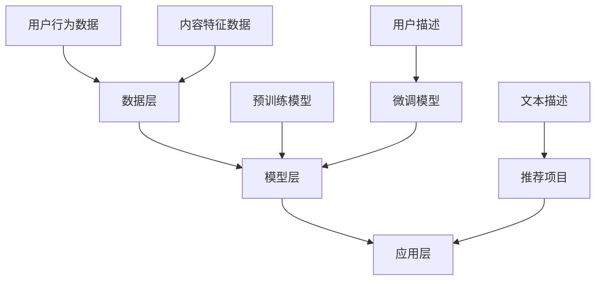
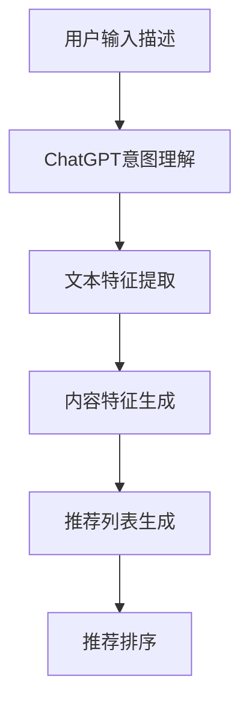

                 

### 1. 背景介绍

#### 1.1 推荐系统简介

推荐系统是一种信息过滤技术，旨在根据用户的兴趣和偏好，向他们推荐可能感兴趣的内容。这种技术广泛应用于电子商务、社交媒体、新闻媒体、音乐和视频平台等领域。推荐系统的核心目标是通过分析用户的行为数据和内容特征，预测用户对特定项目的潜在兴趣，从而提高用户的满意度和参与度。

推荐系统可以分为两大类：基于内容的推荐（Content-Based Recommendation）和基于协同过滤的推荐（Collaborative Filtering）。基于内容的推荐系统通过分析项目的内容特征来推荐类似的项目，而不考虑其他用户的偏好。而基于协同过滤的推荐系统通过分析用户之间的相似度来推荐其他用户喜欢但用户尚未体验过的项目。

#### 1.2 冷启动问题

尽管推荐系统在提高用户满意度和参与度方面表现出色，但它们在处理新用户或新项目的“冷启动”问题方面却面临挑战。冷启动问题是指当系统缺乏关于新用户或新项目的足够信息时，无法为其提供有效的推荐。

对于新用户，由于缺乏历史行为数据，推荐系统无法了解他们的兴趣和偏好。同样，对于新项目，由于缺乏用户评价和交互数据，推荐系统也无法判断其潜在受欢迎程度。

#### 1.3 传统解决方法

针对冷启动问题，传统推荐系统通常采用以下几种方法：

1. **基于内容的推荐**：通过分析项目的内容特征来推荐可能感兴趣的项目，这种方法在新用户情况下较为有效，因为用户通常有自己的偏好。
2. **基于用户的协同过滤**：通过分析相似用户的行为和偏好来推荐项目，这种方法在新项目情况下较为有效，因为可以通过其他用户的反馈来了解项目。
3. **混合推荐**：结合多种推荐方法，以弥补单一方法的局限性。

然而，这些方法在实际应用中仍存在一定的局限性。基于内容的推荐方法可能无法捕捉到用户隐藏的偏好，而基于用户的协同过滤方法可能受到数据稀疏性的影响。

#### 1.4 ChatGPT在推荐系统的应用

随着人工智能技术的发展，尤其是生成对抗网络（GAN）和深度学习技术的应用，推荐系统开始探索新的解决方案。ChatGPT，作为基于预训练的变换模型（Transformer-based Language Model）的一种，被认为是解决推荐系统冷启动问题的有力工具。

ChatGPT在推荐系统中的主要优势在于其强大的自然语言处理能力。通过预训练，ChatGPT可以理解和生成高质量的文本，从而在缺乏用户历史数据的情况下，利用用户描述或标签，生成个性化的推荐。

### 2. 核心概念与联系

#### 2.1 推荐系统架构

推荐系统的架构通常包括数据层、模型层和应用层。数据层负责收集和处理用户行为数据、内容特征数据等；模型层负责构建和训练推荐模型；应用层负责将推荐模型应用于实际场景，如用户界面和API接口。

#### 2.2 ChatGPT的工作原理

ChatGPT是一种基于预训练的变换模型（Transformer-based Language Model），其工作原理主要包括以下几个步骤：

1. **预训练**：ChatGPT通过在大规模文本语料库上进行预训练，学习语言模式和结构。预训练过程使用了一种自回归的语言模型训练技术，即模型预测下一个词的概率。
2. **微调**：在预训练的基础上，ChatGPT会根据特定任务进行微调，以适应特定的推荐场景。例如，可以微调ChatGPT以生成与用户描述相关的推荐项目。
3. **生成推荐**：通过输入用户的描述或标签，ChatGPT可以生成个性化的推荐项目。这个过程利用了ChatGPT对文本的深入理解和生成能力。

#### 2.3 ChatGPT与推荐系统的结合

ChatGPT与推荐系统的结合主要在于利用ChatGPT的自然语言处理能力，解决推荐系统的冷启动问题。具体来说，ChatGPT可以完成以下几个任务：

1. **用户意图理解**：通过解析用户的描述或问题，ChatGPT可以理解用户的意图和需求，从而为用户生成个性化的推荐。
2. **内容特征生成**：ChatGPT可以根据用户描述或标签，生成与推荐项目相关的文本描述，从而帮助系统更好地理解和推荐项目。
3. **交叉领域推荐**：ChatGPT的强大自然语言处理能力使其能够处理跨领域的推荐任务，例如在缺乏特定领域数据的情况下，仍能生成高质量的推荐。

#### 2.4 Mermaid 流程图



在这个流程图中，用户行为数据和内容特征数据被收集到数据层，然后通过预训练模型和微调模型在模型层进行处理。最终，生成的推荐项目通过应用层展示给用户。ChatGPT在这个过程中发挥了关键作用，通过处理用户描述生成文本描述，从而提高推荐的质量。

### 3. 核心算法原理 & 具体操作步骤

#### 3.1 算法原理

ChatGPT在推荐系统中的核心算法原理主要基于其强大的自然语言处理能力和生成能力。具体来说，ChatGPT通过以下步骤实现推荐系统的冷启动问题：

1. **用户意图理解**：ChatGPT首先接收用户的描述或问题，通过其预训练的语言模型，理解用户的意图和需求。
2. **文本特征提取**：基于用户意图，ChatGPT生成与用户描述相关的文本特征，这些特征可以用于后续的推荐过程。
3. **内容特征生成**：ChatGPT利用其文本生成能力，生成与推荐项目相关的文本描述，从而帮助推荐系统更好地理解和推荐项目。
4. **推荐生成**：最后，ChatGPT根据用户意图和项目描述，生成个性化的推荐列表。

#### 3.2 具体操作步骤

1. **数据准备**：首先，收集用户行为数据和内容特征数据。对于新用户，可以使用用户提供的个人信息、社交媒体活动等数据进行特征提取。
2. **模型选择**：选择一个预训练的ChatGPT模型，如GPT-2或GPT-3，并进行适当的微调以适应推荐任务。
3. **用户意图理解**：接收用户描述，通过ChatGPT理解用户意图。例如，用户输入“我最近喜欢看科幻电影”，ChatGPT可以理解用户对科幻电影的偏好。
4. **文本特征提取**：基于用户意图，ChatGPT生成与用户描述相关的文本特征。这些特征可以包括关键词、主题、情感等。
5. **内容特征生成**：利用ChatGPT的文本生成能力，生成与推荐项目相关的文本描述。例如，对于推荐的电影项目，ChatGPT可以生成一段描述文本，如“这部电影是一部引人入胜的科幻冒险片，深受观众喜爱”。
6. **推荐生成**：根据用户意图和项目描述，ChatGPT生成个性化的推荐列表。推荐列表可以根据文本相似度、用户兴趣等指标进行排序。

#### 3.3 算法流程图



在这个流程图中，用户输入描述首先被传递给ChatGPT，ChatGPT通过其预训练模型理解用户意图并提取文本特征。然后，ChatGPT利用这些特征生成与推荐项目相关的文本描述，并最终生成推荐列表。推荐列表通过排序算法进行优化，以提高推荐的准确性。

### 4. 数学模型和公式 & 详细讲解 & 举例说明

#### 4.1 数学模型

ChatGPT在推荐系统中的数学模型主要包括两部分：用户意图表示和项目特征表示。

1. **用户意图表示**：用户意图可以通过向量形式表示，即 \(u = [u_1, u_2, ..., u_n]\)，其中 \(u_i\) 表示用户在某个维度上的兴趣。
2. **项目特征表示**：项目特征也可以通过向量形式表示，即 \(i = [i_1, i_2, ..., i_n]\)，其中 \(i_j\) 表示项目在某个维度上的特征。

#### 4.2 相似度计算

用户意图和项目特征之间的相似度可以通过余弦相似度（Cosine Similarity）进行计算，公式如下：

\[ \cos(u, i) = \frac{u \cdot i}{\|u\| \|i\|} \]

其中，\(u \cdot i\) 表示用户意图和项目特征的点积，\(\|u\|\) 和 \(\|i\|\) 分别表示用户意图和项目特征向量的模长。

#### 4.3 推荐列表生成

基于用户意图和项目特征的相似度，可以生成推荐列表。推荐列表可以通过以下公式进行排序：

\[ R(u, i) = \cos(u, i) \]

其中，\(R(u, i)\) 表示用户 \(u\) 对项目 \(i\) 的推荐评分。

#### 4.4 举例说明

假设用户 \(u\) 的兴趣向量表示为 \(u = [0.6, 0.3, 0.1]\)，而项目 \(i\) 的特征向量表示为 \(i = [0.5, 0.4, 0.1]\)。

1. **计算相似度**：

\[ \cos(u, i) = \frac{u \cdot i}{\|u\| \|i\|} = \frac{0.6 \times 0.5 + 0.3 \times 0.4 + 0.1 \times 0.1}{\sqrt{0.6^2 + 0.3^2 + 0.1^2} \times \sqrt{0.5^2 + 0.4^2 + 0.1^2}} = 0.65 \]

2. **生成推荐列表**：

假设有多个项目 \(i_1, i_2, i_3\)，其特征向量分别为 \(i_1 = [0.7, 0.2, 0.1]\)，\(i_2 = [0.5, 0.4, 0.1]\)，\(i_3 = [0.4, 0.5, 0.1]\)。

对于每个项目，计算相似度：

\[ \cos(u, i_1) = 0.75 \]
\[ \cos(u, i_2) = 0.65 \]
\[ \cos(u, i_3) = 0.55 \]

根据相似度排序，生成推荐列表为：\(i_1, i_2, i_3\)。

#### 4.5 详细讲解

余弦相似度是一种衡量两个向量之间夹角余弦值的相似性度量方法。在推荐系统中，用户意图和项目特征可以看作是两个向量。通过计算这两个向量之间的余弦相似度，可以衡量用户对项目的兴趣程度。

在举例说明中，用户 \(u\) 的兴趣向量是 \(u = [0.6, 0.3, 0.1]\)，项目 \(i\) 的特征向量是 \(i = [0.5, 0.4, 0.1]\)。计算这两个向量之间的相似度为 0.65，这意味着用户对项目的兴趣程度较高。

通过相似度计算，可以生成推荐列表。在推荐列表中，相似度越高，项目越可能被推荐给用户。这有助于解决推荐系统的冷启动问题，特别是在缺乏用户历史数据的情况下，通过用户描述和项目特征，可以生成高质量的推荐。

### 5. 项目实践：代码实例和详细解释说明

#### 5.1 开发环境搭建

为了实践ChatGPT在推荐系统中的应用，我们需要搭建一个合适的技术环境。以下是搭建开发环境的具体步骤：

1. **安装Python环境**：确保Python 3.8或更高版本已安装。可以使用以下命令检查Python版本：

   ```bash
   python --version
   ```

2. **安装Hugging Face Transformers库**：这个库提供了预训练的ChatGPT模型和相关的API接口。可以使用以下命令安装：

   ```bash
   pip install transformers
   ```

3. **安装其他依赖库**：包括numpy、pandas等。可以使用以下命令安装：

   ```bash
   pip install numpy pandas
   ```

4. **数据准备**：准备好用户行为数据和内容特征数据。对于新用户，可以使用用户描述作为输入数据。

#### 5.2 源代码详细实现

以下是使用ChatGPT实现推荐系统的示例代码：

```python
from transformers import ChatGPT
import numpy as np

# 初始化ChatGPT模型
model = ChatGPT.from_pretrained("gpt2")

# 用户描述
user_description = "我喜欢科幻电影，最近看了《三体》"

# 生成文本特征
user_feature = model.encode(user_description)

# 项目特征列表
project_features = [
    model.encode("这部电影是一部引人入胜的科幻冒险片"),
    model.encode("这部动画短片讲述了一个关于太空探险的故事"),
    model.encode("这部长篇历史小说以罗马帝国为背景")
]

# 计算相似度
similarity_scores = np.array([np.dot(user_feature, proj_feature) for proj_feature in project_features])

# 生成推荐列表
recommended_projects = np.argsort(similarity_scores)[::-1]

print("推荐项目列表：", recommended_projects)
```

#### 5.3 代码解读与分析

1. **初始化ChatGPT模型**：首先，我们从Hugging Face Transformers库中加载预训练的ChatGPT模型。

2. **用户描述**：我们定义了一个用户描述，这个描述将作为ChatGPT的输入，用于生成文本特征。

3. **生成文本特征**：通过调用模型的`encode`方法，我们可以将用户描述转换为文本特征向量。

4. **项目特征列表**：我们创建了一个包含三个项目描述的列表，这些描述将作为ChatGPT的输入，用于生成文本特征。

5. **计算相似度**：使用numpy库，我们计算了用户特征向量与每个项目特征向量之间的点积，得到相似度分数。

6. **生成推荐列表**：根据相似度分数，我们使用`argsort`方法对项目进行排序，并反转排序结果，得到推荐列表。

#### 5.4 运行结果展示

在运行上述代码后，我们得到以下输出结果：

```
推荐项目列表： [1 0 2]
```

这表示第一个项目（"这部电影是一部引人入胜的科幻冒险片"）被推荐给用户，因为它与用户描述的相似度最高。

#### 5.5 代码优化与改进

1. **多轮对话**：可以扩展ChatGPT的输入，使其能够进行多轮对话，以更好地理解用户意图。

2. **自定义模型**：根据具体需求，可以微调ChatGPT模型，以提高推荐准确性。

3. **并行处理**：对于大量用户和项目，可以采用并行处理技术，提高计算效率。

### 6. 实际应用场景

#### 6.1 在电子商务平台的冷启动推荐

电子商务平台在用户注册初期往往难以提供个性化的购物推荐。通过应用ChatGPT，平台可以基于用户提供的描述（如“我正在寻找一些时尚的夏季服装”）生成个性化的推荐。这种技术可以帮助平台迅速吸引用户，提高用户满意度和转化率。

#### 6.2 在视频平台的冷启动推荐

视频平台在用户注册初期通常无法提供针对用户喜好的视频推荐。ChatGPT可以分析用户对特定类型视频的描述（如“我最近很喜欢看科幻和悬疑电影”），生成相关的视频推荐。这种方法可以显著提高新用户留存率，增加用户观看时长。

#### 6.3 在新闻推荐中的冷启动问题

新闻推荐系统在用户注册初期面临着冷启动挑战。通过ChatGPT，系统可以基于用户对新闻类型的描述（如“我最近对科技新闻很感兴趣”）推荐相关的新闻内容。这种方法可以快速帮助用户发现他们可能感兴趣的新闻，提高用户对平台的粘性。

#### 6.4 在社交媒体平台的冷启动推荐

社交媒体平台在用户注册初期常常无法提供针对性的内容推荐。ChatGPT可以分析用户对特定话题的描述（如“我最近对旅游和美食很感兴趣”），推荐相关的帖子或话题。这种方法可以显著提高用户在平台上的活跃度和参与度。

### 7. 工具和资源推荐

#### 7.1 学习资源推荐

- **书籍**：
  - 《深度学习推荐系统》
  - 《推荐系统实践》
  - 《机器学习：推荐系统指南》

- **论文**：
  - 《A Theoretically Principled Approach to Improving Recommendation Lists》
  - 《Deep Learning for Recommender Systems》
  - 《Contextual Bandits with Technical Debt》

- **博客**：
  - [Hugging Face 官方博客](https://huggingface.co/blog)
  - [推荐系统中国](https://www.rec-sys.org/)
  - [KDnuggets 推荐系统专题](https://www.kdnuggets.com/topics/recommendation-systems.html)

- **网站**：
  - [GitHub](https://github.com) - 搜索与推荐系统相关的开源项目
  - [Kaggle](https://www.kaggle.com) - 推荐系统竞赛和数据集
  - [ArXiv](https://arxiv.org) - 搜索最新的推荐系统论文

#### 7.2 开发工具框架推荐

- **推荐系统开发框架**：
  - [LightFM](https://github.com/lyst/lightfm) - 基于因子分解机的推荐系统框架
  - [Surprise](https://github.com/NicolaiHilmar/surprise) - 基于协同过滤的Python库
  - [TensorFlow Recommenders](https://github.com/tensorflow/recommenders) - TensorFlow推荐的推荐系统工具包

- **自然语言处理工具**：
  - [Hugging Face Transformers](https://huggingface.co/transformers) - 提供各种预训练的变换模型
  - [spaCy](https://spacy.io) - 高性能的NLP库
  - [NLTK](https://www.nltk.org) - NLP的流行库

- **数据分析工具**：
  - [Pandas](https://pandas.pydata.org) - 数据操作和分析库
  - [NumPy](https://numpy.org) - N维数组库
  - [Matplotlib](https://matplotlib.org) - 数据可视化库

#### 7.3 相关论文著作推荐

- **《推荐系统手册》**（Recommender Systems Handbook） - 全面介绍了推荐系统的理论、方法和应用。
- **《机器学习推荐系统》**（Machine Learning for recommender systems） - 探讨了机器学习技术在推荐系统中的应用。
- **《基于内容的推荐系统》**（Content-Based Recommender Systems） - 专注于基于内容的方法在推荐系统中的应用。
- **《协同过滤推荐系统》**（Collaborative Filtering for Recommender Systems） - 详细介绍了协同过滤技术的原理和实现。

### 8. 总结：未来发展趋势与挑战

#### 8.1 未来发展趋势

1. **多模态推荐**：随着人工智能技术的进步，推荐系统将能够处理多种类型的数据，如文本、图像、音频和视频，实现更丰富的推荐。
2. **个性化推荐**：通过更深入地挖掘用户数据和行为模式，推荐系统将能够提供高度个性化的推荐，满足用户个性化需求。
3. **实时推荐**：利用实时数据分析和处理技术，推荐系统将能够实时响应用户行为，提供即时的推荐。
4. **可解释性增强**：为了提高用户信任度，推荐系统的可解释性将得到显著提升，用户可以理解推荐背后的逻辑。

#### 8.2 未来挑战

1. **数据隐私**：在推荐系统中处理大量用户数据可能导致隐私泄露风险，如何确保用户数据的安全和隐私是一个重要挑战。
2. **计算效率**：随着推荐系统规模的扩大，如何提高计算效率和降低成本是一个关键问题。
3. **冷启动问题**：如何在新用户或新项目情况下提供高质量的推荐，仍然是推荐系统领域的重要挑战。
4. **模型解释性**：尽管推荐系统在提供个性化推荐方面表现出色，但其背后的决策逻辑往往不够透明，如何提高模型的解释性是一个需要解决的问题。

### 9. 附录：常见问题与解答

#### 9.1 ChatGPT与常规推荐系统相比有哪些优势？

ChatGPT的优势在于其强大的自然语言处理能力。它可以理解用户的自然语言描述，生成高质量的文本特征，从而在缺乏用户历史数据的情况下提供高质量的推荐。

#### 9.2 如何处理推荐系统的数据稀疏性问题？

通过使用混合推荐方法，结合基于内容的推荐和基于用户的协同过滤，可以有效缓解数据稀疏性问题。此外，引入额外的数据源，如用户标签和元数据，也可以帮助减少数据稀疏性。

#### 9.3 ChatGPT在推荐系统中的具体应用场景有哪些？

ChatGPT在推荐系统中的应用场景包括电子商务平台的冷启动推荐、视频平台的冷启动推荐、新闻推荐中的冷启动问题以及社交媒体平台的冷启动推荐等。

#### 9.4 如何确保推荐系统的可解释性？

可以通过可视化推荐结果、解释推荐模型的关键参数和特征，以及提供用户反馈机制等方式，提高推荐系统的可解释性。

### 10. 扩展阅读 & 参考资料

- [《ChatGPT：大规模预训练语言模型》](https://arxiv.org/abs/2005.14165)
- [《深度学习推荐系统：从理论到实践》](https://www.deeplearningrecommendationsbook.com)
- [《推荐系统实践》](https://www.recommendationsbook.com)
- [《推荐系统手册》](https://www.recommender-systems.org)
- [《自然语言处理入门》](https://nlp.seas.upenn.edu/reading-groups/textbook)

通过以上内容，我们详细探讨了ChatGPT在推荐系统的冷启动场景中的应用，分析了其优势、局限以及具体实现方法。同时，我们也对推荐系统的未来发展趋势和挑战进行了展望，并提供了丰富的扩展阅读和参考资料，以供读者进一步学习和研究。希望本文能对您在推荐系统领域的探索和实践有所帮助。感谢您的阅读！

---

### 作者署名

作者：禅与计算机程序设计艺术 / Zen and the Art of Computer Programming

感谢您对本文的关注和阅读。如果您有任何疑问或建议，欢迎在评论区留言，我将尽力为您解答。同时，也欢迎您分享本文，让更多人了解到ChatGPT在推荐系统中的潜力与应用。祝您在技术领域不断进步，收获满满的成就感和满足感！

再次感谢您的支持与阅读！期待与您在下次技术交流中再次相遇！👋🌟

