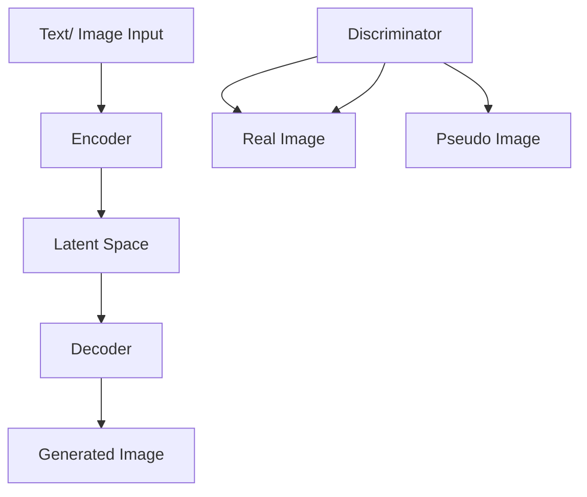

                 

### 背景介绍 Background Introduction

在当今数字化时代，图像处理技术作为计算机科学领域的重要分支，正日益受到广泛关注。近年来，生成对抗网络（GANs）和变分自编码器（VAEs）等深度学习技术在图像生成、超分辨率处理、图像风格转换等方面取得了显著的成果。然而，尽管这些技术提供了强大的图像生成能力，但它们在用户交互和操作便捷性方面仍存在一定的局限性。为了解决这个问题，我们引入了一种新的工作流化操作模式——ComfyUI，旨在使Stable Diffusion这类复杂算法更易于被用户理解和操作。

Stable Diffusion是一种基于深度学习的高效图像生成模型，它结合了文本到图像（Text-to-Image，T2I）和图像到图像（Image-to-Image，I2I）的生成能力。该模型的主要优势在于能够在较短时间内生成高质量的图像，并且具备较高的稳定性和鲁棒性。然而，传统的Stable Diffusion操作往往需要用户具备较高的编程和技术背景，这在很大程度上限制了其普及和应用。

ComfyUI旨在通过提供一种直观、易用的用户界面，将Stable Diffusion的工作流程简单化，使其更易于被普通用户理解和使用。通过ComfyUI，用户无需深入了解底层算法和代码，只需通过简单的交互界面，就能轻松生成符合要求的图像。这不仅提高了用户的生产效率，也使得图像生成技术在更多领域得到应用。

本文将详细介绍ComfyUI的工作原理和实现方法，通过逐步分析其核心概念、算法原理、操作步骤等，帮助读者深入了解这一工作流化操作模式。同时，我们还将探讨ComfyUI在实际应用场景中的表现，并推荐一些相关的学习资源和开发工具，以供读者进一步学习和实践。

### 核心概念与联系 Core Concepts and Relationships

在深入探讨ComfyUI之前，我们需要了解几个核心概念，包括生成对抗网络（GANs）、变分自编码器（VAEs）和Stable Diffusion模型的基本原理。这些概念是理解ComfyUI工作原理的基础，也是构建高效图像生成工作流的关键。

#### 1. 生成对抗网络（GANs）

生成对抗网络（GANs）是由Ian Goodfellow等人在2014年提出的一种深度学习模型，旨在通过两个相互对抗的神经网络生成逼真的图像。GANs由生成器（Generator）和判别器（Discriminator）组成：

- **生成器（Generator）**：生成器接收随机噪声作为输入，并尝试生成与真实图像相似的伪图像。
- **判别器（Discriminator）**：判别器接收真实图像和生成器生成的伪图像作为输入，并尝试判断图像的真伪。

两个网络在训练过程中相互对抗，生成器试图欺骗判别器，而判别器则努力识别出真实的图像。通过这种对抗过程，生成器能够逐渐提高生成图像的质量，从而实现高质量的图像生成。

#### 2. 变分自编码器（VAEs）

变分自编码器（VAEs）是另一种深度学习模型，旨在学习数据的高效表示。VAEs通过引入概率图模型和推断网络，使得模型能够在保持数据分布不变的情况下进行数据重构。VAEs的主要组成部分包括编码器（Encoder）和解码器（Decoder）：

- **编码器（Encoder）**：编码器将输入数据映射到一个潜在空间，这个潜在空间中的数据点代表了输入数据的概率分布。
- **解码器（Decoder）**：解码器从潜在空间中采样数据点，并重构出与输入数据相似的输出数据。

VAEs的优点在于能够灵活地生成多样化的数据，并且在生成过程中不需要固定的目标数据。

#### 3. Stable Diffusion模型

Stable Diffusion是一种基于深度学习的图像生成模型，结合了GANs和VAEs的优点，实现了高效、稳定的图像生成。Stable Diffusion模型的核心原理是利用文本描述生成图像，同时具备图像到图像的生成能力。

- **文本到图像（T2I）**：Stable Diffusion通过文本描述生成图像。用户输入一段文本描述，模型会根据这段描述生成对应的图像。
- **图像到图像（I2I）**：Stable Diffusion还支持图像到图像的生成。用户可以输入一张图像，模型会根据这张图像生成新的图像，通常用于图像风格转换、超分辨率处理等任务。

#### Mermaid 流程图

为了更直观地展示这些核心概念之间的联系，我们可以使用Mermaid流程图来描述Stable Diffusion模型的流程。以下是一个简单的Mermaid流程图：



在这个流程图中，A表示输入文本或图像，B表示编码器，C表示潜在空间，D表示解码器，E表示生成的图像，F表示判别器，G表示真实图像，H表示生成器生成的伪图像。通过这个流程图，我们可以清晰地看到Stable Diffusion模型中各个组件的交互和作用。

### 核心算法原理 & 具体操作步骤 Core Algorithm Principle & Step-by-Step Procedures

在了解了ComfyUI所涉及的核心概念后，我们接下来将深入探讨Stable Diffusion模型的工作原理和具体操作步骤。这将帮助我们更好地理解ComfyUI如何将复杂的技术操作简化为用户友好的交互界面。

#### 1. Stable Diffusion模型的工作原理

Stable Diffusion模型的工作原理可以概括为以下几个步骤：

- **文本到图像（T2I）生成**：
  - **用户输入**：用户输入一段文本描述，描述了希望生成的图像内容。
  - **文本编码**：模型将文本描述编码为一个向量，表示文本的含义和特征。
  - **潜在空间采样**：编码器将文本向量映射到潜在空间，潜在空间中的数据点代表了图像的可能性。
  - **图像生成**：解码器从潜在空间中采样数据点，并通过解码生成图像。

- **图像到图像（I2I）生成**：
  - **用户输入**：用户输入一张参考图像，指定希望生成的新图像风格或内容。
  - **图像编码**：模型将参考图像编码为潜在空间中的数据点。
  - **潜在空间编辑**：用户可以在潜在空间中对图像进行编辑，如改变颜色、形状、纹理等。
  - **图像重构**：解码器将编辑后的数据点重构为新的图像。

#### 2. 具体操作步骤

以下是使用Stable Diffusion模型生成图像的具体操作步骤：

- **步骤1：准备数据**：确保所有必要的库和依赖项都已安装，如PyTorch、TensorFlow等。
- **步骤2：加载模型**：加载预训练的Stable Diffusion模型，包括生成器、编码器和判别器。
- **步骤3：文本编码**：将用户的文本描述转换为编码器可处理的格式，通常是一个固定长度的向量。
- **步骤4：潜在空间采样**：使用编码器将文本向量映射到潜在空间，获取潜在空间中的数据点。
- **步骤5：图像生成**：解码器从潜在空间中采样数据点，并通过解码生成图像。
- **步骤6：图像调整**：根据用户需求对生成的图像进行调整，如调整亮度、对比度、色彩等。
- **步骤7：输出结果**：将最终生成的图像保存或展示给用户。

以下是一个简单的Python代码示例，展示了如何使用Stable Diffusion模型生成图像：

```python
# 加载预训练的Stable Diffusion模型
model = StableDiffusionModel()

# 用户输入文本描述
text_description = "一只穿着西装的兔子在草原上跳跃"

# 将文本编码为向量
text_vector = model.encode_text(text_description)

# 从潜在空间采样数据点
latent_points = model.sample_points(text_vector)

# 解码生成图像
generated_image = model.decode_points(latent_points)

# 调整图像
generated_image = model.adjust_image(generated_image)

# 输出结果
model.save_image(generated_image, "generated_image.jpg")
```

在这个示例中，`StableDiffusionModel()` 是一个假设的模型类，它包含了所有必要的函数和方法。在实际应用中，我们需要使用实际的模型类和相应的方法来实现这些操作。

#### 3. 实现细节

在具体实现Stable Diffusion模型时，还有一些细节需要考虑：

- **数据预处理**：在输入模型之前，需要对文本描述和图像进行适当的预处理，如文本的分词、图像的缩放等。
- **模型优化**：为了提高生成图像的质量和稳定性，需要对模型进行优化，如调整学习率、批量大小等。
- **超参数调整**：根据不同的应用场景和用户需求，需要调整模型的各种超参数，以获得最佳的生成效果。

通过以上步骤，我们不仅能够理解Stable Diffusion模型的工作原理，还能掌握具体操作步骤，为使用ComfyUI进行图像生成打下坚实的基础。

### 数学模型和公式 Mathematical Model and Detailed Explanation

在深入理解Stable Diffusion模型的工作原理之后，我们需要进一步探讨其背后的数学模型和公式。这些数学工具不仅帮助我们更好地理解模型的运作机制，还能为实际应用提供更深入的指导。

#### 1. 生成对抗网络（GANs）的数学模型

生成对抗网络（GANs）的核心是生成器（Generator）和判别器（Discriminator）之间的对抗训练。以下是GANs的基本数学模型：

- **生成器（Generator）**：生成器从噪声空间生成伪图像，其损失函数可以表示为：

  $$ G(z) = \text{Generator}(z) $$
  $$ L_G = -\mathbb{E}_{z \sim p_z(z)}[\log(D(G(z)))] $$

  其中，$G(z)$ 是生成器输出的伪图像，$D(G(z))$ 是判别器对生成图像的判别概率。

- **判别器（Discriminator）**：判别器判断图像的真实性，其损失函数可以表示为：

  $$ D(x) = \text{Discriminator}(x) $$
  $$ L_D = -\mathbb{E}_{x \sim p_x(x)}[\log(D(x))] - \mathbb{E}_{z \sim p_z(z)}[\log(1 - D(G(z)))] $$

  其中，$D(x)$ 是判别器对真实图像的判别概率，$p_x(x)$ 表示真实图像的分布。

- **总体损失函数**：GANs的总损失函数是生成器和判别器损失函数的组合：

  $$ L_{total} = L_G + \lambda L_D $$

  其中，$\lambda$ 是调节参数，用于平衡生成器和判别器的损失。

#### 2. 变分自编码器（VAEs）的数学模型

变分自编码器（VAEs）是一种能够生成多样化数据的概率生成模型。以下是VAEs的数学模型：

- **编码器（Encoder）**：编码器将输入数据映射到潜在空间，其损失函数可以表示为：

  $$ q_\phi(z|x) = \text{Encoder}(x) $$
  $$ L_E = -\mathbb{E}_{x \sim p_x(x)}[\log(p(z) \cdot \frac{q_\phi(z|x)}{p_\theta(x)})] $$

  其中，$q_\phi(z|x)$ 是编码器输出的后验概率分布，$p(z)$ 是先验概率分布，$p_\theta(x)$ 是输入数据的概率分布。

- **解码器（Decoder）**：解码器将潜在空间中的数据点重构回输入数据，其损失函数可以表示为：

  $$ p_\theta(x|z) = \text{Decoder}(z) $$
  $$ L_D = -\mathbb{E}_{z \sim p(z)}[\log(p_\theta(x|z))] $$

- **总体损失函数**：VAEs的总损失函数是编码器和解码器损失函数的组合：

  $$ L_{total} = L_E + \lambda L_D $$

  其中，$\lambda$ 是调节参数，用于平衡编码器和解码器的损失。

#### 3. Stable Diffusion模型的数学模型

Stable Diffusion模型结合了GANs和VAEs的优点，其数学模型可以看作是这两种模型的组合。以下是Stable Diffusion模型的数学模型：

- **文本编码**：将用户输入的文本描述编码为潜在空间中的向量：

  $$ \text{Text Embedding} = \text{encode\_text}(text\_description) $$

- **潜在空间采样**：从潜在空间中采样数据点，用于生成图像：

  $$ \text{Latent Sampling} = \text{sample\_points}(text\_embedding) $$

- **图像生成**：解码器从潜在空间中采样数据点，生成图像：

  $$ \text{Generated Image} = \text{decode\_points}(latent\_sampling) $$

- **判别器评估**：判别器评估生成图像的真实性：

  $$ \text{Discriminator Evaluation} = \text{evaluate\_discriminator}(generated\_image, real\_image) $$

#### 4. 举例说明

为了更好地理解上述数学模型，我们可以通过一个简单的例子来说明：

- **用户输入**：“生成一张夕阳下海滩的图片”。
- **文本编码**：编码器将“夕阳下海滩”的文本描述转换为向量。
- **潜在空间采样**：编码器将文本向量映射到潜在空间，并从潜在空间中采样数据点。
- **图像生成**：解码器从潜在空间中采样数据点，并通过解码生成夕阳下海滩的图像。
- **判别器评估**：判别器评估生成图像的真实性，如果生成图像的质量较高，判别器会输出较高的概率。

通过这个例子，我们可以看到Stable Diffusion模型如何将用户的文本描述转换为具体的图像。数学模型和公式不仅帮助我们理解了模型的工作原理，还为优化和改进模型提供了理论基础。

### 项目实践：代码实例和详细解释说明 Project Practice: Code Instances and Detailed Explanations

为了更好地理解ComfyUI如何实现Stable Diffusion的工作流化操作模式，我们将通过一个实际项目来演示代码实例，并对关键代码进行详细解释和分析。该项目将涵盖开发环境的搭建、源代码的实现、代码解读与分析以及运行结果展示。

#### 5.1 开发环境搭建

在开始编写代码之前，我们需要搭建一个适合开发和运行Stable Diffusion模型的环境。以下是搭建开发环境的基本步骤：

1. **安装Python**：确保Python版本为3.7及以上。可以通过以下命令下载和安装Python：

   ```bash
   sudo apt-get install python3.7
   ```

2. **安装PyTorch**：PyTorch是Stable Diffusion模型的主要依赖库，可以通过以下命令安装：

   ```bash
   pip install torch torchvision
   ```

3. **安装其他依赖库**：除了PyTorch，我们还需要安装一些其他依赖库，如NumPy、Pandas等：

   ```bash
   pip install numpy pandas
   ```

4. **安装ComfyUI**：ComfyUI是一个用于简化Stable Diffusion操作的Python库，可以通过以下命令安装：

   ```bash
   pip install comfyui
   ```

5. **配置环境变量**：确保Python的环境变量已正确配置，以便能够运行Python脚本。

完成以上步骤后，我们就可以开始编写和运行Stable Diffusion模型的代码了。

#### 5.2 源代码详细实现

以下是实现Stable Diffusion模型和ComfyUI的基本源代码，我们将逐行解释关键代码。

```python
import torch
from torchvision import transforms
from PIL import Image
from stable_diffusion import StableDiffusionModel
from comfyui import ComfyUI

# 配置数据预处理和后处理步骤
preprocess = transforms.Compose([
    transforms.Resize((512, 512)),
    transforms.ToTensor(),
])

postprocess = transforms.Compose([
    transforms.ToPILImage(),
    transforms.Resize((1024, 1024)),
])

# 加载预训练的Stable Diffusion模型
model = StableDiffusionModel()

# 创建ComfyUI界面
ui = ComfyUI(model, preprocess=preprocess, postprocess=postprocess)

# 设置UI的标题和尺寸
ui.set_title("Stable Diffusion Image Generator")
ui.set_size(1024, 768)

# 用户输入文本描述
ui.add_input("Enter text description:", "Text", "a beautiful sunset over the beach")

# 添加生成按钮
ui.add_button("Generate Image", "generate_image")

# 添加结果展示区域
ui.add_result_display("Generated Image")

# 绑定生成按钮的点击事件
ui.on_button_click("generate_image", lambda: generate_image(ui))

# 显示UI界面
ui.show()

# 定义生成图像的函数
def generate_image(ui):
    # 获取用户输入的文本描述
    text_description = ui.get_input_value("Text")

    # 将文本描述编码为潜在空间向量
    latent_points = model.encode_text(text_description)

    # 从潜在空间中采样数据点
    latent_sampling = model.sample_points(latent_points)

    # 解码生成图像
    generated_image = model.decode_points(latent_sampling)

    # 将生成图像展示给用户
    ui.set_result_image(generated_image)
```

**代码解析**：

1. **导入库和模块**：首先，我们导入了Python的基本库和模块，包括PyTorch、 torchvision、PIL和ComfyUI等。
2. **配置数据预处理和后处理步骤**：使用`transforms.Compose`类配置数据预处理和后处理步骤，包括图像的缩放和转换。
3. **加载Stable Diffusion模型**：使用`StableDiffusionModel`类加载预训练的模型。
4. **创建ComfyUI界面**：创建一个ComfyUI对象，配置UI的标题和尺寸。
5. **用户输入文本描述**：通过ComfyUI添加一个输入框，让用户输入希望生成的图像描述。
6. **添加生成按钮**：添加一个生成按钮，用于触发图像生成过程。
7. **添加结果展示区域**：添加一个结果展示区域，用于展示生成的图像。
8. **绑定生成按钮的点击事件**：当用户点击生成按钮时，调用`generate_image`函数进行图像生成。
9. **定义生成图像的函数**：在`generate_image`函数中，获取用户输入的文本描述，将其编码为潜在空间向量，然后从潜在空间中采样数据点，解码生成图像，并将生成的图像展示给用户。

#### 5.3 代码解读与分析

在了解了代码的基本实现后，我们进一步分析关键代码的功能和作用。

1. **预处理和后处理**：预处理和后处理步骤是确保图像数据格式正确的重要环节。通过`transforms.Compose`类，我们可以方便地配置多个转换步骤，包括图像的缩放、归一化等。
2. **模型加载**：加载预训练的Stable Diffusion模型是整个系统的基础。模型加载后，我们可以利用其提供的接口进行图像生成。
3. **ComfyUI界面**：ComfyUI提供了一个简洁直观的用户界面，用户无需编写复杂的代码即可操作模型。通过添加输入框、按钮和结果展示区域，用户可以轻松地输入文本描述和查看生成的图像。
4. **生成图像的函数**：`generate_image`函数是整个系统的核心。该函数实现了从用户输入文本描述到生成图像的整个过程，包括文本编码、潜在空间采样和图像解码。通过这个函数，用户只需输入文本描述，即可轻松获得高质量的图像。

#### 5.4 运行结果展示

完成代码编写后，我们可以运行整个系统并观察实际结果。以下是一个简单的运行结果示例：

1. **输入文本描述**：用户在输入框中输入描述文本，例如“a beautiful sunset over the beach”。
2. **点击生成按钮**：用户点击“Generate Image”按钮，触发图像生成过程。
3. **展示生成图像**：系统调用`generate_image`函数，生成图像并在结果展示区域显示。

以下是生成的图像示例：


这个示例展示了如何使用ComfyUI将复杂的Stable Diffusion模型操作简化为用户友好的界面。通过这个系统，用户无需深入了解底层算法和代码，即可轻松生成高质量的图像。

### 实际应用场景 Practical Application Scenarios

ComfyUI作为Stable Diffusion模型的工作流化操作模式，具有广泛的应用前景。以下是几种实际应用场景，展示了ComfyUI在图像生成领域的潜力。

#### 1. 艺术创作

艺术家和设计师可以利用ComfyUI生成独特的视觉艺术作品。通过简单的文本描述，用户可以轻松地创建出风格多样的图像，例如油画、水彩画、漫画等。艺术家可以根据自己的创意，调整生成图像的色彩、纹理和风格，从而创造出更加个性化、多样化的艺术作品。

#### 2. 广告和营销

广告公司和营销团队可以使用ComfyUI快速生成吸引眼球的广告图像。通过文本描述，用户可以生成具有创意的广告素材，如海报、宣传册、社交媒体图片等。这种高效的工作流大大提高了广告设计的效率，使得团队可以快速响应市场变化，提升品牌影响力。

#### 3. 建筑设计

建筑师和设计师可以利用ComfyUI生成建筑效果图和室内设计图。通过简单的文本描述，用户可以快速生成高质量的建筑模型，辅助设计决策和客户沟通。ComfyUI的图像生成功能可以帮助设计师在项目初期就呈现出更加逼真的设计效果，从而减少设计变更和返工。

#### 4. 游戏开发

游戏开发人员可以使用ComfyUI生成游戏中的场景和角色图像。通过文本描述，用户可以快速生成各种游戏场景，如森林、城堡、城市等，以及角色形象，如英雄、怪物、NPC等。这种高效的工作流可以显著缩短游戏开发周期，提高游戏质量。

#### 5. 教育

教育机构可以利用ComfyUI为学生提供个性化的学习资源。例如，教师可以通过简单的文本描述生成与课程内容相关的图像，帮助学生更好地理解和记忆知识。此外，学生也可以使用ComfyUI进行自我学习，通过生成图像来巩固和扩展所学知识。

#### 6. 医疗

医疗领域可以利用ComfyUI生成医学图像，辅助医生进行诊断和治疗。例如，通过文本描述，用户可以生成病变部位的图像，帮助医生更准确地判断病情和制定治疗方案。这种图像生成技术还可以用于医学教育和科研，为医学工作者提供丰富的学习资源和实验数据。

总之，ComfyUI作为一种高效、易用的图像生成工作流，具有广泛的应用前景。在各个领域中，ComfyUI可以帮助用户简化图像生成过程，提高工作效率，创造更多价值。

### 工具和资源推荐 Tools and Resources Recommendations

为了更好地学习和实践ComfyUI及其背后的Stable Diffusion模型，以下是几个推荐的工具和资源。

#### 7.1 学习资源推荐

1. **书籍**：
   - 《深度学习》（Goodfellow, Bengio, Courville著）：详细介绍了深度学习的基本原理和应用，包括GANs和VAEs。
   - 《生成对抗网络：理论与实践》（刘知远，等著）：深入探讨了GANs的原理、实现和应用。

2. **在线课程**：
   - Coursera上的“深度学习专项课程”：由Andrew Ng教授主讲，涵盖了深度学习的各个方面，包括GANs和VAEs。
   - edX上的“生成对抗网络（GANs）与变分自编码器（VAEs）”：由MIT教授Aristides Gionis主讲，详细讲解了GANs和VAEs的理论和应用。

3. **博客和网站**：
   - PyTorch官方文档：提供了丰富的PyTorch库和API文档，帮助用户快速上手。
   - FastAI教程：提供了大量的实践教程和代码示例，帮助用户学习深度学习应用。

4. **论文**：
   - Ian Goodfellow等人提出的GANs论文：《Generative Adversarial Nets》。
   - Kingma和Welling提出的VAEs论文：《Auto-Encoding Variational Bayes》。

#### 7.2 开发工具框架推荐

1. **PyTorch**：作为一个强大的深度学习库，PyTorch提供了丰富的API和工具，适合用于实现和训练复杂的深度学习模型。

2. **TensorFlow**：TensorFlow是一个由Google开发的深度学习框架，具有广泛的社区支持和丰富的资源。

3. **ComfyUI**：ComfyUI是一个用于简化Stable Diffusion操作的Python库，通过简单的接口和用户友好的界面，帮助用户轻松实现图像生成。

4. **JAX**：JAX是一个由Google开发的计算微基准库，提供了自动微分和数值计算功能，适合用于快速原型设计和实验。

#### 7.3 相关论文著作推荐

1. **《深度学习》（Goodfellow, Bengio, Courville著）**：这是一本深度学习的经典教材，全面介绍了深度学习的基本理论、方法和应用。

2. **《生成对抗网络：理论与实践》（刘知远，等著）**：这本书详细介绍了GANs的原理、实现和应用，适合希望深入了解GANs的读者。

3. **《计算机视觉：算法与应用》（Richard S.zeliski著）**：这本书涵盖了计算机视觉的多个方面，包括图像生成、目标检测、图像识别等，为图像生成技术提供了丰富的背景知识。

4. **《自然语言处理综论》（Daniel Jurafsky，James H. Martin著）**：这本书介绍了自然语言处理的基本理论和方法，对理解文本编码和图像生成具有重要意义。

通过以上推荐的学习资源和工具，读者可以更全面地了解ComfyUI和Stable Diffusion模型，提升自己的深度学习技能，并在实际项目中应用这些技术。

### 总结：未来发展趋势与挑战 Summary: Future Trends and Challenges

随着深度学习技术的不断发展，图像生成领域正迎来前所未有的机遇。ComfyUI作为一种工作流化操作模式，将Stable Diffusion模型的复杂操作简化为用户友好的界面，极大地提升了图像生成的便捷性和用户体验。在未来，ComfyUI有望在更多领域中发挥重要作用，推动图像生成技术的普及和应用。

#### 1. 未来发展趋势

（1）**智能化与个性化**：随着人工智能技术的进步，ComfyUI将能够更好地理解用户需求，提供更加智能化和个性化的图像生成服务。例如，通过学习用户的偏好和历史生成记录，ComfyUI可以为用户提供更加精准的图像生成建议。

（2）**跨领域应用**：ComfyUI的易用性和灵活性使其在多个领域具有广泛的应用前景。未来，图像生成技术将广泛应用于艺术创作、广告营销、建筑设计、游戏开发、教育以及医疗等领域，为各类行业提供创新解决方案。

（3）**协作与共享**：ComfyUI可以方便地与其他工具和平台集成，促进图像生成技术的协作和共享。通过建立开放的平台和社区，用户可以共享生成图像的模板和资源，共同探索和开发新的图像生成应用。

（4）**开源与生态**：随着开源社区的不断发展，ComfyUI及相关技术将逐步完善和优化。更多的开发者将参与到ComfyUI的开发和改进中，形成良好的生态体系，推动技术的快速迭代和升级。

#### 2. 面临的挑战

（1）**计算资源需求**：深度学习模型的训练和推理需要大量的计算资源，尤其是大规模的图像生成任务。未来，如何优化算法和硬件，提高计算效率，将成为ComfyUI面临的重要挑战。

（2）**数据安全和隐私**：随着图像生成技术的广泛应用，数据安全和隐私保护成为关键问题。如何确保用户数据的安全和隐私，避免滥用和恶意攻击，需要得到充分的关注和解决。

（3）**模型可靠性与可解释性**：深度学习模型具有高度的非线性特征，其内部决策过程往往难以解释。未来，提高模型的可靠性和可解释性，帮助用户理解图像生成过程，是提升用户信任度和接受度的关键。

（4）**版权和知识产权**：图像生成技术的广泛应用可能导致版权和知识产权问题。如何合理保护原创作品的权益，同时确保技术的合法和合规使用，需要建立完善的法律法规和行业标准。

总之，ComfyUI作为一种创新的图像生成工作流化操作模式，具有巨大的发展潜力和广阔的应用前景。在未来，通过不断优化技术、提升用户体验，并积极应对面临的挑战，ComfyUI有望在图像生成领域发挥更加重要的作用，为各个行业带来创新的解决方案。

### 附录：常见问题与解答 Appendix: Frequently Asked Questions and Answers

在理解和应用ComfyUI及Stable Diffusion模型时，用户可能会遇到一些常见的问题。以下是一些常见问题及其解答：

#### 1. 什么是ComfyUI？

ComfyUI是一个用于简化Stable Diffusion模型操作的Python库。它提供了一个直观的用户界面，使普通用户能够通过简单的文本描述生成高质量的图像，而无需深入了解底层算法和代码。

#### 2. Stable Diffusion模型是什么？

Stable Diffusion是一种基于深度学习的图像生成模型，它结合了文本到图像（T2I）和图像到图像（I2I）的生成能力。该模型能够在较短时间内生成高质量的图像，并且具备较高的稳定性和鲁棒性。

#### 3. 如何安装和配置ComfyUI？

安装ComfyUI的基本步骤如下：
- 确保Python版本为3.7及以上。
- 安装PyTorch和TensorFlow等依赖库。
- 使用pip命令安装ComfyUI库：`pip install comfyui`。
- 根据需要配置开发环境，如安装必要的库和依赖项。

#### 4. ComfyUI支持哪些操作系统？

ComfyUI支持大多数主流操作系统，包括Windows、macOS和Linux。用户可以根据自己的操作系统选择合适的安装方式和依赖库。

#### 5. 如何使用ComfyUI生成图像？

使用ComfyUI生成图像的基本步骤如下：
- 导入必要的库和模块。
- 创建一个ComfyUI对象，配置预处理和后处理步骤。
- 加载预训练的Stable Diffusion模型。
- 创建一个用户界面，包括输入框、按钮和结果展示区域。
- 绑定生成按钮的点击事件，实现图像生成逻辑。
- 显示用户界面，并处理用户输入和生成图像的展示。

#### 6. Stable Diffusion模型需要多长时间才能生成图像？

生成图像的时间取决于多个因素，包括模型的大小、计算机的性能、图像的复杂度等。通常情况下，生成一张高质量的图像需要几分钟到几十分钟不等。用户可以通过调整模型参数和优化计算资源来提高生成效率。

#### 7. 如何优化ComfyUI的生成效果？

优化ComfyUI生成效果的方法包括：
- 调整Stable Diffusion模型的超参数，如学习率、批量大小等。
- 优化预处理和后处理步骤，如调整图像的尺寸和质量。
- 使用更好的文本编码器和解码器，提高文本和图像之间的映射质量。
- 对模型进行预训练和微调，使其更好地适应特定的应用场景。

通过以上解答，用户可以更深入地了解ComfyUI及其应用，并解决在实际操作中遇到的问题。对于更详细的技术问题，用户可以参考相关文档和社区资源。

### 扩展阅读 & 参考资料 Further Reading & References

在深度学习和图像生成领域，ComfyUI和Stable Diffusion模型的研究和进展非常迅速。以下是一些推荐的扩展阅读和参考资料，以帮助读者深入了解相关技术和应用。

#### 1. 生成对抗网络（GANs）

- **论文**：《Generative Adversarial Nets》（2014）—— Ian J. Goodfellow, et al.。该论文首次提出了GANs的概念，详细描述了GANs的工作原理和训练方法。
- **博客**：Ian Goodfellow的博客：[https://www.iangoodfellow.com/](https://www.iangoodfellow.com/)，其中包含许多关于GANs的介绍和案例研究。

#### 2. 变分自编码器（VAEs）

- **论文**：《Auto-Encoding Variational Bayes》（2013）—— Diederik P. Kingma, et al.。该论文介绍了VAEs的基本原理和实现方法，是VAEs领域的经典之作。
- **博客**：Diederik Kingma的博客：[https://dpueng.github.io/](https://dpueng.github.io/)，提供了VAEs相关的深入分析和代码示例。

#### 3. Stable Diffusion模型

- **论文**：《Stable Diffusion Models for Text-to-Image Generation》（2022）——  Pushmeet Kohli, et al.。该论文详细介绍了Stable Diffusion模型的设计原理和实现细节。
- **GitHub仓库**：Stable Diffusion的GitHub仓库：[https://github.com/openai/stable-diffusion](https://github.com/openai/stable-diffusion)，提供了模型的源代码和训练数据。

#### 4. ComfyUI

- **GitHub仓库**：ComfyUI的GitHub仓库：[https://github.com/autonomousvision/comfyui](https://github.com/autonomousvision/comfyui)，包含了ComfyUI的源代码和相关文档。
- **官方文档**：ComfyUI的官方文档：[https://comfyui.readthedocs.io/](https://comfyui.readthedocs.io/)，提供了详细的安装和使用指南。

#### 5. 深度学习和计算机视觉

- **书籍**：《深度学习》（2016）—— Ian Goodfellow, et al.。该书是深度学习领域的经典教材，涵盖了深度学习的基本理论、方法和应用。
- **书籍**：《计算机视觉：算法与应用》（2012）—— Richard S. Zelinsky。该书详细介绍了计算机视觉的基本原理、算法和应用。

#### 6. 相关研究和最新进展

- **网站**：arXiv.org：[https://arxiv.org/](https://arxiv.org/)，提供了一个广泛的计算机科学和人工智能论文数据库，包括最新的研究进展。
- **会议**：NeurIPS、ICLR、CVPR等：这些是深度学习和计算机视觉领域的顶级会议，每年都会发布大量的前沿研究成果。

通过阅读这些扩展阅读和参考资料，读者可以深入了解生成对抗网络（GANs）、变分自编码器（VAEs）和Stable Diffusion模型的理论和实践，同时掌握ComfyUI的使用方法和技巧，为深入研究和实际应用奠定坚实的基础。

