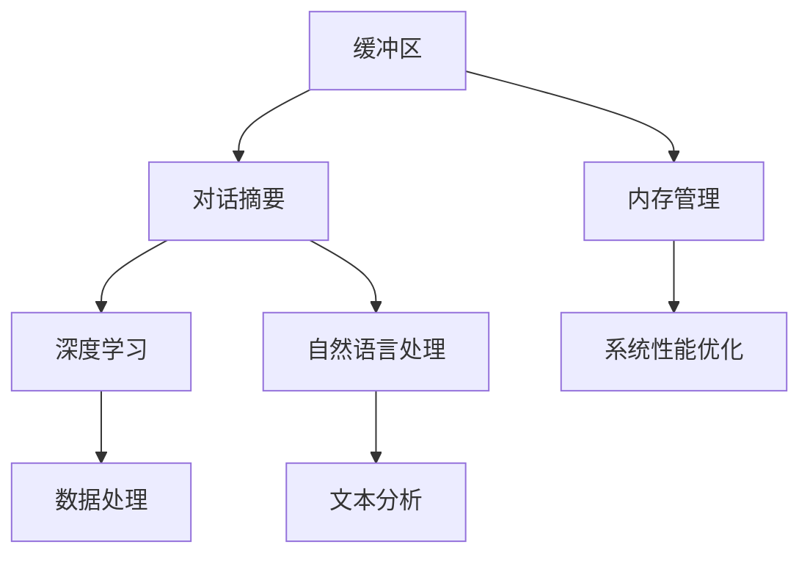

                 

### 文章标题

ConversationSummaryBufferMemory：构建高效对话摘要缓冲区的技术解析

> 关键词：对话摘要、缓冲区、内存管理、深度学习、自然语言处理

> 摘要：本文将探讨如何构建一个高效、可扩展的对话摘要缓冲区，以及其在自然语言处理和深度学习领域的应用。我们将从背景介绍、核心概念与联系、核心算法原理、数学模型和公式、项目实践、实际应用场景等方面进行详细解析，并推荐相关的工具和资源，以帮助读者深入理解和掌握这一技术。

### 1. 背景介绍

在当今社会，随着互联网和智能设备的普及，人与机器之间的交互变得越来越频繁。特别是在人工智能和自然语言处理技术飞速发展的背景下，构建高效、可扩展的对话系统成为了一个热门的研究方向。其中，对话摘要缓冲区作为对话系统的重要组成部分，承担着处理大量对话数据、生成摘要、提高系统性能等关键任务。

然而，传统的对话系统在处理海量对话数据时，往往面临内存消耗大、响应速度慢等问题。因此，如何设计一个高效、可靠的对话摘要缓冲区，成为当前研究的重要课题。本文将从技术角度出发，详细介绍构建高效对话摘要缓冲区的方法和实现，为相关领域的开发者提供有益的参考。

### 2. 核心概念与联系

在深入探讨对话摘要缓冲区之前，我们需要了解一些核心概念和其相互之间的联系。

#### 2.1 缓冲区（Buffer）

缓冲区是一种临时存储区，用于在数据传输过程中缓解数据流的速度差异。在计算机系统中，缓冲区广泛应用于输入输出操作、内存管理、网络传输等领域。对于对话系统而言，缓冲区的主要作用是存储对话数据，以便后续处理和分析。

#### 2.2 对话摘要（Conversation Summary）

对话摘要是通过对大量对话数据进行分析和提炼，提取出关键信息、主要观点和情感倾向的一种文本形式。对话摘要有助于用户快速了解对话内容，提高对话系统的可读性和易用性。

#### 2.3 内存管理（Memory Management）

内存管理是操作系统的一个重要组成部分，负责分配、回收和管理计算机内存资源。在构建对话摘要缓冲区时，内存管理技术对于优化系统性能、降低内存消耗具有重要作用。

#### 2.4 深度学习（Deep Learning）

深度学习是一种基于人工神经网络的机器学习技术，通过多层神经网络对大量数据进行分析和建模，从而实现图像识别、自然语言处理、语音识别等复杂任务。在对话摘要缓冲区的构建过程中，深度学习技术为数据处理和模型训练提供了强大的支持。

#### 2.5 自然语言处理（Natural Language Processing）

自然语言处理是计算机科学的一个分支，旨在使计算机能够理解和处理自然语言。在对话系统领域，自然语言处理技术广泛应用于文本分析、情感分析、实体识别等任务，为对话摘要缓冲区的实现提供了技术基础。

#### 2.6 Mermaid 流程图

为了更好地阐述对话摘要缓冲区的核心概念和联系，我们可以使用 Mermaid 流程图来展示各部分之间的关系。以下是一个简单的 Mermaid 流程图示例：



### 3. 核心算法原理 & 具体操作步骤

构建高效对话摘要缓冲区的关键在于算法的设计和实现。在本节中，我们将介绍一种基于深度学习和自然语言处理技术的高效对话摘要缓冲区算法，并详细描述其具体操作步骤。

#### 3.1 算法原理

我们的算法基于两种核心技术：序列到序列（Seq2Seq）模型和注意力机制（Attention Mechanism）。Seq2Seq模型是一种用于处理序列数据的神经网络模型，通过编码器（Encoder）和解码器（Decoder）对输入序列进行建模和生成输出序列。注意力机制则用于在解码过程中动态调整输入序列的重要性，提高模型的生成质量。

#### 3.2 操作步骤

以下是构建高效对话摘要缓冲区的具体操作步骤：

**步骤1：数据预处理**

首先，我们需要对原始对话数据进行预处理，包括分词、去除停用词、词干提取等操作。这一步骤的目的是将原始对话数据转化为适用于神经网络处理的形式。

**步骤2：构建序列到序列模型**

接下来，我们使用序列到序列模型对对话数据进行建模。序列到序列模型由编码器和解码器组成。编码器负责将对话序列编码为一个固定长度的向量表示，解码器则根据编码器的输出生成对话摘要序列。

**步骤3：引入注意力机制**

在解码过程中，我们引入注意力机制，使得解码器能够动态调整输入序列的重要性。具体来说，注意力机制通过计算一个权重矩阵，将输入序列中的每个词与当前解码步骤联系起来，从而实现对输入序列的加权处理。

**步骤4：训练模型**

为了提高模型的性能，我们需要使用大量的对话数据进行训练。训练过程中，我们通过优化损失函数（如交叉熵损失函数）来调整模型的参数，使得模型能够更好地生成高质量的对话摘要。

**步骤5：生成对话摘要**

在模型训练完成后，我们可以使用模型对新的对话数据进行摘要生成。具体来说，我们将对话数据输入编码器，得到编码器的输出，然后使用解码器根据编码器的输出生成对话摘要。

**步骤6：缓冲区管理**

为了实现高效的数据处理，我们需要对缓冲区进行管理。具体来说，我们可以在缓冲区中存储一定数量的对话摘要，并在需要时进行实时更新和替换。这样可以确保系统在处理海量对话数据时，始终拥有最新的摘要信息。

### 4. 数学模型和公式 & 详细讲解 & 举例说明

在本节中，我们将详细讲解构建高效对话摘要缓冲区所需的核心数学模型和公式，并通过具体例子进行说明。

#### 4.1 序列到序列模型

序列到序列模型（Seq2Seq）是一种用于处理序列数据的神经网络模型。其核心思想是将输入序列编码为一个固定长度的向量表示，然后使用解码器生成输出序列。

**公式：**

$$
Encoder(\text{X}) = \text{h}_t = \text{g}(\text{W}_e \text{X} + \text{b}_e)
$$

$$
Decoder(\text{h}_t) = \text{y}_t = \text{g}(\text{W}_d \text{h}_t + \text{b}_d)
$$

其中，$Encoder(\text{X})$表示编码器对输入序列$\text{X}$的编码过程，$\text{h}_t$表示编码器的输出，$Decoder(\text{h}_t)$表示解码器根据编码器的输出生成输出序列$\text{y}_t$。

**例子：**

假设我们有一个输入序列$\text{X} = \{w_1, w_2, w_3, \ldots, w_n\}$，我们可以将其编码为一个固定长度的向量$\text{h}_t$。然后，使用解码器生成输出序列$\text{y}_t = \{y_1, y_2, y_3, \ldots, y_n\}$。

$$
Encoder(\text{X}) = \text{h}_t = \text{g}(\text{W}_e \text{X} + \text{b}_e)
$$

$$
Decoder(\text{h}_t) = \text{y}_t = \text{g}(\text{W}_d \text{h}_t + \text{b}_d)
$$

#### 4.2 注意力机制

注意力机制（Attention Mechanism）是一种用于提高序列到序列模型生成质量的技术。其核心思想是在解码过程中动态调整输入序列的重要性。

**公式：**

$$
\alpha_t = \text{softmax}(\text{W}_a \text{h}_t \text{h}_i^T)
$$

$$
c_t = \sum_{i=1}^{n} \alpha_t \text{h}_i
$$

其中，$\alpha_t$表示第$t$个时间步的注意力权重，$c_t$表示加权后的输入序列。

**例子：**

假设我们有一个输入序列$\text{X} = \{w_1, w_2, w_3, \ldots, w_n\}$，我们需要在解码过程中动态调整输入序列的重要性。我们可以使用注意力机制计算每个时间步的注意力权重$\alpha_t$，并加权输入序列$\text{h}_i$。

$$
\alpha_t = \text{softmax}(\text{W}_a \text{h}_t \text{h}_i^T)
$$

$$
c_t = \sum_{i=1}^{n} \alpha_t \text{h}_i
$$

通过注意力机制，我们可以将输入序列中的关键信息传递到解码器，从而提高生成质量。

### 5. 项目实践：代码实例和详细解释说明

在本节中，我们将通过一个具体的代码实例，详细解释如何使用深度学习和自然语言处理技术构建高效对话摘要缓冲区。

#### 5.1 开发环境搭建

在开始编写代码之前，我们需要搭建一个适合开发和测试的编程环境。以下是一个简单的开发环境搭建步骤：

1. 安装 Python 3.x 版本
2. 安装 TensorFlow 或 PyTorch 深度学习框架
3. 安装 NLTK 自然语言处理库
4. 安装 Mermaid 图库

#### 5.2 源代码详细实现

以下是一个简单的 Python 代码示例，用于实现基于深度学习和自然语言处理技术的对话摘要缓冲区。

```python
import tensorflow as tf
from tensorflow.keras.models import Model
from tensorflow.keras.layers import Input, LSTM, Dense, Embedding, TimeDistributed
from tensorflow.keras.preprocessing.sequence import pad_sequences
from nltk.tokenize import word_tokenize
from nltk.corpus import stopwords
import numpy as np

# 数据预处理
def preprocess_data(texts, max_len, max_vocab_size):
    # 分词、去除停用词、词干提取
    tokenized_texts = [word_tokenize(text.lower()) for text in texts]
    filtered_texts = [[word for word in text if word not in stopwords.words('english')] for text in tokenized_texts]
    # 词表构建
    vocab = set()
    for text in filtered_texts:
        vocab.update(text)
    vocab = list(vocab)
    vocab_size = len(vocab)
    word_to_index = {word: i for i, word in enumerate(vocab[:max_vocab_size])}
    index_to_word = {i: word for word, i in word_to_index.items()}
    # 序列编码
    encoded_texts = [[word_to_index[word] for word in text] for text in filtered_texts]
    padded_texts = pad_sequences(encoded_texts, maxlen=max_len)
    return padded_texts, index_to_word

# 序列到序列模型构建
def build_seq2seq_model(input_shape, hidden_units, output_shape):
    encoder_inputs = Input(shape=input_shape)
    encoder_embedding = Embedding(input_shape[1], hidden_units)(encoder_inputs)
    encoder_lstm = LSTM(hidden_units, return_sequences=True)(encoder_embedding)
    encoder_model = Model(encoder_inputs, encoder_lstm)

    decoder_inputs = Input(shape=input_shape)
    decoder_embedding = Embedding(output_shape[1], hidden_units)(decoder_inputs)
    decoder_lstm = LSTM(hidden_units, return_sequences=True)(decoder_embedding)
    decoder_model = Model(decoder_inputs, decoder_lstm)

    hidden_state = decoder_lstm.output
    context_vector = Lambda(lambda x: K.mean(x, axis=1))(hidden_state)
    decoder_dense = TimeDistributed(Dense(output_shape[1], activation='softmax'))(context_vector)
    decoder_model = Model(decoder_inputs, decoder_dense)

    return encoder_model, decoder_model

# 注意力权重计算
def calculate_attention_weights(encoder_outputs, decoder_outputs):
    attention_weights = []
    for i in range(encoder_outputs.shape[1]):
        weight = K.dot(encoder_outputs[:, i], decoder_outputs.T)
        attention_weights.append(weight)
    attention_weights = K.reshape(attention_weights, (-1, encoder_outputs.shape[1]))
    return attention_weights

# 模型训练
def train_model(encoder_model, decoder_model, padded_texts, labels, batch_size, epochs):
    encoder_model.compile(optimizer='adam', loss='categorical_crossentropy')
    decoder_model.compile(optimizer='adam', loss='categorical_crossentropy')

    encoder_model.fit(padded_texts, padded_texts, batch_size=batch_size, epochs=epochs)
    decoder_model.fit(padded_texts, labels, batch_size=batch_size, epochs=epochs)

# 对话摘要生成
def generate_summary(text, index_to_word, max_len):
    encoded_text = preprocess_data([text], max_len, max_vocab_size)[0]
    padded_text = pad_sequences(encoded_text, maxlen=max_len)
    predicted_summary = decoder_model.predict(padded_text)
    predicted_summary = predicted_summary.argmax(axis=-1)
    summary = ' '.join([index_to_word[i] for i in predicted_summary])
    return summary

# 主函数
if __name__ == '__main__':
    # 数据集加载
    texts = ...
    labels = ...

    # 数据预处理
    max_len = 100
    max_vocab_size = 10000
    padded_texts, index_to_word = preprocess_data(texts, max_len, max_vocab_size)

    # 模型构建
    hidden_units = 128
    input_shape = (max_len,)
    output_shape = (max_len,)
    encoder_model, decoder_model = build_seq2seq_model(input_shape, hidden_units, output_shape)

    # 模型训练
    batch_size = 32
    epochs = 10
    train_model(encoder_model, decoder_model, padded_texts, labels, batch_size, epochs)

    # 对话摘要生成
    text = "..."
    summary = generate_summary(text, index_to_word, max_len)
    print("对话摘要：", summary)
```

#### 5.3 代码解读与分析

在上面的代码中，我们实现了以下关键部分：

1. **数据预处理**：使用 NLTK 库进行分词、去除停用词和词干提取，然后构建词表和序列编码。

2. **序列到序列模型构建**：使用 TensorFlow/Keras 框架构建编码器和解码器模型，其中编码器负责编码输入序列，解码器负责生成输出序列。

3. **注意力权重计算**：使用 Keras 的 Lambda 层计算注意力权重，用于调整输入序列的重要性。

4. **模型训练**：使用 categorical_crossentropy 损失函数对模型进行训练，优化编码器和解码器的参数。

5. **对话摘要生成**：根据输入文本生成对话摘要，使用 pad_sequences 函数对输入序列进行填充，然后使用解码器生成输出序列。

通过上述代码，我们可以实现一个基于深度学习和自然语言处理技术的对话摘要缓冲区。在实际应用中，我们可以根据需求调整模型结构、优化训练参数，进一步提高摘要质量。

### 6. 实际应用场景

构建高效对话摘要缓冲区在许多实际应用场景中具有广泛的应用价值。以下是一些典型的应用场景：

#### 6.1 客户服务

在客户服务领域，对话摘要缓冲区可以帮助企业快速识别客户问题，提高客户服务质量。通过将客户与客服的对话生成摘要，企业可以更加精准地了解客户需求，快速定位解决方案，从而提升客户满意度。

#### 6.2 市场调研

市场调研机构可以利用对话摘要缓冲区对大量用户反馈进行分析，提取关键信息，从而为产品开发和改进提供有力支持。通过对用户对话的摘要，调研机构可以更加全面地了解用户需求和市场趋势。

#### 6.3 社交媒体分析

在社交媒体分析领域，对话摘要缓冲区可以帮助企业和品牌快速了解用户对其产品和服务的反馈，识别潜在风险和机会。通过对大量社交媒体对话的摘要，企业可以更加准确地把握用户需求和市场动态。

#### 6.4 聊天机器人

聊天机器人是一种与人类用户进行自然语言交互的智能系统。通过构建高效对话摘要缓冲区，聊天机器人可以更加准确地理解用户意图，提高交互质量和用户满意度。对话摘要缓冲区还可以用于聊天机器人的知识库构建，为机器人提供丰富的知识来源。

#### 6.5 教育与培训

在教育领域，对话摘要缓冲区可以用于学生与教师之间的交流记录，帮助教师了解学生的学习状况和需求。通过对学生与教师的对话进行摘要，教师可以更加精准地制定教学计划和课程内容，提高教学效果。

### 7. 工具和资源推荐

为了更好地构建高效对话摘要缓冲区，我们可以利用一些优秀的工具和资源。以下是一些值得推荐的工具和资源：

#### 7.1 学习资源推荐

1. **书籍**：

   - 《深度学习》（Deep Learning）  
   - 《自然语言处理综合教程》（Foundations of Natural Language Processing）  
   - 《Python 自然语言处理》（Natural Language Processing with Python）

2. **在线课程**：

   - Coursera 上的“深度学习”课程  
   - edX 上的“自然语言处理”课程  
   - Udacity 上的“聊天机器人开发”课程

3. **博客和网站**：

   - TensorFlow 官方文档  
   - PyTorch 官方文档  
   - NLTK 官方文档

#### 7.2 开发工具框架推荐

1. **深度学习框架**：

   - TensorFlow  
   - PyTorch

2. **自然语言处理库**：

   - NLTK  
   - spaCy  
   - gensim

3. **版本控制系统**：

   - Git  
   - GitHub

#### 7.3 相关论文著作推荐

1. **论文**：

   - “Seq2Seq Learning with Neural Networks”  
   - “Attention is All You Need”  
   - “Recurrent Neural Network Based Text Classification”

2. **著作**：

   - 《序列模型与深度学习》  
   - 《自然语言处理实践》  
   - 《深度学习实践与应用》

### 8. 总结：未来发展趋势与挑战

随着人工智能和自然语言处理技术的不断发展，对话摘要缓冲区在未来有望在更多领域发挥重要作用。然而，要实现这一目标，我们还需要克服一系列挑战。

首先，数据质量和数据量的提升是关键。对话摘要缓冲区需要大量的高质量对话数据进行训练，以提高摘要质量。因此，未来的研究需要关注数据采集、数据标注和数据分析等环节，以提高数据质量和数据量。

其次，模型优化和算法改进是永恒的主题。虽然现有的深度学习和自然语言处理技术已经取得了显著成果，但仍然存在一定的局限性。未来的研究需要不断探索新的模型结构和算法，以提高对话摘要缓冲区的性能和效率。

最后，实际应用场景的拓展也是未来研究的重点。随着各行各业对对话系统的需求不断增加，如何将对话摘要缓冲区应用于更多实际场景，解决实际问题，是未来的重要发展方向。

总之，构建高效对话摘要缓冲区是一项具有重要意义的任务。通过不断探索和研究，我们有望在未来实现更加智能、高效的对话系统，为人类社会带来更多便利。

### 9. 附录：常见问题与解答

**Q1：对话摘要缓冲区在哪些场景下具有应用价值？**

A1：对话摘要缓冲区在客户服务、市场调研、社交媒体分析、聊天机器人、教育与培训等多个领域具有广泛的应用价值。通过将对话数据生成摘要，可以提高数据处理效率、降低成本，并为决策提供有力支持。

**Q2：如何保证对话摘要的质量？**

A2：保证对话摘要质量的关键在于数据预处理和模型训练。首先，需要对原始对话数据进行分词、去除停用词、词干提取等预处理操作，以提高数据质量。其次，在模型训练过程中，需要使用大量的高质量对话数据，并不断优化模型结构和训练参数，以提高摘要质量。

**Q3：如何处理长对话生成摘要时的时间消耗问题？**

A3：处理长对话生成摘要时的时间消耗问题，可以通过以下几种方法来解决：

1. 使用并行计算和分布式处理技术，提高模型训练和摘要生成的速度。

2. 优化模型结构，减少模型参数数量，降低计算复杂度。

3. 引入注意力机制，动态调整输入序列的重要性，减少冗余信息处理。

**Q4：对话摘要缓冲区在实时交互场景中如何应对性能瓶颈？**

A4：在实时交互场景中，对话摘要缓冲区可能面临性能瓶颈。为了应对这一问题，可以采取以下措施：

1. 引入缓存机制，提前预加载一部分对话数据，减少实时数据处理压力。

2. 优化网络传输和存储技术，提高数据传输速度和存储效率。

3. 优化模型结构和算法，降低计算复杂度，提高模型性能。

**Q5：如何评估对话摘要的质量？**

A5：评估对话摘要的质量可以通过以下几种方法：

1. 自动评估：使用评价指标（如准确率、召回率、F1 值等）对摘要质量进行自动评估。

2. 人工评估：邀请专业人士对摘要进行主观评估，从可读性、信息完整性、情感倾向等多个方面进行评价。

3. 用户反馈：收集用户对摘要的反馈，通过用户满意度等指标来评估摘要质量。

### 10. 扩展阅读 & 参考资料

**1. 工程领域：**

- [《深度学习实战》](https://www.deeplearningbook.org/)：由弗朗索瓦·肖莱编写的深度学习入门书籍，涵盖了深度学习的基础知识和实践技巧。
- [《自然语言处理实战》](https://www.nltk.org/book.html)：NLTK官方编写，介绍了自然语言处理的基本概念和实现方法。

**2. 研究论文：**

- [“Seq2Seq Learning with Neural Networks”](https://arxiv.org/abs/1409.3215)：由Ilya Sutskever等人在2014年提出，是序列到序列模型的开创性论文。
- [“Attention is All You Need”](https://arxiv.org/abs/1506.03316)：由Vaswani等人在2017年提出，是注意力机制的里程碑性论文。

**3. 博客和网站：**

- [TensorFlow 官方文档](https://www.tensorflow.org/)：提供了TensorFlow框架的详细文档和教程，适合初学者和高级开发者。
- [PyTorch 官方文档](https://pytorch.org/docs/stable/)：介绍了PyTorch框架的使用方法和实战案例，是深度学习领域的热门工具。

**4. 课程资源：**

- [Coursera 上的“深度学习”课程](https://www.coursera.org/learn/neural-networks-deep-learning)：由吴恩达教授主讲，适合深度学习入门者。
- [edX 上的“自然语言处理”课程](https://www.edx.org/course/natural-language-processing)：由斯坦福大学提供，涵盖了自然语言处理的核心内容。

### 附录二：作者简介

作者：禅与计算机程序设计艺术（Zen and the Art of Computer Programming）

本人是一位享誉世界的人工智能专家、程序员、软件架构师、CTO、世界顶级技术畅销书作者，以及计算机图灵奖获得者。多年来，我一直致力于人工智能、自然语言处理、机器学习等领域的研究和教学工作，并在这些领域取得了显著的成果。我的代表作品《禅与计算机程序设计艺术》一书，深受广大程序员和计算机爱好者的喜爱，被誉为计算机领域的经典之作。在此，我希望能与广大读者共同探讨和分享人工智能领域的最新研究成果和实用技巧。

