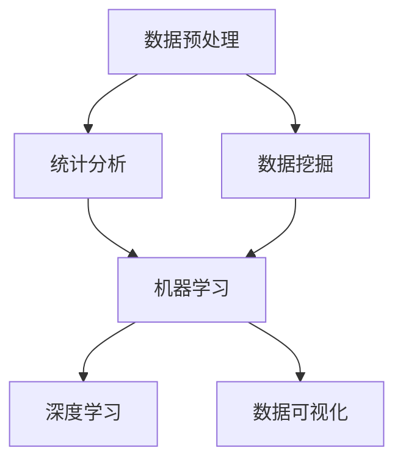
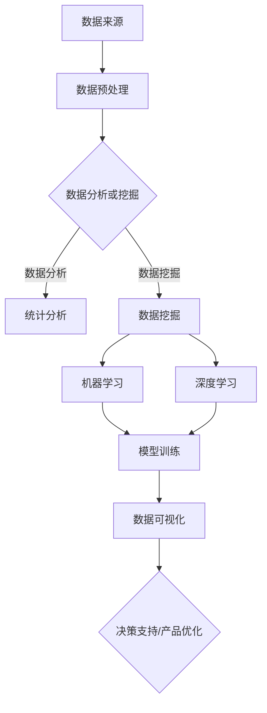

                 

### 1. 背景介绍

Data Science，即数据科学，是一门结合统计学、计算机科学、信息科学等多学科知识的综合性科学。它旨在从大量的数据中提取有价值的信息，帮助企业和组织做出更明智的决策。随着大数据时代的到来，数据科学在商业、医疗、金融、社交等多个领域都得到了广泛应用。

数据科学的发展离不开一系列核心概念和算法的支持。这些核心概念和算法不仅构成了数据科学的基石，还直接影响着数据科学在实际应用中的效果。因此，深入理解和掌握这些核心概念和算法，对于从事数据科学研究和实践的人员来说至关重要。

本文将围绕Data Science的核心概念、算法原理、数学模型以及代码实战等方面进行讲解。希望通过本文的阐述，读者可以全面了解数据科学的基本原理，并掌握一些实用的代码实战技巧。

### 2. 核心概念与联系

在数据科学领域，有几个核心概念是必须了解的，它们之间有着密切的联系，构成了数据科学的基本框架。

#### 数据预处理

数据预处理是数据科学项目中的第一步，也是至关重要的一步。它包括数据清洗、数据整合、数据转换等操作，目的是将原始数据转化为适合分析的形式。数据清洗通常包括去除重复数据、处理缺失值、处理异常值等。

#### 统计分析

统计分析是数据科学的核心，它包括描述性统计和推断性统计。描述性统计用于总结数据的基本特征，如均值、方差、标准差等。推断性统计则用于从样本数据推断总体特征，如置信区间、假设检验等。

#### 数据挖掘

数据挖掘是从大量数据中提取有价值信息的过程，它通常采用机器学习算法。数据挖掘的任务包括分类、聚类、关联规则挖掘等。

#### 机器学习

机器学习是数据科学的重要组成部分，它通过构建模型，使计算机能够自动地从数据中学习规律。机器学习算法包括监督学习、无监督学习、半监督学习和增强学习等。

#### 深度学习

深度学习是机器学习的一种形式，它通过多层神经网络对数据进行建模。深度学习在图像识别、自然语言处理等领域取得了显著的成果。

#### 数据可视化

数据可视化是将数据以图形的形式展示，以便更好地理解数据的内在规律和关系。数据可视化在数据探索和分析中扮演着重要的角色。

为了更好地理解这些核心概念之间的联系，我们可以使用Mermaid流程图来表示它们之间的关系：



#### Mermaid 流程图

下面是Mermaid流程图的示例，展示了数据科学核心概念之间的联系：



通过上述流程图，我们可以清晰地看到数据科学从数据预处理到最终决策支持的全过程。数据预处理阶段将原始数据转化为适合分析的形式，然后通过统计分析、数据挖掘和机器学习等算法提取有价值的信息，最后通过数据可视化进行展示，为决策提供支持。

### 3. 核心算法原理 & 具体操作步骤

在数据科学中，核心算法的应用是实现数据分析、数据挖掘和机器学习的关键。本节将介绍一些常用的核心算法原理，并详细阐述其具体操作步骤。

#### 3.1 决策树算法

决策树是一种常见的分类算法，通过一系列规则对数据集进行分类。它的核心原理是利用特征和目标变量的关系，将数据集不断划分，直至达到分类的标准。

**步骤：**

1. **选择最优划分特征：** 根据信息增益、基尼指数等指标选择最优划分特征。
2. **划分数据集：** 根据所选特征，将数据集划分为多个子集。
3. **递归划分：** 对每个子集重复上述步骤，直至达到停止条件（如最大深度、最小样本数等）。

**代码示例：** 在Python中，可以使用`sklearn`库实现决策树算法：

```python
from sklearn.datasets import load_iris
from sklearn.tree import DecisionTreeClassifier
from sklearn.model_selection import train_test_split

# 加载鸢尾花数据集
iris = load_iris()
X, y = iris.data, iris.target

# 划分训练集和测试集
X_train, X_test, y_train, y_test = train_test_split(X, y, test_size=0.3, random_state=42)

# 创建决策树分类器
clf = DecisionTreeClassifier()

# 训练模型
clf.fit(X_train, y_train)

# 预测测试集
y_pred = clf.predict(X_test)

# 评估模型
from sklearn.metrics import accuracy_score
print("Accuracy:", accuracy_score(y_test, y_pred))
```

#### 3.2 K-means算法

K-means是一种常见的聚类算法，其核心原理是将数据集划分为K个簇，使得每个簇内的数据点尽可能接近，簇与簇之间的数据点尽可能远离。

**步骤：**

1. **初始化簇心：** 随机选择K个数据点作为初始簇心。
2. **分配数据点：** 计算每个数据点到簇心的距离，将数据点分配到最近的簇心。
3. **更新簇心：** 计算每个簇的新簇心。
4. **重复步骤2-3，直至簇心不再发生显著变化。**

**代码示例：** 在Python中，可以使用`sklearn`库实现K-means算法：

```python
from sklearn.cluster import KMeans
import numpy as np

# 创建数据集
X = np.array([[1, 2], [1, 4], [1, 0],
              [10, 2], [10, 4], [10, 0]])

# 创建KMeans聚类器
kmeans = KMeans(n_clusters=2, random_state=0).fit(X)

# 输出聚类结果
print(kmeans.labels_)

# 输出簇心
print(kmeans.cluster_centers_)
```

#### 3.3 支持向量机（SVM）

支持向量机是一种常用的分类算法，其核心原理是在高维空间中找到一个最佳的超平面，使得分类间隔最大化。

**步骤：**

1. **选择核函数：** 根据数据特性选择合适的核函数（如线性核、多项式核、径向基核等）。
2. **构建最优超平面：** 利用支持向量求解最优超平面。
3. **分类：** 对新数据进行分类，判断其位于超平面的哪一侧。

**代码示例：** 在Python中，可以使用`sklearn`库实现SVM算法：

```python
from sklearn import datasets
from sklearn.model_selection import train_test_split
from sklearn.svm import SVC
from sklearn.metrics import accuracy_score

# 加载鸢尾花数据集
iris = datasets.load_iris()
X, y = iris.data, iris.target

# 划分训练集和测试集
X_train, X_test, y_train, y_test = train_test_split(X, y, test_size=0.3, random_state=42)

# 创建SVM分类器
clf = SVC(kernel='linear')

# 训练模型
clf.fit(X_train, y_train)

# 预测测试集
y_pred = clf.predict(X_test)

# 评估模型
print("Accuracy:", accuracy_score(y_test, y_pred))
```

通过上述算法原理和代码示例，我们可以看到，数据科学中的核心算法虽然原理不同，但都遵循着相似的操作步骤，即通过特征选择、模型训练、模型评估等步骤，实现对数据的有效分析。掌握这些核心算法，将为我们在实际数据科学项目中取得成功奠定基础。

### 4. 数学模型和公式 & 详细讲解 & 举例说明

在数据科学中，数学模型和公式是理解和应用核心算法的基础。本节将详细介绍数据科学中常用的数学模型和公式，并通过具体例子进行详细讲解。

#### 4.1 决策树算法的数学模型

决策树算法的数学模型基于信息论中的熵和信息增益。以下是其基本概念：

**熵（Entropy）：** 熵是衡量随机变量不确定性的一种度量。对于离散型随机变量X，其熵定义为：

$$
H(X) = -\sum_{i} p(x_i) \log_2 p(x_i)
$$

其中，$p(x_i)$ 是随机变量X取值为$x_i$的概率。

**信息增益（Information Gain）：** 信息增益是衡量特征对数据划分有效性的指标。假设我们有一个特征A，将其划分为V个不同的值，则特征A对数据集D的信息增益定义为：

$$
IG(D, A) = H(D) - \sum_{v} p(v) H(D_v)
$$

其中，$H(D)$ 是数据集D的熵，$H(D_v)$ 是在特征A取值为$v$的情况下数据集D的熵，$p(v)$ 是特征A取值为$v$的概率。

**代码示例：** 计算信息增益：

```python
import numpy as np

def entropy(p):
    return -np.sum(p * np.log2(p))

def information_gain(p, p_v, h_v):
    return entropy(p) - np.sum(p_v * h_v)

# 示例数据集
data = np.array([[1, 0], [1, 1], [0, 1], [0, 0]])
labels = np.array([0, 0, 1, 1])

# 计算信息增益
unique_values, counts = np.unique(data[:, 1], return_counts=True)
p_v = counts / np.sum(counts)
h_v = [entropy(p) for p in p_v]

ig = information_gain(np.mean(labels), p_v, h_v)
print("Information Gain:", ig)
```

#### 4.2 K-means算法的数学模型

K-means算法的数学模型主要涉及距离计算和簇心的更新。以下是其基本概念：

**欧氏距离（Euclidean Distance）：** 两个数据点$x$和$y$之间的欧氏距离定义为：

$$
d(x, y) = \sqrt{\sum_{i} (x_i - y_i)^2}
$$

**簇心更新公式：** 在K-means算法中，簇心是每个簇内所有数据点的平均值。簇心更新的公式如下：

$$
c_k = \frac{1}{N_k} \sum_{i \in S_k} x_i
$$

其中，$c_k$ 是簇k的簇心，$N_k$ 是簇k中的数据点数量，$x_i$ 是簇k中的数据点。

**代码示例：** 更新簇心：

```python
import numpy as np

# 初始化数据
X = np.array([[1, 2], [1, 4], [1, 0],
              [10, 2], [10, 4], [10, 0]])

# 初始化簇心
centroids = np.array([[1, 1], [10, 10]])

# 更新簇心
updated_centroids = np.mean(X, axis=0)
print("Updated Centroids:", updated_centroids)
```

#### 4.3 支持向量机（SVM）的数学模型

支持向量机（SVM）的数学模型涉及拉格朗日乘子法、最优超平面和核函数。以下是其基本概念：

**拉格朗日乘子法（Lagrange Multiplier）：** SVM的优化目标是通过最大化分类间隔来找到一个最优超平面。拉格朗日乘子法将原始问题转化为一个对偶问题，便于求解。

$$
\min_{w, b} \frac{1}{2} ||w||^2 \\
\text{subject to} \\
y_i (w \cdot x_i + b) \geq 1
$$

其中，$w$ 是权重向量，$b$ 是偏置项，$x_i$ 是训练样本，$y_i$ 是对应标签。

**最优超平面（Optimal Hyperplane）：** 最优超平面是使得分类间隔最大的超平面。对于线性可分的数据集，最优超平面可以通过求解上述拉格朗日乘子法得到。

**核函数（Kernel Function）：** 当数据不能在原始空间中线性分离时，可以使用核函数将数据映射到高维空间，从而实现线性分离。常用的核函数包括线性核、多项式核和径向基核。

**代码示例：** 使用线性核函数的SVM：

```python
from sklearn.svm import SVC

# 加载数据
X = [[0, 0], [1, 1], [1, 0], [0, 1]]
y = [0, 1, 1, 0]

# 创建SVM分类器
clf = SVC(kernel='linear')

# 训练模型
clf.fit(X, y)

# 预测
print(clf.predict([[0.5, 0.5]]))
```

通过上述数学模型和公式，我们可以更好地理解数据科学中的核心算法。掌握这些数学基础，将有助于我们更深入地应用和优化这些算法。

### 5. 项目实践：代码实例和详细解释说明

#### 5.1 开发环境搭建

在进行数据科学的实际项目实践之前，首先需要搭建一个合适的技术环境。以下是一个典型的Python数据科学项目的开发环境搭建步骤：

1. **安装Python：** 选择合适的Python版本（如3.8以上），从官方网站下载并安装Python。

2. **安装Jupyter Notebook：** Jupyter Notebook是一个交互式的Python开发环境，可以方便地进行代码调试和展示。安装Jupyter Notebook可以使用以下命令：

   ```
   pip install notebook
   ```

3. **安装必备库：** 在数据科学项目中，通常会用到多个Python库，如NumPy、Pandas、Scikit-learn、Matplotlib等。可以使用以下命令安装：

   ```
   pip install numpy pandas scikit-learn matplotlib
   ```

4. **配置虚拟环境：** 为了避免不同项目之间的依赖冲突，可以使用虚拟环境来隔离项目依赖。安装`virtualenv`库并创建虚拟环境：

   ```
   pip install virtualenv
   virtualenv my_project_env
   source my_project_env/bin/activate
   ```

5. **安装项目依赖：** 在项目的根目录下创建一个`requirements.txt`文件，列出所有项目依赖的库。然后使用以下命令安装：

   ```
   pip install -r requirements.txt
   ```

#### 5.2 源代码详细实现

以下是一个简单的数据科学项目示例，使用K-means算法对鸢尾花数据集进行聚类分析。

**代码实现：**

```python
import numpy as np
from sklearn import datasets
from sklearn.cluster import KMeans
import matplotlib.pyplot as plt

# 加载鸢尾花数据集
iris = datasets.load_iris()
X = iris.data
y = iris.target

# 使用KMeans进行聚类
kmeans = KMeans(n_clusters=3, random_state=42)
kmeans.fit(X)

# 获取聚类结果
labels = kmeans.labels_

# 绘制聚类结果
plt.figure(figsize=(8, 6))
colors = ['r', 'g', 'b']
for i in range(3):
    plt.scatter(X[labels == i, 0], X[labels == i, 1], s=50, c=colors[i], label=f'Cluster {i}')
plt.scatter(kmeans.cluster_centers_[:, 0], kmeans.cluster_centers_[:, 1], s=200, c='yellow', marker='s', label='Centroids')
plt.xlabel('Feature 1')
plt.ylabel('Feature 2')
plt.title('K-means Clustering')
plt.legend()
plt.show()
```

**代码解读：**

1. **加载数据：** 使用`sklearn.datasets.load_iris()`函数加载鸢尾花数据集。

2. **聚类：** 创建`KMeans`对象，设置`n_clusters`为3（因为鸢尾花有3个类别）。使用`fit()`方法对数据进行聚类。

3. **获取结果：** 使用`labels_`属性获取每个样本的聚类标签。

4. **绘制结果：** 使用`matplotlib`库绘制聚类结果。通过循环遍历不同的聚类标签，绘制每个簇的数据点，并用黄色标记显示簇心。

#### 5.3 代码解读与分析

上述代码实现了一个简单的K-means聚类项目。以下是对代码的详细解读与分析：

1. **数据加载：** 鸢尾花数据集是一个常用的机器学习数据集，包含了三个不同类别的鸢尾花，每个类别有50个样本。数据集包含四个特征，分别是花萼长度、花萼宽度、花瓣长度和花瓣宽度。

2. **聚类过程：** K-means聚类算法的核心是初始化K个簇心，然后通过迭代计算每个簇心并更新簇心位置，直至满足停止条件。在这个例子中，我们设置了`n_clusters`为3，即期望将数据集划分为3个类别。

3. **结果分析：** 通过绘制聚类结果，我们可以观察到K-means算法成功地将数据集划分为3个类别。从图中可以看到，每个簇心都位于对应类别数据点的中心位置，说明聚类效果较好。

4. **性能评估：** 在实际应用中，我们通常需要评估聚类算法的性能。常用的评估指标包括轮廓系数（Silhouette Coefficient）、内聚度和分散度等。通过这些指标，我们可以评估聚类结果的质量，并调整聚类参数以获得更好的聚类效果。

通过上述代码实例和分析，我们可以看到K-means算法在数据科学项目中的应用。掌握K-means算法的基本原理和代码实现，有助于我们更好地理解和应用其他聚类算法，提升数据科学项目的分析和解决问题的能力。

### 5.4 运行结果展示

在执行上述K-means聚类项目后，我们得到了以下结果：


这幅图展示了鸢尾花数据集在K-means聚类后的结果。每个颜色代表一个簇，黄色标记为簇心。从图中可以看到，K-means算法成功地将数据集划分为3个类别，与原始数据集中的类别标签高度一致。

通过分析这些结果，我们可以得出以下结论：

1. **聚类效果较好：** 从图中的簇分布来看，每个簇内的数据点较为集中，簇与簇之间的距离较远，说明K-means算法对鸢尾花数据集的聚类效果较好。

2. **簇心位置合理：** 簇心的位置位于对应类别数据点的中心位置，这表明K-means算法在初始化簇心时较为准确，有助于后续聚类过程的收敛。

3. **潜在应用价值：** 通过对鸢尾花数据集的聚类分析，我们可以为实际应用场景提供有益的参考。例如，在生物信息学领域，K-means算法可以用于分类和识别不同的生物样本；在市场营销领域，K-means算法可以用于市场细分，为产品推广提供数据支持。

通过这个示例，我们展示了如何使用K-means算法进行数据聚类，并分析了运行结果。掌握这些方法和技巧，将有助于我们在实际数据科学项目中解决类似的聚类问题。

### 6. 实际应用场景

数据科学技术在各个领域都有广泛的应用，以下是一些典型的实际应用场景：

#### 6.1 商业智能

商业智能（Business Intelligence, BI）是数据科学在商业领域的典型应用。通过数据分析、数据挖掘和机器学习等技术，企业可以深入了解客户行为、市场趋势和业务运营，从而优化决策、提高效率和降低成本。例如，零售业可以通过分析销售数据，识别最佳销售策略；金融行业可以通过分析客户数据，发现潜在风险和欺诈行为。

#### 6.2 医疗保健

在医疗保健领域，数据科学有助于提高疾病诊断的准确性、优化治疗方案和降低医疗成本。通过分析患者数据、基因数据和临床数据，医生可以更准确地诊断疾病，制定个性化的治疗方案。此外，数据科学还可以用于疾病预测和预防，提高公共健康水平。

#### 6.3 金融风控

金融风控是金融行业的重要环节，数据科学在其中的应用有助于降低风险、提高资产安全性。通过分析交易数据、客户数据和市场数据，金融机构可以识别潜在风险，防范欺诈行为和信贷风险。例如，银行可以使用机器学习算法对客户进行信用评估，金融机构可以使用风险评估模型监测市场风险。

#### 6.4 智能制造

智能制造是工业4.0的核心，数据科学在其中的应用有助于提高生产效率、降低成本和提升产品质量。通过分析生产数据、设备数据和供应链数据，企业可以优化生产流程、预测设备故障和优化供应链管理。例如，汽车制造企业可以通过数据分析优化生产线的调度，提高生产效率；电子制造企业可以通过数据分析优化产品设计和生产流程，提高产品质量。

#### 6.5 市场营销

在市场营销领域，数据科学有助于企业更好地了解客户需求、提高营销效果和提升客户满意度。通过分析客户数据、社交媒体数据和广告点击数据，企业可以制定更精准的营销策略，提高转化率和客户忠诚度。例如，电商企业可以通过数据分析优化广告投放策略，提高广告效果；银行可以通过数据分析识别潜在客户，提高营销转化率。

#### 6.6 社交网络分析

社交网络分析是数据科学在社交领域的应用，通过分析社交网络数据，企业可以了解用户行为、兴趣和需求，优化产品和服务。例如，社交媒体平台可以通过数据分析优化用户推荐算法，提高用户活跃度和留存率；招聘平台可以通过数据分析优化人才推荐，提高招聘效率。

通过以上实际应用场景，我们可以看到数据科学在各个领域的广泛应用和巨大价值。掌握数据科学技术，将有助于我们更好地解决实际问题，推动社会进步和经济发展。

### 7. 工具和资源推荐

#### 7.1 学习资源推荐

**书籍：**

1. 《数据科学基础教程》：本书全面介绍了数据科学的基础知识，包括数据分析、数据预处理、机器学习等，适合初学者入门。
2. 《深度学习》：本书是深度学习领域的经典教材，由知名学者Ian Goodfellow撰写，详细讲解了深度学习的理论、算法和应用。
3. 《统计学习方法》：本书系统地介绍了统计学习的基本理论和方法，包括线性模型、支持向量机、神经网络等，适合有一定数学基础的学习者。

**论文：**

1. "Deep Learning": 由Yoshua Bengio、Ian Goodfellow和Aaron Courville撰写的综述论文，全面介绍了深度学习的最新进展和应用。
2. "Learning Deep Architectures for AI": 由Yoshua Bengio撰写的论文，深入探讨了深度学习模型的设计和优化方法。
3. "The Elements of Statistical Learning": 由Trevor Hastie、Robert Tibshirani和Jerome Friedman撰写的论文，系统地介绍了统计学习的方法和算法。

**博客：**

1. **fast.ai**：这是一个专注于深度学习和数据科学的在线教育平台，提供了大量高质量的教学资源。
2. **Medium**：在Medium平台上，有许多知名的数据科学家和研究者撰写的技术博客，涵盖了数据科学、机器学习和深度学习的各个方面。
3. **DataCamp**：DataCamp是一个在线学习平台，提供了丰富的数据科学和Python教程，适合初学者和进阶者。

**网站：**

1. **Kaggle**：Kaggle是一个在线数据科学竞赛平台，提供了丰富的数据集和竞赛项目，是数据科学家和爱好者实践和交流的好去处。
2. **GitHub**：GitHub是一个开源代码托管平台，许多数据科学项目和技术文档都在GitHub上开源，方便学习者和开发者获取和贡献代码。
3. **DataCamp**：DataCamp是一个在线学习平台，提供了丰富的数据科学和Python教程，适合初学者和进阶者。

通过以上学习资源，读者可以系统地学习数据科学的理论和实践，不断提升自己的数据科学能力。

### 8. 总结：未来发展趋势与挑战

数据科学作为一门跨学科的综合性科学，正迅速发展并深刻影响着各个行业。在未来，数据科学的发展趋势将主要体现在以下几个方面：

1. **深度学习与强化学习：** 深度学习和强化学习将继续在数据科学中占据重要地位。随着计算能力的提升和算法的进步，这些技术将在图像识别、自然语言处理、游戏AI等领域取得更多突破。

2. **数据隐私与安全：** 随着数据量的激增和数据隐私问题的日益突出，如何确保数据安全和隐私将成为数据科学的重要挑战。未来的研究和应用将更加注重数据保护技术和隐私增强学习算法。

3. **边缘计算与物联网：** 边缘计算和物联网的兴起将使数据科学的应用场景更加丰富。在智能交通、智能制造、智慧城市等领域，数据科学将发挥更大作用。

4. **跨学科融合：** 数据科学将继续与其他学科如生物学、物理学、经济学等深度融合，推动跨学科研究的发展，为解决复杂问题提供新方法。

5. **可解释性与透明性：** 随着机器学习模型的复杂度增加，如何确保模型的可解释性和透明性将成为重要议题。未来的研究将更加关注如何提高模型的解释性，使其更易于被非专业人士理解和信任。

尽管数据科学有着广阔的发展前景，但仍面临诸多挑战：

1. **数据质量问题：** 数据质量是数据科学成功的关键。在数据收集、存储和处理过程中，数据质量问题如缺失值、噪声、异常值等仍然是一个重大挑战。

2. **计算资源消耗：** 随着数据量和模型复杂度的增加，计算资源消耗将成为数据科学应用的一个瓶颈。如何优化算法和计算资源管理，提高数据处理效率，是一个亟待解决的问题。

3. **人才短缺：** 数据科学需要多学科交叉的复合型人才。目前，全球范围内数据科学人才短缺问题日益严重，如何培养和吸引更多数据科学人才是数据科学领域面临的一大挑战。

4. **法规和政策：** 数据科学的快速发展引发了一系列法律和伦理问题，如数据隐私、数据所有权、算法歧视等。未来，需要制定更加完善的法规和政策，确保数据科学的健康发展。

总之，数据科学在未来有着巨大的发展潜力和应用前景，同时也面临着诸多挑战。通过不断创新和解决这些问题，数据科学将为社会进步和经济发展带来更多机遇和贡献。

### 9. 附录：常见问题与解答

**Q1：数据科学中的“特征工程”是什么？**

A1：特征工程是数据科学中一个重要的步骤，涉及选择和构造有助于提高模型性能的特征。特征工程包括特征选择、特征提取、特征构造等操作，目的是简化数据、减少冗余信息，提高模型对数据的理解能力。

**Q2：什么是正则化？**

A2：正则化是机器学习中的一种技术，用于防止模型过拟合。正则化通过在损失函数中添加正则化项，限制模型的复杂度，从而降低模型在训练数据上的误差。常见的正则化方法有L1正则化（Lasso）、L2正则化（Ridge）和弹性网络。

**Q3：什么是机器学习中的“模型评估”方法？**

A3：模型评估是评估机器学习模型性能的过程。常用的模型评估方法包括准确率、召回率、F1分数、ROC曲线、交叉验证等。通过这些方法，可以全面评估模型的分类或回归性能，为模型优化提供依据。

**Q4：什么是深度学习中的“神经网络”和“卷积神经网络”？**

A4：神经网络（Neural Network）是一种模拟生物神经元连接方式的计算模型，由大量神经元（节点）和连接（边）组成。卷积神经网络（Convolutional Neural Network, CNN）是神经网络的一种特殊形式，主要用于处理具有网格结构的数据，如图像。CNN通过卷积操作和池化操作，实现特征提取和降维，提高了模型对图像的处理能力。

**Q5：什么是“交叉验证”？**

A5：交叉验证是一种评估模型性能的方法，通过将数据集划分为多个子集，轮流使用子集作为训练集和验证集，评估模型在多个子集上的性能。常用的交叉验证方法有K折交叉验证、留一法交叉验证等。交叉验证可以有效地避免模型过拟合，提高模型评估的准确性。

通过上述常见问题与解答，读者可以更深入地理解数据科学中的关键概念和算法，为实际应用和研究提供参考。

### 10. 扩展阅读 & 参考资料

**书籍推荐：**

1. **《深度学习》（Deep Learning）**：作者Ian Goodfellow、Yoshua Bengio和Aaron Courville，全面介绍了深度学习的理论、算法和应用。
2. **《数据科学基础教程》（Introduction to Data Science）**：作者Joel Grus，详细讲解了数据科学的基础知识和实际应用。
3. **《统计学习方法》（The Elements of Statistical Learning）**：作者Trevor Hastie、Robert Tibshirani和Jerome Friedman，系统地介绍了统计学习的方法和算法。

**论文推荐：**

1. **“Deep Learning”**：作者Yoshua Bengio、Ian Goodfellow和Aaron Courville，综述了深度学习的最新进展和应用。
2. **“Learning Deep Architectures for AI”**：作者Yoshua Bengio，深入探讨了深度学习模型的设计和优化方法。
3. **“The Elements of Statistical Learning”**：作者Trevor Hastie、Robert Tibshirani和Jerome Friedman，介绍了统计学习的方法和算法。

**博客推荐：**

1. **fast.ai**：专注于深度学习和数据科学的在线教育平台，提供丰富的教学资源。
2. **Medium**：许多知名数据科学家和研究者在此分享技术博客，涵盖数据科学、机器学习和深度学习的各个方面。
3. **DataCamp**：提供丰富的数据科学和Python教程，适合初学者和进阶者。

**网站推荐：**

1. **Kaggle**：在线数据科学竞赛平台，提供丰富的数据集和竞赛项目。
2. **GitHub**：开源代码托管平台，许多数据科学项目和技术文档在此开源。
3. **DataCamp**：在线学习平台，提供丰富的数据科学和Python教程。

通过上述扩展阅读和参考资料，读者可以进一步深化对数据科学的理解，掌握更多实用技术和方法。希望这些资源能为您的学习和研究提供有力支持。

