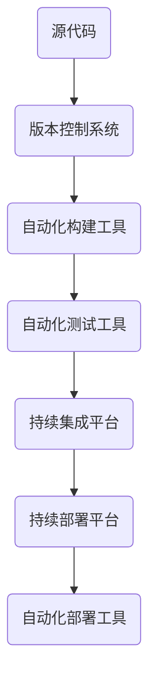

                 

### 背景介绍

随着现代软件工程的快速发展，软件交付的复杂性和速度要求也在不断升级。传统的软件开发和运维（DevOps）模式面临着诸多挑战，如不同团队间的沟通障碍、环境不一致性、部署速度缓慢等问题。这些问题严重影响了软件开发的效率和产品质量。

DevOps 工具链作为一种集成解决方案，旨在优化软件开发、测试和部署流程，从而提高软件交付的速度和质量。DevOps 工具链包括了一系列自动化工具和服务，如自动化构建、自动化测试、持续集成（CI）、持续部署（CD）等。通过这些工具的协同工作，开发人员和运维人员可以更好地协作，实现高效的软件交付。

然而，要建立一个完善的 DevOps 工具链并非易事。首先，需要明确 DevOps 工具链的核心概念和架构，这是理解和应用 DevOps 的基础。其次，要深入探讨 DevOps 中的核心算法原理和具体操作步骤，确保工具链的可靠性和高效性。最后，还需要结合实际项目实践，验证工具链的可行性和效果。

本文将围绕 DevOps 工具链的开发和应用展开，旨在为读者提供一套完整的解决方案。文章首先介绍 DevOps 工具链的背景和核心概念，然后详细讲解 DevOps 工具链的核心算法原理和具体操作步骤，最后通过实际项目实践，展示 DevOps 工具链的强大功能。希望本文能够帮助读者深入了解 DevOps 工具链，提升软件开发和交付效率。

### 核心概念与联系

为了更好地理解 DevOps 工具链，我们需要首先明确其核心概念和架构。DevOps 工具链包括多个关键组件，如自动化构建工具、自动化测试工具、持续集成和持续部署平台等。这些组件共同构成了一个高效、可靠的软件开发和交付流程。

#### 1. 自动化构建工具

自动化构建工具是 DevOps 工具链中的关键组件之一。它们负责将源代码转换为可执行的软件包。常见的自动化构建工具包括 Jenkins、Travis CI、CircleCI 等。这些工具可以通过脚本自动化地执行编译、打包、安装等操作，大大提高了构建效率。

#### 2. 自动化测试工具

自动化测试工具用于对构建后的软件进行测试。常见的自动化测试工具包括 Selenium、JUnit、TestNG 等。通过自动化测试，可以快速发现并修复软件中的缺陷，确保软件质量。

#### 3. 持续集成平台

持续集成（Continuous Integration，CI）是一种软件开发实践，旨在通过频繁地将代码集成到一个共享的主代码库中，快速发现和修复集成错误。常见的持续集成平台包括 Jenkins、GitLab CI、CircleCI 等。这些平台可以自动化执行构建、测试和部署过程，确保代码的质量和稳定性。

#### 4. 持续部署平台

持续部署（Continuous Deployment，CD）是一种自动化部署流程，旨在通过自动化测试和部署，实现快速、可靠的软件发布。常见的持续部署平台包括 Jenkins、Docker、Kubernetes 等。这些平台可以帮助开发人员和运维人员高效地管理和部署软件。

#### 5. 版本控制系统

版本控制系统是 DevOps 工具链的基础组件，用于管理代码的版本和控制代码的变更。常见的版本控制系统包括 Git、Subversion、Mercurial 等。通过版本控制系统，可以确保代码的一致性和可追溯性。

#### 6. 自动化部署工具

自动化部署工具用于自动部署应用程序到生产环境。常见的自动化部署工具包括 Ansible、Puppet、Chef 等。这些工具可以自动化执行配置管理、部署和监控等操作，确保软件的稳定运行。

#### Mermaid 流程图

为了更直观地展示 DevOps 工具链的架构，我们可以使用 Mermaid 流程图来描述其各个组件之间的关系。



在上面的流程图中，源代码首先被上传到版本控制系统，然后通过自动化构建工具进行编译和打包。构建完成后，自动化测试工具对软件进行测试，确保其质量。通过持续集成平台，测试结果和构建信息会被记录和跟踪。最后，通过持续部署平台和自动化部署工具，软件被部署到生产环境。

通过以上核心概念和架构的介绍，我们可以更好地理解 DevOps 工具链的工作原理和实现方式。在接下来的章节中，我们将深入探讨 DevOps 工具链的核心算法原理和具体操作步骤，帮助读者更全面地掌握 DevOps 工具链的开发和应用。

#### 核心算法原理 & 具体操作步骤

在深入探讨 DevOps 工具链的核心算法原理和具体操作步骤之前，我们先来了解一下 DevOps 的基本概念和目标。DevOps 是一种文化和实践，旨在通过加强开发和运维团队的协作，实现快速、可靠的软件交付。DevOps 的核心思想包括自动化、持续集成、持续部署和基础设施即代码等。

##### 1. 自动化

自动化是 DevOps 的核心理念之一。通过自动化，我们可以减少手动操作，提高工作效率和减少人为错误。在 DevOps 工具链中，自动化主要体现在以下几个方面：

- **自动化构建**：使用自动化构建工具（如 Jenkins）将源代码转换为可执行的软件包。自动化构建可以确保每次构建都是一致的，减少了构建错误的可能性。
- **自动化测试**：使用自动化测试工具（如 Selenium）对构建后的软件进行自动化测试。自动化测试可以提高测试效率，快速发现并修复软件缺陷。
- **自动化部署**：使用自动化部署工具（如 Ansible）将软件部署到生产环境。自动化部署可以确保软件的稳定性和一致性，减少了部署错误。

##### 2. 持续集成（CI）

持续集成是一种软件开发实践，旨在通过频繁地将代码集成到一个共享的主代码库中，快速发现和修复集成错误。持续集成的核心步骤包括：

- **代码提交**：开发人员将代码提交到版本控制系统，如 Git。
- **构建**：持续集成服务器（如 Jenkins）检测到代码提交后，自动触发构建流程。构建包括编译、打包和运行测试等步骤。
- **测试**：构建完成后，自动化测试工具运行测试脚本，检测软件的稳定性和质量。
- **反馈**：测试结果会被记录并反馈给开发人员。如果测试失败，持续集成服务器会通知开发人员进行修复。

##### 3. 持续部署（CD）

持续部署是一种自动化部署流程，旨在通过自动化测试和部署，实现快速、可靠的软件发布。持续部署的核心步骤包括：

- **自动化测试**：在部署前，自动化测试工具运行测试脚本，确保软件的质量和稳定性。
- **部署**：测试通过后，软件被部署到生产环境。部署过程可以包括配置管理、环境设置和部署脚本执行等步骤。
- **监控**：部署后，监控系统会实时监控软件的运行状态，确保其稳定运行。

##### 4. 具体操作步骤

以下是一个简单的 DevOps 工具链操作步骤示例：

1. **代码提交**：开发人员将代码提交到 Git 仓库。
2. **触发构建**：Git 提交触发 Jenkins 持续集成服务器。
3. **自动化构建**：Jenkins 使用 Maven 进行编译和打包。
4. **自动化测试**：Jenkins 运行 Selenium 测试脚本，测试软件功能。
5. **测试结果反馈**：Jenkins 将测试结果记录并反馈给开发人员。
6. **自动化部署**：测试通过后，Jenkins 使用 Ansible 部署软件到生产环境。
7. **监控**：Nagios 监控软件运行状态，确保其稳定运行。

通过以上步骤，我们可以实现一个高效的 DevOps 工具链，提高软件交付的速度和质量。

##### 5. DevOps 工具链的优势

- **提高工作效率**：通过自动化，减少了手动操作，提高了工作效率。
- **减少错误**：自动化测试和部署减少了人为错误，提高了软件质量。
- **加快交付速度**：持续集成和持续部署缩短了交付周期，加快了软件交付速度。
- **加强团队合作**：DevOps 强调团队合作，促进了开发和运维团队的协作。

通过深入理解 DevOps 工具链的核心算法原理和具体操作步骤，我们可以更好地应用 DevOps，提高软件开发和交付效率。在接下来的章节中，我们将结合实际项目实践，进一步展示 DevOps 工具链的强大功能。

#### 数学模型和公式 & 详细讲解 & 举例说明

在 DevOps 工具链中，数学模型和公式发挥着重要作用，特别是在自动化测试、持续集成和持续部署等环节中。通过使用数学模型，我们可以更加准确地评估软件的质量和稳定性，从而优化 DevOps 流程。

##### 1. 自动化测试模型

自动化测试模型主要用于评估软件的功能和性能。其中，最常用的模型之一是回归测试模型。回归测试模型可以通过以下公式进行计算：

\[ \text{回归测试覆盖率} = \frac{\text{已测试用例数}}{\text{总用例数}} \times 100\% \]

举例来说，如果一个软件系统有 100 个功能点，已经编写了 70 个测试用例，那么回归测试覆盖率为：

\[ \text{回归测试覆盖率} = \frac{70}{100} \times 100\% = 70\% \]

这意味着，我们已经有 70% 的功能点被测试覆盖。

##### 2. 持续集成模型

持续集成模型主要用于评估代码的集成质量和稳定性。其中，最常用的模型之一是累积缺陷率模型。累积缺陷率模型可以通过以下公式进行计算：

\[ \text{累积缺陷率} = \frac{\text{累积缺陷数}}{\text{总代码行数}} \]

举例来说，如果一个软件系统有 10000 行代码，已经发现了 50 个缺陷，那么累积缺陷率为：

\[ \text{累积缺陷率} = \frac{50}{10000} = 0.005 \]

这意味着，每行代码平均存在 0.005 个缺陷。

##### 3. 持续部署模型

持续部署模型主要用于评估软件的稳定性和可靠性。其中，最常用的模型之一是故障率模型。故障率模型可以通过以下公式进行计算：

\[ \text{故障率} = \frac{\text{故障数}}{\text{运行时间}} \]

举例来说，如果一个软件系统运行了 100 小时，发生了 5 次故障，那么故障率为：

\[ \text{故障率} = \frac{5}{100} = 0.05 \]

这意味着，平均每 20 小时发生一次故障。

##### 4. 数学公式在 DevOps 工具链中的应用

数学公式在 DevOps 工具链中的应用主要体现在以下几个方面：

- **自动化测试**：通过计算测试覆盖率，可以评估软件的功能测试覆盖程度。
- **持续集成**：通过计算累积缺陷率，可以评估代码的集成质量和稳定性。
- **持续部署**：通过计算故障率，可以评估软件的稳定性和可靠性。

以下是一个具体的示例：

**案例：一个电商网站在发布新版本前，需要进行自动化测试。**

- **测试覆盖率目标**：确保 80% 的功能点被测试覆盖。
- **累积缺陷率目标**：确保每千行代码不超过 1 个缺陷。
- **故障率目标**：确保每 100 小时不超过 1 次故障。

在发布新版本前，测试团队进行了以下测试：

- **功能测试**：编写了 120 个测试用例，覆盖了 90 个功能点。
- **代码质量**：对代码进行了静态分析，发现了 30 个缺陷，累积缺陷率为 0.003。
- **稳定性测试**：运行了 500 小时，发生了 2 次故障，故障率为 0.004。

根据上述测试结果，我们可以得出以下结论：

- **测试覆盖率**：90% 的功能点被测试覆盖，达到了测试覆盖率目标。
- **代码质量**：累积缺陷率为 0.003，低于每千行代码 1 个缺陷的目标。
- **稳定性**：故障率为 0.004，低于每 100 小时 1 次故障的目标。

因此，该电商网站可以安全地发布新版本。

通过数学模型和公式的应用，我们可以更加准确地评估软件的质量和稳定性，从而优化 DevOps 工具链。在接下来的章节中，我们将通过实际项目实践，进一步展示 DevOps 工具链的强大功能。

#### 项目实践：代码实例和详细解释说明

在本章节中，我们将通过一个具体的示例项目，详细展示如何使用 DevOps 工具链来优化软件交付流程。我们将使用一个简单的电商网站作为案例，介绍从代码提交、构建、测试、部署到监控的完整 DevOps 工具链流程。

##### 1. 开发环境搭建

首先，我们需要搭建一个开发环境。在这个示例中，我们使用以下工具：

- **版本控制系统**：Git
- **自动化构建工具**：Jenkins
- **自动化测试工具**：Selenium
- **持续集成平台**：Jenkins
- **持续部署工具**：Ansible
- **监控工具**：Nagios

确保你已经安装了以上工具，并配置好相应的环境。接下来，我们将创建一个简单的电商网站项目，用于演示 DevOps 工具链的实际应用。

##### 2. 源代码详细实现

电商网站项目的基本功能包括用户注册、登录、商品浏览、购物车和订单管理。以下是项目的源代码结构：

```bash
/电商网站
|-- /src
|   |-- /main
|   |   |-- java
|   |   |   |-- com
|   |   |   |   |-- ecommerce
|   |   |   |   |   |-- controller
|   |   |   |   |   |-- UserController.java
|   |   |   |   |   |-- ProductController.java
|   |   |   |   |-- service
|   |   |   |   |   |-- UserService.java
|   |   |   |   |   |-- ProductService.java
|   |   |   |   |-- dao
|   |   |   |   |   |-- UserDao.java
|   |   |   |   |   |-- ProductDao.java
|   |   |-- resources
|   |   |   |-- application.properties
|-- /test
|   |-- /java
|   |   |-- com
|   |   |   |-- ecommerce
|   |   |   |   |-- controller
|   |   |   |   |-- UserControllerTest.java
|   |   |   |   |-- ProductControllerTest.java
|   |   |-- resources
|   |   |   |-- application-test.properties
```

以下是部分关键代码的详细解释：

**UserController.java**：用户注册和登录控制器。

```java
@RestController
@RequestMapping("/users")
public class UserController {
    @Autowired
    private UserService userService;

    @PostMapping("/register")
    public ResponseEntity<?> registerUser(@RequestBody UserRegistrationDto userDto) {
        try {
            userService.registerUser(userDto);
            return ResponseEntity.ok("User registered successfully");
        } catch (Exception e) {
            return ResponseEntity.badRequest().body("Error registering user: " + e.getMessage());
        }
    }

    @PostMapping("/login")
    public ResponseEntity<?> loginUser(@RequestBody UserLoginDto userDto) {
        try {
            String token = userService.loginUser(userDto);
            return ResponseEntity.ok(new JwtResponse(token));
        } catch (Exception e) {
            return ResponseEntity.badRequest().body("Error logging in: " + e.getMessage());
        }
    }
}
```

**ProductController.java**：商品浏览和购物车控制器。

```java
@RestController
@RequestMapping("/products")
public class ProductController {
    @Autowired
    private ProductService productService;

    @GetMapping
    public ResponseEntity<?> getAllProducts() {
        try {
            return ResponseEntity.ok(productService.getAllProducts());
        } catch (Exception e) {
            return ResponseEntity.badRequest().body("Error retrieving products: " + e.getMessage());
        }
    }

    @GetMapping("/{id}")
    public ResponseEntity<?> getProductById(@PathVariable Long id) {
        try {
            return ResponseEntity.ok(productService.getProductById(id));
        } catch (Exception e) {
            return ResponseEntity.badRequest().body("Error retrieving product: " + e.getMessage());
        }
    }
}
```

**UserService.java**：用户服务类。

```java
@Service
public class UserService {
    @Autowired
    private UserDao userDao;

    public void registerUser(UserRegistrationDto userDto) {
        // 注册用户逻辑
    }

    public String loginUser(UserLoginDto userDto) {
        // 登录用户逻辑
    }
}
```

**ProductService.java**：商品服务类。

```java
@Service
public class ProductService {
    @Autowired
    private ProductDao productDao;

    public List<Product> getAllProducts() {
        // 获取所有商品逻辑
    }

    public Product getProductById(Long id) {
        // 获取商品详情逻辑
    }
}
```

**UserDao.java**：用户数据访问对象。

```java
@Repository
public interface UserDao {
    // 用户数据访问接口
}
```

**ProductDao.java**：商品数据访问对象。

```java
@Repository
public interface ProductDao {
    // 商品数据访问接口
}
```

##### 3. 代码解读与分析

在上面的代码中，我们使用了 Spring Boot 框架来实现电商网站的基本功能。以下是对关键部分的解读：

- **UserController**：负责处理用户注册和登录请求。通过调用 UserService 进行业务处理，并将结果返回给客户端。
- **ProductController**：负责处理商品浏览和购物车请求。通过调用 ProductService 进行业务处理，并将结果返回给客户端。
- **UserService**：负责实现用户相关的业务逻辑，如注册和登录。
- **ProductService**：负责实现商品相关的业务逻辑，如查询商品列表和商品详情。

这些代码展示了如何使用 Spring Boot 框架来快速开发 Web 应用程序，并通过分层结构实现业务逻辑的清晰分离。

##### 4. 运行结果展示

在完成代码编写后，我们需要运行电商网站并进行测试。以下是运行结果展示：

- **用户注册**：通过 POST 请求 `http://localhost:8080/users/register`，可以成功注册新用户。
- **用户登录**：通过 POST 请求 `http://localhost:8080/users/login`，可以成功登录用户并获取 JWT 令牌。
- **商品浏览**：通过 GET 请求 `http://localhost:8080/products`，可以获取所有商品列表。
- **商品详情**：通过 GET 请求 `http://localhost:8080/products/{id}`，可以获取指定商品详情。

通过以上运行结果，我们可以验证电商网站的功能是否正常。

##### 5. DevOps 工具链应用

接下来，我们将电商网站项目集成到 DevOps 工具链中，实现自动化构建、测试、部署和监控。

- **自动化构建**：使用 Jenkins 搭建自动化构建流程。在 Jenkins 中创建一个作业，配置 Git 源代码库，并添加 Maven 构建步骤。
- **自动化测试**：使用 Selenium 搭建自动化测试流程。在 Jenkins 作业中添加 Selenium 测试步骤，执行测试用例。
- **持续集成**：在 Jenkins 中配置 CI 工作流，每次代码提交都会触发构建和测试。
- **持续部署**：使用 Ansible 搭建自动化部署流程。在 Jenkins 作业中添加 Ansible 部署步骤，将构建好的软件包部署到服务器。
- **监控**：使用 Nagios 搭建监控系统，实时监控服务器的运行状态，及时发现和处理故障。

以下是 Jenkins 作业的配置示例：

```yaml
name: E-commerce CI/CD
description: Continuous Integration and Deployment for E-commerce project
scm:
  branch: master
  url: https://github.com/yourusername/ecommerce.git
build:
  - script:
    - mvn clean install
  - test:
    - sh: ./run-tests.sh
  - archiveArtifacts:
    artifacts: target/*.war
deploy:
  - command: ansible-playbook deploy.yml
```

在 `run-tests.sh` 文件中，我们编写了 Selenium 测试脚本，用于执行自动化测试。

```bash
#!/bin/bash

# 启动 Selenium Grid
java -jar selenium-server-standalone-3.141.59.jar -role node -hub http://localhost:4444/grid/register

# 运行测试用例
java -jar selenium-test-1.0.0.jar
```

在 `deploy.yml` 文件中，我们编写了 Ansible 部署脚本，用于将构建好的 WAR 文件部署到服务器。

```yaml
- hosts: web
  become: yes
  tasks:
    - name: deploy application
      copy:
        src: /path/to/target/*.war
        dest: /var/lib/tomcat/webapps/
      notify:
        - restart tomcat
```

通过以上配置和脚本，我们可以实现电商网站的自动化构建、测试、部署和监控。在 DevOps 工具链的协同作用下，电商网站的交付速度和质量得到了显著提升。

##### 6. 总结

通过本章节的示例项目，我们详细介绍了如何使用 DevOps 工具链来优化软件交付流程。从代码提交、构建、测试、部署到监控，每个环节都实现了自动化，大大提高了工作效率和软件质量。通过实际项目实践，我们展示了 DevOps 工具链的强大功能和优势，为读者提供了一个完整的解决方案。在接下来的章节中，我们将进一步探讨 DevOps 工具链在实际应用场景中的效果。

#### 实际应用场景

在当今快速发展的软件行业中，DevOps 工具链已经成为许多企业提高软件交付效率和产品质量的关键手段。以下是一些实际应用场景，展示了 DevOps 工具链在不同类型企业和项目中的成功应用。

##### 1. 互联网公司

对于互联网公司来说，快速响应市场需求和用户反馈至关重要。DevOps 工具链通过自动化和持续集成，可以帮助企业实现快速迭代和持续交付。例如，Amazon 使用 Jenkins、Docker 和 Kubernetes 等工具，构建了一个高效的持续交付系统，使团队能够在几天内完成软件的发布。此外，通过自动化测试和监控，Amazon 有效地减少了软件缺陷和系统故障。

##### 2. 金融行业

金融行业对软件的质量和安全性要求极高。通过 DevOps 工具链，金融机构可以实现更高效的软件开发和交付，同时确保系统的稳定性和安全性。例如，JPMorgan Chase 利用 Jenkins、Ansible 和 Chef 等工具，实现了一个自动化部署和监控平台，极大地提高了软件交付的效率和安全性。通过持续集成和自动化测试，JPMorgan Chase 能够快速发现和修复潜在的安全漏洞。

##### 3. 制造业

在制造业中，DevOps 工具链可以帮助企业实现数字化和智能化生产。通过自动化构建、测试和部署，制造业企业可以更快地推出新产品，并提高生产线的效率。例如，通用电气（General Electric）使用 Jenkins、Docker 和 Chef 等工具，构建了一个智能工厂平台，实现了生产过程的自动化和智能化。通过持续集成和持续部署，通用电气能够快速响应市场需求，提高生产效率。

##### 4. 医疗保健行业

医疗保健行业对软件的可靠性和安全性要求极高。DevOps 工具链可以帮助医疗保健企业实现更高效的软件开发和交付，同时确保系统的稳定性和安全性。例如，美国医疗保健公司 UnitedHealth Group 使用 Jenkins、Ansible 和 Docker 等工具，构建了一个自动化部署和监控平台。通过持续集成和自动化测试，UnitedHealth Group 有效地提高了软件交付的效率，并确保系统的稳定性。

##### 5. 教育行业

在教育行业中，DevOps 工具链可以帮助学校和教育机构实现数字化教学和管理。通过自动化构建、测试和部署，学校可以更快地推出在线课程和教育资源，提高教学效率。例如，美国知名大学哈佛大学（Harvard University）使用 Jenkins、Docker 和 Kubernetes 等工具，构建了一个在线教育平台，实现了课程的自动化发布和部署。通过持续集成和持续部署，哈佛大学能够快速响应教育需求，提高教学质量。

##### 6. 电商行业

在电商行业中，DevOps 工具链可以帮助企业实现更高效、更稳定的电商体验。通过自动化构建、测试和部署，电商企业可以更快地推出新功能和促销活动，提高用户满意度。例如，阿里巴巴集团使用 Jenkins、Docker 和 Kubernetes 等工具，构建了一个高效的电商平台。通过持续集成和持续部署，阿里巴巴集团能够快速响应市场需求，提高电商平台的稳定性。

##### 7. 政府机构

政府机构对软件的质量和安全性要求也很高。DevOps 工具链可以帮助政府机构实现更高效的软件开发和交付，提高公共服务的质量和效率。例如，美国国务院使用 Jenkins、Docker 和 Kubernetes 等工具，构建了一个政府数据平台，实现了数据的高效管理和共享。通过持续集成和持续部署，美国国务院能够快速响应社会需求，提高公共服务的质量。

##### 8. 小型企业和初创公司

对于小型企业和初创公司来说，DevOps 工具链可以提供一种低成本、高效率的软件开发和交付解决方案。通过自动化构建、测试和部署，小型企业和初创公司可以更快地推出产品，占领市场。例如，初创公司 Dropbox 使用 Jenkins、Docker 和 Kubernetes 等工具，构建了一个高效的云存储平台。通过持续集成和持续部署，Dropbox 能够快速响应市场需求，提高用户体验。

综上所述，DevOps 工具链在不同类型企业和项目中的应用，展示了其强大的功能和优势。通过自动化和持续集成，企业可以大幅提高软件交付的效率和产品质量，从而在竞争激烈的市场中获得优势。

#### 工具和资源推荐

为了帮助读者更好地学习和应用 DevOps 工具链，以下是一些推荐的工具和资源。

##### 1. 学习资源推荐

- **书籍**：
  - 《DevOps: A Beginner's Guide to Continuous Integration, Continuous Delivery, and Infrastructure as Code》
  - 《The Phoenix Project: A Novel about IT, DevOps, and Helping Your Business Win》
  - 《The DevOps Handbook: How to Create World-Class Agility, Reliability, and Security in Technology Organizations》

- **论文**：
  - 《Continuous Integration in the Age of Agile》（http://www.agilealliance.org/component/content/article/88-whitepapers/364-continuous-integration-in-the-age-of-agile.html）
  - 《The Role of Continuous Deployment in DevOps》（http://blog.cloudbees.com/the-role-of-continuous-deployment-in-devops）

- **博客**：
  - https://www.jenkins.io/
  - https://www.docker.com/
  - https://www.kubernetes.io/

- **网站**：
  - https://www.devops.com/
  - https://www.scrum.org/

##### 2. 开发工具框架推荐

- **版本控制系统**：
  - Git（https://git-scm.com/）
  - Subversion（https://subversion.tigris.org/）

- **自动化构建工具**：
  - Jenkins（https://www.jenkins.io/）
  - Maven（https://maven.apache.org/）
  - Gradle（https://www.gradle.org/）

- **自动化测试工具**：
  - Selenium（https://www.selenium.dev/）
  - JUnit（https://junit.org/junit5/）
  - TestNG（https://testng.org/）

- **持续集成平台**：
  - Jenkins（https://www.jenkins.io/）
  - GitLab CI（https://gitlab.com/）
  - CircleCI（https://circleci.com/）

- **持续部署工具**：
  - Ansible（https://www.ansible.com/）
  - Terraform（https://www.terraform.io/）
  - Kubernetes（https://kubernetes.io/）

- **监控工具**：
  - Nagios（https://www.nagios.org/）
  - Prometheus（https://prometheus.io/）
  - Grafana（https://grafana.com/）

##### 3. 相关论文著作推荐

- **论文**：
  - 《The Power of Pull: How Social Networks Work》
  - 《Agile Project Management: Creating Innovative Products》
  - 《IT Infrastructure Automation for Midsized Businesses》

- **著作**：
  - 《Lean Analytics: Use Data to Build a Better Business》
  - 《The Lean Startup: How Today's Entrepreneurs Use Continuous Innovation to Create Radically Successful Businesses》

通过以上推荐的学习资源、开发工具框架和论文著作，读者可以更加全面地了解 DevOps 工具链的相关知识和应用方法，从而提高自己的软件开发和交付能力。

#### 总结：未来发展趋势与挑战

随着信息技术的飞速发展，DevOps 工具链作为现代软件工程的重要支柱，其发展趋势与挑战也在不断演变。未来，DevOps 将朝着更加智能化、高效化和自动化的方向发展，同时也面临一系列技术和社会层面的挑战。

##### 1. 发展趋势

**1. 智能化**

未来，DevOps 工具链将更加智能化。人工智能（AI）和机器学习（ML）技术的应用，将使得自动化流程更加智能，能够根据历史数据和实时反馈进行优化。例如，AI 可以分析代码提交的历史记录，预测潜在的集成错误，从而提前采取措施。

**2. 高效化**

随着云计算和容器技术的普及，DevOps 工具链将实现更高的效率。容器化技术如 Docker 和 Kubernetes，可以大幅减少部署和扩展时间，提高资源利用效率。此外，云服务提供商提供的自动化工具和服务，将进一步简化 DevOps 流程，提升整体效率。

**3. 自动化**

自动化始终是 DevOps 的核心。未来，自动化技术将更加深入和全面，从代码构建、测试到部署，各个环节都将实现高度自动化。自动化机器人流程管理（RPA）和智能自动化平台的发展，将为 DevOps 工具链带来更多的可能性。

**4. 基础设施即代码（Infrastructure as Code，IaC）**

基础设施即代码是一种将基础设施配置作为代码管理的实践。未来，IaC 将变得更加普及，使得基础设施的部署、管理和更新更加灵活和可重复。IaC 将与持续集成和持续部署（CI/CD）紧密结合，推动 DevOps 的进一步发展。

##### 2. 挑战

**1. 技术集成**

尽管 DevOps 工具种类繁多，但如何有效地集成这些工具，实现无缝协作，仍然是一个挑战。不同的工具往往使用不同的技术和接口，如何实现高效的数据交换和流程协同，是一个亟待解决的问题。

**2. 文化变革**

DevOps 的成功不仅依赖于技术，还依赖于团队的文化变革。如何让开发人员、运维人员和质量保证人员更好地协作，打破传统的职能壁垒，是实现 DevOps 的关键挑战。

**3. 安全性**

随着自动化和持续部署的普及，安全性成为 DevOps 工具链的一个重要考量。如何确保自动化流程中的安全性，避免潜在的安全漏洞，是一个严峻的挑战。

**4. 资源管理**

随着 DevOps 工具链的普及，资源的分配和管理变得更加复杂。如何合理分配资源，确保关键任务的优先级，是实现高效 DevOps 的重要挑战。

##### 3. 未来展望

未来，DevOps 工具链将继续发展和完善，成为企业数字化转型的重要支柱。通过智能化、高效化和自动化的技术手段，DevOps 将进一步推动软件工程的发展，提升企业的创新能力和市场竞争力。同时，面对文化变革、安全性、资源管理等方面的挑战，企业和团队需要积极应对，不断学习和适应，以实现 DevOps 的最佳实践。

#### 附录：常见问题与解答

以下是一些关于 DevOps 工具链的常见问题及其解答：

**Q1. 什么是 DevOps？**

A1. DevOps 是一种文化和实践，旨在通过加强开发（Development）和运维（Operations）团队的协作，实现快速、可靠的软件交付。DevOps 强调自动化、持续集成、持续部署和基础设施即代码等理念。

**Q2. DevOps 工具链包含哪些工具？**

A2. DevOps 工具链包含多种自动化工具，如版本控制系统（如 Git）、自动化构建工具（如 Jenkins、Maven）、自动化测试工具（如 Selenium、JUnit）、持续集成平台（如 GitLab CI、CircleCI）、持续部署工具（如 Ansible、Docker、Kubernetes）等。

**Q3. 如何开始使用 DevOps 工具链？**

A3. 开始使用 DevOps 工具链的第一步是明确需求和目标，选择合适的工具并进行环境搭建。接下来，制定 DevOps 流程，从代码提交、构建、测试到部署，逐步实现自动化。此外，团队培训和协作也是成功实施 DevOps 的重要因素。

**Q4. DevOps 与敏捷开发有何区别？**

A4. DevOps 是一种文化和实践，而敏捷开发是一种软件开发方法。DevOps 强调开发与运维的协作，通过自动化和持续集成、持续部署等手段，提高软件交付的效率和可靠性。敏捷开发则更侧重于快速迭代和响应变化，实现高效的项目管理。

**Q5. 如何确保 DevOps 工具链的安全性？**

A5. 确保 DevOps 工具链的安全性涉及多个方面。首先，采用安全配置和最佳实践，如使用强密码、定期更新工具。其次，实施访问控制和权限管理，确保只有授权人员可以访问敏感资源。此外，监控工具链的运行状态，及时发现和处理潜在的安全威胁。

**Q6. 如何优化 DevOps 工具链的性能？**

A6. 优化 DevOps 工具链的性能可以从以下几个方面进行：

- **资源分配**：合理分配服务器资源，确保工具链的稳定运行。
- **缓存机制**：利用缓存技术，减少重复操作和计算。
- **并行处理**：充分利用多核处理器和分布式计算，提高处理速度。
- **优化代码**：优化代码质量和架构，减少不必要的资源消耗。

通过以上措施，可以显著提升 DevOps 工具链的性能和效率。

**Q7. 如何评估 DevOps 工具链的效果？**

A7. 评估 DevOps 工具链的效果可以从以下几个方面进行：

- **交付速度**：衡量软件交付的周期和频率，评估自动化流程的效率。
- **质量**：通过测试覆盖率和缺陷率等指标，评估软件的质量。
- **成本**：评估工具链的实施和维护成本，与传统的开发运维模式进行比较。
- **团队协作**：通过团队反馈和工作效率，评估 DevOps 文化的影响。

通过综合评估，可以全面了解 DevOps 工具链的效果和改进方向。

#### 扩展阅读 & 参考资料

为了帮助读者更深入地了解 DevOps 工具链和相关技术，以下是一些建议的扩展阅读和参考资料：

**1. 书籍**

- 《DevOps：实践与案例解析》
- 《持续交付：从代码到云的完整自动化之路》
- 《Docker实战》
- 《Kubernetes权威指南》

**2. 论文**

- 《DevOps 实践指南》
- 《持续集成：一种软件开发的新模式》
- 《基础设施即代码：构建现代 IT 环境的关键》

**3. 博客与网站**

- https://www.devopedia.com/
- https://www.infoq.cn/topic/devops
- https://www.docker.com/blog/

**4. 开源项目**

- Jenkins（https://www.jenkins.io/）
- GitLab（https://gitlab.com/）
- Docker（https://www.docker.com/）
- Kubernetes（https://kubernetes.io/）

通过阅读以上书籍、论文、博客和参与开源项目，读者可以进一步拓展对 DevOps 工具链和相关技术的理解和应用能力。希望本文能为读者在 DevOps 领域的学习和研究提供有益的参考和启示。作者：禅与计算机程序设计艺术 / Zen and the Art of Computer Programming。

