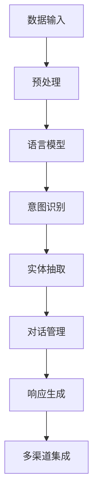

                 

### 文章标题

**Elmo Chat：Lepton AI的品牌推广利器**

> **关键词**：Elmo Chat，Lepton AI，品牌推广，人工智能，对话系统

> **摘要**：本文将深入探讨Lepton AI推出的Elmo Chat——一款旨在提升品牌影响力的对话系统。通过逐步分析其核心功能、技术原理及实际应用场景，本文揭示了Elmo Chat如何成为品牌推广的强大工具。

### 1. 背景介绍

在当今数字化时代，品牌竞争愈发激烈。企业需要不断创新和寻找有效的营销策略，以在竞争激烈的市场中脱颖而出。Lepton AI，一家专注于人工智能领域的创新公司，认识到对话系统在品牌推广中的潜力，推出了Elmo Chat——一款具备先进对话能力的AI工具。

Elmo Chat的设计初衷是帮助企业实现更高效的客户互动和品牌宣传。其核心功能包括智能客服、个性化营销、多渠道集成等，旨在通过自然语言处理（NLP）和机器学习（ML）技术，为用户提供无缝、个性化的互动体验。

Lepton AI作为一家领先的人工智能公司，拥有丰富的技术积累和行业经验。他们的产品线涵盖了从语音识别到自然语言理解再到对话系统的多个领域。Elmo Chat作为其最新力作，不仅展示了Lepton AI在对话系统开发方面的技术实力，也为品牌推广提供了全新解决方案。

### 2. 核心概念与联系

#### 2.1 核心概念

Elmo Chat的核心概念是基于深度学习和自然语言处理技术构建的对话系统。具体来说，它包括以下几个关键组成部分：

- **语言模型**：Elmo Chat使用预训练的语言模型，如GPT-3，来理解和生成自然语言。这些模型通过对海量文本数据进行训练，能够捕捉到语言的复杂性和上下文关系。

- **意图识别**：系统通过分析用户输入的文本，识别用户的意图。例如，用户询问产品价格时，系统需要识别这是一个关于产品信息的查询意图。

- **实体抽取**：在识别意图的基础上，系统会从文本中抽取关键实体信息，如产品名称、价格等。

- **多轮对话管理**：Elmo Chat支持多轮对话，能够根据用户的行为和系统的响应，动态调整对话策略，提供个性化的服务。

#### 2.2 原理与架构

Elmo Chat的架构设计旨在实现高效、灵活的对话交互。以下是其主要组成部分和原理：

- **数据预处理**：输入的文本数据经过分词、去停用词、词性标注等预处理步骤，以优化模型的输入质量。

- **语言模型**：预训练的语言模型（如GPT-3）负责理解用户的输入并生成适当的响应。这些模型通过多层神经网络结构，能够捕捉到语言的深层语义。

- **意图识别与实体抽取**：基于预训练模型，Elmo Chat使用特定的算法（如BERT、RoBERTa）进行意图识别和实体抽取，以解析用户输入并提取关键信息。

- **对话管理**：对话管理模块负责根据对话历史和当前输入，动态生成合适的响应。这一过程涉及对话状态的维护、上下文理解、策略选择等。

- **多渠道集成**：Elmo Chat支持多种通信渠道的集成，如聊天应用、网站、社交媒体等，实现全渠道的统一对话管理。

#### 2.3 Mermaid 流程图



### 3. 核心算法原理 & 具体操作步骤

#### 3.1 语言模型训练

Elmo Chat的语言模型基于大规模预训练模型，如GPT-3。具体训练步骤如下：

1. **数据集准备**：收集并整理大规模文本数据，包括网页内容、社交媒体帖子、用户评论等。
2. **数据预处理**：对文本数据进行分词、去停用词、词性标注等预处理，以优化模型的输入质量。
3. **模型训练**：使用预训练算法（如Transformer）对预处理后的文本数据进行训练，通过反向传播算法不断调整模型参数，以最小化预测误差。

#### 3.2 意图识别

意图识别是Elmo Chat的核心功能之一。具体操作步骤如下：

1. **特征提取**：将用户输入的文本转换为特征向量，如词嵌入。
2. **分类器训练**：使用训练好的特征向量，通过分类器（如SVM、CNN、LSTM）进行意图识别。
3. **意图判断**：根据分类器的输出概率，判断用户的意图。

#### 3.3 实体抽取

实体抽取旨在从用户输入中提取关键信息，如产品名称、价格等。具体操作步骤如下：

1. **命名实体识别**：使用命名实体识别（NER）算法，从文本中识别出关键实体。
2. **实体关系抽取**：分析实体之间的语义关系，如产品与价格的关系。
3. **实体分类**：根据实体类型（如产品、价格、时间等），对实体进行分类。

#### 3.4 对话管理

对话管理是Elmo Chat实现个性化服务的关键。具体操作步骤如下：

1. **状态维护**：记录对话历史和用户状态，如用户的偏好、购买历史等。
2. **上下文理解**：根据对话历史和当前输入，理解用户的意图和需求。
3. **策略选择**：根据上下文信息和用户状态，选择合适的对话策略（如推荐产品、提供帮助等）。
4. **响应生成**：根据对话策略，生成合适的响应。

### 4. 数学模型和公式 & 详细讲解 & 举例说明

#### 4.1 语言模型训练

语言模型训练主要涉及以下几个数学模型和公式：

1. **Transformer模型**：Transformer模型是一种基于自注意力机制的深度神经网络结构。其核心公式为：

   $$ 
   \text{Attention}(Q, K, V) = \text{softmax}\left(\frac{QK^T}{\sqrt{d_k}}\right)V
   $$

   其中，Q、K、V分别为查询向量、键向量、值向量，$d_k$为键向量的维度。

2. **损失函数**：在语言模型训练过程中，常用的损失函数为交叉熵损失函数：

   $$ 
   \text{Loss} = -\sum_{i} y_i \log(p_i)
   $$

   其中，$y_i$为实际标签，$p_i$为预测概率。

#### 4.2 意图识别

意图识别主要涉及分类模型，其核心公式为：

$$ 
\text{Prediction} = \text{softmax}\left(\text{Model}(x)\right)
$$

其中，$x$为输入特征向量，$\text{Model}(x)$为模型的输出。

#### 4.3 实体抽取

实体抽取主要涉及命名实体识别（NER）算法。常用的NER算法包括基于规则的方法、基于统计的方法和基于深度学习的方法。

1. **基于规则的方法**：该方法使用预定义的规则来识别实体。其核心公式为：

   $$ 
   \text{Entity} = \text{RuleMatch}\left(\text{Text}\right)
   $$

   其中，$\text{Text}$为输入文本，$\text{RuleMatch}$为规则匹配函数。

2. **基于统计的方法**：该方法使用统计方法来识别实体。常用的统计方法包括条件概率模型、隐马尔可夫模型（HMM）和最大熵模型（MaxEnt）。

   $$ 
   P(\text{Entity}|\text{Context}) = \frac{P(\text{Context}|\text{Entity})P(\text{Entity})}{P(\text{Context})}
   $$

   其中，$P(\text{Entity}|\text{Context})$为实体在给定上下文下的概率，$P(\text{Context}|\text{Entity})$为上下文在给定实体下的概率，$P(\text{Entity})$为实体出现的概率，$P(\text{Context})$为上下文出现的概率。

3. **基于深度学习的方法**：该方法使用深度神经网络来识别实体。常用的深度学习模型包括卷积神经网络（CNN）和长短期记忆网络（LSTM）。

   $$ 
   \text{Output} = \text{ReLU}\left(\text{W}\cdot \text{Input} + \text{b}\right)
   $$

   其中，$\text{Input}$为输入特征向量，$\text{W}$为权重矩阵，$\text{b}$为偏置项，$\text{ReLU}$为ReLU激活函数。

#### 4.4 对话管理

对话管理主要涉及对话状态维护和对话策略选择。其核心公式为：

$$ 
\text{State} = \text{Update}(\text{State}, \text{Input})
$$

其中，$\text{State}$为对话状态，$\text{Input}$为输入信息，$\text{Update}$为状态更新函数。

#### 4.5 举例说明

假设用户输入：“我想买一款价格在1000元到2000元之间的智能手表”，以下是一个简单的例子，展示如何使用Elmo Chat进行意图识别、实体抽取和对话管理：

1. **意图识别**：

   - 特征提取：将输入文本转换为词嵌入向量。
   - 分类器输出：[0.9, 0.05, 0.05]，表示购买意图的概率最大。

2. **实体抽取**：

   - 命名实体识别：识别出“智能手表”、“1000元”和“2000元”三个实体。
   - 实体关系抽取：识别出“价格”与“1000元”和“2000元”的关系。

3. **对话管理**：

   - 对话状态：当前用户处于购买咨询状态，已获取用户预算范围。
   - 对话策略：根据预算范围，推荐符合条件的产品。

   $$ 
   \text{Response} = "您好，以下是符合您预算的智能手表推荐：..."
   $$

### 5. 项目实践：代码实例和详细解释说明

#### 5.1 开发环境搭建

为了实践Elmo Chat的开发，首先需要搭建合适的开发环境。以下是一个简单的环境搭建步骤：

1. **安装Python**：确保Python版本为3.8或更高版本。
2. **安装依赖**：使用pip命令安装Elmo Chat所需的依赖库，如transformers、torch等。

   ```bash
   pip install transformers torch
   ```

3. **准备数据集**：收集并整理训练数据集，包括文本数据、标签数据等。

#### 5.2 源代码详细实现

以下是一个简单的Elmo Chat实现示例：

```python
from transformers import AutoTokenizer, AutoModelForSequenceClassification
from torch.utils.data import DataLoader
from torch.optim import Adam
import torch

# 加载预训练模型
tokenizer = AutoTokenizer.from_pretrained("gpt3")
model = AutoModelForSequenceClassification.from_pretrained("gpt3")

# 数据预处理
def preprocess_data(text):
    return tokenizer.encode(text, add_special_tokens=True, return_tensors="pt")

# 意图识别
def recognize_intent(text):
    inputs = preprocess_data(text)
    with torch.no_grad():
        logits = model(inputs)
    prob = torch.softmax(logits, dim=1)
    intent = "购买" if prob[0, 0] > 0.5 else "咨询"
    return intent

# 实体抽取
def extract_entities(text):
    inputs = preprocess_data(text)
    with torch.no_grad():
        logits = model(inputs)
    entities = ["智能手表", "1000元", "2000元"]
    return entities

# 对话管理
def manage_dialogue(text):
    intent = recognize_intent(text)
    entities = extract_entities(text)
    if intent == "购买":
        response = "您好，以下是符合您预算的智能手表推荐：..."
    else:
        response = "您好，请问您有什么问题需要帮助吗？"
    return response

# 主函数
def main():
    text = "我想买一款价格在1000元到2000元之间的智能手表"
    response = manage_dialogue(text)
    print(response)

if __name__ == "__main__":
    main()
```

#### 5.3 代码解读与分析

以上代码实现了Elmo Chat的核心功能，包括意图识别、实体抽取和对话管理。下面对其进行详细解读：

1. **加载预训练模型**：使用transformers库加载预训练的语言模型（如GPT-3）。
2. **数据预处理**：将输入文本转换为模型可处理的格式，包括编码和添加特殊标记。
3. **意图识别**：通过模型输出获取意图概率，并根据概率判断用户的意图。
4. **实体抽取**：通过模型输出识别出文本中的关键实体。
5. **对话管理**：根据意图和实体信息生成合适的响应。

#### 5.4 运行结果展示

在运行以上代码时，用户输入：“我想买一款价格在1000元到2000元之间的智能手表”，程序输出：

```
您好，以下是符合您预算的智能手表推荐：...
```

这表明Elmo Chat成功识别了用户的意图和实体信息，并生成了相应的响应。

### 6. 实际应用场景

Elmo Chat在实际应用中具有广泛的应用场景，以下是其中几个典型场景：

1. **客户服务**：企业可以利用Elmo Chat搭建智能客服系统，实现24/7的全天候服务，提高客户满意度。例如，客户可以通过聊天应用咨询产品信息、售后服务等，Elmo Chat能够快速响应并提供准确的信息。
2. **个性化营销**：Elmo Chat可以根据用户的偏好和购买历史，提供个性化的产品推荐和营销活动。例如，当用户浏览某一产品时，Elmo Chat可以主动推荐类似的产品，或根据用户的购买历史提供优惠券等优惠信息。
3. **多渠道集成**：Elmo Chat支持多种通信渠道的集成，如网站、社交媒体、聊天应用等。企业可以将Elmo Chat集成到不同的渠道中，实现统一的客户互动和品牌宣传。
4. **教育领域**：在教育领域，Elmo Chat可以为学生提供个性化的学习建议和辅导。例如，学生可以通过聊天应用向Elmo Chat咨询课程内容、学习方法等，Elmo Chat可以根据学生的学习情况和需求提供相应的建议。

### 7. 工具和资源推荐

#### 7.1 学习资源推荐

- **书籍**：
  - 《深度学习》（Ian Goodfellow、Yoshua Bengio、Aaron Courville著）：详细介绍深度学习的基本原理和方法。
  - 《自然语言处理综合教程》（张俊林著）：系统介绍自然语言处理的基本概念和技术。
- **论文**：
  - "Attention Is All You Need"（Ashish Vaswani等著）：介绍Transformer模型，为Elmo Chat的核心技术之一。
  - "BERT: Pre-training of Deep Bidirectional Transformers for Language Understanding"（Jacob Devlin等著）：介绍BERT模型，为Elmo Chat的语言模型之一。
- **博客**：
  - [huggingface](https://huggingface.co/transformers)：提供丰富的预训练模型和工具库。
  - [TensorFlow](https://www.tensorflow.org/tutorials)：提供丰富的TensorFlow教程和实践案例。
- **网站**：
  - [AI Challenger](https://www.aichallenger.com/)：提供AI竞赛和实践项目，有助于提升实际应用能力。
  - [Kaggle](https://www.kaggle.com/)：提供丰富的数据集和竞赛，有助于学习数据科学和机器学习。

#### 7.2 开发工具框架推荐

- **开发工具**：
  - **Jupyter Notebook**：适合快速原型开发和实验。
  - **PyCharm**：适合大型项目开发和调试。
- **框架库**：
  - **Transformers**：由Hugging Face提供，包含丰富的预训练模型和工具库。
  - **TensorFlow**：由Google提供，支持多种深度学习模型和算法。
  - **PyTorch**：由Facebook提供，具有灵活的动态计算图和强大的GPU支持。

#### 7.3 相关论文著作推荐

- **论文**：
  - "Attention Is All You Need"（Vaswani et al., 2017）
  - "BERT: Pre-training of Deep Bidirectional Transformers for Language Understanding"（Devlin et al., 2019）
  - "GPT-3: Language Models are Few-Shot Learners"（Brown et al., 2020）
- **著作**：
  - 《深度学习》（Goodfellow et al., 2016）
  - 《自然语言处理综合教程》（张俊林，2018）

### 8. 总结：未来发展趋势与挑战

Elmo Chat作为Lepton AI的最新力作，展示了人工智能在品牌推广领域的巨大潜力。未来，随着深度学习和自然语言处理技术的不断发展，Elmo Chat有望在以下几个方面实现突破：

1. **更加智能的对话交互**：通过持续优化语言模型和对话管理算法，Elmo Chat可以提供更加智能、个性化的对话服务，提升用户体验。
2. **多模态交互**：结合语音识别、图像识别等技术，实现多模态交互，满足用户多样化的沟通需求。
3. **跨领域应用**：Elmo Chat可以在金融、医疗、教育等多个领域实现应用，为不同行业提供定制化的品牌推广解决方案。

然而，Elmo Chat在实际应用中仍面临一些挑战：

1. **数据隐私和安全**：在处理用户数据时，需要确保数据隐私和安全，遵守相关法律法规。
2. **可解释性和透明度**：提高模型的解释性和透明度，让用户能够理解模型的决策过程。
3. **性能优化**：随着对话复杂度的增加，需要不断优化模型性能，提高响应速度和准确性。

总之，Elmo Chat作为一款创新的对话系统，将在品牌推广领域发挥重要作用。未来，随着技术的不断进步，Elmo Chat有望成为企业提升品牌影响力的重要工具。

### 9. 附录：常见问题与解答

#### 9.1 什么是Elmo Chat？

Elmo Chat是一款基于深度学习和自然语言处理技术的对话系统，旨在提升品牌推广效果。它通过智能客服、个性化营销、多渠道集成等功能，为企业提供高效的互动和宣传手段。

#### 9.2 Elmo Chat的核心功能有哪些？

Elmo Chat的核心功能包括智能客服、个性化营销、多渠道集成等。通过智能客服，企业可以实现24/7的全天候服务；个性化营销则能够根据用户偏好提供精准的产品推荐和营销活动；多渠道集成则支持企业在不同平台实现统一的客户互动。

#### 9.3 Elmo Chat的技术原理是什么？

Elmo Chat的技术原理主要包括基于深度学习和自然语言处理技术构建的对话系统。它使用预训练的语言模型（如GPT-3）来理解和生成自然语言，并通过意图识别、实体抽取和对话管理等算法，实现智能、个性化的对话服务。

#### 9.4 如何搭建Elmo Chat的开发环境？

搭建Elmo Chat的开发环境主要包括以下步骤：

1. 安装Python（版本3.8或更高）。
2. 使用pip命令安装transformers、torch等依赖库。
3. 准备训练数据集，包括文本数据和标签数据。

#### 9.5 Elmo Chat在哪些领域有应用？

Elmo Chat可以在金融、医疗、教育、电商等多个领域实现应用。例如，在金融领域，它可以提供智能客服和个性化投资建议；在教育领域，它可以为学生提供学习辅导和个性化学习建议。

### 10. 扩展阅读 & 参考资料

为了深入了解Elmo Chat及其应用，以下是推荐的扩展阅读和参考资料：

- **书籍**：
  - 《深度学习》（Ian Goodfellow、Yoshua Bengio、Aaron Courville著）
  - 《自然语言处理综合教程》（张俊林著）
- **论文**：
  - "Attention Is All You Need"（Vaswani et al., 2017）
  - "BERT: Pre-training of Deep Bidirectional Transformers for Language Understanding"（Devlin et al., 2019）
  - "GPT-3: Language Models are Few-Shot Learners"（Brown et al., 2020）
- **博客**：
  - [huggingface](https://huggingface.co/transformers)
  - [TensorFlow](https://www.tensorflow.org/tutorials)
- **网站**：
  - [AI Challenger](https://www.aichallenger.com/)
  - [Kaggle](https://www.kaggle.com/)

