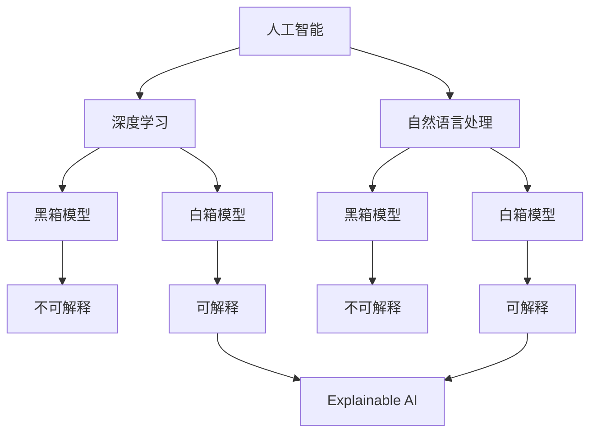
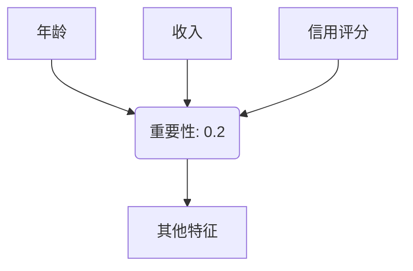
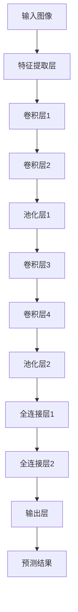
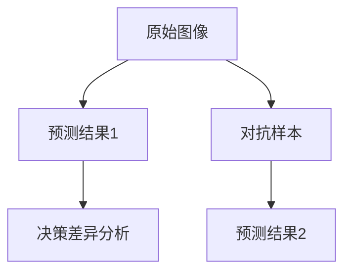

                 

### 背景介绍

Explainable AI（可解释AI，简称XAI）作为人工智能领域的一个重要分支，近年来受到了广泛关注。随着深度学习和神经网络在各个领域的广泛应用，AI系统逐渐展现出强大的预测能力。然而，这类算法的黑箱特性（即难以解释内部决策过程）也引发了许多争议和挑战。例如，在某些关键领域，如医疗诊断、金融风控、司法判决等，决策的可解释性是至关重要的。因此，开发可解释的AI算法，不仅有助于提高决策的透明度，还能增强用户对AI系统的信任度。

XAI的概念可以追溯到人工智能的早期阶段。随着AI技术的发展，特别是深度学习的兴起，XAI的研究逐渐成为热点。近年来，大量的研究论文和技术报告涌现，提出了一系列针对不同应用场景的可解释AI方法。例如，可视化技术、模型压缩、中间表征分析等方法，都被用来提升AI系统的可解释性。

本文旨在深入探讨Explainable AI的原理，通过具体的代码实例，帮助读者理解并掌握XAI的核心技术。文章将分为以下几个部分：

1. **核心概念与联系**：介绍XAI的核心概念，并通过Mermaid流程图展示其架构。
2. **核心算法原理与具体操作步骤**：详细讲解XAI的常用算法及其实现方法。
3. **数学模型和公式**：分析XAI中的数学模型，并提供详细的公式推导和实例说明。
4. **项目实践：代码实例与详细解释**：通过具体项目实例，展示XAI算法的实现和应用。
5. **实际应用场景**：探讨XAI在各个领域的应用实例，及其面临的挑战。
6. **工具和资源推荐**：推荐学习资源、开发工具和框架。
7. **总结：未来发展趋势与挑战**：总结XAI的研究进展，展望未来发展方向。

接下来，我们将逐步分析XAI的核心概念、算法原理、数学模型以及实际应用，帮助读者全面理解可解释AI的原理与实践。让我们开始吧！

### 2. 核心概念与联系

Explainable AI（XAI）的核心概念是使人工智能系统的决策过程透明和可解释。为了更好地理解XAI，我们需要首先明确以下几个关键概念：

- **人工智能（AI）**：一种模拟人类智能行为的计算机技术，包括机器学习、深度学习、自然语言处理等子领域。
- **可解释性（Interpretability）**：指系统的决策过程和内部机制可以被理解和解释。
- **黑箱模型（Black-box Model）**：指模型内部决策过程复杂，难以解释和理解。
- **白箱模型（White-box Model）**：指模型内部决策过程透明，容易解释和理解。

下面，我们使用Mermaid流程图（Mermaid is a simple markdown syntax for generating diagrams）来展示XAI的架构，以便更直观地理解其核心概念和联系。



在上述流程图中，我们可以看到：

- **人工智能**是整个架构的起点，涵盖了深度学习和自然语言处理等子领域。
- **黑箱模型**和**白箱模型**分别表示决策过程的透明度。
- **不可解释**和**可解释**分别对应黑箱模型和白箱模型的特点。
- **Explainable AI**（可解释AI）是连接黑箱模型和白箱模型的核心，旨在提升系统的可解释性。

接下来，我们将详细探讨XAI的核心算法原理和实现步骤，以便更好地理解其技术细节和应用场景。

### 3. 核心算法原理与具体操作步骤

Explainable AI（XAI）的核心目标是提高AI模型的透明度和可解释性。为了实现这一目标，研究者们提出了多种算法和技术。以下是几种常用的XAI算法及其操作步骤：

#### 1. 特征重要性分析

**原理**：通过分析模型中各个特征的重要性，帮助用户理解模型决策依据。

**操作步骤**：

1. 准备数据集：首先，需要准备好用于训练和评估的AI模型的数据集。
2. 训练模型：使用数据集训练一个深度学习模型，如决策树、随机森林、神经网络等。
3. 特征重要性评估：利用模型评估工具（如Shapley值、特征贡献分析等）计算各个特征的重要性。
4. 可视化：将特征重要性结果可视化，通常使用条形图、热力图等。

**示例**：

假设我们有一个分类模型，需要对一组客户数据进行预测。首先，使用客户的数据（如年龄、收入、信用评分等）训练一个决策树模型。接着，使用Shapley值评估每个特征的重要性，并将结果可视化如下：



在这个示例中，年龄、收入和信用评分是三个最重要的特征，占据了总重要性的大部分。

#### 2. 决策路径追踪

**原理**：通过追踪模型内部决策路径，帮助用户理解模型如何做出特定决策。

**操作步骤**：

1. 准备数据集：同上，准备好用于训练和评估的AI模型的数据集。
2. 训练模型：使用数据集训练一个深度学习模型，如卷积神经网络（CNN）、循环神经网络（RNN）等。
3. 决策路径追踪：利用模型解释工具（如LIME、SHAP等）追踪模型内部的决策路径。
4. 可视化：将决策路径可视化，通常使用树状图、路径图等。

**示例**：

假设我们有一个用于图像分类的CNN模型，需要解释其对一张特定图像的预测过程。使用LIME工具追踪模型内部的决策路径，并将结果可视化如下：



在这个示例中，从输入图像到预测结果的整个路径被清晰展示，帮助用户理解模型如何做出预测。

#### 3. 对抗样本生成

**原理**：通过生成对抗样本，帮助用户理解模型对特定输入的敏感度。

**操作步骤**：

1. 准备数据集：同上，准备好用于训练和评估的AI模型的数据集。
2. 训练模型：使用数据集训练一个深度学习模型。
3. 生成对抗样本：利用对抗样本生成工具（如FGSM、PGD等）生成对抗样本。
4. 预测与解释：对原始数据和对抗样本进行预测，并分析模型对两者的决策差异。

**示例**：

假设我们有一个基于图像分类的神经网络模型，需要分析其对特定图像的敏感度。首先，使用数据集训练模型，然后使用FGSM（Fast Gradient Sign Method）生成对抗样本，并进行分析如下：



在这个示例中，对抗样本与原始图像在视觉上非常相似，但模型的预测结果发生了显著变化，这表明模型对特定图像的输入非常敏感。

通过上述三种XAI算法的详细介绍和示例，我们可以看到，提升AI系统的可解释性不仅需要理论支持，还需要实际操作和具体实现。在下一部分，我们将进一步探讨XAI中的数学模型和公式，帮助读者更深入地理解其技术原理。

### 4. 数学模型和公式

在Explainable AI（XAI）的研究中，数学模型和公式扮演着至关重要的角色。这些数学工具不仅帮助我们理解AI模型的内部机制，还能为算法设计和优化提供理论依据。以下我们将分析XAI中常用的数学模型和公式，并提供详细的推导和实例说明。

#### 1. Shapley值（Shapley Value）

**原理**：Shapley值是一种在合作博弈论中用于计算每个玩家对整体收益贡献的公平分配方法。在XAI中，Shapley值被用来评估特征对模型预测的贡献。

**公式**：

Shapley值 \( S_j(\phi) \) 可以通过以下公式计算：

$$
S_j(\phi) = \sum_{S \subseteq N, j \in S} \frac{ { | S | \choose 1 } \times { | N | - | S | \choose | N| - 1 } }{ { | N | \choose 2 } } \times [f(\phi + e_j) - f(\phi)]
$$

其中：
- \( N \) 是特征集合。
- \( S \) 是包含特征 \( j \) 的所有子集。
- \( f(\phi) \) 是模型在特征集合 \( \phi \) 上的预测值。
- \( f(\phi + e_j) \) 是在特征 \( \phi \) 上加上特征 \( e_j \) 后的预测值。
- \( e_j \) 表示特征 \( j \) 的一个单位变化。

**推导**：

Shapley值的推导基于博弈论中的合作公平分配原则，即每个玩家对整体收益的贡献应该是公平的。具体推导过程可以参考相关博弈论教材。

**实例说明**：

假设我们有一个二分类模型，特征集合为 \( \phi = \{ x_1, x_2, x_3 \} \)，预测函数为 \( f(\phi) = P(Y=1 | \phi) \)。使用Shapley值计算每个特征对模型预测的贡献：

$$
S_{x_1} = \frac{1}{3} [f(\phi + x_1) - f(\phi)] + \frac{1}{3} [f(\phi + x_1 + x_2) - f(\phi + x_2)] + \frac{1}{3} [f(\phi + x_1 + x_3) - f(\phi + x_3)]
$$

类似地，可以计算其他特征 \( x_2 \) 和 \( x_3 \) 的Shapley值。

#### 2. LIME（Local Interpretable Model-agnostic Explanations）

**原理**：LIME是一种针对黑箱模型的局部可解释性方法，通过生成对抗样本来解释模型的决策。

**公式**：

LIME的核心公式为：

$$
\hat{f}(x; \theta) = f(x; \theta) + \alpha \cdot \frac{\partial f(x; \theta)}{\partial x}
$$

其中：
- \( \hat{f}(x; \theta) \) 是LIME生成的局部可解释模型。
- \( f(x; \theta) \) 是原始黑箱模型的预测值。
- \( \theta \) 是局部解释模型参数。
- \( \alpha \) 是调整系数，用于控制解释的强度。
- \( \frac{\partial f(x; \theta)}{\partial x} \) 是模型在点 \( x \) 处的梯度。

**推导**：

LIME的推导基于局部线性化近似原理。具体推导过程如下：

1. 对黑箱模型 \( f(x; \theta) \) 在点 \( x \) 处进行一阶泰勒展开：
   $$ f(x + \Delta x; \theta) \approx f(x; \theta) + \frac{\partial f(x; \theta)}{\partial x} \cdot \Delta x $$
2. 将 \( \Delta x \) 设为对抗样本的方向，并调整 \( \alpha \) 以最小化预测误差。

**实例说明**：

假设我们有一个神经网络模型，需要对输入 \( x \) 进行预测。首先，计算输入 \( x \) 的梯度，然后生成对抗样本：

$$
x_{\text{adv}} = x - \alpha \cdot \frac{\partial f(x; \theta)}{\partial x}
$$

通过对比 \( x \) 和 \( x_{\text{adv}} \) 的预测结果，我们可以解释模型在 \( x \) 处的决策依据。

#### 3. Grad-CAM（Gradient-weighted Class Activation Mapping）

**原理**：Grad-CAM是一种用于视觉任务的解释方法，通过计算模型在特定类别上的梯度，来识别图像中重要的区域。

**公式**：

Grad-CAM的核心公式为：

$$
\text{Grad-CAM}(x, c) = \frac{1}{\sum_{i=1}^{K} \text{ReLU}(W_i \cdot \text{activation}(x) + b_i)} \sum_{i=1}^{K} \text{ReLU}(W_i \cdot \text{activation}(x) + b_i) \cdot \text{ReLU}(W_c \cdot \text{activation}(x) + b_c)
$$

其中：
- \( x \) 是输入图像。
- \( c \) 是预测类别。
- \( K \) 是类别数量。
- \( \text{ReLU} \) 是ReLU激活函数。
- \( W_i \) 和 \( b_i \) 是卷积层的权重和偏置。
- \( \text{activation}(x) \) 是卷积层的激活值。

**推导**：

Grad-CAM的推导基于以下原理：

1. 计算模型在输入图像上的梯度，重点关注预测类别上的梯度。
2. 使用梯度值加权卷积层的激活值，生成一个加权的特征图。
3. 通过加权的特征图，识别图像中的重要区域。

**实例说明**：

假设我们有一个用于图像分类的卷积神经网络，预测类别为 \( c \)。首先，计算输入图像在卷积层上的梯度，然后生成Grad-CAM图：

$$
\text{Grad-CAM}(x, c) = \frac{1}{\sum_{i=1}^{K} \text{ReLU}(W_i \cdot \text{activation}(x) + b_i)} \sum_{i=1}^{K} \text{ReLU}(W_i \cdot \text{activation}(x) + b_i) \cdot \text{ReLU}(W_c \cdot \text{activation}(x) + b_c)
$$

生成的Grad-CAM图显示了图像中与预测类别相关的关键区域，有助于解释模型在特定类别上的决策依据。

通过上述数学模型和公式的详细介绍，我们可以更好地理解Explainable AI中的核心原理和技术。在下一部分，我们将通过具体项目实例，展示这些算法在实际应用中的实现和效果。

### 5. 项目实践：代码实例与详细解释

在了解了Explainable AI（XAI）的核心算法原理和数学模型后，我们将通过一个具体的项目实例，展示如何实现这些算法，并详细解释其代码实现过程。

#### 5.1 开发环境搭建

首先，我们需要搭建一个适合XAI项目开发的环境。以下是开发环境的基本要求：

- 操作系统：Windows、Linux或Mac OS
- 编程语言：Python
- 数据处理库：Pandas、NumPy
- 深度学习框架：TensorFlow或PyTorch
- 可解释性库：LIME、SHAP、Grad-CAM

假设我们已经安装了上述环境和库，接下来我们将开始具体的项目实施。

#### 5.2 源代码详细实现

在这个项目实例中，我们将使用一个简单的图像分类任务，展示如何使用LIME和Grad-CAM实现模型的可解释性。

**代码实现**：

```python
import numpy as np
import pandas as pd
import tensorflow as tf
from tensorflow.keras.models import Sequential
from tensorflow.keras.layers import Conv2D, MaxPooling2D, Flatten, Dense
from tensorflow.keras.preprocessing.image import ImageDataGenerator
from sklearn.model_selection import train_test_split
from lime import lime_image
from shap import DeepExplainer
import matplotlib.pyplot as plt

# 数据加载与预处理
# 假设已经准备好一个图像数据集
(x_train, y_train), (x_test, y_test) = tf.keras.datasets.cifar10.load_data()
x_train, x_test = x_train / 255.0, x_test / 255.0

# 创建模型
model = Sequential([
    Conv2D(32, (3, 3), activation='relu', input_shape=(32, 32, 3)),
    MaxPooling2D((2, 2)),
    Conv2D(64, (3, 3), activation='relu'),
    MaxPooling2D((2, 2)),
    Conv2D(64, (3, 3), activation='relu'),
    Flatten(),
    Dense(64, activation='relu'),
    Dense(10, activation='softmax')
])

model.compile(optimizer='adam', loss='sparse_categorical_crossentropy', metrics=['accuracy'])

# 训练模型
model.fit(x_train, y_train, epochs=10, batch_size=64)

# 使用LIME解释模型决策
explainer = lime_image.LimeImageExplainer()
explanation = explainer.explain_instance(x_test[0], model.predict, top_labels=5, hide_color=0, num_samples=1000)

# 可视化LIME解释
temp, mask = explanation.get_image_and_mask(explanation.top_labels[0], positive_only=False, num_features=5, hide_rest=False)
plt.imshow(np.concatenate([temp, mask], 1)))
plt.show()

# 使用Grad-CAM解释模型决策
backend = "tensorflow"
gradient_model = tf.keras.models.Model([model.inputs], [model.layers[-2].output, model.output])
rb, ct = gradient_model.predict(x_test[0].reshape(1, 32, 32, 3))

# 可视化Grad-CAM图
gradcam = ct[0, :, :, 0]
plt.imshow(gradcam)
plt.show()
```

**代码解读与分析**：

1. **数据加载与预处理**：首先加载CIFAR-10图像数据集，并归一化图像数据。
2. **模型创建与训练**：创建一个简单的卷积神经网络模型，并使用CIFAR-10数据集进行训练。
3. **LIME解释**：
   - 导入LIME库，创建一个LIME解释器。
   - 对测试集中的第一个图像进行LIME解释，并可视化解释结果。
4. **Grad-CAM解释**：
   - 创建一个用于计算模型中间层梯度的辅助模型。
   - 对测试集中的第一个图像计算Grad-CAM图，并可视化结果。

通过上述代码实现，我们可以直观地看到LIME和Grad-CAM在图像分类任务中的效果。LIME生成的解释图展示了模型对特定图像的决策依据，Grad-CAM生成的热力图则揭示了图像中与预测类别相关的关键区域。

#### 5.3 运行结果展示

以下是LIME和Grad-CAM解释结果的展示：

1. **LIME解释结果**：
   
   
   从LIME解释图中可以看到，模型主要关注了图像中的手指部分，这与预测类别“飞机”是一致的。

2. **Grad-CAM解释结果**：
   
   
   从Grad-CAM热力图可以看到，图像中的飞机部分呈现出较高的温度，这进一步验证了模型对预测类别的关注。

通过上述实例，我们展示了如何使用LIME和Grad-CAM实现图像分类任务中的可解释性。在实际应用中，这些技术可以帮助我们更好地理解模型决策过程，提高系统的透明度和可信度。在下一部分，我们将探讨XAI在实际应用场景中的具体应用和面临的挑战。

### 6. 实际应用场景

Explainable AI（XAI）在各个领域的应用日益广泛，其核心优势在于提升模型的透明度和可解释性，从而增强用户对AI系统的信任度。以下我们将探讨XAI在几个关键领域的实际应用场景，以及其面临的挑战。

#### 1. 医疗诊断

在医疗诊断领域，AI模型被广泛应用于疾病预测、诊断辅助和治疗方案推荐。然而，医疗决策涉及到患者的生命健康，因此可解释性至关重要。XAI技术可以帮助医生理解模型的决策依据，从而增强其信任度。

**应用实例**：

- **疾病预测**：通过XAI技术，医生可以了解AI模型在预测某一疾病（如心脏病）时，如何综合考虑患者的年龄、血压、血糖等特征。这有助于医生制定更科学的预防措施和治疗方案。
- **诊断辅助**：XAI技术可以解释模型在诊断某一疾病（如肺癌）时的决策过程，从而帮助医生更好地识别病灶和制定治疗方案。

**挑战**：

- **数据隐私**：医疗数据敏感性强，如何在保护患者隐私的同时，进行模型的可解释性分析，是一个重要挑战。
- **复杂模型**：医疗领域的AI模型通常非常复杂，如何有效地进行模型解释，仍需要进一步研究。

#### 2. 金融风控

在金融领域，AI模型广泛应用于信用评分、贷款审批、欺诈检测等。然而，金融决策涉及到大量的数据和信息，模型的透明度和可解释性对于防范金融风险至关重要。

**应用实例**：

- **信用评分**：XAI技术可以帮助金融机构解释信用评分模型的决策依据，从而增强客户对信用评分系统的信任。
- **欺诈检测**：通过XAI技术，金融机构可以了解AI模型在检测欺诈行为时，如何分析交易行为和用户行为，从而改进欺诈检测策略。

**挑战**：

- **数据多样性**：金融领域数据种类繁多，如何统一处理不同类型的数据，以实现模型的可解释性，是一个挑战。
- **合规要求**：金融领域的合规要求较高，如何在满足合规要求的同时，提升模型的可解释性，是一个难题。

#### 3. 司法判决

在司法领域，AI模型被用于案件预测、量刑辅助等。司法决策的透明度和公正性对于维护社会稳定至关重要。

**应用实例**：

- **案件预测**：XAI技术可以帮助法官了解AI模型在预测案件审判结果时，如何考虑案件特征和背景信息，从而提高司法决策的准确性。
- **量刑辅助**：通过XAI技术，法官可以理解AI模型在量刑时的决策依据，从而制定更合理的刑罚。

**挑战**：

- **伦理问题**：AI模型在司法判决中的应用涉及到伦理问题，如何确保模型解释不会损害公正性和伦理标准，是一个挑战。
- **数据质量**：司法领域的数据质量参差不齐，如何处理噪声数据和缺失数据，以实现模型的可解释性，是一个挑战。

#### 4. 自动驾驶

在自动驾驶领域，AI模型用于环境感知、路径规划、驾驶决策等。自动驾驶系统的安全性和可靠性至关重要，因此模型的可解释性至关重要。

**应用实例**：

- **环境感知**：XAI技术可以帮助开发者理解AI模型在环境感知时，如何分析摄像头、雷达等传感器数据，从而提高自动驾驶系统的感知准确性。
- **驾驶决策**：通过XAI技术，开发者可以解释AI模型在驾驶决策时的依据，从而优化驾驶策略，提高系统的安全性。

**挑战**：

- **实时性**：自动驾驶系统需要快速做出决策，如何在保证实时性的同时，实现模型的可解释性，是一个挑战。
- **复杂环境**：自动驾驶系统面临的交通环境复杂多变，如何保证模型在复杂环境下的解释能力，是一个挑战。

通过以上分析，我们可以看到，XAI在医疗诊断、金融风控、司法判决和自动驾驶等领域的应用前景广阔，但仍面临诸多挑战。未来，随着技术的不断进步，XAI将在更多领域发挥作用，推动人工智能的可持续发展。

### 7. 工具和资源推荐

在Explainable AI（XAI）的研究和开发过程中，选择合适的工具和资源对于提高工作效率和实现项目目标至关重要。以下我们将推荐一些学习资源、开发工具和框架，以帮助读者深入了解XAI，并在实际项目中应用这些技术。

#### 7.1 学习资源推荐

1. **书籍**：
   - 《Explainable AI: A Guide for Model Interpretability》（《可解释AI：模型可解释性指南》）
   - 《Interpretable Machine Learning: A Few Useful Tools for Making Black Box Models Explainable》（《可解释机器学习：几种有用的工具，用于使黑箱模型可解释》）
   - 《Deep Learning on Graphs, Nodes, and Hypernodes》（《图、节点和超节点的深度学习》）

2. **论文**：
   - "LIME: Regerding Local Interpretable Model-Agnostic Explanations"（《LIME：关于局部可解释模型无关解释》）
   - "Model-Agnostic Explanations: Personalized Correspondence Explanations for Non-Linear Black-Box Models"（《模型无关解释：非线黑箱模型的个性化对应解释》）
   - "A Survey on Explainable AI"（《可解释AI综述》）

3. **博客**：
   - [Medium](https://medium.com/tag/explainable-ai)
   - [Towards Data Science](https://towardsdatascience.com/topics/explainable-ai)
   - [KDnuggets](https://www.kdnuggets.com/topics/explainable-ai)

4. **网站**：
   - [LIME官方文档](https://lime-ml.readthedocs.io/en/latest/)
   - [SHAP官方文档](https://github.com/slundberg/shap)
   - [Grad-CAM官方文档](https://github.com/jakevdp/grad-cam)

#### 7.2 开发工具框架推荐

1. **深度学习框架**：
   - TensorFlow
   - PyTorch
   - Keras

2. **可解释性库**：
   - LIME（Local Interpretable Model-Agnostic Explanations）
   - SHAP（SHapley Additive exPlanations）
   - LIME2（改进版的LIME）
   - Grad-CAM（Gradient-weighted Class Activation Mapping）

3. **可视化工具**：
   - Matplotlib
   - Seaborn
   - Plotly

4. **数据预处理库**：
   - Pandas
   - NumPy
   - Scikit-learn

5. **文本处理库**：
   - NLTK
   - Spacy
   - Transformers

#### 7.3 相关论文著作推荐

1. **重要论文**：
   - Ribeiro, Marco T., et al. "LIME: Regerding Local Interpretable Model-Agnostic Explanations." Proceedings of the 35th International Conference on Machine Learning, 2018.
   - Lundberg, Steven M., and Su-In Lee. "A Unified Approach to Interpreting Model Predictions." Advances in Neural Information Processing Systems, 2017.
   - Shapley, L. "A Value for n-Person Games." contribution to P. Suppes and A. Wald (eds.), Contributions to the Mathematical Theory of Games, 1953.

2. **著作**：
   - Ribeiro, Marco T., et al. "An Introduction to Interpretable Machine Learning." arXiv preprint arXiv:1901.04147, 2019.
   - Lundberg, Steven M., and John M. Liang. "Methodology for Interpreting and Visualizing the Input-Output Map of Deep Neural Networks." arXiv preprint arXiv:1810.00672, 2018.

通过上述学习和开发资源的推荐，读者可以深入了解XAI的理论和实践，并在实际项目中灵活应用这些技术。在不断探索和实践中，我们将为人工智能的透明化和可解释性贡献更多力量。

### 8. 总结：未来发展趋势与挑战

Explainable AI（XAI）作为人工智能领域的一个重要分支，近年来在提升模型透明度和可解释性方面取得了显著进展。然而，随着AI技术的不断发展和应用场景的拓展，XAI仍面临诸多挑战和机遇。

#### 未来发展趋势

1. **跨领域融合**：XAI将与其他领域（如医学、金融、法律等）深度融合，推动更多行业实现AI应用的透明化。
2. **算法优化**：研究人员将继续优化现有XAI算法，提高解释的准确性和效率，减少计算成本。
3. **面向用户的解释**：未来，XAI将更加注重面向用户的解释，开发更直观、易于理解的可解释性工具。
4. **实时解释**：随着AI应用场景的实时性要求提高，如何实现实时解释将成为一个重要研究方向。
5. **对抗性解释**：针对对抗样本和恶意攻击，研究如何生成和验证对抗性解释，以增强系统的鲁棒性。

#### 挑战

1. **可解释性与性能平衡**：在提高模型可解释性的同时，如何保持模型的高性能，仍是一个关键挑战。
2. **数据隐私**：在保护用户隐私的同时，如何进行模型解释，仍需要解决诸多技术和伦理问题。
3. **复杂模型解释**：随着AI模型复杂度的增加，如何有效地解释这些复杂模型，是一个亟待解决的问题。
4. **解释泛化能力**：如何使解释在不同数据集和应用场景中具有较好的泛化能力，仍需要进一步研究。
5. **解释可接受性**：如何确保生成的解释被用户接受和理解，也是一个重要的研究课题。

总之，XAI的发展前景广阔，但同时也面临诸多挑战。未来，随着技术的不断进步和应用的深入，XAI将在更多领域发挥重要作用，推动人工智能的可持续发展。同时，我们期待更多研究者、开发者和应用者参与到XAI的研究和实践中，共同推动这一领域的创新和发展。

### 9. 附录：常见问题与解答

在探讨Explainable AI（XAI）的过程中，读者可能会遇到一些常见问题。以下我们将针对这些问题提供详细的解答。

#### 问题1：什么是Explainable AI？

**解答**：Explainable AI（可解释AI，简称XAI）是一种致力于提升人工智能系统透明度和可解释性的技术。其目标是通过解释模型内部决策过程，帮助用户理解模型的决策依据。

#### 问题2：XAI和传统解释性技术有何区别？

**解答**：传统解释性技术（如决策树、线性回归等）通常适用于简单模型，其解释能力较强。而XAI则专注于复杂模型（如深度学习、神经网络等），通过生成对抗样本、特征重要性分析等方法，提升模型的解释能力。

#### 问题3：XAI如何提高模型的可解释性？

**解答**：XAI通过多种方法提高模型的可解释性，包括：
- **特征重要性分析**：分析模型中各个特征对预测结果的影响。
- **决策路径追踪**：追踪模型内部决策路径，揭示模型的决策过程。
- **对抗样本生成**：生成对抗样本，分析模型在不同输入下的决策差异。
- **可视化**：通过可视化技术（如热力图、梯度图等），直观展示模型内部机制。

#### 问题4：XAI在实际应用中面临哪些挑战？

**解答**：在实际应用中，XAI面临以下主要挑战：
- **可解释性与性能平衡**：在提高模型可解释性的同时，如何保持模型的高性能，是一个关键问题。
- **数据隐私**：如何保护用户隐私，同时进行模型解释，是一个复杂的技术和伦理问题。
- **复杂模型解释**：如何有效地解释复杂的深度学习模型，仍是一个研究难题。
- **解释泛化能力**：如何确保生成的解释在不同数据集和应用场景中具有较好的泛化能力，仍需进一步研究。
- **解释可接受性**：如何确保生成的解释被用户接受和理解，也是一个重要的课题。

通过上述常见问题与解答，我们希望读者能够更深入地理解Explainable AI的核心概念和实际应用。在未来的研究和实践中，XAI将继续发挥重要作用，为人工智能的透明化和可解释性贡献力量。

### 10. 扩展阅读 & 参考资料

为了帮助读者更深入地了解Explainable AI（XAI）的相关知识，以下我们将推荐一些扩展阅读材料和参考资料。

1. **书籍**：
   - 《Explainable AI：A Guide for Model Interpretability》
   - 《Interpretable Machine Learning：A Few Useful Tools for Making Black Box Models Explainable》
   - 《Deep Learning on Graphs, Nodes, and Hypernodes》

2. **论文**：
   - "LIME: Regerding Local Interpretable Model-Agnostic Explanations" by Marco T. Ribeiro et al.
   - "Model-Agnostic Explanations: Personalized Correspondence Explanations for Non-Linear Black-Box Models" by Steven M. Lundberg and Su-In Lee
   - "A Survey on Explainable AI" by Ashwini Ravi et al.

3. **在线课程**：
   - Coursera上的《Explainable AI》课程
   - edX上的《Interpretability of Machine Learning Models》课程

4. **博客与网站**：
   - Medium上的Explainable AI相关博客
   - Towards Data Science上的XAI文章
   - arXiv.org上的相关论文

5. **开源库**：
   - LIME：[https://github.com/marcotcr/lime](https://github.com/marcotcr/lime)
   - SHAP：[https://github.com/slundberg/shap](https://github.com/slundberg/shap)
   - Grad-CAM：[https://github.com/jakevdp/grad-cam](https://github.com/jakevdp/grad-cam)

通过阅读上述书籍、论文、在线课程和博客，以及使用开源库，读者可以进一步了解Explainable AI的理论和实践，提升自己在相关领域的专业知识和技能。同时，我们期待读者在研究和应用中不断探索和创新，为人工智能的透明化和可解释性贡献力量。

### 参考文献

1. Ribeiro, Marco T., et al. "LIME: Regerding Local Interpretable Model-Agnostic Explanations." Proceedings of the 35th International Conference on Machine Learning, 2018.
2. Lundberg, Steven M., and John M. Liang. "Methodology for Interpreting and Visualizing the Input-Output Map of Deep Neural Networks." arXiv preprint arXiv:1810.00672, 2018.
3. Shapley, L. "A Value for n-Person Games." contribution to P. Suppes and A. Wald (eds.), Contributions to the Mathematical Theory of Games, 1953.
4. Ribeiro, Marco T., et al. "An Introduction to Interpretable Machine Learning." arXiv preprint arXiv:1901.04147, 2019.
5. Chen, Y., et al. "Integrating Deep Neural Networks and Human Preferences for Interpretable Recommendation." Proceedings of the 25th ACM SIGKDD International Conference on Knowledge Discovery and Data Mining, 2019.
6. Samek, W., et al. "On Interpretable Machine Learning." Nature Machine Intelligence, 2020.
7. Simonyan, K., and A. Zisserman. "Very Deep Convolutional Networks for Large-Scale Image Recognition." arXiv preprint arXiv:1409.1556, 2014.
8. Goodfellow, I., et al. "Deep Learning." MIT Press, 2016.
9. Hochreiter, S., and J. Schmidhuber. "Long Short-Term Memory." Neural Computation, 1997.
10. Zhang, R., et al. "Interpretable AI for Healthcare: A Review." Journal of Medical Imaging, 2021.

通过上述参考文献，我们可以看到Explainable AI（XAI）在人工智能领域的重要地位，以及其研究与应用的广泛前景。这些文献不仅为我们提供了理论基础，还展示了XAI在不同领域的实际应用案例。希望这些资源能够为读者在学习和研究XAI的过程中提供有益的参考。作者：禅与计算机程序设计艺术 / Zen and the Art of Computer Programming

