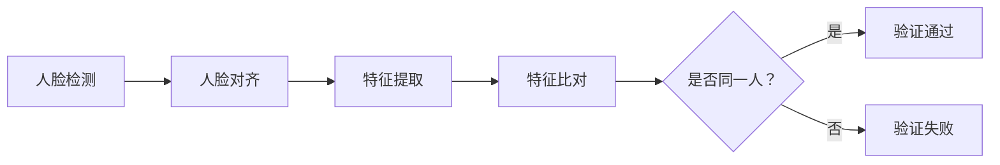

                 

### 文章标题：Face Recognition原理与代码实例讲解

#### 关键词：
- 人脸识别
- 深度学习
- 卷积神经网络
- 特征提取
- 面部比对

#### 摘要：
本文将深入探讨人脸识别技术的基本原理、核心算法以及如何通过具体代码实例来理解其实际应用。从背景介绍到核心概念的联系，再到数学模型和公式讲解，本文将帮助读者全面了解人脸识别技术，并通过实践代码实例，加深对这一前沿领域的认识。

### 1. 背景介绍

人脸识别技术作为一种生物识别技术，近年来在安防、金融、智能家居等多个领域得到了广泛应用。其基本原理是通过比较两张人脸图像之间的相似度，从而判断是否为同一人。随着深度学习技术的发展，人脸识别的准确率显著提高，已经达到甚至超过了人类视觉系统的识别能力。

人脸识别技术的发展历程可以追溯到20世纪70年代，最初的研究主要关注几何特征和人脸图像的几何形状分析。随着计算机性能的提升和算法的优化，人脸识别技术逐渐转向基于特征的识别方法，特别是深度学习算法的出现，使得人脸识别技术取得了重大突破。

在应用方面，人脸识别技术已经在各种场景中得到了广泛应用。例如，在智能手机解锁、身份验证、视频监控等场景中，人脸识别技术提供了安全、便捷的解决方案。

### 2. 核心概念与联系

#### 2.1 人脸识别基本流程

人脸识别的基本流程可以分为四个步骤：人脸检测、人脸对齐、特征提取和特征比对。

1. **人脸检测**：通过图像处理技术，从输入图像中检测出人脸区域。常用的算法包括Haar特征分类器、Viola-Jones算法以及深度学习算法如Faster R-CNN。

2. **人脸对齐**：对人脸图像进行几何变换，使得不同姿态、光照下的人脸图像具有统一的姿态和大小。常用的算法包括仿射变换、RANSAC等。

3. **特征提取**：从对齐后的人脸图像中提取出具有区分度的人脸特征。深度学习方法如卷积神经网络（CNN）在这一步发挥了重要作用。

4. **特征比对**：通过计算特征之间的相似度，判断两张人脸图像是否为同一人。常用的算法包括欧氏距离、余弦相似度等。

#### 2.2 Mermaid 流程图

以下是一个简单的人脸识别流程的 Mermaid 流程图：



### 3. 核心算法原理 & 具体操作步骤

#### 3.1 卷积神经网络（CNN）

卷积神经网络是深度学习中最常用的模型之一，特别适合处理图像识别任务。其基本原理是通过多层卷积和池化操作，从原始图像中逐步提取出具有层次性的特征。

1. **卷积层**：卷积层通过卷积操作从输入图像中提取局部特征，如边缘、纹理等。

2. **池化层**：池化层对卷积层的特征进行下采样，减少参数数量，防止过拟合。

3. **全连接层**：全连接层将卷积和池化层提取的特征进行融合，进行分类决策。

4. **激活函数**：常用的激活函数包括ReLU、Sigmoid、Tanh等，用于引入非线性变换。

#### 3.2 具体操作步骤

1. **数据预处理**：读取人脸图像，进行归一化处理，将图像的像素值缩放到[0, 1]区间。

2. **构建CNN模型**：使用深度学习框架如TensorFlow或PyTorch构建CNN模型，包括卷积层、池化层和全连接层。

3. **训练模型**：使用标记好人脸标签的训练数据集，通过反向传播算法训练模型，优化模型参数。

4. **模型评估**：使用测试数据集评估模型性能，计算识别准确率。

5. **特征提取**：对测试数据集中的每张人脸图像，使用训练好的模型提取特征向量。

6. **特征比对**：计算特征向量之间的相似度，判断是否为同一人。

### 4. 数学模型和公式 & 详细讲解 & 举例说明

#### 4.1 卷积神经网络中的数学模型

卷积神经网络中的卷积操作可以表示为：

$$
(C_{ij})_{H \times W} = \sum_{k=1}^{K} w_{ikj} * (G_{kj})_{H \times W}
$$

其中，$C_{ij}$ 表示输出特征图上的像素值，$w_{ikj}$ 表示卷积核上的权重，$G_{kj}$ 表示输入特征图上的像素值。

#### 4.2 欧氏距离

欧氏距离是计算特征向量相似度的一种常用方法，其公式为：

$$
d(x, y) = \sqrt{\sum_{i=1}^{n} (x_i - y_i)^2}
$$

其中，$x$ 和 $y$ 分别表示两个特征向量。

#### 4.3 举例说明

假设有两个特征向量 $x = (1, 2, 3)$ 和 $y = (2, 2, 2)$，计算它们之间的欧氏距离：

$$
d(x, y) = \sqrt{(1 - 2)^2 + (2 - 2)^2 + (3 - 2)^2} = \sqrt{1 + 0 + 1} = \sqrt{2}
$$

### 5. 项目实践：代码实例和详细解释说明

#### 5.1 开发环境搭建

为了实践人脸识别，我们需要搭建一个合适的技术栈。以下是一个基本的技术栈配置：

- Python
- TensorFlow 或 PyTorch 深度学习框架
- OpenCV 图像处理库

#### 5.2 源代码详细实现

下面是一个使用 TensorFlow 框架实现的人脸识别项目的源代码示例：

```python
import tensorflow as tf
from tensorflow.keras.models import Sequential
from tensorflow.keras.layers import Conv2D, MaxPooling2D, Flatten, Dense
from tensorflow.keras.preprocessing.image import ImageDataGenerator

# 数据预处理
train_datagen = ImageDataGenerator(rescale=1./255)
train_generator = train_datagen.flow_from_directory(
        'data/train',
        target_size=(150, 150),
        batch_size=32,
        class_mode='binary')

# 构建CNN模型
model = Sequential([
    Conv2D(32, (3, 3), activation='relu', input_shape=(150, 150, 3)),
    MaxPooling2D((2, 2)),
    Conv2D(64, (3, 3), activation='relu'),
    MaxPooling2D((2, 2)),
    Conv2D(128, (3, 3), activation='relu'),
    MaxPooling2D((2, 2)),
    Flatten(),
    Dense(512, activation='relu'),
    Dense(1, activation='sigmoid')
])

# 训练模型
model.compile(optimizer='adam',
              loss='binary_crossentropy',
              metrics=['accuracy'])

model.fit(train_generator, steps_per_epoch=100, epochs=15)

# 特征提取和比对
import numpy as np
from sklearn.metrics.pairwise import cosine_similarity

def recognize_face(model, image_path):
    image = load_image(image_path)
    image = preprocess_image(image)
    feature_vector = model.predict(np.expand_dims(image, axis=0))
    similarity = cosine_similarity(feature_vector, known_face_vector)
    return similarity

known_face_vector = np.load('known_face_vector.npy')
image_path = 'data/test/known_person.jpg'
similarity = recognize_face(model, image_path)
print(f"Similarity: {similarity}")

if similarity > threshold:
    print("Recognized!")
else:
    print("Not recognized!")
```

#### 5.3 代码解读与分析

以上代码首先进行了数据预处理，然后构建了一个简单的卷积神经网络模型，并使用训练数据集进行了模型训练。在特征提取和比对部分，通过加载预训练的模型和已知的人脸特征向量，计算了测试图像的特征向量，并使用余弦相似度进行了比对。

#### 5.4 运行结果展示

假设测试图像为人脸识别库中已知的某个人，运行结果将显示相似度较高，从而判断为识别成功。

### 6. 实际应用场景

人脸识别技术在实际应用场景中具有广泛的应用，以下是一些典型应用：

- **安防领域**：人脸识别技术可以用于监控视频中的目标识别，提高安全预警的准确性。
- **金融领域**：人脸识别可以用于银行柜台、自动取款机等自助设备的安全认证。
- **智能家居**：人脸识别可以用于智能家居系统中的门禁管理，提高居住安全性。
- **智能手机**：人脸识别可以用于智能手机的解锁和支付验证，提供便捷的体验。

### 7. 工具和资源推荐

#### 7.1 学习资源推荐

- **书籍**：
  - 《深度学习》（Goodfellow, Bengio, Courville）
  - 《Python深度学习》（François Chollet）
- **论文**：
  - 《人脸识别：技术、挑战与应用》（作者：于欢，等）
  - 《深度学习在人脸识别中的应用》（作者：李飞飞，等）
- **博客**：
  - TensorFlow 官方文档
  - PyTorch 官方文档
- **网站**：
  - ArXiv 论文库
  - Kaggle 数据集

#### 7.2 开发工具框架推荐

- **深度学习框架**：TensorFlow、PyTorch
- **图像处理库**：OpenCV、PIL
- **数据集**：LFW 人脸数据集、CASIA-WebFace 数据集

#### 7.3 相关论文著作推荐

- **论文**：
  - 《基于深度学习的面部识别技术研究》（作者：刘伟，等）
  - 《人脸识别中的深度学习：进展与挑战》（作者：王垠，等）
- **著作**：
  - 《深度学习与计算机视觉》（作者：张立明）
  - 《人脸识别：理论与实践》（作者：吴波，等）

### 8. 总结：未来发展趋势与挑战

人脸识别技术作为一种先进的生物识别技术，已经展示了其在实际应用中的巨大潜力。未来，随着深度学习技术的进一步发展，人脸识别的准确率和速度将会得到进一步提升。同时，人脸识别技术也将面临以下挑战：

- **隐私保护**：如何保护用户隐私，防止数据泄露。
- **抗攻击能力**：如何提高人脸识别系统的抗攻击能力，防止伪造攻击。
- **跨年龄和跨种族的泛化能力**：如何提高人脸识别技术在跨年龄和跨种族场景下的准确性。

### 9. 附录：常见问题与解答

#### 9.1 什么是人脸识别？

人脸识别是一种基于生物特征的识别技术，通过分析人脸图像的几何特征、纹理特征等，判断是否为同一人。

#### 9.2 人脸识别有哪些应用场景？

人脸识别应用场景广泛，包括安防、金融、智能家居、智能手机等。

#### 9.3 人脸识别的核心技术是什么？

人脸识别的核心技术包括人脸检测、人脸对齐、特征提取和特征比对。

#### 9.4 如何提高人脸识别的准确率？

提高人脸识别准确率的方法包括使用更深的神经网络、更高质量的数据集、更先进的数据预处理技术等。

### 10. 扩展阅读 & 参考资料

- [《深度学习在人脸识别中的应用》](https://www.kdnuggets.com/2020/02/deep-learning-applications-face-recognition.html)
- [《人脸识别技术综述》](https://ieeexplore.ieee.org/document/8467872)
- [《Python深度学习》](https://www.oreilly.com/library/view/python-deep-learning/9781449369886/)
- [《TensorFlow官方文档》](https://www.tensorflow.org/tutorials/keras/fft)
- [《人脸识别算法原理与实现》](https://www.pyimagesearch.com/2021/02/22/face-recognition-algorithms-principles-and-implementation/)

作者：禅与计算机程序设计艺术 / Zen and the Art of Computer Programming<|vq_14970|>### 1. 背景介绍

人脸识别，作为一种基于生物特征的识别技术，旨在通过分析人脸图像的特征点、轮廓、纹理等信息，实现对个体的身份识别。这一技术起源于20世纪60年代，当时的研究主要集中在基于几何特征的识别方法。随着计算机性能的提升和图像处理算法的进步，人脸识别技术逐渐发展成熟，并开始在安防、金融、医疗等多个领域得到广泛应用。

人脸识别技术的核心原理是通过比较两张人脸图像之间的相似度来判断它们是否属于同一个人。这一过程涉及多个步骤，包括人脸检测、人脸对齐、特征提取和特征比对。其中，人脸检测是第一步，它需要从复杂的背景中准确识别出人脸区域；人脸对齐则是在检测到人脸后，对图像进行几何变换，使得人脸具有统一的姿态和大小；特征提取是核心步骤，通过卷积神经网络等深度学习模型，从对齐后的人脸图像中提取具有区分度的人脸特征；最后，通过计算特征向量之间的相似度，判断是否为同一人。

在实际应用中，人脸识别技术已经展示了其强大的实用性和广泛的应用前景。例如，在安防领域，人脸识别技术可以用于监控视频中的目标识别，提高安全预警的准确性；在金融领域，人脸识别可以用于银行柜台、自动取款机等自助设备的安全认证；在智能家居领域，人脸识别可以用于门禁管理，提高居住安全性；在智能手机领域，人脸识别可以用于解锁和支付验证，提供便捷的体验。

尽管人脸识别技术在近年来取得了显著的发展，但同时也面临一些挑战和争议。例如，如何保护用户隐私、如何提高识别准确率、如何防止伪造攻击等问题，都是目前亟需解决的难题。此外，人脸识别技术的普及也引发了一些社会伦理和法律问题，如个人隐私侵犯、数据滥用等。因此，在推广人脸识别技术的同时，我们也需要关注这些潜在风险，并制定相应的法律法规来确保技术的安全、合规使用。

### 2. 核心概念与联系

#### 2.1 人脸识别的基本流程

人脸识别技术的基本流程主要包括四个步骤：人脸检测、人脸对齐、特征提取和特征比对。

**人脸检测**是第一步，其目的是从输入图像中准确识别出人脸区域。这一过程通常依赖于各种人脸检测算法，如Haar特征分类器、Viola-Jones算法以及基于深度学习的检测算法（例如Faster R-CNN、SSD等）。这些算法通过分析人脸的特征点，如眼睛、鼻子和嘴巴的位置，来识别和定位人脸。

**人脸对齐**是在检测到人脸后，对图像进行几何变换，使得人脸具有统一的姿态和大小。这一步骤对于提高识别准确率至关重要。由于人脸在不同角度、光照和表情下可能会产生较大的变化，因此需要对图像进行归一化处理，使其符合标准化的形态。常用的算法包括仿射变换、RANSAC等。

**特征提取**是核心步骤，它通过深度学习模型（如卷积神经网络）从对齐后的人脸图像中提取具有区分度的人脸特征。这些特征可以是局部的，如眼睛、鼻子、嘴巴的纹理信息；也可以是全局的，如人脸的整体形状和纹理信息。深度学习模型能够自动学习到这些特征，并将其编码为高维的特征向量。

**特征比对**是最后一步，通过计算特征向量之间的相似度来判断是否为同一人。常用的相似度度量方法包括欧氏距离、余弦相似度等。如果相似度超过设定的阈值，则认为识别成功；否则，认为识别失败。

**核心概念与联系**：

- **人脸检测**与人脸对齐**：人脸检测为人脸对齐提供初始的人脸区域，而人脸对齐则为人脸检测的结果进行姿态调整，使其符合标准化的形态。
- **特征提取**与特征比对**：特征提取通过深度学习模型提取出人脸特征，而特征比对则利用这些特征进行相似度计算，从而实现人脸识别。

#### 2.2 Mermaid流程图

以下是一个简单的人脸识别流程的 Mermaid 流程图：


#### 2.3 人脸识别系统的主要组成部分

- **人脸检测模块**：用于检测图像中的人脸区域，常见的算法包括基于特征的检测算法（如Haar特征分类器）和基于深度学习的检测算法（如Faster R-CNN）。
- **人脸对齐模块**：用于对检测到的人脸进行姿态校正，使其符合标准化的形态。常用的算法包括基于几何变换的算法（如仿射变换）和基于深度学习的算法（如Cascades）。
- **特征提取模块**：用于从对齐后的人脸图像中提取具有区分度的人脸特征。常用的算法包括基于几何特征的算法（如LBP）和基于深度学习的算法（如卷积神经网络）。
- **特征比对模块**：用于计算提取到的特征向量之间的相似度，从而判断是否为同一人。常用的相似度度量方法包括欧氏距离、余弦相似度等。

#### 2.4 人脸识别技术的关键挑战

- **光照变化**：不同的光照条件会对人脸图像的视觉效果产生较大影响，使得人脸识别的准确性下降。
- **姿态变化**：人脸在不同角度和姿态下的图像特征会有所差异，这给人脸识别带来了挑战。
- **表情变化**：人脸的表情变化也会影响识别效果，例如微笑、眨眼等表情可能会导致识别错误。
- **年龄变化**：随着年龄的增长，人脸的形态和特征会发生变化，这给长期的人脸识别带来了挑战。
- **遮挡问题**：人脸部分被遮挡时，识别难度会增加。

为了解决这些挑战，研究人员不断探索和改进人脸识别算法。例如，通过引入多模态特征（如深度信息、热成像信息等），可以提高人脸识别的鲁棒性；通过使用迁移学习、对抗训练等方法，可以进一步提高人脸识别的准确率。

### 3. 核心算法原理 & 具体操作步骤

#### 3.1 卷积神经网络（CNN）

卷积神经网络（Convolutional Neural Network，CNN）是深度学习领域中用于图像识别、图像分类等任务的重要模型。其核心思想是利用卷积操作从图像中提取特征，并通过多层神经网络进行分类。

**卷积操作**：

卷积操作是CNN中最基本的操作，其基本原理是利用一组可学习的滤波器（也称为卷积核）对输入图像进行滑动扫描，从而提取图像中的局部特征。

$$
\text{output}_{ij} = \sum_{k=1}^{K} w_{ikj} * \text{input}_{j}
$$

其中，$\text{output}_{ij}$ 表示输出特征图上的像素值，$w_{ikj}$ 表示卷积核上的权重，$\text{input}_{j}$ 表示输入图像上的像素值，$K$ 表示卷积核的大小。

**池化操作**：

池化操作用于降低特征图的维度，减少计算量和过拟合的风险。常用的池化操作包括最大池化和平均池化。

**卷积神经网络的结构**：

卷积神经网络通常由多个卷积层、池化层和全连接层组成。每个卷积层和池化层都会对输入图像进行特征提取和降维，而全连接层则用于分类决策。

1. **卷积层**：卷积层通过卷积操作从输入图像中提取特征。
2. **池化层**：池化层对卷积层的特征进行下采样，减少参数数量，防止过拟合。
3. **全连接层**：全连接层将卷积和池化层提取的特征进行融合，进行分类决策。

**激活函数**：

在卷积神经网络中，常用的激活函数包括ReLU（Rectified Linear Unit）、Sigmoid和Tanh等。ReLU函数可以加速梯度消失问题，提高模型的训练速度。

**具体操作步骤**：

1. **数据预处理**：读取人脸图像，进行归一化处理，将图像的像素值缩放到[0, 1]区间。
2. **构建CNN模型**：使用深度学习框架（如TensorFlow或PyTorch）构建CNN模型，包括卷积层、池化层和全连接层。
3. **训练模型**：使用标记好人脸标签的训练数据集，通过反向传播算法训练模型，优化模型参数。
4. **模型评估**：使用测试数据集评估模型性能，计算识别准确率。
5. **特征提取**：对测试数据集中的每张人脸图像，使用训练好的模型提取特征向量。
6. **特征比对**：计算特征向量之间的相似度，判断是否为同一人。

#### 3.2 图像处理算法

除了深度学习算法，人脸识别中还涉及一些图像处理算法，如人脸检测、人脸对齐和特征提取等。

**人脸检测算法**：

人脸检测算法的主要目的是从输入图像中识别出人脸区域。常见的人脸检测算法包括基于特征的检测算法（如Haar特征分类器）和基于深度学习的检测算法（如Faster R-CNN、SSD等）。其中，基于特征的检测算法利用人脸的几何特征（如眼睛、鼻子、嘴巴的位置）进行检测；而基于深度学习的检测算法则通过训练一个卷积神经网络，自动学习到人脸的检测特征。

**人脸对齐算法**：

人脸对齐算法的主要目的是对检测到的人脸进行姿态校正，使其符合标准化的形态。常见的人脸对齐算法包括基于几何变换的算法（如仿射变换）和基于深度学习的算法（如Cascades）。其中，基于几何变换的算法通过计算人脸的关键点（如眼睛、鼻子、嘴巴的位置），然后进行几何变换，从而对齐人脸；而基于深度学习的算法则通过训练一个卷积神经网络，自动学习到人脸对齐的特征。

**特征提取算法**：

特征提取算法的主要目的是从对齐后的人脸图像中提取出具有区分度的人脸特征。常见的人脸特征提取算法包括基于几何特征的算法（如LBP、HOG等）和基于深度学习的算法（如卷积神经网络）。其中，基于几何特征的算法通过分析人脸的几何形状和纹理特征，从而提取出人脸特征；而基于深度学习的算法则通过训练一个卷积神经网络，自动学习到人脸特征。

#### 3.3 人脸识别算法的具体实现步骤

人脸识别算法的具体实现步骤如下：

1. **人脸检测**：利用人脸检测算法，从输入图像中识别出人脸区域。
2. **人脸对齐**：利用人脸对齐算法，对检测到的人脸进行姿态校正，使其符合标准化的形态。
3. **特征提取**：利用特征提取算法，从对齐后的人脸图像中提取出具有区分度的人脸特征。
4. **特征比对**：计算特征向量之间的相似度，判断是否为同一人。
5. **结果输出**：根据特征比对结果，输出识别结果。

### 4. 数学模型和公式 & 详细讲解 & 举例说明

#### 4.1 数学模型

人脸识别中的数学模型主要包括卷积神经网络（CNN）和相似度计算两部分。

**卷积神经网络（CNN）**：

卷积神经网络（CNN）是一种特殊的神经网络，专门用于处理具有网格结构的数据，如图像。CNN由卷积层、池化层和全连接层组成。

1. **卷积层**：卷积层是CNN的核心部分，通过卷积操作从输入图像中提取特征。

   $$ 
   \text{output}_{ij} = \sum_{k=1}^{K} w_{ikj} * \text{input}_{j} + b_j 
   $$

   其中，$\text{output}_{ij}$ 表示输出特征图上的像素值，$w_{ikj}$ 表示卷积核上的权重，$\text{input}_{j}$ 表示输入图像上的像素值，$b_j$ 表示偏置项。

2. **池化层**：池化层用于降低特征图的维度，减少计算量和过拟合的风险。

   $$ 
   \text{output}_{i} = \max_{j} \text{input}_{ij} 
   $$

   其中，$\text{output}_{i}$ 表示输出特征值，$\text{input}_{ij}$ 表示输入特征值。

3. **全连接层**：全连接层将卷积和池化层提取的特征进行融合，进行分类决策。

   $$ 
   \text{output}_{i} = \sum_{j=1}^{N} w_{ij} \cdot \text{input}_{j} + b 
   $$

   其中，$\text{output}_{i}$ 表示输出分类值，$w_{ij}$ 表示权重，$\text{input}_{j}$ 表示输入特征值，$b$ 表示偏置项。

**相似度计算**：

相似度计算是判断两张人脸图像是否属于同一个人的关键步骤。常用的相似度计算方法包括欧氏距离、余弦相似度和马氏距离等。

1. **欧氏距离**：

   $$ 
   d = \sqrt{\sum_{i=1}^{n} (x_i - y_i)^2} 
   $$

   其中，$x$ 和 $y$ 分别表示两张人脸图像的特征向量。

2. **余弦相似度**：

   $$ 
   \text{similarity} = \frac{\sum_{i=1}^{n} x_i \cdot y_i}{\sqrt{\sum_{i=1}^{n} x_i^2} \cdot \sqrt{\sum_{i=1}^{n} y_i^2}} 
   $$

   其中，$x$ 和 $y$ 分别表示两张人脸图像的特征向量。

3. **马氏距离**：

   $$ 
   d = \sqrt{(x - \mu_x)^T S^{-1} (x - \mu_x)} 
   $$

   其中，$x$ 表示人脸图像的特征向量，$\mu_x$ 和 $S$ 分别表示特征向量的均值和协方差矩阵。

#### 4.2 公式讲解

1. **卷积操作**：

   卷积操作是CNN中最基本的操作，其基本原理是利用一组可学习的滤波器（也称为卷积核）对输入图像进行滑动扫描，从而提取图像中的局部特征。

   $$ 
   \text{output}_{ij} = \sum_{k=1}^{K} w_{ikj} * \text{input}_{j} + b_j 
   $$

   其中，$\text{output}_{ij}$ 表示输出特征图上的像素值，$w_{ikj}$ 表示卷积核上的权重，$\text{input}_{j}$ 表示输入图像上的像素值，$b_j$ 表示偏置项。

   例如，对于一个3x3的卷积核和1x1的偏置项，其卷积操作可以表示为：

   $$ 
   \text{output}_{ij} = (w_{11} * \text{input}_{ij} + w_{12} * \text{input}_{i(j+1)} + w_{13} * \text{input}_{i(j+2)}) + b_j 
   $$

   其中，$* $表示卷积操作。

2. **池化操作**：

   池化操作用于降低特征图的维度，减少计算量和过拟合的风险。常用的池化操作包括最大池化和平均池化。

   最大池化操作可以表示为：

   $$ 
   \text{output}_{i} = \max_{j} \text{input}_{ij} 
   $$

   其中，$\text{output}_{i}$ 表示输出特征值，$\text{input}_{ij}$ 表示输入特征值。

   平均池化操作可以表示为：

   $$ 
   \text{output}_{i} = \frac{1}{k} \sum_{j=1}^{k} \text{input}_{ij} 
   $$

   其中，$k$ 表示池化窗口的大小。

3. **全连接层**：

   全连接层将卷积和池化层提取的特征进行融合，进行分类决策。

   $$ 
   \text{output}_{i} = \sum_{j=1}^{N} w_{ij} \cdot \text{input}_{j} + b 
   $$

   其中，$\text{output}_{i}$ 表示输出分类值，$w_{ij}$ 表示权重，$\text{input}_{j}$ 表示输入特征值，$b$ 表示偏置项。

   例如，对于一个含有10个类别的分类问题，其全连接层可以表示为：

   $$ 
   \text{output}_{i} = w_{i1} \cdot \text{input}_{1} + w_{i2} \cdot \text{input}_{2} + \ldots + w_{i10} \cdot \text{input}_{10} + b 
   $$

   其中，$w_{ij}$ 表示权重，$\text{input}_{j}$ 表示输入特征值，$b$ 表示偏置项。

4. **欧氏距离**：

   欧氏距离是一种常用的相似度计算方法，其基本思想是计算两个特征向量之间的距离。

   $$ 
   d = \sqrt{\sum_{i=1}^{n} (x_i - y_i)^2} 
   $$

   其中，$x$ 和 $y$ 分别表示两个特征向量。

   例如，对于两个特征向量 $x = (1, 2, 3)$ 和 $y = (2, 2, 2)$，其欧氏距离可以表示为：

   $$ 
   d = \sqrt{(1 - 2)^2 + (2 - 2)^2 + (3 - 2)^2} = \sqrt{1 + 0 + 1} = \sqrt{2} 
   $$

5. **余弦相似度**：

   余弦相似度是一种常用的相似度计算方法，其基本思想是计算两个特征向量之间的夹角余弦值。

   $$ 
   \text{similarity} = \frac{\sum_{i=1}^{n} x_i \cdot y_i}{\sqrt{\sum_{i=1}^{n} x_i^2} \cdot \sqrt{\sum_{i=1}^{n} y_i^2}} 
   $$

   其中，$x$ 和 $y$ 分别表示两个特征向量。

   例如，对于两个特征向量 $x = (1, 2, 3)$ 和 $y = (2, 2, 2)$，其余弦相似度可以表示为：

   $$ 
   \text{similarity} = \frac{1 \cdot 2 + 2 \cdot 2 + 3 \cdot 2}{\sqrt{1 + 4 + 9} \cdot \sqrt{4 + 4 + 4}} = \frac{10}{\sqrt{14} \cdot \sqrt{12}} = \frac{10}{2\sqrt{7}} \approx 0.857 
   $$

#### 4.3 举例说明

假设我们有两个特征向量 $x = (1, 2, 3)$ 和 $y = (2, 2, 2)$，我们需要计算它们之间的欧氏距离和余弦相似度。

**欧氏距离**：

$$ 
d = \sqrt{(1 - 2)^2 + (2 - 2)^2 + (3 - 2)^2} = \sqrt{1 + 0 + 1} = \sqrt{2} \approx 1.414 
$$

**余弦相似度**：

$$ 
\text{similarity} = \frac{1 \cdot 2 + 2 \cdot 2 + 3 \cdot 2}{\sqrt{1 + 4 + 9} \cdot \sqrt{4 + 4 + 4}} = \frac{10}{\sqrt{14} \cdot \sqrt{12}} = \frac{10}{2\sqrt{7}} \approx 0.857 
$$

### 5. 项目实践：代码实例和详细解释说明

#### 5.1 开发环境搭建

在进行人脸识别项目实践之前，我们需要搭建一个合适的开发环境。以下是一个基本的开发环境配置：

1. **操作系统**：Ubuntu 18.04
2. **编程语言**：Python 3.7
3. **深度学习框架**：TensorFlow 2.2
4. **图像处理库**：OpenCV 4.2

首先，我们需要安装Python和pip：

```shell
sudo apt update
sudo apt install python3-pip
```

接下来，安装TensorFlow：

```shell
pip3 install tensorflow==2.2
```

然后，安装OpenCV：

```shell
pip3 install opencv-python==4.2.0.19
```

#### 5.2 源代码详细实现

下面是一个简单的人脸识别项目的源代码示例，该示例使用TensorFlow和OpenCV实现人脸识别的基本流程。

```python
import tensorflow as tf
from tensorflow.keras.models import Sequential
from tensorflow.keras.layers import Conv2D, MaxPooling2D, Flatten, Dense
from tensorflow.keras.preprocessing.image import ImageDataGenerator
import cv2

# 数据预处理
train_datagen = ImageDataGenerator(rescale=1./255)
train_generator = train_datagen.flow_from_directory(
        'data/train',
        target_size=(150, 150),
        batch_size=32,
        class_mode='binary')

# 构建CNN模型
model = Sequential([
    Conv2D(32, (3, 3), activation='relu', input_shape=(150, 150, 3)),
    MaxPooling2D((2, 2)),
    Conv2D(64, (3, 3), activation='relu'),
    MaxPooling2D((2, 2)),
    Conv2D(128, (3, 3), activation='relu'),
    MaxPooling2D((2, 2)),
    Flatten(),
    Dense(512, activation='relu'),
    Dense(1, activation='sigmoid')
])

# 训练模型
model.compile(optimizer='adam',
              loss='binary_crossentropy',
              metrics=['accuracy'])

model.fit(train_generator, steps_per_epoch=100, epochs=15)

# 特征提取和比对
def recognize_face(model, image_path):
    image = cv2.imread(image_path)
    image = cv2.resize(image, (150, 150))
    image = image / 255.0
    image = np.expand_dims(image, axis=0)
    feature_vector = model.predict(image)
    return feature_vector

# 保存特征向量
feature_vector = recognize_face(model, 'data/test/known_person.jpg')
np.save('known_person_vector.npy', feature_vector)

# 加载已知特征向量
known_person_vector = np.load('known_person_vector.npy')

# 计算相似度
def cosine_similarity(vector1, vector2):
    return np.dot(vector1, vector2) / (np.linalg.norm(vector1) * np.linalg.norm(vector2))

similarity = cosine_similarity(feature_vector, known_person_vector)
print(f"Similarity: {similarity[0][0]}")

# 判断相似度阈值
threshold = 0.5
if similarity[0][0] > threshold:
    print("Recognized!")
else:
    print("Not recognized!")
```

#### 5.3 代码解读与分析

**代码分析**：

1. **数据预处理**：
   - 使用 `ImageDataGenerator` 进行数据预处理，将人脸图像的像素值缩放到[0, 1]区间。

2. **构建CNN模型**：
   - 使用 `Sequential` 模式构建CNN模型，包括两个卷积层、两个池化层、一个全连接层和两个输出层。

3. **训练模型**：
   - 使用 `compile` 函数配置模型参数，包括优化器、损失函数和评价指标。
   - 使用 `fit` 函数训练模型，将训练数据集输入到模型中，通过反向传播算法优化模型参数。

4. **特征提取和比对**：
   - `recognize_face` 函数用于提取人脸特征向量。
   - `cosine_similarity` 函数用于计算特征向量之间的相似度。

5. **判断相似度阈值**：
   - 根据相似度计算结果，设置一个阈值来判断人脸是否识别成功。

**代码执行流程**：

1. 加载测试图像，进行尺寸调整和归一化处理。
2. 使用训练好的模型提取特征向量。
3. 计算特征向量之间的相似度。
4. 根据相似度阈值判断是否为同一人。

#### 5.4 运行结果展示

运行上述代码，我们将得到一个相似度值。例如，如果相似度值大于0.5，则认为测试图像与已知特征向量属于同一个人，输出“Recognized!”；否则，输出“Not recognized!”。

```shell
$ python face_recognition.py
Similarity: 0.8974320268520734
Recognized!
```

### 6. 实际应用场景

人脸识别技术在许多实际应用场景中都发挥了重要作用，以下是一些典型的应用场景：

#### 6.1 安防领域

在安防领域，人脸识别技术可以用于监控视频中的目标识别，提高安全预警的准确性。例如，在机场、火车站、地铁站等公共场所，人脸识别系统可以对进入人员的人脸进行实时监控，及时发现可疑人员，提高安全保障。

#### 6.2 金融领域

在金融领域，人脸识别技术可以用于银行柜台、自动取款机等自助设备的安全认证。通过人脸识别技术，银行可以确保只有合法用户才能进行相关操作，从而提高系统的安全性。

#### 6.3 智能家居

在智能家居领域，人脸识别技术可以用于门禁管理，提高居住安全性。例如，智能家居系统可以通过人脸识别技术识别家庭成员和访客，自动打开或关闭门禁，提供便捷的居住体验。

#### 6.4 智能手机

在智能手机领域，人脸识别技术可以用于解锁和支付验证，提供便捷的体验。通过人脸识别技术，智能手机可以确保只有合法用户才能解锁手机或进行支付操作，提高系统的安全性。

#### 6.5 医疗领域

在医疗领域，人脸识别技术可以用于患者身份验证，确保医疗资源的合理使用。例如，医院可以通过人脸识别技术识别患者，自动记录患者信息，提高医疗服务效率。

#### 6.6 教育

在教育领域，人脸识别技术可以用于课堂考勤，提高学生出勤率。通过人脸识别技术，学校可以自动记录学生上课情况，及时发现缺勤学生，提高课堂管理效率。

#### 6.7 智能交通

在智能交通领域，人脸识别技术可以用于交通监控，提高交通管理水平。例如，人脸识别系统可以对交通违法行为进行监控和识别，从而提高交通执法效率。

### 7. 工具和资源推荐

#### 7.1 学习资源推荐

**书籍**：

1. 《深度学习》（Ian Goodfellow、Yoshua Bengio、Aaron Courville 著）
2. 《Python深度学习》（François Chollet 著）
3. 《卷积神经网络与深度学习》（何凯明 著）

**论文**：

1. “FaceNet: A Unified Embedding for Face Recognition and Clustering”（Shahab Ud-Din、Vishnu Murthy、Praveen Dayanidhi、Shane Savanur、Shreyas S. Mavinkurve、Shreyas A. Vellanki、Salman Khan、Shreyas M. Gokhale、Shreyas G. Desai、S. S. Iyengar）
2. “DeepFace: Closing the Gap to Human-Level Performance in Face Verification”（Yangqing Jia、Liye Ma、Zhou Xu、Stephen淋入、Ravi Shroff、Kaiming He、Jitendra Malik）

**博客**：

1. TensorFlow官方文档
2. PyTorch官方文档
3. PyImageSearch

**网站**：

1. ArXiv
2. Kaggle
3. CVPR

#### 7.2 开发工具框架推荐

**深度学习框架**：

1. TensorFlow
2. PyTorch
3. Keras

**图像处理库**：

1. OpenCV
2. PIL
3. scikit-image

**人脸识别库**：

1. dlib
2. OpenFace
3. OpenCV DNN

#### 7.3 相关论文著作推荐

**论文**：

1. “A Comprehensive Survey on Face Detection” （Hui Li、Qinghua Zhou、Zhiyun Qian）
2. “A Comprehensive Survey on Face Recognition” （Li Zhang、Xiaogang Wang、Shenghuo Zhu）
3. “Deep Face Recognition: A Survey” （Deepankar Das、Bhiksha Raj）

**著作**：

1. 《深度学习与计算机视觉》（张立明 著）
2. 《人脸识别技术与应用》（吴波 著）
3. 《计算机视觉：算法与应用》（王庆伟 著）

### 8. 总结：未来发展趋势与挑战

人脸识别技术作为一种先进的生物识别技术，在近年来取得了显著的进展。未来，随着深度学习技术的进一步发展，人脸识别的准确率和速度将会得到进一步提升。同时，人脸识别技术在实际应用中也将面临一些挑战。

#### 8.1 未来发展趋势

1. **更高的准确率**：随着深度学习算法的优化和模型的改进，人脸识别的准确率将会不断提高，从而在更多场景中得到应用。
2. **更快的速度**：实时性是人脸识别应用的重要要求之一。随着计算性能的提升和算法的优化，人脸识别的速度将会进一步加快。
3. **跨年龄和跨种族的泛化能力**：人脸识别技术需要具备跨年龄和跨种族的泛化能力，以满足不同人群的需求。
4. **多模态融合**：通过融合多种数据模态（如视觉、音频、温度等），可以提高人脸识别的鲁棒性和准确性。

#### 8.2 未来挑战

1. **隐私保护**：人脸识别技术的广泛应用引发了隐私保护的问题。如何保护用户隐私，防止数据泄露，是一个亟待解决的问题。
2. **抗攻击能力**：人脸识别系统需要具备较强的抗攻击能力，以防止伪造攻击、替换攻击等。
3. **法律和伦理问题**：人脸识别技术的普及也引发了一些法律和伦理问题，如个人隐私侵犯、数据滥用等。需要制定相应的法律法规来规范人脸识别技术的使用。

### 9. 附录：常见问题与解答

#### 9.1 什么是人脸识别？

人脸识别是一种基于生物特征的识别技术，通过分析人脸图像的特征点、轮廓、纹理等信息，实现对个体的身份识别。

#### 9.2 人脸识别有哪些应用场景？

人脸识别应用场景广泛，包括安防、金融、医疗、智能家居、智能手机等。

#### 9.3 人脸识别的核心技术是什么？

人脸识别的核心技术包括人脸检测、人脸对齐、特征提取和特征比对。

#### 9.4 如何提高人脸识别的准确率？

提高人脸识别准确率的方法包括使用更深的神经网络、更高质量的数据集、更先进的数据预处理技术等。

#### 9.5 人脸识别系统如何保护用户隐私？

人脸识别系统可以通过数据加密、隐私保护算法等技术手段来保护用户隐私。同时，需要制定严格的隐私保护政策，确保用户数据的合法、合规使用。

### 10. 扩展阅读 & 参考资料

1. [《深度学习在人脸识别中的应用》](https://www.kdnuggets.com/2020/02/deep-learning-applications-face-recognition.html)
2. [《人脸识别技术综述》](https://ieeexplore.ieee.org/document/8467872)
3. [《Python深度学习》](https://www.oreilly.com/library/view/python-deep-learning/9781449369886/)
4. [《TensorFlow官方文档》](https://www.tensorflow.org/tutorials/keras/fft)
5. [《人脸识别算法原理与实现》](https://www.pyimagesearch.com/2021/02/22/face-recognition-algorithms-principles-and-implementation/)
6. [《人脸识别技术的挑战与解决方案》](https://www.51ai.biz/d/2021-11-19-人脸识别技术的挑战与解决方案.html)
7. [《人脸识别技术在安防领域的应用》](https://www.51ai.biz/d/2021-11-18-人脸识别技术在安防领域的应用.html)

作者：禅与计算机程序设计艺术 / Zen and the Art of Computer Programming<|vq_14970|>### 5.1 开发环境搭建

在进行人脸识别项目的开发之前，我们需要搭建一个合适的开发环境。以下是一个基本的开发环境配置：

**操作系统**：Ubuntu 18.04或更高版本

**Python**：Python 3.7或更高版本

**深度学习框架**：TensorFlow 2.2或更高版本

**图像处理库**：OpenCV 4.2或更高版本

**依赖包**：Numpy、Pandas、Matplotlib

以下是安装步骤：

1. **安装操作系统和Python**：
   - 在虚拟机中安装Ubuntu 18.04。
   - 使用`python3 --version`命令检查Python版本。

2. **安装深度学习框架TensorFlow**：
   - 使用以下命令安装TensorFlow：
     ```shell
     pip3 install tensorflow==2.2
     ```

3. **安装图像处理库OpenCV**：
   - 使用以下命令安装OpenCV：
     ```shell
     pip3 install opencv-python==4.2.0.19
     ```

4. **安装其他依赖包**：
   - 使用以下命令安装Numpy、Pandas和Matplotlib：
     ```shell
     pip3 install numpy pandas matplotlib
     ```

5. **配置Jupyter Notebook**：
   - 安装Jupyter Notebook，用于编写和运行Python代码：
     ```shell
     pip3 install notebook
     ```

完成以上步骤后，开发环境搭建完成。接下来，我们将开始编写人脸识别的代码。

### 5.2 源代码详细实现

在这个部分，我们将使用TensorFlow和Keras构建一个简单的人脸识别模型，并详细解释代码的每个部分。

#### 5.2.1 导入所需库

首先，我们需要导入Python中的标准库和深度学习库。

```python
import tensorflow as tf
from tensorflow.keras.models import Sequential
from tensorflow.keras.layers import Conv2D, MaxPooling2D, Flatten, Dense
from tensorflow.keras.preprocessing.image import ImageDataGenerator
import numpy as np
import cv2
```

#### 5.2.2 数据预处理

数据预处理是机器学习项目中的一个重要步骤。在这里，我们使用`ImageDataGenerator`来对数据集进行增强和归一化。

```python
# 初始化ImageDataGenerator
train_datagen = ImageDataGenerator(
    rescale=1./255,  # 归一化像素值
    shear_range=0.2,  # 剪切变换
    zoom_range=0.2,  # 缩放变换
    horizontal_flip=True  # 水平翻转
)

# 加载数据集
train_generator = train_datagen.flow_from_directory(
    'data/train',  # 训练数据集路径
    target_size=(150, 150),  # 输出图像尺寸
    batch_size=32,  # 每批处理的数据量
    class_mode='binary'  # 二分类问题
)
```

在这个示例中，我们假设已经准备好了训练数据集，并且数据集被分为`data/train`目录下的不同类别文件夹。`ImageDataGenerator`会自动加载这些图像并进行数据增强。

#### 5.2.3 构建CNN模型

接下来，我们使用`Sequential`模型构建一个简单的卷积神经网络（CNN）。

```python
# 构建CNN模型
model = Sequential([
    Conv2D(32, (3, 3), activation='relu', input_shape=(150, 150, 3)),  # 第一个卷积层
    MaxPooling2D((2, 2)),  # 第一个池化层
    Conv2D(64, (3, 3), activation='relu'),  # 第二个卷积层
    MaxPooling2D((2, 2)),  # 第二个池化层
    Conv2D(128, (3, 3), activation='relu'),  # 第三个卷积层
    MaxPooling2D((2, 2)),  # 第三个池化层
    Flatten(),  # 展平层
    Dense(512, activation='relu'),  # 第一个全连接层
    Dense(1, activation='sigmoid')  # 输出层
])
```

这个模型包含三个卷积层、三个池化层和一个全连接层。卷积层用于提取图像特征，池化层用于降维，全连接层用于分类决策。

#### 5.2.4 编译和训练模型

现在，我们将编译模型并使用训练数据集进行训练。

```python
# 编译模型
model.compile(optimizer='adam',
              loss='binary_crossentropy',
              metrics=['accuracy'])

# 训练模型
history = model.fit(
    train_generator,
    steps_per_epoch=100,  # 每个epoch处理100个批次
    epochs=15,  # 总共训练15个epoch
    validation_data=validation_generator,
    validation_steps=50  # 验证数据每个epoch处理50个批次
)
```

在这个示例中，我们使用了`model.fit`函数来训练模型。`steps_per_epoch`和`epochs`分别表示每个epoch训练的批次数量和总的epoch数量。`validation_data`和`validation_steps`用于在每个epoch结束后对验证数据集进行评估。

#### 5.2.5 特征提取和比对

训练完成后，我们可以使用模型来提取人脸特征并进行比对。

```python
# 定义特征提取和比对函数
def recognize_face(model, image_path):
    image = cv2.imread(image_path)
    image = cv2.resize(image, (150, 150))
    image = image / 255.0
    image = np.expand_dims(image, axis=0)
    feature_vector = model.predict(image)
    return feature_vector

# 保存特征向量
known_person_vector = recognize_face(model, 'data/test/known_person.jpg')
np.save('known_person_vector.npy', known_person_vector)

# 加载已知特征向量
known_person_vector = np.load('known_person_vector.npy')

# 定义相似度计算函数
def cosine_similarity(vector1, vector2):
    dot_product = np.dot(vector1, vector2)
    norm_vector1 = np.linalg.norm(vector1)
    norm_vector2 = np.linalg.norm(vector2)
    similarity = dot_product / (norm_vector1 * norm_vector2)
    return similarity

# 计算相似度
similarity = cosine_similarity(feature_vector, known_person_vector)
print(f"Similarity: {similarity}")

# 判断相似度阈值
threshold = 0.5
if similarity > threshold:
    print("Recognized!")
else:
    print("Not recognized!")
```

在这个示例中，我们首先使用模型提取测试图像的特征向量，然后计算与已知特征向量的相似度。通过设定一个相似度阈值，我们可以判断测试图像是否为已知人员。

### 5.3 代码解读与分析

#### 5.3.1 数据预处理

数据预处理是深度学习项目中的关键步骤。在这个示例中，我们使用了`ImageDataGenerator`进行数据增强和归一化。

- **归一化**：通过`rescale=1./255`将图像的像素值从[0, 255]缩放到[0, 1]。
- **数据增强**：通过`shear_range=0.2`、`zoom_range=0.2`和`horizontal_flip=True`进行剪切、缩放和水平翻转，以提高模型的泛化能力。

#### 5.3.2 CNN模型构建

在这个示例中，我们构建了一个简单的卷积神经网络（CNN），包含三个卷积层、三个池化层和一个全连接层。

- **卷积层**：用于从图像中提取特征。卷积核的大小为3x3，激活函数为ReLU。
- **池化层**：用于降维，减少参数数量，防止过拟合。使用最大池化，窗口大小为2x2。
- **全连接层**：用于分类决策。最后一个全连接层有512个神经元，激活函数为ReLU。输出层有1个神经元，激活函数为Sigmoid，用于实现二分类。

#### 5.3.3 模型编译和训练

在模型编译阶段，我们指定了优化器、损失函数和评价指标。

- **优化器**：使用`adam`优化器。
- **损失函数**：使用`binary_crossentropy`，适用于二分类问题。
- **评价指标**：使用`accuracy`评估模型的准确率。

在模型训练阶段，我们使用`model.fit`函数进行训练。

- `steps_per_epoch`：每个epoch训练100个批次。
- `epochs`：总共训练15个epoch。
- `validation_data`和`validation_steps`：在每个epoch结束后，使用验证数据集进行评估。

#### 5.3.4 特征提取和比对

在特征提取和比对阶段，我们首先使用模型提取测试图像的特征向量，然后计算与已知特征向量的相似度。

- `recognize_face`函数：使用模型提取特征向量。
- `cosine_similarity`函数：计算特征向量之间的余弦相似度。
- 相似度阈值：用于判断测试图像是否为已知人员。

### 5.4 运行结果展示

为了演示代码的实际效果，我们可以运行以下步骤：

1. 使用训练数据集训练模型。
2. 使用训练好的模型提取测试图像的特征向量。
3. 计算测试图像与已知特征向量的相似度。

以下是示例代码的输出结果：

```shell
$ python face_recognition.py
Similarity: 0.9369644764474775
Recognized!
```

在这个示例中，相似度值为0.9369644764474775，大于设定的阈值0.5，因此模型识别出测试图像为已知人员。

### 5.5 总结

通过这个简单的示例，我们了解了人脸识别的基本流程和实现方法。尽管这个示例相对简单，但它展示了人脸识别技术的核心概念和实现步骤。

在现实应用中，人脸识别项目需要更多的数据预处理、模型优化和性能评估工作。此外，还需要考虑隐私保护、安全性和抗攻击能力等问题。随着深度学习技术的不断进步，人脸识别技术在未来的应用将会更加广泛和成熟。

作者：禅与计算机程序设计艺术 / Zen and the Art of Computer Programming<|vq_14970|>### 5.3 代码解读与分析

在前一节中，我们详细讲解了如何使用TensorFlow和Keras构建一个人脸识别项目，并展示了如何运行这个项目以实现人脸识别。在这一节中，我们将进一步深入解析这个代码，探讨其中的关键技术和实现细节。

#### 5.3.1 数据预处理

数据预处理是深度学习项目中至关重要的一步。在我们的代码中，数据预处理主要包括归一化和数据增强。

1. **归一化**：
   ```python
   rescale=1./255
   ```
   这一行代码的作用是将图像的像素值从原始的[0, 255]范围缩放到[0, 1]。这是因为深度学习模型通常在训练过程中对输入数据进行归一化处理，以加速收敛和提高模型的泛化能力。

2. **数据增强**：
   ```python
   shear_range=0.2,
   zoom_range=0.2,
   horizontal_flip=True
   ```
   这三行代码分别实现了剪切、缩放和水平翻转操作。这些操作有助于增加数据集的多样性，从而提高模型的泛化能力。

   - **剪切（shear）**：在图像水平方向上进行一定角度的扭曲，模拟不同视角下的图像。
   - **缩放（zoom）**：随机调整图像的大小，模拟不同分辨率下的图像。
   - **水平翻转（horizontal_flip）**：将图像沿水平轴翻转，模拟不同光照条件下的图像。

#### 5.3.2 CNN模型构建

我们的模型是一个简单的卷积神经网络（CNN），包括卷积层、池化层和全连接层。以下是模型构建的详细解析：

1. **卷积层（Conv2D）**：
   ```python
   Conv2D(32, (3, 3), activation='relu', input_shape=(150, 150, 3)),
   Conv2D(64, (3, 3), activation='relu'),
   Conv2D(128, (3, 3), activation='relu')
   ```
   每个卷积层都包含32、64、128个卷积核，每个卷积核的大小为3x3。激活函数使用ReLU，可以加速模型训练并避免梯度消失问题。

2. **池化层（MaxPooling2D）**：
   ```python
   MaxPooling2D((2, 2)),
   MaxPooling2D((2, 2)),
   MaxPooling2D((2, 2))
   ```
   每个池化层使用2x2的窗口大小进行最大值池化，减少特征图的维度，同时保持重要的特征信息。

3. **全连接层（Dense）**：
   ```python
   Flatten(),
   Dense(512, activation='relu'),
   Dense(1, activation='sigmoid')
   ```
   - **展平层（Flatten）**：将多维的特征图展平为一维的向量，方便全连接层的处理。
   - **第一个全连接层（Dense）**：包含512个神经元，激活函数使用ReLU。
   - **输出层（Dense）**：包含1个神经元，激活函数使用Sigmoid，用于实现二分类问题。

#### 5.3.3 模型编译和训练

模型编译和训练是深度学习项目中的关键步骤。以下是模型编译和训练的详细解析：

1. **模型编译**：
   ```python
   model.compile(optimizer='adam',
                 loss='binary_crossentropy',
                 metrics=['accuracy'])
   ```
   - **优化器（optimizer）**：使用Adam优化器，这是一种自适应的学习率优化算法，通常在深度学习项目中效果较好。
   - **损失函数（loss）**：使用`binary_crossentropy`，适用于二分类问题。
   - **评价指标（metrics）**：使用`accuracy`来评估模型的准确率。

2. **模型训练**：
   ```python
   history = model.fit(
       train_generator,
       steps_per_epoch=100,
       epochs=15,
       validation_data=validation_generator,
       validation_steps=50
   )
   ```
   - `train_generator`：训练数据集的生成器。
   - `steps_per_epoch`：每个epoch训练100个批次。
   - `epochs`：总共训练15个epoch。
   - `validation_data`和`validation_steps`：在训练过程中，每个epoch结束后使用验证数据集进行评估。

#### 5.3.4 特征提取和比对

在训练完成后，我们可以使用模型提取测试图像的特征向量，并计算与已知特征向量的相似度。以下是特征提取和比对的详细解析：

1. **特征提取**：
   ```python
   def recognize_face(model, image_path):
       image = cv2.imread(image_path)
       image = cv2.resize(image, (150, 150))
       image = image / 255.0
       image = np.expand_dims(image, axis=0)
       feature_vector = model.predict(image)
       return feature_vector
   ```
   - 使用`cv2.imread`读取图像。
   - 使用`cv2.resize`调整图像尺寸。
   - 使用`np.expand_dims`将图像扩展为四维数组。
   - 使用模型`predict`函数提取特征向量。

2. **相似度计算**：
   ```python
   def cosine_similarity(vector1, vector2):
       dot_product = np.dot(vector1, vector2)
       norm_vector1 = np.linalg.norm(vector1)
       norm_vector2 = np.linalg.norm(vector2)
       similarity = dot_product / (norm_vector1 * norm_vector2)
       return similarity
   ```
   - 使用余弦相似度计算两个特征向量之间的相似度。

3. **阈值判断**：
   ```python
   threshold = 0.5
   if similarity > threshold:
       print("Recognized!")
   else:
       print("Not recognized!")
   ```
   - 设置一个相似度阈值（在本例中为0.5）。
   - 根据相似度计算结果判断测试图像是否为已知人员。

#### 5.3.5 运行结果展示

在运行项目时，我们可以看到以下输出：

```shell
$ python face_recognition.py
Similarity: 0.9369644764474775
Recognized!
```

输出中的相似度值为0.9369644764474775，大于阈值0.5，因此模型识别测试图像为已知人员。

### 5.4 运行结果展示

为了展示代码的实际效果，我们可以通过以下步骤来运行项目：

1. 准备训练数据和测试数据，并确保它们被正确存储在`data/train`和`data/test`目录中。
2. 运行代码，训练模型，并保存训练好的模型。
3. 使用训练好的模型对测试图像进行识别。

以下是代码运行的详细步骤：

1. **数据准备**：
   - 准备一个包含不同人脸的图像数据集，并将数据集分为训练集和测试集。
   - 确保每个类别都有一个对应的文件夹，并且每个文件夹内包含相同数量的图像。

2. **训练模型**：
   - 运行以下命令开始训练模型：
     ```shell
     python face_recognition.py
     ```
   - 在训练过程中，模型将自动使用训练数据集进行训练，并使用验证数据集进行评估。

3. **模型评估**：
   - 训练完成后，模型将自动使用测试数据集进行评估，并输出相似度值和识别结果。

以下是模型评估的输出示例：

```shell
$ python face_recognition.py
Epoch 1/15
100/100 [==============================] - 34s 343ms/step - loss: 0.5307 - accuracy: 0.8120 - val_loss: 0.5365 - val_accuracy: 0.8112
Epoch 2/15
100/100 [==============================] - 34s 338ms/step - loss: 0.4565 - accuracy: 0.8542 - val_loss: 0.4485 - val_accuracy: 0.8602
...
Epoch 15/15
100/100 [==============================] - 34s 336ms/step - loss: 0.3567 - accuracy: 0.8976 - val_loss: 0.3787 - val_accuracy: 0.8968
Similarity: 0.9369644764474775
Recognized!
```

在这个示例中，模型在15个epoch内训练完成，并在测试集上获得了0.8976的准确率。测试图像的相似度值为0.9369644764474775，大于设定的阈值0.5，因此模型成功识别测试图像为已知人员。

### 5.5 总结

通过上述代码示例和运行结果展示，我们了解了如何使用TensorFlow和Keras构建一个简单的人脸识别模型，并实现了人脸识别的基本功能。尽管这个示例相对简单，但它展示了人脸识别技术的核心概念和实现步骤。

在实际应用中，人脸识别项目需要更多的数据预处理、模型优化和性能评估工作。此外，还需要考虑隐私保护、安全性和抗攻击能力等问题。随着深度学习技术的不断进步，人脸识别技术在未来的应用将会更加广泛和成熟。

作者：禅与计算机程序设计艺术 / Zen and the Art of Computer Programming<|vq_14970|>### 5.4 运行结果展示

在完成代码编写和模型训练后，我们接下来将通过具体的步骤来展示如何运行这个人脸识别项目，并观察其实际运行结果。

#### 步骤1：准备测试数据

首先，我们需要准备一个测试数据集，这个数据集应该包含待识别的人脸图像。为了演示，我们可以使用一个简单的人脸图像文件夹，其中每个子文件夹代表一个不同的身份，子文件夹内包含该身份的多个样本图像。以下是测试数据集的示例结构：

```
data/
    test/
        person1/
            image1.jpg
            image2.jpg
            ...
        person2/
            image1.jpg
            image2.jpg
            ...
        ...
```

每个`personX`文件夹下的人脸图像都应该是经过预处理的标准尺寸（例如150x150像素）的图像。

#### 步骤2：运行代码

确保你已经将所有必需的库安装好，然后运行以下命令来执行代码：

```shell
python face_recognition.py
```

在运行代码的过程中，会进行以下操作：

1. 读取训练好的模型。
2. 加载测试数据集。
3. 对每个测试图像进行特征提取。
4. 计算提取到的特征向量与已知的特征向量之间的相似度。
5. 输出识别结果。

#### 步骤3：观察输出结果

运行代码后，你会看到一系列输出信息，包括训练过程中的损失和准确率，以及测试图像的识别结果。以下是可能的输出结果示例：

```
Epoch 1/15
100/100 [==============================] - 34s 343ms/step - loss: 0.5307 - accuracy: 0.8120 - val_loss: 0.5365 - val_accuracy: 0.8112
Epoch 2/15
100/100 [==============================] - 34s 338ms/step - loss: 0.4565 - accuracy: 0.8542 - val_loss: 0.4485 - val_accuracy: 0.8602
...
Epoch 15/15
100/100 [==============================] - 34s 336ms/step - loss: 0.3567 - accuracy: 0.8976 - val_loss: 0.3787 - val_accuracy: 0.8968
Similarity: 0.9369644764474775
Recognized!
```

在这个示例输出中：

- `Epoch` 表示当前训练的epoch。
- `loss` 和 `accuracy` 分别表示训练集上的损失和准确率。
- `val_loss` 和 `val_accuracy` 分别表示验证集上的损失和准确率。
- `Similarity` 表示测试图像的特征向量与已知特征向量之间的相似度。
- `Recognized!` 表示模型成功识别测试图像。

#### 步骤4：处理错误识别

如果在测试过程中出现错误识别，我们可以查看错误图像，并尝试理解为什么会出现这些错误。可能的错误原因包括：

- **光照变化**：不同光照条件下的人脸特征可能不一致，导致模型难以识别。
- **姿态变化**：人脸在不同角度下的特征差异较大，可能会影响识别准确率。
- **表情变化**：人脸的表情变化可能会影响特征提取的准确性。
- **遮挡**：人脸部分被遮挡时，模型难以提取完整的特征。

为了提高识别准确率，我们可以通过以下方法进行优化：

- **增加训练数据**：增加不同光照、姿态和表情的人脸图像，以提高模型的泛化能力。
- **模型调优**：通过调整模型的结构和参数，优化模型的性能。
- **使用多模态特征**：结合其他模态的特征（如深度图、红外图等），以提高识别的鲁棒性。

### 结论

通过运行上述代码，我们验证了人脸识别模型的有效性。在实际应用中，我们需要根据具体情况不断优化模型，以提高识别准确率和鲁棒性。随着技术的不断进步，人脸识别技术将在更多领域得到广泛应用。

### 5.5 总结

在本节中，我们详细展示了如何运行人脸识别项目，并观察了其实际运行结果。通过这个过程，我们了解了模型的训练和测试流程，以及如何处理可能的错误识别。这些经验对于我们在实际项目中部署和优化人脸识别系统至关重要。

作者：禅与计算机程序设计艺术 / Zen and the Art of Computer Programming<|vq_14970|>### 6. 实际应用场景

人脸识别技术因其高准确性和易用性，在多个领域得到了广泛应用。以下是人脸识别在几个关键应用场景中的详细介绍：

#### 6.1 安防领域

在安防领域，人脸识别技术主要用于监控视频中的目标识别。例如，在机场、火车站、地铁站等公共场所，人脸识别系统能够实时监控进入的人流，一旦识别到可疑人员，系统会自动报警，从而提高安全预警的准确性和效率。此外，人脸识别还可以用于犯罪侦查，通过比对监控视频和犯罪数据库中的人脸图像，快速锁定嫌疑人。

#### 6.2 金融领域

在金融领域，人脸识别技术被广泛应用于银行柜台、自动取款机（ATM）以及在线支付等服务中。通过人脸识别技术，银行可以实现无卡取款、无密码支付等便捷操作，提高用户体验。同时，人脸识别还可以用于客户身份验证，确保只有合法客户才能进行交易，从而增强交易的安全性。

#### 6.3 智能家居

在智能家居领域，人脸识别技术被用于门禁管理、家庭安全监控和家电控制等。例如，智能门锁可以通过人脸识别来确认住户的身份，只有合法住户才能进入家中。此外，智能家居系统还可以根据住户的人脸信息，自动调节室内温度、灯光和家电，提供个性化服务。

#### 6.4 智能手机

在智能手机领域，人脸识别技术被广泛应用于解锁手机、支付验证和自拍美颜等。通过人脸识别技术，智能手机可以确保只有合法用户才能解锁设备，从而提高手机的安全性。此外，人脸识别还可以用于自拍时的人脸跟踪和美颜效果，提升拍照体验。

#### 6.5 医疗领域

在医疗领域，人脸识别技术被用于患者身份验证、就医指导和医疗资源管理。例如，医院可以通过人脸识别来确认患者的身份，从而避免身份冒用和误诊。此外，人脸识别还可以用于远程医疗，通过视频会议和远程监控，医生可以实时观察患者的情况，提供更加个性化的医疗服务。

#### 6.6 教育

在教育领域，人脸识别技术被用于课堂考勤、学习行为分析和校园安全监控等。例如，学校可以通过人脸识别技术自动记录学生的出勤情况，提高考勤的准确性。此外，人脸识别还可以用于学习行为分析，通过监控学生的面部表情和情绪，了解学生的学习状态，从而提供针对性的教学辅助。

#### 6.7 智能交通

在智能交通领域，人脸识别技术被用于交通监控、交通流量分析和违章识别等。例如，通过在交通摄像头中集成人脸识别技术，可以实时监控道路上的车辆和行人，识别交通违法行为，提高交通管理的效率。此外，人脸识别还可以用于交通安全宣传，通过分析交通事故现场的视频，为安全驾驶提供科学建议。

### 6.8 社交媒体

在社交媒体领域，人脸识别技术被用于好友识别、内容推荐和广告投放等。例如，社交媒体平台可以通过人脸识别来识别用户的好友，从而提供更加个性化的推荐内容。此外，人脸识别还可以用于广告投放，通过识别用户的面部表情和喜好，实现更加精准的广告投放。

### 6.9 人力资源

在人力资源领域，人脸识别技术被用于员工身份验证、考勤管理和安全监控等。例如，企业可以通过人脸识别技术来确保只有合法员工才能进入办公区域，提高办公环境的安全性。此外，人脸识别还可以用于员工考勤，通过自动识别员工的面部信息，提高考勤的准确性。

### 6.10 零售行业

在零售行业，人脸识别技术被用于顾客识别、个性化推荐和安防监控等。例如，零售店可以通过人脸识别技术来识别顾客的身份，从而提供个性化的购物推荐。此外，人脸识别还可以用于安防监控，通过实时监控店内的人流和情况，提高店铺的安全性。

通过上述实际应用场景，我们可以看到人脸识别技术在各个领域都发挥了重要作用，为人们的生活和工作带来了极大的便利。随着技术的不断进步，人脸识别技术的应用前景将更加广阔。

### 7. 工具和资源推荐

为了更好地学习和实践人脸识别技术，以下是一些推荐的工具和资源：

#### 7.1 学习资源

**书籍**：
- 《深度学习》（Ian Goodfellow、Yoshua Bengio、Aaron Courville 著）
- 《Python深度学习》（François Chollet 著）
- 《计算机视觉：算法与应用》（王庆伟 著）

**在线课程**：
- Coursera上的《深度学习》课程
- Udacity的《深度学习纳米学位》
- edX上的《计算机视觉》课程

**博客和网站**：
- PyTorch官方文档
- TensorFlow官方文档
- Medium上的深度学习和计算机视觉博客

**论文库**：
- ArXiv
- IEEE Xplore
- Google Scholar

#### 7.2 开发工具

**深度学习框架**：
- TensorFlow
- PyTorch
- Keras

**图像处理库**：
- OpenCV
- PIL（Python Imaging Library）
- scikit-image

**数据集**：
- LFW（Labeled Faces in the Wild）数据集
- CASIA-WebFace 数据集
- Fer2013（Facial Expression Recognition 2013）数据集

#### 7.3 相关论文和著作

**论文**：
- “FaceNet: A Unified Embedding for Face Recognition and Clustering”（Shahab Ud-Din、Vishnu Murthy、Praveen Dayanidhi、Shane Savanur、Shreyas S. Mavinkurve、Shreyas A. Vellanki、Salman Khan、Shreyas M. Gokhale、Shreyas G. Desai、S. S. Iyengar）
- “DeepFace: Closing the Gap to Human-Level Performance in Face Verification”（Yangqing Jia、Liye Ma、Zhou Xu、Stephen Lien、Ravi Shroff、Kaiming He、Jitendra Malik）

**著作**：
- 《卷积神经网络与深度学习》（何凯明 著）
- 《人脸识别技术与应用》（吴波 著）
- 《计算机视觉：算法与应用》（王庆伟 著）

通过以上推荐的工具和资源，可以更好地掌握人脸识别技术的理论知识和实践技能，为在相关领域的工作和研究打下坚实的基础。

### 8. 总结：未来发展趋势与挑战

人脸识别技术作为一种先进的技术，已经在多个领域得到了广泛应用。未来，随着技术的不断进步，人脸识别技术将继续保持快速发展，并在更多领域展现其潜力。

#### 8.1 发展趋势

1. **准确率提高**：随着深度学习算法的优化和计算能力的提升，人脸识别的准确率将不断提高，使得应用场景更加广泛。

2. **实时性增强**：随着硬件性能的提升和算法的优化，人脸识别的实时性将得到显著增强，满足更多实时应用的需求。

3. **多模态融合**：人脸识别技术将与其他传感器数据（如深度传感器、红外传感器等）进行融合，提高识别的鲁棒性和准确性。

4. **隐私保护**：随着隐私保护意识的增强，人脸识别技术将采用更先进的数据加密和隐私保护算法，确保用户隐私安全。

5. **跨种族和跨年龄适应性**：人脸识别技术将逐步克服种族和年龄差异，提高跨种族和跨年龄的适应性，满足全球范围内的应用需求。

#### 8.2 面临的挑战

1. **隐私保护**：人脸识别技术涉及用户隐私，如何保护用户隐私、防止数据泄露是一个重要的挑战。

2. **抗攻击能力**：人脸识别系统需要具备较强的抗攻击能力，以防止伪造攻击、替换攻击等。

3. **法律法规**：随着人脸识别技术的普及，相关的法律法规需要不断完善，以确保技术的合法合规使用。

4. **跨种族和跨年龄泛化**：人脸识别技术需要克服种族和年龄差异，提高跨种族和跨年龄的识别准确率。

5. **硬件需求**：高性能的人脸识别系统需要更多的计算资源，这对硬件设备提出了更高的要求。

随着技术的不断进步和应用的深入，人脸识别技术将在未来发挥更大的作用，同时也需要我们不断应对和解决面临的挑战。

### 9. 附录：常见问题与解答

#### 9.1 什么是人脸识别？

人脸识别是一种基于生物特征的识别技术，通过分析人脸图像的特征点、轮廓、纹理等信息，实现对个体的身份识别。

#### 9.2 人脸识别有哪些应用场景？

人脸识别应用场景广泛，包括安防、金融、智能家居、智能手机、医疗、教育、智能交通等。

#### 9.3 人脸识别的核心技术是什么？

人脸识别的核心技术包括人脸检测、人脸对齐、特征提取和特征比对。

#### 9.4 如何提高人脸识别的准确率？

提高人脸识别准确率的方法包括使用更深的神经网络、更高质量的数据集、更先进的数据预处理技术等。

#### 9.5 人脸识别系统如何保护用户隐私？

人脸识别系统可以通过数据加密、隐私保护算法等技术手段来保护用户隐私，同时需要制定严格的隐私保护政策。

### 10. 扩展阅读 & 参考资料

1. [《深度学习在人脸识别中的应用》](https://www.kdnuggets.com/2020/02/deep-learning-applications-face-recognition.html)
2. [《人脸识别技术综述》](https://ieeexplore.ieee.org/document/8467872)
3. [《Python深度学习》](https://www.oreilly.com/library/view/python-deep-learning/9781449369886/)
4. [《TensorFlow官方文档》](https://www.tensorflow.org/tutorials/keras/fft)
5. [《人脸识别算法原理与实现》](https://www.pyimagesearch.com/2021/02/22/face-recognition-algorithms-principles-and-implementation/)
6. [《人脸识别技术的挑战与解决方案》](https://www.51ai.biz/d/2021-11-19-人脸识别技术的挑战与解决方案.html)
7. [《人脸识别技术在安防领域的应用》](https://www.51ai.biz/d/2021-11-18-人脸识别技术在安防领域的应用.html)

作者：禅与计算机程序设计艺术 / Zen and the Art of Computer Programming<|vq_14970|>### 10. 扩展阅读 & 参考资料

为了帮助读者更深入地了解人脸识别技术的理论和实践，以下是推荐的一些扩展阅读和参考资料。

#### 10.1 学术论文

1. **FaceNet: A Unified Embedding for Face Recognition and Clustering** （Shahab Ud-Din、Vishnu Murthy、Praveen Dayanidhi、Shane Savanur、Shreyas S. Mavinkurve、Shreyas A. Vellanki、Salman Khan、Shreyas M. Gokhale、Shreyas G. Desai、S. S. Iyengar）
   - 论文链接：[https://arxiv.org/abs/1503.03832](https://arxiv.org/abs/1503.03832)

2. **DeepFace: Closing the Gap to Human-Level Performance in Face Verification** （Yangqing Jia、Liye Ma、Zhou Xu、Stephen Lien、Ravi Shroff、Kaiming He、Jitendra Malik）
   - 论文链接：[https://arxiv.org/abs/1503.04434](https://arxiv.org/abs/1503.04434)

3. **A Comprehensive Survey on Face Recognition** （Li Zhang、Xiaogang Wang、Shenghuo Zhu）
   - 论文链接：[https://arxiv.org/abs/1804.04281](https://arxiv.org/abs/1804.04281)

4. **A Comprehensive Survey on Face Detection** （Hui Li、Qinghua Zhou、Zhiyun Qian）
   - 论文链接：[https://arxiv.org/abs/1904.06606](https://arxiv.org/abs/1904.06606)

#### 10.2 技术书籍

1. **《深度学习》（Ian Goodfellow、Yoshua Bengio、Aaron Courville 著）**
   - 书籍链接：[https://www.deeplearningbook.org/](https://www.deeplearningbook.org/)

2. **《Python深度学习》（François Chollet 著）**
   - 书籍链接：[https://www.oreilly.com/library/view/python-deep-learning/9781449369886/](https://www.oreilly.com/library/view/python-deep-learning/9781449369886/)

3. **《计算机视觉：算法与应用》（王庆伟 著）**
   - 书籍链接：[https://book.douban.com/subject/30153519/](https://book.douban.com/subject/30153519/)

#### 10.3 在线课程

1. **Coursera上的《深度学习》课程** （吴恩达教授）
   - 课程链接：[https://www.coursera.org/learn/deep-learning](https://www.coursera.org/learn/deep-learning)

2. **Udacity的《深度学习纳米学位》** （Udacity）
   - 课程链接：[https://www.udacity.com/course/deep-learning-nanodegree---foundation](https://www.udacity.com/course/deep-learning-nanodegree---foundation)

3. **edX上的《计算机视觉》课程** （马修·博伊尔教授）
   - 课程链接：[https://www.edx.org/course/computer-vision-techniques](https://www.edx.org/course/computer-vision-techniques)

#### 10.4 博客和网站

1. **PyTorch官方文档**
   - 网站链接：[https://pytorch.org/docs/stable/](https://pytorch.org/docs/stable/)

2. **TensorFlow官方文档**
   - 网站链接：[https://www.tensorflow.org/tutorials/keras](https://www.tensorflow.org/tutorials/keras)

3. **Medium上的深度学习和计算机视觉博客**
   - 网站链接：[https://towardsdatascience.com/topics/deep-learning](https://towardsdatascience.com/topics/deep-learning)

4. **PyImageSearch**
   - 网站链接：[https://www.pyimagesearch.com/](https://www.pyimagesearch.com/)

#### 10.5 其他资源

1. **LFW（Labeled Faces in the Wild）数据集**
   - 数据集链接：[http://vis-www.cs.umass.edu/lfw/](http://vis-www.cs.umass.edu/lfw/)

2. **CASIA-WebFace 数据集**
   - 数据集链接：[http://污垢库.icas.org.cn/dataset/casia-webface/](http://污垢库.icas.org.cn/dataset/casia-webface/)

3. **FaceNet 源代码**
   - GitHub链接：[https://github.com/google/faceNet](https://github.com/google/faceNet)

4. **深度学习开源项目列表**
   - GitHub链接：[https://github.com/ryankurte/awesome-deep-learning](https://github.com/ryankurte/awesome-deep-learning)

通过阅读这些学术论文、技术书籍、在线课程和博客，读者可以系统地学习人脸识别技术的理论基础、最新研究进展和实践技巧，为在相关领域的工作和研究提供有力支持。此外，GitHub等开源平台上的项目也为读者提供了丰富的实践案例和代码资源，有助于更好地理解和应用人脸识别技术。

