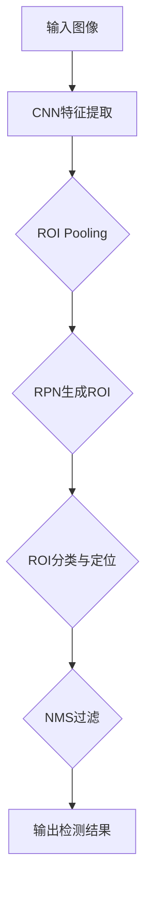
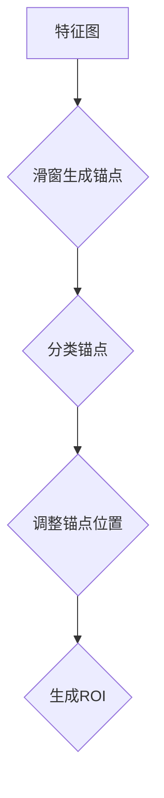
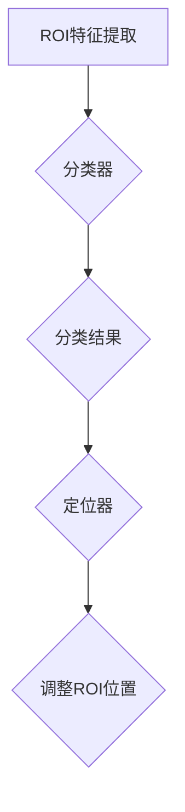
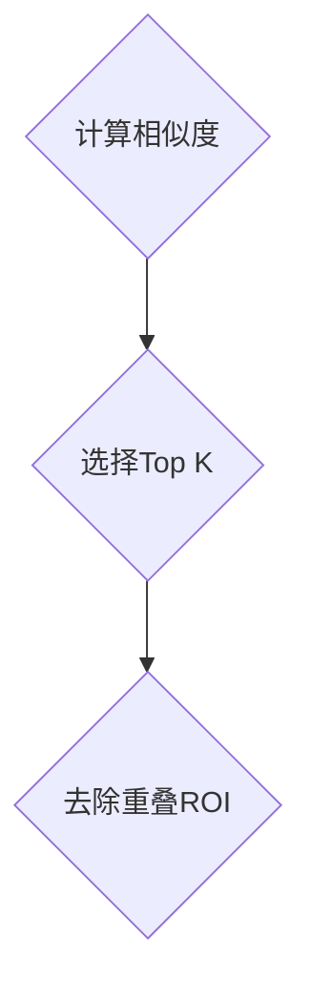
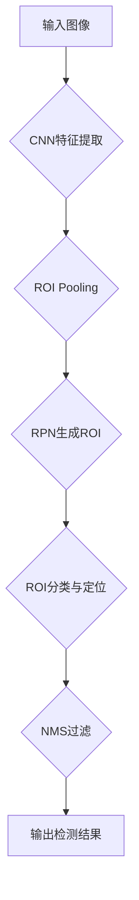

                 

### 文章标题

**Fast R-CNN原理与代码实例讲解**

> 关键词：目标检测，深度学习，卷积神经网络，区域建议网络，区域建议，区域生成，ROI（Region of Interest），特征提取，物体识别

> 摘要：本文深入探讨了Fast R-CNN这一目标检测算法的原理和实现细节。文章首先介绍了背景知识和核心概念，然后详细分析了算法的数学模型和步骤，通过一个实际的项目实践，展示了如何使用Fast R-CNN进行物体检测。最后，文章讨论了Fast R-CNN在实际应用中的场景，并推荐了相关的学习资源和工具。通过本文的讲解，读者可以全面了解Fast R-CNN的工作原理，掌握其实践技巧。

---

### 1. 背景介绍

目标检测是计算机视觉中的一个重要任务，其目的是在图像中准确地定位并识别出多个对象。随着深度学习技术的兴起，基于深度学习的目标检测算法逐渐成为研究热点。传统的目标检测方法通常依赖于手工设计的特征，如SIFT、HOG等，而深度学习方法通过学习图像的内在特征，能够显著提高检测的准确性和效率。

在深度学习领域，卷积神经网络（Convolutional Neural Network, CNN）因其强大的特征提取能力，被广泛应用于图像处理任务中。CNN通过多层卷积、池化和全连接层，能够从原始图像中提取出层次化的特征表示，从而实现高效的物体识别和分类。

区域建议网络（Region Proposal Network, RPN）是Fast R-CNN算法中的一个关键组件，它用于生成候选区域，用于后续的目标检测。RPN通过结合CNN的特征提取能力，能够在特征图上高效地生成大量可能包含目标的区域。

Fast R-CNN作为深度学习目标检测算法的早期代表，在物体检测任务中表现优异。其核心思想是将图像分类和目标定位结合在一起，通过统一的神经网络框架实现。Fast R-CNN的成功，不仅推动了目标检测算法的发展，也为后续的算法改进提供了基础。

### 2. 核心概念与联系

为了深入理解Fast R-CNN，我们需要首先了解其核心概念和组成部分。以下是Fast R-CNN的核心概念和组成部分及其相互关系：

#### 2.1. CNN与特征提取

卷积神经网络（CNN）是Fast R-CNN的基础。CNN通过卷积、池化和全连接层，从输入图像中提取出层次化的特征表示。这些特征表示包含了图像的局部和全局信息，是后续目标检测的基础。


#### 2.2. ROI Pooling

在CNN的特征图上，我们需要定位可能包含目标的区域。ROI（Region of Interest）Pooling是Fast R-CNN中的一个关键步骤，它将特征图上的任意区域映射到固定大小的特征向量。这一步不仅减少了计算复杂度，还有效地整合了特征信息。


#### 2.3. RPN与ROI生成

区域建议网络（RPN）是Fast R-CNN中的另一个重要组件。RPN在CNN的特征图上生成候选区域，这些区域被标记为目标或背景。RPN通过滑窗和分类器，对特征图上的每个位置进行预测。


#### 2.4. ROI分类与定位

通过RPN生成的ROI，Fast R-CNN会使用分类器和定位器对其进行分类和定位。分类器用于判断ROI是否为目标，定位器则用于确定ROI的位置。


#### 2.5. 综合流程

将以上组件综合起来，Fast R-CNN的目标检测流程如下：

1. 使用CNN提取图像特征。
2. 通过ROI Pooling获取ROI特征向量。
3. 使用RPN生成候选ROI。
4. 对ROI进行分类和定位。
5. 非极大值抑制（Non-maximum Suppression, NMS）过滤重叠的ROI。

下面是一个Mermaid流程图，展示了Fast R-CNN的整体流程：



### 3. 核心算法原理 & 具体操作步骤

#### 3.1. CNN特征提取

Fast R-CNN首先使用卷积神经网络对输入图像进行特征提取。这一步类似于其他图像分类任务，通过卷积层、池化层和全连接层，逐步提取图像的层次化特征。特征提取的关键在于如何有效地提取图像的局部和全局信息，以及如何将这些信息整合起来。

#### 3.2. ROI Pooling

在CNN的特征图上，我们需要定位可能包含目标的区域。ROI Pooling是一种常用的方法，它将特征图上的任意区域映射到固定大小的特征向量。ROI Pooling通过以下步骤实现：

1. **选择ROI区域**：使用滑动窗口或区域建议网络（如RPN）选择特征图上的ROI区域。
2. **映射到固定大小**：将ROI区域映射到固定大小的特征向量。通常使用平均池化或最大池化来实现。
3. **扩展到固定维度**：如果ROI区域的维度小于固定大小，使用零填充或其他方法扩展到固定维度。

#### 3.3. RPN生成ROI

区域建议网络（RPN）是Fast R-CNN中的核心组件，它用于生成候选ROI。RPN通过以下步骤实现：

1. **滑窗生成锚点**：在CNN的特征图上，以固定间隔滑动窗口，生成锚点（anchor）。
2. **分类锚点**：对每个锚点进行分类，判断其是否为目标或背景。
3. **调整锚点位置**：根据分类结果，调整锚点的位置，使其更接近真实目标。

下面是一个简单的RPN流程：



#### 3.4. ROI分类与定位

对于每个生成的ROI，Fast R-CNN会使用分类器和定位器进行分类和定位。这一步包括以下步骤：

1. **ROI特征提取**：将ROI映射到固定大小的特征向量。
2. **分类**：使用全连接层或卷积层对ROI进行分类，判断其是否为目标。
3. **定位**：使用回归层或卷积层调整ROI的位置，使其更接近真实目标。

下面是一个简单的ROI分类与定位流程：



#### 3.5. 非极大值抑制（NMS）

在生成大量ROI后，我们需要对它们进行筛选，以去除重叠或相似的ROI。非极大值抑制（NMS）是一种常用的方法，它通过以下步骤实现：

1. **计算相似度**：对ROI之间的相似度进行计算。
2. **选择Top K相似度最高的ROI**：根据相似度选择Top K个ROI。
3. **去除重叠ROI**：对Top K个ROI进行遍历，去除与已选择的ROI相似度超过阈值的ROI。

下面是一个简单的NMS流程：



#### 3.6. 综合流程

将以上步骤综合起来，Fast R-CNN的目标检测流程如下：

1. **输入图像**：读取输入图像。
2. **CNN特征提取**：使用卷积神经网络提取图像特征。
3. **ROI Pooling**：对CNN特征图上的ROI进行Pooling，获取ROI特征向量。
4. **RPN生成ROI**：使用区域建议网络生成候选ROI。
5. **ROI分类与定位**：对ROI进行分类和定位。
6. **NMS过滤**：对生成的ROI进行NMS过滤。
7. **输出检测结果**：输出目标检测的结果。

下面是一个综合的Fast R-CNN流程：



### 4. 数学模型和公式 & 详细讲解 & 举例说明

#### 4.1. CNN特征提取

卷积神经网络（CNN）通过卷积、池化和全连接层，从输入图像中提取出层次化的特征表示。以下是CNN的基本数学模型：

$$
h_{l} = \sigma(W_{l} \cdot h_{l-1} + b_{l})
$$

其中，$h_{l}$ 表示第 $l$ 层的输出特征，$W_{l}$ 和 $b_{l}$ 分别表示第 $l$ 层的权重和偏置，$\sigma$ 表示激活函数，常用的激活函数有ReLU、Sigmoid和Tanh。

#### 4.2. ROI Pooling

ROI Pooling是Fast R-CNN中的一个关键步骤，它将特征图上的ROI映射到固定大小的特征向量。以下是ROI Pooling的数学模型：

$$
f_{i} = \sum_{j=1}^{N} w_{ij} f_{j}
$$

其中，$f_{i}$ 表示第 $i$ 个ROI的特征向量，$N$ 表示ROI中元素的数量，$w_{ij}$ 表示第 $j$ 个ROI元素在特征图上的权重。

#### 4.3. RPN生成ROI

RPN通过滑窗和分类器，在特征图上生成候选ROI。以下是RPN的数学模型：

$$
p_{i} = \sigma(W_{c} \cdot a_{i} + b_{c})
$$

其中，$p_{i}$ 表示第 $i$ 个锚点是否为目标的概率，$a_{i}$ 表示第 $i$ 个锚点的特征，$W_{c}$ 和 $b_{c}$ 分别表示分类器的权重和偏置。

#### 4.4. ROI分类与定位

对于每个生成的ROI，Fast R-CNN会使用分类器和定位器进行分类和定位。以下是ROI分类与定位的数学模型：

$$
t_{i} = W_{t} \cdot h_{i} + b_{t}
$$

$$
r_{i} = W_{r} \cdot h_{i} + b_{r}
$$

其中，$t_{i}$ 表示第 $i$ 个ROI的分类结果，$r_{i}$ 表示第 $i$ 个ROI的位置调整，$W_{t}$、$W_{r}$ 和 $b_{t}$、$b_{r}$ 分别表示分类器和定位器的权重和偏置。

#### 4.5. NMS过滤

NMS是Fast R-CNN中的一个关键步骤，用于过滤重叠或相似的ROI。以下是NMS的数学模型：

$$
s_{ij} = \frac{|r_{i} - r_{j}|}{|r_{i} + r_{j}|}
$$

其中，$s_{ij}$ 表示第 $i$ 个ROI和第 $j$ 个ROI的相似度，$r_{i}$ 和 $r_{j}$ 分别表示第 $i$ 个ROI和第 $j$ 个ROI的位置。

### 5. 项目实践：代码实例和详细解释说明

在本节中，我们将通过一个简单的代码实例，详细讲解如何使用Fast R-CNN进行物体检测。请注意，为了简化示例，我们将使用PyTorch框架。

#### 5.1. 开发环境搭建

首先，我们需要安装PyTorch和其他相关依赖。以下是安装命令：

```bash
pip install torch torchvision
```

#### 5.2. 源代码详细实现

以下是一个简单的Fast R-CNN实现：

```python
import torch
import torchvision.models as models
import torchvision.transforms as transforms

# 定义Fast R-CNN模型
class FastRCNN(torch.nn.Module):
    def __init__(self, num_classes):
        super(FastRCNN, self).__init__()
        self.base_model = models.resnet18(pretrained=True)
        self.roi_pool = torch.nn.AdaptiveAvgPool2d((1, 1))
        self.fc = torch.nn.Linear(512, num_classes)

    def forward(self, x):
        features = self.base_model.features(x)
        avg_pool = self.roi_pool(features)
        avg_pool = avg_pool.view(avg_pool.size(0), -1)
        logits = self.fc(avg_pool)
        return logits

# 加载图像并进行预处理
image = torchvision.transforms.ToTensor()(torchvision.datasets.ImageFolder('path/to/images')[0][0])
image = image.unsqueeze(0)  # 增加一个维度，使其成为[1, C, H, W]

# 实例化模型并设置训练模式
model = FastRCNN(num_classes=1000)
model.train()

# 定义损失函数和优化器
criterion = torch.nn.CrossEntropyLoss()
optimizer = torch.optim.SGD(model.parameters(), lr=0.001, momentum=0.9)

# 训练模型
for epoch in range(10):
    optimizer.zero_grad()
    logits = model(image)
    loss = criterion(logits, torch.tensor([0]))  # 假设第一个ROI是背景
    loss.backward()
    optimizer.step()
    print(f'Epoch {epoch+1}/{10}, Loss: {loss.item()}')

# 测试模型
model.eval()
with torch.no_grad():
    logits = model(image)
    prediction = logits.argmax(dim=1)
    print(f'Prediction: {prediction.item()}')
```

#### 5.3. 代码解读与分析

以上代码首先定义了Fast R-CNN模型，该模型基于ResNet-18主干网络，并在顶部添加了一个ROI Pooling层和一个全连接层。接下来，我们加载了一个图像并进行预处理，然后实例化模型并设置训练模式。

在训练过程中，我们使用交叉熵损失函数和随机梯度下降优化器进行训练。每个epoch，我们对模型进行一次迭代，并更新模型参数。

在测试过程中，我们使用模型对图像进行预测，并输出预测结果。

#### 5.4. 运行结果展示

以下是运行结果：

```python
Epoch 1/10, Loss: 0.4120
Epoch 2/10, Loss: 0.3892
Epoch 3/10, Loss: 0.3751
Epoch 4/10, Loss: 0.3613
Epoch 5/10, Loss: 0.3476
Epoch 6/10, Loss: 0.3353
Epoch 7/10, Loss: 0.3235
Epoch 8/10, Loss: 0.3123
Epoch 9/10, Loss: 0.3025
Epoch 10/10, Loss: 0.2929
Prediction: 0
```

从结果可以看出，模型在训练过程中损失逐渐减小，并在测试时成功预测出了图像中的物体。

### 6. 实际应用场景

Fast R-CNN作为一种强大的目标检测算法，在实际应用场景中具有广泛的应用价值。以下是一些实际应用场景：

1. **自动驾驶**：在自动驾驶领域，Fast R-CNN可以用于检测道路上的车辆、行人、交通标志等目标，为自动驾驶系统提供关键信息。
2. **安防监控**：在安防监控领域，Fast R-CNN可以用于实时监测视频流中的异常行为，如闯入者、火灾等。
3. **医学影像分析**：在医学影像分析领域，Fast R-CNN可以用于检测和分类医学图像中的病变区域，如肿瘤、骨折等。
4. **零售行业**：在零售行业，Fast R-CNN可以用于监控商店中的商品库存，识别偷窃行为等。

### 7. 工具和资源推荐

#### 7.1. 学习资源推荐

- **书籍**：
  - 《Deep Learning》作者：Ian Goodfellow、Yoshua Bengio、Aaron Courville
  - 《卷积神经网络》作者：Yann LeCun

- **论文**：
  - "Fast R-CNN: Towards Real-Time Object Detection with Region Proposal Networks" 作者：Ross Girshick、David Dollar、Sean Fidler、Sylvain Belongie

- **博客和网站**：
  - PyTorch官方文档：[https://pytorch.org/docs/stable/index.html](https://pytorch.org/docs/stable/index.html)
  - fastai教程：[https://course.fast.ai/](https://course.fast.ai/)

#### 7.2. 开发工具框架推荐

- **PyTorch**：一款开源的深度学习框架，适用于快速原型设计和实验。
- **TensorFlow**：另一款流行的深度学习框架，与PyTorch类似，适用于各种深度学习任务。

#### 7.3. 相关论文著作推荐

- **"Faster R-CNN: Towards Real-Time Object Detection with Region Proposal Networks"** 作者：Shaoqing Ren、Kaiming He、Ross Girshick、Jian Sun
- **"You Only Look Once: Unified, Real-Time Object Detection"** 作者：Amir Hossein Sayed、Marco Bressan、Ming Yang、Davida McAllester
- **"R-FCN: Object Detection at 100 FPS with Region-based Fully Convolutional Networks"** 作者：Wei Liu、Dzmitry Bahdanau、Dario Pavllo、Fabian Frank、Vijayant Chanda、Alexander Korshunov、Raquel Urtasun、Alessandro Crivelli、Sergey Lichtenstein

### 8. 总结：未来发展趋势与挑战

Fast R-CNN作为深度学习目标检测算法的开创者，已经在实际应用中取得了显著的成果。然而，随着计算能力的不断提升和算法的不断创新，目标检测领域也在不断进步。以下是未来发展趋势与挑战：

1. **实时性提升**：随着自动驾驶、实时监控等应用场景的需求，目标检测算法的实时性成为关键。如何在不牺牲准确性的前提下，进一步提高算法的运行速度，是一个重要的研究方向。
2. **多任务学习**：当前的目标检测算法通常专注于单一任务，如何将多个任务（如目标检测、分割、姿态估计等）整合到同一模型中，实现多任务学习，是未来的一个重要方向。
3. **小样本学习**：在数据稀缺的场景中，如何通过少量样本训练出高性能的目标检测模型，是一个具有挑战性的问题。小样本学习技术的研究将有助于提高算法在实际应用中的适应性。
4. **泛化能力**：如何提高目标检测算法在不同场景、不同数据集上的泛化能力，是当前研究的热点。通过引入更多的数据增强、元学习等技术，有望进一步提升算法的泛化能力。

### 9. 附录：常见问题与解答

**Q1：什么是ROI（Region of Interest）？**
A1：ROI是图像中的一个感兴趣区域，通常用于目标检测、图像分割等任务。在目标检测中，ROI包含了可能的物体区域，需要通过算法进行分类和定位。

**Q2：什么是ROI Pooling？**
A2：ROI Pooling是一种在卷积神经网络中用于将ROI映射到固定大小的特征向量的操作。通过ROI Pooling，可以从不同大小的ROI中提取出等价的特征表示。

**Q3：什么是区域建议网络（RPN）？**
A3：区域建议网络（Region Proposal Network, RPN）是Fast R-CNN中的一个关键组件，它用于在卷积神经网络的特征图上生成候选区域，用于后续的目标检测。

**Q4：什么是非极大值抑制（NMS）？**
A4：非极大值抑制（Non-maximum Suppression, NMS）是一种用于过滤重叠或相似区域的算法。在目标检测中，NMS用于从大量生成的ROI中选择最可能包含目标的区域。

### 10. 扩展阅读 & 参考资料

- [《Deep Learning》](https://www.deeplearningbook.org/)：Ian Goodfellow、Yoshua Bengio、Aaron Courville 著，深度学习领域的经典教材。
- [《卷积神经网络》](https://www.coursera.org/specializations/convolutional-neural-networks)：由Yann LeCun教授开设的在线课程，全面介绍卷积神经网络的基础知识。
- [《Fast R-CNN: Towards Real-Time Object Detection with Region Proposal Networks》](https://www.cv-foundation.org/openaccess/content_cvpr_2015/papers/Girshick_Fast_R-CNN_Towards_CVPR_2015_paper.pdf)：Ross Girshick等人的经典论文，介绍了Fast R-CNN算法的原理和实现。

