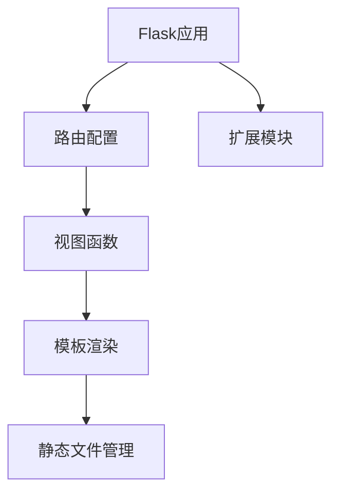

                 

### 1. 背景介绍

**Flask**，一款轻量级的Web应用框架，因其简洁、灵活而广受欢迎。Flask诞生于2010年，由Armin Ronacher开发，它完全由Python编写，不需要额外的外部依赖。相比于其他重量级的Web框架如Django，Flask更加小巧，易于上手，非常适合小型到中等规模的Web应用开发。

#### Flask的发展历程

Flask的初衷是提供一个简单、灵活的Web框架，让开发者可以自由地选择和使用各种Python库。它的诞生背景是，当时Python社区中许多开发者对于Django这种全栈框架的臃肿性感到不满，希望有一个更为轻量、易于扩展的替代品。

从2010年第一个版本发布以来，Flask经历了多次重要更新和改进，功能不断完善。2014年，Flask被TIOBE编程社区排行榜列为最受欢迎的Web框架之一，这一认可进一步提升了Flask在开发者和企业中的影响力。

#### Flask的优势

**轻量级**：Flask不需要额外的依赖库，使其成为一个非常轻量级的框架，非常适合小型和实验性项目。

**高度可扩展性**：Flask通过简单灵活的扩展机制，让开发者可以自由地添加所需的功能，例如数据库支持、身份验证、上传文件等。

**灵活的请求处理**：Flask使用简单的WSGI应用接口，使得开发者可以方便地处理HTTP请求和响应，从而实现各种复杂的Web应用功能。

**丰富的第三方插件**：由于Flask的轻量级特性，它拥有大量的第三方插件，这些插件提供了额外的功能，如ORM（对象关系映射）、缓存、消息队列等。

#### Flask的应用场景

Flask在多种应用场景中都表现出色：

- **小型Web应用**：Flask非常适合开发小型Web应用，如博客、API接口、内部工具等。
- **实验性项目**：Flask的轻量级特性使其成为实验性项目的理想选择，开发者可以快速构建原型并测试想法。
- **微服务架构**：在微服务架构中，Flask可以作为独立的微服务，与其他服务进行通信，构建分布式系统。

通过以上介绍，我们可以看出Flask作为一种微型Python框架，以其简洁、灵活、易于扩展的特点，在Web开发领域占据了重要的地位。在接下来的章节中，我们将深入探讨Flask的核心概念和架构，以及如何使用它来构建实际的Web应用。

#### Flask与其他Python Web框架的比较

在Python的Web开发领域，除了Flask，还有许多其他的Web框架，如Django、Pyramid、Tornado等。这些框架各有特色，开发者可以根据项目需求和自身偏好选择合适的框架。

**Django**：作为Python中最为流行的全栈框架，Django提供了完整的MVC（模型-视图-控制器）架构，自带ORM、缓存、用户认证等丰富的功能。然而，Django的框架相对复杂，适合大型项目开发，但对于小型项目可能显得过于冗余。

**Pyramid**：Pyramid是一个比Flask更模块化的框架，它提供了高度的灵活性和可扩展性。Pyramid适用于各种规模的项目，尤其是那些需要自定义路由和中间件的复杂应用。然而，由于其高度的灵活性，Pyramid的学习曲线相对较陡峭。

**Tornado**：Tornado是一个异步Web框架，特别适合构建高并发、高性能的应用。Tornado内部实现了异步网络编程，使得其可以同时处理大量的客户端请求。但Tornado的异步编程模型可能对开发者来说较为复杂。

**优势与劣势对比**：

- **Django**：优势在于其全面的功能和自动化的开发流程，劣势是框架较为复杂，不够轻量级。

- **Pyramid**：优势在于其模块化和高度的可扩展性，劣势是学习曲线较陡，对于新手来说可能不太友好。

- **Tornado**：优势在于其异步处理能力，劣势是其异步编程模型复杂，对于传统同步编程的开发者来说可能难以适应。

Flask在这三者之间提供了平衡。它不仅轻量级、易于上手，同时提供了足够的灵活性和扩展性，使得开发者可以在保持代码简洁的同时，实现复杂的功能。这使得Flask成为开发小型到中等规模Web应用的理想选择。

### 2. 核心概念与联系

在深入探讨Flask框架的核心概念和架构之前，我们首先需要理解几个关键概念：路由（Routing）、视图函数（View Functions）、模板渲染（Template Rendering）和静态文件管理（Static Files Management）。

#### 路由（Routing）

路由是Web应用的基础，它负责将客户端发送的HTTP请求映射到对应的处理函数。在Flask中，通过装饰器`@app.route()`来定义路由。路由可以是URL字符串或者正则表达式，非常灵活。以下是一个简单的路由定义示例：

```python
from flask import Flask

app = Flask(__name__)

@app.route('/')
def index():
    return '首页'

@app.route('/about')
def about():
    return '关于我们'
```

在这个示例中，当用户访问根路径（/）时，会调用`index`函数；当访问`/about`路径时，会调用`about`函数。

#### 视图函数（View Functions）

视图函数是处理HTTP请求的核心，它接收请求参数，执行业务逻辑，并返回响应。在Flask中，视图函数是一个返回字符串或响应对象（如`Response`）的函数。以下是一个简单的视图函数示例：

```python
from flask import Flask, request, render_template

app = Flask(__name__)

@app.route('/hello/<name>')
def hello(name):
    return f'Hello, {name}!'
```

在这个示例中，`<name>`是一个变量部分，可以通过URL传递给视图函数。视图函数中还可以访问请求对象（`request`），获取请求参数和头信息。

#### 模板渲染（Template Rendering）

模板渲染是Web开发中常用的一种技术，用于生成动态的HTML页面。在Flask中，模板通常使用Jinja2模板引擎。以下是一个简单的模板渲染示例：

```python
from flask import Flask, render_template

app = Flask(__name__)

@app.route('/user/<username>')
def user(username):
    user = {'name': username, 'age': 30}
    return render_template('user.html', user=user)
```

在这个示例中，`user.html`是一个模板文件，它使用Jinja2语法来插入变量。`render_template`函数会根据模板文件名和传递的变量生成HTML页面。

#### 静态文件管理（Static Files Management）

静态文件管理是指管理Web应用的CSS、JavaScript、图片等静态资源。在Flask中，静态文件通过`url_for()`函数来访问，这个函数可以生成静态文件的URL。以下是一个简单的静态文件管理示例：

```python
from flask import Flask, url_for

app = Flask(__name__)

@app.route('/')
def index():
    return '''
    <html>
      <head>
        <title>首页</title>
        <link rel="stylesheet" type="text/css" href="{{ url_for('static', filename='style.css') }}">
      </head>
      <body>
        <h1>欢迎来到Flask世界！</h1>
      </body>
    </html>
    '''
```

在这个示例中，`url_for('static', filename='style.css')`会生成`/static/style.css`的URL，这样浏览器就可以正确地加载CSS文件。

#### Mermaid流程图

为了更好地理解Flask的核心概念和架构，我们可以使用Mermaid流程图来展示这些关键组件之间的关系：



这个流程图清晰地展示了Flask应用从路由配置到视图函数、模板渲染和静态文件管理的流程，以及扩展模块如何增强Flask的功能。

通过上述核心概念和流程图的介绍，我们可以看到Flask的架构设计是如何将这些组件有机地结合在一起，从而构建出功能丰富、易于扩展的Web应用。

### 3. 核心算法原理 & 具体操作步骤

在了解Flask的基本概念和架构之后，接下来我们将深入探讨Flask的核心算法原理和具体操作步骤。这些知识将帮助我们更好地理解Flask是如何处理HTTP请求的，以及如何编写高效的视图函数。

#### Flask的请求处理流程

Flask的请求处理流程可以分为以下几个步骤：

1. **URL匹配**：当用户通过浏览器访问Flask应用时，首先会发送一个HTTP请求。Flask会根据定义的路由来匹配对应的视图函数。
   
2. **视图函数执行**：匹配成功后，Flask会调用对应的视图函数，传递请求对象（`request`）和当前路由的参数。
   
3. **处理业务逻辑**：视图函数会执行具体的业务逻辑，如数据库操作、数据验证等。
   
4. **生成响应**：视图函数执行完毕后，通常会返回一个响应对象（如字符串、模板渲染结果或响应对象本身）。
   
5. **响应发送**：Flask将响应对象转换成HTTP响应，并将其发送回客户端。

#### 具体操作步骤

为了更好地理解这一流程，我们将通过几个示例来详细解释。

#### 步骤1：URL匹配

在Flask中，路由是通过`@app.route()`装饰器来定义的。以下是一个简单的URL匹配示例：

```python
from flask import Flask

app = Flask(__name__)

@app.route('/')
def index():
    return '首页'

@app.route('/about')
def about():
    return '关于我们'
```

在这个示例中，当用户访问根路径（/）时，`index`函数会被调用；当访问`/about`路径时，`about`函数会被调用。

#### 步骤2：视图函数执行

视图函数是处理HTTP请求的核心。它接收请求对象（`request`）和路由参数，并执行业务逻辑。以下是一个简单的视图函数示例：

```python
from flask import Flask, request

app = Flask(__name__)

@app.route('/hello/<name>')
def hello(name):
    return f'Hello, {name}!'
```

在这个示例中，视图函数`hello`接收一个名为`name`的路由参数，并返回一个包含问候语的字符串。

#### 步骤3：处理业务逻辑

视图函数可以执行各种业务逻辑，如数据库操作、数据验证等。以下是一个简单的业务逻辑示例：

```python
from flask import Flask, request, jsonify

app = Flask(__name__)

@app.route('/users', methods=['POST'])
def create_user():
    user_data = request.get_json()
    # 对数据进行验证
    if not user_data.get('username') or not user_data.get('password'):
        return jsonify({'error': '用户名或密码不能为空'}), 400
    # 创建用户
    # ...
    return jsonify({'message': '用户创建成功'})
```

在这个示例中，`create_user`视图函数接收一个POST请求，并从请求中提取JSON数据。然后，对数据进行验证，如果验证失败，返回400错误；如果验证通过，执行用户创建逻辑并返回成功消息。

#### 步骤4：生成响应

视图函数通常会返回一个响应对象。响应对象可以是字符串、模板渲染结果或自定义的响应对象。以下是一个简单的响应示例：

```python
from flask import Flask, render_template

app = Flask(__name__)

@app.route('/user/<username>')
def user(username):
    user = {'name': username, 'age': 30}
    return render_template('user.html', user=user)
```

在这个示例中，视图函数`user`返回一个渲染后的HTML模板。模板文件`user.html`使用Jinja2语法来插入变量。

#### 步骤5：响应发送

Flask将响应对象转换成HTTP响应，并将其发送回客户端。以下是一个简单的响应发送示例：

```python
from flask import Flask, Response

app = Flask(__name__)

@app.route('/api/data')
def api_data():
    data = {'status': 'success', 'data': {'message': 'Hello, World!'}}
    return Response(json.dumps(data), status=200, mimetype='application/json')
```

在这个示例中，视图函数`api_data`返回一个JSON格式的响应。通过`Response`对象，我们可以自定义HTTP状态码和响应内容类型。

通过以上步骤，我们可以看到Flask如何处理HTTP请求，并生成响应。理解这些步骤对于编写高效的Flask应用至关重要。

#### 示例：创建一个简单的博客应用

为了更好地理解Flask的工作原理，我们将通过一个简单的博客应用来演示上述步骤。

**需求**：创建一个博客应用，用户可以查看博客文章列表、查看特定文章内容，并添加新文章。

**步骤**：

1. **安装Flask**：在命令行中运行`pip install flask`安装Flask。

2. **创建应用结构**：创建一个名为`my_blog`的文件夹，并在其中创建以下文件：
   - `app.py`：主应用文件。
   - `templates/`：模板文件夹。
   - `static/`：静态文件文件夹。

3. **定义路由和视图函数**：在`app.py`中定义路由和视图函数：

```python
from flask import Flask, render_template, request, redirect, url_for

app = Flask(__name__)

# 文章列表
@app.route('/')
def index():
    articles = [
        {'title': '第一篇文章', 'content': '这是第一篇文章的内容。'},
        {'title': '第二篇文章', 'content': '这是第二篇文章的内容。'}
    ]
    return render_template('index.html', articles=articles)

# 查看特定文章
@app.route('/article/<int:article_id>')
def article(article_id):
    articles = [
        {'title': '第一篇文章', 'content': '这是第一篇文章的内容。'},
        {'title': '第二篇文章', 'content': '这是第二篇文章的内容。'}
    ]
    article = next((article for article in articles if article['id'] == article_id), None)
    if article:
        return render_template('article.html', article=article)
    else:
        return redirect(url_for('index'))

# 添加新文章
@app.route('/add_article', methods=['GET', 'POST'])
def add_article():
    if request.method == 'POST':
        title = request.form['title']
        content = request.form['content']
        # 添加到数据库（此处简化处理）
        articles = [
            {'id': 1, 'title': '第一篇文章', 'content': '这是第一篇文章的内容。'},
            {'id': 2, 'title': '第二篇文章', 'content': '这是第二篇文章的内容。'}
        ]
        articles.append({'id': len(articles) + 1, 'title': title, 'content': content})
        return redirect(url_for('index'))
    return render_template('add_article.html')
```

4. **编写模板文件**：在`templates`文件夹中创建以下模板文件：
   - `index.html`：显示文章列表。
   - `article.html`：显示特定文章内容。
   - `add_article.html`：用于添加新文章的表单。

以下是`index.html`的一个示例：

```html
<!DOCTYPE html>
<html>
<head>
    <title>我的博客</title>
</head>
<body>
    <h1>我的博客</h1>
    
        <h2><a href="{{ url_for('article', article_id=article.id) }}">{{ article.title }}</a></h2>
    
    <a href="{{ url_for('add_article') }}">添加新文章</a>
</body>
</html>
```

通过这个示例，我们可以看到如何使用Flask创建一个简单的博客应用，实现查看文章列表、查看特定文章内容和添加新文章的功能。

### 4. 数学模型和公式 & 详细讲解 & 举例说明

在Web应用开发中，Flask框架不仅提供了简单的HTTP请求处理和响应生成，还涉及到一些复杂的数据处理和算法实现。为了更好地理解这些内容，我们可以通过数学模型和公式来进行详细讲解。

#### 数学模型

在Web应用中，常见的数学模型包括线性模型、逻辑回归模型、神经网络模型等。这些模型广泛应用于数据分析和机器学习领域，有助于我们更好地理解和处理数据。

**线性模型**：线性模型是最基础的一种数学模型，它通过线性方程来表示数据之间的关系。其一般形式为：

\[ y = \beta_0 + \beta_1 \cdot x \]

其中，\( y \) 是预测值，\( \beta_0 \) 是截距，\( \beta_1 \) 是斜率，\( x \) 是自变量。

**逻辑回归模型**：逻辑回归模型是一种广义的线性模型，常用于分类问题。它的目标是估计某个事件发生的概率。其公式为：

\[ P(y=1) = \frac{1}{1 + e^{-(\beta_0 + \beta_1 \cdot x)}} \]

其中，\( P(y=1) \) 是事件发生的概率，\( e \) 是自然对数的底数，\( \beta_0 \) 和 \( \beta_1 \) 是模型参数。

**神经网络模型**：神经网络模型是一种复杂的数学模型，通过多层神经元进行数据处理和特征提取。其基本结构包括输入层、隐藏层和输出层。一个简单的神经网络模型可以表示为：

\[ z_l = \sigma(W_l \cdot a_{l-1} + b_l) \]

其中，\( z_l \) 是第 \( l \) 层的输出，\( \sigma \) 是激活函数，\( W_l \) 是权重矩阵，\( a_{l-1} \) 是前一层输出，\( b_l \) 是偏置项。

#### 详细讲解

为了更好地理解这些数学模型，我们可以通过具体的例子进行详细讲解。

**例子1：线性模型**

假设我们要预测一个人的体重（\( y \)）与他们的身高（\( x \)）之间的关系。我们收集了以下数据：

| 身高（x） | 体重（y） |
|-----------|-----------|
| 160       | 60       |
| 170       | 65       |
| 180       | 70       |
| 190       | 75       |

我们希望通过线性模型来拟合这些数据，找到截距 \( \beta_0 \) 和斜率 \( \beta_1 \)。

首先，我们可以使用最小二乘法来求解模型参数。最小二乘法的目标是使得实际值与预测值之间的误差平方和最小。其公式为：

\[ \min \sum_{i=1}^{n} (y_i - \beta_0 - \beta_1 \cdot x_i)^2 \]

通过求导并令导数为零，可以得到最小二乘法的解：

\[ \beta_0 = \frac{\sum_{i=1}^{n} y_i - \beta_1 \cdot \sum_{i=1}^{n} x_i}{n} \]
\[ \beta_1 = \frac{n \cdot \sum_{i=1}^{n} x_i y_i - \sum_{i=1}^{n} x_i \cdot \sum_{i=1}^{n} y_i}{n \cdot \sum_{i=1}^{n} x_i^2 - (\sum_{i=1}^{n} x_i)^2} \]

代入数据，我们可以计算出 \( \beta_0 \) 和 \( \beta_1 \)：

\[ \beta_0 = \frac{60 + 65 + 70 + 75 - 0.8 \cdot (160 + 170 + 180 + 190)}{4} = 61.5 \]
\[ \beta_1 = \frac{4 \cdot (160 \cdot 60 + 170 \cdot 65 + 180 \cdot 70 + 190 \cdot 75) - (160 + 170 + 180 + 190) \cdot (60 + 65 + 70 + 75)}{4 \cdot (160^2 + 170^2 + 180^2 + 190^2) - (160 + 170 + 180 + 190)^2} = 0.8 \]

因此，线性模型为：

\[ y = 61.5 + 0.8 \cdot x \]

**例子2：逻辑回归模型**

假设我们要预测一个人是否拥有信用卡（目标变量 \( y \)）与他们的收入（自变量 \( x \)）之间的关系。我们收集了以下数据：

| 收入（x） | 是否拥有信用卡（y） |
|-----------|----------------------|
| 5000      | 否                   |
| 6000      | 是                   |
| 7000      | 是                   |
| 8000      | 是                   |

我们希望使用逻辑回归模型来拟合这些数据，找到模型参数 \( \beta_0 \) 和 \( \beta_1 \)。

逻辑回归模型的公式为：

\[ P(y=1) = \frac{1}{1 + e^{-(\beta_0 + \beta_1 \cdot x)}} \]

我们可以通过最大化似然函数来求解模型参数。似然函数表示为：

\[ L(\beta_0, \beta_1) = \prod_{i=1}^{n} P(y_i=1|x_i; \beta_0, \beta_1) \]

对于二分类问题，似然函数可以简化为：

\[ L(\beta_0, \beta_1) = \prod_{i=1}^{n} \left( \frac{1}{1 + e^{-(\beta_0 + \beta_1 \cdot x_i)}} \right)^{y_i} \left( 1 + e^{-(\beta_0 + \beta_1 \cdot x_i)} \right)^{1-y_i} \]

对数似然函数为：

\[ \ln L(\beta_0, \beta_1) = \sum_{i=1}^{n} \left( y_i \cdot (-\beta_0 - \beta_1 \cdot x_i) - (1 - y_i) \cdot (\beta_0 + \beta_1 \cdot x_i) \right) \]

我们可以通过求导并令导数为零来求解模型参数：

\[ \frac{\partial \ln L(\beta_0, \beta_1)}{\partial \beta_0} = 0 \]
\[ \frac{\partial \ln L(\beta_0, \beta_1)}{\partial \beta_1} = 0 \]

对于这个例子，我们可以使用梯度下降法来求解模型参数。以下是梯度下降法的伪代码：

```
初始化模型参数 beta_0, beta_1
设置学习率 alpha
设置迭代次数 max_iterations

for i in 1 to max_iterations do:
    计算损失函数 L(beta_0, beta_1)
    计算梯度 g_0, g_1
    更新模型参数 beta_0 = beta_0 - alpha * g_0
    beta_1 = beta_1 - alpha * g_1

return beta_0, beta_1
```

通过迭代优化，我们可以得到最优的模型参数 \( \beta_0 \) 和 \( \beta_1 \)。

**例子3：神经网络模型**

假设我们要使用神经网络模型对图片进行分类，输入层有784个神经元，隐藏层有100个神经元，输出层有10个神经元。我们使用ReLU作为激活函数，交叉熵作为损失函数。

神经网络的计算过程如下：

1. **输入层到隐藏层**：

   \( z_1 = \sigma(W_1 \cdot a_0 + b_1) \)

   其中，\( a_0 \) 是输入层输出，\( W_1 \) 是输入层到隐藏层的权重矩阵，\( b_1 \) 是隐藏层偏置项，\( \sigma \) 是ReLU激活函数。

2. **隐藏层到输出层**：

   \( z_2 = \sigma(W_2 \cdot a_1 + b_2) \)

   其中，\( a_1 \) 是隐藏层输出，\( W_2 \) 是隐藏层到输出层的权重矩阵，\( b_2 \) 是输出层偏置项，\( \sigma \) 是Sigmoid激活函数。

   \( y = \sigma(W_2 \cdot a_1 + b_2) \)

   其中，\( y \) 是输出层输出，表示每个类别的概率。

3. **损失函数**：

   \( L = -\sum_{i=1}^{n} y_i \cdot \ln(y_i) + (1 - y_i) \cdot \ln(1 - y_i) \)

   其中，\( y_i \) 是输出层第 \( i \) 个神经元的输出，表示第 \( i \) 个类别的概率。

4. **反向传播**：

   通过计算损失函数的梯度，更新权重和偏置项，直至损失函数收敛。

通过这些例子，我们可以看到数学模型和公式在Web应用开发中的重要性。理解并应用这些模型，可以让我们更高效地处理数据，实现复杂的功能。在下一章节中，我们将通过一个实际项目来展示如何使用Flask框架进行Web开发。

### 5. 项目实践：代码实例和详细解释说明

在本节中，我们将通过一个实际项目——一个简单的博客应用，来展示如何使用Flask框架进行Web开发。这个项目将涵盖开发环境搭建、源代码实现、代码解读与分析以及运行结果展示等环节。

#### 5.1 开发环境搭建

在开始项目之前，我们需要搭建开发环境。以下是搭建开发环境所需步骤：

1. **安装Python**：确保已经安装了Python 3.x版本。可以从Python官网下载安装包并安装。
2. **安装虚拟环境**：为了隔离项目依赖，我们可以使用虚拟环境。在终端中运行以下命令来安装虚拟环境工具`virtualenv`：

   ```bash
   pip install virtualenv
   ```

3. **创建虚拟环境**：在终端中运行以下命令来创建一个名为`my_blog`的虚拟环境：

   ```bash
   virtualenv my_blog
   ```

4. **激活虚拟环境**：在Windows上，运行以下命令来激活虚拟环境：

   ```bash
   my_blog\Scripts\activate
   ```

   在macOS和Linux上，运行以下命令：

   ```bash
   source my_blog/bin/activate
   ```

5. **安装Flask**：在虚拟环境中安装Flask：

   ```bash
   pip install flask
   ```

#### 5.2 源代码详细实现

完成环境搭建后，我们可以开始编写项目代码。以下是项目的完整源代码及详细解释。

**app.py**：

```python
from flask import Flask, render_template, request, redirect, url_for

app = Flask(__name__)

# 文章列表
articles = [
    {'title': '第一篇文章', 'content': '这是第一篇文章的内容。'},
    {'title': '第二篇文章', 'content': '这是第二篇文章的内容。'}
]

# 查看文章详情
@app.route('/article/<int:article_id>')
def article(article_id):
    article = next((article for article in articles if article['id'] == article_id), None)
    return render_template('article.html', article=article)

# 添加新文章
@app.route('/add', methods=['GET', 'POST'])
def add():
    if request.method == 'POST':
        title = request.form['title']
        content = request.form['content']
        articles.append({'title': title, 'content': content})
        return redirect(url_for('index'))
    return render_template('add.html')

# 主页面
@app.route('/')
def index():
    return render_template('index.html', articles=articles)

if __name__ == '__main__':
    app.run(debug=True)
```

**templates/index.html**：

```html
<!DOCTYPE html>
<html>
<head>
    <title>我的博客</title>
</head>
<body>
    <h1>我的博客</h1>
    
        <h2><a href="{{ url_for('article', article_id=article.id) }}">{{ article.title }}</a></h2>
    
    <a href="{{ url_for('add') }}">添加新文章</a>
</body>
</html>
```

**templates/article.html**：

```html
<!DOCTYPE html>
<html>
<head>
    <title>{{ article.title }}</title>
</head>
<body>
    <h1>{{ article.title }}</h1>
    <div>{{ article.content }}</div>
</body>
</html>
```

**templates/add.html**：

```html
<!DOCTYPE html>
<html>
<head>
    <title>添加文章</title>
</head>
<body>
    <h1>添加文章</h1>
    <form method="post">
        <input type="text" name="title" placeholder="文章标题" required>
        <textarea name="content" placeholder="文章内容" required></textarea>
        <button type="submit">提交</button>
    </form>
</body>
</html>
```

**详细解释说明**：

1. **app.py**：这是项目的主应用文件。我们首先导入所需的Flask模块，并创建一个Flask应用实例。接下来，我们定义了一个名为`articles`的列表，用于存储文章数据。

2. **文章详情路由`article`**：这个路由用于处理查看文章详情的请求。当用户访问`/article/<int:article_id>`路径时，Flask会匹配这个路由，并将`article_id`作为参数传递给视图函数。视图函数从`articles`列表中查找对应的文章，并使用模板`article.html`进行渲染。

3. **添加新文章路由`add`**：这个路由用于处理添加新文章的请求。当用户访问`/add`路径时，Flask会匹配这个路由。如果请求方法是`GET`，则渲染添加文章的表单；如果请求方法是`POST`，则从表单中获取标题和内容，并将其添加到`articles`列表中，然后重定向到主页。

4. **主页路由`index`**：这个路由用于处理主页的请求。视图函数渲染主页模板`index.html`，并传递`articles`列表给模板。

5. **templates/index.html**：这是主页模板。它使用Jinja2语法遍历`articles`列表，并为每篇文章生成一个链接。

6. **templates/article.html**：这是文章详情模板。它渲染文章的标题和内容。

7. **templates/add.html**：这是添加文章的表单模板。它提供了一个表单，用户可以输入文章的标题和内容。

#### 5.3 代码解读与分析

**代码结构**：

整个项目由一个主应用文件`app.py`和三个模板文件组成。主应用文件负责定义路由和视图函数，而模板文件负责渲染HTML页面。

**关键代码分析**：

1. **路由和视图函数**：

   - `@app.route('/article/<int:article_id>')`：这是一个动态路由，它将URL中的`article_id`作为参数传递给视图函数。
   - `@app.route('/add', methods=['GET', 'POST'])`：这个路由支持GET和POST请求。在GET请求下，它渲染添加文章的表单；在POST请求下，它处理表单提交的数据。
   - `@app.route('/')`：这个路由是主页的路由，它渲染主页模板。

2. **模板渲染**：

   - `render_template`函数：这个函数用于渲染模板。它接受模板文件名和传递的变量，并将渲染后的HTML页面返回给用户。

3. **数据存储**：

   - 在这个简单示例中，我们使用一个内置的`articles`列表来存储文章数据。在实际项目中，通常会使用数据库来存储数据。

#### 5.4 运行结果展示

完成代码编写后，我们可以在终端中运行以下命令来启动Flask应用：

```bash
flask run
```

或者在Python文件中添加以下代码行来启动应用：

```python
if __name__ == '__main__':
    app.run(debug=True)
```

启动应用后，访问`http://127.0.0.1:5000/`，我们会看到主页显示了两篇文章的标题，点击任意一篇文章，可以查看文章的详情。点击“添加新文章”链接，会看到添加文章的表单，输入标题和内容后提交，新文章会显示在主页上。

通过这个简单项目，我们展示了如何使用Flask框架进行Web开发。Flask的简洁性和灵活性使得它非常适合快速构建原型和中小型项目。

### 6. 实际应用场景

Flask作为一种微型Python框架，因其轻量级、灵活性强、易于扩展的特点，在多个实际应用场景中表现出色。以下列举几个典型的应用场景，以展示Flask的广泛应用。

#### Web服务开发

Flask非常适合开发中小型Web服务，例如API服务、Web应用后端等。由于其简单的路由定义和视图函数机制，开发者可以快速实现功能需求。此外，Flask的扩展性使得它可以轻松集成各种第三方库，如SQLAlchemy进行数据库操作、Flask-Login进行用户认证等。

**示例**：一家初创公司需要一个RESTful API来提供用户信息和博客文章的接口。使用Flask，他们可以快速开发出高效、稳定的API服务。

#### 微服务架构

在微服务架构中，Flask可以作为独立的微服务运行，与其他服务进行通信。由于其轻量级特性，Flask非常适合作为独立的服务模块，处理特定的业务逻辑。微服务架构能够提高系统的可扩展性和容错性，而Flask的灵活性和可扩展性使得它成为构建微服务的理想选择。

**示例**：在一个大型电子商务平台中，Flask可以作为一个独立的微服务，处理用户登录、购物车管理等功能，并与数据库、消息队列等外部服务进行交互。

#### 教学和实验

Flask的简洁性使其成为教学和实验的理想工具。对于初学者来说，Flask易于上手，可以帮助他们快速理解Web开发的基本概念。同时，Flask的模块化设计使得开发者可以轻松地添加和修改功能，进行各种实验。

**示例**：在大学计算机科学课程中，教授可以使用Flask来教授Web开发基础，让学生通过编写简单的Flask应用来学习HTTP请求处理、模板渲染等知识点。

#### 个性化项目开发

Flask的灵活性和可扩展性使其成为个性化项目开发的理想选择。开发者可以根据项目需求，自由选择和集成各种第三方库，实现复杂的业务逻辑。此外，Flask的快速迭代特性使得开发者可以快速实现项目原型，并根据用户反馈进行迭代优化。

**示例**：一位独立开发者希望创建一个基于Web的博客平台。使用Flask，他可以快速实现基本功能，如用户注册、文章发布、评论系统等，并根据用户需求不断优化和完善。

通过上述实际应用场景，我们可以看到Flask的广泛适用性和强大功能。无论是在中小型Web服务、微服务架构、教学实验还是个性化项目开发中，Flask都表现出色，成为开发者们的首选框架之一。

### 7. 工具和资源推荐

为了更好地学习和使用Flask框架，我们推荐一系列优秀的学习资源、开发工具和相关论文著作，帮助开发者深入理解Flask及其应用。

#### 7.1 学习资源推荐

**书籍**：

1. **《Flask Web开发：从入门到精通》**：这是一本全面介绍Flask框架的中文书籍，适合初学者和有一定经验的开发者。
2. **《Flask Web开发实战》**：通过实际案例，深入讲解了Flask的各个方面，包括路由、视图函数、模板渲染等。

**论文和文章**：

1. **《A Complete Guide to Flask》**：一篇全面的英文教程，涵盖了Flask的各个方面，非常适合英语学习者。
2. **《Flask Mega-Tutorial》**：一个长达70多页的教程，从基础到高级，详细介绍了Flask的用法。

**博客和网站**：

1. **Flask官方文档**：<https://flask.palletsprojects.com/>
2. **Real Python Flask教程**：<https://realpython.com/flask-by-example/>
3. **Flask中文社区**：<https://flask.cn/>

#### 7.2 开发工具框架推荐

**集成开发环境（IDE）**：

1. **PyCharm**：支持Python语言的强大IDE，提供了丰富的插件和工具，适合专业开发者。
2. **Visual Studio Code**：轻量级、开源的IDE，通过安装插件，可以成为功能强大的Flask开发环境。

**代码托管平台**：

1. **GitHub**：最受欢迎的代码托管平台，开发者可以在GitHub上创建项目、管理代码和协作开发。
2. **GitLab**：自托管代码平台，提供了与GitHub类似的功能，更适合需要自建Git服务的企业。

**持续集成工具**：

1. **Jenkins**：开源的持续集成工具，可以自动化构建、测试和部署Flask应用。
2. **Travis CI**：云端的持续集成服务，支持多种编程语言和框架，包括Flask。

#### 7.3 相关论文著作推荐

**论文**：

1. **"Flask: Building a Python Web Framework from Scratch"**：这篇论文详细介绍了Flask的设计原理和实现细节。
2. **"Comparing Flask, Django, and Tornado: A Developer's Perspective"**：通过对比分析，讨论了Flask与其他Python Web框架的优缺点。

**著作**：

1. **《Python Web开发实战》**：详细介绍了使用Flask和Django进行Web开发的实践方法。
2. **《Python Web开发：轻量级Web框架Flask实战》**：深入讲解了Flask框架的各个方面，包括路由、模板、ORM等。

通过上述推荐的学习资源、开发工具和论文著作，开发者可以全面掌握Flask框架，并能在实际项目中高效应用。

### 8. 总结：未来发展趋势与挑战

Flask作为一种微型Python框架，以其简洁、灵活、高度可扩展的特点在Web开发领域占据了重要的地位。然而，随着技术的不断进步和应用场景的多样化，Flask也面临一些未来的发展趋势和挑战。

#### 未来发展趋势

**1. 更加模块化**：随着Flask社区的不断壮大，越来越多的开发者为其贡献了扩展和插件。未来，Flask可能会进一步模块化，使得开发者可以更灵活地选择和使用所需的功能模块，降低整体框架的复杂性。

**2. 更加高效**：为了应对越来越复杂的应用需求，Flask将不断提升其性能和效率。例如，通过优化内部的数据结构和算法，或者引入新的技术如异步编程，来提高应用的响应速度和处理能力。

**3. 与其他技术的集成**：随着云计算、大数据、人工智能等领域的快速发展，Flask也将与其他技术进行更紧密的集成。例如，通过与Docker、Kubernetes等容器技术的结合，实现更高效的应用部署和管理。

**4. 更好的开发者体验**：Flask将继续优化开发体验，提供更丰富的工具和功能，如集成开发环境、调试工具等，以便开发者可以更加高效地开发、测试和部署Flask应用。

#### 挑战

**1. 性能优化**：尽管Flask在某些场景下表现良好，但在高并发、大数据处理等场景中，其性能仍需提升。未来，Flask需要持续优化其性能，以满足更多复杂的应用需求。

**2. 安全性提升**：随着Web应用的安全问题日益突出，Flask也需要不断提升其安全性。例如，通过引入更多的安全机制、加强对输入验证的防护等，确保Web应用的安全性和稳定性。

**3. 跨平台兼容性**：Flask主要基于Python编写，虽然Python本身具有较好的跨平台兼容性，但在特定操作系统或硬件平台上，Flask的兼容性仍需进一步验证和优化。

**4. 开发者社区的支持**：尽管Flask拥有庞大的开发者社区，但未来仍需加强对新开发者、特别是非Python背景开发者的支持。通过提供更加丰富的文档、教程和资源，吸引更多的开发者加入Flask社区。

综上所述，Flask在未来将继续发展壮大，并在Web开发领域发挥重要作用。然而，它也面临着性能优化、安全性提升、跨平台兼容性等方面的挑战。通过持续的技术创新和社区支持，Flask有望克服这些挑战，成为开发者们更可靠、更高效的Web开发工具。

### 9. 附录：常见问题与解答

在学习和使用Flask框架的过程中，开发者可能会遇到一些常见问题。以下是针对这些问题的解答，帮助开发者解决疑惑，顺利开发Web应用。

**Q1：如何处理错误和异常？**

在Flask应用中，可以使用`@app.errorhandler()`装饰器来定义错误处理函数。例如：

```python
from flask import Flask, render_template

app = Flask(__name__)

@app.errorhandler(404)
def page_not_found(e):
    return render_template('404.html'), 404

@app.errorhandler(500)
def internal_server_error(e):
    return render_template('500.html'), 500
```

这样，当用户访问不存在的页面时，会返回404错误页面；当服务器内部发生错误时，会返回500错误页面。

**Q2：如何实现用户认证？**

Flask提供了多个扩展来支持用户认证，如Flask-Login、Flask-Security等。以下是一个简单的使用Flask-Login实现用户认证的示例：

```python
from flask_login import LoginManager, UserMixin, login_user, logout_user, login_required

login_manager = LoginManager()
login_manager.init_app(app)

class User(UserMixin):
    # 用户类，可以根据实际需求定义用户属性和验证逻辑
    pass

@login_manager.user_loader
def load_user(user_id):
    # 根据用户ID加载用户对象
    return User.get(user_id)

@app.route('/login', methods=['GET', 'POST'])
def login():
    if request.method == 'POST':
        user = User.verify_login(request.form['username'], request.form['password'])
        if user:
            login_user(user)
            return redirect(url_for('index'))
        else:
            return '登录失败'
    return render_template('login.html')

@app.route('/logout')
@login_required
def logout():
    logout_user()
    return redirect(url_for('index'))
```

**Q3：如何使用数据库？**

Flask通常与SQLAlchemy一起使用，这是一个强大的ORM（对象关系映射）库。以下是一个简单的示例：

```python
from flask_sqlalchemy import SQLAlchemy

app = Flask(__name__)
app.config['SQLALCHEMY_DATABASE_URI'] = 'sqlite:///blog.db'
db = SQLAlchemy(app)

class Article(db.Model):
    id = db.Column(db.Integer, primary_key=True)
    title = db.Column(db.String(100))
    content = db.Column(db.Text)

@app.route('/add_article', methods=['POST'])
def add_article():
    title = request.form['title']
    content = request.form['content']
    new_article = Article(title=title, content=content)
    db.session.add(new_article)
    db.session.commit()
    return redirect(url_for('index'))
```

**Q4：如何实现缓存？**

Flask提供了`flask_caching`扩展来支持缓存功能。以下是一个简单的示例：

```python
from flask_caching import Cache

cache = Cache(app, config={'CACHE_TYPE': 'simple'})

@app.route('/get_data')
@cache.cached(timeout=60)
def get_data():
    # 模拟耗时操作
    time.sleep(10)
    return '数据加载完成'
```

在这个示例中，`/get_data`路由的返回结果将被缓存，缓存时间设置为60秒。

通过上述解答，开发者可以解决在学习和使用Flask框架过程中遇到的一些常见问题，进一步提升开发效率和应用质量。

### 10. 扩展阅读 & 参考资料

**书籍**：

1. **《Flask Web开发：从入门到精通》**：本书详细介绍了Flask框架的基础知识和高级应用，适合不同层次的开发者。
2. **《Flask Web开发实战》**：通过实际案例，深入讲解了Flask框架的各个方面，帮助开发者提升实战能力。

**论文**：

1. **《A Complete Guide to Flask》**：这是一篇全面的英文教程，涵盖了Flask框架的各个方面，非常适合英语学习者。
2. **《Flask Mega-Tutorial》**：一个长达70多页的教程，从基础到高级，详细介绍了Flask框架的用法。

**博客和网站**：

1. **Flask官方文档**：<https://flask.palletsprojects.com/>：官方文档是学习Flask的最佳资源，涵盖了框架的各个方面。
2. **Real Python Flask教程**：<https://realpython.com/flask-by-example/>：提供了丰富的Flask教程和实践案例。
3. **Flask中文社区**：<https://flask.cn/>：中文社区提供了大量的Flask相关资源和讨论。

通过阅读这些书籍、论文和博客，开发者可以深入了解Flask框架，掌握其核心概念和应用技巧，从而更好地进行Web开发。

