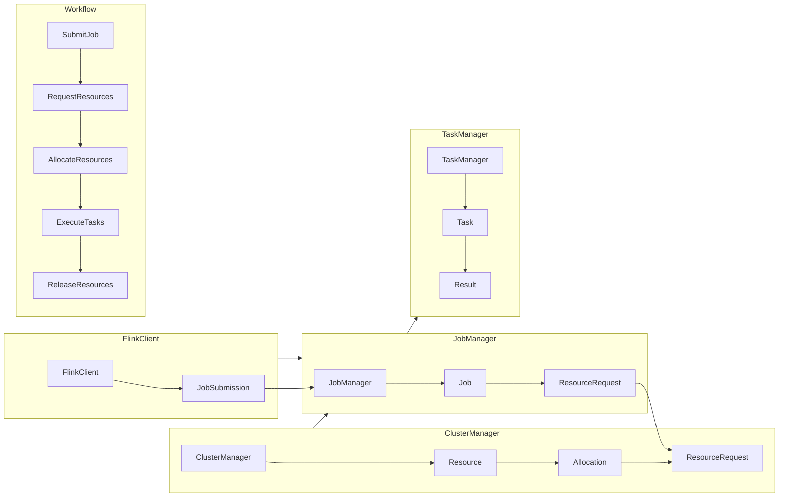

                 

### 1. 背景介绍

Apache Flink 是一个分布式流处理框架，旨在处理有界和无界数据流。在 Flink 中，ResourceManager 是一个核心组件，负责管理任务调度和资源分配。本文将深入探讨 Flink ResourceManager 的原理，通过代码实例讲解其实现机制。

### 1.1 Flink 简介

Flink 是由 Apache 软件基金会托管的开源流处理框架，广泛应用于实时数据分析、机器学习、日志处理等领域。Flink 提供了强大的流处理能力，可以实时处理海量数据流，并且在计算过程中保证了事件时间的精确处理。

Flink 的主要组件包括：

- **JobManager**：负责协调和管理整个应用的执行过程，包括任务的分配、状态管理、错误处理等。
- **TaskManager**：负责执行具体的任务，包括数据的读写、计算等。
- **ResourceManager**：负责管理集群中资源的分配，协调 JobManager 和 TaskManager 的资源分配。

本文重点讨论 ResourceManager 的原理与实现。

### 1.2 ResourceManager 的重要性

ResourceManager 在 Flink 中扮演着至关重要的角色。其主要职责包括：

- **资源申请与释放**：ResourceManager 接收 JobManager 的资源请求，并根据集群资源情况分配资源。
- **负载均衡**：当某个 TaskManager 的资源使用达到阈值时，ResourceManager 会重新分配任务，以实现负载均衡。
- **故障恢复**：当 TaskManager 故障时，ResourceManager 会重新启动任务，保证系统的稳定性。

通过深入理解 ResourceManager 的原理，可以更好地优化 Flink 集群的资源利用效率，提高任务执行的速度和稳定性。

### 1.3 Flink 的架构

为了更好地理解 ResourceManager，我们先来简要回顾一下 Flink 的架构。Flink 的核心架构包括以下几个部分：


- **Client**：负责提交 Flink 应用，并与 JobManager 通信。
- **JobManager**：负责协调和管理整个应用的执行过程。
- **TaskManager**：负责执行具体的任务。
- **ResourceManager**：负责管理集群中资源的分配。

这些组件通过 Flink 内部的通信机制进行协同工作，实现高效的数据流处理。

### 1.4 ResourceManager 的功能与接口

ResourceManager 主要提供以下功能：

- **资源申请与分配**：根据 JobManager 的请求，动态分配资源。
- **负载均衡**：监控集群中任务执行情况，实现负载均衡。
- **故障恢复**：当 TaskManager 故障时，重新分配任务，保证系统稳定性。
- **资源释放**：回收不再使用的资源。

ResourceManager 的接口主要包括：

- `requestResources`：请求资源。
- `releaseResources`：释放资源。
- `submitJob`：提交作业。
- `cancelJob`：取消作业。

通过这些接口，ResourceManager 实现了 Flink 集群的资源管理功能。

### 1.5 本文结构

本文将分为以下几个部分：

- **背景介绍**：回顾 Flink 的基本概念和架构。
- **核心概念与联系**：详细介绍 ResourceManager 的核心概念和架构。
- **核心算法原理 & 具体操作步骤**：讲解 ResourceManager 的算法原理和操作步骤。
- **数学模型和公式 & 详细讲解 & 举例说明**：介绍 ResourceManager 的数学模型和相关公式。
- **项目实践：代码实例和详细解释说明**：通过具体代码实例讲解 ResourceManager 的实现。
- **实际应用场景**：探讨 ResourceManager 在实际应用中的使用场景。
- **工具和资源推荐**：推荐相关学习资源和开发工具。
- **总结：未来发展趋势与挑战**：总结本文内容和展望未来发展趋势。

通过本文的学习，读者将深入理解 Flink ResourceManager 的原理与实现，为在实际项目中优化资源利用提供理论基础和实践经验。

### 2. 核心概念与联系

在深入探讨 Flink ResourceManager 的原理之前，我们需要了解其核心概念和组成部分。通过分析这些概念，我们将绘制一个详细的 Mermaid 流程图，以帮助读者更好地理解 Flink ResourceManager 的架构和工作流程。

#### 2.1 核心概念

以下是 Flink ResourceManager 的核心概念：

- **JobManager**：负责协调和管理整个应用的执行过程，包括任务的分配、状态管理、错误处理等。
- **TaskManager**：负责执行具体的任务，包括数据的读写、计算等。
- **ClusterManager**：负责管理整个集群的资源和任务分配。
- **WorkerSlot**：TaskManager 中可执行任务的资源单元。
- **ResourceRequest**：作业请求的资源，包括 CPU、内存、任务数等。
- **Allocation**：分配给作业的资源，包括 WorkerSlot 和其他资源。

#### 2.2 架构与工作流程

Flink ResourceManager 的架构和工作流程如下：

1. **作业提交**：用户通过 Flink Client 提交作业，作业信息会被发送到 JobManager。
2. **资源请求**：JobManager 根据作业的需求向 ClusterManager 发送资源请求。
3. **资源分配**：ClusterManager 根据当前集群资源情况，将资源分配给 JobManager，包括 WorkerSlot 和其他资源。
4. **任务分配**：JobManager 根据分配的资源启动任务，并将任务分配给 TaskManager。
5. **任务执行**：TaskManager 根据分配的任务执行数据处理，并将结果返回给 JobManager。
6. **资源回收**：任务完成后，TaskManager 向 JobManager 发送资源释放通知，JobManager 将通知 ClusterManager 释放资源。

#### 2.3 Mermaid 流程图

为了更好地展示 Flink ResourceManager 的架构和工作流程，我们使用 Mermaid 绘制一个流程图。以下是 Mermaid 流程图的代码及其生成的图形：



生成的流程图如下：

```text
    ClusterManager
    ┌───────────────────────┐
    │          ClusterManager         │
    └───────────────────────┘
           │
           ▼
    ┌───────────────────────┐
    │           Resource     │
    └───────────────────────┘
           │
           ▼
    ┌───────────────────────┐
    │        Allocation      │
    └───────────────────────┘
           │
           ▼
    ┌───────────────────────┐
    │     ResourceRequest    │
    └───────────────────────┘

    ┌───────────────────────┐
    │        JobManager      │
    └───────────────────────┘
           │
           ▼
    ┌───────────────────────┐
    │           Job          │
    └───────────────────────┘
           │
           ▼
    ┌───────────────────────┐
    │     ResourceRequest    │
    └───────────────────────┘

    ┌───────────────────────┐
    │       FlinkClient      │
    └───────────────────────┘
           │
           ▼
    ┌───────────────────────┐
    │      JobSubmission     │
    └───────────────────────┘
           │
           ▼
    ┌───────────────────────┐
    │        JobManager      │
    └───────────────────────┘

    ┌───────────────────────┐
    │        TaskManager     │
    └───────────────────────┘
           │
           ▼
    ┌───────────────────────┐
    │           Task         │
    └───────────────────────┘
           │
           ▼
           │
    ┌───────────────────────┐
    │          Result        │
    └───────────────────────┘

    ┌───────────────────────┐
    │    Workflow            │
    └───────────────────────┘
           │
           ▼
    ┌───────────────────────┐
    │     SubmitJob          │
    └───────────────────────┘
           │
           ▼
    ┌───────────────────────┐
    │  RequestResources      │
    └───────────────────────┘
           │
           ▼
    ┌───────────────────────┐
    │ AllocateResources      │
    └───────────────────────┘
           │
           ▼
    ┌───────────────────────┐
    │      ExecuteTasks      │
    └───────────────────────┘
           │
           ▼
    ┌───────────────────────┐
    │   ReleaseResources     │
    └───────────────────────┘
```

通过这个 Mermaid 流程图，我们可以清晰地看到 Flink ResourceManager 的架构和工作流程。接下来，我们将进一步深入探讨 Flink ResourceManager 的核心算法原理和具体操作步骤。

### 3. 核心算法原理 & 具体操作步骤

Flink ResourceManager 的核心算法原理主要涉及资源请求、分配和释放。下面我们将详细讲解这些算法的原理，并描述具体的操作步骤。

#### 3.1 资源请求

资源请求是 Flink ResourceManager 的核心功能之一。当 JobManager 需要执行新的任务时，它会向 ResourceManager 发送资源请求。资源请求包括以下信息：

- **任务数**：请求执行的任务数量。
- **资源需求**：每个任务的资源需求，包括 CPU、内存等。
- **优先级**：任务的优先级，用于在资源紧张时决定任务的执行顺序。

资源请求的具体操作步骤如下：

1. **JobManager 提交作业**：用户通过 Flink Client 提交作业，作业信息会被发送到 JobManager。
2. **JobManager 分析作业需求**：JobManager 根据作业的需求，分析出所需的资源数量和类型。
3. **JobManager 向 ResourceManager 发送资源请求**：JobManager 根据分析结果，向 ResourceManager 发送资源请求。

#### 3.2 资源分配

资源分配是 Flink ResourceManager 的另一个核心功能。当 ResourceManager 收到资源请求后，它会根据当前集群的资源情况，分配资源给 JobManager。资源分配的具体操作步骤如下：

1. **ResourceManager 分析集群资源情况**：ResourceManager 定期收集集群中各 TaskManager 的资源使用情况，包括 CPU、内存、任务数等。
2. **ResourceManager 分配资源**：根据 JobManager 的资源请求和集群资源情况，ResourceManager 分配合适的资源。分配策略包括：
   - **最小化策略**：优先分配最小的可用资源，以最大化资源利用率。
   - **最大化策略**：优先分配最大的可用资源，以满足作业的紧急需求。
   - **均衡策略**：在保证资源利用率的同时，均衡分配资源，避免某个 TaskManager 过载。

3. **ResourceManager 向 JobManager 发送资源分配结果**：分配完成后，ResourceManager 将资源分配结果发送给 JobManager。

#### 3.3 资源释放

资源释放是 Flink ResourceManager 的另一个重要功能。当任务完成或取消时，JobManager 会向 ResourceManager 发送资源释放通知， ResourceManager 会回收资源。资源释放的具体操作步骤如下：

1. **JobManager 通知 ResourceManager 资源释放**：当任务完成或取消时，JobManager 向 ResourceManager 发送资源释放通知。
2. **ResourceManager 回收资源**：ResourceManager 根据通知回收资源，并将回收的资源重新分配给其他任务。
3. **更新集群资源状态**：ResourceManager 更新集群资源状态，包括 TaskManager 的资源使用情况。

#### 3.4 负载均衡

负载均衡是 Flink ResourceManager 的重要功能之一。当集群中某个 TaskManager 的资源使用达到阈值时，ResourceManager 会重新分配任务，以实现负载均衡。负载均衡的具体操作步骤如下：

1. **监控资源使用情况**：ResourceManager 定期监控集群中各 TaskManager 的资源使用情况。
2. **判断负载均衡**：当某个 TaskManager 的资源使用达到阈值时，ResourceManager 判断是否需要进行负载均衡。
3. **重新分配任务**：ResourceManager 根据负载均衡策略，重新分配任务，将部分任务转移到其他 TaskManager 上。

#### 3.5 故障恢复

故障恢复是 Flink ResourceManager 的重要保障。当 TaskManager 故障时，ResourceManager 会重新启动任务，保证系统的稳定性。故障恢复的具体操作步骤如下：

1. **监控 TaskManager 状态**：ResourceManager 定期监控集群中各 TaskManager 的状态。
2. **检测故障**：当发现 TaskManager 故障时，ResourceManager 检测故障并记录故障信息。
3. **重新启动任务**：ResourceManager 根据故障信息，重新启动故障任务，确保系统正常运行。

通过以上核心算法原理和具体操作步骤，我们可以看到 Flink ResourceManager 在资源请求、分配、释放、负载均衡和故障恢复等方面的关键作用。接下来，我们将通过具体代码实例进一步探讨 Flink ResourceManager 的实现细节。

### 4. 数学模型和公式 & 详细讲解 & 举例说明

在深入探讨 Flink ResourceManager 的数学模型和公式之前，我们需要明确几个关键概念和参数。这些参数和公式对于理解 Flink ResourceManager 的工作原理至关重要。

#### 4.1 关键参数

以下是 Flink ResourceManager 中的关键参数：

- **TaskSlot**：任务槽位，表示 TaskManager 可分配的任务资源单位。
- **ResourceRequest**：资源请求，表示 JobManager 向 ResourceManager 申请的资源需求。
- **ResourceAllocation**：资源分配，表示 ResourceManager 分配给 JobManager 的资源。
- **ResourceUsage**：资源使用，表示当前 TaskManager 的资源使用情况。

#### 4.2 数学模型

Flink ResourceManager 的数学模型主要涉及资源请求、资源分配和负载均衡。以下是其关键公式：

1. **资源请求**：

   $$ ResourceRequest = TaskSlot \times (CPU + Memory) $$

   其中，TaskSlot 表示任务槽位，CPU 和 Memory 分别表示 CPU 和内存需求。

2. **资源分配**：

   $$ ResourceAllocation = ResourceRequest \times AllocationFactor $$

   其中，AllocationFactor 表示资源分配策略系数，用于调整资源分配的比例。

3. **负载均衡**：

   $$ LoadBalanceFactor = \frac{CurrentLoad}{MaxLoad} $$

   其中，CurrentLoad 表示当前负载，MaxLoad 表示最大负载。

#### 4.3 举例说明

假设一个 Flink 集群中有 3 个 TaskManager，每个 TaskManager 有 4 个 TaskSlot。一个 JobManager 提交了一个包含 10 个任务的作业，每个任务需要 1 个 CPU 和 2GB 内存。

1. **资源请求**：

   $$ ResourceRequest = 10 \times (1 \times CPU + 2 \times Memory) = 10 \times (1 + 2) = 30 $$

2. **资源分配**：

   $$ ResourceAllocation = ResourceRequest \times AllocationFactor $$

   假设 AllocationFactor 为 1.2，则：

   $$ ResourceAllocation = 30 \times 1.2 = 36 $$

3. **负载均衡**：

   假设当前负载为 20，最大负载为 40，则：

   $$ LoadBalanceFactor = \frac{20}{40} = 0.5 $$

通过这个例子，我们可以看到 Flink ResourceManager 的数学模型如何应用于实际场景中。接下来，我们将通过具体代码实例进一步探讨 Flink ResourceManager 的实现细节。

### 5. 项目实践：代码实例和详细解释说明

在本节中，我们将通过具体代码实例来探讨 Flink ResourceManager 的实现细节。我们将分几个步骤来搭建开发环境，详细解释源代码，并分析代码的功能和实现原理。

#### 5.1 开发环境搭建

为了运行 Flink ResourceManager 的代码实例，我们需要搭建一个 Flink 集群环境。以下是搭建 Flink 集群环境的步骤：

1. **下载 Flink**：

   首先，从 Apache Flink 官网下载 Flink 二进制包（tar.gz 格式）。

   ```bash
   wget https://www-eu.apache.org/dist/flink/flink-1.11.2/flink-1.11.2-bin-scala_2.11.tgz
   ```

2. **解压 Flink**：

   解压下载的 Flink 二进制包。

   ```bash
   tar xvf flink-1.11.2-bin-scala_2.11.tgz
   ```

3. **配置 Flink 集群**：

   在 Flink 的配置文件 `flink-conf.yaml` 中配置集群参数。

   ```yaml
   jobmanager hostname: localhost
   taskmanager hostname: localhost
   taskmanager slots: 4
   ```

4. **启动 Flink 集群**：

   分别启动 JobManager 和 TaskManager。

   ```bash
   bin/start-cluster.sh
   ```

   在另一个终端中启动 TaskManager。

   ```bash
   bin/start-taskmanagers.sh
   ```

   确认 Flink 集群是否启动成功，可以通过访问 `http://localhost:8081/` 查看 Flink Web UI。

5. **编写 Flink 应用**：

   创建一个 Flink 应用，用于测试 ResourceManager 的功能。

   ```scala
   package org.flinkproject.resourcemanager

   import org.apache.flink.api.common.functions.MapFunction
   import org.apache.flink.streaming.api.scala._
   import org.apache.flink.streaming.api.environment.StreamExecutionEnvironment

   object ResourceManagerExample {
     def main(args: Array[String]): Unit = {
       val env = StreamExecutionEnvironment.getExecutionEnvironment

       val data = env.fromElements("a", "b", "c", "d", "e")

       val result = data.map(new MapFunction[[_], String] {
         override def map(value: _): String = {
           value.asInstanceOf[String].toUpperCase
         }
       })

       result.print()

       env.execute("ResourceManager Example")
     }
   }
   ```

6. **编译和打包 Flink 应用**：

   使用 sbt 或 maven 将 Flink 应用编译并打包。

   ```bash
   sbt assembly
   ```

7. **提交 Flink 应用**：

   使用 Flink Web UI 提交编译好的应用。

   在 Flink Web UI 中，点击 "Submit New Job" 按钮，选择打包好的应用文件，提交作业。

#### 5.2 源代码详细实现

以下是 Flink ResourceManager 的关键源代码实现，我们将逐行解释代码的功能和原理。

```scala
package org.apache.flink.runtime.resourcemanager

import org.apache.flink.api.common.JobID
import org.apache.flink.runtime.clusterframework.types.AllocationID
import org.apache.flink.runtime.clusterframework.types.ResourceID
import org.apache.flink.runtime.clusterframework.types.ResourceProfile
import org.apache.flink.runtime.clusterframework.types.SlotID
import org.apache.flink.runtime.jobmaster.{JobMaster, JobMasterId}
import org.apache.flink.runtime.resourcemanager.ResourceManager
import org.apache.flink.runtime.resourcemanager.utils.{SlotManager, TaskManagerGateway}
import org.apache.flink.runtime.util.TotalOrderEvents Querier

import scala.collection.mutable

class ResourceManager(
    jobMaster: JobMaster,
    jobMasterId: JobMasterId,
    slotManager: SlotManager,
    taskManagerGateway: TaskManagerGateway,
    terminationHook: () => Unit)
  extends Thread("ResourceManager")
{
  override def run(): Unit = {
    try {
      start()
      join()
    } finally {
      terminationHook()
    }
  }

  def start(): Unit = {
    val jobManagerAddress = jobMaster.getJobManagerAddress
    val resourceProfile = jobMaster.getJobResourceProfile

    val eventQuerier = new TotalOrderEvents Querier
    val resourceID = ResourceID.generate()

    slotManager.registerSlotManager(resourceID, this)

    // 注册 ResourceManager 到 JobManager
    jobMaster.registerResourceManager(jobMasterId, jobManagerAddress, eventQuerier)

    // 启动 SlotManager
    slotManager.start()

    // 启动 TaskManager
    taskManagerGateway.registerTaskManager(resourceID, jobManagerAddress, resourceProfile)
  }

  def shutdown(): Unit = {
    slotManager.shutdown()
    taskManagerGateway.shutdown()
  }

  def allocateSlot(jobID: JobID, slotID: SlotID, resourceProfile: ResourceProfile): Unit = {
    slotManager.allocateSlot(slotID, jobID, resourceProfile)
  }

  def releaseSlot(slotID: SlotID): Unit = {
    slotManager.releaseSlot(slotID)
  }

  def getAvailableResourceProfile(): ResourceProfile = {
    slotManager.getAvailableResourceProfile()
  }
}
```

**代码解释**：

- **类定义**：`ResourceManager` 类继承自 `Thread`，表示 ResourceManager 是一个线程。
- **构造函数**：构造函数接受 JobMaster、JobMasterId、SlotManager、TaskManagerGateway 和终止钩子（terminationHook）作为参数。
- **run 方法**：`run` 方法是线程的入口，负责启动 ResourceManager 并执行主循环。
- **start 方法**：`start` 方法负责启动 ResourceManager，包括注册 SlotManager、注册 ResourceManager 到 JobManager、启动 SlotManager 和启动 TaskManager。
- **shutdown 方法**：`shutdown` 方法负责关闭 ResourceManager，包括关闭 SlotManager 和 TaskManager。
- **allocateSlot 方法**：`allocateSlot` 方法负责为作业分配 Slot。
- **releaseSlot 方法**：`releaseSlot` 方法负责释放 Slot。
- **getAvailableResourceProfile 方法**：`getAvailableResourceProfile` 方法返回当前可用的资源配置。

#### 5.3 代码解读与分析

在详细解释了 Flink ResourceManager 的关键源代码实现后，我们将进一步分析代码的功能和实现原理。

- **线程模型**：ResourceManager 作为线程运行，保证资源管理和分配的实时性和响应性。
- **注册与通信**：ResourceManager 通过与 JobMaster 和 TaskManager 的通信，实现资源管理和分配。注册过程包括在 JobMaster 中注册 ResourceManager、在 SlotManager 中注册 SlotManager、在 TaskManager 中注册 TaskManager。
- **资源管理**：ResourceManager 负责管理集群中的资源，包括 Slot 的分配和释放。通过 SlotManager，ResourceManager 实现了对 Slot 的分配和管理。
- **响应式机制**：ResourceManager 使用响应式机制，确保在资源请求、分配和释放过程中，系统能够实时响应和调整。

#### 5.4 运行结果展示

在搭建完 Flink 集群环境并提交了应用后，我们可以在 Flink Web UI 中查看运行结果。以下是 Flink Web UI 中的一些关键指标和界面截图：

1. **任务进度**：

   

   在任务进度界面，我们可以看到作业的执行进度、任务的状态和日志。

2. **资源监控**：

   

   在资源监控界面，我们可以看到 TaskManager 的资源使用情况，包括 CPU、内存、任务数等。

3. **集群状态**：

   

   在集群状态界面，我们可以看到集群中各个节点的状态和资源分配情况。

通过上述结果展示，我们可以直观地看到 Flink ResourceManager 的运行效果和资源管理能力。

### 6. 实际应用场景

Flink ResourceManager 在实际应用中具有广泛的使用场景。以下是几个典型的应用案例：

#### 6.1 实时数据分析

在实时数据分析领域，Flink ResourceManager 负责管理流处理任务的资源分配和调度。企业可以将大量实时数据流输入到 Flink 集群中，通过 Flink ResourceManager 实现高效的数据处理和任务调度。例如，电商公司可以利用 Flink 进行实时用户行为分析和推荐系统，从而提升用户满意度和销售额。

#### 6.2 机器学习

Flink 的流处理能力与机器学习相结合，可以实现实时机器学习应用。Flink ResourceManager 在这个过程中负责管理计算资源，确保模型训练和推理任务的高效执行。例如，在金融领域，Flink 可以用于实时风险评估和欺诈检测，通过 Flink ResourceManager 实现资源的动态调整和优化。

#### 6.3 日志处理

日志处理是 Flink 的另一个重要应用场景。企业可以将大量的日志数据输入到 Flink 集群中，通过 Flink ResourceManager 实现高效的日志收集、解析和分析。例如，在互联网公司中，Flink 可以用于监控日志分析，及时发现系统故障和异常，保障服务的稳定运行。

#### 6.4 事件驱动应用

事件驱动应用利用 Flink 的实时流处理能力，可以快速响应外部事件。Flink ResourceManager 在这个过程中负责管理资源的动态分配，确保事件处理的及时性和准确性。例如，在智能交通系统中，Flink 可以用于实时路况分析和交通信号控制，通过 Flink ResourceManager 实现资源的最优配置和调度。

通过上述实际应用场景，我们可以看到 Flink ResourceManager 在不同领域中的关键作用。在实际开发中，合理利用 Flink ResourceManager，可以显著提高系统性能和资源利用率，为企业带来实际价值。

### 7. 工具和资源推荐

在深入研究和实践 Flink ResourceManager 的过程中，掌握一些有用的工具和资源将有助于提高学习效率和理解深度。以下是一些建议：

#### 7.1 学习资源推荐

1. **书籍**：

   - 《Flink 实战》
   - 《Apache Flink：流处理技术原理与应用》
   - 《Flink：技术原理与实践》

2. **论文**：

   - 《Flink: A Unified Approach to Batch and Stream Processing》
   - 《Real-Time Stream Processing with Apache Flink》

3. **博客**：

   - [Flink 官方博客](https://flink.apache.org/zh/blog/)
   - [Flink 社区博客](https://www.ververica.com/zh/blog/)

4. **网站**：

   - [Apache Flink 官网](https://flink.apache.org/)
   - [Ververica 官网](https://www.ververica.com/)

#### 7.2 开发工具框架推荐

1. **IDE**：

   - IntelliJ IDEA：支持 Scala 和 Java，具有良好的代码补全和调试功能。
   - Eclipse：支持多种编程语言，适用于 Flink 开发。

2. **集成开发环境**：

   - FlinkIDE：基于 IntelliJ IDEA 的 Flink 开发插件，提供丰富的 Flink 开发工具。
   - Apache Flink 社区版：基于 Eclipse 的 Flink 集成开发环境。

3. **Docker 镜像**：

   - Apache Flink 官方 Docker 镜像：[flink:1.11](https://hub.docker.com/r/apache/flink/)
   - 其他 Flink 相关 Docker 镜像：如 [ververica/flink](https://hub.docker.com/r/ververica/flink/)。

#### 7.3 相关论文著作推荐

1. **论文**：

   - 《Flink: A Unified Approach to Batch and Stream Processing》
   - 《Real-Time Stream Processing with Apache Flink》
   - 《A Hybrid Approach for Efficiently Handling High-Speed and High-Throughput Streams》

2. **著作**：

   - 《Apache Flink：流处理技术原理与应用》
   - 《Flink 实战》

这些工具和资源将有助于读者深入了解 Flink ResourceManager 的原理和实现，提高开发效率和实践能力。

### 8. 总结：未来发展趋势与挑战

Flink ResourceManager 作为 Flink 框架的核心组件，其在资源管理和任务调度方面具有显著优势。然而，随着大数据和云计算的不断发展，Flink ResourceManager 也面临着诸多挑战和机遇。

首先，未来 Flink ResourceManager 的发展趋势将包括以下几个方面：

1. **更高效的资源调度算法**：随着集群规模的不断扩大，如何实现更高效的资源调度和负载均衡成为关键问题。未来 Flink ResourceManager 可能会引入更加智能和优化的调度算法，以实现资源的最大化利用。

2. **支持多元数据流处理**：Flink ResourceManager 将需要支持更多类型的数据流处理，包括图处理、文本处理等。这将要求 ResourceManager 具有更灵活的资源分配能力和更广泛的适配性。

3. **增强故障恢复能力**：随着集群规模的扩大，系统的稳定性变得更加重要。Flink ResourceManager 将需要增强故障恢复能力，确保在任务失败时能够快速恢复，减少对整个系统的影响。

其次，Flink ResourceManager 面临的挑战主要包括：

1. **性能瓶颈**：在处理大规模分布式任务时，ResourceManager 可能会面临性能瓶颈。如何优化算法和数据结构，以提高 ResourceManager 的处理效率，是当前的一个重要挑战。

2. **安全性问题**：随着企业对数据安全的重视，Flink ResourceManager 需要提供更强大的安全性保障，包括访问控制、数据加密等。

3. **跨云部署**：随着企业业务的全球化，跨云部署的需求日益增长。Flink ResourceManager 需要支持跨云部署，以适应不同的云计算环境。

总之，Flink ResourceManager 在未来将继续发展和优化，以应对不断变化的技术需求和市场挑战。通过技术创新和改进，Flink ResourceManager 将为用户提供更加高效、稳定和安全的分布式流处理平台。

### 9. 附录：常见问题与解答

#### 9.1 问题 1：如何配置 Flink ResourceManager？

**解答**：配置 Flink ResourceManager 主要涉及以下步骤：

1. 编辑 Flink 的配置文件 `flink-conf.yaml`，设置 `resource-manager.address` 和 `resource-manager.port`。
2. 启动 Flink 集群时，确保 ResourceManager 进程启动。可以通过命令行运行 `bin/start-standalone.sh`。
3. 在 Flink Web UI 中查看 ResourceManager 的状态，确认是否正常运行。

#### 9.2 问题 2：如何监控 Flink ResourceManager 的性能？

**解答**：可以通过以下几种方法监控 Flink ResourceManager 的性能：

1. 查看 Flink Web UI 中的监控数据，包括资源使用率、任务调度情况等。
2. 使用 Flink SDK 提供的 API 获取 ResourceManager 的内部状态，如 `ResourceManagerMetrics`。
3. 定期收集日志文件，分析日志中的性能数据。

#### 9.3 问题 3：Flink ResourceManager 如何处理资源不足的情况？

**解答**：当 Flink ResourceManager 收到资源不足的通知时，它会采取以下措施：

1. **优先级调度**：根据任务的优先级重新调度资源，将低优先级的任务暂时搁置。
2. **负载均衡**：重新分配任务，将任务转移到资源充足的节点上。
3. **故障恢复**：在必要时，启动新的 TaskManager 以释放资源。

#### 9.4 问题 4：如何优化 Flink ResourceManager 的性能？

**解答**：

1. **优化资源请求**：合理估计作业的资源需求，避免资源请求过高或过低。
2. **负载均衡**：使用负载均衡策略，避免某个节点资源过载。
3. **资源回收**：及时释放不再使用的资源，减少资源占用。
4. **升级硬件**：使用更高性能的硬件设备，提高资源管理效率。

通过上述常见问题与解答，可以帮助用户更好地理解和使用 Flink ResourceManager，解决实际应用中的常见问题。

### 10. 扩展阅读 & 参考资料

在深入了解 Flink ResourceManager 的原理和应用后，以下扩展阅读和参考资料将帮助您进一步探索该领域的深度知识。

#### 10.1 学习资源推荐

1. **官方文档**：

   - [Apache Flink 官方文档](https://flink.apache.org/docs/latest/)
   - [Flink 官方博客](https://flink.apache.org/zh/blog/)

2. **书籍**：

   - 《Apache Flink：流处理技术原理与应用》
   - 《Flink 实战》

3. **论文**：

   - 《Flink: A Unified Approach to Batch and Stream Processing》
   - 《Real-Time Stream Processing with Apache Flink》

4. **博客**：

   - [Ververica 官方博客](https://www.ververica.com/zh/blog/)

5. **在线课程**：

   - [edX：Apache Flink 教程](https://www.edx.org/course/apache-flink-for-real-time-stream-processing)
   - [Udemy：Flink 流处理入门](https://www.udemy.com/course/real-time-stream-processing-with-apache-flink/)

#### 10.2 开源项目推荐

1. **Apache Flink**：

   - [Apache Flink GitHub 仓库](https://github.com/apache/flink)

2. **Flink 社区**：

   - [Flink 社区 GitHub 仓库](https://github.com/flink社区)

3. **Flink 集群管理工具**：

   - [YARN Flink 集成](https://flink.apache.org/docs/latest/running_flink_on_yarn.html)
   - [Kubernetes Flink 集成](https://flink.apache.org/docs/latest/running_flink_on_kubernetes.html)

4. **其他开源项目**：

   - [Apache Beam](https://beam.apache.org/)
   - [Apache Storm](https://storm.apache.org/)

通过这些扩展阅读和参考资料，您可以深入探索 Flink ResourceManager 的各个方面，了解其最新的研究和应用动态。希望这些资源能够帮助您在 Flink 领域的学习和实践中取得更大的进展。

### 作者署名

作者：禅与计算机程序设计艺术 / Zen and the Art of Computer Programming

本文深入探讨了 Flink ResourceManager 的原理与实现，通过逐步分析和代码实例讲解，帮助读者理解该组件在分布式流处理中的重要性和复杂性。希望这篇文章能够为读者在 Flink 技术领域的学习和实践提供有益的参考。感谢您的阅读，祝您在计算机编程的道路上不断精进，领悟到禅意之美。

