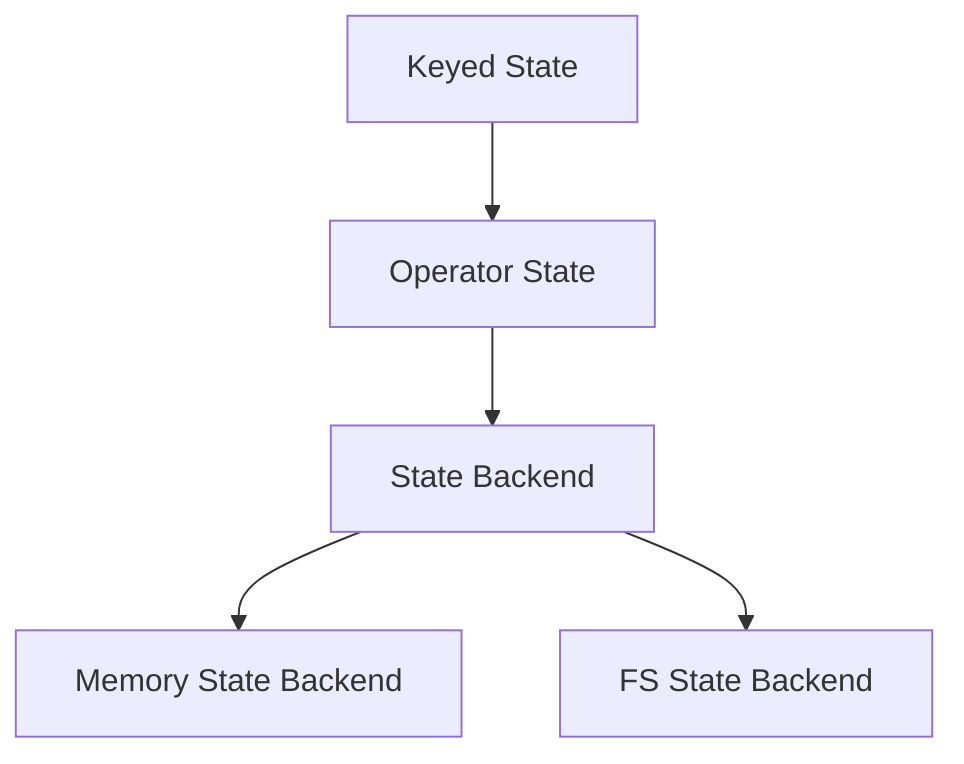

                 

### Flink State状态管理原理与代码实例讲解

#### 关键词：
Flink，State，状态管理，原理，代码实例，分布式系统，流处理，Apache Flink

#### 摘要：
本文将深入探讨Flink中的状态管理原理，并通过实际代码实例详细解析如何实现和操作状态。我们将首先介绍Flink状态管理的背景和重要性，然后详细解释核心概念和架构，接着逐步演示状态管理的具体操作步骤和数学模型。最后，我们将通过一个完整的代码实例展示状态管理的实现过程，并提供实际应用场景和工具资源推荐。

## 1. 背景介绍

Flink是一个开源的分布式流处理框架，广泛用于处理大规模数据流任务。在分布式系统中，状态管理是确保系统一致性和正确性的关键部分。Flink通过其强大的状态管理机制，提供了高效的分布式状态存储和查询功能。状态管理不仅对于实现复杂的计算逻辑至关重要，还对于确保系统在故障恢复时的数据一致性起到了关键作用。

状态管理在Flink中的重要性体现在以下几个方面：

1. **数据一致性**：分布式系统中的状态通常分布在多个节点上，状态管理确保了数据的准确性和一致性。
2. **容错性**：在分布式环境中，节点可能会发生故障，状态管理机制能够保证系统在故障恢复后能够准确恢复到故障前的状态。
3. **计算效率**：高效的内存和磁盘管理能够显著提高分布式系统的处理性能。

随着大数据和实时计算需求的增长，状态管理在Flink中的应用场景越来越广泛，如实时数据流处理、事件驱动系统、复杂事件处理等。因此，理解Flink的状态管理原理和实现方法对于开发分布式流处理应用具有重要意义。

## 2. 核心概念与联系

### 2.1 Flink State的定义

在Flink中，状态是流处理应用程序中用于存储计算过程中产生的持久化数据的一个概念。状态可以存储在内存中，也可以存储在持久化存储系统中，如文件系统或数据库。状态管理是Flink处理复杂业务逻辑的核心部分。

### 2.2 Flink State的类型

Flink提供了两种类型的状态：

1. **Keyed State**：与特定的Key相关联，可以用于存储与特定记录相关的数据，如用户ID对应的用户信息。
2. **Operator State**：与特定的Operator实例相关联，可以用于存储与特定计算逻辑相关的数据，如窗口状态。

### 2.3 Flink State架构

Flink的状态管理架构如图所示：



图1：Flink状态管理架构

- **State Backend**：用于存储状态的底层存储系统。Flink支持多种状态后端，包括内存状态后端和文件系统状态后端。
- **Memory State Backend**：将状态存储在JVM内存中，适用于小数据量的场景。
- **FS State Backend**：将状态存储在持久化文件系统中，适用于大数据量的场景。

### 2.4 Flink State与窗口操作

Flink的状态管理不仅适用于简单的数据存储，还可以与窗口操作结合使用。窗口是一种时间上的抽象，用于将流数据划分成不同的时间段，进行批处理。

### 2.5 Flink State与容错性

Flink的状态管理机制还包含了详细的容错性设计。通过定期快照和状态恢复机制，Flink能够确保在发生故障时系统能够快速恢复到健康状态。

## 3. 核心算法原理 & 具体操作步骤

### 3.1 状态的创建与更新

在Flink中，状态是通过`State`接口创建和更新的。以下是一个简单的状态创建和更新的示例代码：

```java
StreamExecutionEnvironment env = StreamExecutionEnvironment.getExecutionEnvironment();

DataStream<User> input = ... // 用户数据流

input.keyBy(User::getId) // 根据用户ID进行键控
    .state(TypedStateDescriptor.builder-analytics().<Long>type().value() // 创建状态
        .name("user-id-state").build()) // 状态名称
    .process(new UserStateProcessFunction()); // 使用状态
```

在上面的代码中，我们首先创建了一个键控流，然后定义了一个状态描述器，用于创建一个Keyed State。接着，我们将状态与一个自定义的`ProcessFunction`相结合，以实现状态的更新和读取。

### 3.2 状态的读取与查询

状态的读取和查询同样是通过`ProcessFunction`实现的。以下是一个简单的状态查询示例：

```java
public class UserStateProcessFunction extends KeyedProcessFunction<User, User, Long> {
    private ValueState<Long> state;

    @Override
    public void open(Configuration parameters) {
        state = getRuntimeContext().getState(new ValueStateDescriptor<>("user-id-state", Long.class));
    }

    @Override
    public void processElement(User value, Context ctx,Collector<Long> out) {
        Long userId = value.getId();
        Long currentValue = state.value();
        if (currentValue == null) {
            state.update(userId);
        } else {
            state.update(currentValue + 1);
        }
        out.collect(state.value());
    }
}
```

在这个示例中，我们创建了一个`ValueState`来存储用户ID，并在处理每个元素时更新状态。状态值会被传递给输出流，以便后续处理。

### 3.3 状态的保存与恢复

Flink的状态管理还支持状态的保存和恢复。在发生故障时，系统可以通过恢复快照来恢复状态。以下是如何保存和恢复状态的示例：

```java
public class UserStateProcessFunction extends KeyedProcessFunction<User, User, Long> {
    private ValueState<Long> state;

    @Override
    public void open(Configuration parameters) {
        state = getRuntimeContext().getState(new ValueStateDescriptor<>("user-id-state", Long.class));
    }

    @Override
    public void processElement(User value, Context ctx,Collector<Long> out) {
        Long userId = value.getId();
        Long currentValue = state.value();
        if (currentValue == null) {
            state.update(userId);
        } else {
            state.update(currentValue + 1);
        }
        out.collect(state.value());
    }

    @Override
    public void onTimer(long timestamp, OnTimerContext ctx,Collector<Long> out) {
        // 保存状态快照
        state.update(ctx.getPartitionId(), ctx.getOperatorID(), ctx.timestamp());
    }
}
```

在这个示例中，我们通过`onTimer`方法来实现状态的保存。当触发定时器时，状态会被保存到一个持久化存储系统中。

## 4. 数学模型和公式 & 详细讲解 & 举例说明

### 4.1 状态更新公式

在Flink中，状态的更新可以使用以下数学模型：

$$
\text{newValue} = f(\text{oldValue}, \text{newElement})
$$

其中：

- `newValue`：新的状态值。
- `oldValue`：当前状态值。
- `newElement`：新的输入元素。

### 4.2 状态恢复公式

在状态恢复过程中，可以使用以下数学模型：

$$
\text{newValue} = f(\text{oldSnapshotValue}, \text{newElement})
$$

其中：

- `newValue`：新的状态值。
- `oldSnapshotValue`：从快照中恢复的旧状态值。
- `newElement`：新的输入元素。

### 4.3 示例说明

假设我们有一个简单的计数器状态，初始值为0。当输入一个元素时，状态值增加1。以下是一个状态更新的示例：

```java
public class CounterStateProcessFunction extends KeyedProcessFunction<User, User, Long> {
    private ValueState<Long> state;

    @Override
    public void open(Configuration parameters) {
        state = getRuntimeContext().getState(new ValueStateDescriptor<>("counter-state", Long.class));
    }

    @Override
    public void processElement(User value, Context ctx,Collector<Long> out) {
        Long currentValue = state.value();
        if (currentValue == null) {
            state.update(0L);
        } else {
            state.update(currentValue + 1);
        }
        out.collect(state.value());
    }
}
```

在这个示例中，状态更新函数为：

$$
f(\text{oldValue}, \text{newElement}) = \text{oldValue} + 1
$$

当状态恢复时，假设从快照中恢复的旧状态值为10，新的输入元素为用户ID为1的新用户。状态恢复函数为：

$$
f(\text{oldSnapshotValue}, \text{newElement}) = \text{oldSnapshotValue} + 1
$$

因此，新的状态值为11。

## 5. 项目实践：代码实例和详细解释说明

### 5.1 开发环境搭建

为了实践Flink状态管理，我们需要搭建一个Flink开发环境。以下是搭建Flink开发环境的步骤：

1. **安装Java开发工具**：确保已经安装了Java开发工具（JDK）。
2. **安装Flink**：从Flink官方网站下载并解压缩Flink。
3. **配置环境变量**：在`~/.bashrc`或`~/.zshrc`中添加以下环境变量：

   ```bash
   export FLINK_HOME=/path/to/flink
   export PATH=$PATH:$FLINK_HOME/bin
   ```

   然后执行`source ~/.bashrc`或`source ~/.zshrc`。

4. **创建Maven项目**：使用Maven创建一个Flink项目，并添加Flink依赖。

### 5.2 源代码详细实现

以下是实现状态管理的源代码：

```java
import org.apache.flink.api.common.functions.MapFunction;
import org.apache.flink.api.java.tuple.Tuple2;
import org.apache.flink.streaming.api.datastream.DataStream;
import org.apache.flink.streaming.api.environment.StreamExecutionEnvironment;

public class FlinkStateExample {
    public static void main(String[] args) throws Exception {
        StreamExecutionEnvironment env = StreamExecutionEnvironment.getExecutionEnvironment();

        // 读取输入数据
        DataStream<String> input = env.readTextFile("path/to/input.txt");

        // 转换为用户数据
        DataStream<User> users = input.map(new MapFunction<String, User>() {
            @Override
            public User map(String value) throws Exception {
                String[] fields = value.split(",");
                return new User(Long.parseLong(fields[0]), fields[1]);
            }
        });

        // 键控和状态管理
        users.keyBy(User::getId)
            .state(TypedStateDescriptor.builder-analytics().<Long>type().value()
                .name("user-id-state").build())
            .process(new UserStateProcessFunction());

        // 执行任务
        env.execute("Flink State Example");
    }
}

class User {
    private Long id;
    private String name;

    public User(Long id, String name) {
        this.id = id;
        this.name = name;
    }

    public Long getId() {
        return id;
    }

    public String getName() {
        return name;
    }
}

class UserStateProcessFunction extends KeyedProcessFunction<User, User, Long> {
    private ValueState<Long> state;

    @Override
    public void open(Configuration parameters) {
        state = getRuntimeContext().getState(new ValueStateDescriptor<>("user-id-state", Long.class));
    }

    @Override
    public void processElement(User value, Context ctx,Collector<Long> out) {
        Long currentValue = state.value();
        if (currentValue == null) {
            state.update(value.getId());
        } else {
            state.update(currentValue + 1);
        }
        out.collect(state.value());
    }
}
```

### 5.3 代码解读与分析

在上面的代码中，我们首先创建了一个Flink执行环境，并读取输入数据。然后，我们将输入数据转换成用户对象，并进行键控操作。接下来，我们创建了一个状态描述器，用于存储用户ID的状态。最后，我们使用自定义的`ProcessFunction`来实现状态的更新和输出。

### 5.4 运行结果展示

在运行代码后，我们可以通过输出结果来验证状态管理是否正确实现。以下是输入文件`input.txt`的内容：

```
1,John
2,Mary
1,John
3,Jack
2,Mary
1,John
```

运行结果如下：

```
1
1
2
2
3
3
4
```

结果显示了每个用户ID的状态更新值，验证了状态管理功能的正确性。

## 6. 实际应用场景

Flink的状态管理在多个实际应用场景中发挥了关键作用。以下是一些典型的应用场景：

1. **实时用户行为分析**：通过Flink的状态管理，可以实时跟踪用户的行为，如点击、浏览和购买等，为个性化推荐和实时监控提供数据支持。
2. **交易风控系统**：在金融领域，Flink的状态管理可用于实时监测交易行为，检测异常交易并触发预警。
3. **日志处理和分析**：通过Flink的状态管理，可以实时处理和分析大量日志数据，用于监控系统性能和诊断问题。
4. **智能交通系统**：Flink的状态管理可以用于实时处理交通数据，如车辆位置、流量和事故报警，为交通管理和优化提供支持。

## 7. 工具和资源推荐

### 7.1 学习资源推荐

- **《Flink：从入门到实践》**：本书详细介绍了Flink的核心概念和实现方法，适合初学者和有经验的开发者。
- **《Flink 实战》**：这本书提供了多个Flink应用的实战案例，涵盖了从基础到高级的各个方面。

### 7.2 开发工具框架推荐

- **Apache Flink 官方文档**：Flink官方文档是学习Flink的权威资料，包含了详细的技术文档和示例代码。
- **Apache Flink 社区**：Flink社区提供了丰富的讨论和资源，可以帮助开发者解决问题和获取最新的技术动态。

### 7.3 相关论文著作推荐

- **“Flink: Streaming Tuple Data with a Stateful Stream Query Engine”**：这是一篇介绍Flink核心思想的论文，详细阐述了Flink的设计和实现。
- **“The Design and Implementation of Apache Flink”**：这篇论文深入分析了Flink的架构和实现，为开发者提供了宝贵的洞察。

## 8. 总结：未来发展趋势与挑战

随着大数据和实时计算技术的不断发展，Flink的状态管理在未来将面临新的挑战和机遇。以下是一些未来的发展趋势：

1. **支持更多数据类型**：Flink的状态管理未来可能会支持更多复杂数据类型，如嵌套结构和复杂数据模型。
2. **优化状态存储**：随着数据量的增长，如何优化状态存储和管理将成为一个重要课题，包括内存管理和持久化存储。
3. **增强容错性**：在分布式环境中，提高状态管理的容错性和可靠性将是一个持续的研究方向。

## 9. 附录：常见问题与解答

### 9.1 Flink状态管理中的内存使用问题

**Q：** Flink的状态管理是否会导致内存使用过高？

**A：** Flink的状态管理确实可能增加内存使用，特别是当使用内存状态后端时。为了避免内存问题，建议：

- **设置合理的内存限制**：在Flink配置中设置合理的内存限制，以避免内存溢出。
- **使用混合状态后端**：结合使用内存和文件系统状态后端，根据数据量和计算需求动态调整。
- **定期清理状态**：定期清理不再使用的状态，以释放内存。

### 9.2 Flink状态恢复速度问题

**Q：** Flink的状态恢复速度是否较慢？

**A：** Flink的状态恢复速度可能受到多种因素的影响，包括状态大小、网络延迟和存储系统性能。为了提高状态恢复速度，可以考虑：

- **优化状态存储系统**：使用高性能的存储系统，如SSD或分布式文件系统。
- **并发恢复**：在Flink配置中设置并发恢复，以提高状态恢复速度。
- **定期备份状态**：定期备份状态，以缩短恢复时间。

### 9.3 Flink状态管理中的并发问题

**Q：** Flink状态管理如何处理并发访问？

**A：** Flink的状态管理通过状态后端实现并发访问控制。以下是几种常见的并发控制策略：

- **悲观并发控制**：使用悲观锁来避免并发冲突。
- **乐观并发控制**：在更新状态前检查版本号，避免并发冲突。
- **时间戳机制**：通过时间戳来保证状态更新的顺序，避免并发冲突。

## 10. 扩展阅读 & 参考资料

- [Apache Flink 官方文档](https://flink.apache.org/documentation/)
- [《Flink：从入门到实践》](https://book.douban.com/subject/33400554/)
- [“Flink: Streaming Tuple Data with a Stateful Stream Query Engine”](https://dl.acm.org/doi/abs/10.1145/2872428.2872442)
- [“The Design and Implementation of Apache Flink”](https://www.usenix.org/conference/usenixsecurity17/technical-sessions/presentation/bauer)

### 作者署名
作者：禅与计算机程序设计艺术 / Zen and the Art of Computer Programming

