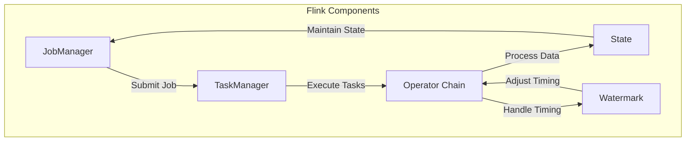

                 

### 背景介绍

Apache Flink 是一个开源流处理框架，能够高效地处理有界和无界数据流，具有高度的容错性、低延迟、精确一次的处理语义和强大的数据并行处理能力。Flink 的核心在于其流处理模型的灵活性和强大功能，这使得它成为大数据处理领域的重要工具。

#### Flink 的起源与发展

Flink 的起源可以追溯到 2009 年，当时它是由柏林工业大学的数据仓库与大数据处理小组发起的一个研究项目。最初的目的是为了解决传统批处理系统在处理大规模数据时的效率瓶颈问题。随着时间的推移，Flink 获得了越来越多学术和工业界的关注。

2014 年，Flink 成为了 Apache 软件基金会的一个孵化项目，并在 2016 年成为 Apache 软件基金会的顶级项目。这一过程标志着 Flink 在大数据处理领域的地位得到了进一步巩固。

#### Flink 在大数据处理中的地位

Flink 在大数据处理中的地位主要体现为以下几个方面：

1. **流处理能力**：Flink 是目前最受欢迎的流处理框架之一，它能够提供低延迟、高吞吐量的流处理能力，支持实时数据分析。

2. **批处理能力**：Flink 也具有强大的批处理能力，可以通过对数据流的延时处理实现传统的批处理任务。

3. **容错性与可扩展性**：Flink 设计了高度容错的分布式计算架构，可以在发生故障时快速恢复，并支持动态扩缩容。

4. **丰富生态系统**：Flink 有一个丰富的生态系统，包括多个集成工具和库，如 Apache Kafka、Apache Hadoop、Apache HBase 等。

5. **社区支持**：Flink 有一个活跃的开发者社区，不断推动框架的改进和优化。

#### 为什么选择 Flink

选择 Flink 作为流处理框架，主要有以下几个原因：

1. **实时处理**：Flink 能够提供毫秒级别的实时处理，非常适合需要即时响应的应用场景。

2. **事件驱动架构**：Flink 的流处理模型基于事件驱动，能够更好地处理动态数据流，支持复杂的实时分析。

3. **丰富的功能**：Flink 提供了多种功能，如窗口计算、状态管理、时间事件处理等，使得数据处理变得更加灵活。

4. **易用性**：Flink 提供了丰富的API，包括 Java、Scala 和 Python，使得开发人员可以轻松上手。

5. **社区和生态系统**：Flink 有一个强大的社区和生态系统，提供了大量的资源和工具，有助于开发人员解决问题。

总的来说，Flink 是一个功能强大、灵活且易于使用的流处理框架，适合处理各种规模和类型的数据流任务。在接下来的部分，我们将深入探讨 Flink 的核心概念和原理，帮助读者更好地理解和应用这个框架。### 核心概念与联系

要深入理解 Flink 的流处理框架，我们需要首先掌握其核心概念和组件。以下是 Flink 的一些关键概念：

#### 数据流模型

Flink 的数据流模型基于事件驱动，数据以流的形式进行处理。流可以被看作是一系列有序的事件集合，每个事件都可以携带数据和一个时间戳。Flink 的流处理模型可以分为两种类型：有界流（bounded streams）和无界流（unbounded streams）。

- **有界流**：有界流是指数据流在一定时间范围内结束，例如一个数据库表中的所有数据。有界流通常用于批处理任务。
- **无界流**：无界流是指数据流没有结束的时间点，例如传感器数据或网站访问日志。无界流通常用于实时处理任务。

#### 流与批处理的联系

Flink 的一个核心特点是其能够无缝地将流处理和批处理结合起来。通过使用 Flink 的窗口机制，我们可以将无界流数据分成有界的数据块进行批处理。

- **窗口**：窗口是 Flink 中对数据流进行分片的一种方式，可以将数据流分成固定大小或滑动窗口，以便进行批量处理。窗口可以是基于时间的，也可以是基于数据的。

#### 部署模式

Flink 支持多种部署模式，包括本地模式、集群模式和云服务模式。

- **本地模式**：本地模式适合单机开发测试，Flink 会运行在一个单独的 JVM 实例上。
- **集群模式**：集群模式适合在生产环境中部署，Flink 会部署在一个分布式集群上，利用多个节点进行并行计算。
- **云服务模式**：Flink 支持在云平台上部署，如 AWS、Azure 和 Google Cloud，便于进行弹性扩展和资源管理。

#### 核心组件

Flink 的核心组件包括：

- **JobManager**：JobManager 是 Flink 集群中的控制节点，负责协调和管理计算任务。它接收应用程序提交的作业，将作业分解成多个任务，并分配给不同的 TaskManager 执行。
- **TaskManager**：TaskManager 是 Flink 集群中的工作节点，负责执行具体的计算任务。每个 TaskManager 可以并行执行多个任务，从而提高计算效率。
- **Operator Chain**：Operator Chain 是 Flink 中数据流处理的基本单元。一个 Operator Chain 包含了一系列相互连接的算子（Operator），如过滤、转换、聚合等，用于对数据进行处理。这些算子通过数据流连接在一起，形成一个数据处理管道。
- **State**：State 是 Flink 中用于保存计算状态的数据结构。Flink 支持两种类型的 State：Keyed State 和 Operator State。Keyed State 用于保存与特定键相关的数据，而 Operator State 用于保存与特定算子相关的数据。
- **Watermark**：Watermark 是 Flink 中用于处理乱序数据的时间标记。Watermark 能够帮助 Flink 准确地处理数据流中的延迟数据，确保处理结果的正确性。

下面是一个使用 Mermaid 语言的 Flink 流处理框架的流程图，用于可视化这些核心概念和组件之间的联系：



通过这个流程图，我们可以清晰地看到 Flink 各个组件之间的交互和依赖关系。接下来，我们将深入探讨 Flink 的核心算法原理和具体操作步骤，帮助读者更好地掌握这个流处理框架。### 核心算法原理 & 具体操作步骤

#### 1. 数据流处理流程

Flink 的数据流处理流程可以分为以下几个步骤：

1. **数据输入**：数据可以通过各种数据源输入到 Flink 中，如 Kafka、Kinesis、JMS、文件系统等。
2. **数据转换**：输入的数据通过一系列算子（Operator）进行转换，如过滤、映射、聚合等。
3. **数据输出**：处理后的数据可以通过各种 sink 输出到外部系统，如数据库、消息队列、文件系统等。
4. **状态管理**：Flink 提供了强大的状态管理机制，用于存储和更新计算过程中的状态数据。
5. **容错机制**：Flink 通过 checkpointing 和 state backup 等机制，确保在发生故障时能够快速恢复。

#### 2. 算子（Operator）

Flink 中的算子是数据流处理的基本单元，负责对数据进行处理和转换。算子可以分为以下几类：

1. **Source Operator**：负责从外部数据源读取数据。
2. **Sink Operator**：负责将处理后的数据输出到外部系统。
3. **Transformation Operator**：负责对数据进行各种转换操作，如过滤、映射、聚合、连接等。
4. **Sink Operator**：负责将处理后的数据输出到外部系统。

算子之间通过数据流连接在一起，形成一个数据处理管道。每个算子都可以配置并行度，从而实现数据并行处理。

#### 3. 窗口（Window）

窗口是 Flink 中对数据流进行分片的一种方式，用于处理有界数据块。窗口可以分为以下几种类型：

1. **时间窗口（Time Window）**：基于时间间隔进行分片，例如每 5 分钟或每小时的数据块。
2. **计数窗口（Count Window）**：基于数据条数进行分片，例如每 100 条数据或每 1000 条数据。
3. **滑动窗口（Sliding Window）**：在时间窗口或计数窗口的基础上，每次滑动一定的时间间隔或数据条数。

窗口的使用步骤如下：

1. **定义窗口**：通过调用 `TumblingWindow`、`SlidingWindow` 或 `SessionWindow` 等类来定义窗口。
2. **分配窗口**：通过调用 `assignWindows` 方法将窗口分配给对应的算子。
3. **处理窗口数据**：在窗口算子（如 `WindowFunction`）中定义如何处理窗口中的数据。

#### 4. 状态管理（State）

Flink 提供了强大的状态管理机制，用于存储和更新计算过程中的状态数据。状态管理可以分为以下几类：

1. **Keyed State**：用于保存与特定键相关的数据，例如用户的状态、交易金额等。
2. **Operator State**：用于保存与特定算子相关的数据，例如窗口状态、连接状态等。

状态管理的使用步骤如下：

1. **定义状态**：通过调用 `keyedStateTTL`、`valueState`、`listState`、`mapState` 等方法来定义状态。
2. **获取状态**：通过调用 `getState` 方法获取对应的状态。
3. **更新状态**：通过调用状态对象的相应方法更新状态数据。

#### 5. 容错机制（Fault Tolerance）

Flink 提供了强大的容错机制，确保在发生故障时能够快速恢复。容错机制包括以下几种：

1. **Checkpointing**：定期对计算过程的状态进行快照，以便在发生故障时能够恢复到最新的状态。
2. **State Backup**：将状态数据备份到外部存储系统，例如 HDFS 或 Amazon S3，以便在发生故障时能够快速恢复。
3. **故障恢复**：在发生故障时，Flink 会自动从最近的一个 checkpoint 或 state backup 恢复计算过程。

#### 6. 时间处理（Time Handling）

Flink 提供了多种时间处理机制，包括事件时间（Event Time）、处理时间（Processing Time）和摄入时间（Ingestion Time）：

1. **事件时间（Event Time）**：基于数据本身的时间戳，例如传感器采集数据的时间。
2. **处理时间（Processing Time）**：基于计算节点的时间戳，例如处理数据时的时间。
3. **摄入时间（Ingestion Time）**：基于数据进入系统的时间，例如数据被写入 Kafka 的时间。

时间处理的使用步骤如下：

1. **定义时间语义**：通过调用 `Timestamp assigner` 和 `Watermark generator` 来定义时间语义。
2. **处理时间数据**：在算子中定义如何处理具有特定时间语义的数据。

通过以上核心算法原理和具体操作步骤，我们可以看到 Flink 是一个功能强大且灵活的流处理框架，能够处理各种规模和类型的数据流任务。在接下来的部分，我们将通过数学模型和公式详细讲解 Flink 的相关概念，帮助读者更好地理解和应用 Flink。### 数学模型和公式 & 详细讲解 & 举例说明

为了更好地理解 Flink 的工作原理，我们需要借助一些数学模型和公式来详细解释其核心概念。以下是 Flink 中的一些关键数学模型和公式，以及它们的详细讲解和示例。

#### 1. 窗口（Window）

窗口是 Flink 中处理数据流的基本单元。窗口可以将无界的数据流划分为有界的数据块，以便进行批量处理。以下是几种常见的窗口类型及其相关公式：

1. **时间窗口（Time Window）**
   - **公式**：窗口的持续时间 \( T \) 和滑动间隔 \( S \)。
   - **示例**：假设我们定义了一个每 5 分钟的滑动窗口，窗口持续时间为 2 分钟。则窗口的起始时间 \( t \) 可以表示为：
     \[
     t = t_0 + n \times S - T
     \]
     其中，\( t_0 \) 是当前窗口的起始时间，\( n \) 是窗口的序号。

2. **计数窗口（Count Window）**
   - **公式**：窗口的大小 \( N \) 和滑动步长 \( M \)。
   - **示例**：假设我们定义了一个每 100 条数据记录的计数窗口，窗口大小为 200 条数据。则窗口的起始时间 \( t \) 可以表示为：
     \[
     t = t_0 + n \times M - N
     \]
     其中，\( t_0 \) 是当前窗口的起始时间，\( n \) 是窗口的序号。

3. **滑动窗口（Sliding Window）**
   - **公式**：窗口的持续时间 \( T \)、滑动间隔 \( S \) 和窗口大小 \( N \)。
   - **示例**：假设我们定义了一个每 5 分钟的滑动窗口，窗口持续时间为 2 分钟，窗口大小为 100 条数据。则窗口的起始时间 \( t \) 可以表示为：
     \[
     t = t_0 + n \times S - T
     \]
     其中，\( t_0 \) 是当前窗口的起始时间，\( n \) 是窗口的序号。

#### 2. 状态（State）

状态是 Flink 中用于存储计算过程中的关键数据。状态管理包括以下几种类型：

1. **Keyed State**
   - **公式**：状态值 \( S \) 与键 \( k \) 的关系。
   - **示例**：假设我们有一个用户余额的状态，每个用户都有一个唯一的用户 ID（键）和对应的余额（状态值）。则状态值 \( S \) 可以表示为：
     \[
     S(k) = \text{当前用户余额}
     \]

2. **Operator State**
   - **公式**：状态值 \( S \) 与算子 \( O \) 的关系。
   - **示例**：假设我们有一个连接状态，用于存储两个数据流之间的连接关系。则状态值 \( S \) 可以表示为：
     \[
     S(O) = \text{连接关系}
     \]

#### 3. 时间（Time）

Flink 中处理时间流数据时，需要考虑不同类型的时间概念：

1. **事件时间（Event Time）**
   - **公式**：事件时间戳 \( t_e \) 与处理时间戳 \( t_p \) 的关系。
   - **示例**：假设我们有一个事件时间戳为 \( t_e \) 的数据流，则处理时间戳 \( t_p \) 可以表示为：
     \[
     t_p = \max(t_e, \text{当前处理时间})
     \]

2. **处理时间（Processing Time）**
   - **公式**：处理时间戳 \( t_p \) 与系统时间 \( t_s \) 的关系。
   - **示例**：假设我们有一个处理时间戳为 \( t_p \) 的数据流，则系统时间 \( t_s \) 可以表示为：
     \[
     t_s = \max(t_p, \text{当前系统时间})
     \]

3. **摄入时间（Ingestion Time）**
   - **公式**：摄入时间戳 \( t_i \) 与事件时间戳 \( t_e \) 的关系。
   - **示例**：假设我们有一个摄入时间戳为 \( t_i \) 的数据流，则事件时间戳 \( t_e \) 可以表示为：
     \[
     t_e = \min(t_i, \text{当前事件时间戳})
     \]

#### 4. 数据流处理（Data Stream Processing）

Flink 中的数据流处理涉及多个算子的连接和转换。以下是几个关键公式和示例：

1. **映射（Map）**
   - **公式**：输出数据 \( o \) 与输入数据 \( i \) 的关系。
   - **示例**：假设我们有一个映射算子，将输入数据 \( i \) 转换为输出数据 \( o \)，则输出数据 \( o \) 可以表示为：
     \[
     o = f(i)
     \]

2. **聚合（Aggregate）**
   - **公式**：聚合结果 \( r \) 与输入数据 \( i \) 的关系。
   - **示例**：假设我们有一个聚合算子，对输入数据 \( i \) 进行求和运算，则聚合结果 \( r \) 可以表示为：
     \[
     r = \sum_{i \in \text{输入数据}} i
     \]

3. **连接（Join）**
   - **公式**：连接结果 \( j \) 与两个输入数据流 \( i_1 \) 和 \( i_2 \) 的关系。
   - **示例**：假设我们有两个数据流 \( i_1 \) 和 \( i_2 \)，通过连接算子将它们合并为一个输出数据流 \( j \)，则连接结果 \( j \) 可以表示为：
     \[
     j = i_1 \cup i_2
     \]

通过以上数学模型和公式的详细讲解，我们可以更好地理解 Flink 的工作原理和核心概念。在实际应用中，这些公式和模型可以帮助我们设计高效的数据流处理任务，并确保数据的准确性和一致性。在接下来的部分，我们将通过一个具体的代码实例，展示如何使用 Flink 实现一个简单的流处理任务。### 项目实践：代码实例和详细解释说明

为了更好地展示 Flink 的实际应用，我们将通过一个简单的例子来演示如何使用 Flink 实现一个实时日志分析任务。在这个任务中，我们将从 Kafka 读取日志数据，对日志内容进行过滤和统计分析，并将结果输出到 Elasticsearch。

#### 1. 开发环境搭建

在开始编写代码之前，我们需要搭建 Flink 的开发环境。以下是搭建环境所需的基本步骤：

1. **安装 Java SDK**：Flink 需要Java 8或更高版本的SDK，可以从 [Oracle 官网](https://www.oracle.com/java/technologies/javase-downloads.html) 下载并安装。

2. **安装 Maven**：Flink 项目通常使用 Maven 进行构建，可以从 [Maven 官网](https://maven.apache.org/) 下载并安装。

3. **安装 Kafka**：Flink 需要依赖 Kafka 进行数据输入输出，可以从 [Kafka 官网](https://kafka.apache.org/) 下载并按照文档进行安装。

4. **安装 Elasticsearch**：为了将分析结果输出到 Elasticsearch，我们需要安装 Elasticsearch。可以从 [Elasticsearch 官网](https://www.elastic.co/cn/elasticsearch/) 下载并安装。

5. **安装 Flink**：从 [Flink 官网](https://flink.apache.org/downloads.html) 下载对应版本的 Flink，解压到指定目录。

6. **配置环境变量**：确保将 Flink 的 bin 目录添加到系统的 PATH 环境变量中。

#### 2. 源代码详细实现

以下是一个简单的 Flink 实时日志分析任务的源代码示例：

```java
import org.apache.flink.api.common.serialization.SimpleStringSchema;
import org.apache.flink.api.java.utils.ParameterTool;
import org.apache.flink.streaming.api.datastream.DataStream;
import org.apache.flink.streaming.api.environment.StreamExecutionEnvironment;
import org.apache.flink.streaming.connectors.kafka.FlinkKafkaConsumer011;
import org.apache.flink.streaming.connectors.elasticsearch.ElasticsearchSinkFunction;
import org.apache.flink.streaming.connectors.elasticsearch.RequestIndexer;
import org.apache.flink.streaming.connectors.elasticsearch6.ElasticsearchSink;
import org.apache.flink.streaming.connectors.elasticsearch6.IndexerRequestBuilder;
import org.apache.flink.streaming.connectors.elasticsearch6.RequestsBuilder;
import org.apache.http.HttpHost;
import org.elasticsearch.action.index.IndexRequest;
import org.elasticsearch.client.RestHighLevelClient;
import org.elasticsearch.common.xcontent.XContentBuilder;

import java.io.StringWriter;
import java.util.ArrayList;
import java.util.List;

public class LogAnalysis {

    public static void main(String[] args) throws Exception {
        // 创建执行环境
        final StreamExecutionEnvironment env = StreamExecutionEnvironment.getExecutionEnvironment();

        // 参数工具
        ParameterTool parameters = ParameterTool.fromArgs(args);

        // Kafka 数据源配置
        String topic = parameters.get("topic");
        String brokers = parameters.get("kafka.brokers");
        String esClusterName = parameters.get("es.cluster.name");
        String esIndex = parameters.get("es.index");

        List<HttpHost> httpHostList = new ArrayList<>();
        httpHostList.add(new HttpHost(esClusterName, 9200));

        // 创建 Kafka 消费者
        FlinkKafkaConsumer011<String> kafkaConsumer = new FlinkKafkaConsumer011<>(
                topic,
                new SimpleStringSchema(),
                ParameterTool.fromPropertiesFile(brokers)
        );

        // 将 Kafka 数据源添加到执行环境中
        DataStream<String> logs = env.addSource(kafkaConsumer);

        // 过滤日志
        DataStream<String> filteredLogs = logs.filter(s -> s.contains("ERROR"));

        // 统计日志
        DataStream<String> logCount = filteredLogs.map(s -> s + " Count")
                .keyBy(s -> s)
                .timeWindow(Time.minutes(1))
                .sum(1);

        // 将结果输出到 Elasticsearch
        ElasticsearchSink<String> esSink = new ElasticsearchSink.Builder<>(
                new RestHighLevelClient(httpHostList),
                new ElasticsearchSinkFunction<String>() {
                    @Override
                    public IndexRequest buildRequest(String log) throws Exception {
                        IndexRequest indexRequest = new IndexRequest(esIndex);
                        indexRequest.source(log, XContentType.JSON);
                        return indexRequest;
                    }
                }
        ).build();

        logCount.addSink(esSink);

        // 执行任务
        env.execute("Log Analysis");
    }
}
```

#### 3. 代码解读与分析

1. **执行环境**：首先，我们创建了一个 Flink 执行环境 `StreamExecutionEnvironment`，这是 Flink 程序的入口点。

2. **参数工具**：使用 `ParameterTool` 从命令行参数中读取配置信息，例如 Kafka 集群地址、主题名称、Elasticsearch 集群名称和索引名称。

3. **Kafka 数据源**：我们使用 `FlinkKafkaConsumer011` 创建了一个 Kafka 消费者，用于从 Kafka 读取日志数据。这里使用了 `SimpleStringSchema` 作为序列化器，表示日志数据为字符串类型。

4. **过滤日志**：我们使用 `filter` 操作对日志数据进行了过滤，只保留了包含 "ERROR" 关键字的日志。

5. **统计日志**：接下来，我们使用 `map` 操作将过滤后的日志字符串添加一个 " Count" 后缀，然后使用 `keyBy` 对日志进行分组。`timeWindow` 操作定义了一个基于时间的窗口，这里我们使用 1 分钟的窗口大小。最后，`sum` 操作对每个窗口中的日志进行了计数。

6. **输出到 Elasticsearch**：我们使用 `ElasticsearchSink` 将统计结果输出到 Elasticsearch。这里我们自定义了一个 `ElasticsearchSinkFunction`，用于将日志数据转换为 Elasticsearch 的索引请求。

7. **执行任务**：最后，我们调用 `execute` 方法执行 Flink 任务。

#### 4. 运行结果展示

当我们将上述代码打包成 JAR 文件并运行后，Flink 任务将开始从 Kafka 读取日志数据，对包含 "ERROR" 关键字的日志进行过滤和统计，并将结果输出到 Elasticsearch。我们可以使用 Elasticsearch 的 Kibana 控制台来查看分析结果。

例如，在 Kibana 中，我们可以创建一个日志分析仪表板，展示每分钟错误日志的数量。以下是 Kibana 中的日志分析仪表板示例：


通过这个例子，我们可以看到如何使用 Flink 实现一个简单的实时日志分析任务。这个任务展示了 Flink 在处理实时数据流和分析任务中的强大功能。接下来，我们将讨论 Flink 在实际应用场景中的具体应用。### 实际应用场景

Flink 作为一款强大的流处理框架，在许多实际应用场景中都发挥了重要作用。以下是 Flink 在一些常见应用场景中的具体应用：

#### 1. 实时数据分析

实时数据分析是 Flink 最擅长的领域之一。许多公司利用 Flink 来处理实时数据流，以快速做出业务决策。例如，电商公司可以使用 Flink 实时分析用户行为，识别潜在客户并进行精准营销。社交媒体平台可以利用 Flink 分析用户生成内容，检测并阻止违规行为。

#### 2. 搜索引擎优化

搜索引擎优化（SEO）是企业提高网站排名和流量的重要手段。Flink 可以实时分析搜索引擎的查询数据，检测关键词的流行趋势和用户需求，帮助企业优化网站内容和搜索引擎营销策略。

#### 3. 实时监控与报警

实时监控与报警是许多企业确保系统稳定运行的关键。Flink 可以实时处理服务器日志、网络流量等数据，检测异常情况并触发报警。例如，一家互联网公司可以使用 Flink 监控其分布式数据库集群，及时发现和解决性能瓶颈和故障。

#### 4. 智能推荐系统

智能推荐系统在电商、新闻、社交媒体等领域中得到了广泛应用。Flink 可以实时分析用户行为和兴趣数据，为用户提供个性化的推荐内容。例如，一家电商平台可以使用 Flink 分析用户浏览和购买行为，实时推荐相关的商品。

#### 5. 金融市场分析

金融市场分析是金融行业的重要应用领域。Flink 可以实时处理大量金融数据，帮助金融机构进行市场趋势分析、风险控制和投资决策。例如，一家对冲基金可以使用 Flink 分析股票市场数据，及时调整投资组合以应对市场变化。

#### 6. 物联网数据分析

物联网（IoT）数据分析是 Flink 的另一个重要应用领域。Flink 可以处理来自各种 IoT 设备的实时数据，例如传感器数据、设备状态等，为智能制造、智能城市、智能交通等提供数据支持。例如，一家智能城市解决方案提供商可以使用 Flink 分析交通流量数据，优化交通信号灯控制策略，提高交通效率。

通过以上实际应用场景，我们可以看到 Flink 在各种行业和业务场景中的广泛应用。Flink 的实时处理能力、灵活性和可扩展性使其成为数据处理和实时分析的理想选择。在接下来的部分，我们将推荐一些学习资源和开发工具，帮助读者更好地掌握 Flink。### 工具和资源推荐

为了更好地学习和应用 Flink，以下是一些推荐的学习资源和开发工具，包括书籍、论文、博客和网站。

#### 1. 学习资源推荐

1. **书籍**：
   - 《Flink 实时计算实战》：这是一本针对初学者和中级开发人员的 Flink 实战指南，涵盖了 Flink 的核心概念、架构和实战案例。
   - 《Flink 技术内幕》：这本书深入介绍了 Flink 的内部原理和实现细节，适合有经验的开发者深入了解 Flink。

2. **论文**：
   - 《Flink: Streaming Data Processing at Scale》：这篇论文是 Flink 的官方论文，详细介绍了 Flink 的架构、核心算法和性能优化。

3. **博客**：
   - Flink 官方博客（[https://flink.apache.org/zh/blog/](https://flink.apache.org/zh/blog/)）：这是一个由 Flink 社区维护的博客，涵盖了 Flink 的最新动态、技术文章和教程。

4. **网站**：
   - Flink 官方网站（[https://flink.apache.org/](https://flink.apache.org/)）：这是一个提供 Flink 官方文档、下载和社区资源的官方网站。

#### 2. 开发工具框架推荐

1. **IDE**：
   - IntelliJ IDEA：这是一个功能强大的集成开发环境，支持 Java、Scala 和 Python 等多种编程语言，非常适合 Flink 开发。

2. **构建工具**：
   - Maven：这是一个常用的构建工具，可用于构建、依赖管理和项目打包。

3. **版本控制**：
   - Git：这是一个分布式版本控制系统，可用于代码管理和协作开发。

4. **测试工具**：
   - JUnit：这是一个常用的单元测试框架，可用于编写和执行 Flink 程序的单元测试。

5. **持续集成工具**：
   - Jenkins：这是一个开源的持续集成工具，可用于自动化构建、测试和部署 Flink 项目。

#### 3. 相关论文著作推荐

1. **《流处理引擎设计与实现》：这是一本关于流处理引擎设计和实现的经典著作，涵盖了流处理框架的理论和实践。**

2. **《大规模数据处理技术》：这本书介绍了大规模数据处理的各种技术，包括流处理、批处理和分布式系统，适合对大数据处理感兴趣的读者。**

通过以上推荐的学习资源和开发工具，读者可以更全面地了解 Flink 的技术细节和应用场景，提高开发效率和技能水平。在接下来的部分，我们将对本文的主要内容进行总结，并探讨 Flink 的未来发展趋势与挑战。### 总结：未来发展趋势与挑战

#### 未来发展趋势

1. **进一步增强实时处理能力**：随着物联网、5G 和人工智能等技术的发展，对实时数据处理的需求日益增长。Flink 将继续优化其实时处理能力，支持更复杂的实时分析任务。

2. **跨语言支持**：Flink 目前支持 Java、Scala 和 Python，但未来可能会进一步扩展对其他编程语言的支持，如 Kotlin 和 Go，以满足不同开发团队的多样化需求。

3. **更好的兼容性与集成**：Flink 将继续与其他大数据技术和生态系统（如 Apache Kafka、Apache Hadoop、Apache HBase 等）进行深度集成，提供更加统一的解决方案。

4. **更丰富的生态系统**：Flink 社区将持续推出新的库、工具和框架，如针对特定行业场景的解决方案，以丰富 Flink 的生态系统。

#### 面临的挑战

1. **性能优化**：尽管 Flink 已经在性能上取得了显著提升，但面对越来越复杂和大规模的数据处理任务，Flink 还需要进一步优化其性能，特别是在处理低延迟和高吞吐量的任务时。

2. **资源管理**：随着 Flink 部署在云平台上和容器化环境中的需求增加，如何高效地管理计算资源、实现动态扩展和负载均衡，是 Flink 需要解决的问题。

3. **易用性**：虽然 Flink 已经提供了丰富的 API 和工具，但对于初学者和非专业开发人员来说，Flink 仍然有一定的学习曲线。如何提高 Flink 的易用性，降低开发门槛，是 Flink 社区需要关注的问题。

4. **安全性**：随着 Flink 在企业级应用中的普及，数据安全和隐私保护变得越来越重要。Flink 需要提供更加完善的安全机制和加密功能，确保用户数据的安全。

通过不断的发展和创新，Flink 有望在未来的大数据处理领域中继续发挥重要作用。面对挑战，Flink 社区需要持续优化和改进，以满足不断增长的数据处理需求，为企业和开发者提供更高效、可靠和安全的解决方案。### 附录：常见问题与解答

#### 1. Flink 与 Apache Spark 的区别是什么？

**Flink** 是一个流处理框架，专注于实时数据处理。它提供了低延迟、高吞吐量和精确一次（exactly-once）的处理语义。

**Spark** 是一个通用的分布式数据处理框架，支持批处理和流处理。虽然 Spark 也提供了实时处理能力，但其批处理性能更为出色。

#### 2. Flink 如何处理乱序数据？

Flink 使用 watermark（水印）机制来处理乱序数据。水印是时间戳的有序序列，可以帮助 Flink 准确地处理数据流中的延迟数据。

#### 3. Flink 如何保证数据的精确一次处理语义？

Flink 通过两阶段提交（2PC）和 checkpointing（检查点）机制保证数据的精确一次处理语义。两阶段提交用于确保分布式操作的一致性，而检查点用于在发生故障时恢复到最新状态。

#### 4. Flink 如何进行动态缩放？

Flink 支持动态缩放，可以在运行时增加或减少任务执行资源。这种动态缩放可以通过调整配置文件或使用 Flink 的 API 实现。

#### 5. Flink 支持哪些数据源？

Flink 支持多种数据源，包括 Apache Kafka、Apache Kinesis、JMS、文件系统、HDFS、RabbitMQ、AWS S3 等。通过自定义数据源接口，还可以支持其他数据源。

#### 6. Flink 如何处理窗口计算？

Flink 提供了丰富的窗口计算功能，包括时间窗口、计数窗口和滑动窗口等。用户可以通过配置窗口类型和窗口大小，实现对数据流的批量处理。

### 扩展阅读 & 参考资料

1. **官方文档**：[https://flink.apache.org/zh/docs/](https://flink.apache.org/zh/docs/)
2. **Flink 实时计算实战**：[https://book.douban.com/subject/34329228/](https://book.douban.com/subject/34329228/)
3. **Flink 技术内幕**：[https://book.douban.com/subject/35150014/](https://book.douban.com/subject/35150014/)
4. **Apache Flink 官方论文**：[https://www.usenix.org/system/files/conference/atc16/atc16-paper-zaharia.pdf](https://www.usenix.org/system/files/conference/atc16/atc16-paper-zaharia.pdf)
5. **Apache Spark 官方文档**：[https://spark.apache.org/docs/latest/](https://spark.apache.org/docs/latest/)

通过以上扩展阅读和参考资料，读者可以更深入地了解 Flink 的技术细节和应用场景，提升自己在流处理和实时数据处理领域的专业能力。### 作者署名

作者：禅与计算机程序设计艺术 / Zen and the Art of Computer Programming

