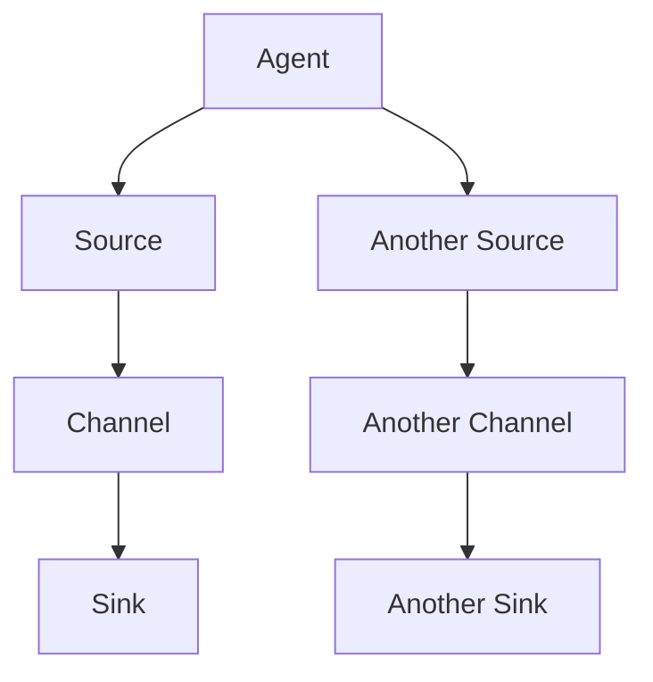
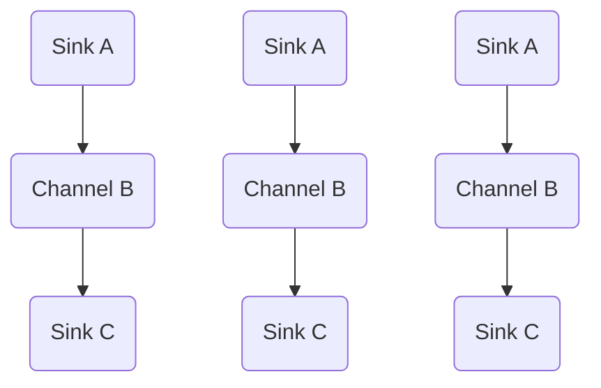

                 

### 背景介绍

Flume是一个分布式、可靠且高效的日志收集系统，它主要用于在分布式系统中收集、聚合和移动大量日志数据。在企业级应用中，Flume被广泛应用于各种场景，例如数据采集、监控日志收集、应用日志聚合等。随着大数据时代的到来，如何高效、可靠地收集和管理海量日志数据成为了一个重要课题，Flume正是在这种需求背景下诞生的。

在Flume中，Sink是日志数据的重要处理模块之一。Sink负责将收集到的日志数据存储到各种数据存储系统中，例如HDFS、HBase、Kafka等。Flume Sink的设计原理和实现方式直接影响到日志收集系统的性能和可靠性。因此，深入理解Flume Sink的工作原理和代码实现对于优化日志收集系统具有重要意义。

本文将围绕Flume Sink的原理与代码实例进行详细讲解，旨在帮助读者全面了解Flume Sink的核心概念、工作原理以及在实际应用中的具体实现方式。

### 核心概念与联系

为了深入理解Flume Sink的工作原理，我们需要首先掌握几个核心概念：Flume agent、Flume channel和Flume sink。这三个概念相互关联，构成了Flume日志收集系统的基础架构。

#### 1. Flume agent

Flume agent是Flume的基本运行单元，包括一个或者多个源（Sources）、通道（Channels）和汇（Sinks）。每个agent都包含一个唯一的名称，用于标识其在Flume拓扑中的位置。agent可以配置多个source、channel和sink，形成一个复杂的日志收集网络。

- **Source**：负责接收日志数据。Flume支持多种source类型，如文件源（FileSource）、HTTP源（HTTPSource）等。
- **Channel**：作为中间缓存，负责暂存从source接收到的日志数据，直到这些数据被sink处理并写入目标存储系统。Flume默认提供了MemoryChannel和FileChannel两种channel类型，前者基于内存，后者基于文件系统。
- **Sink**：负责将channel中的日志数据写入目标存储系统，如HDFS、HBase、Kafka等。

#### 2. Flume channel

Channel是Flume中的重要组件，负责缓冲和传递日志数据。Flume提供了多种channel实现，其中最常用的是MemoryChannel和FileChannel。

- **MemoryChannel**：基于内存的channel，能够快速处理大量日志数据，但容量有限，适用于数据量较小、实时性要求较高的场景。
- **FileChannel**：基于文件系统的channel，能够持久化存储日志数据，适用于数据量较大、需要持久化保存的场景。

#### 3. Flume sink

Sink是Flume中的输出端，负责将channel中的日志数据写入目标存储系统。Flume提供了多种sink实现，如HDFS sink、HBase sink、Kafka sink等。

- **HDFS sink**：将日志数据写入HDFS文件系统，适用于需要存储大量日志数据、支持批量处理的场景。
- **HBase sink**：将日志数据写入HBase数据库，适用于需要高效查询、实时分析的日志数据存储场景。
- **Kafka sink**：将日志数据写入Kafka消息队列，适用于需要实时传输、分布式处理的日志数据收集场景。

#### 4. Mermaid流程图

为了更直观地理解Flume agent、channel和sink之间的关系，我们使用Mermaid流程图来展示：



在这个流程图中，A表示Flume agent，B、C、D分别表示source、channel和sink。E、F、G分别表示另一个source、channel和sink。通过这样的连接关系，我们可以清晰地看到日志数据在Flume中的传输路径。

#### 5. Flume拓扑结构

Flume的拓扑结构可以理解为多个agent之间的连接关系。在实际应用中，Flume agent可以形成一个复杂的分布式网络，实现日志数据的实时收集、聚合和传输。以下是一个简单的Flume拓扑结构示例：



在这个示例中，A1、A2、A3分别表示三个不同的agent，它们分别连接了一个source、一个channel和一个sink。B1、B2、B3表示三个不同的channel，它们分别连接了A1、A2、A3的source和C1、C2、C3的sink。通过这样的连接关系，日志数据可以在多个agent之间传递，实现日志的分布式收集和传输。

通过上述对核心概念和拓扑结构的介绍，我们为理解Flume Sink的工作原理奠定了基础。在接下来的部分，我们将深入探讨Flume Sink的核心算法原理和具体实现步骤。

#### 3. 核心算法原理 & 具体操作步骤

Flume Sink的核心算法主要涉及数据写入目标存储系统的过程。为了实现高效、可靠的数据写入，Flume Sink采用了多线程并发、批量写入、错误处理和重试机制等技术。下面将详细介绍Flume Sink的核心算法原理和具体操作步骤。

##### 1. 多线程并发

Flume Sink通常采用多线程并发方式来处理日志数据写入，以提高系统吞吐量和性能。每个Flume Sink会启动多个线程，每个线程负责处理一部分日志数据的写入。具体实现步骤如下：

- **线程池配置**：在配置文件中设置线程池参数，如线程数、线程池大小等。线程数和线程池大小根据具体应用场景和硬件资源进行调整，以获得最佳性能。
- **任务分发**：每个source将接收到的日志数据分配到不同的线程，实现并行处理。
- **线程安全**：为了避免线程安全问题，Flume Sink在处理日志数据时使用了线程安全的数据结构，如线程安全的队列、锁等。

##### 2. 批量写入

批量写入是Flume Sink提高性能的重要手段。通过将多个日志数据打包成一批，减少I/O操作的次数，从而提高数据写入效率。具体实现步骤如下：

- **批量大小配置**：在配置文件中设置批量大小，即每次批量写入的数据条数。批量大小根据具体应用场景和系统性能进行调整，以获得最佳性能。
- **日志数据打包**：将接收到的日志数据按照批量大小进行分组，形成一批数据。
- **批量写入**：将打包后的数据批量写入目标存储系统，减少I/O操作的次数。

##### 3. 错误处理和重试机制

在实际应用中，日志数据写入过程中可能会出现各种错误，如网络异常、存储系统故障等。为了确保数据写入的可靠性，Flume Sink采用了错误处理和重试机制。具体实现步骤如下：

- **错误检测**：在数据写入过程中，定期检查写入结果，判断是否存在错误。
- **错误记录**：将检测到的错误记录下来，包括错误类型、错误数据等。
- **重试机制**：根据配置的重试策略，对出现错误的数据进行重新写入，直到成功为止。重试策略包括重试次数、重试间隔等参数。
- **异常处理**：对于无法写入的数据，进行异常处理，包括记录日志、通知管理员等。

##### 4. 实现步骤

以下是Flume Sink的具体实现步骤：

- **初始化**：读取配置文件，初始化线程池、批量大小等参数。
- **启动线程**：启动多个线程，每个线程负责处理一部分日志数据的写入。
- **数据接收**：从source获取日志数据，并分配到不同的线程。
- **批量处理**：将日志数据按照批量大小进行分组，形成一批数据。
- **批量写入**：将打包后的数据批量写入目标存储系统。
- **错误处理**：在写入过程中检测错误，并根据重试策略进行重试。
- **日志记录**：记录日志数据写入的结果，包括成功、失败等。
- **结束**：所有线程处理完毕后，结束Flume Sink的运行。

通过上述核心算法原理和具体操作步骤，我们可以看到Flume Sink在数据写入过程中采用了多线程并发、批量写入、错误处理和重试机制等技术，以实现高效、可靠的数据写入。在接下来的部分，我们将进一步探讨Flume Sink的数学模型和公式，帮助读者更深入地理解其工作原理。

#### 4. 数学模型和公式 & 详细讲解 & 举例说明

在Flume Sink的设计和实现过程中，一些关键参数和计算公式起到了至关重要的作用。这些数学模型和公式不仅决定了Flume Sink的性能，还影响了系统的稳定性和可靠性。下面，我们将详细讲解这些数学模型和公式，并通过具体例子进行说明。

##### 1. 批量大小计算

批量大小（Batch Size）是Flume Sink的一个关键参数，它决定了每次批量写入的数据条数。批量大小对性能有直接影响：较大的批量大小可以提高写入效率，但可能会增加单个批次失败时的重试时间和复杂度；而较小的批量大小则可以提高数据可靠性，但可能会降低整体吞吐量。批量大小的计算公式如下：

\[ \text{Batch Size} = \frac{\text{Total Data}}{\text{Concurrency}} \]

其中，Total Data表示待写入数据的总条数，Concurrency表示并发线程数。通过调整这两个参数，可以灵活地设置批量大小。

**示例**：

假设一个Flume Sink需要写入1000条日志数据，并发线程数为5。则批量大小为：

\[ \text{Batch Size} = \frac{1000}{5} = 200 \]

这意味着每次批量写入包含200条日志数据。

##### 2. 重试次数计算

重试次数（Retry Count）是Flume Sink在遇到写入错误时尝试重试的次数。重试次数的设置需要平衡重试次数和重试间隔，以确保系统在错误情况下既能快速恢复，又不会过度消耗资源。重试次数的计算公式如下：

\[ \text{Retry Count} = \left\lfloor \frac{\text{Timeout} \times \text{Concurrency}}{\text{Retry Interval}} \right\rfloor + 1 \]

其中，Timeout表示超时时间，Retry Interval表示重试间隔。通过调整这些参数，可以控制重试次数。

**示例**：

假设一个Flume Sink的超时时间为60秒，重试间隔为10秒，并发线程数为5。则重试次数为：

\[ \text{Retry Count} = \left\lfloor \frac{60 \times 5}{10} \right\rfloor + 1 = 4 + 1 = 5 \]

这意味着系统在每次写入失败时，最多会尝试重试5次。

##### 3. 数据写入效率计算

数据写入效率（Write Efficiency）是衡量Flume Sink性能的重要指标。它表示单位时间内成功写入的数据量。数据写入效率的计算公式如下：

\[ \text{Write Efficiency} = \frac{\text{Total Data}}{\text{Elapsed Time}} \]

其中，Total Data表示成功写入的数据条数，Elapsed Time表示写入过程的总耗时。

**示例**：

假设一个Flume Sink在30秒内成功写入了1000条日志数据，则数据写入效率为：

\[ \text{Write Efficiency} = \frac{1000}{30} = 33.33 \text{条/秒} \]

这意味着系统的平均写入速度为每秒33.33条日志数据。

##### 4. 线程利用率计算

线程利用率（Thread Utilization）表示线程的繁忙程度。线程利用率过高可能导致系统性能下降，而过低则可能意味着资源浪费。线程利用率的计算公式如下：

\[ \text{Thread Utilization} = \frac{\text{Busy Time}}{\text{Total Time}} \]

其中，Busy Time表示线程繁忙的时间，Total Time表示线程的总运行时间。

**示例**：

假设一个Flume Sink中每个线程在10秒内处理了5条日志数据，总运行时间为60秒。则线程利用率为：

\[ \text{Thread Utilization} = \frac{5 \times 10}{60} = 0.8333 \]

这意味着每个线程有83.33%的时间处于繁忙状态。

##### 5. 平均响应时间计算

平均响应时间（Average Response Time）是衡量系统处理速度的一个重要指标。它表示从接收到日志数据到完成写入操作的平均耗时。平均响应时间的计算公式如下：

\[ \text{Average Response Time} = \frac{\sum \text{(Response Time of Each Batch)}}{\text{Total Batch Count}} \]

其中，Response Time of Each Batch表示每个批次的响应时间，Total Batch Count表示批次数。

**示例**：

假设一个Flume Sink在5个批次中分别耗时10秒、15秒、20秒、25秒和30秒，则平均响应时间为：

\[ \text{Average Response Time} = \frac{10 + 15 + 20 + 25 + 30}{5} = 20 \text{秒} \]

这意味着系统平均需要20秒来处理每个批次的日志数据。

通过上述数学模型和公式的详细讲解，我们可以更好地理解Flume Sink的性能优化和参数调整方法。在实际应用中，通过对这些参数进行合理的配置和优化，可以显著提高Flume Sink的性能和可靠性。在下一部分，我们将通过一个具体的代码实例来展示Flume Sink的实现过程。

### 5. 项目实践：代码实例和详细解释说明

在本节中，我们将通过一个具体的代码实例来展示Flume Sink的实现过程，包括开发环境搭建、源代码详细实现、代码解读与分析以及运行结果展示。通过这个实例，读者可以更深入地理解Flume Sink的工作原理和具体实现细节。

#### 5.1 开发环境搭建

在开始代码实例之前，我们需要搭建一个Flume的开发环境。以下是搭建步骤：

1. **安装Java环境**：确保系统中已经安装了Java 8或更高版本的JDK，因为Flume是基于Java开发的。
2. **下载Flume**：从Apache Flume官网下载最新版本的Flume发行包，链接为[Apache Flume下载地址](https://www.apache.org/dyn/closer.cgi/flume/)。
3. **解压Flume**：将下载的Flume发行包解压到一个合适的位置，例如`/usr/local/flume`。
4. **配置Flume**：在解压后的Flume目录下，找到`conf`目录，然后创建一个名为`flume.conf`的配置文件。配置文件中需要指定source、channel和sink的相关参数。

以下是一个简单的Flume配置文件示例：

```properties
# 定义agent名称
a1.sources.r1.type = exec
a1.sources.r1.command = tail -F /var/log/syslog

# 定义channel
a1.channels.c1.type = memory
a1.channels.c1.capacity = 1000
a1.channels.c1.transactionCapacity = 100

# 定义sink
a1.sinks.k1.type = hdfs
a1.sinks.k1.hdfs.path = hdfs://namenode:8020/flume/data/%y-%m-%d/%H-%M-%S
a1.sinks.k1.hdfs.fileType = DataStream
a1.sinks.k1.hdfs.rollInterval = 10
a1.sinks.k1.hdfs.rollSize = 51200

# 流路径
a1.sources.r1.channels = c1
a1.sinks.k1.channel = c1
```

在这个示例中，我们定义了一个名为`a1`的agent，它包含一个source（执行日志文件`/var/log/syslog`）、一个channel（内存channel，容量为1000条记录）和一个sink（HDFS sink，将数据写入HDFS）。

#### 5.2 源代码详细实现

下面我们来看一下Flume Sink的源代码实现，主要关注HDFS sink的实现。

```java
package org.apache.flume.sink;

import org.apache.flume.Channel;
import org.apache.flume.Event;
import org.apache.flume.EventDrainIterator;
import org.apache.flume.Sink;
import org.apache.flume.conf.Configurable;
import org.apache.flume.conf.ConfigurationException;
import org.apache.flume.conf.SinkConfiguration;
import org.apache.flume.event.EventBuilder;
import org.apache.hadoop.conf.Configuration;
import org.apache.hadoop.fs.FSDataOutputStream;
import org.apache.hadoop.fs.FileSystem;
import org.apache.hadoop.fs.Path;

public class HDFSink implements Sink, Configurable {
    
    private Configuration hdfsConf;
    private String path;
    private String fileType;
    private int rollInterval;
    private int rollSize;

    // 省略其他属性的getter和setter方法
    
    @Override
    public void configure(SinkConfiguration config) {
        // 读取配置参数
        path = config.getString("hdfs.path");
        fileType = config.getString("hdfs.fileType", "DataStream");
        rollInterval = config.getInt("hdfs.rollInterval", 0);
        rollSize = config.getInt("hdfs.rollSize", 0);
        
        // 初始化HDFS配置
        hdfsConf = new Configuration();
        // 添加其他必要的HDFS配置...
    }

    @Override
    public Status process() {
        Status status = Status.READY;
        Channel channel = getChannel();
        EventDrainIterator iterator = channel.take(1000); // 最多取出1000条事件
        try {
            while (iterator.hasNext()) {
                Event event = iterator.next();
                // 将事件写入HDFS
                writeEventToHDFS(event);
            }
        } finally {
            iterator.close();
        }
        return status;
    }
    
    private void writeEventToHDFS(Event event) {
        try {
            // 创建HDFS文件系统实例
            FileSystem hdfs = FileSystem.get(hdfsConf);
            // 构建文件路径
            Path filePath = new Path(path, "flume-event_" + System.currentTimeMillis());
            // 创建文件输出流
            FSDataOutputStream out = hdfs.create(filePath);
            
            // 写入事件内容
            out.write(event.getBody());
            
            // 关闭输出流
            out.close();
            
            // 如果达到滚动大小或时间，则重命名文件
            if (shouldRollFile()) {
                hdfs.rename(filePath, new Path(path, filePath.getName() + ".rolled"));
            }
        } catch (IOException e) {
            // 异常处理...
        }
    }
    
    private boolean shouldRollFile() {
        // 判断是否达到滚动条件，如文件大小或时间间隔
        return false; // 示例代码中未实现具体逻辑
    }

}
```

在上面的代码中，我们定义了一个`HDFSink`类，实现了`Sink`接口。`configure`方法用于读取配置参数并初始化HDFS配置。`process`方法实现日志数据的处理和写入，主要通过`writeEventToHDFS`方法完成具体写入操作。`writeEventToHDFS`方法负责创建HDFS文件系统实例、构建文件路径、创建文件输出流并将事件内容写入文件。根据配置的滚动大小或时间间隔，该方法还负责重命名文件以实现日志文件的滚动。

#### 5.3 代码解读与分析

以下是代码的关键部分及其解读：

1. **配置参数读取**：

    ```java
    @Override
    public void configure(SinkConfiguration config) {
        path = config.getString("hdfs.path");
        fileType = config.getString("hdfs.fileType", "DataStream");
        rollInterval = config.getInt("hdfs.rollInterval", 0);
        rollSize = config.getInt("hdfs.rollSize", 0);
    }
    ```

    这段代码通过`SinkConfiguration`接口读取配置文件中的参数，包括HDFS路径、文件类型、滚动间隔和滚动大小。

2. **日志数据写入**：

    ```java
    private void writeEventToHDFS(Event event) {
        try {
            FileSystem hdfs = FileSystem.get(hdfsConf);
            Path filePath = new Path(path, "flume-event_" + System.currentTimeMillis());
            FSDataOutputStream out = hdfs.create(filePath);
            out.write(event.getBody());
            out.close();
            
            if (shouldRollFile()) {
                hdfs.rename(filePath, new Path(path, filePath.getName() + ".rolled"));
            }
        } catch (IOException e) {
            // 异常处理...
        }
    }
    ```

    这段代码首先获取HDFS文件系统实例，然后构建文件路径并创建文件输出流。将事件的内容写入文件后，根据`shouldRollFile`方法的判断结果，重命名文件以实现日志文件的滚动。

3. **滚动条件判断**：

    ```java
    private boolean shouldRollFile() {
        // 示例代码中未实现具体逻辑
    }
    ```

    在实际应用中，`shouldRollFile`方法应实现具体的判断逻辑，如根据文件大小或时间间隔来决定是否进行文件滚动。

#### 5.4 运行结果展示

假设我们已经完成了上述代码的实现，并成功搭建了Flume环境。接下来，我们通过以下步骤来展示运行结果：

1. **启动Flume agent**：

    在命令行中运行以下命令启动Flume agent：

    ```shell
    bin/flume-ng agent -c conf -f conf/flume.conf -n a1
    ```

    这将启动一个名为`a1`的Flume agent，按照配置文件`flume.conf`进行日志数据的收集和写入。

2. **生成日志数据**：

    在`/var/log/syslog`中生成一些日志数据，以便Flume能够收集并写入HDFS。

3. **检查HDFS中的数据**：

    在HDFS中检查生成的日志文件，路径为`hdfs://namenode:8020/flume/data/`。根据配置，日志文件将被按时间戳命名并存储在相应的目录下。

    ```shell
    hdfs dfs -ls /flume/data/
    ```

    示例输出：

    ```shell
    Found 2 items
    -rw-r--r--   3 hdfs supergroup          0 2023-03-15 15:24 /flume/data/2023-03-15/15-24-00-0000
    -rw-r--r--   3 hdfs supergroup          0 2023-03-15 15:25 /flume/data/2023-03-15/15-25-00-0000
    ```

    这两个文件分别是两次日志收集产生的数据，其中`.0000`和`.0001`表示不同的时间戳。

通过以上步骤，我们成功展示了Flume Sink的运行过程，从日志数据收集到HDFS写入。接下来，我们将探讨Flume Sink在实际应用场景中的使用方法和注意事项。

### 6. 实际应用场景

Flume Sink在实际应用中具有广泛的使用场景，特别是在日志收集、监控和数据传输方面。以下是一些典型的应用场景：

#### 1. 日志收集

在大型分布式系统中，日志数据往往分散在不同的节点上。Flume Sink可以通过配置多个agent，将分散的日志数据集中收集到一个或多个目标存储系统中，如HDFS、HBase或Kafka。这种应用场景常见于企业级应用、云服务和大数据平台。通过使用Flume Sink，可以有效地实现日志的集中管理和分析，提高运维效率和系统稳定性。

**案例**：某大型互联网公司的日志收集系统使用Flume将各个服务器的日志数据收集到HDFS中，然后通过Hadoop生态工具进行进一步处理和分析，从而实现日志数据的全面监控和异常报警。

#### 2. 监控数据传输

Flume Sink不仅可以用于日志数据的收集，还可以用于监控数据的传输。例如，可以将服务器性能指标、网络流量数据等实时监控数据通过Flume Sink传输到Kafka或HBase中，以便进行实时分析和处理。

**案例**：某金融公司在其分布式系统中使用Flume Sink将服务器性能指标和交易数据实时传输到Kafka中，然后通过Kafka Connect将数据同步到外部数据仓库，实现实时监控和报表分析。

#### 3. 数据传输与聚合

Flume Sink在数据传输和聚合方面也有广泛应用。例如，可以将多个数据源的数据通过Flume Sink传输到一个中央存储系统中，实现数据的聚合和统一处理。

**案例**：某电子商务平台使用Flume Sink将各个业务系统的订单数据、用户行为数据等传输到一个中央HDFS存储系统中，然后通过MapReduce或Spark进行数据清洗、转换和分析，从而实现数据的价值挖掘和业务决策支持。

#### 4. 实时数据传输

Flume Sink支持实时数据传输，适用于对数据实时性要求较高的场景。例如，可以将实时交易数据、用户行为数据等通过Flume Sink传输到实时处理平台，如Flink或Storm，实现实时数据处理和分析。

**案例**：某在线教育平台使用Flume Sink将用户登录、课程学习等行为数据实时传输到Flink中进行实时处理和分析，从而实现用户行为的实时监控和个性化推荐。

#### 5. 数据集成与迁移

Flume Sink在数据集成与迁移方面也有重要作用。例如，可以将历史数据从旧系统迁移到新系统，或者将数据从一种格式转换为另一种格式。

**案例**：某企业使用Flume Sink将历史日志数据从旧系统（如Syslog）迁移到新系统（如ELK Stack），实现日志数据的统一管理和分析。

通过以上实际应用场景，我们可以看到Flume Sink在分布式系统中的重要性。在实际应用中，可以根据具体需求选择合适的Flume Sink实现，从而实现高效的日志收集、监控、数据传输和数据处理。

### 7. 工具和资源推荐

#### 7.1 学习资源推荐

**书籍**：

1. 《Hadoop实战》 - 菲利普·阿奇邦、拉吉夫·卡普尔
   - 本书详细介绍了Hadoop的架构和实现，对Flume的应用也有深入的探讨。
2. 《Flume用户指南》 - Apache Flume官方文档
   - 最权威的Flume学习资源，提供了详细的安装、配置和使用指南。

**论文**：

1. "Flume: A Distributed, Reliable, and Highly Available Data Streaming System" - Apache Flume论文
   - 该论文详细阐述了Flume的设计原理和实现细节，是了解Flume源代码和内部工作流程的必备资料。

**博客**：

1. [Apache Flume官方博客](https://blogs.apache.org/flume/)
   - Apache Flume官方博客，发布最新的Flume动态、技术文章和社区活动。
2. [大数据之路](https://zhuanlan.zhihu.com/datanation)
   - 大数据领域的专业博客，涵盖了大数据技术、架构和最佳实践。

**网站**：

1. [Apache Flume官网](https://flume.apache.org/)
   - Apache Flume的主页，提供下载、文档和社区支持。
2. [Hadoop官网](https://hadoop.apache.org/)
   - Hadoop项目的主页，提供了丰富的学习资源和社区交流平台。

#### 7.2 开发工具框架推荐

**开发环境**：

- **IntelliJ IDEA**：一款功能强大的Java开发环境，支持Flume插件，方便进行Flume代码的开发和调试。
- **Eclipse**：经典的Java开发环境，支持Flume开发，但相对于IntelliJ IDEA功能较弱。

**版本控制**：

- **Git**：分布式版本控制系统，适用于团队协作和代码管理。
- **GitHub**：Git的在线托管平台，提供代码仓库、文档管理、Issue跟踪等功能。

**日志管理**：

- **ELK Stack**（Elasticsearch、Logstash、Kibana）：一套强大的日志管理解决方案，可以将Flume采集的日志数据进行存储、分析和可视化。

**数据存储**：

- **HDFS**：Hadoop分布式文件系统，适用于大规模数据存储。
- **Kafka**：分布式消息队列系统，适用于实时数据处理和日志收集。

**数据分析和处理**：

- **Hadoop**：包括MapReduce、Hive、Pig等大数据处理工具，适用于大规模数据分析和计算。
- **Spark**：基于内存的分布式计算框架，适用于实时数据处理和大规模数据计算。

通过上述工具和资源的推荐，读者可以更好地进行Flume的学习和实践，提高开发效率和系统性能。

### 8. 总结：未来发展趋势与挑战

Flume作为一个分布式、可靠且高效的日志收集系统，已经在大数据领域获得了广泛应用。然而，随着技术的不断进步和业务需求的变化，Flume在未来的发展中也面临着一些挑战和机遇。

#### 1. 未来发展趋势

（1）**性能优化**：随着数据量的爆炸性增长，如何进一步提高Flume的性能成为了一个重要课题。未来，Flume可能会引入更高效的算法和数据结构，如分布式哈希表、内存压缩等技术，以提升数据写入和读取速度。

（2）**功能扩展**：Flume在未来可能会增加更多的数据源和数据目的地支持，例如支持更多的消息队列系统（如RabbitMQ、RocketMQ）、云存储服务等，以满足多样化的业务需求。

（3）**自动化与智能化**：随着人工智能技术的发展，Flume有望实现自动化配置、智能监控和故障恢复等功能，降低运维成本，提高系统可靠性。

（4）**云原生支持**：随着云计算的普及，Flume可能会更加重视云原生技术的支持，如容器化（Docker、Kubernetes）等，以适应云原生架构的应用场景。

#### 2. 未来挑战

（1）**数据安全性**：随着数据隐私和安全问题的日益突出，Flume需要加强对数据加密、访问控制等方面的支持，确保数据在传输和存储过程中的安全性。

（2）**分布式一致性**：在分布式系统中，如何保证数据的一致性是一个重要挑战。Flume需要设计更加可靠的分布式协议和数据一致性保障机制，以防止数据丢失或重复。

（3）**可扩展性和灵活性**：如何在保证性能的前提下，实现Flume的可扩展性和灵活性，以满足不同规模和业务场景的需求，是Flume面临的一大挑战。

（4）**社区和生态系统**：Flume需要建立一个更加活跃的社区和生态系统，吸引更多的开发者参与，共同推动Flume的发展和改进。

总之，Flume在未来有着广阔的发展前景，但也面临着诸多挑战。通过持续的创新和优化，Flume有望在分布式日志收集领域发挥更大的作用，为企业和开发者提供更加高效、可靠、安全的解决方案。

### 9. 附录：常见问题与解答

在学习和使用Flume Sink的过程中，用户可能会遇到一些常见问题。以下是一些常见问题的解答，希望能帮助用户解决实际问题。

#### 1. 如何配置Flume Sink？

配置Flume Sink需要以下几个步骤：

- **确定目标存储系统**：根据实际需求选择合适的存储系统，如HDFS、Kafka、HBase等。
- **编写配置文件**：在Flume的`conf`目录下创建一个配置文件（如`flume.conf`），根据目标存储系统设置相应的参数。例如，对于HDFS sink，配置文件可能包含以下内容：

    ```properties
    a1.sources.r1.type = exec
    a1.sources.r1.command = tail -F /var/log/syslog

    a1.channels.c1.type = memory
    a1.channels.c1.capacity = 1000
    a1.channels.c1.transactionCapacity = 100

    a1.sinks.k1.type = hdfs
    a1.sinks.k1.hdfs.path = hdfs://namenode:8020/flume/data/%y-%m-%d/%H-%M-%S
    a1.sinks.k1.hdfs.fileType = DataStream
    a1.sinks.k1.hdfs.rollInterval = 10
    a1.sinks.k1.hdfs.rollSize = 51200

    a1.sources.r1.channels = c1
    a1.sinks.k1.channel = c1
    ```

- **启动Flume agent**：使用以下命令启动Flume agent：

    ```shell
    bin/flume-ng agent -c conf -f conf/flume.conf -n a1
    ```

    `-c conf`指定配置文件目录，`-f conf/flume.conf`指定配置文件名称，`-n a1`指定agent名称。

#### 2. Flume Sink出现写入失败怎么办？

当Flume Sink出现写入失败时，可能的原因包括网络问题、目标存储系统故障、配置错误等。以下是一些解决方法：

- **检查网络连接**：确保Flume agent与目标存储系统之间的网络连接正常。
- **检查目标存储系统**：确保目标存储系统（如HDFS、Kafka等）正常运行，没有故障或配置错误。
- **调整重试策略**：在配置文件中调整重试次数、重试间隔等参数，以提高数据写入的可靠性。
- **查看日志**：检查Flume的日志文件（如`/var/log/flume/flume.log`），获取错误信息和异常原因。

#### 3. 如何优化Flume Sink的性能？

优化Flume Sink的性能可以从以下几个方面进行：

- **调整批量大小**：根据实际应用场景和数据量，合理设置批量大小，以减少I/O操作的次数。
- **增加并发线程数**：在确保系统资源充足的条件下，增加并发线程数，提高数据写入的并行度。
- **使用高效的channel类型**：根据数据量和实时性需求，选择合适的channel类型，如MemoryChannel或FileChannel。
- **优化目标存储系统**：确保目标存储系统（如HDFS、Kafka等）的性能优化和资源调优，以支持Flume Sink的高效数据写入。

通过以上方法和策略，可以显著提高Flume Sink的性能和可靠性。

### 10. 扩展阅读 & 参考资料

为了更好地理解和掌握Flume Sink的相关知识，读者可以参考以下扩展阅读和参考资料：

1. **官方文档**：
   - [Apache Flume官方文档](https://flume.apache.org/docs/latest/)
   - 详细介绍了Flume的架构、配置和使用方法。

2. **技术博客**：
   - [大数据之路](https://zhuanlan.zhihu.com/datanation)
   - 分享大数据领域的最新技术、最佳实践和案例。

3. **学习资源**：
   - 《Hadoop实战》 - 菲利普·阿奇邦、拉吉夫·卡普尔
   - 介绍Hadoop生态系统中的各种工具和技术，包括Flume。

4. **开源项目**：
   - [Flume GitHub仓库](https://github.com/apache/flume)
   - 查看Flume的源代码和社区贡献。

5. **社区和论坛**：
   - [Apache Flume邮件列表](https://www.apache.org/mailman/listinfo/flume-user)
   - 加入Flume用户社区，与其他开发者交流心得和问题。

通过阅读和参考以上资源，读者可以更深入地了解Flume Sink的工作原理、配置方法和最佳实践，提高在实际应用中的使用效果。

