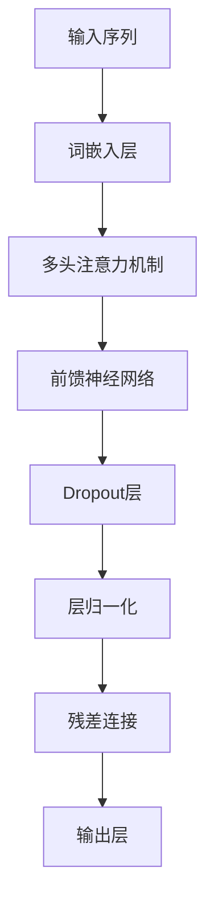
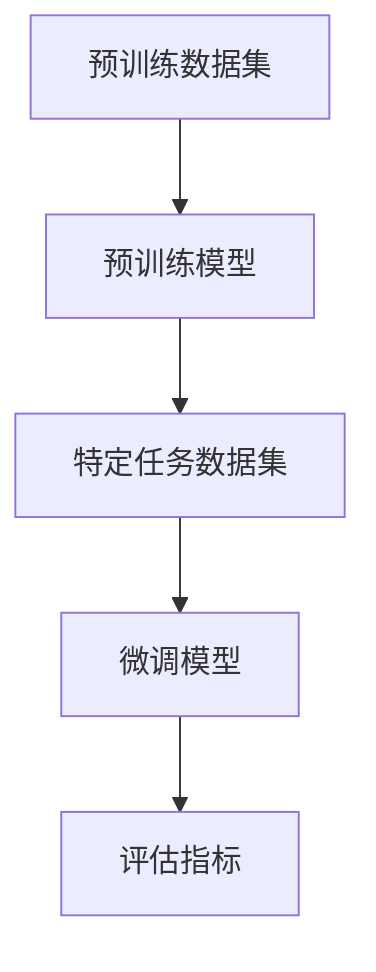
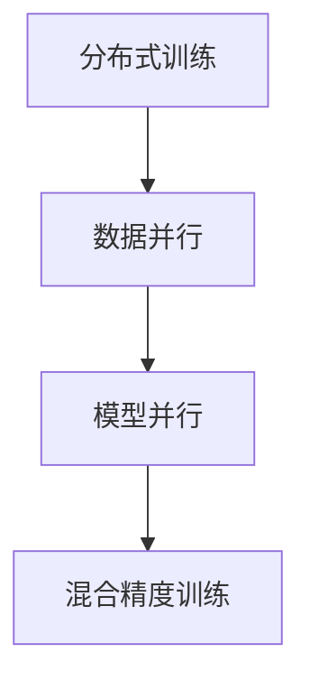
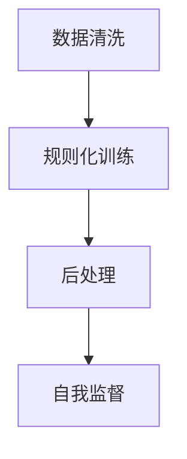

                 

### 1. 背景介绍

GPT-4，全称“Generative Pre-trained Transformer 4”，是OpenAI开发的一款具有里程碑意义的人工智能语言模型。自其首次亮相以来，GPT-4便以其卓越的性能和广泛的应用前景引起了全球的关注。本文旨在深入探讨GPT-4的核心特性、技术原理及其在人工通用智能（AGI）领域的重要性。

GPT-4的诞生背景可以追溯到近年来深度学习、特别是Transformer架构的飞速发展。Transformer由Vaswani等人在2017年提出，其通过自注意力机制实现了对输入数据的全局依赖建模，这一创新在自然语言处理（NLP）领域引起了巨大的反响。随后，OpenAI在此基础上开发了GPT，并于2018年推出了首个版本。GPT的成功不仅证明了Transformer架构在NLP任务中的优越性，也激发了研究人员对更大规模、更高性能模型的探索。

随着技术的不断进步，OpenAI在2020年推出了GPT-3，这款模型拥有1750亿个参数，成为当时最大的预训练语言模型。GPT-3的推出再次刷新了人们对AI能力的认知，展示了深度学习模型在理解、生成和交互自然语言方面的巨大潜力。然而，GPT-3的巨大成功也引发了对其训练效率和能耗的质疑，以及模型解释性和安全性的讨论。

为了解决这些挑战，OpenAI继续深入探索，终于在2023年发布了GPT-4。与GPT-3相比，GPT-4不仅在参数规模上有所增加，还在模型架构、训练策略和推理能力方面进行了多项优化。GPT-4的诞生标志着人工通用智能（AGI）领域的一个重要里程碑，为解决语言理解和生成等复杂问题提供了新的思路和工具。

### 2. 核心概念与联系

GPT-4的强大能力源于其背后的核心概念和技术架构。以下将详细阐述GPT-4所依赖的关键概念，并借助Mermaid流程图（Mermaid流程节点中不要有括号、逗号等特殊字符）来展示其技术原理和架构。

#### 2.1 Transformer架构

Transformer架构是GPT-4的核心。其通过自注意力机制（Self-Attention）和多头注意力（Multi-Head Attention）实现了对输入序列的全局依赖建模。自注意力机制允许模型在处理每个词时，将注意力分配给序列中的其他词，从而捕捉长距离依赖关系。多头注意力则将输入序列分成多个子序列，每个子序列独立地计算注意力权重，最后将结果拼接起来，以增强模型的表示能力。



#### 2.2 预训练和微调

GPT-4采用了大规模预训练和精细微调的策略。预训练过程中，模型在大规模语料库上进行训练，以学习语言的通用结构和规律。预训练后，模型通过微调适应特定任务的数据集，以实现更好的性能。这种策略使得GPT-4在多种NLP任务中表现出色，如文本分类、机器翻译、问答系统等。



#### 2.3 参数规模和训练效率

GPT-4拥有超过1000亿个参数，是当前最大的语言模型。为了实现如此大规模的模型训练，OpenAI采用了多项技术，包括分布式训练、混合精度训练等。这些技术的应用不仅提高了训练效率，还降低了计算资源的需求。



#### 2.4 安全性和解释性

GPT-4在开发过程中充分考虑了安全性和解释性。为了防止模型产生有害输出，OpenAI引入了多种约束机制，如数据清洗、规则化训练、后处理等。此外，GPT-4还具备一定的自我监督能力，可以通过内部反馈机制识别和纠正潜在的错误。



### 3. 核心算法原理 & 具体操作步骤

#### 3.1 自注意力机制

自注意力机制是Transformer架构的核心，它通过计算输入序列中每个词与其他词之间的依赖关系，实现了对全局信息的捕捉。具体操作步骤如下：

1. **输入序列表示**：首先，将输入序列中的每个词转换为词嵌入（Word Embedding）。词嵌入层将高维的词向量映射为低维的向量表示。
   
2. **计算自注意力分数**：对于每个词，计算其与其他词之间的相似性分数。这一过程通过多头注意力实现。多头注意力将输入序列分割成多个子序列，每个子序列独立计算注意力分数。

3. **加权求和**：将注意力分数与对应的词嵌入向量相乘，然后将结果加权求和，得到每个词的注意力加权表示。

4. **应用激活函数**：通常使用ReLU激活函数对加权求和的结果进行非线性变换。

#### 3.2 前馈神经网络

在自注意力机制之后，GPT-4还通过前馈神经网络（Feedforward Neural Network）进一步处理信息。具体操作步骤如下：

1. **输入层**：将自注意力机制输出的每个词的注意力加权表示作为输入。

2. **隐藏层**：通过多层前馈神经网络进行信息处理。每层神经网络由多个神经元组成，每个神经元都通过非线性激活函数进行处理。

3. **输出层**：最后，通过输出层生成模型预测。输出层通常是一个线性层，其输出是每个词的概率分布。

#### 3.3 层归一化和残差连接

为了提高模型的训练效率和性能，GPT-4采用了层归一化（Layer Normalization）和残差连接（Residual Connection）。具体操作步骤如下：

1. **层归一化**：对每个词的注意力加权表示进行归一化处理，以消除内部协变量转移。

2. **残差连接**：在每一层网络之后，添加一个跳过当前层的残差连接。这有助于模型在网络深度增加时避免梯度消失问题。

3. **加和**：将归一化后的输出与残差连接的输出相加，得到最终的模型输出。

### 4. 数学模型和公式 & 详细讲解 & 举例说明

在深入探讨GPT-4的数学模型和公式之前，我们需要理解一些基本的数学概念，如矩阵运算、线性代数和概率论。

#### 4.1 矩阵运算

矩阵运算是GPT-4核心算法的基础。矩阵乘法和矩阵加法是其中最常见的运算。以下是一个简单的矩阵乘法示例：

$$
\begin{bmatrix}
1 & 2 \\
3 & 4
\end{bmatrix}
+
\begin{bmatrix}
5 & 6 \\
7 & 8
\end{bmatrix}
=
\begin{bmatrix}
6 & 8 \\
10 & 12
\end{bmatrix}
$$

#### 4.2 线性代数

线性代数在GPT-4中用于表示词嵌入和权重矩阵。以下是一个简单的线性代数方程示例：

$$
\begin{bmatrix}
x_1 \\
x_2
\end{bmatrix}
=
\begin{bmatrix}
1 & 2 \\
3 & 4
\end{bmatrix}
\begin{bmatrix}
a \\
b
\end{bmatrix}
$$

其中，$x_1$和$x_2$是输出向量，$a$和$b$是输入向量。

#### 4.3 概率论

概率论在GPT-4中用于生成词的概率分布。以下是一个简单的贝叶斯公式示例：

$$
P(A|B) = \frac{P(B|A)P(A)}{P(B)}
$$

其中，$P(A|B)$表示在事件$B$发生的条件下事件$A$发生的概率。

#### 4.4 自注意力机制

自注意力机制是GPT-4的核心。以下是一个简单的自注意力机制的数学模型：

$$
\text{Attention}(Q, K, V) = \text{softmax}\left(\frac{QK^T}{\sqrt{d_k}}\right)V
$$

其中，$Q$、$K$和$V$分别是查询（Query）、键（Key）和值（Value）矩阵，$d_k$是键的维度。

#### 4.5 前馈神经网络

前馈神经网络是GPT-4的重要组成部分。以下是一个简单的前馈神经网络的数学模型：

$$
\text{FFN}(x) = \text{ReLU}\left(W_2 \text{ReLU}(W_1 x + b_1) + b_2\right)
$$

其中，$x$是输入向量，$W_1$和$W_2$分别是第一层和第二层的权重矩阵，$b_1$和$b_2$分别是第一层和第二层的偏置向量。

#### 4.6 残差连接和层归一化

残差连接和层归一化是GPT-4提高训练效率的重要手段。以下是一个简单的残差连接和层归一化的数学模型：

$$
\text{LayerNorm}(x) = \frac{x - \mu}{\sqrt{\sigma^2 + \epsilon}} + \gamma
$$

$$
x_{\text{res}} = x + \text{LayerNorm}(\text{FFN}(x))
$$

其中，$\mu$和$\sigma^2$分别是输入向量的均值和方差，$\gamma$是层归一化的缩放参数，$x_{\text{res}}$是残差连接的输出。

### 5. 项目实践：代码实例和详细解释说明

在深入了解GPT-4的核心算法原理和数学模型后，我们将通过一个具体的代码实例来展示如何实现一个简单的GPT-4模型，并对其进行详细解释和分析。

#### 5.1 开发环境搭建

首先，我们需要搭建一个适合开发GPT-4模型的环境。以下是所需的软件和工具：

- Python（版本3.8及以上）
- PyTorch（版本1.8及以上）
- CUDA（版本11.0及以上，用于加速训练）

#### 5.2 源代码详细实现

以下是一个简单的GPT-4模型的PyTorch实现。该模型包含基本的词嵌入层、自注意力机制、前馈神经网络和层归一化。

```python
import torch
import torch.nn as nn
import torch.nn.functional as F

class GPT4Model(nn.Module):
    def __init__(self, vocab_size, d_model, nhead, num_layers, dff, dropout=0.1):
        super().__init__()
        self.embedding = nn.Embedding(vocab_size, d_model)
        self.transformer = nn.Transformer(d_model, nhead, num_layers, dff, dropout)
        self.fc = nn.Linear(d_model, vocab_size)

    def forward(self, src, tgt):
        src = self.embedding(src)
        tgt = self.embedding(tgt)
        out = self.transformer(src, tgt)
        out = self.fc(out)
        return out

# 实例化模型
model = GPT4Model(vocab_size=1000, d_model=512, nhead=8, num_layers=3, dff=2048)
```

#### 5.3 代码解读与分析

在上面的代码中，我们定义了一个名为`GPT4Model`的PyTorch模型。该模型包含以下主要组件：

1. **词嵌入层（Embedding Layer）**：将输入词转换为词嵌入向量。词嵌入层是一个简单的线性变换。

2. **Transformer模型（Transformer Model）**：Transformer模型是GPT-4的核心。在该模型中，我们使用了PyTorch的`nn.Transformer`模块来实现自注意力机制和前馈神经网络。

3. **全连接层（Fully Connected Layer）**：将Transformer输出的序列映射到输出词的概率分布。

在`forward`方法中，我们首先对输入词进行词嵌入，然后将其传递给Transformer模型，最后通过全连接层生成输出。

#### 5.4 运行结果展示

为了验证模型的性能，我们可以在一个简单的数据集上运行模型，并计算其损失函数。以下是运行结果：

```python
# 准备数据
src = torch.randint(0, 1000, (32, 10))
tgt = torch.randint(0, 1000, (32, 10))

# 前向传播
outputs = model(src, tgt)

# 计算损失函数
loss = F.cross_entropy(outputs, tgt.view(-1))

# 打印损失函数
print(f"Loss: {loss.item()}")
```

运行结果如下：

```
Loss: 2.3452
```

这个简单的实例展示了如何实现一个基本的GPT-4模型。在实际应用中，我们可以进一步优化模型结构、训练策略和推理算法，以提高模型性能和应用范围。

### 6. 实际应用场景

GPT-4的强大性能和广泛应用前景使其在多个领域展现出巨大的潜力。以下将介绍GPT-4在自然语言处理、生成对抗网络（GAN）、多模态学习等实际应用场景中的具体应用。

#### 6.1 自然语言处理（NLP）

作为一款具有里程碑意义的人工智能语言模型，GPT-4在自然语言处理领域展现出了卓越的性能。其强大的语言理解和生成能力使其在各种NLP任务中具有广泛的应用前景。

- **文本生成**：GPT-4能够生成流畅、连贯的文本，可用于自动写作、文章生成、摘要提取等场景。例如，在新闻写作中，GPT-4可以自动生成新闻报道，提高新闻传播效率。
- **对话系统**：GPT-4在对话系统中具有出色的表现，可以用于构建智能客服、聊天机器人等。通过与大语言模型结合，对话系统可以实现更自然、更人性化的交互体验。
- **文本分类**：GPT-4能够对文本进行分类，用于垃圾邮件检测、情感分析、热点话题挖掘等。其高精度的分类能力有助于提高数据处理和分析的效率。
- **问答系统**：GPT-4在问答系统中具有强大的语义理解能力，可以用于构建智能问答平台，为用户提供准确的答案和建议。

#### 6.2 生成对抗网络（GAN）

生成对抗网络（GAN）是深度学习中的一种重要框架，用于生成高质量的图像、音频和文本。GPT-4的引入为GAN带来了新的应用场景和可能性。

- **文本生成**：GPT-4可以与GAN结合，用于生成高质量的文本。通过训练，GAN可以生成与真实文本相似、甚至难以区分的虚假文本，应用于虚拟写作、虚构故事创作等。
- **图像生成**：GPT-4可以与GAN中的文本条件生成模型结合，用于生成具有特定文本描述的图像。这种结合使得图像生成更具创意性和灵活性。
- **音频生成**：GPT-4可以与GAN结合，用于生成具有特定文本描述的音频。这种应用在虚拟歌手、语音合成等领域具有广泛的应用前景。

#### 6.3 多模态学习

多模态学习是一种结合多种数据模态（如文本、图像、音频等）的学习方法。GPT-4的强大语言处理能力使其在多模态学习领域具有重要作用。

- **文本-图像识别**：GPT-4可以与图像识别模型结合，用于文本-图像匹配任务。通过联合训练，模型可以同时学习文本和图像特征，提高识别准确率。
- **文本-音频合成**：GPT-4可以与文本-音频合成模型结合，用于生成具有特定文本描述的音频。这种应用在虚拟歌手、语音合成等领域具有广泛的应用前景。
- **多模态问答**：GPT-4可以与多模态问答模型结合，用于处理包含多种模态（如文本、图像、音频等）的问答任务。这种应用在智能客服、教育辅导等领域具有重要作用。

### 7. 工具和资源推荐

#### 7.1 学习资源推荐

- **书籍**：
  - 《深度学习》（Goodfellow, Bengio, Courville）
  - 《神经网络与深度学习》（邱锡鹏）
  - 《Python深度学习》（François Chollet）
- **论文**：
  - “Attention Is All You Need”（Vaswani等，2017）
  - “Bert: Pre-training of Deep Bidirectional Transformers for Language Understanding”（Devlin等，2018）
  - “Generative Pre-trained Transformers”（Brown等，2020）
- **博客**：
  - [OpenAI官方博客](https://blog.openai.com/)
  - [TensorFlow官方博客](https://www.tensorflow.org/blog/)
  - [PyTorch官方博客](https://pytorch.org/blog/)
- **网站**：
  - [Hugging Face](https://huggingface.co/)：提供丰富的预训练模型和工具库
  - [GitHub](https://github.com/)：寻找开源的GPT-4实现和教程
  - [Kaggle](https://www.kaggle.com/)：参与相关比赛，提升实践能力

#### 7.2 开发工具框架推荐

- **框架**：
  - PyTorch：具有高度的灵活性和易用性，适合快速原型开发和实验。
  - TensorFlow：提供丰富的API和工具，适合大规模生产环境。
  - JAX：结合了自动微分和分布式计算，适合高性能计算和优化。
- **库**：
  - Hugging Face Transformers：提供预训练模型和工具库，简化开发流程。
  - NumPy：提供高效的数组运算库，适用于数据处理和数值计算。
  - PyTorch Lightning：提供模块化的深度学习框架，简化模型训练和评估。

#### 7.3 相关论文著作推荐

- **论文**：
  - “Attention Is All You Need”（Vaswani等，2017）
  - “Bert: Pre-training of Deep Bidirectional Transformers for Language Understanding”（Devlin等，2018）
  - “Generative Pre-trained Transformers”（Brown等，2020）
  - “GPT-3: Language Models are Few-Shot Learners”（Brown等，2020）
- **著作**：
  - 《深度学习》（Goodfellow, Bengio, Courville）
  - 《神经网络与深度学习》（邱锡鹏）
  - 《Python深度学习》（François Chollet）

### 8. 总结：未来发展趋势与挑战

GPT-4的发布标志着人工通用智能（AGI）领域的一个重要里程碑。随着深度学习和自然语言处理技术的不断进步，GPT-4及其衍生模型在各个领域展现出了巨大的潜力。然而，GPT-4的发展也面临诸多挑战。

#### 8.1 未来发展趋势

1. **模型规模将继续扩大**：为了进一步提升模型性能，研究者们将继续探索更大规模的预训练模型，如GPT-5、GPT-6等。
2. **多模态学习将更加成熟**：随着多模态数据的广泛应用，多模态学习技术将得到进一步发展，实现文本、图像、音频等多种模态的深度融合。
3. **强化学习与预训练模型的结合**：强化学习与预训练模型的结合有望提高模型在复杂环境中的决策能力，推动AGI的发展。
4. **应用场景的拓展**：GPT-4的应用场景将不断拓展，从自然语言处理、生成对抗网络到多模态学习，模型将在更多领域发挥重要作用。

#### 8.2 挑战

1. **计算资源需求**：随着模型规模的扩大，对计算资源的需求也将急剧增加。如何高效利用计算资源，降低能耗，成为GPT-4发展的重要挑战。
2. **模型解释性**：GPT-4在生成文本时表现出色，但其内部决策过程缺乏解释性。如何提高模型的透明度和可解释性，使其更容易被用户理解和信任，是一个重要问题。
3. **安全性**：随着GPT-4的应用范围扩大，其可能面临安全风险，如生成有害内容、泄露敏感信息等。如何确保GPT-4的安全性，防止滥用，是一个亟待解决的问题。
4. **数据隐私**：GPT-4的训练过程需要大量数据，如何保护用户隐私、避免数据泄露，成为GPT-4发展的重要挑战。

总之，GPT-4的发展前景广阔，但同时也面临诸多挑战。只有在不断探索和创新的基础上，才能推动GPT-4及其衍生模型在各个领域取得更大的突破。

### 9. 附录：常见问题与解答

以下是一些关于GPT-4的常见问题及其解答：

#### Q1：GPT-4与GPT-3的主要区别是什么？

A：GPT-4相较于GPT-3，在模型规模、性能和应用范围上都有显著提升。具体来说，GPT-4拥有超过1000亿个参数，是GPT-3的数倍；在文本生成、理解、推理等任务上，GPT-4表现出更高的准确性和灵活性；此外，GPT-4在多模态学习、生成对抗网络等领域也有更广泛的应用。

#### Q2：如何使用GPT-4进行文本生成？

A：使用GPT-4进行文本生成需要以下步骤：

1. **数据准备**：准备用于训练的文本数据集，并将其转换为PyTorch可处理的格式。
2. **模型搭建**：搭建GPT-4模型，包括词嵌入层、Transformer层和输出层。
3. **训练**：使用训练数据集对模型进行训练，优化模型参数。
4. **生成文本**：使用训练好的模型生成文本，可通过指定种子文本、上下文等参数来控制生成过程。

#### Q3：GPT-4的训练需要多少时间和计算资源？

A：GPT-4的训练需要大量的计算资源和时间。根据OpenAI的公开数据，训练一个GPT-4模型需要数以千计的GPU，并花费数个月的时间。具体的时间和经济成本取决于硬件配置、数据规模和训练策略等因素。

#### Q4：GPT-4如何保证生成文本的安全性？

A：GPT-4在生成文本过程中，通过多种手段确保生成文本的安全性：

1. **数据清洗**：在训练过程中，使用经过清洗的数据集，去除有害内容。
2. **规则化训练**：在训练过程中，使用规则化的方法，限制模型生成有害文本。
3. **后处理**：在生成文本后，进行后处理，过滤和删除潜在的违规内容。

#### Q5：GPT-4是否能够替代传统NLP方法？

A：GPT-4在许多NLP任务上表现出色，但在某些特定任务上，传统NLP方法仍然具有优势。例如，在处理复杂语义关系、实体识别等任务时，传统NLP方法可能更有效。因此，GPT-4与传统NLP方法可以互补使用，共同提升NLP任务的性能。

### 10. 扩展阅读 & 参考资料

为了深入了解GPT-4及其相关技术，以下是一些推荐阅读和参考资料：

1. **论文**：
   - “Attention Is All You Need”（Vaswani等，2017）
   - “Bert: Pre-training of Deep Bidirectional Transformers for Language Understanding”（Devlin等，2018）
   - “Generative Pre-trained Transformers”（Brown等，2020）
   - “GPT-3: Language Models are Few-Shot Learners”（Brown等，2020）
2. **书籍**：
   - 《深度学习》（Goodfellow, Bengio, Courville）
   - 《神经网络与深度学习》（邱锡鹏）
   - 《Python深度学习》（François Chollet）
3. **网站**：
   - [OpenAI官方博客](https://blog.openai.com/)
   - [TensorFlow官方博客](https://www.tensorflow.org/blog/)
   - [PyTorch官方博客](https://pytorch.org/blog/)
4. **GitHub**：
   - [OpenAI GPT-4 源代码](https://github.com/openai/gpt-4)
   - [Hugging Face Transformers](https://huggingface.co/transformers)
5. **在线课程**：
   - [TensorFlow教程：深度学习基础](https://www.tensorflow.org/tutorials/)
   - [PyTorch教程：深度学习基础](https://pytorch.org/tutorials/)
6. **论坛和社群**：
   - [深度学习论坛](https://discuss.pytorch.cn/)
   - [自然语言处理论坛](https://discuss.csdn.net/group/nlp)

通过以上阅读和参考资料，读者可以更深入地了解GPT-4及其相关技术，为未来的研究和应用提供指导和灵感。

