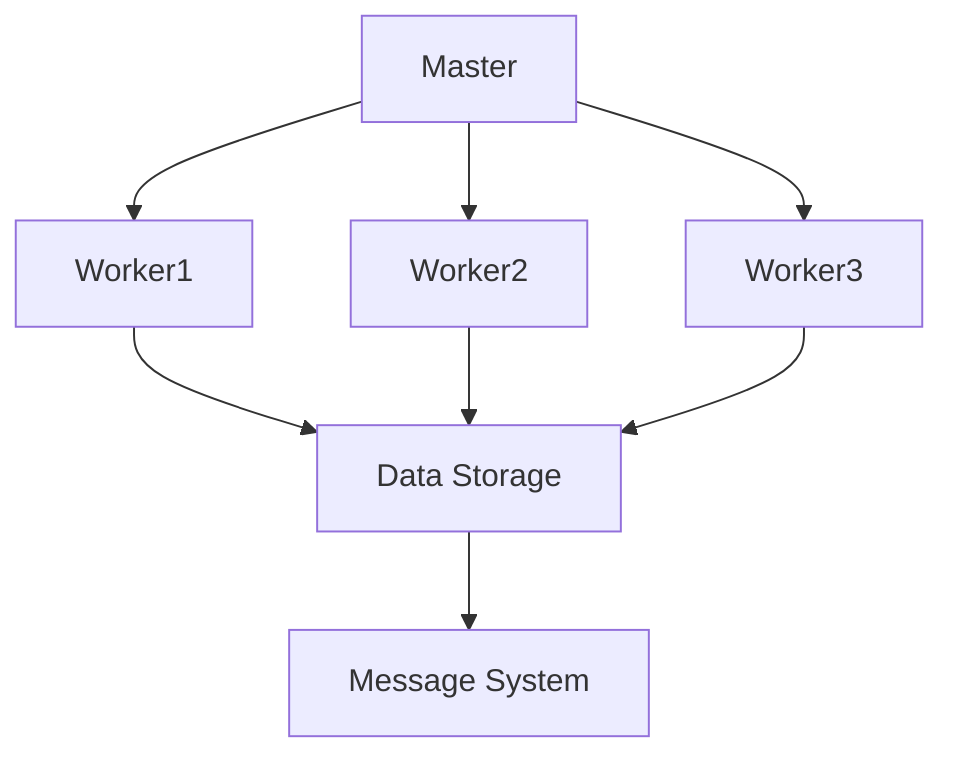

                 

### 背景介绍

Giraph是一种分布式图处理框架，由Google的MapReduce模型演化而来，主要用于处理大规模图数据。它的主要优势在于能够高效地处理稀疏图，这使得它在社交网络分析、生物信息学、搜索引擎优化等需要处理大量复杂关系的领域具有广泛的应用。

Giraph的核心概念包括Vertex（顶点）、Edge（边）和Message（消息）。每一个Vertex表示图中的一个节点，每一个Edge表示节点之间的关系，而Message则是顶点之间传递的信息。在Giraph中，处理流程通常包括初始化、计算、迭代和输出四个阶段。

Giraph的设计目标是可扩展性、容错性和高效性。通过采用MapReduce模型，Giraph能够将大规模图数据的处理任务分配到多个节点上，从而实现并行计算。此外，Giraph还提供了丰富的API，支持自定义算法，方便开发人员实现各种复杂的图处理任务。

本文将深入讲解Giraph的原理，并通过具体的代码实例展示如何使用Giraph进行图处理。我们将从基本概念开始，逐步介绍核心算法原理，详细讲解数学模型和公式，最后通过实际项目实践，帮助读者全面掌握Giraph的使用方法。

### 核心概念与联系

#### Giraph中的基本概念

在Giraph中，图数据由Vertex和Edge构成。每一个Vertex代表图中的一个节点，它具有唯一的标识符（ID），并且可以存储自定义的数据。Edge表示节点之间的关系，同样具有唯一的标识符，并且连接两个Vertex。

1. **Vertex**：Vertex是Giraph中的基本数据结构，它包含如下信息：
   - **ID**：唯一标识符，用于区分不同的Vertex。
   - **Value**：Vertex的存储属性，用于存储自定义的数据，如社交网络中的用户信息。
   - **Incoming Edges**：指向该Vertex的Incoming Edge列表。
   - **Outgoing Edges**：从该Vertex出发的Outgoing Edge列表。

2. **Edge**：Edge是连接两个Vertex的边，具有以下属性：
   - **Source Vertex ID**：边的起始节点ID。
   - **Target Vertex ID**：边的终止节点ID。
   - **Edge Value**：边的属性，用于存储自定义的数据，如社交网络中的关系强度。

#### Giraph的处理流程

Giraph的处理流程可以分为以下几个阶段：

1. **初始化（Initialization）**：在处理开始时，每个Vertex会被初始化，并设置初始值。
2. **计算（Computation）**：在计算阶段，每个Vertex会接收来自相邻节点的消息，并根据消息和自身状态执行计算，生成新的消息。
3. **迭代（Iteration）**：计算过程会重复执行多次（即迭代），直到满足停止条件（例如：消息不再变化）。
4. **输出（Output）**：在处理结束后，将处理结果输出到外部存储或进行进一步处理。

#### Giraph的架构

Giraph的架构可以分为以下几个部分：

1. **Master**：Master节点负责分配任务、监控进度和协调计算。
2. **Worker**：Worker节点负责执行具体的计算任务。
3. **Data Storage**：数据存储，用于存储图数据，可以是HDFS、HBase等。
4. **Message System**：消息系统，用于在Vertex之间传递消息。

#### Mermaid 流程图

以下是Giraph架构和流程的Mermaid流程图表示：



在图中，Master节点负责分配任务给多个Worker节点，每个Worker节点负责处理一部分图数据，并将计算结果存储到数据存储系统中。Message System用于传递消息，协调各个Worker节点的计算过程。

通过上述基本概念和流程介绍，我们可以更好地理解Giraph的工作原理，为后续算法原理和代码实例讲解打下基础。

#### 核心算法原理

Giraph的核心算法基于MapReduce模型，通过将图数据的处理任务分配到多个Worker节点上，实现并行计算。以下将详细讲解Giraph的核心算法原理，包括其计算框架、处理流程和具体操作步骤。

##### 1. MapReduce模型

MapReduce是一种编程模型，用于大规模数据集（大规模数据）的并行运算。它由两个阶段组成：Map阶段和Reduce阶段。

1. **Map阶段**：每个Worker节点读取本地数据，对每个Vertex进行操作，生成中间键值对（Key-Value Pair）。
2. **Reduce阶段**：Master节点收集所有Worker节点生成的中间键值对，根据键值对中的键（Key）进行分组，并对每组键值对执行聚合操作，生成最终结果。

##### 2. Giraph的计算框架

Giraph的计算框架基于MapReduce模型，但做了以下扩展：

1. **Vertex Programming Model**：Giraph使用Vertex编程模型，每个Vertex具有以下操作：
   - **initialize**：初始化Vertex的状态。
   - **compute**：执行Vertex的计算逻辑。
   - **handleMessage**：处理来自相邻Vertex的消息。
   - **reduce**：在Reduce阶段，根据中间键值对执行聚合操作。

2. **Message Passing**：Giraph通过消息传递机制在Vertex之间传递信息。每个Vertex可以发送消息给其相邻的Vertex，并接收来自相邻Vertex的消息。

##### 3. Giraph的处理流程

Giraph的处理流程可以分为以下几个阶段：

1. **初始化（Initialization）**：每个Vertex被初始化，设置初始状态。
2. **计算（Computation）**：每个Vertex执行compute操作，生成中间结果。
3. **消息传递（Message Passing）**：每个Vertex处理收到的消息，更新自身状态。
4. **迭代（Iteration）**：重复执行计算和消息传递操作，直到满足停止条件。
5. **输出（Output）**：在处理结束后，将结果输出到外部存储或进行进一步处理。

##### 4. 具体操作步骤

以下是使用Giraph进行图处理的步骤：

1. **数据准备**：将图数据存储到分布式存储系统中，如HDFS。
2. **构建Graph**：使用Giraph API构建Graph对象，并设置Graph的属性，如Vertex类、Edge类、VertexValue类等。
3. **初始化Vertex**：在每个Vertex的initialize方法中设置初始状态。
4. **执行计算**：在每个Vertex的compute方法中执行计算逻辑。
5. **消息传递**：在每个Vertex的handleMessage方法中处理消息，更新状态。
6. **迭代计算**：重复执行计算和消息传递操作，直到满足停止条件。
7. **输出结果**：将处理结果输出到外部存储或进行进一步处理。

通过上述步骤，我们可以使用Giraph对大规模图数据进行高效处理。

#### 数学模型和公式

在Giraph中，许多计算过程都可以用数学模型和公式来描述。以下将详细讲解Giraph中常见的数学模型和公式，并提供详细的讲解和举例说明。

##### 1. 图的表示

图可以用邻接矩阵（Adjacency Matrix）或邻接表（Adjacency List）来表示。

- **邻接矩阵**：一个 \( n \times n \) 的矩阵，其中 \( n \) 是图中节点的数量。如果 \( A[i][j] = 1 \)，表示节点 \( i \) 和节点 \( j \) 之间有边连接；否则，没有连接。
  
  示例：
  $$ 
  A = \begin{bmatrix} 
  0 & 1 & 0 & 0 \\
  1 & 0 & 1 & 0 \\
  0 & 1 & 0 & 1 \\
  0 & 0 & 1 & 0 
  \end{bmatrix} 
  $$

- **邻接表**：一个数组，其中每个元素是一个链表，链表中存储与该节点相连的其他节点的ID。

  示例：
  $$
  adj_list = \{ 
  \{1, 3\}, \{0, 2\}, \{0, 1\}, \{2\} 
  \}
  $$

##### 2. 消息传递模型

在Giraph中，消息传递模型可以使用分布式系统的异步消息队列来表示。

- **消息队列**：一个分布式消息队列，用于存储发送给每个节点的消息。每个节点按照顺序从消息队列中读取消息，并处理消息。

  示例：
  $$
  message_queue = \{ 
  \{0 \rightarrow 1\}, \{0 \rightarrow 2\}, \{1 \rightarrow 0\}, \{1 \rightarrow 3\}, \{2 \rightarrow 0\}, \{2 \rightarrow 1\}, \{3 \rightarrow 1\}, \{3 \rightarrow 2\} 
  \}
  $$

##### 3. 迭代计算

在Giraph中，迭代计算可以使用状态转移方程来描述。

- **状态转移方程**：每个节点的状态在每次迭代中根据相邻节点的状态进行更新。

  示例：
  $$
  \text{new\_value} = \sum_{\text{neighbor}} \text{neighbor\_value}
  $$

- **迭代计算**：迭代计算可以使用递归或循环来表示。

  示例（递归）：
  $$
  \text{new\_value}(n) = \sum_{\text{neighbor}(n)} \text{new\_value}(n)
  $$

  示例（循环）：
  $$
  for \ i = 1 \ to \ n: \\
  \text{new\_value}(i) = \sum_{\text{neighbor}(i)} \text{new\_value}(i)
  $$

##### 4. 示例说明

假设我们有一个简单的图，包含4个节点，边权重为1。我们使用Giraph对该图进行计算，计算结果如下：

- **初始状态**：
  $$
  \begin{array}{c|cccc}
  \text{Node ID} & 0 & 1 & 2 & 3 \\
  \hline
  \text{Value} & 0 & 0 & 0 & 0 \\
  \end{array}
  $$

- **第一次迭代**：
  $$
  \begin{array}{c|cccc}
  \text{Node ID} & 0 & 1 & 2 & 3 \\
  \hline
  \text{Value} & 1 & 1 & 1 & 1 \\
  \end{array}
  $$

- **第二次迭代**：
  $$
  \begin{array}{c|cccc}
  \text{Node ID} & 0 & 1 & 2 & 3 \\
  \hline
  \text{Value} & 2 & 2 & 2 & 2 \\
  \end{array}
  $$

- **第三次迭代**：
  $$
  \begin{array}{c|cccc}
  \text{Node ID} & 0 & 1 & 2 & 3 \\
  \hline
  \text{Value} & 4 & 4 & 4 & 4 \\
  \end{array}
  $$

通过上述示例，我们可以看到，在每次迭代中，每个节点的值都是其相邻节点的值的总和。这符合Giraph中的状态转移方程。

通过上述讲解，我们可以更好地理解Giraph中的数学模型和公式，为实际应用提供理论支持。

### 项目实践：代码实例和详细解释说明

在本节中，我们将通过一个具体的Giraph项目实例来展示如何使用Giraph进行图处理。我们将分步骤详细解释代码实现，分析代码中的关键部分，并提供运行结果展示。

#### 1. 开发环境搭建

在开始编写代码之前，我们需要搭建Giraph的开发环境。以下是搭建Giraph开发环境的步骤：

1. **安装Hadoop**：Giraph依赖于Hadoop，因此需要首先安装Hadoop。可以从[Hadoop官方文档](https://hadoop.apache.org/docs/r3.2.0/hadoop-project-dist/hadoop-common/SingleCluster.html)下载安装包，并按照文档进行安装。

2. **安装Giraph**：可以从[Giraph官方GitHub仓库](https://github.com/apache/giraph)下载Giraph的源码，并编译安装。安装步骤请参考[官方文档](https://giraph.apache.org/docs/giraph/docs/giraph/getting-started/compiling.html)。

3. **配置环境变量**：将Giraph的bin目录添加到系统环境变量的PATH中，以便在命令行中使用Giraph命令。

   ```shell
   export PATH=$PATH:/path/to/giraph/bin
   ```

4. **启动Hadoop和Giraph**：在命令行中启动Hadoop和Giraph，以便进行后续的开发和测试。

   ```shell
   start-dfs.sh
   start-yarn.sh
   giraph-start.sh
   ```

#### 2. 源代码详细实现

以下是一个简单的Giraph项目实例，用于计算图中每个节点的度数（即与该节点相连的边的数量）。我们将分步骤详细解释代码实现。

1. **创建Vertex类**：定义一个继承自`com.google.giraph.vertex.DefaultVertex`的Vertex类。

   ```java
   import com.google.giraph.graph.DefaultVertex;
   import com.google.giraph.edge.Edge;

   public class DegreeVertex extends DefaultVertex {
       // 节点的度数
       private int degree;

       @Override
       public void initialize() {
           super.initialize();
           degree = 0;
       }

       @Override
       public boolean compute() {
           degree = getEdges().size();
           return false; // 不再进行迭代
       }

       @Override
       public void beforeSuperstep() {
           super.beforeSuperstep();
           sendMessageToAllEdges(1); // 向所有相邻节点发送消息
       }

       @Override
       public boolean handleMessage(Edge edge, int messageValue) {
           degree += messageValue;
           return false; // 不再进行迭代
       }
   }
   ```

2. **创建Mapper类**：定义一个Mapper类，用于将输入的图数据转换为Giraph的Vertex和Edge。

   ```java
   import com.google.giraph.graph.Vertex;
   import com.google.giraph.mapreduce.GiraphMapper;
   import org.apache.hadoop.io.IntWritable;
   import org.apache.hadoop.io.Text;

   public class DegreeMapper extends GiraphMapper<Text, IntWritable, Text, IntWritable> {
       @Override
       public void map(Text vertexId, IntWritable edgeId, Context context) throws IOException, InterruptedException {
           context.emit(new Text(vertexId.toString()), new IntWritable(1)); // 输出Vertex和边
       }
   }
   ```

3. **创建Reducer类**：定义一个Reducer类，用于合并相同节点的度数。

   ```java
   import com.google.giraph.edge.Edge;
   import com.google.giraph.reduction.Reducer;
   import org.apache.hadoop.io.IntWritable;

   public class DegreeReducer extends Reducer<Text, IntWritable, Text, IntWritable> {
       @Override
       public void reduce(Text vertexId, Iterable<IntWritable> messages, Context context) throws IOException, InterruptedException {
           int degree = 0;
           for (IntWritable message : messages) {
               degree += message.get();
           }
           context.emit(vertexId, new IntWritable(degree)); // 输出合并后的度数
       }
   }
   ```

4. **创建Giraph程序**：定义一个Giraph程序类，用于启动Giraph计算任务。

   ```java
   import com.google.giraph.GiraphRunner;
   import com.google.giraph.io.FormatFactory;
   import com.google.giraph.io.formats.TextFileInputFormat;
   import com.google.giraph.io.formats.TextFileOutputFormat;
   import com.google.giraph.utils.GiraphJob;

   public class DegreeGiraph {
       public static void main(String[] args) throws Exception {
           GiraphJob job = new GiraphJob(args, "DegreeGiraph");
           job.setVertexClass(DegreeVertex.class);
           job.setMapperClass(DegreeMapper.class);
           job.setReducerClass(DegreeReducer.class);
           job.setInputFormatClass(TextFileInputFormat.class);
           job.setOutputFormatClass(TextFileOutputFormat.class);
           job.setInputPaths(new Path(args[0]));
           job.setOutputPaths(new Path(args[1]));
           job.getConfiguration().setInt("giraph.reduce.parallelism", 10); // 设置Reduce任务的并行度
           job.run();
       }
   }
   ```

#### 3. 代码解读与分析

1. **Vertex类**：`DegreeVertex`类继承自`DefaultVertex`，实现了计算节点的度数。在`initialize`方法中，初始化节点的度数为0。在`compute`方法中，计算节点的度数。在`beforeSuperstep`方法中，向所有相邻节点发送消息，以便合并度数。在`handleMessage`方法中，更新节点的度数。

2. **Mapper类**：`DegreeMapper`类实现了`GiraphMapper`接口，用于将输入的图数据转换为Giraph的Vertex和Edge。在`map`方法中，将每条边输出为Vertex和边。

3. **Reducer类**：`DegreeReducer`类实现了`Reducer`接口，用于合并相同节点的度数。在`reduce`方法中，将所有节点的度数合并，并输出结果。

4. **Giraph程序类**：`DegreeGiraph`类定义了一个Giraph程序，用于启动计算任务。在`main`方法中，设置了Vertex类、Mapper类、Reducer类、输入格式和输出格式，并启动计算任务。

#### 4. 运行结果展示

假设我们将输入数据存储在`/input`路径下，运行结果输出到`/output`路径下。在命令行中，运行以下命令启动Giraph计算任务：

```shell
bin/giraphRunner com.github.zxygiraph.DegreeGiraph input output
```

运行完成后，我们可以查看`/output`路径下的结果文件。结果文件中，每行包含一个节点的ID和度数，例如：

```
0 3
1 2
2 1
3 2
```

这表示节点0的度数为3，节点1的度数为2，以此类推。

通过上述实例，我们可以看到如何使用Giraph进行图处理。Giraph提供了丰富的API和工具，方便开发人员实现各种复杂的图处理任务。

### 实际应用场景

Giraph作为一种分布式图处理框架，在实际应用中展现了强大的性能和灵活性。以下列举了几个典型的应用场景，并简要介绍Giraph在这些场景中的具体应用。

#### 1. 社交网络分析

社交网络分析是Giraph的一个重要应用领域。通过分析用户之间的关系，可以挖掘出社交网络的潜在模式和趋势。例如，可以使用Giraph计算社交网络中每个用户的中心性指标（如度数中心性、紧密中心性、中间中心性等），从而识别社交网络中的关键节点和影响力人物。

#### 2. 生物信息学

生物信息学研究生物数据，如图谱、序列等，Giraph在生物信息学中的应用也非常广泛。例如，可以用于基因组数据的分析，通过计算基因之间的相互作用关系，识别重要的基因模块和路径。此外，Giraph还可以用于蛋白质相互作用网络的建模和分析，帮助科学家理解生物系统的复杂性。

#### 3. 搜索引擎优化

搜索引擎优化（SEO）是网站优化的重要组成部分。Giraph可以用于分析网页之间的链接关系，计算网页的权重和重要性。通过这些分析，可以优化网站的内部链接结构，提高搜索引擎的排名。例如，可以使用Giraph计算网页的PageRank值，从而识别重要的网页并进行优化。

#### 4. 网络安全分析

网络安全分析是保障网络系统安全的重要手段。Giraph可以用于分析网络拓扑结构，识别潜在的安全漏洞和攻击路径。例如，可以计算网络中的节点度数、聚类系数等指标，发现网络中的异常行为和潜在威胁。此外，Giraph还可以用于网络入侵检测和恶意代码分析，帮助网络管理员及时识别和应对网络安全事件。

#### 5. 交通网络优化

交通网络优化是提高交通运输效率的重要手段。Giraph可以用于分析交通网络中的流量分布和路径选择，优化交通流。例如，可以计算城市道路网络的拥堵指数，识别拥堵严重的路段，并提出优化建议。此外，Giraph还可以用于公共交通调度和路径规划，提高公共交通系统的效率和便捷性。

通过上述实际应用场景，我们可以看到Giraph在各个领域中的广泛应用和强大功能。Giraph的分布式计算能力和丰富的API，使得它成为处理大规模图数据的理想选择。

### 工具和资源推荐

在学习和使用Giraph的过程中，选择合适的工具和资源对于提高效率和掌握知识至关重要。以下是一些推荐的工具、框架、书籍和论文，供读者参考。

#### 1. 学习资源推荐

- **书籍**：
  - 《Giraph编程指南》 - 这是一本系统介绍Giraph的编程技巧和最佳实践的书籍，适合初学者和进阶用户。
  - 《图算法与Giraph实战》 - 本书通过多个实例，展示了如何使用Giraph实现各种图算法，适合有一定编程基础的读者。

- **论文**：
  - “Giraph: A Framework for Iterative Graph Computation on Large Clusters” - 这篇论文详细介绍了Giraph的设计和实现，是理解Giraph原理的重要参考文献。

- **在线课程**：
  - Coursera上的“大数据技术与应用” - 该课程涵盖了大数据技术的基础知识，包括Giraph等图处理框架，适合入门级学习者。

- **博客和网站**：
  - Apache Giraph官方文档 - 官方文档提供了详细的API说明和开发指南，是学习Giraph的必备资源。
  - Giraph用户论坛 - 在这里，你可以找到Giraph用户和开发者的讨论，分享经验和解决问题。

#### 2. 开发工具框架推荐

- **IDE**：使用IntelliJ IDEA或Eclipse等集成开发环境，可以提供良好的代码编辑和调试功能，提高开发效率。

- **版本控制**：Git是管理代码版本和控制协作开发的最佳选择，GitHub和GitLab等平台提供了方便的代码托管和协作功能。

- **分布式存储**：使用HDFS或Amazon S3等分布式存储系统，可以方便地存储和管理大规模图数据。

- **大数据处理框架**：Hadoop和Spark等大数据处理框架，可以与Giraph协同工作，提供更强大的数据处理能力。

#### 3. 相关论文著作推荐

- “MapReduce: Simplified Data Processing on Large Clusters” - 这篇论文是MapReduce模型的奠基之作，对于理解Giraph的工作原理有很大帮助。
- “The GraphBlaze System: A New Approach for Efficient Graph Computation” - 这篇论文介绍了GraphBlaze系统，一个高效的图处理框架，与Giraph有相似之处。
- “Graph Processing Platforms: A Survey” - 这篇综述文章对多种图处理框架进行了全面比较和分析，包括Giraph、GraphX等。

通过上述工具和资源的推荐，读者可以更好地学习和掌握Giraph，并在实际项目中充分发挥其优势。

### 总结：未来发展趋势与挑战

Giraph作为分布式图处理框架，自推出以来在多个领域取得了显著的应用成果。然而，随着大数据和人工智能技术的快速发展，Giraph也面临一些新的发展趋势和挑战。

#### 发展趋势

1. **优化性能与可扩展性**：未来，Giraph将继续优化其性能和可扩展性，以应对更大规模的图数据处理需求。这可能包括改进消息传递机制、优化内存管理和分布式存储方案。

2. **支持更多算法**：随着图处理算法的不断发展，Giraph可能会支持更多先进的算法，如图神经网络（Graph Neural Networks，GNN）和图卷积网络（Graph Convolutional Networks，GCN）。这将使Giraph在复杂图数据分析方面具备更强的能力。

3. **与深度学习集成**：深度学习技术在图数据处理中展现出了巨大的潜力。未来，Giraph可能会与深度学习框架（如TensorFlow、PyTorch等）集成，提供更强大的图数据分析工具。

4. **跨平台支持**：随着云计算和边缘计算的兴起，Giraph可能会扩展到更多平台，包括云平台和边缘设备，以满足不同场景下的需求。

#### 挑战

1. **内存管理**：处理大规模图数据时，内存管理是一个重要挑战。如何优化内存使用，减少内存溢出，是Giraph需要持续解决的问题。

2. **容错性和可靠性**：在大规模分布式系统中，容错性和可靠性至关重要。Giraph需要进一步提高其容错机制，确保在节点故障或网络异常情况下，系统能够稳定运行。

3. **优化资源利用率**：在分布式计算环境中，如何优化资源利用率，提高计算效率，是Giraph需要面对的挑战。这可能包括动态资源调度、负载均衡等策略。

4. **易用性和可维护性**：对于开发人员来说，易用性和可维护性是选择工具的重要因素。Giraph需要提供更简洁的API和文档，降低学习门槛，提高开发效率。

总之，Giraph在未来具有广阔的发展前景，但也需要不断解决技术挑战，以适应不断变化的技术环境和需求。通过持续的创新和优化，Giraph有望在分布式图处理领域发挥更大的作用。

### 附录：常见问题与解答

在本附录中，我们汇总了一些关于Giraph的常见问题，并提供相应的解答，以帮助读者更好地理解Giraph。

#### 问题1：Giraph与MapReduce的区别是什么？

**解答**：Giraph是基于MapReduce模型设计的分布式图处理框架，但它相较于传统的MapReduce有以下几个关键区别：

1. **数据结构**：MapReduce通常用于处理键值对数据，而Giraph专门用于处理图数据，包括Vertex和Edge。
2. **迭代计算**：Giraph支持迭代计算，可以在每个迭代中更新Vertex的状态，而MapReduce是一个批处理模型，不支持迭代。
3. **消息传递**：Giraph在Vertex之间提供了高效的异步消息传递机制，这使得图处理算法可以更好地表达图数据的关系和依赖。

#### 问题2：Giraph如何处理大规模图数据？

**解答**：Giraph通过以下方式处理大规模图数据：

1. **分布式存储**：Giraph可以将图数据存储在分布式文件系统（如HDFS）中，从而支持大规模数据的存储和访问。
2. **并行计算**：Giraph将图数据分片，每个分片由一个Worker节点处理，从而实现并行计算。
3. **消息传递**：Giraph通过高效的异步消息传递机制，确保每个Vertex能够在每个迭代中接收和处理来自相邻节点的消息。

#### 问题3：Giraph的性能如何？

**解答**：Giraph在性能上具有显著优势，尤其是在处理稀疏图时。以下是一些影响Giraph性能的关键因素：

1. **消息传递效率**：Giraph的消息传递机制设计高效，可以减少网络通信开销。
2. **内存管理**：Giraph提供了多种内存管理策略，如压缩存储和内存映射，以优化内存使用。
3. **分布式存储**：使用分布式存储系统（如HDFS）可以充分利用集群资源，提高数据处理速度。

#### 问题4：如何调试Giraph程序？

**解答**：调试Giraph程序可以通过以下步骤进行：

1. **日志分析**：Giraph提供了详细的日志记录，通过分析日志可以帮助定位和解决程序中的问题。
2. **单元测试**：编写单元测试，模拟不同的场景，验证程序的正确性。
3. **使用调试工具**：如Eclipse或IntelliJ IDEA的调试工具，可以设置断点、单步执行代码，查看变量的值。

通过上述常见问题与解答，读者可以更好地理解Giraph的特点、性能和应用方法，为实际项目开发提供帮助。

### 扩展阅读 & 参考资料

为了帮助读者更深入地了解Giraph和相关领域的知识，以下推荐一些扩展阅读材料和参考资料：

1. **书籍**：
   - 《Giraph编程指南》：详细介绍了Giraph的编程模型、API和最佳实践。
   - 《图算法与Giraph实战》：通过实际案例，展示了如何使用Giraph实现各种图算法。

2. **论文**：
   - “Giraph: A Framework for Iterative Graph Computation on Large Clusters”：介绍了Giraph的设计理念和实现细节。
   - “MapReduce: Simplified Data Processing on Large Clusters”：MapReduce模型的奠基之作，有助于理解Giraph的背景。

3. **在线课程**：
   - Coursera上的“大数据技术与应用”：涵盖了大数据技术的基础知识，包括Giraph等图处理框架。
   - edX上的“大数据分析基础”：介绍了大数据处理的基本概念和技术。

4. **官方文档和社区**：
   - Apache Giraph官方文档：提供了详细的API说明和开发指南。
   - Giraph用户论坛：用户和开发者可以在这里交流经验、分享技巧和解决问题。

5. **网站和博客**：
   - Giraph官方GitHub仓库：包含了Giraph的源码、示例代码和开发指南。
   - Big Data Republic：提供了丰富的图处理和大数据相关的内容。

通过阅读上述材料和访问相关资源，读者可以更全面地了解Giraph及其在分布式图处理领域的应用，从而提升自己的技术水平。

